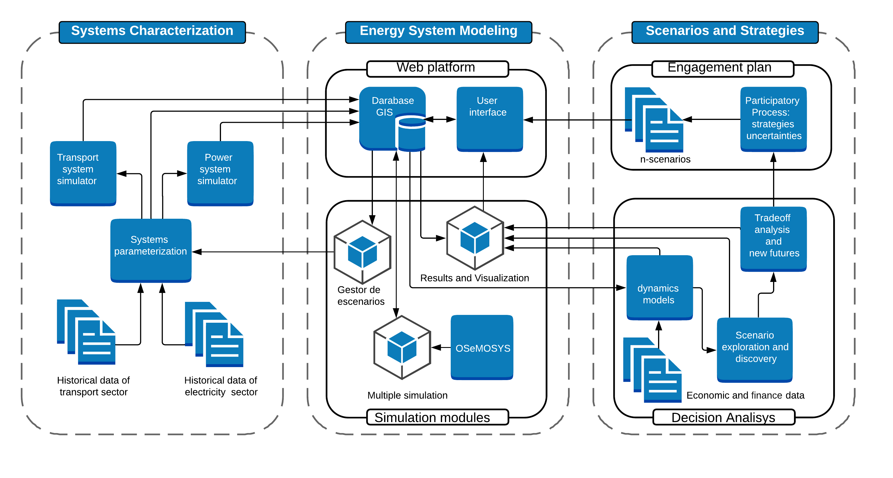
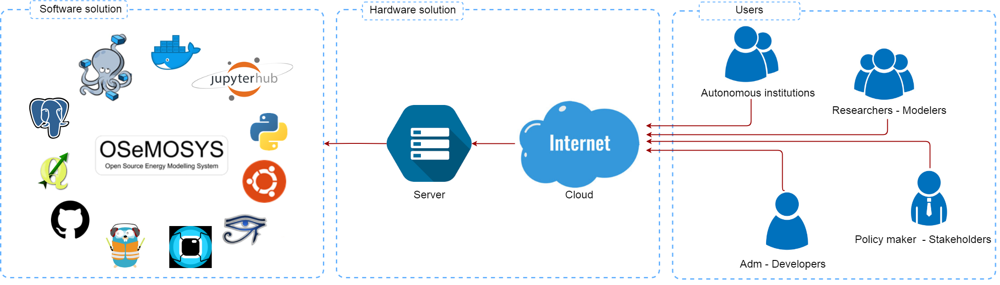

.. Title:

The OSeMOSYS – CR model
=====================================

Introduction
------------------------------------

Countries around the world committed in the Paris Agreement to reduce their greenhouse gas (GHG) emissions aiming to fight climate change. Under the United Nations Framework Convention on Climate Change (UNFCCC), the countries would progressively strengthen their strategies and present them in their Nationally Determined Contributions (NDC). These collective efforts towards sustainable low-carbon development (i.e., growing economic with reduced GHG emissions) are produced based upon principles such as fairness, transparency, collaboration, and the financial mechanism to promote a realistic long-term transformation of the countries consistent with their different national circumstances.
 
In order to accomplish a systematic quantitative evaluation of these strategies, the elaboration of national models and the integration between governments, productive economic sectors, civil society, and academic institutions are essential. From this perspective, the Deep Decarbonization Pathways Project (DDPP) and its analytical framework constitute a great example of how countries should combine critical elements of the global Integrated Assessment Models (IAMs) and national bottom-up modeling literature to provide a structured global context for policy-relevant analyses of national low greenhouse gas (GHG) emission development strategies [1].

Costa Rica is part of this collaborative global scientific community, within the framework of the Latin American and Caribbean version of the project called DDPP-LAC. The country is represented by researchers from the University of Costa Rica (UCR), the Royal Institute of Technology (KTH) and the Costa Rican Directorate for Climate Change (DCC). The main objective of the team is to establish the pathways to achieve the country's absolute and unconditional NDCs, which are compatible with the global 2°C target and promotes a more ambitious strategy to reach a net-zero emissions system by 2050, consistent with the 1.5°C temperature limit established in the Paris Agreements.

In this context, this transformation is not new for this small Latin American country, which decided to use renewable sources to generate electricity since the middle of the last century and to reverse the process of deforestation since the beginning of the 1980s. Nowadays, it has an annual average of 98.5% in the production of renewable electricity [2], 52% of forest cover [source], and a competitive economic growth, represented by the annual increase of 3.2% of its GDP [4].
 
However, although significant progress has been made, there are still many challenges to face, especially in the energy system. According to national studies such as the energy balance and the GHG inventory, the next step towards the deep decarbonization concerns to the transport sector. For instance, in 2015, the transport sector was described as "responsible for 66% of hydrocarbon consumption and 54% of the country's CO2 emissions" [5]. The high consumption of fossil fuels is a consequence of disorganized urban growth, the deficiency in public transport systems and the expansion of the private fleet, which causes severe problems on mobility, economic competitiveness, air pollution, health, and quality of life. 

This work begins with a strong motivation to provide an integrated solution to the previous problem. In this paper, the team presents a methodological structure to analyze the technological transition and its potential benefits for society. Base on the DDPP-LAC philosophy, the proposal combines engineering, economics, politics, and social sciences within an open source concept to transform a vision of deep uncertainty into plausible development trajectories. In line with the predominant role of Costa Rica as a world leader in the fight against climate change, this work can provide a reliable reference in terms of how to study the decarbonization process, especially for developing countries.

Scientific contribution
~~~~~~~~~~~~

This paper has a methodological contribution that provides a novel framework to develop optimal and robust energy planning according to the imperative necessity to decarbonize the countries' economies. Challenges such as the integration of stakeholders, policymakers and the academic world into the process of creating coherent and responsible scenarios, the necessary balance between the optimal and robustness solutions, the implicit socio economic implication resulting from decarbonization and the creation of the linking top-down and bottom-up national models are some of the requirements of the problem to be solved. In this context, the correct combination between the different computational tools created for specific needs with specialized methodologies of analysis is the heart of the general idea developed, which is implemented in a harmonized computer environment, oriented to the management of data, modeling, simulation, communication, and visualization of results. This work has been built under the principles of transparency, reproducibility and open source development according to recent trends [6-10] and has the opportunity to become an instrument to guide the efforts towards the deep decarbonization.

Structure of the paper
~~~~~~~~~~~~
The rest of this paper proceeds as follows: Section 2 introduces the proposed three-stage analytical framework to establish an overview of design concepts, general modules, and data flow. It includes a brief description of the previous energy models used in Costa Rica and the transitions made by the country towards open source developments. Section 3 presents the algorithms adopted for data processing and parameterization. In addition, simulators for the transport sector and power systems are described in detail, and it is discussed how the effective links between these tools and energy modeling can improve the results through the incorporation of operational conditions. Section 4 is devoted to explaining the conception of energy modeling, the scenario manager for creating multiple simulations under the combination of variables and their connections with the relational geographic database, which provides a powerful and different way of storage and optimize the data management. The design principles of the web platform and the interface are considered in this section, describing the benefits of this type of service for development and communication. Section 5 explains how to incorporate the opinion of stakeholders and policymakers to formulate and asset scenarios considering the dynamic of social economics effects and the deep uncertainty of the strategies. It combines the classic participatory backcasting process and the innovative, robust decision-making methodology (RDM), in which a computational experiment executes  thousands, the vulnerability, and the trade-off are analyzed and the strategies, are mapping with an adaptive decision tree. Concluding remarks and suggestions for future work are discussed in section 6. 

Framework
------------------------------------

The Costa Rican government has made significant efforts in the last decade to support the long-term energy planning process. In this period, tools such as The Integrated MARKAL-EFOM System (TIMES), the Long Range Energy Alternatives Planning System (LEAP) and Computable General Equilibrium Model (CGEM) have provided progress in the right direction. Currently, the country is promoting a transcendental digital transformation to improve processes and decision making, based on the principles of transparency, consistency, comparability, and precision suggested by the UNFCCC. This important initiative is being developed under the name of the National Metrics System for Climate Change (SINAMECC), which promotes the use of open-source software due to the versatility, flexibility, expansion possibilities and local support provided by the academic and governmental institutions while avoiding vendor lock-in. 

In this context, the Open Source Energy Model System (OSeMOSYS), presented in [11], represents a good alternative for the country. It is an open-source development, accessible and transparent, that offers excellent potential for use in the countries or at the continental level. Some reference studies that can be found in [12-15]. For Costa Rica, the use of this model is not only congruent with the current focus, but it also allows it to be part of an international community of researchers that seek to build human capacities and applying open-source tools to the sustainable development knowledge.

The development of the open-source analytical framework to study the decarbonization pathways in Costa Rica began with a philosophical approach, to be critical and follow logical procedures to connect strategies with socioeconomic effects. Furthermore, It was thinking about having the ability to transcend simple human mental mapping and provide a broader assessment of possible futures in a universe of solutions. Taking into account, the inherent transformation in the transport and electricity industries to achieve sustainable development and the complex dynamics resulting from their integration, suggest a more specialized approach in this line, especially to integrate information from operative schemes into the planning process. The general idea is captured in Figure 1, that is divided into several modules, each of which performs a different part of the whole task. 

According to [16], some of the open-source tools available are mature enough for serious use and revealed that more than half of the tools in the open energy modeling initiative are based on Python. Based on this information and the knowledge of the comprehensive standard library that it contains, this programming language was selected to create the project. This decision provides the possibility to incorporate programs,  taking into account the properties of computational flexibility, maintenance, stability, and scalability.  

The project researchers have designed this innovative toolkit entirely in open source software, such as OSeMOSYS, Python, QGIS, PostgreSQL, Docker, Docker Compose, GitHub, QGIS, GISQUICK, Sphinx. Linux - Ubuntu, Pandapower, and MATSim. The purpose of each general module is described below.

  Figure 1 : A proposal “open-source modeling framework for energy planning”

• Systems characterization: This module contains functionalities related to the acquisition and preparation of data for energy optimization. It includes two soft-links with specific simulators for transport and electrical systems that capture the impact of short-term variability and demand behavior, such as the implications for system operation and investments.

• Energy System Modeling: The preprocessed information is passed to a geospatial database that contains stored data and an interface for the users based on the web server. A second sub-module is connected to this system for a recurrent or iterative simulation which optimizes the energy system considering various scenarios and its combinations. The proposed include web platform for the modeling and simulation of the national energy systems.

• Scenario and Strategies: The model requires a second external source of information that is developed in the process of participatory consultation with stakeholders and policymakers. Once the optimization process is carried out, the co-benefits and the socioeconomic effects are evaluated with a dynamic model. Finally, the information is sent to the Robust Decision Making (RDM) module, which use of exploratory models, scenario discovery, and compensation analysis to establish an adaptive decision tree with hierarchical strategies. At the end of the analysis, the results are communicated to the stakeholders and policymakers to close the loop and generate an iterative process of consensus. 
 
Progressively, this analysis framework will grow, and the interconnection between energy with water, land use, and climate change will be established to achieve a general CLEWs. Finally, to support the transparency of the model, the documentation, the knowledge transfer,
and to allow different teams to collaborate, a Git repository was implemented. This action could potentially serve as a platform for future developments. 

System characterization
------------------------------------

Data processing and parameterization
~~~~~~~~~~~~

Power system simulator
~~~~~~~~~~~~

Transport demand simulator
~~~~~~~~~~~~

Energy modelling and simulation platform
------------------------------------

Climate change strategies require a logic process in which the modelers take significant quantities of data to create information for policymakers. In general, the construction of energy models begins with a simple representation that captures the general behavior of the systems and progressively grows to study more complex situations by increasing granularity, incorporating entities and resources or new algorithms. Likewise, the computational requirements also increase, and the need to incorporate new people with different knowledge and perspectives becomes a necessity. In this context, traditional desktop systems represent a limiting factor for researchers with respect to collaborative work, simulation times, and the common use of data. The alternative to solve this problem is to take advantage of cloud computing to implement web-based platforms for modeling and simulation. In [43] several advantages of this web service such as accessibility, scalability, maintenance, controlled access, and licensing are presented. 

Web-based platform 
~~~~~~~~~~~~

To design a computer system, it is usual to start with the abstraction of a universe to be a model, then it is necessary to define paradigms and methodologies, establish the infrastructure and software, create an architecture and finally implement it in a modular way. This approach  could be a potentially significant contribution to the scientific work in the field of energy system analysis.Indeed,  Energy Modelling Platform for Europe (EMP-E) presented contributions in this way [44]. Other projects such as the OnSSET [45] community can also be highly inspiring due to their conceptual design and impact on people's lives. 

  Figure 3: Modeling and Simulation Web Platform

In figure [3], we present our conceptual framework for the modeling and simulation web platform, based on open source software. This is a multi-user system for creating and executing very detailed energy models or large case studies that require multiprocessing. We can concentrate modelers, new researchers and the government collaborators who provide technical support, in a  unique computer environment available on the web. The project also contributes to transparency, open data, sharing documentation and is an excellent tool for knowledge transfer, training, and international cooperation. Finally, this type of web services offers great opportunities for the visualization and communication of results for policymakers and stakeholders under security protocols to guarantee data validation. 

For this case, the minimum hardware requirements consist of a simple system of two redundant servers with output to a truncal network. There are a production server and another dedicated to the development of tests and backup. Regarding software, the recent advances in web service suggest the server based on Linux - Ubuntu  [46] is extremely powerful and Docker [47] is considering the best option due to its flexibility,  portability, and efficiency in the use of available resources compared to a virtual machine. For documentation, there are many options, but we consider that the combination between Sphinx  [48] and the Github [49] repository quite convenient. 

Related to modeling an appropriate structure to manage the input and output data must be developed to guarantee the integrity rules regarding the syntaxis, relations, and semantics of data and to maximize the processing steps, simulations,  storing, visualization, and communication of results. For this task, a spatial relational database using Postgresql [50] and QGIS [51] is an excellent option, not only because of the possibility of concentrating a large amount of georeferenced information, such as the historical time series of the power systems  operation, the hydrology of the country, the wind speeds, solar radiation, the evolution of vehicles fleet, catalogs of technologies, consumption patterns of people, speed of the road, among others, but by the ability to manage the parameters of the energy model for the generation and analysis of multiple scenarios and the query builder. A compliment for the visualization and sharing projects is GISQUICK [52], which has a great performance to expose information through the web. Finally, for using OSeMOSYS in a  multi-user environment,  we found an extraordinary possibilities with JupyterHub [53]. Indeed [54] present an explanation of why this particular tool  has exploded in popularity over the past couple of years.

Energy modeling 
~~~~~~~~~~~~

Engagement plan and Robust Decision Making 
------------------------------------

Backcasting participatory
~~~~~~~~~~~~

Robust Decision Making 
~~~~~~~~~~~~

System Dynamics 
~~~~~~~~~~~~

Decarbonization plans 
~~~~~~~~~~~~

Conclusions and Outlooks 
------------------------------------

Reference
------------------------------------

