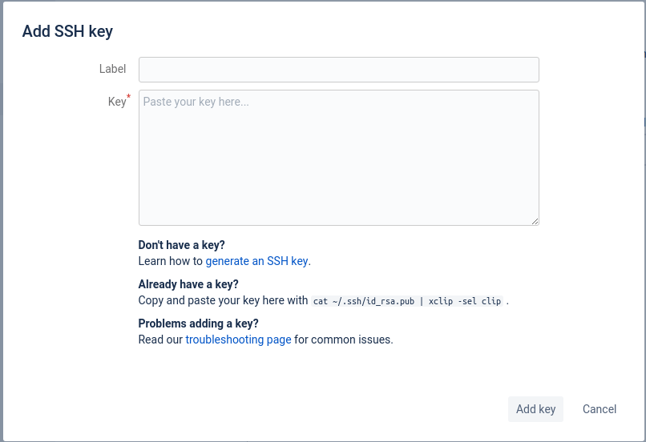
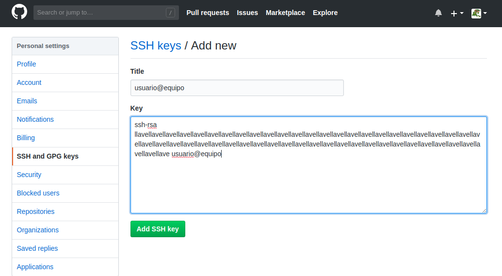

.. _linuxsteps-primeros_pasos:

Primeros pasos en Linux para trabajar
=====================================

En este apartado se detallará algunos de los pasos básicos para condicionar una
instalación desde cero de Ubuntu, sistema operativo en el cual se estará trabajando
en el desarrollo de este y otros proyectos. Entre lo más elemental se instalarán
los compiladores, herramientas de documentación y bibliotecas necesarias para
trabajar. Lo primero que se recomienda es actualizar el sistema una vez instalado.

.. code-block:: bash

  sudo apt update
  sudo apt dist-upgrade

Con lo anterior listo, podemos empezar a trabajar en la instalación de paquetes
y demás ajustes.

.. _linuxsteps-llaves_ssh:

Llaves SSH para repositorios
----------------------------

SSH (Secure SHell), es un protocolo de comunicación cifrado que permite la conexión
remota a sistemas en una LAN o en Internet en general, de manera segura y confiable.
Este sistema funciona mediante el uso de un llavero con dos llaves: una pública
la cual se distribuye entre los sistemas de confianza para verificar el acceso, y
una privada para validar la llave con la cual se desea accesar al sistema. SSH también
permite el acceso mediante contraseña, pero el uso de llaves facilita mucho la gestión
y la comunicación.

Podemos instalarlo de la siguiente forma:

.. code-block:: bash

  sudo apt update
  sudo apt install ssh

Para generar un llavero, hacemos lo siguiente:

.. code-block:: bash

  ssh-keygen -t rsa #genera una llave RSA, el cual es un tipo de cifrado.

El par de llaves generado se guarda en $HOME/.ssh/.

.. _linuxsteps-ajustes_ambiente:

Ajustes de ambiente
-------------------

Hay unos ajustes de ambiente que se deben hacer inicialmente para efectos de
trabajo. Agregamos las siguientes líneas al archivo .bashrc ubicado en el Home ($HOME/.bashrc)

.. code-block:: bash

  .
  .
  .
  PS1="[\u@\h \W]\$ "
  export PATH=/home/wivill/git/scripts:$PATH
  source /etc/profile.d/modules.sh

Una vez hecho lo anterior, recargamos el archivo .bashrc para que actualice las variables
de entorno modificadas.

.. code-block:: bash

  source .bashrc

Lo anterior modifica el aspecto de la terminal para permitir un despliegue más
amigable de la información del directorio actual, y relega el despliegue del
path absoluto al comando pwd. El export agrega a la variable PATH la cual almacena
las rutas de los ejecutables, una ruta adicional con scripts que nos facilitan
el trabajo, como actualizar los repositorios o accesar más fácilmente a equipos
remotos.

.. _linuxsteps-ajustes_ambiente-dns:

Servidor DNS
~~~~~~~~~~~~

En ocasiones, los DNS asignados por defecto no son suficientes para identificar
algunos sitios web de interés. Para corregir este pequeño detalle, agregamos un
DNS adicional al archivo /etc/resolv.conf

.. code-block:: bash

  nameserver 8.8.8.8

Luego de esta modificación, reiniciamos el servicio de red.

.. code-block:: bash

  systemctl restart networking

.. _linuxsteps-repos_git:

Repositorios git
----------------

Antes de proceder a clonar los repositorios git a partir de los cuales vamos a
trabajar, debemos exportar las llaves SSH a los sitios web que albergan los repositorios,
como lo son github, gitlab y bitbucket.

Lo primero es copiar el contenido de la llave pública, el cual se puede desplegar
de la siguiente forma:

.. code-block:: bash

  cat ~/.ssh/id_rsa.pub | xclip -sel clip

Lo anterior copia al portapapeles el contenido del archivo, listo para pegarlo
en donde corresponda.

.. _linuxsteps-fig-00_bitbucket:

  Pantalla para agregar llaves SSH en Bitbucket.

.. _linuxsteps-fig-01_github:

  Pantalla para agregar llaves SSH en Github.

.. _linuxsteps-fig-02_gitlab:

.. figure:: img/linuxsteps/ssh_gitlab.png
  :align: center
  :width: 600 px
  :alt: Agregar llave SSH en Gitlab.

  Pantalla para agregar llaves SSH en Gitlab.

Una vez agregadas las llaves, podemos empezar a clonar los repositorios.

.. code-block:: bash

  cd ~
  mkdir git
  cd git
  git clone git@github.com:CNCA-CeNAT/Module_Build_Scripts.git
  git clone git@gitlab.com:wivill/my_exercises.git
  git clone git@gitlab.com:wivill/scripts.git
  git clone git@gitlab.com:wivill/proyecto_eper.git
  git clone git@github.com:KTH-dESA/OSeMOSYS.git
  git clone --recursive https://github.com/qgis/qwc2-demo-app.git

En caso de no reconocer el comando git, procedemos a instalarlo y repetimos lo anterior.

.. code-block:: bash

  sudo apt install git

.. _linuxsteps-install_packs:

Instalación de paquetes
-----------------------

Entre los paquetes que se desea instalar se cuenta con herramientas de compilación
y documentación, editores de texto, entre otros.

.. code-block:: bash

  sudo apt update
  sudo apt install cmake-curses-gui npm xclip build-essential make cmake gcc g++ gfortran texlive-full doxygen sphinx git terminator inkscape vim emacs gimp libcurl4-openssl-dev libsqlite3-dev python-gpg python3-gpg dh-autoreconf tcl-dev pylama python-sphinx-rtd-theme python3-sphinx-rtd-theme python-pip python3-pip pandoc
