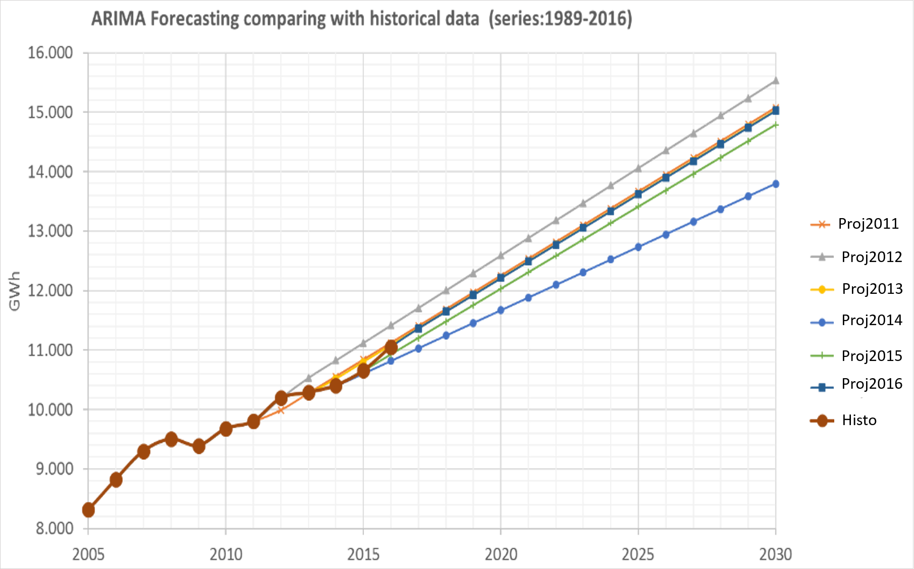
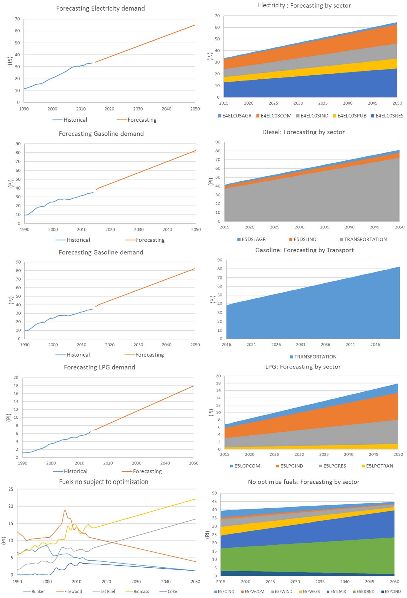
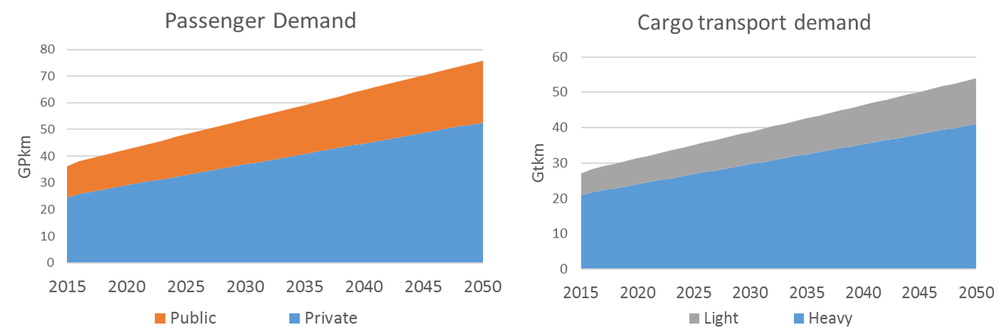
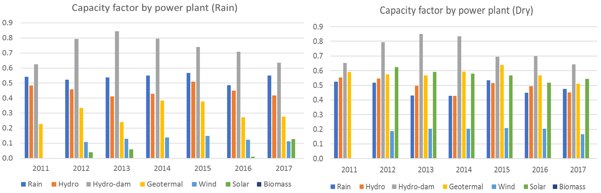
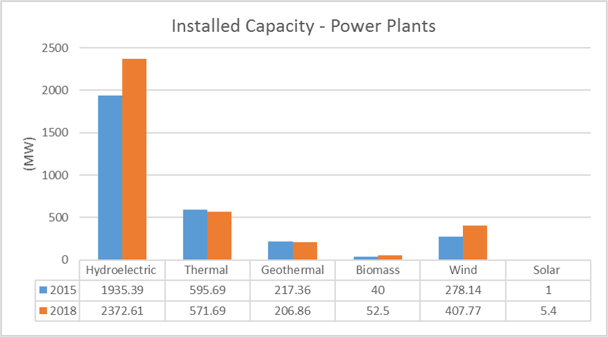
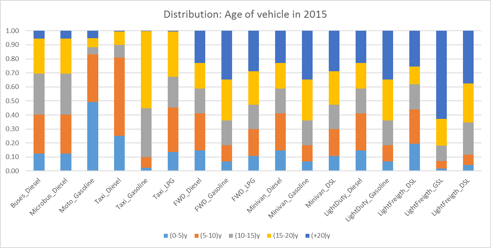
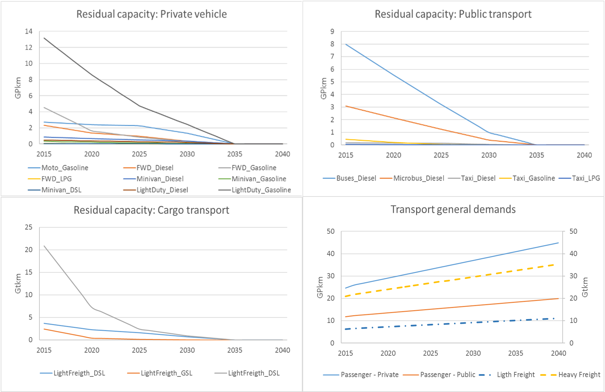

2. Energy model 
=======================================

This documentation has been structured to provide an overview of the energy sector in Costa Rica, to present the model structure, and to give a synthesis of the key assumptions of the model, regarding the numerical inputs used for the sets, parameters, and scenario building.   

2.1 Energy balance of Costa Rica
+++++++++

The energy balance is the most important source of data for the energy model of OSeMOSYS-CR, which is prepared by the Secretariat of Planning of the Energy Subsector (SEPSE). The analysis gathers and processes data from institutions such as the Costa Rica Institute of Electricity (ICE), the Costa Rican Petroleum Refinery (RECOPE) and the National Center of Energy Control (CENCE). The information is usually presented annually with excel books and a SANKEY diagram. 

In Costa Rica, the fossil fuels are completely imported, and the electricity is generated almost completely with renewable sources. The historical trending of energy consumption by sector presented in Figure 2.1. 

.. figure:: img/Fig_HistoricalEnergyConsumption.png
   :align:   center
   :width:   600 px
   
   *Figure 2.1: Energy consumption in Costa Rica, 2016*

2.2 General model structure 
+++++++++

The Costa Rican energy sector is enterly modeled in OSeMOSYS. However, while the transport and electricity sectors are subject to linear optimization, other smaller demands, such as the firewood used in the residential sector or the coke consumption by industries, are only represented with trends to account for their possible greenhouse gases (GHG) contributions. The overall structure of the model can be represented by the reference energy system shown in Figure 2.2. The primary energy supply consists of four main sources: renewable, imports of fossil fuels, biomass and electricity imports. These sources are transformed into different demands including industrial, residential and commercial requirements, and the transport of passengers (public and private) and cargo (light and heavy). 

.. figure:: img/SimpleRES.png
   :align:   center
   :width:   700 px

   *Figure 2.2: Simplified Reference Energy System for the Costa Rica model*

In OSeMOSYS-CR, the connection between the electricity and transport sectors is crucial for understanding the technological transition of fossil-powered vehicles to other lower or zero carbon emissions options. In the model, all fuels and technologies are incorporated to OSeMOSYS taking into account other sets, such as temporary divisions and emission factors, as well as the parameters. The latter are classified, among others, into costs, activity levels and infrastructure capacities. The establishment of these parameters was done after processing and reviewing the available national energy data. Table 2.1 summarizes the main souces of data for OSeMOSYS-CR. 

.. class:: center
*Table 2.1: Main data sources used in OSeMOSYS-CR.*

.. table:: 
   :align:   center
+--------------+------------+--------------------------+------------------------------------------------------------------------------+
| Category     | Source     | Data                     | Descriptions and assumption made                                             |
+==============+============+==========================+==============================================================================+
| Energy       | SEPSE      | Energy balance           | It is used to build the structure of the energy system, time-series of energy|
| System       |            |                          | consumption from 1989 to 2017 and forecasted with ARIMA models.              |
+--------------+------------+--------------------------+------------------------------------------------------------------------------+
| Demand       | SEPSE      | Final energy             | End-use information by sectors: industry, transport, households, services and|
|              |            |                          | agriculture.                                                                 |
+              +------------+--------------------------+------------------------------------------------------------------------------+
|              | SEPSE      | Transport                | It includes load factors, vehicle fleet, and energy consumption, efficiencies|
|              | RITEVE     | (passengers and cargo)   | and annual kilometers. We combine international standard data of technologies|
|              | MOPT       |                          | with national records. Technological groups are defined to study modal change|
|              | ETSAP      |                          | and fuel use. Non-motorized mobility is considered zero in the base case.    |
+--------------+------------+--------------------------+------------------------------------------------------------------------------+
|Electricity   | ICE        | Capital and fixed costs  | Based on national data. The costs were assumed constant in the whole period, |
|technologies  | Bloomberg  |                          | except for solar and wind systems, which decrease according to international |
|              | IEA        |                          | trends. Residual capacity is constant.                                       |
+              +------------+--------------------------+------------------------------------------------------------------------------+
|              | ICE        | Capacity and activity    | Based on the operational performance registered by the National Energy       |
|              |            |                          | Control Centre. Operational life is according to national plans.             |
+--------------+------------+--------------------------+------------------------------------------------------------------------------+
|Transport     | Hacienda   | Capital and fixed costs  | Based on the Ministry of Finance (Hacienda) database. We assumed that cost of|
|technologies  | Bloomberg  |                          | electric vehicles decreases (Bloomberg). For cargo transport, we review cost |
|              | Companies  |                          | of companies like Nicola and Tesla.                                          |
+              +------------+--------------------------+------------------------------------------------------------------------------+
|              | SEPSE      | Capacity and activity    | Based on the performance register by national surveys, concession for public |
|              | RITEVE     |                          | transport and the annual Vehicle technical review (RITEVE). Operational life |
|              | MOPT       |                          | is according to manufacturers and the residual capacity decreases linearly   | 
|              |            |                          | and proportionally with this value.                                          |
+--------------+------------+--------------------------+------------------------------------------------------------------------------+
|Fuel prices   | RECOPE     | Fossil Fuels and Biofuels| Based on current tariffs and projection uses in national plans. It considers |
|              | IEA        |                          | international prices and the tariff given by the regulator in Costa Rica     |
|              | ARESEP     |                          | (ARESEP) and trend provide by international Energy Agency (IEA).             |
+              +------------+--------------------------+------------------------------------------------------------------------------+
|              | ICE        | Electricity              | Base of the average of national tariffs and projections.                     |
|              | ARESEP     |                          |                                                                              |
+              +------------+--------------------------+------------------------------------------------------------------------------+
|              | SEPSE      | Biomass                  |  Not included. It is produced and consumed locally.                          |
+              +------------+--------------------------+------------------------------------------------------------------------------+
|              | ETSAP      | Hydrogen                 | Based on data published by ETSAP.                                            |
+--------------+------------+--------------------------+------------------------------------------------------------------------------+
|Infraestrucure| ICE        | Plants and power grid    | Based on Transmission and generation national plans. It assumes losses of 4% |
|              |            |                          | from the bulk transmission system and 6% for distribution. Charging          |
|              |            |                          | infrastructure is not included.                                              |
+              +------------+--------------------------+------------------------------------------------------------------------------+
|              | RECOPE     | Pipeline and road        | Based on national reports, we consider the current infraestructure does not  |
|              |            | distribution             | grow (gasoline and diesel). It includes new infrastructure for LPG. The model|
|              |            |                          | includes natural gas but is not used.                                        |
+              +------------+--------------------------+------------------------------------------------------------------------------+
|              | ETSAP      | Hydrogen                 | Consider local production, road transport and supply stations.               |
+--------------+------------+--------------------------+------------------------------------------------------------------------------+
| Sustainable  | MINAE      | Urban plans and mobility | Regarding the Integrated Public Transport System, the cost consideration come|
| mobility     | MOPT       |                          | from  Costa Rican Railways Institute (INCOFER) and MOTP studies.             |
|              | INCOFER    |                          |                                                                              |
+--------------+------------+--------------------------+------------------------------------------------------------------------------+
| Cargo        | MINAE      | Electric cargo train and | Costs  from national reports and demand based on expert criteria given in the|
| transport    | MOPT       | Logistic                 | participatory process.                                                       |
|              | INCOFER    |                          |                                                                              |
+--------------+------------+--------------------------+------------------------------------------------------------------------------+
| Emissions    | IPCC       |  Factors                 | Based on the IPCC and the national GHG inventory.                            |
+--------------+------------+--------------------------+------------------------------------------------------------------------------+
| Co-benefits  | PEN        | Coefficients             | It considers coefficients for health congestion and accidents by State of the|
|              | IMF        |                          | Nation Project (PEN) and International Monetary Fund (IMF)                   |
+--------------+------------+--------------------------+------------------------------------------------------------------------------+

2.3 Sets 
+++++++++

The sets are responsible for defining the structure of the model (i.e. temporal space, geographic space, elements of the system, etc.), the group of sets include: years, fuels, technologies, emissions and modes of operation. Each parameter, as it going to be further explained, is dependent of one or more sets. This subsections presents the sets composing the current version of OSeMOSYS-CR.  

2.3.1 Year
---------

This corresponds to the period of analysis. For OSeMOSYS-CR it is from 2018 to 2050. 

2.3.2 Fuels
---------

Figure 2.4 shows the different levels and transformations that the fuels go through, and their relations with some technologies. Groups E0, E1, E3, E4, E5, and E6 are crucial elements of the current supply chain, while E8 and E9 are modeled for control purposes.  Groups E9, E10  and E11 complement the model to enable the inclusion of hydrogen and infrastructure.  

.. figure:: img/Fuels.png
   :align:   center
   :width:   700 px

   *Figure 2.4: Simple diagram for fuel specification.*

Table 2.2 presents a synthesis of the included groups of commodities, including a brief description and examples. 

.. table:: 
   :align:   center

   *Table 2.2: Summary of fuels included in OSeMOSYS-CR's energy model.*
   
+-------+------------------------------------------+-------------------------------------------------------------------------------+
| Group | Descriptions                             | Examples                                                                      |
+=======+==========================================+===============================================================================+
| E0    | Pre-sources: Imports and fuel production | Import and production (fossil fuels and Biofuels), and their distribution.    |
+-------+------------------------------------------+-------------------------------------------------------------------------------+
| E1    | Primary sources (energy balance)         | Water, Wind, diesel, gasoline, biomass, and firewood.                         |
+-------+------------------------------------------+-------------------------------------------------------------------------------+
| E2-E3 | Electricity                              | Electricity from power plants to its distribution.                            |
+-------+------------------------------------------+-------------------------------------------------------------------------------+
| E4    | Electricity demand by sector             | Diesel for agriculture, firewood for residential, petroleum coke for industry.|
+-------+------------------------------------------+-------------------------------------------------------------------------------+
| E6-E6*| Transport demand                         | Private and public passenger transport, and light and heavy cargo transport.  |
+-------+------------------------------------------+-------------------------------------------------------------------------------+
| E7    | Distribution                             | Diesel for industry, LPG for heavy cargo transport, electricity for vehicles. |
+-------+------------------------------------------+-------------------------------------------------------------------------------+
| E8    | Transport managers                       | Fossil fuels for public transport, low carbon fuels for light freight.        |
+-------+------------------------------------------+-------------------------------------------------------------------------------+
| E10   | Infraestrucuture                         | Roads, rails, and bikeways.                                                   |
+-------+------------------------------------------+-------------------------------------------------------------------------------+
| E11   | Specific category for Hydrogen           | Produced hydrogen and ready to use.                                           |
+-------+------------------------------------------+-------------------------------------------------------------------------------+

See Annex for the whole list of fuels.

2.3.3 Technologies
---------

Different types of technologies are included in the model in order to establish the current supply chain and substitution possibilities. Figure 2.5 shows the different levels and transformation of technologies. 

.. figure:: img/Techs.png
   :align:   center
   :width:   700 px
   
   *Figure 2.5: Simple diagram for technologies specification.*
  
The groups of technolgies contemplated in OSeMOSYS-CR are described below:  

*	The first groups (ES, BL and DIST) are specially designed to model fossil fuels imports, production of biofuels, and the blend and distribution of them, considering the current pipe system for gasoline and diesel. 
*	The second group of blocks corresponds to the electric power system (PP and TD), that is mainly connected to renewable primary sources. 
*	The third level corresponds to civil infrastructure for mobility: TI and intermedia technologies for controlling the systems and divide the supply chains regarding fuels and technologies. 
*	TR technologies are dedicate to transport modelling and include blocks to study the modal shift. 
*	ED connects primary sources and demands that are not subject to the optimization process, but have CO2e contributions.   

Table 2.3 presents a synthesis of groups of technologies, including a brief description and examples. 

.. table:: 
   :align:   center

   *Table 2.3: Summary of technologies included in OSeMOSYS-CR's energy model.*

+-----------+------------------------------------------+-------------------------------------------------------------------------------+
| Group     | Descriptions                             | Examples                                                                      |
+===========+==========================================+===============================================================================+
| ES-BL-DIST| Energy Sources                           | Imports and production (fossil fuels and biofuels), and their distribution.   |
+-----------+------------------------------------------+-------------------------------------------------------------------------------+
| PP-TD     | Power plants and the electric grid       | Hydro Power Plant, Transmission system, and distributed generation.           |
+-----------+------------------------------------------+-------------------------------------------------------------------------------+
| ST        | Sources                                  | Water, Wind, diesel, gasoline, biomass, and firewood.                         |
+-----------+------------------------------------------+-------------------------------------------------------------------------------+
| D(F-T)    | Division                                 | Diesel for Industry, LPG for heavy cargo transport, Electricity for vehicles. |
+-----------+------------------------------------------+-------------------------------------------------------------------------------+
| TI        | Transport infrastructure                 | Roads, rails, and bikeways.                                                   |
+-----------+------------------------------------------+-------------------------------------------------------------------------------+
| TR        | Transportation                           | Electric Light duty Vehicles, LPG Buses, bikes, low carbon techs for passenger|
+-----------+------------------------------------------+-------------------------------------------------------------------------------+
| ED        | Sources                                  | Water, Wind, diesel, gasoline, biomass, and firewood.                         |
+-----------+------------------------------------------+-------------------------------------------------------------------------------+

See Annex for the whole list of processes.

2.3.4 Emissions
---------

Table 2.4 shows a description of emissions included in the model. In general, for GHG the values are in terms of equivalent carbon dioxide (CO2e). 

.. table:: 
   :align:   center

   *Table 2.4: Summary of emissions included in OSeMOSYS-CR's energy model.*

+-----------+------------------------------------------+
| Code      | Name                                     |                                                                 
+===========+==========================================+
| BC        | Black Carbon                             |                                                                             
+-----------+------------------------------------------+
| CH4       | Methane                                  |                                                                             
+-----------+------------------------------------------+
| NOx       | Nitrogen oxide                           |                                                                             
+-----------+------------------------------------------+
| CO2       | Carbon Dioxide                           |                                                                             
+-----------+------------------------------------------+
| CO2ex     | Carbon Dioxide external                  |                                                                            
+-----------+------------------------------------------+
| CO2dis    | Carbon Dioxide distribution              |                                                                             
+-----------+------------------------------------------+
| PM10      | Particulate matter                       |                                                                             
+-----------+------------------------------------------+
| PM2.5     | Fine Particulate matter                  |                                                                             
+-----------+------------------------------------------+

2.3.5 Mode of operation
---------
    
The model has one mode of operation, Mode 1, for representing the normal operation of the system and the current structure.
  
2.4 Parameters
+++++++++

2.4.1 Global parameters
---------

These parameters affect directly other parameters. 

**Demands:**

Based on the historical data of the energy balance, the demand projections were developed by using ARIMA models. These models are one of the most widely used approaches for time series forecasting. They correspond to simple univariate models focused on the long trend trajectory of the different time series. Their general structure is shown below:

General equation: 

.. math::

   \phi \left(B\right){\phi}_s\left(B\right)Z_t=\mu +\theta \left(B\right){\theta }_s\left(B\right)a_t
   
Simple delays: 
 
.. math::

   \phi \left(B\right)=1-{\phi }_1B-{\phi }_2B^2-...-{\phi }_pB^b\ \wedge \ \ \phi \left(B\right)=1-{\phi }_{1s}B^s-{\phi }_{2s}B^{2s}-...-{\phi }_{Ps}B^{Pb}
   
.. math::
   
   \theta \left(B\right)=1-{\phi }_1B-{\phi }_2B^2-...-{\phi }_qB^q\wedge \ \theta \left(B\right)=1-{\phi }_{1s}B-{\phi }_{2s}B^{2s}-...-{\phi }_{Qs}B^{qs}

where *ϕ* corresponds to operators, *μ* is the media  of *ϕ*, *θ* is a coefficient, and *s* is a stational component. 

This forecasting model gives good approximations of the data registered by institutions. Figure 2.6 shows a comparison between the trajectories obtain with the model for the electricity demand, and data registered by the Costa Rican Institute of Electricity (ICE), between 2011 and 2016, where the average error is approximately 1%. In the worst case it is 4%.   

   
   *Figure 2.6: Comparison between of ARIMA electricity forecasting and historical data.* 

The estimation begins with the analysis and forecasting of the time series corresponding to the primary sources. With these long term values, a specific trend is fixed by using the shares defined in the base year. A Hierarchical process was develop considering that the shares by each sector are the same on the base year. Figure 2.7 shows the general results of the projections and general annual demands.

   
   *Figure 2.7: Forecasting demands introduce to the model.* 
   
In order to estimate the demands of the transport sector, an additional calculation is required, but the previously projections of energy consumption for transport (by fuel) are used as base. The employment of this variable allows to have a systematic monitoring of the supply chain. Other crucial variable is the relation between energy consumption and the annual average distance travelled by each group of technologies. The general equations for the estimation are shown below:

.. math::
   
   Passenger=\sum_{Techs}{\frac{Energy\ Consumption\ \left(PJ\right)}{Efficiency_{CR}\left(\frac{Gkm}{PJ}\right)}*Load\ Factor\ (P)\ } 
     
.. math::
   
   Cargo=\sum_{Techs}{Energy\ Consumption\ \left(PJ\right)*Efficiency_{CR}\left(\frac{Gkm}{PJ}\right)*Load\ Factor\ (\frac{Ton}{v} )}
   
where: 

.. math::
   
   Efficiency_{CR}={\left.\left\{Fleet\left(V\right)*annual\ distance\ \left(km\right)\ /\ energy\ consumption(PJ)\right.\right\}}_{2015}

Now, we are considering that this relation defined in the base year will be constant, assuming a no-policy scenario and taking into account that this data concentrates the efficiency of the road system and technologies. For more details, see the documentation of the **InputActivityRatio** parameter.   

As a short example, the calculation of the demand for the gasoline light duty vehicles (TD_LDGSL) in the 2015 year, is shown below: 

.. math::
   
   {TD\_LD}_{GSL}=\left[Energy\right]\left(PJ\right)*\left[Efficiency\right]\left(\frac{Vkm}{PJ}\right)*\left[LoadFactor\right]\left(\frac{P}{V}\right)
   
where:

.. math:: 

   Energy = CR\ gasoline\ consumption\ \left(PJ\right)* \%\ consumed\ by\ light\ duty\ (pu), 
   
   
.. math:: 

   Efficiency = {\left(\frac{Annual\ Average\ distance\ traveled\ by\ light\ duty*light\ duty\ fleet\ \ \ }{Energy\ consumption\ by\ all\ light\ duty}\right)}_{base},
   
   
.. math::

   LoadFactor=ocupancy\ rate\ for\ light\ duty.
   
Therefore: 

.. math::

   {TD\_LD}_{GSL}=\left[21.88\ PJ*0.56\right]\ *\left[\frac{14773\ km*611324\ V}{21.88\ PJ}\right]*\left[\frac{1.5\ P}{V}\right]=13.5\ Gpkm

This similar process was developed for every transport technology during all the years included in the analysis. In the process, the energy consumption changes according to the projection. The final calculation of the demands is presented in the figure 2.8. 

   
   *Figure 2.8: Forecasting demands introduce to the model.* 

The demands are introduced in two different parameters: 

* Specified Annual Demand and Specified Demand Profile. 
* Or we used the Accumulated Annual Demand, when the data corresponding to the profiles was unavailable. 

**SpecifiedAnnualDemand[r,f,y] and SpecifiedDemandProfile[r,f,l,y]**

This parameter is used for the electricity and transport sectors, where the Specified Annual Demand contains the total annual demand, and the Specified Demand Profile represents the way this demand is distributed throughout the time slices. 

**AcummulatedAnnualDemand[r,f,y]**

For the current model, the energy consumption -different to electricity and transport- is assumed constant throughout the years. It is similar to introduce the values in the specified annual demand and replicate the *year split* for each fuel into the specified demand profile. The next demands are introduced in this parameter:
 
*	Industrial: Diesel, Fuel oil, Firewood, LPG, Biomass, and Petroleum coke.
*	Commerce: Firewood, and LPG.
*	Agriculture: Diesel.
*	Residential: Firewood, and LPG.

2.4.2 Performance
---------

**CapacityToActivityUnit[r,t]**

This parameter allows to relate the capacity and activity level of the technologies. For this model, this parameter is used to introduce the relation between power and energy of the electricity sector. Therefore, we convert the GWh to PJ, understanding that if 1 GW is constant throughout the year, the corresponding energy is 31,536 PJ

For other sectors, we assume a default value equal to 1, as the calculation is related only to energy.

**CapacityFactor[r,t,l,y]**

The capacity factor is specially used for representing electricity generation. In this case, the historical data from 2011 to 2017 was the base to define the average value by season for every group of plants. In general, the calculation followed the next equation:

.. math::

   {Cf}_{season}=\frac{\sum_{season,year}{\left(electricity\ generated\right)}}{\left(hour\ by\ season\right)*(Nominal\ capacity)}

Figure 12 shows the historical values of capacity factors. For solar and wind power plants another possibility is to use some tools like renewable ninja (see figure 13). The average values are very similar to the operational data registered. 

    
   *Figure 2.9: Historical capacity factor for plants by season.* 
   
A special consideration was made for photovoltaic systems, taking into account a standard curve for costa Rica and the average capacity factor previously calculated. In this case, the average of the operation hours corresponds to the season value. Table 9 shows a synthesis of the data used in the OSeMOSYS-CR model. For the rest of the power plants that are not included in the table, the capacity factor in both seasons is proportional to the lenght of each timeslice.

.. table:: 
   :align:   center

   *Table 2.4: Capacity factor used in OSeMOSYS model for power plant.*
+-------------------+--------------------+
| Power Plants      |     Timeslice      |
+                   +----------+---------+
|                   |   Rain   |   Dry   |
+===================+==========+=========+
| Hydro-dam plant   | 0.54     | 0.48    |
+-------------------+----------+---------+
| Hydro power plant | 0.45     | 0.50    |
+-------------------+----------+---------+
| Geothermal plants | 0.73     | 0.74    |
+-------------------+----------+---------+
| Wind power plants | 0.30     | 0.58    |
+-------------------+----------+---------+
| Solar plants      | 0.11     | 0.17    |
+-------------------+----------+---------+
| Biomass plants    | 0.03     | 0.49    |
+-------------------+----------+---------+

As Costa Rica reach an average of 98.5% of renewable generation, thermal plants were no included into this analysis. In this case, an operation constrain fixes the behavior of these technologies.  

**AvailabilityFactor[r,t,y]**

This value corresponds to the entire time that technologies are available. OSeMOSYS-CR uses 0.9 for power plants (assuming a 0.1 portion of the time for maintenance works and reliability). For the transport sector, the model uses 1, since the vehicle fleet and modes of mobility are distributed in the whole region and a combination of modes can be used.

**Operational life[r,t]**

For this parameter, the model employs a set of values used by KTH. In general, the most important investments possess an operational life greater than the period of analysis. Table 2.4 shows the data used in the model. 

.. table:: 
   :align:   center

   *Table 2.4: Summary of Operational lifes used in the model, by categories.*

+-----------------------------+-----------------------------+-----------------------------+
| Electricity sector          | Transport sector            | Infraestructure             |
+---------------------+-------+---------------------+-------+---------------------+-------+
| Technologies        | Value | Technologies        | Value | Technologies        | Value |
+=====================+=======+=====================+=======+=====================+=======+
| Hydro dam           | 80    | Light duty          | 15/12 | Electric grid       | 50    |
+---------------------+-------+---------------------+-------+---------------------+-------+
| Hydro Run off river | 60    | 4WD                 | 10/12 | Pipeline system     | 50    |
+---------------------+-------+---------------------+-------+---------------------+-------+
| Biomass             | 25    | Motorcycle          | 11/12 | Biofuel production  | 50    |
+---------------------+-------+---------------------+-------+---------------------+-------+
| Geothermal          | 40    | Minivan             | 15/12 | H2 production       | 50    |
+---------------------+-------+---------------------+-------+---------------------+-------+
| Solar Distribution  | 20    | Buses               | 15/12 |                     |       |
+---------------------+-------+---------------------+-------+---------------------+-------+
| Solar transmission  | 40    | Micro buses         | 15/12 |                     |       |
+---------------------+-------+---------------------+-------+---------------------+-------+
| Wind Distribution   | 20    | Taxis               | 10/12 |                     |       |
+---------------------+-------+---------------------+-------+---------------------+-------+
| Wind transmission   | 40    | Pickup truck        | 15/12 |                     |       |
+---------------------+-------+---------------------+-------+---------------------+-------+
| Thermal             | 25    | Trucks              | 15/12 |                     |       |
+---------------------+-------+---------------------+-------+---------------------+-------+

**InputActivityRatio[r,t,f,m,y]**

This value is fundamental to build the structure of model, since it connects the fuels and technologies (i.e. it represents all the inputs each technology needs). Usually, it is referred as the inverse of the efficiency of the process (if the Output Activity Ratio is 1). 

* Electricity sector: Most part of the power plants are connected to renewable sources. Therefore it has been assumed a relation 1:1. With the exception of thermal plants, that are directly dependent of their variable cost (i.e. fuel). For the transmission and distribution grid, a values proportional to losses (4% and 6%) were introduced. Table 2.5 shows the data used in OSeMOSYS-CR. 

.. table:: 
   :align:   center

   *Table 2.5: Summary of input activity ratio for electric sector.*

+--------------------------------+----------------------+---------+
| Input sources                  | Technology group     | Value   |
+================================+======================+=========+
| Water, solar, wind, geothermal | Renewable power plant| 1.000   |
+--------------------------------+----------------------+---------+
| Dielse                         | Thermal power plant  | 2.857   |
+--------------------------------+----------------------+---------+
| Fuel oil                       | Thermal power plant  | 2.174   |
+--------------------------------+----------------------+---------+
| Electricity from power plants  | Transmission grid    | 1.040   |
+--------------------------------+----------------------+---------+
| Electricity from transmission  | Distribution grid    | 1.060   |
+--------------------------------+----------------------+---------+

* Transport sector: This value corresponds to the relation between the energy consumption (J) by technologies and the demand (vkm, pkm or tkm). As a first reference, values taken by organizations such as ETSAP or manufactures are considered, alongside with the national data. The next calculation shows how to estimate this rate for light duty vehicles.     

Regarding Costa Rican data, the requirements are: the energy consumption, fleet and annual average distance by category. The efficiency can be expressed like MJ/km, or MJ/pkm if the load factor is included (i.e. number of passagers per vehicle). The importance of these variables are described as follow:

* The Energy and the average annual kilometer travelled: The potential of using these values consists in defining two systematic control variables to account the demand. 
* Load Factor: This value ease the incorporation of modal change by unifying the demand.

The general equation is: 

.. math::

   {\varepsilon}_{CR}={\left(\frac{Energy}{Fleet*distance}\right)}^{-1}\left(\frac{km}{MJ}\right) = {\left(\frac{Energy}{Fleet*distance*passenger}\right)}^{-1}\left(\frac{pkm}{MJ}\right)

For the general category of Light Duty Vehicles in Costa Rica, by 2015: 

**EQUATION**

In the model, the input activity ratio is used in MJ/km for each individual transport technology. The demand is included in the relation between “TR” and “modes” (see figure 2.5) and the demands.  As this rate concentrates the efficiency of the transport system and the vehicle fleet, it is used to calibrate the model. The procedure consists of using the estimation based on the national relation and the proportion provide by one reliable source (in this cases, a data set provided by KTH based on ETSAP). 

The next example shows how to recalculate the efficiencies of two types of technologies: current and new technologies. Here, we use the same example of gasoline light duty vehicles. Table 2.6 presents the reference data and the results of the recalculation.

.. table:: 
   :align:   center

   *Table 2.6: . Recalculation of the input activity ratio .*
+-------------------+-------------------+------------------------+-------------------------------+----------------------+
| Technology        | KTH-ETSAP (MJ/km) | KTH-ETSAP (proportion) | CR data: (ECR_LDV)-1  (MJ/km) | Recalculated (MJ/km) |
+===================+===================+========================+===============================+======================+
| LDV_GSL (current) | 3.78 (base)       | 1.000                  | 2.420                         | 2.42                 |
+-------------------+-------------------+------------------------+-------------------------------+----------------------+
| LDV_GSL (New)     | 2.06              | 0.550                  |                               | 1.33                 |
+-------------------+-------------------+------------------------+-------------------------------+----------------------+

In this case, the data corresponding to the current vehicles is assumed equal to the national data. The data for new technologies is proportional to the relation estimated: 

.. math::

   {\mathrm{LDV}}_{\mathrm{GSL}}\left(\mathrm{current}\right)\mathrm{=CR\ data\ estimated=2.42}

.. math::

   {\mathrm{LDV}}_{\mathrm{GSL}}\left(\mathrm{New}\right)\mathrm{=CR\ data\ estimated}\mathrm{*}\mathrm{KTH}\mathrm{-}\mathrm{ETSAP\ proportion}\mathrm{ =1.33\ }\mathrm{\ (MJ/km)}
   
As the relation between distance and energy consumption is a control variable that combines the efficiency of technologies and the road system, the value will be kept constant. This is done considering that the efficiency of the technologies will improve, while the conditions of the system will decrease. 

**OutputActivityRatio[r,t,f,m,y]**

This parameter works together alongside with the InputActivityRatio. Since the efficiency is stablished in the input, the OutputActivityRatio value is always 1. Therefore, its funciton in OSeMOSYS-CR, is to connect the structure of the model.   

2.4.3 Capacity
---------

**ResidualCapacity[r,t,y]**

The residual capacity expresses the capacity that already exists in the first year of analysis. The considerations regaring the electricity and transport sectors are presented below: 

* Electricity sector: As the most relevant plants in Costa Rica (especially Hydropower) have been recently improved in order to extend their operational life, the capacity in 2015 is kept constant through all the period of analysis. Figure 2.10 shows the reference values for the base year and the evolution until 2018

   
   *Figure 2.10: Installed capacity in the Costa Rican power system (based on CENCE).* 
   
* Transport sector: This calculation was made taking into account the vehicle fleet in 2015, the transport demand by sector and a decreasing number of vehicles proportional to the operational life. Figure 2.11 shows the distribution of ages by technologies for the base year.  

   
   *Figure 2.11: Age vehicles for the main categories in 2015.* 
   
As the demand in the base year is supplied by this group of technologies, it is assumed that for 2015 this is the capacity of the fleet and it will decreased according to the residual life (i.e. the number of years left until they complete their operational life). Figure 2.12 presents how the capacity of the current fleet is reduced over the years.   

   
   *Figure 2.12: Residual capacities and demand by sector.* 

2.4.3 Cost
---------

Figure 2.13 shows the relation included in the model regarding costs. Usually, the capital and fixed costs are related with the capacity and the variable cost is linked to the activity level. The diagram shows what parameters are used by each group of technologies.  

.. figure::  img/costs.png
   :align:   center
   :width:   700 px
   
   *Figure 2.12: Cost chains of OSeMOSYS-CR.* 
   
In order to understand the cost flow, that the model follows in order to satisfy a specific demand, a brief example is presented in Figure 2.13. The figure includes the relation between the electric grid, the pipe system and the vehicles for one year. 

.. figure::  img/cost_example.png
   :align:   center
   :width:   700 px
   
   *Figure 2.12: Brief example of the cost chain of the model.* 
   
In this example, we have two ways to satisfy 1 Gpkm: Electric and Fossil. We are no taking into account the depreciation for the example. The activity and capacity for the transport sector is the same, while for the electricity sector the Capacity-to-activity unit (31.536) is used.  A special attention must be paid in the units and their equivalents. The general, equation is: 

.. math::

   TotalCost=\sum_{Techs}{\left(Capital\ cost+fixed\right)*\left[capacity\right]+\left(cost\ variable\ cost\right)*[activity]}.
   
Electric way: 

.. math::

   Vehicle=\left(1200\ \frac{MUSD}{GPkm}\right)*\left[1GPkm\right]=1200\ MUSD, \\
   
.. math::

   Power\ -T\&D=\left(1200\ \frac{MUSD}{GW}\right)*\left[1GPkm*3\frac{PJ}{GPkm}*\frac{1}{\mathrm{31.536}}\frac{GW}{PJ}\right]=114\ MUSD, \\
   
.. math::

   Total\_electric=1200\ MUSD+114\ MUSD=1314\ MUSD. \\
   
Fossil Fuel way: 

.. math::

   Vehicle=\left(800\ \frac{MUSD}{GPkm}\right)*\left[1GPkm\right]=800\ MUSD, \\
   
.. math::

   Fuel=\left(2+11\frac{MUSD}{PJ}\right)*\left[1GPkm*3.5\frac{PJ}{GPkm}\right]=45.5\ MUSD,\ \\
   
.. math::

   Total\_fossil=1200\ MUSD+114\ MUSD=845\ MUSD. \\

In this example, the fossil fuel chain results are cheaper than electric solution. Additional conditions must be added, such as: the depreciation and variations in the costs.  The next section presents the considerations for the entire cost. 

**CapitalCost[r,t,y]**

Transport sector: 

.. math:: 

   Capital\ cost=cost\ of\ vehicle\ \left(\frac{USD}{vehicle}\right)/effiecency\left(\frac{km}{year}\right)/LF\left(\frac{Passenger}{vehicle}\right)
