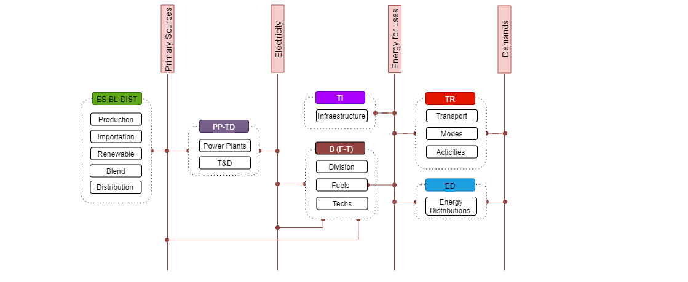

2. Energy model 
=======================================

This documentation has been structured to provide  an overview of the energy sector in Costa Rica, present the model structure, give synthesis regarding assumptions, and support the numerical inputs for the sets, parameters, and scenario building.   

2.1 Energy balance of Costa Rica
+++++++++

The energy balance is the most important source of data for the energy model of OSeMOSYS-CR, which is prepared by the Secretariat of Planning of the Energy Subsector (SEPSE). The analysis gathers and processes data from institutions such as the Costa Rica Institute of Electricity (ICE), the Costa Rican Petroleum Refinery (RECOPE) and the National Center for Energy Control (CENCE). The information is usually presented annually with excel books and a SANKEY diagram. Figure 2.1 the diagram for 2011.  

.. figure::  img/Fig_SankeyDiagram.png
   :align:   center
   
   *Figure 2.1: Sankey diagram of Costa Rica, 2011.* 

As can be noted, in Costa Rica the fossil fuels are completely imported, and the electricity is generated almost completely with renewable sources. The historical trending and the general distribution for 2016 are presented in Figure 2.2.

.. figure:: img/Fig_CREnergyConsumption.png
   :align:   center
   
   *Figure 2.2: Energy consumption in Costa Rica, 2016*

2.2 General model structure 
+++++++++

The Costa Rican energy sector is enterly modeled in OSeMOSYS. However, while the transport and electricity sectors are subject to linear optimization, other smaller demands, such as the firewood used in the residential sector or the coke consumption by industries, are only represented with trends to account for their possible greenhouse gases (GHG) contributions. The overall structure of the model can be represented by the reference energy system shown in Figure 2.3. The primary energy supply consists of four main sources: renewable, imports of fossil fuels, biomass and electricity imports. These sources are transformed to different demands including industrial, residential and commercial requirements, and the transport of passengers and cargo. 

.. figure:: img/SimpleRES.png
   :align:   center

   *Figure 2.3: Simply Reference Energy System for the Costa Rica model*

In OSeMOSYS-CR, the connection between the electricity and transport sectors is crucial for understanding the technological transition of fossil-powered vehicles to other lower or zero carbon emissions options. In the model, all fuels and technologies are incorporated to OSeMOSYS taking into account other sets, such as temporary divisions and emission factors, as well as the parameters. The latter are classified, among others, into costs, activity levels and infrastructure capabilities. The establishment of these parameters was done after a data processing and a review of the available national energy information. Table 2.1 summarizes the main souces of data for OSeMOSYS-CR. 

.. table:: 
   :align:   center

   *Table 2.1: Main data sources used in OSeMOSYS-CR.* 

+--------------+------------+--------------------------+------------------------------------------------------------------------------+
| Category     | Source     | Data                     | Descriptions and assumption made                                             |
+==============+============+==========================+==============================================================================+
| Energy       | SEPSE      | Energy balance           | It is used to build the structure of the energy system, time-series          |
| System       |            |                          | from 1989 to 2017 and forecasted with ARIMA models.                          |
+--------------+------------+--------------------------+------------------------------------------------------------------------------+
| Demand       | SEPSE      | Final energy             | Built based on final end-use by sectors: industry, transport, households,    |
|              |            |                          | services and agriculture.                                                    |
+              +------------+--------------------------+------------------------------------------------------------------------------+
|              | ICE        | Electricity load shapes  | Assumed constant for industry, curve for commerce (peak mid-day) and         |
|              |            |                          | classical two valleys, two peaks and night for residential.                  |
+              +------------+--------------------------+------------------------------------------------------------------------------+
|              | SEPSE      | Transport                | It includes load factors, vehicle fleet, and energy consumption, efficiencies|
|              | RITEVE     | (passengers and cargo)   | and annual kilometers. We combine international standard data of technologies|
|              | MOPT       |                          | with national records. Technological groups are defined to study modal change|
|              | ETSAP      |                          | and fuel use. Non-motorized mobility is considered zero in the base case.    |
+--------------+------------+--------------------------+------------------------------------------------------------------------------+
|Electricity   | ICE        | Capital and fixed costs  | Based on national data. The costs were assumed constant in the whole period, |
|technologies  | Bloomberg  |                          | except for solar and wind systems, which decrease according to international |
|              | IEA        |                          | trends. Residual capacity is constant.                                       |
+              +------------+--------------------------+------------------------------------------------------------------------------+
|              | ICE        | Capacities and activity  | Based on the operational performance registered by the National Energy       |
|              |            |                          | Control Centre. Lifespan is according to national plans.                     |
+--------------+------------+--------------------------+------------------------------------------------------------------------------+
|Transport     | Hacienda   | Capital and fixed costs  | Based on the Ministry of Finance (Hacienda) database. We assumed that cost of|
|technologies  | Bloomberg  |                          | electric vehicles' decreases (Bloomberg). For cargo transport, we review cost|
|              | Companies  |                          | of companies like Nicola and Tesla.                                          |
+              +------------+--------------------------+------------------------------------------------------------------------------+
|              | SEPSE      | Capacities and activity  | Based on the performance register by national surveys, concession for public |
|              | RITEVE     |                          | transport and the annual Vehicle technical review (RITEVE). Lifespan is      |
|              | MOPT       |                          | according to manufacturers and the residual capacity decreases linearly and  | 
|              |            |                          | proportionally with this value.                                              |
+--------------+------------+--------------------------+------------------------------------------------------------------------------+
|Fuel prices   | RECOPE     | Fossil Fuels and Biofuels| Based on current tariffs and projection uses in national plans. It considers |
|              | IEA        |                          | international prices and the tariff given by the regulator in Costa Rica     |
|              | ARESEP     |                          | (ARESEP) and trend provide by international Energy Agency (IEA).             |
+              +------------+--------------------------+------------------------------------------------------------------------------+
|              | ICE        | Electricity              | Base of the average of national tariffs and projections.                     |
|              | ARESEP     |                          |                                                                              |
+              +------------+--------------------------+------------------------------------------------------------------------------+
|              | SEPSE      | Biomass                  |  Not included. It is produced and consumed locally.                          |
+              +------------+--------------------------+------------------------------------------------------------------------------+
|              | ETSAP      | Hydrogen                 | Based on data publish by Energy Technology Systems Analysis Programme (ETSAP)|
+--------------+------------+--------------------------+------------------------------------------------------------------------------+
|Infraestrucure| ICE        | Plants and power grid    | Based on Transmission and generation national plans. It assumes losses of 6% |
|              |            |                          | from the bulk transmission system and 6% for distribution. Charging          |
|              |            |                          | infrastructure is not included.                                              |
+              +------------+--------------------------+------------------------------------------------------------------------------+
|              | RECOPE     | Pipeline and road        | Based on national reports, we do not consider the current does no growth (for|
|              |            | distribution             | gasoline and Diesel). It includes new infrastructure for LPG. The model      |
|              |            |                          | includes natural gas but is not used.                                        |
+              +------------+--------------------------+------------------------------------------------------------------------------+
|              | ETSAP      | Hydrogen                 | Consider local production, road transport and supply stations.               |
+--------------+------------+--------------------------+------------------------------------------------------------------------------+
| Sustainable  | MINAE      | Urban plans and mobility | Regarding the Integrated Public Transport System, the cost consideration come|
| mobility     | MOPT       |                          | from  Costa Rican Railways Institute (INCOFER) and MOTP studies.             |
|              | INCOFER    |                          |                                                                              |
+--------------+------------+--------------------------+------------------------------------------------------------------------------+
| Cargo        | MINAE      | Electric cargo train and | Cost was taken from national reports and demand based on expert criteria     |
| transport    | MOPT       | Logistic                 | given in the participatory process.                                          |
|              | INCOFER    |                          |                                                                              |
+--------------+------------+--------------------------+------------------------------------------------------------------------------+
| Emissions    | IPCC       |  Factors                 |  Based on the IPCC and the national GHG inventory.                           |
+--------------+------------+--------------------------+------------------------------------------------------------------------------+
| Co-benefits  | PEN        | Coefficients             | It considers coefficients for health congestion and accidents by State of the|
|              | IMF        |                          | Nation Project (PEN) and International Monetary Fund (IMF)                   |
+--------------+------------+--------------------------+------------------------------------------------------------------------------+

2.3 Sets 
+++++++++

The sets are responsible for defining the structure of the model (i.e. temporal space, geographic space, elements of the system, etc.), the group of sets include: years, fuels, technologies, emissions and modes of operation. Each parameter, as it going to be further explained, is dependent of one or more sets. This subsections presents the sets composing the current version of OSeMOSYS-CR.  

2.3.1 Year
---------

This corresponds to the period of analysis. For OSeMOSYS-CR it is from 2018 to 2055. Five additional years are added in order to extend the optimization process.  Therefore, decisions right before 2050 (i.e. national decarbonisation target) will not be affected by the model considering it is the last year. 

2.3.2 Fuels
---------

Figure 2.4 shows the different levels and transformations that the fuels go through, and their relations with some technologies. Groups E0, E1, E3, E4, E5, and E6 are crucial elements of the current supply chain, while E8 and E9 are modeled for control purposes.  Groups E9, E10  and E11 complement the model to enable the inclusion of hydrogen and infrastructure.  

.. figure:: img/Fuels.png
   :align:   center

   *Figure 2.4: Simple diagram for fuel specification.*

Table 2.2 presents a synthesis of the included groups of commodities, including a brief description and examples. 

.. table:: 
   :align:   center

   *Table 2.2: Summary of fuels included in OSeMOSYS-CR's energy model.*
   
+-------+------------------------------------------+-------------------------------------------------------------------------------+
| Group | Descriptions                             | Examples                                                                      |
+=======+==========================================+===============================================================================+
| E0    | Pre-sources: Imports and fuel production | Import and production (fossil fuels and Biofuels), and their distribution.    |
+-------+------------------------------------------+-------------------------------------------------------------------------------+
| E1    | Primary sources (energy balance)         | Water, Wind, diesel, gasoline, biomass, and firewood.                         |
+-------+------------------------------------------+-------------------------------------------------------------------------------+
| E2-E3 | Electricity                              | Electricity from power plants to its distribution.                            |
+-------+------------------------------------------+-------------------------------------------------------------------------------+
| E4    | Electricity demand by sector             | Diesel for agriculture, firewood for residential, petroleum coke for industry.|
+-------+------------------------------------------+-------------------------------------------------------------------------------+
| E6-E6*| Transport demand                         | Private and public passenger transport, and light and heavy cargo transport.  |
+-------+------------------------------------------+-------------------------------------------------------------------------------+
| E7    | Distribution                             | Diesel for industry, LPG for heavy cargo transport, electricity for vehicles. |
+-------+------------------------------------------+-------------------------------------------------------------------------------+
| E8    | Transport managers                       | Fossil fuels for public transport, low carbon fuels for light freight.        |
+-------+------------------------------------------+-------------------------------------------------------------------------------+
| E10   | Infraestrucuture                         | Roads, rails, and bikeways.                                                   |
+-------+------------------------------------------+-------------------------------------------------------------------------------+
| E11   | Specific category for Hydrogen           | Produced hydrogen and ready to use.                                           |
+-------+------------------------------------------+-------------------------------------------------------------------------------+

See Annex for the whole list of fuels.

2.3.3 Technologies
---------

Different types of technologies are included in the model in order to establish the current supply chain and substitution possibilities. Figure 2.5 shows the different levels and transformation of technologies. 

   
   *Figure 2.5: Simple diagram for technologies specification.*
  
The groups of technolgies contemplated in OSeMOSYS-cr are described below:  

*	The first groups (ES, BL and DIST) are specially designed to model fossil fuels imports, production of biofuels, and the blend and distribution of them, considering the current pipe system for gasoline and diesel. 
*	The second group of blocks corresponds to the electric power system (PP and TD), that is mainly connected to renewable primary sources. 
*	The third level corresponds to civil infrastructure for mobility: TI and intermedia technologies for controlling the systems and divide the supply chains regarding fuels and technologies. 
*	TR technologies are dedicate to transport modelling and include blocks to study the modal shift. 
*	ED connects primary sources and demands that are not subject to the optimization process, but have CO2e contributions.   

Table 2.3 presents a synthesis of groups of technologies, including a brief description and examples. 

.. table:: 
   :align:   center

   *Table 2.3: Summary of technologies included in OSeMOSYS-CR's energy model.*

+-----------+------------------------------------------+-------------------------------------------------------------------------------+
| Group     | Descriptions                             | Examples                                                                      |
+===========+==========================================+===============================================================================+
| ES-BL-DIST| Energy Sources                           | Imports and production (fossil fuels and Biofuels), and their distribution.   |
+-----------+------------------------------------------+-------------------------------------------------------------------------------+
| PP-TD     | Power plants and the electric grid       | Hydro Power Plant, Transmission system, distributed generation.               |
+-----------+------------------------------------------+-------------------------------------------------------------------------------+
|ST         | Sources                                  | Water, Wind, diesel, gasoline, biomass, firewood.                             |
+-----------+------------------------------------------+-------------------------------------------------------------------------------+
| D(F-T)    | Division                                 | Diesel for Industry, LPG for heavy cargo transport, Electricity for vehicles. |
+-----------+------------------------------------------+-------------------------------------------------------------------------------+
| TI        | Transport infrastructure                 | Roads, rails, bikeways.                                                       |
+-----------+------------------------------------------+-------------------------------------------------------------------------------+
| TR        | Transportation                           | Electric Light duty Vehicles, LPG Buses, bikes, low carbon techs for passenger|
+-----------+------------------------------------------+-------------------------------------------------------------------------------+
| ED        | Sources                                  | Water, Wind, diesel, gasoline, biomass, and firewood.                         |
+-----------+------------------------------------------+-------------------------------------------------------------------------------+

See Annex for the whole list of processes.

2.3.4 Emissions
---------

Table 2.4 shows a description of emissions included in the model. In general, for GHG, the values are in terms of equivalent carbon dioxide. 

.. table:: 
   :align:   center

   *Table 2.4: Summary of emissions included in OSeMOSYS-CR's energy model.*

+-----------+------------------------------------------+
| Code      | Name                                     |                                                                 
+===========+==========================================+
| BC        | Black Carbon                             |                                                                             
+-----------+------------------------------------------+
| CH4       | Methane                                  |                                                                             
+-----------+------------------------------------------+
| NOx       | Nitrogen oxide                           |                                                                             
+-----------+------------------------------------------+
| CO2       | Carbon Dioxide                           |                                                                             
+-----------+------------------------------------------+
| CO2ex     | Carbon Dioxide external                  |                                                                            
+-----------+------------------------------------------+
| CO2dis    | Carbon Dioxide distribution              |                                                                             
+-----------+------------------------------------------+
| PM10      | Particulate matter                       |                                                                             
+-----------+------------------------------------------+
| PM2.5     | Fine Particulate matter                  |                                                                             
+-----------+------------------------------------------+

2.3.5 Mode of operation
---------
    
The model has one mode of operation, Mode 1, for representing the normal operation of the system and the current structure.
  
2.4 Parameters
+++++++++

2.4.1 Global parameters
---------

These parameters affect directly other parameters. 

**Demands:**

Based on the historical energy balance data, the possible future was developed by using ARIMA models. These models are one of the most widely used approaches to time series forecasting. They correspond to simple univariate models focusing on the long trend trajectory of the different time series. Their general structure is show below:

ϕ(B) ϕ_s (B) Z_t=μ+θ(B) θ_s (B) a_t  →General equation 

ϕ(B)=1-ϕ_1 B-ϕ_2 B^2-...-ϕ_p B^b  ∧  ϕ(B)=1-ϕ_1s B^s-ϕ_2s B^2s-...-ϕ_Ps B^Pb → rezagos simples 

θ(B)=1-ϕ_1 B-ϕ_2 B^2-...-ϕ_q B^q∧ θ(B)=1-ϕ_1s B-ϕ_2s B^2s-...-ϕ_Qs B^qs → rezagos simples 

where: 

ϕ is an operators, μ the media  of ϕ, θ represent coefficient,and s is and stational component. 

It is usual to use the general notation of Box – Jenkins to define the model: ARIMA→ (p,d,q)(P,D,Q). This concentrate the whole information of the model. The “d” and “D” are for differentiations to make the time series stationaries. 

This forecasting model gives good approximations with the data register by institutions. Figure 2.6 shows a comparison in between the trajectories gives by the model and data register by the Costa Rican Institute of electricity (2011-2016), where the average error is approximately 1% and 4% for the worst case.   

   
   *Figure 2.6: Comparison between of ARIMA electricity forecasting and historical data.* 

The estimations begin with the time series analysis and forecasting of the primary sources. With this long term values a specific trend is fixed using the shares defining in the base year. A Hierarchical process was develop considering that the shares by the sector are the same on the base year.  The next figure shows the general results for projections and general annual demands.

.. figure::  img/DemandsBySector.png
   :align:   center
   
   *Figure 2.7: Forecasting demands introduce to the model.* 
   
For the transport sector, an additional calculus is required. For that the previously projections of energy consumption for transport is used as based. The selection of this variable is considered fundamental, because allows to have a systematic monitoring. The another variable is the relation between energy consumption and the annual average distance travelled by group of technologies. The general equations are show below:

**EQUATION**

At this time, we are considering this relation will be constant to define the base year. Considering a no policy scenario and taking into account that this data concentrates the efficiency of the road system and technologies. For more details, see the section **InputActivityRatio**.   

As a short example, the calculation of the demand for the gasoline light duty vehicles (just for the example called: TD_LDGSL) in the 2015 year, is show below. 

**EQUATION**

The similar process is developing for every technology during all years of the analysis. In the process what it changes is the energy consumption provided by the projection. The final calculation of demand is presents in the figure 2.8. 

.. figure::  img/PassengerCargoDemands.png
   :align:   center
   
   *Figure 2.8: Forecasting demands introduce to the model.* 

The demand calculation was divided in three groups. First is for electricity sector, second is for transport sector and the last one for others energy consumptions no subject to the optimization process.  For the model we introduce the data in two ways: First, correspond to the parameters: Specified Annual Demand and Specified Demand Profile. Second, is using the Accumulated Annual Demand, when the profiles data are unavailable. 

**SpecifiedAnnualDemand[r,f,y] and SpecifiedDemandProfile[r,f,l,y]**

This parameter is use for electricity sector and transport sector. For transport demand, have been assuming a profile equivalent to electric vehicles for every technology. In this context, the idea is to represent the possibility of charge in time slices, although the demand is annual. 

**AcummulatedAnnualDemand[r,f,y]**

For the current model, the distribution of energy consumption is assumed constant throughout the year. It’ similar to introduce the values in the specified annual demand and replicate the “yearsplit" for each fuel into the specified demand profile. The next demands are introducing in this parameter:
 
*	Industrial: Diesel, Fuel oil, Firewood, LPG, Biomass, Petroleum coke
*	Commerce: Firewood, LPG
*	Agriculture: Diesel
*	Residential: Firewood, LPG

