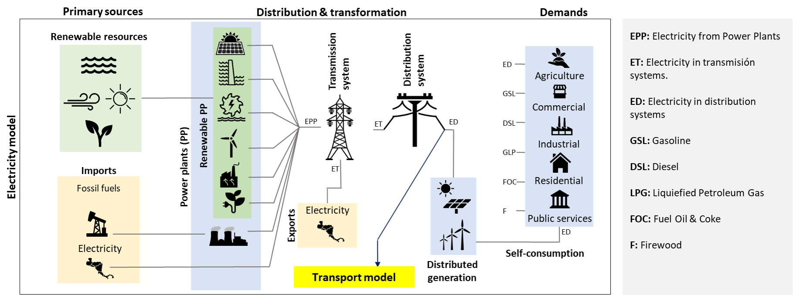
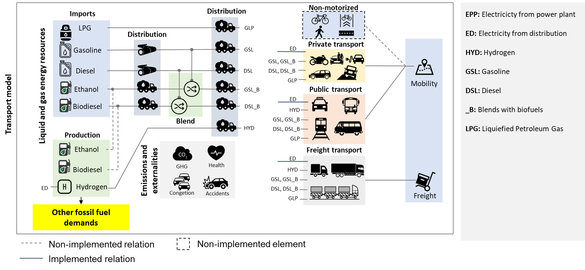
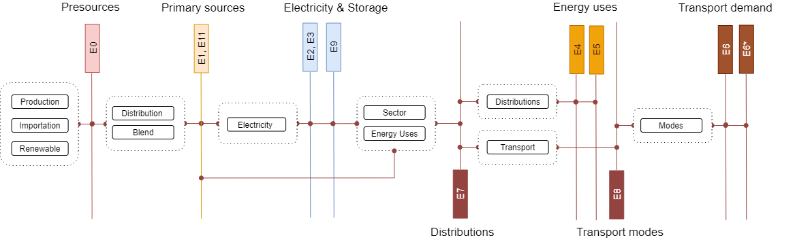
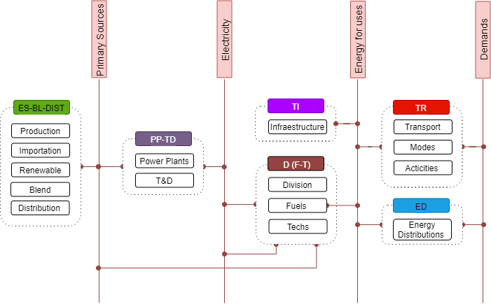

2. Energy model: Framework 
=======================================

This documentation has been created in order to provide an overview of OSeMOSYS-CR. Therefore, it presents the model structure, and gives a synthesis of the key assumptions of the model, regarding the numerical inputs used for the sets, parameters, and scenario building. First, in this section, we give an insight to the general framework of the model.

2.1 General model structure 
+++++++++

The Costa Rican energy sector is enterly modeled in OSeMOSYS. However, while the transport and electricity sectors are subject to linear optimization, other smaller demands, such as the firewood used in the residential sector or the coke consumption by industries, are only represented with trends to account for their possible greenhouse gases (GHG) contributions. The overall structure of the model can be represented by the reference energy system shown in Figure 2.1. The primary energy supply consists of four main sources: renewable, imports of fossil fuels, biomass and electricity imports. These sources are transformed in order to satisfy different demands including industrial, residential and commercial requirements, and the transport demands of passengers (public and private) and cargo (light and heavy). 

   *(a)*
   

   *(b)*
   
   *Figure 2.1: Simplified Reference Energy System of the Costa Rica model for the (a) Electricity and (b) Transport sectors*

In OSeMOSYS-CR, the connection between the electricity and transport sectors is crucial for understanding the technological transition of fossil-powered vehicles to other options with lower or zero carbon emissions. The next section describes the group of sets considered in OSeMOSYS-CR for representing the elements commented above. 

2.2 Sets 
+++++++++

The sets are responsible for defining the structure of the model (i.e. temporal space, geographic space, elements of the system, etc.). In OSeMOSYS, the group of sets include: years, fuels, technologies, emissions and modes of operation. As it going to be further explained, the sets are characterized through parameters. These subsections present the sets that compose the current version of OSeMOSYS-CR.  

2.2.1 Year
---------

This corresponds to the period of analysis. For OSeMOSYS-CR it is from 2015 to 2050. However, the data from 2015 to 2018 is set acccording to historical information. 

2.2.2 Fuels
---------

Figure 2.2 shows the different levels and transformations that the fuels (i.e. commodities) go through, and their relations with some technologies. Groups E0, E1, E3, E4, E5, and E6 are crucial elements of the current supply chain, while E8 and E9 are modeled for control purposes.  Groups E9, E10 and E11 complement the model to enable the inclusion of hydrogen and infrastructure.  

   *Figure 2.2: Simple diagram for fuel specification.*

Table 2.1 presents a synthesis of the groups of commodities, including a brief description and examples. 

*Table 2.1: Summary of fuels included in OSeMOSYS-CR's energy model.*

.. table:: 
   :align:   center
   
+-------+------------------------------------------+-------------------------------------------------------------------------------+
| Group | Descriptions                             | Examples                                                                      |
+=======+==========================================+===============================================================================+
| E0    | Pre-sources: Imports and fuel production | Import and production (fossil fuels and Biofuels), and their distribution.    |
+-------+------------------------------------------+-------------------------------------------------------------------------------+
| E1    | Primary sources (energy balance)         | Water, Wind, diesel, gasoline, biomass, and firewood.                         |
+-------+------------------------------------------+-------------------------------------------------------------------------------+
| E2-E3 | Electricity                              | Electricity from power plants to its distribution.                            |
+-------+------------------------------------------+-------------------------------------------------------------------------------+
| E4    | Electricity demand by sector             | Diesel for agriculture, firewood for residential, petroleum coke for industry.|
+-------+------------------------------------------+-------------------------------------------------------------------------------+
| E6-E6*| Transport demand                         | Private and public passenger transport, and light and heavy cargo transport.  |
+-------+------------------------------------------+-------------------------------------------------------------------------------+
| E7    | Distribution                             | Diesel for industry, LPG for heavy cargo transport, electricity for vehicles. |
+-------+------------------------------------------+-------------------------------------------------------------------------------+
| E8    | Transport managers                       | Fossil fuels for public transport, low carbon fuels for light freight.        |
+-------+------------------------------------------+-------------------------------------------------------------------------------+
| E10   | Infraestrucuture                         | Roads, rails, and bikeways.                                                   |
+-------+------------------------------------------+-------------------------------------------------------------------------------+
| E11   | Specific category for Hydrogen           | Produced hydrogen and ready to use.                                           |
+-------+------------------------------------------+-------------------------------------------------------------------------------+

See Annex for the whole list of fuels.

2.2.3 Technologies
---------

Different types of technologies (i.e. processes) are included in the model in order to represent the current supply chain and substitution possibilities. Figure 2.3 shows the different levels and transformation of technologies. 

   
   *Figure 2.3: Simple diagram for technologies specification.*
  
The groups of technolgies contemplated in OSeMOSYS-CR are described below:  

*	The first groups (ES, BL and DIST) are specially designed to model fossil fuels imports, production of biofuels, and the blend and distribution of them, considering the current pipe system for gasoline and diesel. 
*	The second group of blocks corresponds to the electric power system (PP and TD), that is mainly connected to renewable primary sources. 
*	The third level corresponds to civil infrastructure for mobility: TI and intermediate technologies for controlling the systems and divide the supply chains regarding fuels and technologies. 
*	TR technologies are dedicated to transport modelling and include blocks to study the modal shift. 
*	ED connects primary sources and demands that are not subject to the optimization process, but have GHG contributions.   

Table 2.2 presents a synthesis of the groups of technologies in OSeMOSYS-CR, including a brief description and examples. 

*Table 2.2: Summary of technologies included in OSeMOSYS-CR's energy model.*

.. table:: 
   :align:   center

+-----------+------------------------------------------+-------------------------------------------------------------------------------+
| Group     | Descriptions                             | Examples                                                                      |
+===========+==========================================+===============================================================================+
| ES-BL-DIST| Energy Sources                           | Imports and production (fossil fuels and biofuels), and their distribution.   |
+-----------+------------------------------------------+-------------------------------------------------------------------------------+
| PP-TD     | Power plants and the electric grid       | Hydro Power Plant, Transmission system, and distributed generation.           |
+-----------+------------------------------------------+-------------------------------------------------------------------------------+
| ST        | Sources                                  | Water, Wind, diesel, gasoline, biomass, and firewood.                         |
+-----------+------------------------------------------+-------------------------------------------------------------------------------+
| D(F-T)    | Division                                 | Diesel for Industry, LPG for heavy cargo transport, Electricity for vehicles. |
+-----------+------------------------------------------+-------------------------------------------------------------------------------+
| TI        | Transport infrastructure                 | Roads, rails, and bikeways.                                                   |
+-----------+------------------------------------------+-------------------------------------------------------------------------------+
| TR        | Transportation                           | Electric Light duty Vehicles, LPG Buses, bikes, low carbon techs for passenger|
+-----------+------------------------------------------+-------------------------------------------------------------------------------+
| ED        | Sources                                  | Water, Wind, diesel, gasoline, biomass, and firewood.                         |
+-----------+------------------------------------------+-------------------------------------------------------------------------------+

See Annex for the whole list of processes.

2.2.4 Emissions
---------

Table 2.3 shows a description of the emissions included in the model. In general, to quantify GHG contributions, the values are in terms of equivalent carbon dioxide (CO2e). 

*Table 2.3: Summary of emissions included in OSeMOSYS-CR's energy model.*

.. table:: 
   :align:   center
   
+-----------------+--------------------------------------------+
| Code            | Name                                       |                                                                 
+=================+============================================+
| CO2_sources     | Carbon Dioxide from primary sources        |                                                                      
+-----------------+--------------------------------------------+
| CO2_transport   | Carbon Dioxide from transport              |                                                                      
+-----------------+--------------------------------------------+
| CO2_AGR         | Carbon Dioxide from agriculture            |                                                                         
+-----------------+--------------------------------------------+
| CO2_COM         | Carbon Dioxide from the commercial sector  |                                                                         
+-----------------+--------------------------------------------+
| CO2_IND         | Carbon Dioxide from the industrial sector  |                                                                         
+-----------------+--------------------------------------------+
| CO2_RES         | Carbon Dioxide from the residential sector |                                                                         
+-----------------+--------------------------------------------+
| CO2_Freigt      | Carbon Dioxide from freigt transport       |                                                                         
+-----------------+--------------------------------------------+
| CO2_HeavyCargo  | Carbon Dioxide from heavy cargo            |                                                                         
+-----------------+--------------------------------------------+
| CO2_LightCargo  | Carbon Dioxide from light cargo            |                                                                         
+-----------------+--------------------------------------------+

In addition, with this set the model incorporates benefits resulting from the implementation of mitigation policies in the energy sector. These are:

* Health improvements of the population as a result of a reduction in GHG emissions.
* Reduction of congestion, which leads to an increase in the country's productivity.
* Reduction of accidents on the national roads.

2.2.5 Mode of operation
---------
    
The model has one mode of operation, Mode 1, for representing the normal operation of the system.

2.2.6 Region
---------
    
The model has a nationwide scope, therefore it only has one region: Costa Rica (CR). 
  
