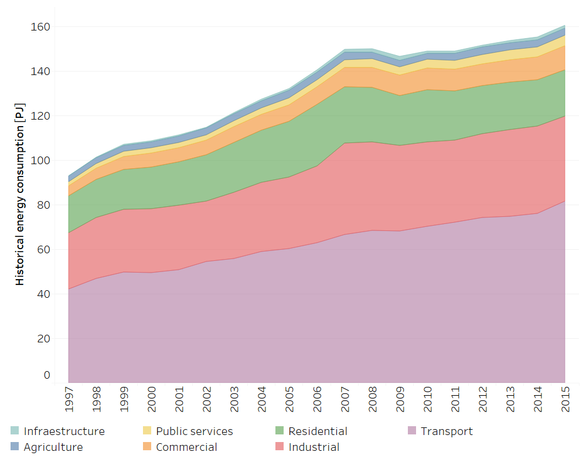
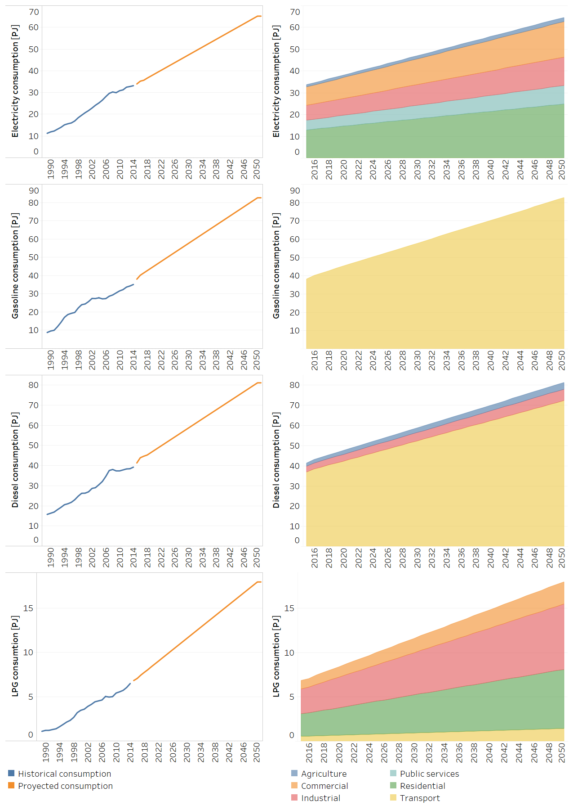
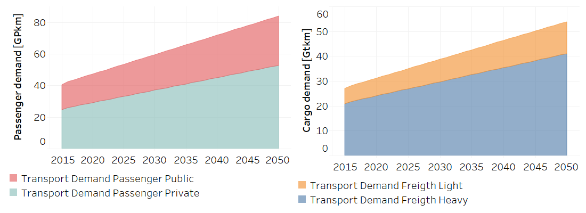
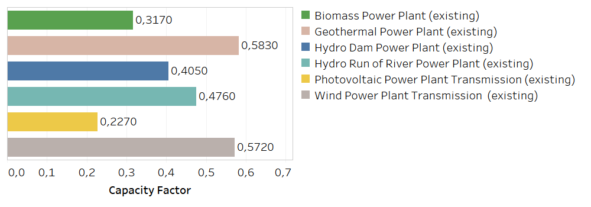
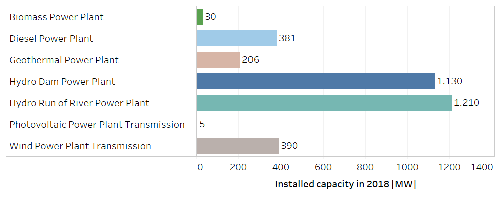
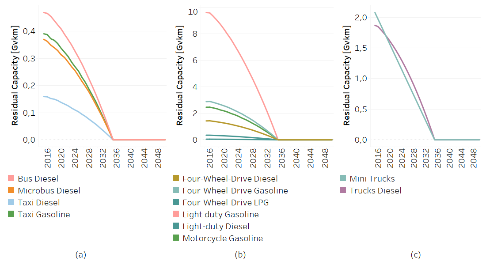
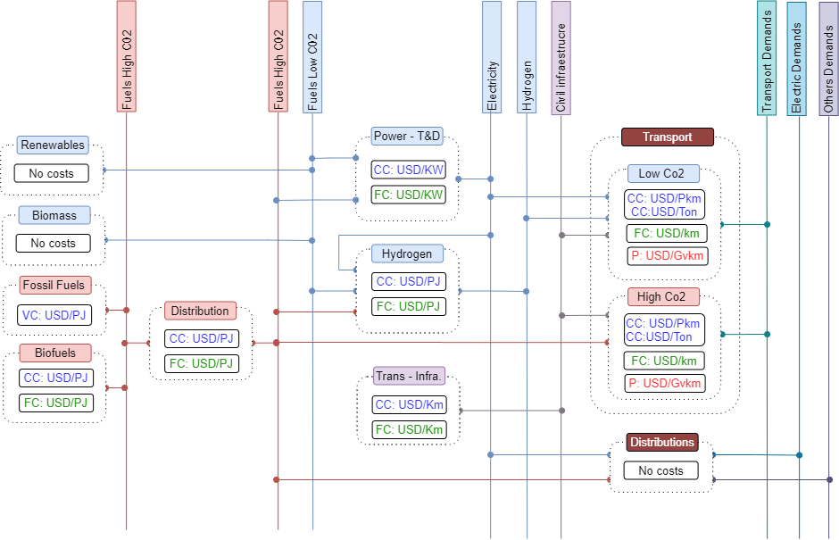
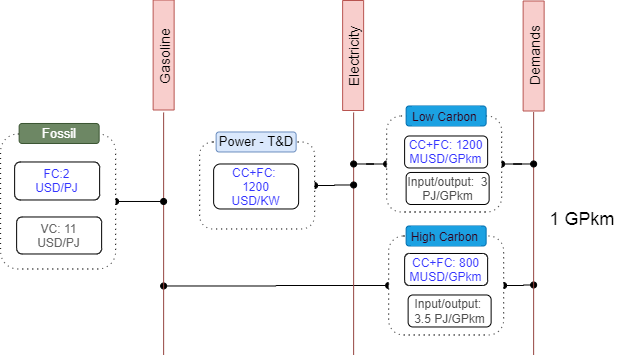

3. Energy model: Data inputs
=======================================
This section presents the main databases explored for building OSeMOSYS-CR, and the way the information was processed in order to introduce it to the model. 

3.1 Main data sources
+++++++++

3.1.1 Energy balance of Costa Rica
---------

The energy balance is the most important source of data for the energy model of OSeMOSYS-CR, which is prepared by the Secretariat of Planning of the Energy Subsector (SEPSE). The analysis gathers and processes data from institutions such as the Costa Rica Institute of Electricity (ICE), the Costa Rican Petroleum Refinery (RECOPE) and the National Center of Energy Control (CENCE). The information is usually presented annually with excel books and a SANKEY diagram. In Costa Rica, the fossil fuels are completely imported, and the electricity is generated almost completely with renewable sources :cite:`SEPSE2016`.

Figure 3.1 presents the historical trending of energy consumption by sector. 

   
   *Figure 3.1: Historical energy consumption by sector in Costa Rica* :download:`. <doc_imgs/Historical_Consumption_Data.csv>`
   
 

3.1.2 Other key databases 
---------

In the model, all fuels and technologies are incorporated to OSeMOSYS taking into account other sets, such as temporary divisions and emission, as well as the parameters. The latter are classified, among others, into costs, activity levels and infrastructure capacities. The establishment of these parameters was done after processing and reviewing the available national energy data. Table 3.1 summarizes the main souces of data for OSeMOSYS-CR. 

*Table 3.1: Main data sources used in OSeMOSYS-CR.*

.. table:: 
   :align:   center
+--------------+------------+--------------------------+------------------------------------------------------------------------------+
| Category     | Source     | Data                     | Descriptions and assumption made                                             |
+==============+============+==========================+==============================================================================+
| Energy       | SEPSE      | Energy balance           | It is used to build the structure of the energy system, time-series of energy|
| System       |            |                          | consumption from 1989 to 2017 and forecasted with ARIMA models.              |
+--------------+------------+--------------------------+------------------------------------------------------------------------------+
| Demand       | SEPSE      | Final energy             | End-use information by sectors: industry, transport, households, services and|
|              |            |                          | agriculture.                                                                 |
+              +------------+--------------------------+------------------------------------------------------------------------------+
|              | SEPSE      | Transport                | It includes load factors, vehicle fleet, and energy consumption, efficiencies|
|              | RITEVE     | (passengers and cargo)   | and annual kilometers. We combine international standard data of technologies|
|              | MOPT       |                          | with national records. Technological groups are defined to study modal change|
|              | ETSAP      |                          | and fuel use. Non-motorized mobility is considered zero in the base case.    |
+--------------+------------+--------------------------+------------------------------------------------------------------------------+
|Electricity   | ICE        | Capital and fixed costs  | Based on national data. The costs were assumed constant in the whole period, |
|technologies  | Bloomberg  |                          | except for solar and wind systems, which decrease according to international |
|              | IEA        |                          | trends. Residual capacity is constant.                                       |
+              +------------+--------------------------+------------------------------------------------------------------------------+
|              | ICE        | Capacity and activity    | Based on the operational performance registered by the National Energy       |
|              |            |                          | Control Centre. Operational life is according to national plans.             |
+--------------+------------+--------------------------+------------------------------------------------------------------------------+
|Transport     | Hacienda   | Capital and fixed costs  | Based on the Ministry of Finance (Hacienda) database. We assumed that cost of|
|technologies  | Bloomberg  |                          | electric vehicles decreases (Bloomberg). For cargo transport, we review cost |
|              | Companies  |                          | of companies like Nicola and Tesla.                                          |
+              +------------+--------------------------+------------------------------------------------------------------------------+
|              | SEPSE      | Capacity and activity    | Based on the performance register by national surveys, concession for public |
|              | RITEVE     |                          | transport and the annual Vehicle technical review (RITEVE). Operational life |
|              | MOPT       |                          | is according to manufacturers and the residual capacity decreases linearly   | 
|              |            |                          | and proportionally with this value.                                          |
+--------------+------------+--------------------------+------------------------------------------------------------------------------+
|Fuel prices   | RECOPE     | Fossil Fuels and Biofuels| Based on current tariffs and projection uses in national plans. It considers |
|              | IEA        |                          | international prices and the tariff given by the regulator in Costa Rica     |
|              | ARESEP     |                          | (ARESEP) and trend provide by international Energy Agency (IEA).             |
+              +------------+--------------------------+------------------------------------------------------------------------------+
|              | ICE        | Electricity              | Base of the average of national tariffs and projections.                     |
|              | ARESEP     |                          |                                                                              |
+              +------------+--------------------------+------------------------------------------------------------------------------+
|              | SEPSE      | Biomass                  |  Not included. It is produced and consumed locally.                          |
+              +------------+--------------------------+------------------------------------------------------------------------------+
|              | ETSAP      | Hydrogen                 | Based on data published by ETSAP.                                            |
+--------------+------------+--------------------------+------------------------------------------------------------------------------+
|Infraestrucure| ICE        | Plants and power grid    | Based on Transmission and generation national plans. It assumes losses of 4% |
|              |            |                          | from the bulk transmission system and 6% for distribution. Charging          |
|              |            |                          | infrastructure is not included.                                              |
+              +------------+--------------------------+------------------------------------------------------------------------------+
|              | RECOPE     | Pipeline and road        | Based on national reports, we consider the current infraestructure does not  |
|              |            | distribution             | grow (gasoline and diesel). It includes new infrastructure for LPG. The model|
|              |            |                          | includes natural gas but is not used.                                        |
+              +------------+--------------------------+------------------------------------------------------------------------------+
|              | ETSAP      | Hydrogen                 | Consider local production, road transport and supply stations.               |
+--------------+------------+--------------------------+------------------------------------------------------------------------------+
| Sustainable  | MINAE      | Urban plans and mobility | Regarding the Integrated Public Transport System, the cost consideration come|
| mobility     | MOPT       |                          | from  Costa Rican Railways Institute (INCOFER) and MOTP studies.             |
|              | INCOFER    |                          |                                                                              |
+--------------+------------+--------------------------+------------------------------------------------------------------------------+
| Cargo        | MINAE      | Electric cargo train and | Costs  from national reports and demand based on expert criteria given in the|
| transport    | MOPT       | Logistic                 | participatory process.                                                       |
|              | INCOFER    |                          |                                                                              |
+--------------+------------+--------------------------+------------------------------------------------------------------------------+
| Emissions    | IPCC       |  Factors                 | Based on the IPCC and the national GHG inventory.                            |
+--------------+------------+--------------------------+------------------------------------------------------------------------------+
| Co-benefits  | PEN        | Coefficients             | It considers coefficients for health congestion and accidents by State of the|
|              | IMF        |                          | Nation Project (PEN) and International Monetary Fund (IMF)                   |
+--------------+------------+--------------------------+------------------------------------------------------------------------------+

The following sections presents the data incorporated in the paramters of OSeMOSYS-CR. This section presents mainly the information for used for establishing the base escenario of the model, and characterizing the commodities and processes included in the model. 

3.2 Global parameters
+++++++++

These parameters affect directly other parameters. 

3.2.1 Year split
---------

Costa Rica regularly has 5 months of dry season, and 6 months of rainy season, with two months of transition. The ltter in OSeMOSYS-CR are evenly distributed in both *times lices*. Therefore, the model uses de values presented in Table 3.2. 

*Table 3.2: Year split values in OSeMOSYS-CR.*

.. table:: 
   :align:   center
+--------------+---------------------+
| Timeslice    | Year split value    |                                              
+==============+=====================+
| DRY          |      0.42           |
+--------------+---------------------+
| RAINY        |      0.58           |               
+--------------+---------------------+

3.3 Demands
+++++++++

Based on the historical data of the energy balance, the demand projections were developed by using ARIMA models. These models are one of the most widely used approaches for time series forecasting. They correspond to simple univariate models focused on the long trend trajectory of the different time series. Their general structure is shown below:

General equation: 

.. math::

   \phi \left(B\right){\phi}_s\left(B\right)Z_t=\mu +\theta \left(B\right){\theta }_s\left(B\right)a_t
   
Simple delays: 
 
.. math::

   \phi \left(B\right)=1-{\phi }_1B-{\phi }_2B^2-...-{\phi }_pB^b\ \wedge \ \ \phi \left(B\right)=1-{\phi }_{1s}B^s-{\phi }_{2s}B^{2s}-...-{\phi }_{Ps}B^{Pb}
   
.. math::
   
   \theta \left(B\right)=1-{\phi }_1B-{\phi }_2B^2-...-{\phi }_qB^q\wedge \ \theta \left(B\right)=1-{\phi }_{1s}B-{\phi }_{2s}B^{2s}-...-{\phi }_{Qs}B^{qs}

where *ϕ* corresponds to operators, *μ* is the media  of *ϕ*, *θ* is a coefficient, and *s* is a stational component. 

This forecasting model gives good approximations of the data registered by institutions. The estimation begins with the analysis and forecasting of the time series corresponding to the primary sources. With these long term values, a specific trend is fixed by using the shares defined in the base year. A Hierarchical process was develop considering that the shares by each sector are the same on the base year. Figure 3.2 shows the general results of the projections and general annual demands.

   
   *Figure 3.2: Forecasting demands introduce to the model* :download:`. <doc_imgs/Historical_Consumption_Data.csv>` 
   
In order to estimate the demands of the transport sector, an additional calculation is required, but the previously projections of energy consumption for transport (by fuel) are used as base. Using this variable allows to have a systematic monitoring of the supply chain. Another crucial variable is the relation between energy consumption and the annual average distance travelled by each group of technologies. The general equations for the estimation are shown below:

.. math::
   
   Passenger=\sum_{Techs}{\frac{Energy\ Consumption\ \left(PJ\right)}{Efficiency_{CR}\left(\frac{Gkm}{PJ}\right)}*Load\ Factor\ (P)\ } 
     
.. math::
   
   Cargo=\sum_{Techs}{Energy\ Consumption\ \left(PJ\right)*Efficiency_{CR}\left(\frac{Gkm}{PJ}\right)*Load\ Factor\ (\frac{Ton}{v} )}
   
where: 

.. math::
   
   Efficiency_{CR}={\left.\left\{Fleet\left(V\right)*annual\ distance\ \left(km\right)\ /\ energy\ consumption(PJ)\right.\right\}}_{2015}

Now, we are considering that this relation defined in the base year will be constant, assuming a no-policy scenario and taking into account that this data concentrates the efficiency of the road system and technologies. For more details, see the documentation of the **InputActivityRatio** parameter.   

As a short example, the calculation of the demand for the gasoline light duty vehicles (TD_LDGSL) in the 2015 year, is shown below: 

.. math::
   
   {TD\_LD}_{GSL}=\left[Energy\right]\left(PJ\right)*\left[Efficiency\right]\left(\frac{Vkm}{PJ}\right)*\left[LoadFactor\right]\left(\frac{P}{V}\right)
   
where:

.. math:: 

   Energy = CR\ gasoline\ consumption\ \left(PJ\right)* \%\ consumed\ by\ light\ duty\ (pu), 
   
   
.. math:: 

   Efficiency = {\left(\frac{Annual\ Average\ distance\ traveled\ by\ light\ duty*light\ duty\ fleet\ \ \ }{Energy\ consumption\ by\ all\ light\ duty}\right)}_{base},
   
   
.. math::

   LoadFactor=ocupancy\ rate\ for\ light\ duty.
   
Therefore: 

.. math::

   {TD\_LD}_{GSL}=\left[21.88\ PJ*0.56\right]\ *\left[\frac{14773\ km*611324\ V}{21.88\ PJ}\right]*\left[\frac{1.5\ P}{V}\right]=13.5\ Gpkm

This similar process was developed for every transport technology during all the years included in the analysis. In the process, the energy consumption changes according to the projection. The final calculation of the demands is presented in the figure 3.3. 

   
   *Figure 3.3: Transport demands introduce to the model* :download:`. <doc_imgs/Transport Demand.csv>`  

The demands are introduced in two different parameters: 

* Specified Annual Demand and Specified Demand Profile. 
* Or we used the Accumulated Annual Demand, when the data corresponding to the profiles was unavailable. 

3.3.1 Specified Annual Demand
---------
According to the procedure explained above, this is used for the electricity and transport sectors. It contains the total annual demand.

3.3.2 Specified Annual Demand
---------
According to the procedure explained above, this is used for the electricity and transport sectors. It represents the way this demand is distributed throughout the time slices. In OSeMOSYS-CR, this distribution is incorporated proportional to the duration of each time slice (i.e. 0.42 and 0.58 for dry and rainy season, respectively). 

3.3.3 Acummulated Annual Demand
---------

For the current model, the energy demands -different to electricity and transport- are assumed as constant throughout the years. The next demands are introduced in this parameter:
 
*	Industrial: Diesel, Fuel oil, Firewood, LPG, Biomass, and Petroleum coke.
*	Commerce: Firewood, and LPG.
*	Agriculture: Diesel.
*	Residential: Firewood, and LPG.

3.4 Performance
+++++++++

3.4.1 Capacity To Activity Unit
---------

This parameter allows to relate the capacity and activity level of the technologies. For this model, this parameter is used to introduce the relation between power and energy of the electricity sector. Therefore, we convert the GWh to PJ, understanding that if 1 GW is constant throughout the year, the corresponding energy is 31,536 PJ

For other sectors, we assume a default value equal to 1, as the calculation is related only to energy.

3.4.2 Capacity Factor
---------

The capacity factor is mainly used for representing electricity generation. In this case, historical data from 2011 to 2017 was the base to define the average value for every group of plants. Figure 3.4 shows the values of capacity factors for 2015. For solar and wind power plants another possibility is to use some tools like renewable ninja. 

    
   *Figure 3.4: Capacity factor for plants* :download:`. <doc_imgs/CapacityFactor.csv>`  
   
3.4.3 Availability Factor
---------

This value corresponds to the time that each technologies is available. OSeMOSYS-CR uses 0.9 for power plants (assuming a 0.1 portion of the time for maintenance works and reliability). For the transport sector, the model uses 1, since the vehicle fleet and the modes of mobility are distributed in the whole region and a combination of them can be used.

3.4.3 Operational Life
---------

For this parameter, at the moment, the model employs a set of values used by KTH. In general, the most important investments have an operational life greater than the period of analysis. Table 3.3 shows the data used in the model. 

*Table 3.3: Summary of operational lifes used in the model.*

.. table:: 
   :align:   center

+-----------------------------+-----------------------------+-----------------------------+
| Electricity sector          | Transport sector            | Infraestructure             |
+---------------------+-------+---------------------+-------+---------------------+-------+
| Technologies        | Value | Technologies        | Value | Technologies        | Value |
+=====================+=======+=====================+=======+=====================+=======+
| Hydro dam           | 80    | Light duty          | 15/12 | Electric grid       | 50    |
+---------------------+-------+---------------------+-------+---------------------+-------+
| Hydro Run off river | 60    | 4WD                 | 10/12 | Pipeline system     | 50    |
+---------------------+-------+---------------------+-------+---------------------+-------+
| Biomass Power Plant | 25    | Motorcycle          | 11/12 | Biofuel production  | 50    |
+---------------------+-------+---------------------+-------+---------------------+-------+
| Geothermal Power P. | 40    | Minivan             | 15/12 | H2 production       | 50    |
+---------------------+-------+---------------------+-------+---------------------+-------+
| Solar Distribution  | 20    | Buses               | 15/12 |                     |       |
+---------------------+-------+---------------------+-------+---------------------+-------+
| Solar transmission  | 40    | Micro buses         | 15/12 |                     |       |
+---------------------+-------+---------------------+-------+---------------------+-------+
| Wind Distribution   | 20    | Taxis               | 10/12 |                     |       |
+---------------------+-------+---------------------+-------+---------------------+-------+
| Wind transmission   | 40    | Pickup truck        | 15/12 |                     |       |
+---------------------+-------+---------------------+-------+---------------------+-------+
| Thermal             | 25    | Trucks              | 15/12 |                     |       |
+---------------------+-------+---------------------+-------+---------------------+-------+

3.4.4 Residual Capacity
---------

The residual capacity expresses the capacity that already exists in the first year of analysis. The considerations regaring the electricity and transport sectors are presented below: 

* Electricity sector: As the most relevant plants in Costa Rica (especially Hydropower) have been recently improved in order to extend their operational life, the existing capacity in 2018 does not decrease through all the period of analysis. Figure 3.5 shows the reference values for 2018.

   
   *Figure 3.5: Installed capacity in the Costa Rican power system (based on CENCE)* :download:`. <doc_imgs/InstalledCapacity.csv>` 
   
* Transport sector: This calculation was made taking into account the vehicle fleet in 2015, the transport demand by sector and a decreasing number of vehicles proportional to the operational life. Figure 3.6 presents how the capacity of the current fleet is reduced over the years.   

   
   *Figure 3.6: Residual capacities for (a) public, (b) private and (c) cargo transport* :download:`. <doc_imgs/ResidualCapacity.csv>` 

3.4.5 Input Activity Ratio
---------

This value is key for building the structure of model, since it connects the fuels and technologies (i.e. it represents all the inputs each technology needs). Usually, it is referred as the inverse of the efficiency of the process (if the Output Activity Ratio parameter is 1). 

In the case of the electricity sector, most part of the power plants are connected to renewable sources. Therefore it has been assumed a relation 1:1. With the exception of thermal plants, that are directly dependent of their variable cost (i.e. fuel). For the transmission and distribution grid, values proportional to losses (4% and 6%) were introduced. Table 3.4 shows the data used in OSeMOSYS-CR.

*Table 3.4: Summary of input activity ratio for electric sector.*

.. table:: 
   :align:   center

+--------------------------------+----------------------+---------+
| Input sources                  | Technology group     | Value   |
+================================+======================+=========+
| Water, solar, wind, geothermal | Renewable power plant| 1.000   |
+--------------------------------+----------------------+---------+
| Diesel                         | Thermal power plant  | 2.857   |
+--------------------------------+----------------------+---------+
| Fuel oil                       | Thermal power plant  | 2.174   |
+--------------------------------+----------------------+---------+
| Electricity from power plants  | Transmission grid    | 1.040   |
+--------------------------------+----------------------+---------+
| Electricity from transmission  | Distribution grid    | 1.060   |
+--------------------------------+----------------------+---------+

For the transport sector, the input activity ratio corresponds to the relation between the energy consumption (in Joules) by technologies and the demand (in vkm, pkm or tkm). As a first reference, values taken by organizations such as ETSAP or manufactures are considered. Regarding Costa Rican data, the requirements are: energy consumption by the transport sector, number of vehicles in the fleet and annual average distance by category. The efficiency can be expressed as MJ/km, or MJ/pkm if the load factor (i.e. number of passagers, *p*, per vehicle) is included. The importance of using the load factor is that it eases the incorporation of modal change by unifying the demand.

The general equation for calculating the input activity ratio in passenger transportation tecnologies in OSeMOSYS-CR is: 

.. math::

   {\varepsilon}_{CR}={\left(\frac{Energy}{Fleet*distance}\right)}^{-1}\left(\frac{km}{MJ}\right) = {\left(\frac{Energy}{Fleet*distance*passenger}\right)}^{-1}\left(\frac{pkm}{MJ}\right)

The next example, Table 3.5, shows how to recalculate the efficiencies of two types of technologies: current and new technologies. Here, we use the example of gasoline light duty vehicles. The procedure consists of using the estimation based on the national relation and the proportion provided by one reliable source (in this cases, a data set by the KTH based on ETSAP). 

*Table 3.5: . Recalculation of the input activity ratio .*

.. table:: 
   :align:   center

+-------------------+-------------------+------------------------+-------------------------------+----------------------+
| Technology        | KTH-ETSAP (MJ/km) | KTH-ETSAP (proportion) | CR data: (ECR_LDV)-1  (MJ/km) | Recalculated (MJ/km) |
+===================+===================+========================+===============================+======================+
| LDV_GSL (current) | 3.78 (base)       | 1.000                  | 2.420                         | 2.42                 |
+-------------------+-------------------+------------------------+-------------------------------+----------------------+
| LDV_GSL (New)     | 2.06              | 0.550                  |                               | 1.33                 |
+-------------------+-------------------+------------------------+-------------------------------+----------------------+

In this case, the data corresponding to the current vehicles is assumed equal to the national data. The data for new technologies is proportional to the relation estimated. As the relation between distance and energy consumption is a control variable that combines the efficiency of technologies and the road system, the value will be kept constant. This is done considering that the efficiency of the technologies will improve, while the conditions of the system will decrease. 

3.4.5 Output Activity Ratio
---------

This parameter works together alongside with the InputActivityRatio. Since the efficiency is stablished in the input, the OutputActivityRatio value is always 1. Therefore, its funciton in OSeMOSYS-CR is to connect the structure of the model.   

3.5 Technology costs
+++++++++

Figure 3.7 shows the relation included in the model regarding costs. Usually, the capital and fixed costs are related with the capacity and the variable cost is linked to the activity level. The diagram shows what parameters are used for each group of technologies.  

   
   *Figure 3.7: Cost chains of OSeMOSYS-CR, where CC: Capital Cost, VC: Variable Cost, FC: Fixed Cost and P: Penalty.* 
   
In order to understand the cost flow, that the model follows in order to satisfy a specific demand, a brief example is presented in Figure 3.8. The figure includes the relation between the electric grid, the pipe system and the vehicles for one year. 

   
   *Figure 3.8: Brief example of the cost chain of the model.* 
   
In this example, we have two ways to satisfy 1 Gpkm: electricity and fossil fuels. We are not taking into account the depreciation in this example. The activity and capacity for the transport sector is the same, while for the electricity sector the Capacity-to-activity unit (31.536) is used. The general, equation is: 

.. math::

   TotalCost=\sum_{Techs}{\left(Capital\ cost+fixed\right)*\left[capacity\right]+\left(cost\ variable\ cost\right)*[activity]}.
   
Electricity supply: 

.. math::

   Vehicle=\left(1200\ \frac{MUSD}{GPkm}\right)*\left[1GPkm\right]=1200\ MUSD, \\
   
.. math::

   Power\ -T\&D=\left(1200\ \frac{MUSD}{GW}\right)*\left[1GPkm*3\frac{PJ}{GPkm}*\frac{1}{\mathrm{31.536}}\frac{GW}{PJ}\right]=114\ MUSD, \\
   
.. math::

   Total\_electric=1200\ MUSD+114\ MUSD=1314\ MUSD. \\
   
Fossil Fuels supply: 

.. math::

   Vehicle=\left(800\ \frac{MUSD}{GPkm}\right)*\left[1GPkm\right]=800\ MUSD, \\
   
.. math::

   Fuel=\left(2+11\frac{MUSD}{PJ}\right)*\left[1GPkm*3.5\frac{PJ}{GPkm}\right]=45.5\ MUSD,\ \\
   
.. math::

   Total\_fossil=1200\ MUSD+114\ MUSD=845\ MUSD. \\

In this example, the fossil fuel chain is cheaper than the electricity-based solution. Additional conditions must be added, such as: the depreciation and variations in the costs.  The next sections present the data used for the costs in the model.  

3.5.1 Capital Cost
---------

Regarding the transport sector, the  capital cost information is based on information from the Ministry of Finance of Costa Rica  (Hacienda). OSeMOSYS-CR assumes that the cost of electric vehicles decreases according to information from Bloomberg. For cargo transport, the model incorporates cost data from companies like Nicola and Tesla. The following equation shows how the capital cost is calculated:

.. math:: 

   Capital\ cost=cost\ of\ vehicle\ \left(\frac{USD}{vehicle}\right)/effiecency\left(\frac{km}{year}\right)/LF\left(\frac{Passenger}{vehicle}\right)
   
For the electricity infraestructure such as power plants, the model uses information from the Costa Rican Institute of Electricity, ICE. 
   
3.5.2 Fixed Cost
---------

For the transport tecnologies, at the moment, the model uses information from a data set by the KTH based on ETSAP. The distribution of fossil fuels is  parameterized with information from the Costa Rican Petroleum Refinery. On the other hand, the electricity distribution uses information from the Costa Rican Institute of Electricity, ICE.

3.5.3 Variable Cost
---------

The variable cost in the model is mainly used for representing the imports of fossil fuels with trends set by the International Energy Agency (IEA).

3.6 Emissions
+++++++++

3.6.1 Emission Activity Ratio
---------

This aspect of the model was parameterized with the National GHG Inventory. 

3.6.2 Emission Penalty
---------

To estimate the impact of an improved transport system, we assign an externality cost to each technology representing a vehicle. In sum, a decarbonization scenario has lower externality costs in comparison to a baseline, since the activity of transport technologies decrease. We evaluate the following aspects that are monetized: less traffic jams, fewer accidents and reduced negative impacts of pollution on health.

The externality costs from the impacts of pollution per unit of activity are obtained using data from the PIMUS report :cite:`PIMUS`. PIMUS assigns a cost per ton to three pollutants: NOx, SOx and PM10. To be applicable for the model, we estimate an externality cost per vehicle-kilometer traveled (vkm). The PIMUS report has emission factors per distance traveled and takes as reference the Grütter Report to estimate the vkm per vehicle type. To match the categories of the model, the following assumption is considered:

*	The emission categories of the PIMUS report are disaggregated per emission control type and fuel. Since the model is only disaggregated by fuel type, factors for vehicle types with the same fuel are averaged.

The cost of the emissions is presented in Table 3.6. 
 
*Table 3.6: Externalities associated to health caused per vehicle type [MUSD/Gvkm].*

.. table:: 
   :align:   center
   
+------------------------------------------+----------+----------+----------+----------+
| .                                        | NOX      | SOX      | PM10     | Total    |
+==========================================+==========+==========+==========+==========+
| Light Duty Passenger Vehicles-Gasoline   | 2.66     | 0.37     | 0.28     | 3.31     |
+------------------------------------------+----------+----------+----------+----------+
| Light Duty Passenger Vehicles-Diesel     | 1.84     | 1.40     | 4.23     | 7.48     |
+------------------------------------------+----------+----------+----------+----------+
| Light Freight                            | 2.38     | 1.97     | 4.99     | 9.33     |
+------------------------------------------+----------+----------+----------+----------+
| Minibus                                  | 13.74    | 5.10     | 9.69     | 28.53    |
+------------------------------------------+----------+----------+----------+----------+
| Heavy Duty (Heavy Freight and Buses)     | 22.03    | 7.19     | 32.54    | 61.75    |
+------------------------------------------+----------+----------+----------+----------+
| Gasoline Motorcycles	                   | 0.83     | 0.11     | 7.90     | 8.84     |
+------------------------------------------+----------+----------+----------+----------+

For congestion, the PEN states that the annual cost is equivalent to 2.5 USD Billion, whereas PIMUS calculates 691 USD Million. The latter uses factors per vkm that try to capture the cost of the lost productivity, higher maintenance and stress, whereas the first estimated the change in time of congested roadways against non-congested ones per county and multiplied it by an average income (representing the lost productivity). Since the methodologies are different, we pick the factor based on the vkm variable, since time is not accounted for in the model. The estimates of PIMUS are based on the Victoria Transport Policy Institute bibliography as well as the Grütter report. The values used are shown in Table 3.7. 

*Table 3.7: Externalities associated to congestion caused per vehicle type [MUSD/Gvkm].*

.. table:: 
   :align:   center
   
+-----------------------+------------------------------+
| Technology            | Externality cost [MUSD/Gvkm] | 
+=======================+==============================+
| Light Duty Vehicles   | 46                           | 
+-----------------------+------------------------------+
| Minivan               | 46                           |
+-----------------------+------------------------------+
| SUV                   | 168.1328377                  |
+-----------------------+------------------------------+
| Taxi                  | 46                           |
+-----------------------+------------------------------+
| Minibus               | 46                           |
+-----------------------+------------------------------+
| Bus                   | 90                           |
+-----------------------+------------------------------+
| Light Freight         | 90                           |
+-----------------------+------------------------------+
| Heavy Freight         | 90                           |
+-----------------------+------------------------------+
| Motorcycles           | 46                           |
+-----------------------+------------------------------+

The PIMUS report states that one death costs (CD) 738,130 USD and the cost of an injury (CI) is 179,260 USD. We also review the Statistical Book of COSEVI for 2017 to obtain the number of deaths and injuries per vehicle type: motorcycle, light duty vehicle and minibus or bus :cite:`COSEVI`. We do not consider accidents for light and heavy freight for the lack for the lack of public statistics. We use the equation 1 to define the factor per vkm for each vehicle type (vt).

.. math:: 

   Factor(vt) = \frac{Deaths(vt)*CD*kD + Injuries(vt)*CI*kI)}{Gvkm (vt)}.

To complete the equation, we use the Gvkm stated in the PIMUS report. Nonetheless, since the Gvkm in PIMUS are for the Great Metropolitan Area, we adjust the cost of the deaths and injuries with the factors kD and kI , respectively, to avoid over-penalization :cite:`PIMUS`.  Table 3.8 shows the results.  

*Table 3.8: Externalities associated to accidents caused per vehicle type [MUSD/Gvkm].*

.. table::
   :align:   center
   
+---------------------+------------------------------+
| Technology          | Externality cost [MUSD/Gvkm] | 
+=====================+==============================+
| Light Duty Vehicles | 91.64                        | 
+---------------------+------------------------------+
| Minivan             | 91.64                        |
+---------------------+------------------------------+
| SUV                 | 91.64                        |
+---------------------+------------------------------+
| Taxi                | 91.64                        |
+---------------------+------------------------------+
| Minibus             | 101.87                       |
+---------------------+------------------------------+
| Bus                 | 101.87                       |
+---------------------+------------------------------+
| Motorcycles         | 635.24                       |
+---------------------+------------------------------+
