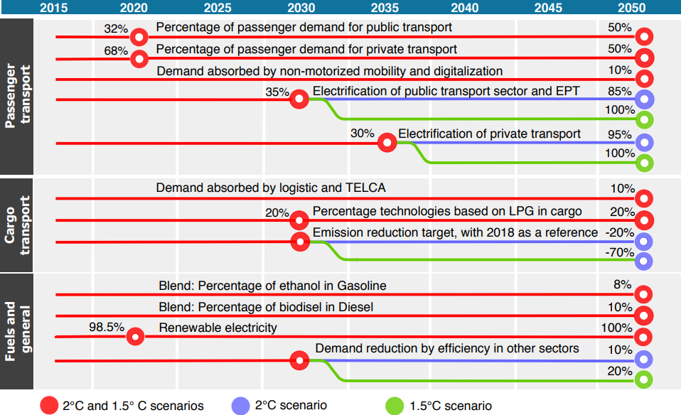
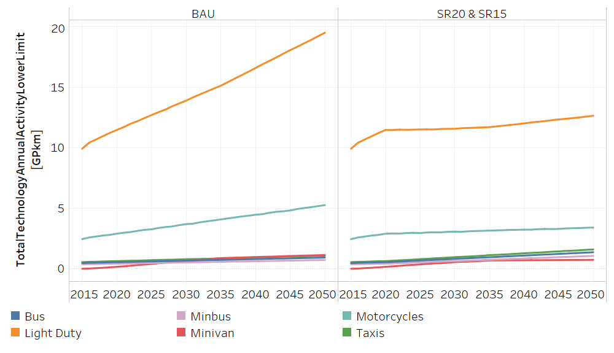
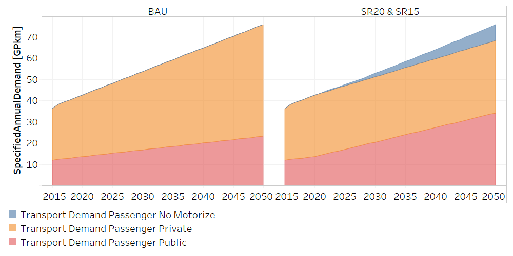
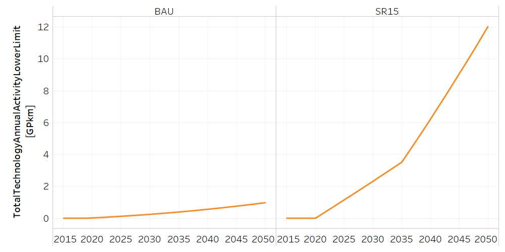
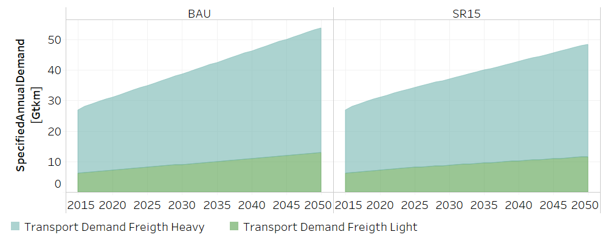
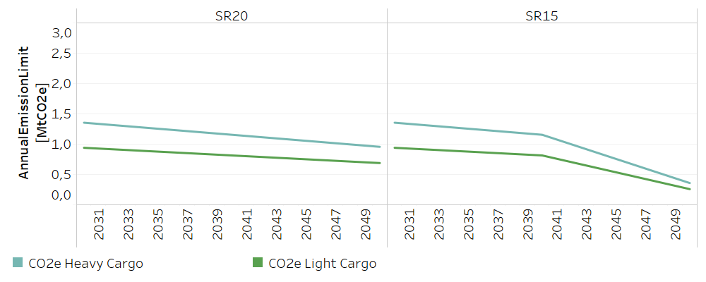

4. Energy model: Scenario building
=======================================

OSeMOSYS-CR started by estimating a base case, and subsequently, including the effect of a set of policies defined by stakeholders in two levels of decarbonization. This exercise allowed the creation of three different scenarios: 

(i) A Business-as-usual (BAU) scenario, that represents the behavior of the emissions without considering public policy interventions (i.e. following the historic trends). 
(ii) A 2°C scenario, compatible with the 2015 NDC's goals of Costa Rica. 
(iii) A 1.5°C that is compatible with a goal of net zero emissions by 2050.

The BAU scenario considers that the energy consumption, economic activity and population grow according to the historical trends. This scenario incorporates the electricity generation expansion plan from the Costa Rican Electricity Institute to represent the development of the electricity sector :cite:`ICE2019`. It also includes a moderate penetration of solar and wind generation, distributed generation for self-consumption, prived electric vehicles and electric public transport (buses). In terms of emissions, this scenario does not have a significant change in relation to the trend trajectory. 

The 2°C and 1.5°C scenarios consider that the social and economic situation described in the BAU scenario remains the same. However, they incorporate the political objectives generated through stakeholder engagement and the participatory process. The main strategies in the 2° and 1.5° scenarios are focused in *i)* urban planning and mobility, *ii)* switching fossil fuel technologies, and *iii)* switching energy carriers. Figure 4.1 sumarizes the main aspects of each scenario. 

   
   *Figure 4.1: Scenarios in OSeMOSYS-CR.*
   
The following sections describe how the considerations in Figure 4.1 were introduced in the model. 
 
4.1 Passenger Transport
+++++++++

* **Mode shift between public and private passengers demands:** OSeMOSYS-CR uses changes in the levels of activity from private to public transport with a target by 2050. Load factors, distances, and efficiencies are similar to BAU. Figure 4.2 shows how this is incorporated in the model with the *Total Technology Annual Activity LowerLimit* parameter. 

   
   *Figure 4.2: Mode shift from public to private transport technologies in OSeMOSYS-CR* :download:`. <doc_imgs/ModeShift.csv>`

* **Non-motorized mobility and digitalization:** The transition is carried out by a linear reduction of the demand in private and public transport from 2022 to 2050, and an increasing demand of non-motorized mobility. The cost of the infrastructure was embedded with the mode shift. In terms of the digitalization, we do not consider costs due to the existing and growing communication infrastructure of the country. Figure 4.3 presents this changes in the demand from the *Specified Annual Demand* parameter. 

   
   *Figure 4.3: Changes in the demand in BAU, SR15 and SR20 scenarios* :download:`. <doc_imgs/Transport Demand_Scenarios.csv>`

* **Electrification private and public sectors:** Similar to the mode shift, we parametrized an adoption curve considering targets by 2035, and 2050. The procedure consists of introducing a level of activity for low-carbon technologies while the proportions of the other groups of technologies are kept proportional to the base year. Figure 4.4 shows the case of Light-duty electrical vehicles.

   
   *Figure 4.4: Increasing activity of light-duty electric vehicles* :download:`. <doc_imgs/LightDuryActivity.csv>`

4.2 Cargo Transport
+++++++++

* **Demand absorbed by TELCA and Logistic:** The TELCA began to absorb demand for heavy freight linearly from 2022 to 2024, in which the electric train reaches a maximum value of 10% through 2050. The logistic actions reduce the light freight demand, and we use the same linear reduction, but with 2022 and 2030 as transition years. Figure 4.5 shows the reduction in the demand. In both cases, the capital cost is introduced linearly in the transition years. Fixed costs also increase in the transition period to the maximum rate, which remains until 2050      

   
   *Figure 4.5: Reduction of the freight demand* :download:`. <doc_imgs/FreightDemand_Scenarios.csv>`

* **Use of LPG:** Considering the uncertainty in cargo transport related to low-carbon technologies, the stakeholders consider this as an alternative. It is modelled as a maximum value of activity from 0% to 20% between 2022 and 2050.

* **Low carbon technologies:** Similar to the above, there are no absolute values for the transition. In this context, we use the reference value of emission (in cargo) of 2018 and define a linear constraint of emissions from 2022 to 2050, limiting the emission from 0% to -20% and -70%, according to the scenario. The model optimizes under this constraint. Figure 4.6 shows this limit from the *Annual Emission Limit* parameter. 

   
   *Figure 4.6: Cargo Emission Annual Limit* :download:`. <doc_imgs/EmissionsLimit.csv>`
   
4.3 Electricity and fossil fuels
+++++++++

* **Blend with biofuels:** A specific process in the model makes the volumetric mixture of biofuels and fossil fuels, defining percentages of activities. For these cases, it establishes a linear level of activity from 0 to 8% for ethanol and 0 to 10% for biodiesel, between 2022 and 2050. This consideration corresponds to the uncertainty linked to biofuel imports and productions. Here, we consider only imports and comparable prices with fossil fuels.

* **Renewable electricity:** The assumption limits the operation of thermal power plants from 2.5% to 0% between 2022 and 2050.  

* **Efficiency:** It is assumed a linear reduction of demands from 0% to 10% between 2022 and 2050 as a response to the increased efficiency in the energy sector. 
