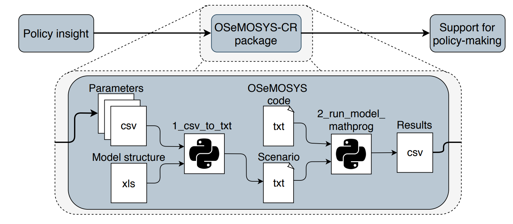

5. Using OSeMOSYS-CR
=================

OSeMOSYS-CR's repository\ :sup:`1`, contains the following folders: 

* **0_Model Structure:** contains two files that describes the structure of the model. 

* **1_Scenarios_Inputs:** contains three folders representing each one of the climatic scenarios (i.e. BAU, SR20, and SR15). Each folder holds 30 individual comma-separated (csv) files with the parameters of the model. 

* **2_Scenarios_Outputs:** stores the outputs generated after running the model. 

In order to run the model, the following files are needed: 

* **1_csv_to_txt.py:** converts the csv files in 1_Scenarios_Inputs into a text (txt) file of the parameters of the model. 

* **2_run_model_mathprog.py:** runs the model and generates two wide format file with the results of the model: i) a file containing the original names of the fuels, technologies and emissions, and ii) a file with coded names for an easier understanding. 

Running the model, generates the following files, all of them are store in 2_Scenarios_Outputs:

* **Osemosyscr_data.txt:** is the output file of 1_csv_to_txt.py. 

* **Osemosyscr_data_Output.txt:** is one of the output files of 2_run_model_mathprog.py. Contains the results of the scenario.

* **Osemosys_data_Output.csv:** is one of the output files of 2_run_model_mathprog.py. Contains the results of the scenario in a wide format csv file. 

* **Osemosys_data_Output_CODED:** is one of the output files of 2_run_model_mathprog.py. Contains the results of the scenario in a wide format csv file with coded names for the fuels, technologies and emissions of the model. 

Figure 5.1 shows the general framework of how the python modules of OSeMOSYS-CR work. The following are important considerations for using these modules: 

* In order to run the model, the GLPK\ :sup:`2`, solver needs to be installed. 

* Before running the model, 2_Scenarios_Outputs should be empty.

* 1_csv_to_txt.py and 2_run_model_mathprog.py must be respectively run. In both codes the scenario of interest needs to be specified in the first lines. 

   
   *Figure 5.1. General Framework of OSeMOSYS-CR*

\ :sup:`1` https://github.com/EPERLab/OSeMOSYS-CR

\ :sup:`2` https://www.gnu.org/software/glpk/
