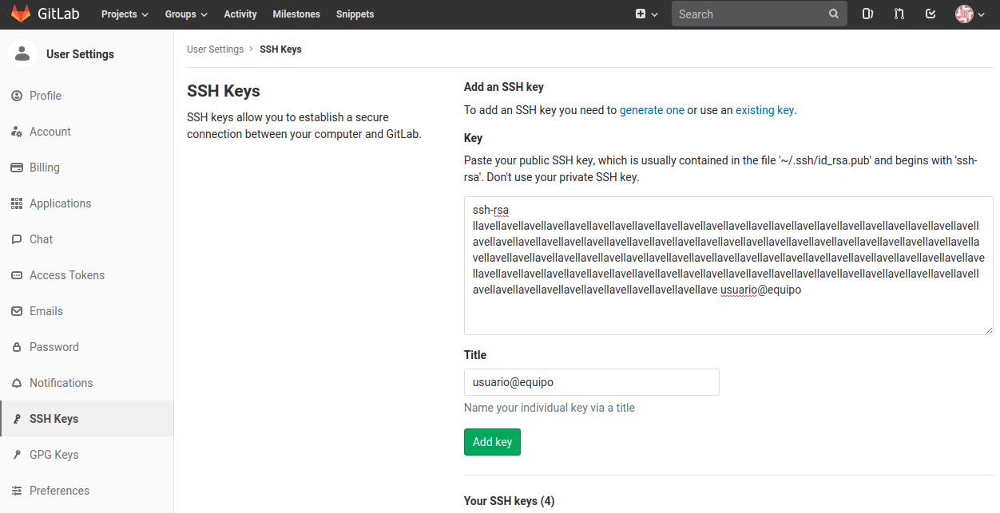

.. _ejemplo:

*******
Ejemplo
*******

subtitle
########

subsubtitle
***********

.. _docgen-etiqueta:

section
=======

subsection
----------

subsubsection
^^^^^^^^^^^^^

subsubsection
~~~~~~~~~~~~~~~~

Texto normal estilo loren ipsum y una referencia a sintaxis :cite:`rstsyntax`

Ahora una imagen con una etiqueta para referenciarla :ref:`docgen-fig00` y de
igual forma una referencia a una sección :ref:`docgen-etiqueta`.

.. _docgen-fig00:

  Imagen de ejemplo.

Listas
------

* This is a bulleted list.
* It has two items, the second
  item uses two lines. (note the indentation)

1. This is a numbered list.
2. It has two items too.

#. This is a numbered list.
#. It has two items too.

Cuadro simple
-------------

+---------+---------+-----------+
| 1       |  2      |  3        |
+---------+---------+-----------+

Cuadro más elaborado
--------------------

+------------+------------+-----------+
| Header 1   | Header 2   | Header 3  |
+============+============+===========+
| body row 1 | column 2   | column 3  |
+------------+------------+-----------+
| body row 2 | Cells may span columns.|
+------------+------------+-----------+
| body row 3 | Cells may  | - Cells   |
+------------+ span rows. | - contain |
| body row 4 |            | - blocks. |
+------------+------------+-----------+

Cuadro alternativo
------------------

=====  =====  ======
   Inputs     Output
------------  ------
  A      B    A or B
=====  =====  ======
False  False  False
True   False  True
=====  =====  ======

Cuadro estilo Látex
-------------------

.. tabularcolumns:: |l|c|p{5cm}|

+--------------+---+-----------+
|  simple text | 2 | 3         |
+--------------+---+-----------+
