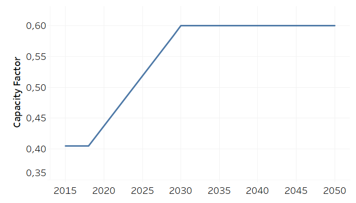

Set codification 
=====================================

+-------------------------------------------------+-------+--------------+--------------+--------------+--------------+
| .. figure:: img/PHH.jpg                                                                                             |
|    :align:   center                                                                                                 |
|    :width:   500 px                                                                                                 |
+-------------------------------------------------+-------+--------------+--------------+--------------+--------------+
| Set codification:                                       |                                                           |
+-------------------------------------------------+-------+--------------+--------------+--------------+--------------+
| Description:                                            |                                                           |
+-------------------------------------------------+-------+--------------+--------------+--------------+--------------+
| Set:                                                    |                                                           |
+-------------------------------------------------+-------+--------------+--------------+--------------+--------------+
| Parameter                                       | Unit  | 2020         | 2030         | 2040         |  2050        |
+=================================================+=======+==============+==============+==============+==============+
| YearSplit[l,y]                                  |       |              |              |              |              |
+-------------------------------------------------+-------+--------------+--------------+--------------+--------------+
| SpecifiedAnnualDemand[r,f,y]                    |       |              |              |              |              |
+-------------------------------------------------+-------+--------------+--------------+--------------+--------------+
| SpecifiedDemandProfile[r,f,l,y]                 |       |              |              |              |              |
+-------------------------------------------------+-------+--------------+--------------+--------------+--------------+
| AccumulatedAnnualDemand[r,f,y]                  |       |              |              |              |              |
+-------------------------------------------------+-------+--------------+--------------+--------------+--------------+
| CapacityToActivityUnit[r,t]                     |       |              |              |              |              |
+-------------------------------------------------+-------+--------------+--------------+--------------+--------------+
| CapacityFactor[r,t,l,y]                         |       |              |              |              |              |
+-------------------------------------------------+-------+--------------+--------------+--------------+--------------+
| AvailabilityFactor[r,t,y]                       |       |              |              |              |              |
+-------------------------------------------------+-------+--------------+--------------+--------------+--------------+
| OperationalLife[r,t]                            |       |              |              |              |              |
+-------------------------------------------------+-------+--------------+--------------+--------------+--------------+
| ResidualCapacity[r,t,y]                         |       |              |              |              |              |
+-------------------------------------------------+-------+--------------+--------------+--------------+--------------+
| InputActivityRatio[r,t,f,m,y]                   |       |              |              |              |              |
+-------------------------------------------------+-------+--------------+--------------+--------------+--------------+
| OutputActivityRatio[r,t,f,m,y]                  |       |              |              |              |              |
+-------------------------------------------------+-------+--------------+--------------+--------------+--------------+
| CapitalCost[r,t,y]                              |       |              |              |              |              |
+-------------------------------------------------+-------+--------------+--------------+--------------+--------------+
| VariableCost[r,t,m,y]                           |       |              |              |              |              |
+-------------------------------------------------+-------+--------------+--------------+--------------+--------------+
| FixedCost[r,t,y]                                |       |              |              |              |              |
+-------------------------------------------------+-------+--------------+--------------+--------------+--------------+
| CapacityOfOneTechnologyUnit[r,t,y]              |       |              |              |              |              |
+-------------------------------------------------+-------+--------------+--------------+--------------+--------------+
| TotalAnnualMaxCapacity[r,t,y]                   |       |              |              |              |              |
+-------------------------------------------------+-------+--------------+--------------+--------------+--------------+
| TotalAnnualMinCapacity[r,t,y]                   |       |              |              |              |              |
+-------------------------------------------------+-------+--------------+--------------+--------------+--------------+
| TotalAnnualMaxCapacityInvestment[r,t,y]         |       |              |              |              |              |
+-------------------------------------------------+-------+--------------+--------------+--------------+--------------+
| TotalAnnualMinCapacityInvestment[r,t,y]         |       |              |              |              |              |
+-------------------------------------------------+-------+--------------+--------------+--------------+--------------+
| TotalTechnologyAnnualActivityUpperLimit[r,t,y]  |       |              |              |              |              |
+-------------------------------------------------+-------+--------------+--------------+--------------+--------------+
| TotalTechnologyAnnualActivityLowerLimit[r,t,y]  |       |              |              |              |              |
+-------------------------------------------------+-------+--------------+--------------+--------------+--------------+
| EmissionActivityRatio[r,t,e,m,y]                |       |              |              |              |              |
+-------------------------------------------------+-------+--------------+--------------+--------------+--------------+
| EmissionsPenalty[r,e,y]                         |       |              |              |              |              |
+-------------------------------------------------+-------+--------------+--------------+--------------+--------------+
| AnnualEmissionLimit[r,e,y]                      |       |              |              |              |              |
+-------------------------------------------------+-------+--------------+--------------+--------------+--------------+
| ModelPeriodEmissionLimit[r,e]                   |       |              |              |              |              |
+-------------------------------------------------+-------+--------------+--------------+--------------+--------------+

Parameter 1
+++++++++

   
   *Figure 1. Parameter 1 for set codification.*
   
Source:
   This is the source. 
   
Description: 
   This is the description. 

Parameter 2
+++++++++

   
   *(a)*
   

   
   *(b)*
   
   *Figure 2. Parameter 2 for set codification: (a) dry season, (b) rainy season.*
   
Source:
   This is the source. 
   
Description: 
   This is the description. 

