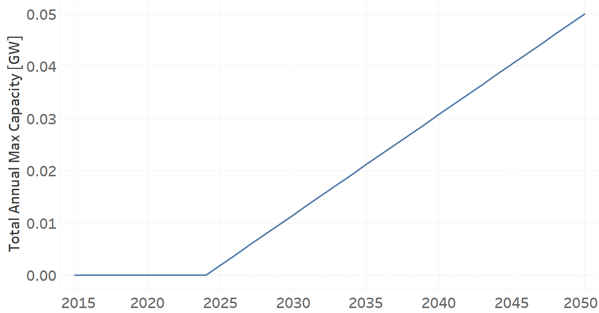

PPBIO002: Biomass Power Plant (new)
=====================================

+-------------------------------------------------+-------+--------------+--------------+--------------+--------------+
| .. figure:: img/PPBIO.jpg                                                                                           |
|    :align:   center                                                                                                 |
|    :width:   500 px                                                                                                 |
+-------------------------------------------------+-------+--------------+--------------+--------------+--------------+
| Set codification:                                       | PPBIO002                                                  |
+-------------------------------------------------+-------+--------------+--------------+--------------+--------------+
| Description:                                            | Biomass Power Plant (new)                                 |
+-------------------------------------------------+-------+--------------+--------------+--------------+--------------+
| Set:                                                    | Technology                                                |
+-------------------------------------------------+-------+--------------+--------------+--------------+--------------+
| Parameter                                       | Unit  | 2020         | 2030         | 2040         |  2050        |
+=================================================+=======+==============+==============+==============+==============+
| CapacityFactor[r,t,l,y]                         |   %   | 0.75         | 0.75         | 0.75         | 0.75         |
+-------------------------------------------------+-------+--------------+--------------+--------------+--------------+
| CapitalCost[r,t,y]                              | M$/GW | 2463.28      | 2463.28      | 2463.28      | 2463.28      |
+-------------------------------------------------+-------+--------------+--------------+--------------+--------------+
| FixedCost[r,t,y]                                | M$/GW | 44.5         | 44.5         | 44.5         | 44.5         |
+-------------------------------------------------+-------+--------------+--------------+--------------+--------------+
| OperationalLife[r,t]                            | Years | 25           | 25           | 25           | 25           |
+-------------------------------------------------+-------+--------------+--------------+--------------+--------------+
| OutputActivityRatio[r,t,f,m,y] (Electricity     | PJ/PJ | 1            | 1            | 1            | 1            |
| Supply by Plants)                               |       |              |              |              |              |
+-------------------------------------------------+-------+--------------+--------------+--------------+--------------+
| TotalAnnualMaxCapacity[r,t,y]                   |  GW   | 0            | 0.0115       | 0.0308       | 0.05         |
+-------------------------------------------------+-------+--------------+--------------+--------------+--------------+
| VariableCost[r,t,m,y]                           | M$/PJ | 0.001        | 0.001        | 0.001        | 0.001        |
+-------------------------------------------------+-------+--------------+--------------+--------------+--------------+

CapacityFactor[r,t,l,y]
+++++++++
The equation (1) shows the Capacity Factor for PPBIO002, for every scenario.

CapacityFactor=0.75%   (1)

Source:
   This is the source. 
   
Description: 
   This is the description.
   
CapitalCost[r,t,y]
+++++++++
The equation (2) shows the Capital Cost for PPBIO002, for every scenario.

CapitalCost=2463.28 [M$/GW]   (2)

Source:
   This is the source. 
   
Description: 
   This is the description.   
   
FixedCost[r,t,y]
+++++++++
The equation (3) shows the Fixed Cost for PPBIO002, for every scenario.

FixedCost=44.5 [M$/GW]   (3)

Source:
   This is the source. 
   
Description: 
   This is the description.  
   
OperationalLife[r,t]
+++++++++
The equation (4) shows the Operational Life for PPBIO002, for every scenario.

OperationalLife=25 Years   (4)

Source:
   This is the source. 
   
Description: 
   This is the description.  
   
OutputActivityRatio[r,t,f,m,y]
+++++++++
The equation (5) shows the Output Activity Ratio for PPBIO002, for every scenario and associated to the fuel Electricity Supply by Plants.

OutputActivityRatio=1 [PJ/PJ]   (5)

Source:
   This is the source. 
   
Description: 
   This is the description.   
   
TotalAnnualMaxCapacity[r,t,y]
+++++++++
The figure 1 shows the Total Annual Max Capacity for PPBIO002, for every scenario.

   
   *Figure 1) Total Annual Max Capacity for PPBIO002.*
   
Source:
   This is the source. 
   
Description: 
   This is the description.      

VariableCost[r,t,m,y]
+++++++++
The equation (6) shows the Variable Cost for PPBIO002, for every scenario.

VariableCost=0.001 [M$/PJ]   (6)

Source:
   This is the source. 
   
Description: 
   This is the description.  
