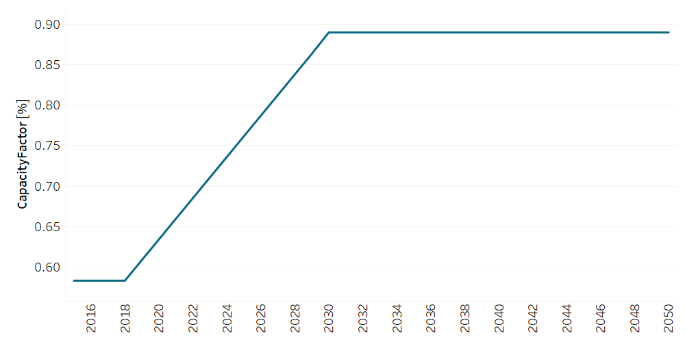
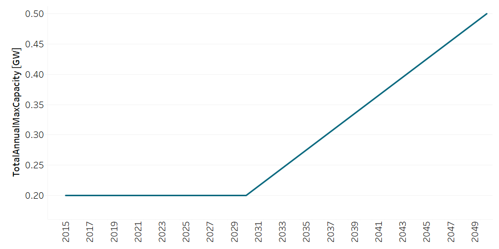

PPGEO002: Geothermal Power Plant (new)
=====================================

+-------------------------------------------------+-------+--------------+--------------+--------------+--------------+
| .. figure:: img/PPGEO.jpg                                                                                           |
|    :align:   center                                                                                                 |
|    :width:   500 px                                                                                                 |
+-------------------------------------------------+-------+--------------+--------------+--------------+--------------+
| Set codification:                                       |PPGEO002                                                   |
+-------------------------------------------------+-------+--------------+--------------+--------------+--------------+
| Description:                                            |Geothermal Power Plant (new)                               |
+-------------------------------------------------+-------+--------------+--------------+--------------+--------------+
| Set:                                                    |Technology                                                 |
+-------------------------------------------------+-------+--------------+--------------+--------------+--------------+
| Parameter                                       | Unit  | 2020         | 2030         | 2040         |  2050        |
+=================================================+=======+==============+==============+==============+==============+
| CapacityFactor[r,t,l,y] (Dry)                   |   %   | 0.634        | 0.89         | 0.89         | 0.89         |
+-------------------------------------------------+-------+--------------+--------------+--------------+--------------+
| CapacityFactor[r,t,l,y] (Rain)                  |   %   | 0.634        | 0.89         | 0.89         | 0.89         |
+-------------------------------------------------+-------+--------------+--------------+--------------+--------------+
| CapitalCost[r,t,y]                              | M$/GW | 7828.28      | 7828.28      | 7828.28      | 7828.28      |
+-------------------------------------------------+-------+--------------+--------------+--------------+--------------+
| FixedCost[r,t,y]                                | M$/GW | 44.5         | 44.5         | 44.5         | 44.5         |
+-------------------------------------------------+-------+--------------+--------------+--------------+--------------+
| InputActivityRatio[r,t,f,m,y] (Geothermal       | PJ/PJ | 1            | 1            | 1            | 1            |
| energy)                                         |       |              |              |              |              |
+-------------------------------------------------+-------+--------------+--------------+--------------+--------------+
| OperationalLife[r,t]                            | Years | 40           | 40           | 40           | 40           |
+-------------------------------------------------+-------+--------------+--------------+--------------+--------------+
| OutputActivityRatio[r,t,f,m,y] (Electricity     | PJ/PJ | 1            | 1            | 1            | 1            |
| Supply by Plants)                               |       |              |              |              |              |
+-------------------------------------------------+-------+--------------+--------------+--------------+--------------+
| TotalAnnualMaxCapacity[r,t,y]                   |  GW   | 0.2          | 0.2          | 0.35         | 0.5          |
+-------------------------------------------------+-------+--------------+--------------+--------------+--------------+
| TotalAnnualMinCapacityInvestment[r,t,y]         |  GW   | 0            | 0.055        | 0            | 0            |
+-------------------------------------------------+-------+--------------+--------------+--------------+--------------+
| VariableCost[r,t,m,y]                           | M$/PJ | 0.001        | 0.001        | 0.001        | 0.001        |
+-------------------------------------------------+-------+--------------+--------------+--------------+--------------+

CapacityFactor[r,t,l,y]
+++++++++
The figure 1 shows the Capacity Factor for PPGEO002, for every scenario and season.

   
   *Figure 1) Capacity Factor for PPGEO002.* :download:`. <doc_imgs/CapacityFactor_PPGEO002.csv>`

   
CapitalCost[r,t,y]
+++++++++
The equation (1) shows the Capital Cost for PPGEO002, for every scenario.

CapitalCost=7828.28 [M$/GW]   (1)

FixedCost[r,t,y]
+++++++++
The equation (2) shows the Fixed Cost for PPGEO002, for every scenario.

FixedCost=44.5 [M$/GW]   (2)

   
InputActivityRatio[r,t,f,m,y]
+++++++++
The equation (3) shows the Input Activity Ratio for PPGEO002, for every scenario and associated to the fuel Geothermal Energy.

InputActivityRatio=1   [PJ/PJ]   (3)

   
OperationalLife[r,t]
+++++++++
The equation (4) shows the Operational Life for PPGEO002, for every scenario.

OperationalLife=40 Years   (4)

 
   
OutputActivityRatio[r,t,f,m,y]
+++++++++
The equation (5) shows the Output Activity Ratio for PPGEO002, for every scenario and associated to the fuel Electricity Supply by Plants.

OutputActivityRatio=1 [PJ/PJ]   (5)

   
TotalAnnualMaxCapacity[r,t,y]
+++++++++
The figure 2 shows the Total Annual Max Capacity for PPGEO002, for every scenario.

   
   *Figure 2) Total Annual Max Capacity for PPGEO002.* :download:`. <doc_imgs/TotalAnnualMaxCapacity_PPGEO002.csv>`

   
TotalAnnualMinCapacityInvestment[r,t,y]
+++++++++
The figure 3 show the Total Annual Min Capacity Investment for PPGEO002, for every scenario.

.. figure:: img/PPGEO002_TotalAnnualMinCapacityInvestment.png
   :align:   center
   :width:   700 px
   
   *Figure 3) Total Annual Min Capacity Investment for PPGEO002.* :download:`. <doc_imgs/TotalAnnualMaxCapacity_PPBIO002.csv>`

  
   
VariableCost[r,t,m,y]
+++++++++
The equation (6) shows the Variable Cost for PPGEO002, for every scenario.

VariableCost=0.001 [M$/PJ]   (6)

   
