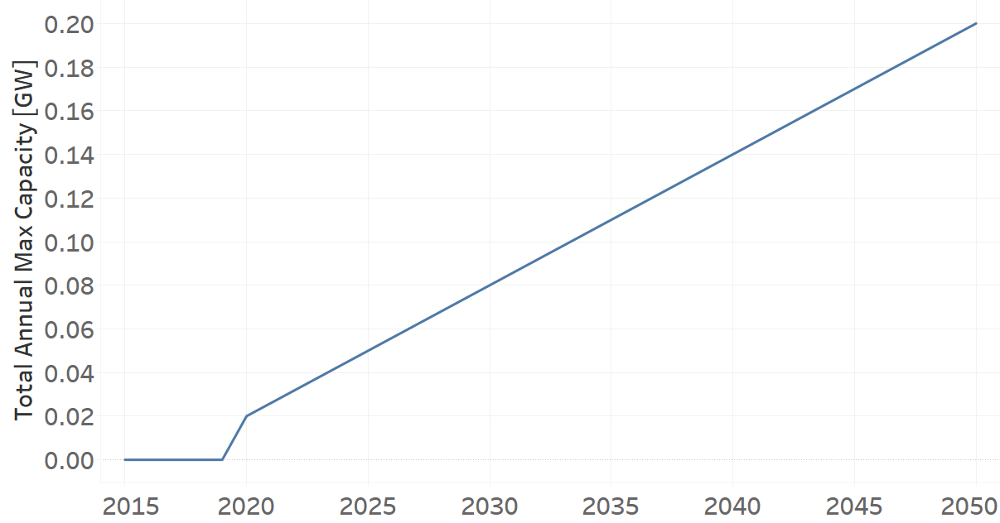

PPHROR002
=====================================

+-------------------------------------------------+-------+--------------+--------------+--------------+--------------+
| .. figure:: img/PHH.jpg                                                                                             |
|    :align:   center                                                                                                 |
|    :width:   500 px                                                                                                 |
+-------------------------------------------------+-------+--------------+--------------+--------------+--------------+
| Set codification:                                       |PPHROR002                                                  |
+-------------------------------------------------+-------+--------------+--------------+--------------+--------------+
| Description:                                            |Hydro Run of River Power Plant (new)                       |
+-------------------------------------------------+-------+--------------+--------------+--------------+--------------+
| Set:                                                    |Technology                                                 |
+-------------------------------------------------+-------+--------------+--------------+--------------+--------------+
| Parameter                                       | Unit  | 2020         | 2030         | 2040         |  2050        |
+=================================================+=======+==============+==============+==============+==============+
| CapacityFactor[r,t,l,y] (Dry)                   |   %   | 0.4966       | 0.6          | 0.6          | 0.6          |
+-------------------------------------------------+-------+--------------+--------------+--------------+--------------+
| CapacityFactor[r,t,l,y] (Rain)                  |   %   | 0.4966       | 0.6          | 0.6          | 0.6          |
+-------------------------------------------------+-------+--------------+--------------+--------------+--------------+
| CapitalCost[r,t,y]                              | M$/GW | 4385.15      | 4385.15      | 4385.15      | 4385.15      |
+-------------------------------------------------+-------+--------------+--------------+--------------+--------------+
| FixedCost[r,t,y]                                | M$/GW | 47.9         | 47.9         | 47.9         | 47.9         |
+-------------------------------------------------+-------+--------------+--------------+--------------+--------------+
| InputActivityRatio[r,t,f,m,y] (Hydraulic        | PJ/PJ | 1            | 1            | 1            | 1            |
| energy)                                         |       |              |              |              |              |
+-------------------------------------------------+-------+--------------+--------------+--------------+--------------+
| OperationalLife[r,t]                            | Years | 60           | 60           | 60           | 60           |
+-------------------------------------------------+-------+--------------+--------------+--------------+--------------+
| OutputActivityRatio[r,t,f,m,y] (Electricity     | PJ/PJ | 1            | 1            | 1            | 1            |
| Supply by Plants)                               |       |              |              |              |              |
+-------------------------------------------------+-------+--------------+--------------+--------------+--------------+
| TotalAnnualMaxCapacity[r,t,y]                   |  GW   | 0.02         | 0.08         | 0.14         | 0.2          |
+-------------------------------------------------+-------+--------------+--------------+--------------+--------------+
| TotalAnnualMinCapacityInvestment[r,t,y]         |  GW   | 0.019        | 0            | 0            | 0            |
+-------------------------------------------------+-------+--------------+--------------+--------------+--------------+
| VariableCost[r,t,m,y]                           | M$/PJ | 0.001        | 0.001        | 0.001        | 0.001        |
+-------------------------------------------------+-------+--------------+--------------+--------------+--------------+

CapacityFactor[r,t,l,y]
+++++++++
The figure 1 shows the Capacity Factor for PPHROR002, for every scenario and season.

.. figure:: img/PPHROR002_CapacityFactor.png
   :align:   center
   :width:   700 px
   
   *Figure 1) Capacity Factor for PPHROR002.*

Source:
   This is the source. 
   
Description: 
   This is the description. 
   
CapitalCost[r,t,y]
+++++++++
The equation (1) shows the Capital Cost for PPHROR002, para todos los escenarios.

CapitalCost=4385.15 [M$/GW]   (1)

Source:
   This is the source. 
   
Description: 
   This is the description.

FixedCost[r,t,y]
+++++++++
The equation (2) shows the Fixed Cost for PPHROR002, for every scenario.

FixedCost=47.9 [M$/GW]   (2)

Source:
   This is the source. 
   
Description: 
   This is the description.
   
InputActivityRatio[r,t,f,m,y]
+++++++++
The equation (3) shows the Input Activity Ratio for PPHROR002, for every scenario and associated to the fuel Hydraulic Energy.

InputActivityRatio=1   [PJ/PJ]   (3)

Source:
   This is the source. 
   
Description: 
   This is the description.
   
OperationalLife[r,t]
+++++++++
The equation (4) shows the Operational Life for PPHROR002, for every scenario.

OperationalLife=60 Years   (4)

Source:
   This is the source. 
   
Description: 
   This is the description.   
   
OutputActivityRatio[r,t,f,m,y]
+++++++++
The equation (5) shows the Output Activity Ratio for PPHROR002, for every scenario and associated to the fuel Electricity Supply by Plants.

OutputActivityRatio=1 [PJ/PJ]   (5)

Source:
   This is the source. 
   
Description: 
   This is the description. 
   
TotalAnnualMaxCapacity[r,t,y]
+++++++++
The figure 2 shows the Total Annual Max Capacity for PPHROR002, for every scenario.

   
   *Figure 2) Total Annual Max Capacity for PPHROR002.*

Source:
   This is the source. 
   
Description: 
   This is the description.
   
TotalAnnualMinCapacityInvestment[r,t,y]
+++++++++
The figure 3 shows the Total Annual Min Capacity Investment for PPHROR002, for every scenario.

.. figure:: img/PPHROR002_TotalAnnualMinCapacityInvestment.png
   :align:   center
   :width:   700 px
   
   *Figure 3) Total Annual Min Capacity Investment for PPHROR002.*

Source:
   This is the source. 
   
Description: 
   This is the description.   
   
VariableCost[r,t,m,y]
+++++++++
The equation (6) shows the Variable Cost for PPHROR002, for every scenario.

VariableCost=0.001 [M$/PJ]   (6)

Source:
   This is the source. 
   
Description: 
   This is the description.    
