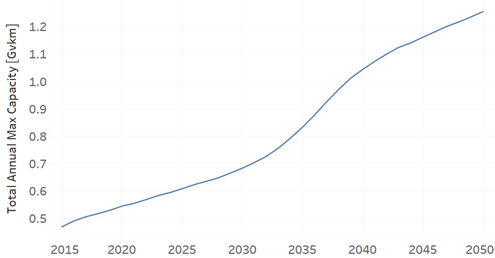
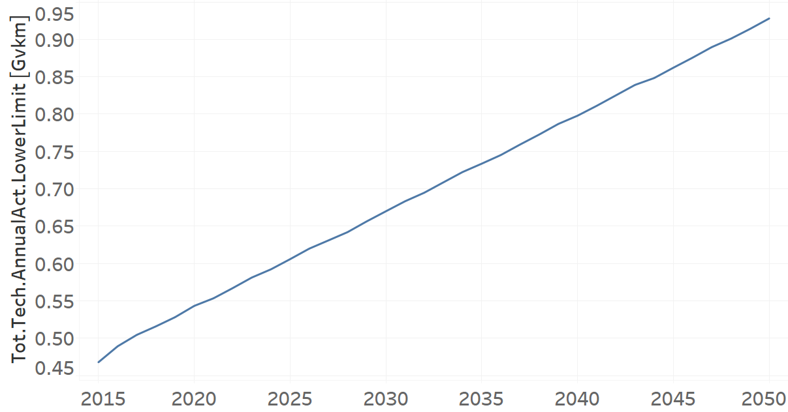

Techs_Bus: Bus (Grouping Technology)
=====================================

+-------------------------------------------------+-------+--------------+--------------+--------------+--------------+
| .. figure:: img/Techs_Bus.png                                                                                       |
|    :align:   center                                                                                                 |
|    :width:   500 px                                                                                                 |
+-------------------------------------------------+-------+--------------+--------------+--------------+--------------+
| Set codification:                                       |Techs_Bus                                                  |
+-------------------------------------------------+-------+--------------+--------------+--------------+--------------+
| Description:                                            |Bus                                                        |
+-------------------------------------------------+-------+--------------+--------------+--------------+--------------+
| Set:                                                    |Technology                                                 |
+-------------------------------------------------+-------+--------------+--------------+--------------+--------------+
| Parameter                                       | Unit  | 2020         | 2030         | 2040         |  2050        |
+=================================================+=======+==============+==============+==============+==============+
| DistanceDriven[r,t,y]                           |km/year| 65460        | 65460        | 65460        | 65460        |
+-------------------------------------------------+-------+--------------+--------------+--------------+--------------+
| InputActivityRatio[r,t,f,m,y] (Public           | Gpkm/ | 1            | 1            | 1            | 1            |
| Transport in Bus)                               | Gvkm  |              |              |              |              |
+-------------------------------------------------+-------+--------------+--------------+--------------+--------------+
| OperationalLife[r,t]                            | Years | 1            | 1            | 1            | 1            |
+-------------------------------------------------+-------+--------------+--------------+--------------+--------------+
| OutputActivityRatio[r,t,f,m,y] (Transport Demand| Gpkm/ | 25.66        | 25.66        | 25.66        | 25.66        |
| Passenger Public)                               | Gvkm  |              |              |              |              |
+-------------------------------------------------+-------+--------------+--------------+--------------+--------------+
| TotalAnnualMaxCapacity[r,t,y] (BAU)             | Gvkm  | 0.5444       | 0.6712       | 0.7994       | 0.9298       |
+-------------------------------------------------+-------+--------------+--------------+--------------+--------------+
| TotalAnnualMaxCapacity[r,t,y] (NDP)             | Gvkm  | 0.5444       | 0.6829       | 1.0431       | 1.2542       |
+-------------------------------------------------+-------+--------------+--------------+--------------+--------------+
| TotalTechnologyAnnualActivityLowerLimit[r,t,y]  | Gvkm  | 0.5433       | 0.6699       | 0.7978       | 0.9279       |
| (BAU)                                           |       |              |              |              |              |
+-------------------------------------------------+-------+--------------+--------------+--------------+--------------+
| TotalTechnologyAnnualActivityLowerLimit[r,t,y]  | Gvkm  | 0.5433       | 0.6816       | 1.041        | 1.2517       |
| (NDP)                                           |       |              |              |              |              |
+-------------------------------------------------+-------+--------------+--------------+--------------+--------------+

DistanceDriven[r,t,y]
+++++++++
The equation (1) shows the Distance Driven for Techs_Bus, for every scenario.

DistanceDriven=65460 [km/year]   (1)

Source:
   This is the source. 
   
Description: 
   This is the description. 
   
InputActivityRatio[r,t,f,m,y]
+++++++++
The equation (2) shows the Input Activity Ratio for Techs_Bus, for every scenario and associated to the fuel Public Transport in Bus.

InputActivityRatio=1 [Gpkm/Gvkm]   (2)

Source:
   This is the source. 
   
Description: 
   This is the description. 
   
OperationalLife[r,t]
+++++++++
The equation (3) shows the Operational Life for Techs_Bus, for every scenario.

OperationalLife=1 Years   (3)

Source:
   This is the source. 
   
Description: 
   This is the description.   
   
OutputActivityRatio[r,t,f,m,y]
+++++++++
The equation (4) shows the Output Activity Ratio for Techs_Bus, for every scenario and associated to the fuel Transport Demand Passenger Public.

OutputActivityRatio=25.66 [Gpkm/Gvkm]   (4)

Source:
   This is the source. 
   
Description: 
   This is the description. 
   
TotalAnnualMaxCapacity[r,t,y]
+++++++++
The figure 1 shows the Total Annual Max Capacity for Techs_Bus, for the BAU scenario.

.. figure:: img/Techs_Bus_TotalAnnualMaxCapacity_BAU.png
   :align:   center
   :width:   700 px
   
   *Figure 1) Total Annual Max Capacity for Techs_Bus for the BAU scenario.*
   
The figure 2 shows the Total Annual Max Capacity for Techs_Bus, for the NDP scenario.

   
   *Figure 2) Total Annual Max Capacity for Techs_Bus for the NDP scenario.*

Source:
   This is the source. 
   
Description: 
   This is the description.
   
TotalTechnologyAnnualActivityLowerLimit[r,t,y]
+++++++++
The figure 3 shows the Total Technology Annual Activity Lower Limit for Techs_Bus, for the BAU scenario.

   
   *Figure 3) Total Technology Annual Activity Lower Limit for Techs_Bus for the BAU scenario.*
   
The figure 4 shows the Total Technology Annual Activity Lower Limit for Techs_Bus, for the NDP scenario.

.. figure:: img/Techs_Bus_TotalTechnologyAnnualActivityLowerLimit_NDP_OP.png
   :align:   center
   :width:   700 px
   
   *Figure 4) Total Technology Annual Activity Lower Limit for Techs_Bus for the NDP scenario.*

Source:
   This is the source. 
   
Description: 
   This is the description.
