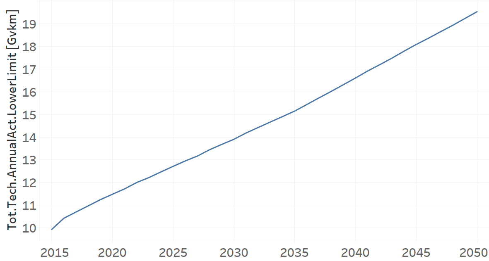

Techs_LD: Light Duty (Grouping Technology)
=====================================

+-------------------------------------------------+-------+--------------+--------------+--------------+--------------+
| .. figure:: img/Techs_LD.png                                                                                        |
|    :align:   center                                                                                                 |
|    :width:   500 px                                                                                                 |
+-------------------------------------------------+-------+--------------+--------------+--------------+--------------+
| Set codification:                                       |Techs_LD                                                   |
+-------------------------------------------------+-------+--------------+--------------+--------------+--------------+
| Description:                                            |Light Duty                                                 |
+-------------------------------------------------+-------+--------------+--------------+--------------+--------------+
| Set:                                                    |Technology                                                 |
+-------------------------------------------------+-------+--------------+--------------+--------------+--------------+
| Parameter                                       | Unit  | 2020         | 2030         | 2040         |  2050        |
+=================================================+=======+==============+==============+==============+==============+
| DistanceDriven[r,t,y]                           |km/year| 14773        | 14773        | 14773        | 14773        |
+-------------------------------------------------+-------+--------------+--------------+--------------+--------------+
| InputActivityRatio[r,t,f,m,y] (Public           | Gpkm/ | 1            | 1            | 1            | 1            |
| Transport in Bus)                               | Gvkm  |              |              |              |              |
+-------------------------------------------------+-------+--------------+--------------+--------------+--------------+
| OperationalLife[r,t]                            | Years | 1            | 1            | 1            | 1            |
+-------------------------------------------------+-------+--------------+--------------+--------------+--------------+
| OutputActivityRatio[r,t,f,m,y] (Transport Demand| Gpkm/ | 1.5          | 1.5          | 1.5          | 1.5          |
| Passenger Public)                               | Gvkm  |              |              |              |              |
+-------------------------------------------------+-------+--------------+--------------+--------------+--------------+
| TotalAnnualMaxCapacity[r,t,y] (BAU)             | Gvkm  | 11.505       | 13.934       | 16.6408      | 19.5691      |
+-------------------------------------------------+-------+--------------+--------------+--------------+--------------+
| TotalAnnualMaxCapacity[r,t,y] (NDP)             | Gvkm  | 11.5057      | 13.5359      | 11.5218      | 12.4342      |
+-------------------------------------------------+-------+--------------+--------------+--------------+--------------+
| TotalTechnologyAnnualActivityLowerLimit[r,t,y]  | Gvkm  | 11.482       | 13.9062      | 16.6076      | 19.53        |
| (BAU)                                           |       |              |              |              |              |
+-------------------------------------------------+-------+--------------+--------------+--------------+--------------+
| TotalTechnologyAnnualActivityLowerLimit[r,t,y]  | Gvkm  | 11.4825      | 13.5072      | 11.499       | 12.4097      |
| (NDP)                                           |       |              |              |              |              |
+-------------------------------------------------+-------+--------------+--------------+--------------+--------------+

DistanceDriven[r,t,y]
+++++++++
The equation (1) shows the Distance Driven for Techs_LD, for every scenario.

DistanceDriven=14773 [km/year]   (1)

Source:
   This is the source. 
   
Description: 
   This is the description. 
   
InputActivityRatio[r,t,f,m,y]
+++++++++
The equation (2) shows the Input Activity Ratio for Techs_LD, for every scenario and associated to the fuel Private Transport in Light Duty.

InputActivityRatio=1  [Gpkm/Gvkm]   (2)

Source:
   This is the source. 
   
Description: 
   This is the description.
   
OperationalLife[r,t]
+++++++++
The equation (3) shows the Operational Life for Techs_LD, for every scenario.

OperationalLife=1 Years   (3)

Source:
   This is the source. 
   
Description: 
   This is the description.   
   
OutputActivityRatio[r,t,f,m,y]
+++++++++
The equation (4) shows the Output Activity Ratio for Techs_LD, for every scenario and associated to the fuel Transport Demand Passenger Private.

OutputActivityRatio=1.5 [Gpkm/Gvkm]   (4)

Source:
   This is the source. 
   
Description: 
   This is the description. 
   
TotalAnnualMaxCapacity[r,t,y]
+++++++++
The figure 1 shows the Total Annual Max Capacity for Techs_LD, for the BAU scenario.

.. figure:: img/Techs_LD_TotalAnnualMaxCapacity_BAU.png
   :align:   center
   :width:   700 px
   
   *Figure 1) Total Annual Max Capacity for Techs_LD for BAU scenario.*
   
The figure 2 shows the Total Annual Max Capacity for Techs_LD, for the NDP scenario.

.. figure:: img/Techs_LD_TotalAnnualMaxCapacity_NDP_OP15C.png
   :align:   center
   :width:   700 px
   
   *Figure 2) Total Annual Max Capacity for Techs_LD for the NDP scenario.*

Source:
   This is the source. 
   
Description: 
   This is the description.
   
TotalTechnologyAnnualActivityLowerLimit[r,t,y]
+++++++++
The figure 3 shows the Total Technology Annual Activity Lower Limit for Techs_LD, for the BAU scenario.

   
   *Figure 3) Total Technology Annual Activity Lower Limit for Techs_LD for BAU scenario.*
   
The figure 4 shows the Total Technology Annual Activity Lower Limit for Techs_LD, for the NDP scenario.

   
   *Figure 4) Total Technology Annual Activity Lower Limit for Techs_LD for the NDP scenario.*

Source:
   This is the source. 
   
Description: 
   This is the description.
