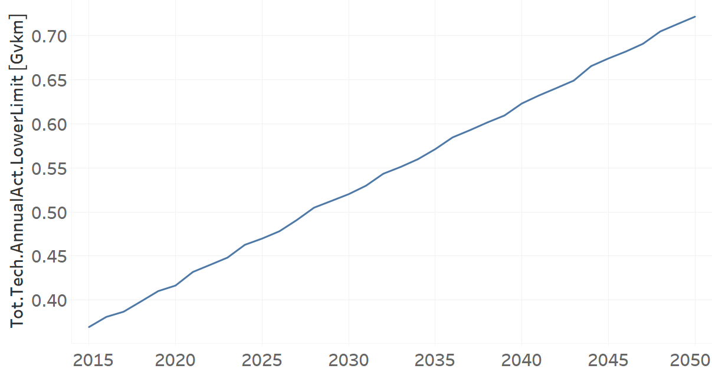

Techs_Microbuses: Minbus (Grouping Technology)
=====================================

+-------------------------------------------------+-------+--------------+--------------+--------------+--------------+
| .. figure:: img/Techs_Microbuses.png                                                                                |
|    :align:   center                                                                                                 |
|    :width:   500 px                                                                                                 |
+-------------------------------------------------+-------+--------------+--------------+--------------+--------------+
| Set codification:                                       |Techs_Microbuses                                           |
+-------------------------------------------------+-------+--------------+--------------+--------------+--------------+
| Description:                                            |Minbus                                                     |
+-------------------------------------------------+-------+--------------+--------------+--------------+--------------+
| Set:                                                    |Technology                                                 |
+-------------------------------------------------+-------+--------------+--------------+--------------+--------------+
| Parameter                                       | Unit  | 2020         | 2030         | 2040         |  2050        |
+=================================================+=======+==============+==============+==============+==============+
| DistanceDriven[r,t,y]                           |km/year| 25847        | 25847        | 25847        | 25847        |
+-------------------------------------------------+-------+--------------+--------------+--------------+--------------+
| InputActivityRatio[r,t,f,m,y] (Public           | Gpkm/ | 1            | 1            | 1            | 1            |
| Transport in Microbuses)                        | Gvkm  |              |              |              |              |
+-------------------------------------------------+-------+--------------+--------------+--------------+--------------+
| OperationalLife[r,t]                            | Years | 1            | 1            | 1            | 1            |
+-------------------------------------------------+-------+--------------+--------------+--------------+--------------+
| OutputActivityRatio[r,t,f,m,y] (Transport Demand| Gpkm/ | 8.43         | 8.43         | 8.43         | 8.43         |
| Passenger Public)                               | Gvkm  |              |              |              |              |
+-------------------------------------------------+-------+--------------+--------------+--------------+--------------+
| TotalAnnualMaxCapacity[r,t,y] (BAU)             | Gvkm  | 0.4173       | 0.5212       | 0.6243       | 0.723        |
+-------------------------------------------------+-------+--------------+--------------+--------------+--------------+
| TotalAnnualMaxCapacity[r,t,y] (NDP and OP15C)   | Gvkm  | 0.4173       | 0.5302       | 0.8148       | 0.975        |
+-------------------------------------------------+-------+--------------+--------------+--------------+--------------+
| TotalTechnologyAnnualActivityLowerLimit[r,t,y]  | Gvkm  | 0.4165       | 0.5202       | 0.6231       | 0.7216       |
| (BAU)                                           |       |              |              |              |              |
+-------------------------------------------------+-------+--------------+--------------+--------------+--------------+
| TotalTechnologyAnnualActivityLowerLimit[r,t,y]  | Gvkm  | 0.4166       | 0.5291       | 0.8131       | 0.9735       |
| (NDP and OP15C)                                 |       |              |              |              |              |
+-------------------------------------------------+-------+--------------+--------------+--------------+--------------+

DistanceDriven[r,t,y]
+++++++++
The equation (1) shows the Distance Driven for Techs_Microbuses, for every scenario.

DistanceDriven=25847 [km/year]   (1)

Source:
   This is the source. 
   
Description: 
   This is the description. 
   
InputActivityRatio[r,t,f,m,y]
+++++++++
The equation (2) shows the Input Activity Ratio for Techs_Microbuses, for every scenario and associated to the fuel Public Transport in Minibus.

InputActivityRatio=1   [Gpkm/Gvkm]   (2)

Source:
   This is the source. 
   
Description: 
   This is the description.
   
OperationalLife[r,t]
+++++++++
The equation (3) shows the Operational Life for Techs_Microbuses, for every scenario.

OperationalLife=1 Years   (3)

Source:
   This is the source. 
   
Description: 
   This is the description.   
   
OutputActivityRatio[r,t,f,m,y]
+++++++++
The equation (4) shows the Output Activity Ratio for Techs_Microbuses, for every scenario and associated to the fuel Transport Demand Passenger Public.

OutputActivityRatio=8.43 [Gpkm/Gvkm]   (4)

Source:
   This is the source. 
   
Description: 
   This is the description. 
   
TotalAnnualMaxCapacity[r,t,y]
+++++++++
The figure 1 shows the Total Annual Max Capacity for Techs_Microbuses, for the BAU scenario.

.. figure:: img/Techs_Microbuses_TotalAnnualMaxCapacity_BAU.png
   :align:   center
   :width:   700 px
   
   *Figure 1) Total Annual Max Capacity for Techs_Microbuses for BAU scenario.*
   
The figure 2 shows the Total Annual Max Capacity for Techs_Microbuses, for the NDP and OP15C scenarios.

.. figure:: img/Techs_Microbuses_TotalAnnualMaxCapacity_NDP_OP15C.png
   :align:   center
   :width:   700 px
   
   *Figure 2) Total Annual Max Capacity for Techs_Microbuses for NDP and OP15C scenarios.*

Source:
   This is the source. 
   
Description: 
   This is the description.
   
TotalTechnologyAnnualActivityLowerLimit[r,t,y]
+++++++++
The figure 3 shows the Total Technology Annual Activity Lower Limit for Techs_Microbuses, for the BAU scenario.

   
   *Figure 3) Total Technology Annual Activity Lower Limit for Techs_Microbuses for BAU scenario.*
   
The figure 4 shows the Total Technology Annual Activity Lower Limit for Techs_Microbuses, for the NDP and OP15C scenarios.

.. figure:: img/Techs_Microbuses_TotalTechnologyAnnualActivityLowerLimit_NDP_OP.png
   :align:   center
   :width:   700 px
   
   *Figure 4) Total Technology Annual Activity Lower Limit for Techs_Microbuses for NDP and OP15C scenarios.*

Source:
   This is the source. 
   
Description: 
   This is the description.
