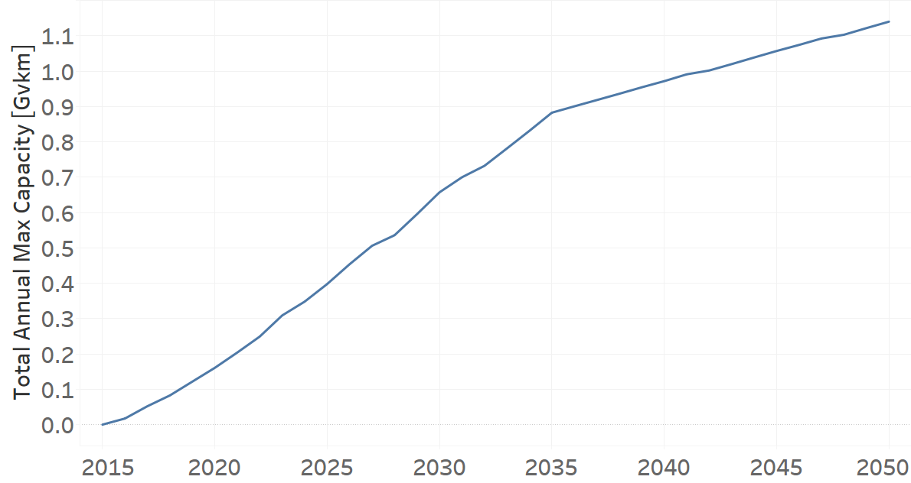
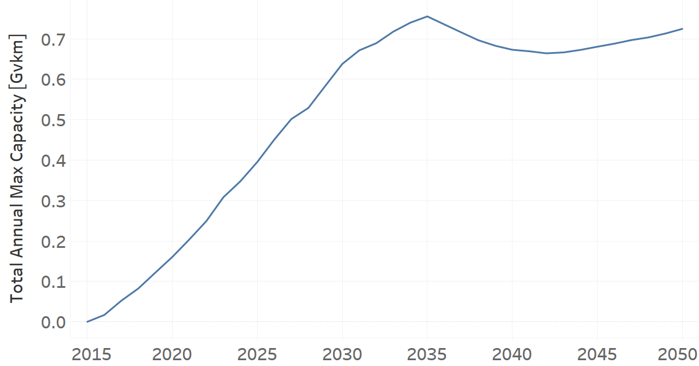
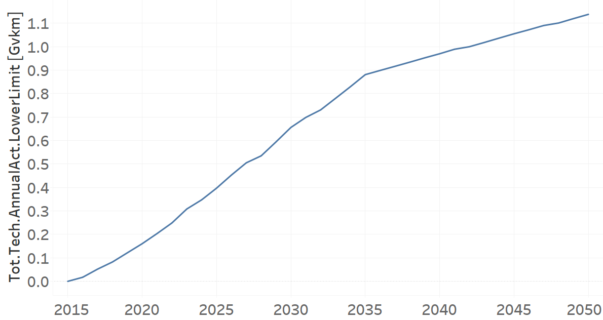
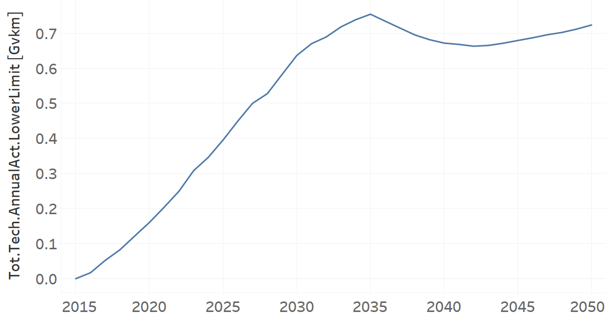

Techs_Minivan: Minivan (Grouping Technology)
=====================================

+-------------------------------------------------+-------+--------------+--------------+--------------+--------------+
| .. figure:: img/Techs_Minivan.png                                                                                   |
|    :align:   center                                                                                                 |
|    :width:   500 px                                                                                                 |
+-------------------------------------------------+-------+--------------+--------------+--------------+--------------+
| Set codification:                                       |Techs_Minivan                                              |
+-------------------------------------------------+-------+--------------+--------------+--------------+--------------+
| Description:                                            |Minivan                                                    |
+-------------------------------------------------+-------+--------------+--------------+--------------+--------------+
| Set:                                                    |Technology                                                 |
+-------------------------------------------------+-------+--------------+--------------+--------------+--------------+
| Parameter                                       | Unit  | 2020         | 2030         | 2040         |  2050        |
+=================================================+=======+==============+==============+==============+==============+
| DistanceDriven[r,t,y]                           |km/year| 14773        | 14773        | 14773        | 14773        |
+-------------------------------------------------+-------+--------------+--------------+--------------+--------------+
| InputActivityRatio[r,t,f,m,y] (Private          | Gpkm/ | 1            | 1            | 1            | 1            |
| Transport in Minivan)                           | Gvkm  |              |              |              |              |
+-------------------------------------------------+-------+--------------+--------------+--------------+--------------+
| OperationalLife[r,t]                            | Years | 1            | 1            | 1            | 1            |
+-------------------------------------------------+-------+--------------+--------------+--------------+--------------+
| OutputActivityRatio[r,t,f,m,y] (Transport Demand| Gpkm/ | 2.3          | 2.3          | 2.3          | 2.3          |
| Passenger Private)                              | Gvkm  |              |              |              |              |
+-------------------------------------------------+-------+--------------+--------------+--------------+--------------+
| TotalAnnualMaxCapacity[r,t,y] (BAU)             | Gvkm  | 0.1607       | 0.6573       | 0.9718       | 1.1401       |
+-------------------------------------------------+-------+--------------+--------------+--------------+--------------+
| TotalAnnualMaxCapacity[r,t,y] (NDP and OP15C)   | Gvkm  | 0.1604       | 0.6379       | 0.6729       | 0.7246       |
+-------------------------------------------------+-------+--------------+--------------+--------------+--------------+
| TotalTechnologyAnnualActivityLowerLimit[r,t,y]  | Gvkm  | 0.1604       | 0.6559       | 0.9699       | 1.1378       |
| (BAU)                                           |       |              |              |              |              |
+-------------------------------------------------+-------+--------------+--------------+--------------+--------------+
| TotalTechnologyAnnualActivityLowerLimit[r,t,y]  | Gvkm  | 0.1604       | 0.6363       | 0.9716       | 0.7232       |
| (NDP and OP15C)                                 |       |              |              |              |              |
+-------------------------------------------------+-------+--------------+--------------+--------------+--------------+

DistanceDriven[r,t,y]
+++++++++
The equation (1) shows the Distance Driven for Techs_Minivan, for every scenario.

DistanceDriven=14773 [km/year]   (1)

Source:
   This is the source. 
   
Description: 
   This is the description. 
   
InputActivityRatio[r,t,f,m,y]
+++++++++
The equation (2) shows the Input Activity Ratio for Techs_Minivan, for every scenario and associated to the fuel Private Transport in Minivan.

InputActivityRatio=1 [Gpkm/Gvkm]   (2)

Source:
   This is the source. 
   
Description: 
   This is the description.
   
OperationalLife[r,t]
+++++++++
The equation (3) shows the Operational Life for Techs_Minivan, for every scenario.

OperationalLife=1 Years   (3)

Source:
   This is the source. 
   
Description: 
   This is the description.   
   
OutputActivityRatio[r,t,f,m,y]
+++++++++
The equation (4) shows the Output Activity Ratio for Techs_Minivan, for every scenario and associated to the fuel Transport Demand Passenger Private.

OutputActivityRatio=2.3 [Gpkm/Gvkm]   (4)

Source:
   This is the source. 
   
Description: 
   This is the description. 
   
TotalAnnualMaxCapacity[r,t,y]
+++++++++
The figure 1 shows the Total Annual Max Capacity for Techs_Minivan, for the BAU scenario.

   
   *Figure 1) Total Annual Max Capacity for Techs_Minivan for BAU scenario.*
   
The figure 2 shows the Total Annual Max Capacity for Techs_Minivan, for the NDP and OP15C scenarios.

   
   *Figure 2) Total Annual Max Capacity for Techs_Minivan for NDP and OP15C scenarios.*

Source:
   This is the source. 
   
Description: 
   This is the description.
   
TotalTechnologyAnnualActivityLowerLimit[r,t,y]
+++++++++
The figure 3 shows the Total Technology Annual Activity Lower Limit for Techs_Minivan, for the BAU scenario.

   
   *Figure 3) Total Technology Annual Activity Lower Limit for Techs_Minivan for BAU scenario.*
   
The figure 4 shows the Total Technology Annual Activity Lower Limit for Techs_Minivan, for the NDP and OP15C scenarios.

   
   *Figure 4) Total Technology Annual Activity Lower Limit for Techs_Minivan for NDP and OP15C scenarios.*

Source:
   This is the source. 
   
Description: 
   This is the description.
