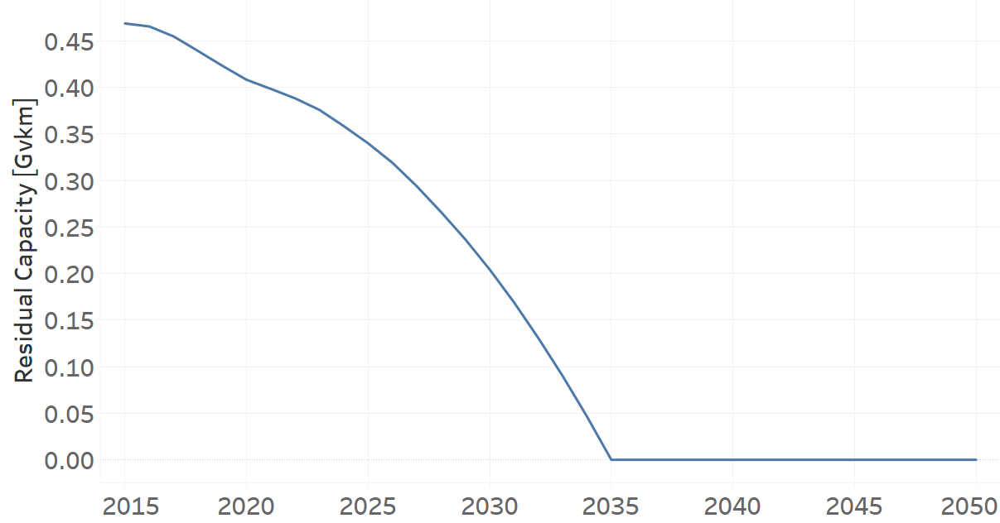
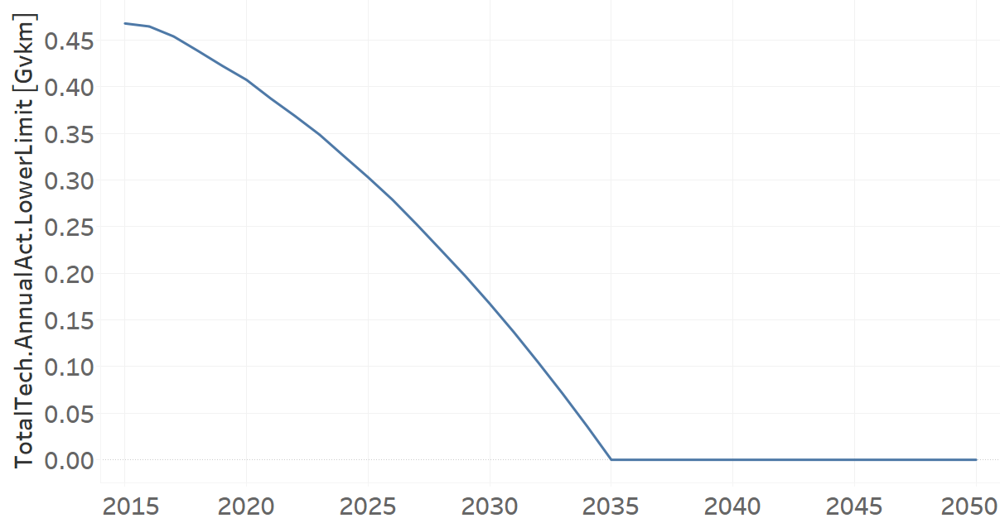
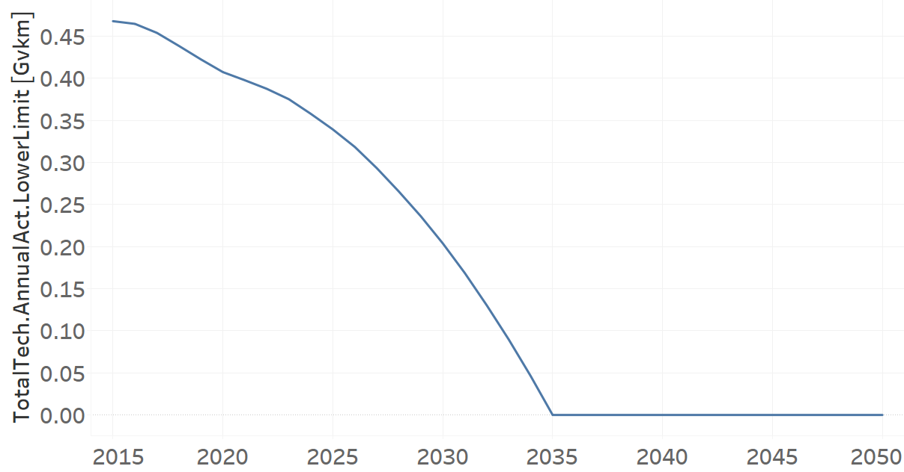

TRBUSDSL01: Bus Diesel (existing)
=====================================

+-------------------------------------------------+-------+--------------+--------------+--------------+--------------+
| .. figure:: img/TRBUSDSL.png                                                                                        |
|    :align:   center                                                                                                 |
|    :width:   500 px                                                                                                 |
+-------------------------------------------------+-------+--------------+--------------+--------------+--------------+
| Set codification:                                       |TRBUSDSL01                                                 |
+-------------------------------------------------+-------+--------------+--------------+--------------+--------------+
| Description:                                            |Bus Diesel (existing)                                      |
+-------------------------------------------------+-------+--------------+--------------+--------------+--------------+
| Set:                                                    |Technology                                                 |
+-------------------------------------------------+-------+--------------+--------------+--------------+--------------+
| Parameter                                       | Unit  | 2020         | 2030         | 2040         |  2050        |
+=================================================+=======+==============+==============+==============+==============+
| DistanceDriven[r,t,y]                           |km/year| 65460        | 65460        | 65460        | 65460        |
+-------------------------------------------------+-------+--------------+--------------+--------------+--------------+
| EmissionActivityRatio[r,t,e,m,y] (Accidents)    |   -   | 0.1          | 0.1          | 0.1          | 0.1          |
+-------------------------------------------------+-------+--------------+--------------+--------------+--------------+
| EmissionActivityRatio[r,t,e,m,y] (Congestion)   |   -   | 0.16         | 0.16         | 0.16         | 0.16         |
+-------------------------------------------------+-------+--------------+--------------+--------------+--------------+
| EmissionActivityRatio[r,t,e,m,y] (Health)       |   -   | 0.06         | 0.06         | 0.06         | 0.06         |
+-------------------------------------------------+-------+--------------+--------------+--------------+--------------+
| FixedCost[r,t,y]                                |M$/Gvkm| 171.78       | 171.78       | 171.78       | 171.78       |
+-------------------------------------------------+-------+--------------+--------------+--------------+--------------+
| InputActivityRatio[r,t,f,m,y] (Diesel for       | PJ/   | 8.62         | 8.62         | 8.62         | 8.62         |
| public transport)                               | Gvkm  |              |              |              |              |
+-------------------------------------------------+-------+--------------+--------------+--------------+--------------+
| OperationalLife[r,t]                            | Years | 15           | 15           | 15           | 15           |
+-------------------------------------------------+-------+--------------+--------------+--------------+--------------+
| OutputActivityRatio[r,t,f,m,y] (Public Transport| PJ/   | 1            | 1            | 1            | 1            |
| in Buses)                                       | Gvkm  |              |              |              |              |
+-------------------------------------------------+-------+--------------+--------------+--------------+--------------+
| ResidualCapacity[r,t,y] (BAU)                   |  Gvkm | 0.4083       | 0.1678       | 0            | 0            |
+-------------------------------------------------+-------+--------------+--------------+--------------+--------------+
| ResidualCapacity[r,t,y] (NDP and OP15C)         |  Gvkm | 0.4083       | 0.2044       | 0            | 0            |
+-------------------------------------------------+-------+--------------+--------------+--------------+--------------+
| TotalAnnualMaxCapacity[r,t,y] (BAU)             |  Gvkm | 0.4083       | 0.1678       | 0            | 0            |
+-------------------------------------------------+-------+--------------+--------------+--------------+--------------+
| TotalAnnualMaxCapacity[r,t,y] (NDP and OP15C)   |  Gvkm | 0.4083       | 0.2044       | 0            | 0            |
+-------------------------------------------------+-------+--------------+--------------+--------------+--------------+
| TotalTechnologyAnnualActivityLowerLimit[r,t,y]  | Gvkm  | 0.4074       | 0.1674       | 0            | 0            |
| (BAU)                                           |       |              |              |              |              |
+-------------------------------------------------+-------+--------------+--------------+--------------+--------------+
| TotalTechnologyAnnualActivityLowerLimit[r,t,y]  | Gvkm  | 0.4074       | 0.204        | 0            | 0            |
| (NDP and OP15C)                                 |       |              |              |              |              |
+-------------------------------------------------+-------+--------------+--------------+--------------+--------------+
| UnitFixedCost[r,t,y]                            |   $   | 11244.7188   | 11244.7188   | 11244.7188   | 11244.7188   |
+-------------------------------------------------+-------+--------------+--------------+--------------+--------------+

DistanceDriven[r,t,y]
+++++++++
The equation (1) shows the Distance Driven for TRBUSDSL01, for every scenario.

DistanceDriven=65460 [km/year]   (1)

Source:
   This is the source. 
   
Description: 
   This is the description.

EmissionActivityRatio[r,t,e,m,y]
+++++++++
The equation (2) shows the Emission Activity Ratio for TRBUSDSL01, for every scenario and associated to the emission Accidents.

EmissionActivityRatio=0.1    (2)

The equation (3) shows the Emission Activity Ratio for TRBUSDSL01, for every scenario and associated to the emission Congestion.

EmissionActivityRatio=0.16    (3)

The equation (4) shows the Emission Activity Ratio for TRBUSDSL01, for every scenario and associated to the emission Health.

EmissionActivityRatio=0.06    (4)

Source:
   This is the source. 
   
Description: 
   This is the description.

FixedCost[r,t,y]
+++++++++
The equation (5) shows the Fixed Cost for TRBUSDSL01, for every scenario.

FixedCost=171.78 [M$/Gvkm]   (5)

Source:
   This is the source. 
   
Description: 
   This is the description.
   
InputActivityRatio[r,t,f,m,y]
+++++++++
The equation (6) shows the Input Activity Ratio for TRBUSDSL01, for every scenario and associated to the fuel Diesel for public transport. 

InputActivityRatio=8.62 [PJ/Gvkm]   (6)

Source:
   This is the source. 
   
Description: 
   This is the description.   
   
OperationalLife[r,t]
+++++++++
The equation (7) shows the Operational Life for TRBUSDSL01, for every scenario.

OperationalLife=15 Years   (7)

Source:
   This is the source. 
   
Description: 
   This is the description.   
   
OutputActivityRatio[r,t,f,m,y]
+++++++++
The equation (8) shows the Output Activity Ratio for TRBUSDSL01, for every scenario and associated to the fuel Public Transport in Buses.

OutputActivityRatio=1 [PJ/Gvkm]   (8)

Source:
   This is the source. 
   
Description: 
   This is the description.      
   
ResidualCapacity[r,t,y]
+++++++++
The figure 1 shows the Residual Capacity for TRBUSDSL01, for the BAU scenario.

.. figure:: img/TRBUSDSL01_ResidualCapacity_BAU.png
   :align:   center
   :width:   700 px
   
   *Figure 1) Residual Capacity for TRBUSDSL01 for BAU scenario.*
   
The figure 2 shows the Residual Capacity for TRBUSDSL01, for the NDP and OP15C scenarios.

   
   *Figure 2) Residual Capacity for TRBUSDSL01 for NDP and OP15C scenarios.*

Source:
   This is the source. 
   
Description: 
   This is the description.         
   
TotalAnnualMaxCapacity[r,t,y]
+++++++++
The figure 3 shows the Total Annual Max Capacity for TRBUSDSL01, for the BAU scenario.

.. figure:: img/TRBUSDSL01_TotalAnnualMaxCapacity_BAU.png
   :align:   center
   :width:   700 px
   
   *Figure 3) Total Annual Max Capacity for TRBUSDSL01 for BAU scenario.*
   
The figure 4 shows the Total Annual Max Capacity for TRBUSDSL01, for the NDP and OP15C scenarios.

.. figure:: img/TRBUSDSL01_TotalAnnualMaxCapacity_NDP_OP.png
   :align:   center
   :width:   700 px
   
   *Figure 4) Total Annual Max Capacity for TRBUSDSL01 for NDP and OP15C scenarios.*

Source:
   This is the source. 
   
Description: 
   This is the description.
   
TotalTechnologyAnnualActivityLowerLimit[r,t,y]
+++++++++
The figure 5 shows the Total Technology Annual Activity Lower Limit for TRBUSDSL01, for the BAU scenario.

   
   *Figure 5) Total Technology Annual Activity Lower Limit for TRBUSDSL01 for BAU scenario.*
   
The figure 6 shows the Total Technology Annual Activity Lower Limit for TRBUSDSL01, for the NDP and OP15C scenarios.

   
   *Figure 6) Total Technology Annual Activity Lower Limit for TRBUSDSL01 for NDP and OP15C scenarios.*

Source:
   This is the source. 
   
Description: 
   This is the description.
   
UnitFixedCost[r,t,y]
+++++++++
The equation (9) shows the Unit Fixed Cost for TRBUSDSL01, for every scenario.

UnitFixedCost=11244.7188 [$]   (9)

Source:
   This is the source. 
   
Description: 
   This is the description.
