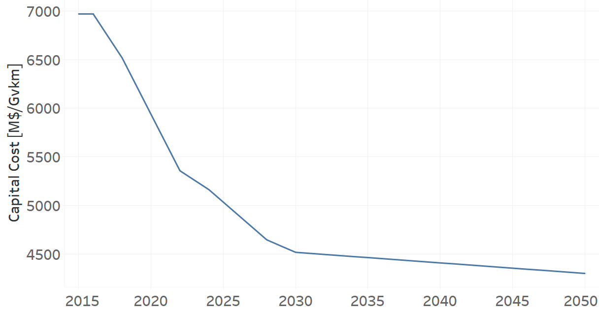
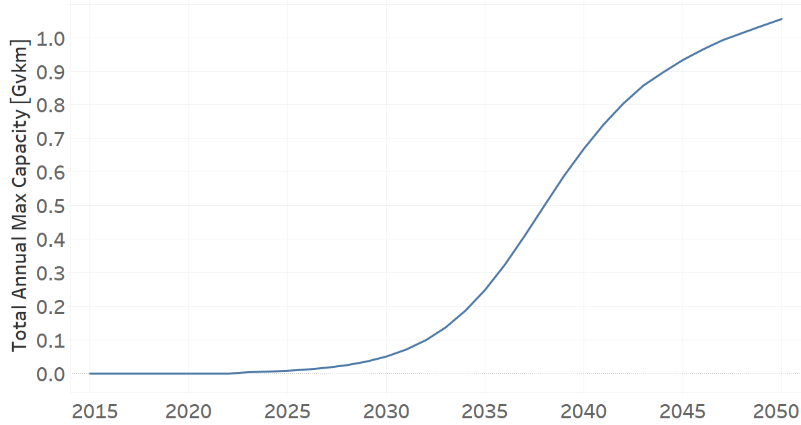
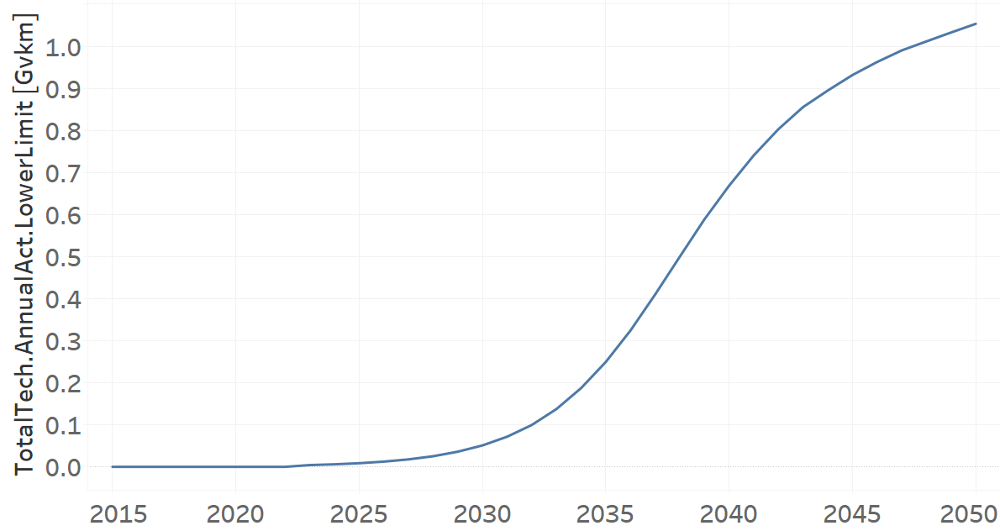
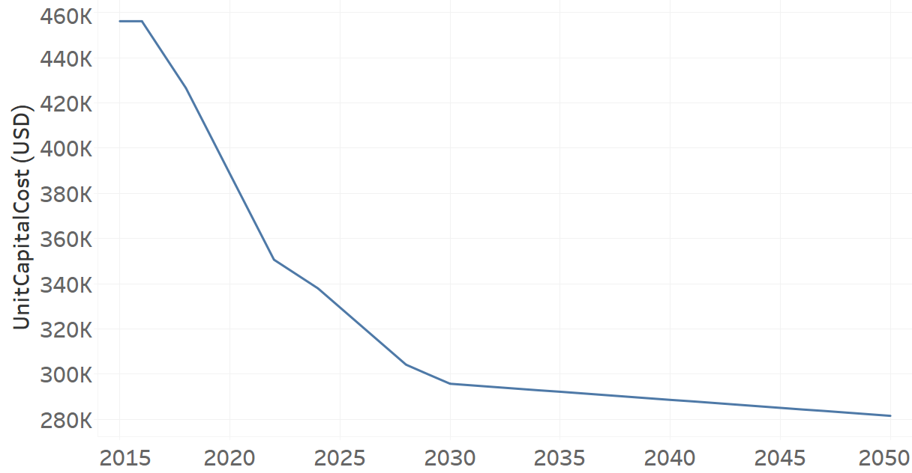

TRBUSELC02: Bus Electric (new)
=====================================

+-------------------------------------------------+-------+--------------+--------------+--------------+--------------+
| .. figure:: img/TRBUSELC.jpg                                                                                        |
|    :align:   center                                                                                                 |
|    :width:   500 px                                                                                                 |
+-------------------------------------------------+-------+--------------+--------------+--------------+--------------+
| Set codification:                                       |TRBUSELC02                                                 |
+-------------------------------------------------+-------+--------------+--------------+--------------+--------------+
| Description:                                            |Bus Electric (new)                                         |
+-------------------------------------------------+-------+--------------+--------------+--------------+--------------+
| Set:                                                    |Technology                                                 |
+-------------------------------------------------+-------+--------------+--------------+--------------+--------------+
| Parameter                                       | Unit  | 2020         | 2030         | 2040         |  2050        |
+=================================================+=======+==============+==============+==============+==============+
| CapitalCost[r,t,y]                              |M$/Gvkm| 5936         | 4517         | 4408         | 4300         |
+-------------------------------------------------+-------+--------------+--------------+--------------+--------------+
| DistanceDriven[r,t,y]                           |km/year| 65460        | 65460        | 65460        | 65460        |
+-------------------------------------------------+-------+--------------+--------------+--------------+--------------+
| EmissionActivityRatio[r,t,e,m,y] (Accidents)    |  -    | 0.1          | 0.1          | 0.1          | 0.1          |
+-------------------------------------------------+-------+--------------+--------------+--------------+--------------+
| EmissionActivityRatio[r,t,e,m,y] (Congestion)   | -     | 0.16         | 0.16         | 0.16         | 0.16         |
+-------------------------------------------------+-------+--------------+--------------+--------------+--------------+
| FixedCost[r,t,y]                                |M$/Gvkm| 56.6874      | 56.6874      | 56.6874      | 56.6874      |
+-------------------------------------------------+-------+--------------+--------------+--------------+--------------+
| InputActivityRatio[r,t,f,m,y] (Electricity for  | PJ/   | 4.79         | 4.79         | 4.79         | 4.79         |
| public transport)                               | Gvkm  |              |              |              |              |
+-------------------------------------------------+-------+--------------+--------------+--------------+--------------+
| OperationalLife[r,t]                            | Years | 12           | 12           | 12           | 12           |
+-------------------------------------------------+-------+--------------+--------------+--------------+--------------+
| OutputActivityRatio[r,t,f,m,y] (Public Transport| PJ/   | 1            | 1            | 1            | 1            |
| in Buses)                                       | Gvkm  |              |              |              |              |
+-------------------------------------------------+-------+--------------+--------------+--------------+--------------+
| TotalAnnualMaxCapacity[r,t,y] (BAU)             |  Gvkm | 0            | 99999        | 99999        | 99999        |
+-------------------------------------------------+-------+--------------+--------------+--------------+--------------+
| TotalAnnualMaxCapacity[r,t,y] (NDP)             |  Gvkm | 0            | 0.051        | 0.6698       | 1.0554       |
+-------------------------------------------------+-------+--------------+--------------+--------------+--------------+
| TotalTechnologyAnnualActivityLowerLimit[r,t,y]  | Gvkm  | 0            | 0.0509       | 0.6684       | 1.0533       |
| (NDP)                                           |       |              |              |              |              |
+-------------------------------------------------+-------+--------------+--------------+--------------+--------------+
| UnitCapitalCost[r,t,y]                          |   $   | 388570.56    | 295682.82    | 288547.68    | 281478       |
+-------------------------------------------------+-------+--------------+--------------+--------------+--------------+
| UnitFixedCost[r,t,y]                            |   $   | 3710.7572    | 3710.7572    | 3710.7572    | 3710.7572    |
+-------------------------------------------------+-------+--------------+--------------+--------------+--------------+

CapitalCost[r,t,y]
+++++++++

The figure 1 shows the Capital Cost for TRBUSELC02, for every scenario.

   
   *Figure 1) Capital Cost for TRBUSELC02 for every scenario.*
   
Source:
   This is the source. 
   
Description: 
   This is the description. 

DistanceDriven[r,t,y]
+++++++++
The equation (1) shows the Distance Driven for TRBUSELC02, for every scenario.

DistanceDriven=65460 [km/year]   (1)

Source:
   This is the source. 
   
Description: 
   This is the description.

EmissionActivityRatio[r,t,e,m,y]
+++++++++
The equation (2) shows the Emission Activity Ratio for TRBUSELC02, for every scenario and associated to the emission Accidents.

EmissionActivityRatio=0.1    (2)

The equation (3) shows the Emission Activity Ratio for TRBUSELC02, for every scenario and associated to the emission Congestion.

EmissionActivityRatio=0.16    (3)

Source:
   This is the source. 
   
Description: 
   This is the description.

FixedCost[r,t,y]
+++++++++
The equation (4) shows the Fixed Cost for TRBUSELC02, for every scenario.

FixedCost=56.6874 [M$/Gvkm]   (4)

Source:
   This is the source. 
   
Description: 
   This is the description.
   
InputActivityRatio[r,t,f,m,y]
+++++++++
The equation (5) shows the Input Activity Ratio for TRBUSELC02, for every scenario and associated to the fuel Electricity for public transport. 

InputActivityRatio=4.79 [PJ/Gvkm]   (5)

 
   
OperationalLife[r,t]
+++++++++
The equation (6) shows the Operational Life for TRBUSELC02, for every scenario.

OperationalLife=12 Years   (6)

 
   
OutputActivityRatio[r,t,f,m,y]
+++++++++
The equation (7) shows the Output Activity Ratio for TRBUSELC02, for every scenario and associated to the fuel Public Transport in Buses.

OutputActivityRatio=1 [PJ/Gvkm]   (7)

   
TotalAnnualMaxCapacity[r,t,y]
+++++++++
The figure 2 shows the Total Annual Max Capacity for TRBUSELC02, for the BAU scenario.

.. figure:: img/TRBUSELC02_TotalAnnualMaxCapacity_BAU.png
   :align:   center
   :width:   700 px
   
   *Figure 2) Total Annual Max Capacity for TRBUSELC02 for the BAU scenario.*
   
The figure 3 shows the Total Annual Max Capacity for TRBUSELC02, for the NDP scenario.

   
   *Figure 3) Total Annual Max Capacity for TRBUSELC02 for the NDP scenario.*

   
TotalTechnologyAnnualActivityLowerLimit[r,t,y]
+++++++++
The figure 4 shows the Total Technology Annual Activity Lower Limit for TRBUSELC02, for the NDP scenario.

   
   *Figure 4) Total Technology Annual Activity Lower Limit for TRBUSELC02 for the NDP scenario.*

Source:
   This is the source. 
   
Description: 
   This is the description.
   
UnitCapitalCost[r,t,y]
+++++++++
The figure 5 shows the Unit Capital Cost for TRBUSELC02, for every scenario.

   
   *Figure 5) Unit Capital Cost for TRBUSELC02 for every scenario.*
Source:
   This is the source. 
   
Description: 
   This is the description.
   
   
UnitFixedCost[r,t,y]
+++++++++
The equation (8) shows the Unit Fixed Cost for TRBUSELC02, for every scenario.

UnitFixedCost=3710.7572 [$]   (8)

Source:
   This is the source. 
   
Description: 
   This is the description.
   
