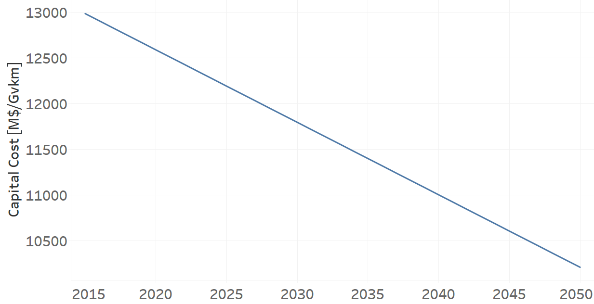
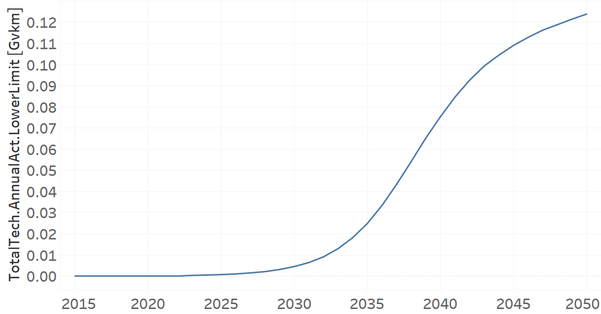
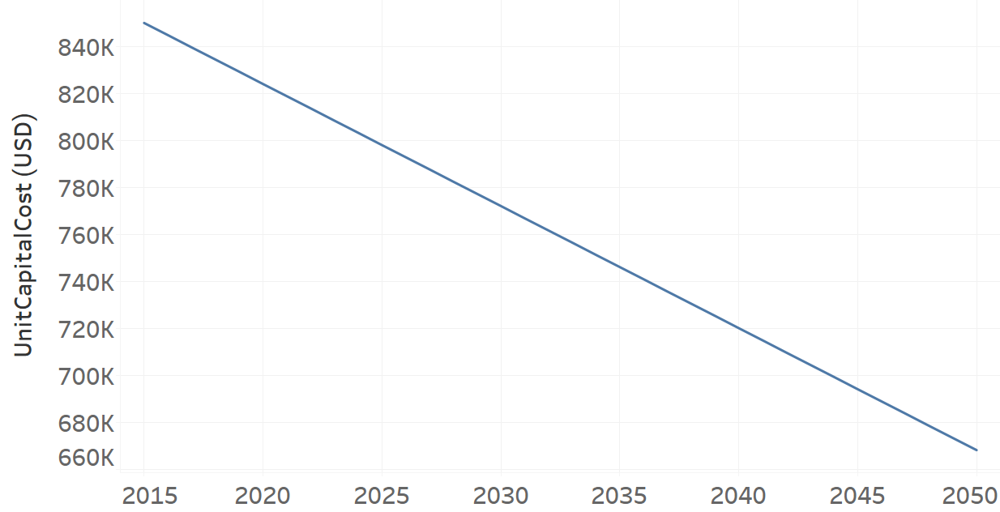

TRBUSHYD02: Bus Hydrogen (new)
=====================================

+-------------------------------------------------+-------+--------------+--------------+--------------+--------------+
| .. figure:: img/TRBUSHYD.jpg                                                                                        |
|    :align:   center                                                                                                 |
|    :width:   500 px                                                                                                 |
+-------------------------------------------------+-------+--------------+--------------+--------------+--------------+
| Set codification:                                       |TRBUSHYD02                                                 |
+-------------------------------------------------+-------+--------------+--------------+--------------+--------------+
| Description:                                            |Bus Hydrogen (new)                                         |
+-------------------------------------------------+-------+--------------+--------------+--------------+--------------+
| Set:                                                    |Technology                                                 |
+-------------------------------------------------+-------+--------------+--------------+--------------+--------------+
| Parameter                                       | Unit  | 2020         | 2030         | 2040         |  2050        |
+=================================================+=======+==============+==============+==============+==============+
| CapitalCost[r,t,y]                              |M$/Gvkm| 12588        | 11795        | 11001        | 10208        |
+-------------------------------------------------+-------+--------------+--------------+--------------+--------------+
| DistanceDriven[r,t,y]                           |km/year| 65460        | 65460        | 65460        | 65460        |
+-------------------------------------------------+-------+--------------+--------------+--------------+--------------+
| EmissionActivityRatio[r,t,e,m,y] (Accidents)    |  -    | 0.1          | 0.1          | 0.1          | 0.1          |
+-------------------------------------------------+-------+--------------+--------------+--------------+--------------+
| EmissionActivityRatio[r,t,e,m,y] (Congestion)   |  -    | 0.16         | 0.16         | 0.16         | 0.16         |
+-------------------------------------------------+-------+--------------+--------------+--------------+--------------+
| FixedCost[r,t,y]                                |M$/Gvkm| 56.6874      | 56.6874      | 56.6874      | 56.6874      |
+-------------------------------------------------+-------+--------------+--------------+--------------+--------------+
| InputActivityRatio[r,t,f,m,y] (Hydrogen for     | PJ/   | 5.45         | 5.45         | 5.45         | 5.45         |
| public transport)                               | Gvkm  |              |              |              |              |
+-------------------------------------------------+-------+--------------+--------------+--------------+--------------+
| OperationalLife[r,t]                            | Years | 12           | 12           | 12           | 12           |
+-------------------------------------------------+-------+--------------+--------------+--------------+--------------+
| OutputActivityRatio[r,t,f,m,y] (Public Transport| PJ/   | 1            | 1            | 1            | 1            |
| in Buses)                                       | Gvkm  |              |              |              |              |
+-------------------------------------------------+-------+--------------+--------------+--------------+--------------+
| TotalAnnualMaxCapacity[r,t,y]                   | Gvkm  | 0            | 99999        | 99999        | 99999        |
+-------------------------------------------------+-------+--------------+--------------+--------------+--------------+
| TotalTechnologyAnnualActivityLowerLimit[r,t,y]  | Gvkm  | 0            | 0.0045       | 0.0754       | 0.1239       |
| (OP15C)                                         |       |              |              |              |              |
+-------------------------------------------------+-------+--------------+--------------+--------------+--------------+
| UnitCapitalCost[r,t,y]                          |   $   | 824010.48    | 772100.7     | 720125.46    | 668215.68    |
+-------------------------------------------------+-------+--------------+--------------+--------------+--------------+
| UnitFixedCost[r,t,y]                            |   $   | 3710.7572    | 3710.7572    | 3710.7572    | 3710.7572    |
+-------------------------------------------------+-------+--------------+--------------+--------------+--------------+

CapitalCost[r,t,y]
+++++++++

The figure 1 shows the Capital Cost for TRBUSHYD02, for every scenario.

   
   *Figure 1) Capital Cost for TRBUSHYD02 for every scenario.*
   

DistanceDriven[r,t,y]
+++++++++
The equation (1) shows the Distance Driven for TRBUSHYD02, for every scenario.

DistanceDriven=65460 [km/year]   (1)

EmissionActivityRatio[r,t,e,m,y]
+++++++++
The equation (2) shows the Emission Activity Ratio for TRBUSHYD02, for every scenario and associated to the emission Accidents.

EmissionActivityRatio=0.1    (2)

The equation (3) shows the Emission Activity Ratio for TRBUSHYD02, for every scenario and associated to the emission Congestion.

EmissionActivityRatio=0.16    (3)

FixedCost[r,t,y]
+++++++++
The equation (4) shows the Fixed Cost for TRBUSHYD02, for every scenario.

FixedCost=56.6874 [M$/Gvkm]   (4)

   
InputActivityRatio[r,t,f,m,y]
+++++++++
The equation (5) shows the Input Activity Ratio for TRBUSHYD02, for every scenario and associated to the fuel Hydrogen for public transport. 

InputActivityRatio=5.45 [PJ/Gvkm]   (5)

   
   
OperationalLife[r,t]
+++++++++
The equation (6) shows the Operational Life for TRBUSHYD02, for every scenario.

OperationalLife=12 Years   (6)

  
   
OutputActivityRatio[r,t,f,m,y]
+++++++++
The equation (7) shows the Output Activity Ratio for TRBUSHYD02, for every scenario and associated to the fuel Public Transport in Buses.

OutputActivityRatio=1 [PJ/Gvkm]   (7)

   
TotalAnnualMaxCapacity[r,t,y]
+++++++++
The figure 2 shows the Total Annual Max Capacity for TRBUSHYD02, for every scenario.

.. figure:: img/TRBUSHYD02_TotalAnnualMaxCapacity.png
   :align:   center
   :width:   700 px
   
   *Figure 2) Total Annual Max Capacity for TRBUSHYD02 for every scenario.*

 
   
TotalTechnologyAnnualActivityLowerLimit[r,t,y]
+++++++++   
The figure 3 shows the Total Technology Annual Activity Lower Limit for TRBUSHYD02, for the NDP scenario.

   
   *Figure 3) Total Technology Annual Activity Lower Limit for TRBUSHYD02 for the NDP scenario.*

   
UnitCapitalCost[r,t,y]
+++++++++
The figure 4 shows the Unit Capital Cost for TRBUSHYD02, for every scenario.

   
   *Figure 4) Unit Capital Cost for TRBUSHYD02 for every scenario.*

   
UnitFixedCost[r,t,y]
+++++++++
The equation (8) shows the Unit Fixed Cost for TRBUSHYD02, for every scenario.

UnitFixedCost=3710.7572 [$]   (8)

