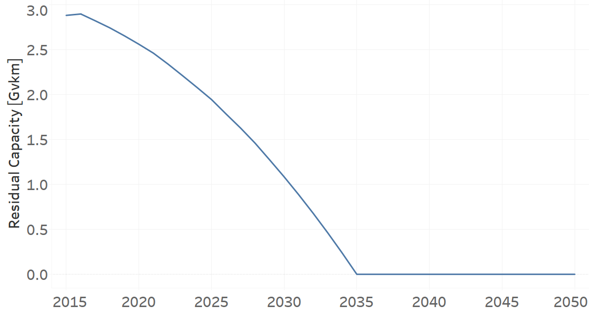
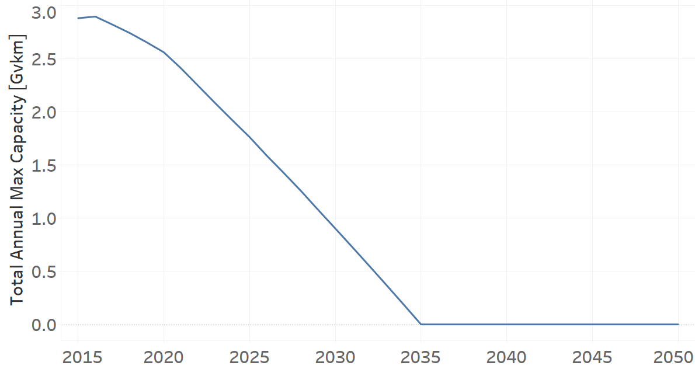

TRFWDGAS01: Four-Wheel-Drive Gasoline (existing)
=====================================

+-------------------------------------------------+-------+--------------+--------------+--------------+--------------+
| .. figure:: img/TRFWDGAS.png                                                                                        |
|    :align:   center                                                                                                 |
|    :width:   500 px                                                                                                 |
+-------------------------------------------------+-------+--------------+--------------+--------------+--------------+
| Set codification:                                       |TRFWDGAS01                                                 |
+-------------------------------------------------+-------+--------------+--------------+--------------+--------------+
| Description:                                            |Four-Wheel-Drive Gasoline (existing)                       |
+-------------------------------------------------+-------+--------------+--------------+--------------+--------------+
| Set:                                                    |Technology                                                 |
+-------------------------------------------------+-------+--------------+--------------+--------------+--------------+
| Parameter                                       | Unit  | 2020         | 2030         | 2040         |  2050        |
+=================================================+=======+==============+==============+==============+==============+
| DistanceDriven[r,t,y]                           |km/year| 14773        | 14773        | 14773        | 14773        |
+-------------------------------------------------+-------+--------------+--------------+--------------+--------------+
| EmissionActivityRatio[r,t,e,m,y] (Accidents)    |   -   | 0.09         | 0.09         | 0.09         | 0.09         |
+-------------------------------------------------+-------+--------------+--------------+--------------+--------------+
| EmissionActivityRatio[r,t,e,m,y] (Congestion)   |   -   | 0.081        | 0.081        | 0.081        | 0.081        |
+-------------------------------------------------+-------+--------------+--------------+--------------+--------------+
| FixedCost[r,t,y]                                |M$/Gvkm| 61.65        | 61.65        | 61.65        | 61.65        |
+-------------------------------------------------+-------+--------------+--------------+--------------+--------------+
| InputActivityRatio[r,t,f,m,y] (Gasoline for     | PJ/   | 2.808        | 2.664        | 2.592        | 2.592        |
| private transport)                              | Gvkm  |              |              |              |              |
+-------------------------------------------------+-------+--------------+--------------+--------------+--------------+
| OperationalLife[r,t]                            | Years | 15           | 15           | 15           | 15           |
+-------------------------------------------------+-------+--------------+--------------+--------------+--------------+
| OutputActivityRatio[r,t,f,m,y] (Private         | PJ/   | 1            | 1            | 1            | 1            |
| Transport in Four Wheel Drive)                  | Gvkm  |              |              |              |              |
+-------------------------------------------------+-------+--------------+--------------+--------------+--------------+
| ResidualCapacity[r,t,y] (BAU)                   | Gvkm  | 2.5595       | 1.0839       | 0            | 0            |
+-------------------------------------------------+-------+--------------+--------------+--------------+--------------+
| ResidualCapacity[r,t,y] (NDP)                   | Gvkm  | 2.5595       | 0.9025       | 0            | 0            |
+-------------------------------------------------+-------+--------------+--------------+--------------+--------------+
| TotalAnnualMaxCapacity[r,t,y] (BAU)             | Gvkm  | 2.5595       | 1.0839       | 0            | 0            |
+-------------------------------------------------+-------+--------------+--------------+--------------+--------------+
| TotalAnnualMaxCapacity[r,t,y] (NDP)             | Gvkm  | 2.5595       | 0.9025       | 0            | 0            |
+-------------------------------------------------+-------+--------------+--------------+--------------+--------------+
| TotalTechnologyAnnualActivityLowerLimit[r,t,y]  | Gvkm  | 2.5544       | 1.0818       | 0            | 0            |
| (BAU)                                           |       |              |              |              |              |
+-------------------------------------------------+-------+--------------+--------------+--------------+--------------+
| TotalTechnologyAnnualActivityLowerLimit[r,t,y]  | Gvkm  | 2.5544       | 0.9007       | 0            | 0            |
| (NDP)                                           |       |              |              |              |              |
+-------------------------------------------------+-------+--------------+--------------+--------------+--------------+
| UnitFixedCost[r,t,y]                            |  $    | 910.7554     | 910.7554     | 910.7554     | 910.7554     |
+-------------------------------------------------+-------+--------------+--------------+--------------+--------------+

DistanceDriven[r,t,y]
+++++++++
The equation (1) shows the Distance Driven for TRFWDGAS01, for every scenario.

DistanceDriven=14773 [km/year]   (1)

EmissionActivityRatio[r,t,e,m,y]
+++++++++
The equation (2) shows the Emission Activity Ratio for TRFWDGAS01, for every scenario and associated to the emission Accidents.

EmissionActivityRatio=0.09    (2)

The equation (3) shows the Emission Activity Ratio for TRFWDGAS01, for every scenario and associated to the emission Congestion.

EmissionActivityRatio=0.081    (3)

FixedCost[r,t,y]
+++++++++
The equation (4) shows the Fixed Cost for TRFWDGAS01, for every scenario.

FixedCost=61.65 [M$/Gvkm]   (4)

   
InputActivityRatio[r,t,f,m,y]
+++++++++
The figure 1 shows the Input Activity Ratio for TRFWDGAS01, for every scenario and associated to the fuel Gasoline for private transport.

.. figure:: img/TRFWDGAS01_InputActivityRatio.png
   :align:   center
   :width:   700 px
   
   *Figure 1) Input Activity Ratio for TRFWDGAS01 for every scenario.*
  
   
OperationalLife[r,t]
+++++++++
The equation (5) shows the Operational Life for TRFWDGAS01, for every scenario.

OperationalLife=15 Years   (5)

  
   
OutputActivityRatio[r,t,f,m,y]
+++++++++
The equation (6) shows the Output Activity Ratio for TRFWDGAS01, for every scenario and associated to the fuel Private Transport in Four Wheel Drive.

OutputActivityRatio=1 [PJ/Gvkm]   (6)

    
   
ResidualCapacity[r,t,y]
+++++++++
The figure 2 shows the Residual Capacity for TRFWDGAS01, for the BAU scenario.

   
   *Figure 2) Residual Capacity for TRFWDGAS01 for the BAU scenario.*
   
The figure 3 shows the Residual Capacity for TRFWDGAS01, for the NDP scenario.

.. figure:: img/TRFWDGAS01_ResidualCapacity_NDP_OP.png
   :align:   center
   :width:   700 px
   
   *Figure 3) Residual Capacity for TRFWDGAS01 for the NDP scenarios.*   
   
        
   
TotalAnnualMaxCapacity[r,t,y]
+++++++++
The figure 4 shows the Total Annual Max Capacity for TRFWDGAS01, for the BAU scenario.

.. figure:: img/TRFWDGAS01_TotalAnnualMaxCapacity_BAU.png
   :align:   center
   :width:   700 px
   
   *Figure 4) Total Annual Max Capacity for TRFWDGAS01 for the BAU scenario.*
   
The figure 5 shows the Total Annual Max Capacity for TRFWDGAS01, for the NDP scenario.

   
   *Figure 5) Total Annual Max Capacity for TRFWDGAS01 for the NDP scenario.*   
   

   
TotalTechnologyAnnualActivityLowerLimit[r,t,y]
+++++++++
The figure 6 shows the Total Technology Annual Activity Lower Limit for TRFWDGAS01, for the BAU scenario.

.. figure:: img/TRFWDGAS01_TotalTechnologyAnnualActivityLowerLimit_BAU.png
   :align:   center
   :width:   700 px
   
   *Figure 6) Total Technology Annual Activity Lower Limit for TRFWDGAS01 for the BAU scenario.*
   
The figure 7 shows the Total Technology Annual Activity Lower Limit for TRFWDGAS01, for the NDP scenario.

.. figure:: img/TRFWDGAS01_TotalTechnologyAnnualActivityLowerLimit_NDP_OP.png
   :align:   center
   :width:   700 px
   
   *Figure 7) Total Technology Annual Activity Lower Limit for TRFWDGAS01 for the NDP scenario.*

   
UnitFixedCost[r,t,y]
+++++++++
The equation (7) shows the Unit Fixed Cost for TRFWDGAS01, for every scenario.

UnitFixedCost=910.7554 [$]   (7)

