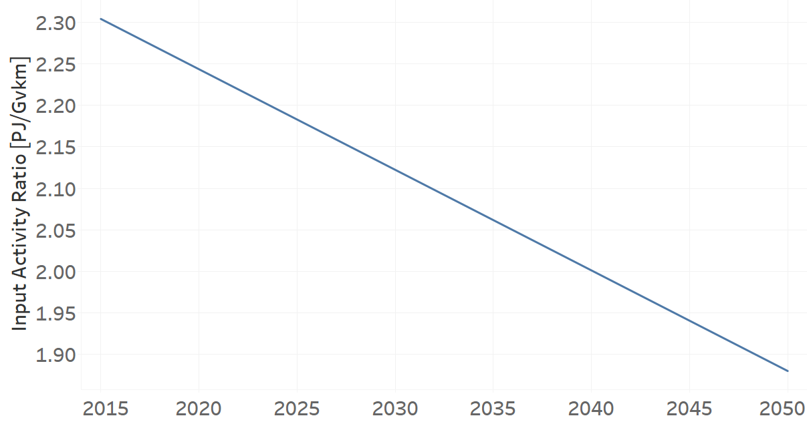
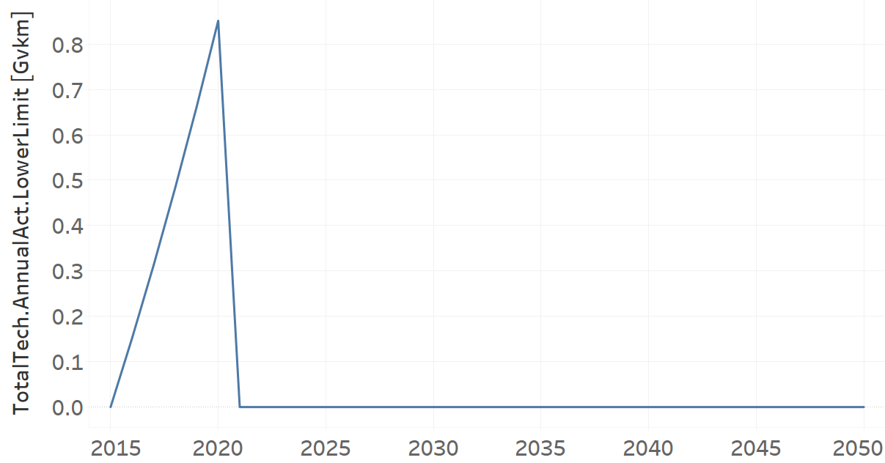

TRFWDGAS02: Four-Wheel-Drive Gasoline (new)
=====================================

+-------------------------------------------------+-------+--------------+--------------+--------------+--------------+
| .. figure:: img/TRFWDGAS.jpg                                                                                        |
|    :align:   center                                                                                                 |
|    :width:   500 px                                                                                                 |
+-------------------------------------------------+-------+--------------+--------------+--------------+--------------+
| Set codification:                                       |TRFWDGAS02                                                 |
+-------------------------------------------------+-------+--------------+--------------+--------------+--------------+
| Description:                                            |Four-Wheel-Drive Gasoline (new)                            |
+-------------------------------------------------+-------+--------------+--------------+--------------+--------------+
| Set:                                                    |Technology                                                 |
+-------------------------------------------------+-------+--------------+--------------+--------------+--------------+
| Parameter                                       | Unit  | 2020         | 2030         | 2040         |  2050        |
+=================================================+=======+==============+==============+==============+==============+
| CapitalCost[r,t,y]                              |M$/Gvkm| 2350.33      | 2350.33      | 2350.33      | 2350.33      |
+-------------------------------------------------+-------+--------------+--------------+--------------+--------------+
| DistanceDriven[r,t,y]                           |km/year| 14773        | 14773        | 14773        | 14773        |
+-------------------------------------------------+-------+--------------+--------------+--------------+--------------+
| EmissionActivityRatio[r,t,e,m,y] (Accidents)    |   -   | 0.09         | 0.09         | 0.09         | 0.09         |
+-------------------------------------------------+-------+--------------+--------------+--------------+--------------+
| EmissionActivityRatio[r,t,e,m,y] (Congestion)   |  -    | 0.081        | 0.081        | 0.081        | 0.081        |
+-------------------------------------------------+-------+--------------+--------------+--------------+--------------+
| FixedCost[r,t,y]                                |M$/Gvkm| 61.65        | 61.65        | 61.65        | 61.65        |
+-------------------------------------------------+-------+--------------+--------------+--------------+--------------+
| InputActivityRatio[r,t,f,m,y] (Gasoline for     | PJ/   | 2.243428571  | 2.122285714  | 2.001142857  | 1.88         |
| private transport)                              | Gvkm  |              |              |              |              |
+-------------------------------------------------+-------+--------------+--------------+--------------+--------------+
| OperationalLife[r,t]                            | Years | 15           | 15           | 15           | 15           |
+-------------------------------------------------+-------+--------------+--------------+--------------+--------------+
| OutputActivityRatio[r,t,f,m,y] (Private         | PJ/   | 1            | 1            | 1            | 1            |
| Transport in Four Wheel Drive)                  | Gvkm  |              |              |              |              |
+-------------------------------------------------+-------+--------------+--------------+--------------+--------------+
| TotalTechnologyAnnualActivityLowerLimit[r,t,y]  | Gvkm  | 0.8514       | 3.2454       | 4.4622       | 5.2426       |
| (BAU)                                           |       |              |              |              |              |
+-------------------------------------------------+-------+--------------+--------------+--------------+--------------+
| TotalTechnologyAnnualActivityLowerLimit[r,t,y]  | Gvkm  | 0.8514       | 0            | 0            | 0            |
| (NDP and OP15C)                                 |       |              |              |              |              |
+-------------------------------------------------+-------+--------------+--------------+--------------+--------------+
| UnitCapitalCost[r,t,y]                          |   $   | 34721.4251   | 34721.4251   | 34721.4251   | 34721.4251   |
+-------------------------------------------------+-------+--------------+--------------+--------------+--------------+
| UnitFixedCost[r,t,y]                            |   $   | 910.7554     | 910.7554     | 910.7554     | 910.7554     |
+-------------------------------------------------+-------+--------------+--------------+--------------+--------------+

CapitalCost[r,t,y]
+++++++++
The equation (1) shows the Capital Cost for TRFWDGAS02, for every scenario.

CapitalCost=2350.33 [M$/Gvkm]   (1)

Source:
   This is the source. 
   
Description: 
   This is the description. 

DistanceDriven[r,t,y]
+++++++++
The equation (2) shows the Distance Driven for TRFWDGAS02, for every scenario.

DistanceDriven=14773 [km/year]   (2)

Source:
   This is the source. 
   
Description: 
   This is the description.

EmissionActivityRatio[r,t,e,m,y]
+++++++++
The equation (3) shows the Emission Activity Ratio for TRFWDGAS02, for every scenario and associated to the emission Accidents.

EmissionActivityRatio=0.09    (3)

The equation (4) shows the Emission Activity Ratio for TRFWDGAS02, for every scenario and associated to the emission Congestion.

EmissionActivityRatio=0.081    (4)

Source:
   This is the source. 
   
Description: 
   This is the description.

FixedCost[r,t,y]
+++++++++
The equation (5) shows the Fixed Cost for TRFWDGAS02, for every scenario.

FixedCost=61.65 [M$/Gvkm]   (5)

Source:
   This is the source. 
   
Description: 
   This is the description.
   
InputActivityRatio[r,t,f,m,y]
+++++++++
The figure 1 shows the Input Activity Ratio for TRFWDGAS02, for every scenario and associated to the fuel Gasoline for private transport.

   
   *Figure 1) Input Activity Ratio for TRFWDGAS02 for every scenario.*

Source:
   This is the source. 
   
Description: 
   This is the description.   
   
OperationalLife[r,t]
+++++++++
The equation (6) shows the Operational Life for TRFWDGAS02, for every scenario.

OperationalLife=15 Years   (6)

Source:
   This is the source. 
   
Description: 
   This is the description.   
   
OutputActivityRatio[r,t,f,m,y]
+++++++++
The equation (7) shows the Output Activity Ratio for TRFWDGAS02, for every scenario and associated to the fuel Private Transport in Four Wheel Drive.

OutputActivityRatio=1 [PJ/Gvkm]   (7)

Source:
   This is the source. 
   
Description: 
   This is the description.      
   
TotalTechnologyAnnualActivityLowerLimit[r,t,y]
+++++++++
The figure 2 shows the Total Technology Annual Activity Lower Limit for TRFWDGAS02, for the BAU scenario.

.. figure:: img/TRFWDGAS02_TotalTechnologyAnnualActivityLowerLimit_BAU.png
   :align:   center
   :width:   700 px
   
   *Figure 2) Total Technology Annual Activity Lower Limit for TRFWDGAS02 for BAU scenario.*
   
The figure 3 shows the Total Technology Annual Activity Lower Limit for TRFWDGAS02, for the NDP and OP15C scenarios.

   
   *Figure 3) Total Technology Annual Activity Lower Limit for TRFWDGAS02 for NDP and OP15C scenarios.*

Source:
   This is the source. 
   
Description: 
   This is the description.
   
UnitCapitalCost[r,t,y]
+++++++++
The equation (8) shows the Unit Capital Cost for TRFWDGAS02, for every scenario.

UnitCapitalCost=34721.4251 [$]   (8)

Source:
   This is the source. 
   
Description: 
   This is the description.
   
   
UnitFixedCost[r,t,y]
+++++++++
The equation (9) shows the Unit Fixed Cost for TRFWDGAS02, for every scenario.

UnitFixedCost=910.7554 [$]   (9)

Source:
   This is the source. 
   
Description: 
   This is the description.
