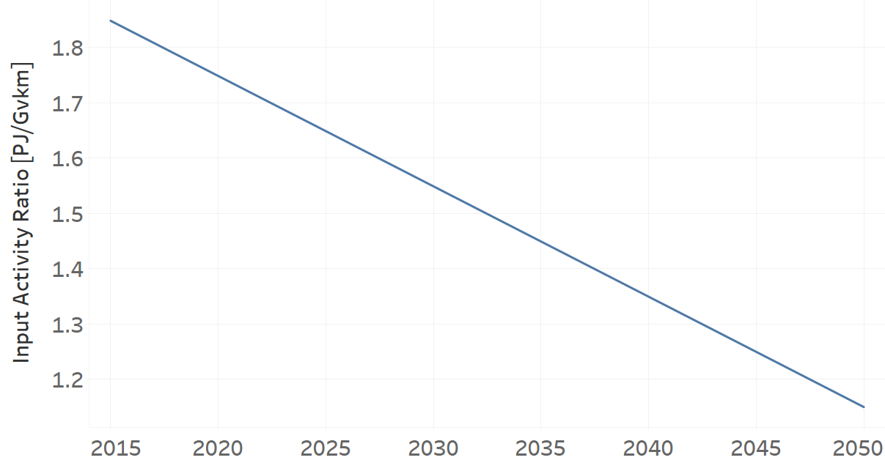
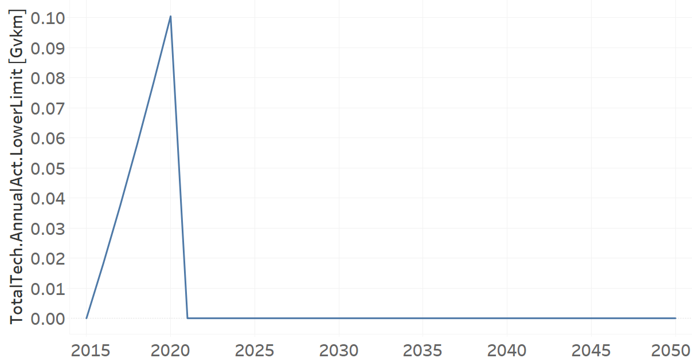

TRLDDSL02: Light Duty Diesel (new)
=====================================

+-------------------------------------------------+-------+--------------+--------------+--------------+--------------+
| .. figure:: img/TRLDDSL.jpg                                                                                         |
|    :align:   center                                                                                                 |
|    :width:   500 px                                                                                                 |
+-------------------------------------------------+-------+--------------+--------------+--------------+--------------+
| Set codification:                                       |TRLDDSL02                                                  |
+-------------------------------------------------+-------+--------------+--------------+--------------+--------------+
| Description:                                            |Light Duty Diesel (new)                                    |
+-------------------------------------------------+-------+--------------+--------------+--------------+--------------+
| Set:                                                    |Technology                                                 |
+-------------------------------------------------+-------+--------------+--------------+--------------+--------------+
| Parameter                                       | Unit  | 2020         | 2030         | 2040         |  2050        |
+=================================================+=======+==============+==============+==============+==============+
| CapitalCost[r,t,y]                              |M$/Gvkm| 1239.09      | 1239.09      | 1239.09      | 1239.09      |
+-------------------------------------------------+-------+--------------+--------------+--------------+--------------+
| DistanceDriven[r,t,y]                           |km/year| 14773        | 14773        | 14773        | 14773        |
+-------------------------------------------------+-------+--------------+--------------+--------------+--------------+
| EmissionActivityRatio[r,t,e,m,y] (Accidents)    |   -   | 0.09         | 0.09         | 0.09         | 0.09         |
+-------------------------------------------------+-------+--------------+--------------+--------------+--------------+
| EmissionActivityRatio[r,t,e,m,y] (Congestion)   |  -    | 0.081        | 0.081        | 0.081        | 0.081        |
+-------------------------------------------------+-------+--------------+--------------+--------------+--------------+
| EmissionActivityRatio[r,t,e,m,y] (Health)       |   -   | 0.01         | 0.01         | 0.01         | 0.01         |
+-------------------------------------------------+-------+--------------+--------------+--------------+--------------+
| FixedCost[r,t,y]                                |M$/Gvkm| 49.32        | 49.32        | 49.32        | 49.32        |
+-------------------------------------------------+-------+--------------+--------------+--------------+--------------+
| InputActivityRatio[r,t,f,m,y] (Diesel for       | PJ/   | 1.748285714  | 1.548857143  | 1.349428571  | 1.15         |
| private transport)                              | Gvkm  |              |              |              |              |
+-------------------------------------------------+-------+--------------+--------------+--------------+--------------+
| OperationalLife[r,t]                            | Years | 15           | 15           | 15           | 15           |
+-------------------------------------------------+-------+--------------+--------------+--------------+--------------+
| OutputActivityRatio[r,t,f,m,y] (Private         | PJ/   | 1            | 1            | 1            | 1            |
| Transport in Light Duty)                        | Gvkm  |              |              |              |              |
+-------------------------------------------------+-------+--------------+--------------+--------------+--------------+
| TotalTechnologyAnnualActivityLowerLimit[r,t,y]  | Gvkm  | 0.1005       | 0.3652       | 0.4944       | 0.5814       |
| (BAU)                                           |       |              |              |              |              |
+-------------------------------------------------+-------+--------------+--------------+--------------+--------------+
| TotalTechnologyAnnualActivityLowerLimit[r,t,y]  | Gvkm  | 0.1005       | 0            | 0            | 0            |
| (NDP and OP15C)                                 |       |              |              |              |              |
+-------------------------------------------------+-------+--------------+--------------+--------------+--------------+
| UnitCapitalCost[r,t,y]                          |   $   | 18305.0766   | 18305.0766   | 18305.0766   | 18305.0766   |
+-------------------------------------------------+-------+--------------+--------------+--------------+--------------+
| UnitFixedCost[r,t,y]                            |   $   | 728.6044     | 728.6044     | 728.6044     | 728.6044     |
+-------------------------------------------------+-------+--------------+--------------+--------------+--------------+

CapitalCost[r,t,y]
+++++++++
The equation (1) shows the Capital Cost for TRLDDSL02, for every scenario.

CapitalCost=1239.09 [M$/Gvkm]   (1)

Source:
   This is the source. 
   
Description: 
   This is the description. 

DistanceDriven[r,t,y]
+++++++++
The equation (2) shows the Distance Driven for TRLDDSL02, for every scenario.

DistanceDriven=14773 [km/year]   (2)

Source:
   This is the source. 
   
Description: 
   This is the description.

EmissionActivityRatio[r,t,e,m,y]
+++++++++
The equation (3) shows the Emission Activity Ratio for TRLDDSL02, for every scenario and associated to the emission Accidents.

EmissionActivityRatio=0.09    (3)

The equation (4) shows the Emission Activity Ratio for TRLDDSL02, for every scenario and associated to the emission Congestion.

EmissionActivityRatio=0.081    (4)

The equation (5) shows the Emission Activity Ratio for TRLDDSL02, for every scenario and associated to the emission Health.

EmissionActivityRatio=0.01    (5)

Source:
   This is the source. 
   
Description: 
   This is the description.

FixedCost[r,t,y]
+++++++++
The equation (6) shows the Fixed Cost for TRLDDSL02, for every scenario.

FixedCost=49.32 [M$/Gvkm]   (6)

Source:
   This is the source. 
   
Description: 
   This is the description.
   
InputActivityRatio[r,t,f,m,y]
+++++++++
The figure 1 shows the Input Activity Ratio for TRLDDSL02, for every scenario and associated to the fuel Diesel for private transport.

   
   *Figure 1) Input Activity Ratio for TRLDDSL02 for every scenario.*

Source:
   This is the source. 
   
Description: 
   This is the description.   
   
OperationalLife[r,t]
+++++++++
The equation (7) shows the Operational Life for TRLDDSL02, for every scenario.

OperationalLife=15 Years   (7)

Source:
   This is the source. 
   
Description: 
   This is the description.   
   
OutputActivityRatio[r,t,f,m,y]
+++++++++
The equation (8) shows the Output Activity Ratio for TRLDDSL02, for every scenario and associated to the fuel Private Transport in Light Duty.

OutputActivityRatio=1 [PJ/Gvkm]   (8)

Source:
   This is the source. 
   
Description: 
   This is the description.      
   
TotalTechnologyAnnualActivityLowerLimit[r,t,y]
+++++++++
The figure 2 shows the Total Technology Annual Activity Lower Limit for TRLDDSL02, for the BAU scenario.

.. figure:: img/TRLDDSL02_TotalTechnologyAnnualActivityLowerLimit_BAU.png
   :align:   center
   :width:   700 px
   
   *Figure 2) Total Technology Annual Activity Lower Limit for TRLDDSL02 for BAU scenario.*
   
The figure 3 shows the Total Technology Annual Activity Lower Limit for TRLDDSL02, for the NDP and OP15C scenarios.

   
   *Figure 3) Total Technology Annual Activity Lower Limit for TRLDDSL02 for NDP and OP15C scenarios.*

Source:
   This is the source. 
   
Description: 
   This is the description.
   
UnitCapitalCost[r,t,y]
+++++++++
The equation (9) shows the Unit Capital Cost for TRLDDSL02, for every scenario.

UnitCapitalCost=18305.0766 [$]   (9)

Source:
   This is the source. 
   
Description: 
   This is the description.
   
   
UnitFixedCost[r,t,y]
+++++++++
The equation (10) shows the Unit Fixed Cost for TRLDDSL02, for every scenario.

UnitFixedCost=728.6044 [$]   (10)

Source:
   This is the source. 
   
Description: 
   This is the description.
