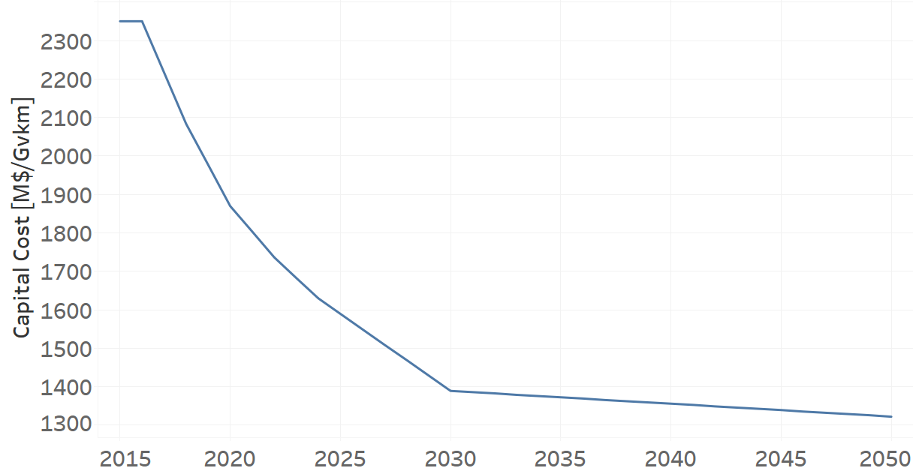
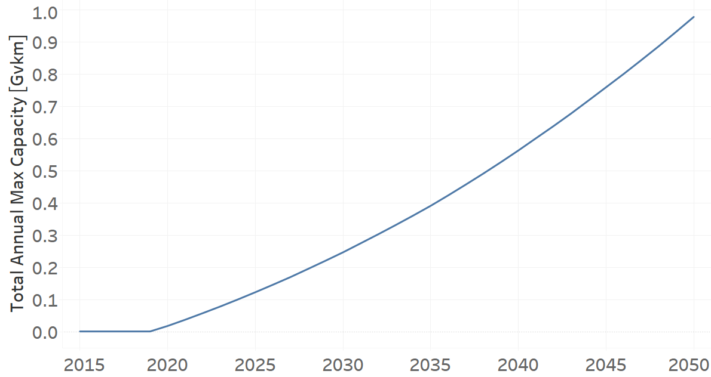
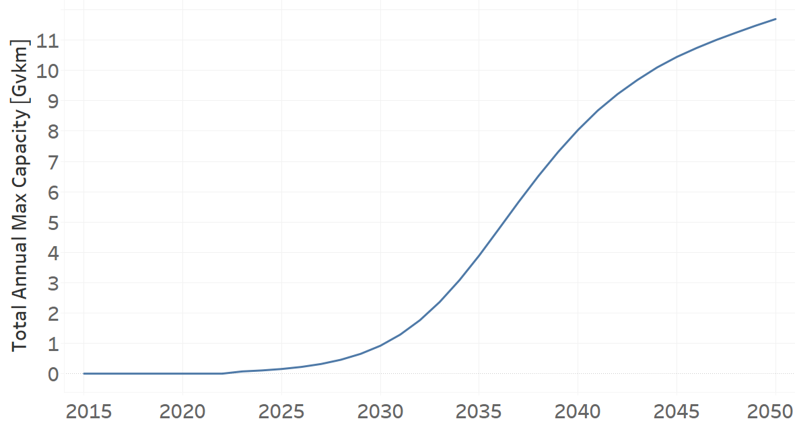
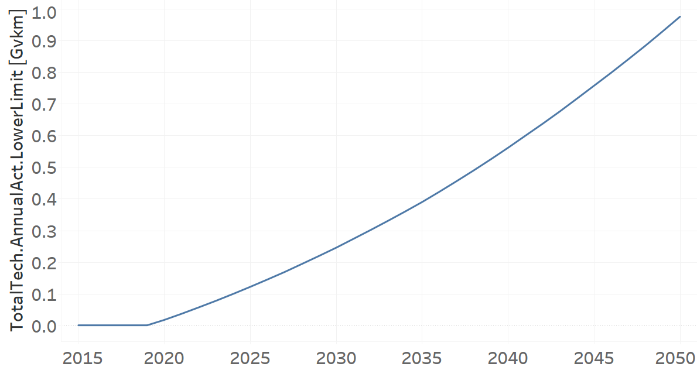
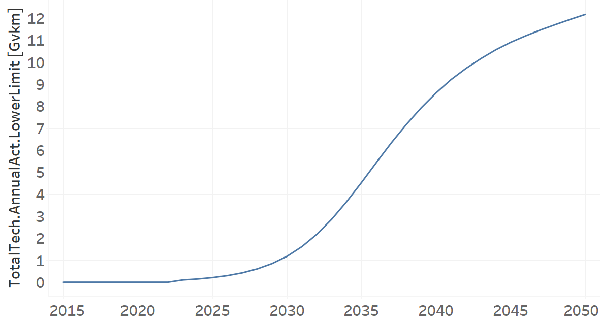
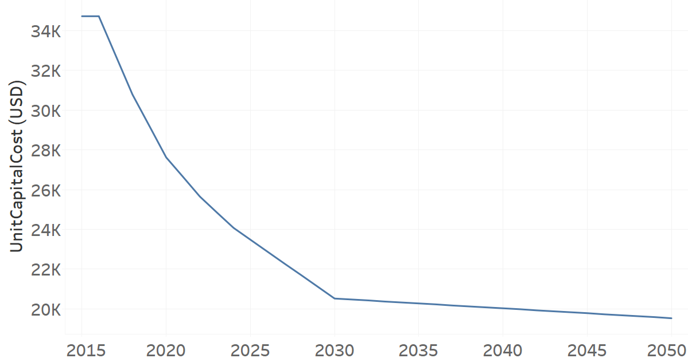

TRLDELE02: Light Duty Electric (new)
=====================================

+-------------------------------------------------+-------+--------------+--------------+--------------+--------------+
| .. figure:: img/TRLDELE.jpg                                                                                         |
|    :align:   center                                                                                                 |
|    :width:   500 px                                                                                                 |
+-------------------------------------------------+-------+--------------+--------------+--------------+--------------+
| Set codification:                                       |TRLDELE02                                                  |
+-------------------------------------------------+-------+--------------+--------------+--------------+--------------+
| Description:                                            |Light Duty Electric (new)                                  |
+-------------------------------------------------+-------+--------------+--------------+--------------+--------------+
| Set:                                                    |Technology                                                 |
+-------------------------------------------------+-------+--------------+--------------+--------------+--------------+
| Parameter                                       | Unit  | 2020         | 2030         | 2040         |  2050        |
+=================================================+=======+==============+==============+==============+==============+
| CapitalCost[r,t,y]                              |M$/Gvkm| 1869.69      | 1389.05      | 1355.9       | 1321.96      |
+-------------------------------------------------+-------+--------------+--------------+--------------+--------------+
| DistanceDriven[r,t,y]                           |km/year| 14773        | 14773        | 14773        | 14773        |
+-------------------------------------------------+-------+--------------+--------------+--------------+--------------+
| EmissionActivityRatio[r,t,e,m,y] (Accidents)    |  -    | 0.09         | 0.09         | 0.09         | 0.09         |
+-------------------------------------------------+-------+--------------+--------------+--------------+--------------+
| EmissionActivityRatio[r,t,e,m,y] (Congestion)   | -     | 0.081        | 0.081        | 0.081        | 0.081        |
+-------------------------------------------------+-------+--------------+--------------+--------------+--------------+
| FixedCost[r,t,y]                                |M$/Gvkm| 16.2756      | 16.2756      | 16.2756      | 16.2756      |
+-------------------------------------------------+-------+--------------+--------------+--------------+--------------+
| InputActivityRatio[r,t,f,m,y] (Electricity for  | PJ/   | 0.54         | 0.54         | 0.54         | 0.54         |
| private transport)                              | Gvkm  |              |              |              |              |
+-------------------------------------------------+-------+--------------+--------------+--------------+--------------+
| OperationalLife[r,t]                            | Years | 12           | 12           | 12           | 12           |
+-------------------------------------------------+-------+--------------+--------------+--------------+--------------+
| OutputActivityRatio[r,t,f,m,y] (Private         | PJ/   | 1            | 1            | 1            | 1            |
| Transport in Light Duty)                        | Gvkm  |              |              |              |              |
+-------------------------------------------------+-------+--------------+--------------+--------------+--------------+
| TotalAnnualMaxCapacity[r,t,y] (BAU)             |  Gvkm | 0.018537874  | 0.246969626  | 0.563077999  | 0.9774765    |
+-------------------------------------------------+-------+--------------+--------------+--------------+--------------+
| TotalAnnualMaxCapacity[r,t,y] (NDP)             |  Gvkm | 0            | 0.9205       | 8.0368       | 11.6944      |
+-------------------------------------------------+-------+--------------+--------------+--------------+--------------+
| TotalTechnologyAnnualActivityLowerLimit[r,t,y]  | Gvkm  | 0.018500835  | 0.24647618   | 0.561952968  | 0.9755235    |
| (BAU)                                           |       |              |              |              |              |
+-------------------------------------------------+-------+--------------+--------------+--------------+--------------+
| TotalTechnologyAnnualActivityLowerLimit[r,t,y]  | Gvkm  | 0            | 0.9185       | 8.0209       | 11.6713      |
| (NDP)                                           |       |              |              |              |              |
+-------------------------------------------------+-------+--------------+--------------+--------------+--------------+
| UnitCapitalCost[r,t,y]                          |   $   | 27620.9304   | 20520.4356   | 20030.7107   | 19529.3151   |
+-------------------------------------------------+-------+--------------+--------------+--------------+--------------+
| UnitFixedCost[r,t,y]                            |   $   | 240.4394     | 240.4394     | 240.4394     | 240.4394     |
+-------------------------------------------------+-------+--------------+--------------+--------------+--------------+

CapitalCost[r,t,y]
+++++++++

The figure 1 shows the Capital Cost for TRLDELE02, for every scenario.

   
   *Figure 1) Capital Cost for TRLDELE02 for every scenario.*
   
Source:
   This is the source. 
   
Description: 
   This is the description. 

DistanceDriven[r,t,y]
+++++++++
The equation (1) shows the Distance Driven for TRLDELE02, for every scenario.

DistanceDriven=14773 [km/year]   (1)

Source:
   This is the source. 
   
Description: 
   This is the description.

EmissionActivityRatio[r,t,e,m,y]
+++++++++
The equation (2) shows the Emission Activity Ratio for TRLDELE02, for every scenario and associated to the emission Accidents.

EmissionActivityRatio=0.09    (2)

The equation (3) shows the Emission Activity Ratio for TRLDELE02, for every scenario and associated to the emission Congestion.

EmissionActivityRatio=0.081    (3)

Source:
   This is the source. 
   
Description: 
   This is the description.

FixedCost[r,t,y]
+++++++++
The equation (4) shows the Fixed Cost for TRLDELE02, for every scenario.

FixedCost=16.2756 [M$/Gvkm]   (4)

Source:
   This is the source. 
   
Description: 
   This is the description.
   
InputActivityRatio[r,t,f,m,y]
+++++++++
The equation (5) shows the Input Activity Ratio for TRLDELE02, for every scenario and associated to the fuel Electricity for private transport. 

InputActivityRatio=0.54 [PJ/Gvkm]   (5)

Source:
   This is the source. 
   
Description: 
   This is the description.   
   
OperationalLife[r,t]
+++++++++
The equation (6) shows the Operational Life for TRLDELE02, for every scenario.

OperationalLife=12 Years   (6)

Source:
   This is the source. 
   
Description: 
   This is the description.   
   
OutputActivityRatio[r,t,f,m,y]
+++++++++
The equation (7) shows the Output Activity Ratio for TRLDELE02, for every scenario and associated to the fuel Private Transport in Light Duty.

OutputActivityRatio=1 [PJ/Gvkm]   (7)

Source:
   This is the source. 
   
Description: 
   This is the description.
   
TotalAnnualMaxCapacity[r,t,y]
+++++++++
The figure 2 shows the Total Annual Max Capacity for TRLDELE02, for the BAU scenario.

   
   *Figure 2) Total Annual Max Capacity for TRLDELE02 for the BAU scenario.*
   
The figure 3 shows the Total Annual Max Capacity for TRLDELE02, for the NDP scenario.

   
   *Figure 3) Total Annual Max Capacity for TRLDELE02 for the NDP scenario.*

Source:
   This is the source. 
   
Description: 
   This is the description.   
   
TotalTechnologyAnnualActivityLowerLimit[r,t,y]
+++++++++
The figure 4 shows the Total Technology Annual Activity Lower Limit for TRLDELE02, for the BAU scenario.

   
   *Figure 4) Total Technology Annual Activity Lower Limit for TRLDELE02 for the BAU scenario.*

The figure 5 shows the Total Technology Annual Activity Lower Limit for TRLDELE02, for the NDP scenario.

   
   *Figure 5) Total Technology Annual Activity Lower Limit for TRLDELE02 for the NDP scenario.*

Source:
   This is the source. 
   
Description: 
   This is the description.
   
UnitCapitalCost[r,t,y]
+++++++++
The figure 6 shows the Unit Capital Cost for TRLDELE02, for every scenario.

   
   *Figure 6) Unit Capital Cost for TRLDELE02 for every scenario.*
Source:
   This is the source. 
   
Description: 
   This is the description.
   
   
UnitFixedCost[r,t,y]
+++++++++
The equation (8) shows the Unit Fixed Cost for TRLDELE02, for every scenario.

UnitFixedCost=240.4394 [$]   (8)

Source:
   This is the source. 
   
Description: 
   This is the description.
