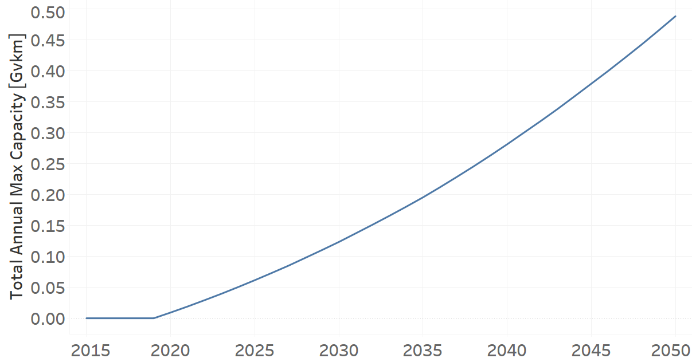

TRLDHYBG02: Light Hybrid Electric-Gasoline (new)
=====================================

+-------------------------------------------------+-------+--------------+--------------+--------------+--------------+
| .. figure:: img/TRLDHYBG.jpg                                                                                        |
|    :align:   center                                                                                                 |
|    :width:   500 px                                                                                                 |
+-------------------------------------------------+-------+--------------+--------------+--------------+--------------+
| Set codification:                                       |TRLDHYBG02                                                 |
+-------------------------------------------------+-------+--------------+--------------+--------------+--------------+
| Description:                                            |Light Hybrid Electric-Gasoline (new)                       |
+-------------------------------------------------+-------+--------------+--------------+--------------+--------------+
| Set:                                                    |Technology                                                 |
+-------------------------------------------------+-------+--------------+--------------+--------------+--------------+
| Parameter                                       | Unit  | 2020         | 2030         | 2040         |  2050        |
+=================================================+=======+==============+==============+==============+==============+
| CapitalCost[r,t,y]                              |M$/Gvkm| 2039.37      | 2039.37      | 2039.37      | 2039.37      |
+-------------------------------------------------+-------+--------------+--------------+--------------+--------------+
| DistanceDriven[r,t,y]                           |km/year| 14773        | 14773        | 14773        | 14773        |
+-------------------------------------------------+-------+--------------+--------------+--------------+--------------+
| EmissionActivityRatio[r,t,e,m,y] (Accidents)    |   -   | 0.09         | 0.09         | 0.09         | 0.09         |
+-------------------------------------------------+-------+--------------+--------------+--------------+--------------+
| EmissionActivityRatio[r,t,e,m,y] (Congestion)   |  -    | 0.081        | 0.081        | 0.081        | 0.081        |
+-------------------------------------------------+-------+--------------+--------------+--------------+--------------+
| FixedCost[r,t,y]                                |M$/Gvkm| 24.66        | 24.66        | 24.66        | 24.66        |
+-------------------------------------------------+-------+--------------+--------------+--------------+--------------+
| InputActivityRatio[r,t,f,m,y] (Electricity for  | PJ/   | 0.42         | 0.42         | 0.42         | 0.42         |
| private transport)                              | Gvkm  |              |              |              |              |
+-------------------------------------------------+-------+--------------+--------------+--------------+--------------+
| InputActivityRatio[r,t,f,m,y] (Gasoline for     | PJ/   | 0.42         | 0.42         | 0.42         | 0.42         | 
| private transport)                              | Gvkm  |              |              |              |              |
+-------------------------------------------------+-------+--------------+--------------+--------------+--------------+
| OperationalLife[r,t]                            | Years | 12           | 12           | 12           | 12           |
+-------------------------------------------------+-------+--------------+--------------+--------------+--------------+
| OutputActivityRatio[r,t,f,m,y] (Private         | PJ/   | 1            | 1            | 1            | 1            |
| Transport in Four Wheel Drive)                  | Gvkm  |              |              |              |              |
+-------------------------------------------------+-------+--------------+--------------+--------------+--------------+
| TotalAnnualMaxCapacity[r,t,y] (BAU)             | Gvkm  | 0.009259677  | 0.123361452  | 0.281257742  | 0.48825      |
+-------------------------------------------------+-------+--------------+--------------+--------------+--------------+
| UnitCapitalCost[r,t,y]                          |  $    | 30127.613    | 30127.613    | 30127.613    | 30127.613    |
+-------------------------------------------------+-------+--------------+--------------+--------------+--------------+
| UnitFixedCost[r,t,y]                            |  $    | 364.3022     | 364.3022     | 364.3022     | 364.3022     |
+-------------------------------------------------+-------+--------------+--------------+--------------+--------------+

CapitalCost[r,t,y]
+++++++++
The equation (1) shows the Capital Cost for TRLDHYBG02, for every scenario.

CapitalCost=2039.37 [M$/Gvkm]   (1)

DistanceDriven[r,t,y]
+++++++++
The equation (2) shows the Distance Driven for TRLDHYBG02, for every scenario.

DistanceDriven=14773 [km/year]   (2)

EmissionActivityRatio[r,t,e,m,y]
+++++++++
The equation (3) shows the Emission Activity Ratio for TRLDHYBG02, for every scenario and associated to the emission Accidents.

EmissionActivityRatio=0.09    (3)

The equation (4) shows the Emission Activity Ratio for TRLDHYBG02, for every scenario and associated to the emission Congestion.

EmissionActivityRatio=0.081    (4)

FixedCost[r,t,y]
+++++++++
The equation (5) shows the Fixed Cost for TRLDHYBG02, for every scenario.

FixedCost=24.66 [M$/Gvkm]   (5)

   
InputActivityRatio[r,t,f,m,y]
+++++++++
InputActivityRatio[r,t,f,m,y]
+++++++++
The equation (6) shows the Input Activity Ratio for TRLDHYBG02, for every scenario and associated to the fuel Electricity for public transport and Gasoline for public transport. 

InputActivityRatio=0.42 [PJ/Gvkm]   (6)

 
   
OperationalLife[r,t]
+++++++++
The equation (7) shows the Operational Life for TRLDHYBG02, for every scenario.

OperationalLife=12 Years   (7)

  
   
OutputActivityRatio[r,t,f,m,y]
+++++++++
The equation (8) shows the Output Activity Ratio for TRLDHYBG02, for every scenario and associated to the fuel Private Transport in Light Duty.

OutputActivityRatio=1 [PJ/Gvkm]   (8)

    
   
TotalAnnualMaxCapacity[r,t,y]
+++++++++
The figure 1 shows the Total Annual Max Capacity for TRLDHYBG02, for the BAU scenario.

   
   *Figure 1) Total Annual Max Capacity for TRLDHYBG02 for the BAU scenario.*

   
UnitCapitalCost[r,t,y]
+++++++++
The equation (9) shows the Unit Capital Cost for TRLDHYBG02, for every scenario.

UnitCapitalCost=30127.613 [$]   (9)

   
   
UnitFixedCost[r,t,y]
+++++++++
The equation (10) shows the Unit Fixed Cost for TRLDHYBG02, for every scenario.

UnitFixedCost=364.3022 [$]   (10)

