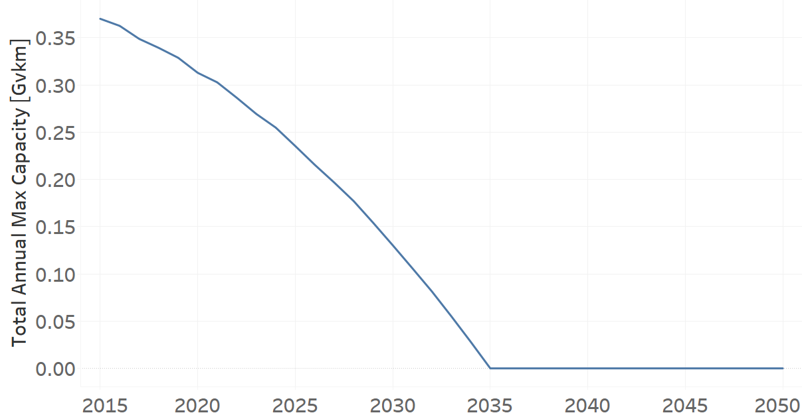
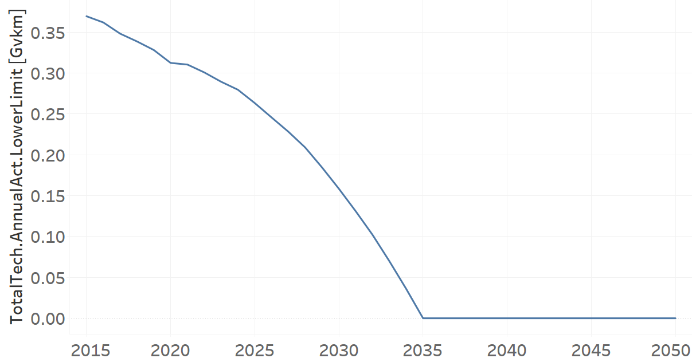

TRMBUSDSL01: Microbus Diesel (existing)
=====================================

+-------------------------------------------------+-------+--------------+--------------+--------------+--------------+
| .. figure:: img/TRMBUSDSL.png                                                                                       |
|    :align:   center                                                                                                 |
|    :width:   500 px                                                                                                 |
+-------------------------------------------------+-------+--------------+--------------+--------------+--------------+
| Set codification:                                       |TRMBUSDSL01                                                |
+-------------------------------------------------+-------+--------------+--------------+--------------+--------------+
| Description:                                            |Microbus Diesel (existing)                                 |
+-------------------------------------------------+-------+--------------+--------------+--------------+--------------+
| Set:                                                    |Technology                                                 |
+-------------------------------------------------+-------+--------------+--------------+--------------+--------------+
| Parameter                                       | Unit  | 2020         | 2030         | 2040         |  2050        |
+=================================================+=======+==============+==============+==============+==============+
| DistanceDriven[r,t,y]                           |km/year| 25847        | 25847        | 25847        | 25847        |
+-------------------------------------------------+-------+--------------+--------------+--------------+--------------+
| EmissionActivityRatio[r,t,e,m,y] (Accidents)    |   -   | 0.1          | 0.1          | 0.1          | 0.1          |
+-------------------------------------------------+-------+--------------+--------------+--------------+--------------+
| EmissionActivityRatio[r,t,e,m,y] (Congestion)   |   -   | 0.081        | 0.081        | 0.081        | 0.081        |
+-------------------------------------------------+-------+--------------+--------------+--------------+--------------+
| EmissionActivityRatio[r,t,e,m,y] (Health)       |   -   | 0.03         | 0.03         | 0.03         | 0.03         |
+-------------------------------------------------+-------+--------------+--------------+--------------+--------------+
| FixedCost[r,t,y]                                |M$/Gvkm| 179.16       | 179.16       | 179.16       | 179.16       |
+-------------------------------------------------+-------+--------------+--------------+--------------+--------------+
| InputActivityRatio[r,t,f,m,y] (Diesel for       | PJ/   | 6.37         | 6.37         | 6.37         | 6.37         |
| public transport)                               | Gvkm  |              |              |              |              |
+-------------------------------------------------+-------+--------------+--------------+--------------+--------------+
| OperationalLife[r,t]                            | Years | 15           | 15           | 15           | 15           |
+-------------------------------------------------+-------+--------------+--------------+--------------+--------------+
| OutputActivityRatio[r,t,f,m,y] (Public          | PJ/   | 1            | 1            | 1            | 1            |
| Transport in Minibus)                           | Gvkm  |              |              |              |              |
+-------------------------------------------------+-------+--------------+--------------+--------------+--------------+
| ResidualCapacity[r,t,y] (BAU)                   | Gvkm  | 0.3129       | 0.1303       | 0            | 0            |
+-------------------------------------------------+-------+--------------+--------------+--------------+--------------+
| ResidualCapacity[r,t,y] (NDP)                   | Gvkm  | 0.3129       | 0.1587       | 0            | 0            |
+-------------------------------------------------+-------+--------------+--------------+--------------+--------------+
| TotalAnnualMaxCapacity[r,t,y] (BAU)             | Gvkm  | 0.3129       | 0.1303       | 0            | 0            |
+-------------------------------------------------+-------+--------------+--------------+--------------+--------------+
| TotalAnnualMaxCapacity[r,t,y] (NDP)             | Gvkm  | 0.3129       | 0.1587       | 0            | 0            |
+-------------------------------------------------+-------+--------------+--------------+--------------+--------------+
| TotalTechnologyAnnualActivityLowerLimit[r,t,y]  | Gvkm  | 0.3123       | 0.13         | 0            | 0            |
| (BAU)                                           |       |              |              |              |              |
+-------------------------------------------------+-------+--------------+--------------+--------------+--------------+
| TotalTechnologyAnnualActivityLowerLimit[r,t,y]  | Gvkm  | 0.3123       | 0.1584       | 0            | 0            |
| (NDP)                                           |       |              |              |              |              |
+-------------------------------------------------+-------+--------------+--------------+--------------+--------------+
| UnitFixedCost[r,t,y]                            |   $   | 4630.7485    | 4630.7485    | 4630.7485    | 4630.7485    |
+-------------------------------------------------+-------+--------------+--------------+--------------+--------------+

DistanceDriven[r,t,y]
+++++++++
The equation (1) shows the Distance Driven for TRMBUSDSL01, for every scenario.

DistanceDriven=25847 [km/year]   (1)

EmissionActivityRatio[r,t,e,m,y]
+++++++++
The equation (2) shows the Emission Activity Ratio for TRMBUSDSL01, for every scenario and associated to the emission Accidents.

EmissionActivityRatio=0.1    (2)

The equation (3) shows the Emission Activity Ratio for TRMBUSDSL01, for every scenario and associated to the emission Congestion.

EmissionActivityRatio=0.081    (3)

The equation (4) shows the Emission Activity Ratio for TRMBUSDSL01, for every scenario and associated to the emission Health.

EmissionActivityRatio=0.03   (4)

FixedCost[r,t,y]
+++++++++
The equation (5) shows the Fixed Cost for TRMBUSDSL01, for every scenario.

FixedCost=179.16 [M$/Gvkm]   (5)

   
InputActivityRatio[r,t,f,m,y]
+++++++++
The equation (6) shows the Input Activity Ratio for TRMBUSDSL01, for every scenario and associated to the fuel Diesel for public transport. 

InputActivityRatio=6.37 [PJ/Gvkm]   (6)

 
   
OperationalLife[r,t]
+++++++++
The equation (6) shows the Operational Life for TRMBUSDSL01, for every scenario.

OperationalLife=15 Years   (6)

   
OutputActivityRatio[r,t,f,m,y]
+++++++++
The equation (7) shows the Output Activity Ratio for TRMBUSDSL01, for every scenario and associated to the fuel Public Transport in Minibus.

OutputActivityRatio=1 [PJ/Gvkm]   (7)

     
   
ResidualCapacity[r,t,y]
+++++++++
The figure 2 shows the Residual Capacity for TRMBUSDSL01, for the BAU scenario.

.. figure:: img/TRMBUSDSL01_ResidualCapacity_BAU.png
   :align:   center
   :width:   700 px
   
   *Figure 2) Residual Capacity for TRMBUSDSL01 for the BAU scenario.*
   
The figure 3 shows the Residual Capacity for TRMBUSDSL01, for the NDP scenario.

.. figure:: img/TRMBUSDSL01_ResidualCapacity_NDP_OP.png
   :align:   center
   :width:   700 px
   
   *Figure 3) Residual Capacity for TRMBUSDSL01 for the NDP and OP15C scenario.*   
   
         
   
TotalAnnualMaxCapacity[r,t,y]
+++++++++
The figure 4 shows the Total Annual Max Capacity for TRMBUSDSL01, for the BAU scenario.

   
   *Figure 4) Total Annual Max Capacity for TRMBUSDSL01 for the BAU scenario.*
   
The figure 5 shows the Total Annual Max Capacity for TRMBUSDSL01, for the NDP scenario.

.. figure:: img/TRMBUSDSL01_TotalAnnualMaxCapacity_NDP_OP.png
   :align:   center
   :width:   700 px
   
   *Figure 5) Total Annual Max Capacity for TRMBUSDSL01 for the NDP scenario.*   
   

   
TotalTechnologyAnnualActivityLowerLimit[r,t,y]
+++++++++
The figure 6 shows the Total Technology Annual Activity Lower Limit for TRMBUSDSL01, for the BAU scenario.

.. figure:: img/TRMBUSDSL01_TotalTechnologyAnnualActivityLowerLimit_BAU.png
   :align:   center
   :width:   700 px
   
   *Figure 6) Total Technology Annual Activity Lower Limit for TRMBUSDSL01 for the BAU scenario.*
   
The figure 7 shows the Total Technology Annual Activity Lower Limit for TRMBUSDSL01, for the NDP scenario.

   
   *Figure 7) Total Technology Annual Activity Lower Limit for TRMBUSDSL01 for the NDP scenario.*

   
UnitFixedCost[r,t,y]
+++++++++
The equation (8) shows the Unit Fixed Cost for TRMBUSDSL01, for every scenario.

UnitFixedCost=4630.7485 [$]   (8)

