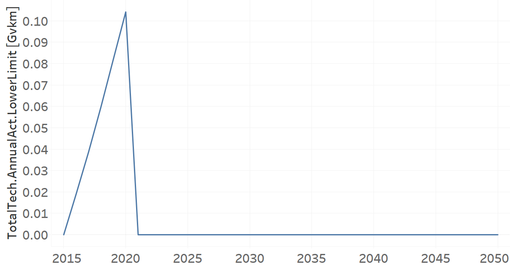

TRMBUSDSL02: Microbus Diesel (new)
=====================================

+-------------------------------------------------+-------+--------------+--------------+--------------+--------------+
| .. figure:: img/TRMBUSDSL.png                                                                                       |
|    :align:   center                                                                                                 |
|    :width:   500 px                                                                                                 |
+-------------------------------------------------+-------+--------------+--------------+--------------+--------------+
| Set codification:                                       |TRMBUSDSL02                                                |
+-------------------------------------------------+-------+--------------+--------------+--------------+--------------+
| Description:                                            |Microbus Diesel (new)                                      |
+-------------------------------------------------+-------+--------------+--------------+--------------+--------------+
| Set:                                                    |Technology                                                 |
+-------------------------------------------------+-------+--------------+--------------+--------------+--------------+
| Parameter                                       | Unit  | 2020         | 2030         | 2040         |  2050        |
+=================================================+=======+==============+==============+==============+==============+
| CapitalCost[r,t,y]                              |M$/Gvkm| 2797.83      | 2797.83      | 2797.83      | 2797.83      |
+-------------------------------------------------+-------+--------------+--------------+--------------+--------------+
| DistanceDriven[r,t,y]                           |km/year| 25847        | 25847        | 25847        | 25847        |
+-------------------------------------------------+-------+--------------+--------------+--------------+--------------+
| EmissionActivityRatio[r,t,e,m,y] (Accidents)    |   -   | 0.1          | 0.1          | 0.1          | 0.1          |
+-------------------------------------------------+-------+--------------+--------------+--------------+--------------+
| EmissionActivityRatio[r,t,e,m,y] (Congestion)   |  -    | 0.081        | 0.081        | 0.081        | 0.081        |
+-------------------------------------------------+-------+--------------+--------------+--------------+--------------+
| EmissionActivityRatio[r,t,e,m,y] (Health)       |   -   | 0.03         | 0.03         | 0.03         | 0.03         |
+-------------------------------------------------+-------+--------------+--------------+--------------+--------------+
| FixedCost[r,t,y]                                |M$/Gvkm| 179.16       | 179.16       | 179.16       | 179.16       |
+-------------------------------------------------+-------+--------------+--------------+--------------+--------------+
| InputActivityRatio[r,t,f,m,y] (Diesel for       | PJ/   | 5.62         | 5.62         | 5.62         | 5.62         |
| public transport)                               | Gvkm  |              |              |              |              |
+-------------------------------------------------+-------+--------------+--------------+--------------+--------------+
| OperationalLife[r,t]                            | Years | 15           | 15           | 15           | 15           |
+-------------------------------------------------+-------+--------------+--------------+--------------+--------------+
| OutputActivityRatio[r,t,f,m,y] (Public Transport| PJ/   | 1            | 1            | 1            | 1            |
| in Minibus)                                     | Gvkm  |              |              |              |              |
+-------------------------------------------------+-------+--------------+--------------+--------------+--------------+
| TotalTechnologyAnnualActivityLowerLimit[r,t,y]  | Gvkm  | 0.1041       | 0.3901       | 0.6231       | 0.7216       |
| (BAU)                                           |       |              |              |              |              |
+-------------------------------------------------+-------+--------------+--------------+--------------+--------------+
| TotalTechnologyAnnualActivityLowerLimit[r,t,y]  | Gvkm  | 0.1041       | 0            | 0            | 0            |
| (NDP and OP15C)                                 |       |              |              |              |              |
+-------------------------------------------------+-------+--------------+--------------+--------------+--------------+
| UnitCapitalCost[r,t,y]                          |   $   | 72315.512    | 72315.512    | 72315.512    | 72315.512    |
+-------------------------------------------------+-------+--------------+--------------+--------------+--------------+
| UnitFixedCost[r,t,y]                            |   $   | 4630.7485    | 4630.7485    | 4630.7485    | 4630.7485    |
+-------------------------------------------------+-------+--------------+--------------+--------------+--------------+

CapitalCost[r,t,y]
+++++++++
The equation (1) shows the Capital Cost for TRMBUSDSL02, for every scenario.

CapitalCost=2797.83 [M$/Gvkm]   (1)

Source:
   This is the source. 
   
Description: 
   This is the description. 

DistanceDriven[r,t,y]
+++++++++
The equation (2) shows the Distance Driven for TRMBUSDSL02, for every scenario.

DistanceDriven=25847 [km/year]   (2)

Source:
   This is the source. 
   
Description: 
   This is the description.

EmissionActivityRatio[r,t,e,m,y]
+++++++++
The equation (3) shows the Emission Activity Ratio for TRMBUSDSL02, for every scenario and associated to the emission Accidents.

EmissionActivityRatio=0.1    (3)

The equation (4) shows the Emission Activity Ratio for TRMBUSDSL02, for every scenario and associated to the emission Congestion.

EmissionActivityRatio=0.081    (4)

The equation (5) shows the Emission Activity Ratio for TRMBUSDSL02, for every scenario and associated to the emission Health.

EmissionActivityRatio=0.03    (5)

Source:
   This is the source. 
   
Description: 
   This is the description.

FixedCost[r,t,y]
+++++++++
The equation (6) shows the Fixed Cost for TRMBUSDSL02, for every scenario.

FixedCost=179.16 [M$/Gvkm]   (6)

Source:
   This is the source. 
   
Description: 
   This is the description.
   
InputActivityRatio[r,t,f,m,y]
+++++++++
The equation (7) shows the Input Activity Ratio for TRMBUSDSL02, for every scenario and associated to the fuel Diesel for public transport. 

InputActivityRatio=5.62 [PJ/Gvkm]   (7)

Source:
   This is the source. 
   
Description: 
   This is the description.   
   
OperationalLife[r,t]
+++++++++
The equation (8) shows the Operational Life for TRMBUSDSL02, for every scenario.

OperationalLife=15 Years   (8)

Source:
   This is the source. 
   
Description: 
   This is the description.   
   
OutputActivityRatio[r,t,f,m,y]
+++++++++
The equation (9) shows the Output Activity Ratio for TRMBUSDSL02, for every scenario and associated to the fuel Public Transport in Minibus.

OutputActivityRatio=1 [PJ/Gvkm]   (9)

Source:
   This is the source. 
   
Description: 
   This is the description.      
   
TotalTechnologyAnnualActivityLowerLimit[r,t,y]
+++++++++
The figure 1 shows the Total Technology Annual Activity Lower Limit for TRMBUSDSL02, for the BAU scenario.

.. figure:: img/TRMBUSDSL02_TotalTechnologyAnnualActivityLowerLimit_BAU.png
   :align:   center
   :width:   700 px
   
   *Figure 1) Total Technology Annual Activity Lower Limit for TRMBUSDSL02 for BAU scenario.*
   
The figure 2 shows the Total Technology Annual Activity Lower Limit for TRMBUSDSL02, for the NDP and OP15C scenarios.

   
   *Figure 2) Total Technology Annual Activity Lower Limit for TRMBUSDSL02 for NDP and OP15C scenarios.*

Source:
   This is the source. 
   
Description: 
   This is the description.
   
UnitCapitalCost[r,t,y]
+++++++++
The equation (10) shows the Unit Capital Cost for TRMBUSDSL02, for every scenario.

UnitCapitalCost=72315.512 [$]   (10)

Source:
   This is the source. 
   
Description: 
   This is the description.
   
   
UnitFixedCost[r,t,y]
+++++++++
The equation (11) shows the Unit Fixed Cost for TRMBUSDSL02, for every scenario.

UnitFixedCost=4630.7485 [$]   (11)

Source:
   This is the source. 
   
Description: 
   This is the description.
