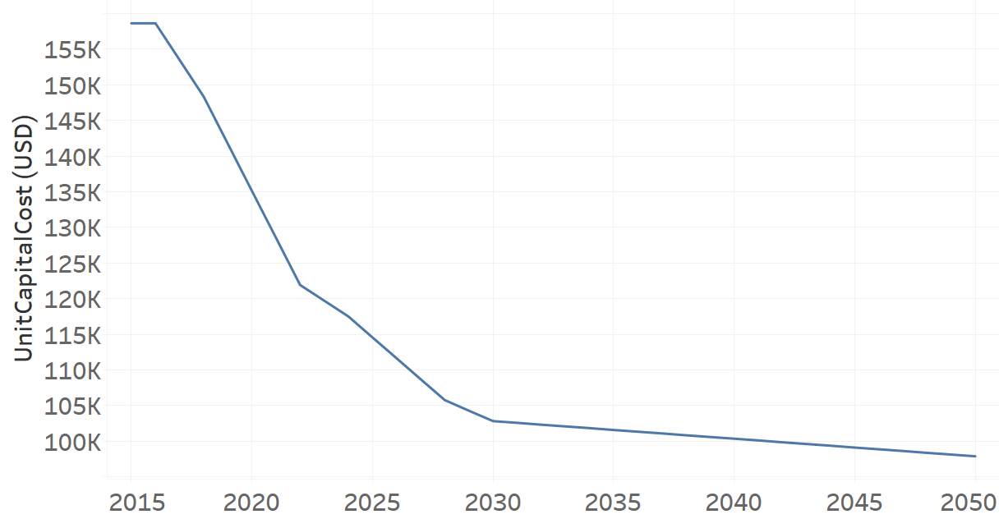

TRMBUSHYBD02: Microbus Hybrid Electric-Diesel (new)
=====================================

+-------------------------------------------------+-------+--------------+--------------+--------------+--------------+
| .. figure:: img/TRMBUSHYBD.jpg                                                                                      |
|    :align:   center                                                                                                 |
|    :width:   500 px                                                                                                 |
+-------------------------------------------------+-------+--------------+--------------+--------------+--------------+
| Set codification:                                       |TRMBUSHYBD02                                               |
+-------------------------------------------------+-------+--------------+--------------+--------------+--------------+
| Description:                                            |Microbus Hybrid Electric-Diesel (new)                      |
+-------------------------------------------------+-------+--------------+--------------+--------------+--------------+
| Set:                                                    |Technology                                                 |
+-------------------------------------------------+-------+--------------+--------------+--------------+--------------+
| Parameter                                       | Unit  | 2020         | 2030         | 2040         |  2050        |
+=================================================+=======+==============+==============+==============+==============+
| CapitalCost[r,t,y]                              |M$/Gvkm| 5228.01      | 3978.22      | 3882.79      | 3787.37      |
+-------------------------------------------------+-------+--------------+--------------+--------------+--------------+
| DistanceDriven[r,t,y]                           |km/year| 25847        | 25847        | 25847        | 25847        |
+-------------------------------------------------+-------+--------------+--------------+--------------+--------------+
| EmissionActivityRatio[r,t,e,m,y] (Accidents)    |  -    | 0.1          | 0.1          | 0.1          | 0.1          |
+-------------------------------------------------+-------+--------------+--------------+--------------+--------------+
| EmissionActivityRatio[r,t,e,m,y] (Congestion)   |  -    | 0.081        | 0.081        | 0.081        | 0.081        |
+-------------------------------------------------+-------+--------------+--------------+--------------+--------------+
| EmissionActivityRatio[r,t,e,m,y] (Health)       |  -    | 0.01         | 0.01         | 0.01         | 0.01         |
+-------------------------------------------------+-------+--------------+--------------+--------------+--------------+
| FixedCost[r,t,y]                                |M$/Gvkm| 89.58        | 89.58        | 89.58        | 89.58        |
+-------------------------------------------------+-------+--------------+--------------+--------------+--------------+
| InputActivityRatio[r,t,f,m,y] (Diesel for       | PJ/   | 2.15         | 2.15         | 2.15         | 2.15         |
| public transport)                               | Gvkm  |              |              |              |              |
+-------------------------------------------------+-------+--------------+--------------+--------------+--------------+
| InputActivityRatio[r,t,f,m,y] (Electricity for  | PJ/   | 2.15         | 2.15         | 2.15         | 2.15         |
| public transport)                               | Gvkm  |              |              |              |              |
+-------------------------------------------------+-------+--------------+--------------+--------------+--------------+
| OperationalLife[r,t]                            | Years | 12           | 12           | 12           | 12           |
+-------------------------------------------------+-------+--------------+--------------+--------------+--------------+
| OutputActivityRatio[r,t,f,m,y] (Public Transport| PJ/   | 1            | 1            | 1            | 1            |
| in Minibus)                                     | Gvkm  |              |              |              |              |
+-------------------------------------------------+-------+--------------+--------------+--------------+--------------+
| TotalAnnualMaxCapacity[r,t,y]                   | Gvkm  | 0            | 99999        | 99999        | 99999        |
+-------------------------------------------------+-------+--------------+--------------+--------------+--------------+
| UnitCapitalCost[r,t,y]                          |   $   | 135128.3745  | 102825.0523  | 100358.4731  | 237695.079   |
+-------------------------------------------------+-------+--------------+--------------+--------------+--------------+
| UnitFixedCost[r,t,y]                            |   $   | 2315.3743    | 2315.3743    | 2315.3743    | 97892.1524   |
+-------------------------------------------------+-------+--------------+--------------+--------------+--------------+

CapitalCost[r,t,y]
+++++++++

The figure 1 shows the Capital Cost for TRMBUSHYBD02, for every scenario.

.. figure:: img/TRMBUSHYBD02_CapitalCost.png
   :align:   center
   :width:   700 px
   
   *Figure 1) Capital Cost for TRMBUSHYBD02 for every scenario.*
   

DistanceDriven[r,t,y]
+++++++++
The equation (1) shows the Distance Driven for TRMBUSHYBD02, for every scenario.

DistanceDriven=25847 [km/year]   (1)

EmissionActivityRatio[r,t,e,m,y]
+++++++++
The equation (2) shows the Emission Activity Ratio for TRMBUSHYBD02, for every scenario and associated to the emission Accidents.

EmissionActivityRatio=0.1    (2)

The equation (3) shows the Emission Activity Ratio for TRMBUSHYBD02, for every scenario and associated to the emission Congestion.

EmissionActivityRatio=0.081    (3)

The equation (4) shows the Emission Activity Ratio for TRMBUSHYBD02, for every scenario and associated to the emission Health.

EmissionActivityRatio=0.01    (4)

FixedCost[r,t,y]
+++++++++
The equation (5) shows the Fixed Cost for TRMBUSHYBD02, for every scenario.

FixedCost=89.58 [M$/Gvkm]   (5)

   
InputActivityRatio[r,t,f,m,y]
+++++++++
The equation (6) shows the Input Activity Ratio for TRMBUSHYBD02, for every scenario and associated to the fuel Electricity for public transport and Diesel for public transport. 

InputActivityRatio=2.15 [PJ/Gvkm]   (6)

   
   
OperationalLife[r,t]
+++++++++
The equation (7) shows the Operational Life for TRMBUSHYBD02, for every scenario.

OperationalLife=12 Years   (7)

 
   
OutputActivityRatio[r,t,f,m,y]
+++++++++
The equation (8) shows the Output Activity Ratio for TRMBUSHYBD02, for every scenario and associated to the fuel Public Transport in Minibus.

OutputActivityRatio=1 [PJ/Gvkm]   (8)

   
TotalAnnualMaxCapacity[r,t,y]
+++++++++
The figure 2 shows the Total Annual Max Capacity for TRMBUSHYBD02, for every scenario.

.. figure:: img/TRMBUSHYBD02_TotalAnnualMaxCapacity.png
   :align:   center
   :width:   700 px
   
   *Figure 2) Total Annual Max Capacity for TRMBUSHYBD02 for every scenario.*

 
   
UnitCapitalCost[r,t,y]
+++++++++
The figure 3 shows the Unit Capital Cost for TRMBUSHYBD02, for every scenario.

   
   *Figure 3) Unit Capital Cost for TRMBUSHYBD02 for every scenario.*

UnitFixedCost[r,t,y]
+++++++++
The equation (9) shows the Unit Fixed Cost for TRMBUSHYBD02, for every scenario.

UnitFixedCost=2315.3743 [$]   (9)

