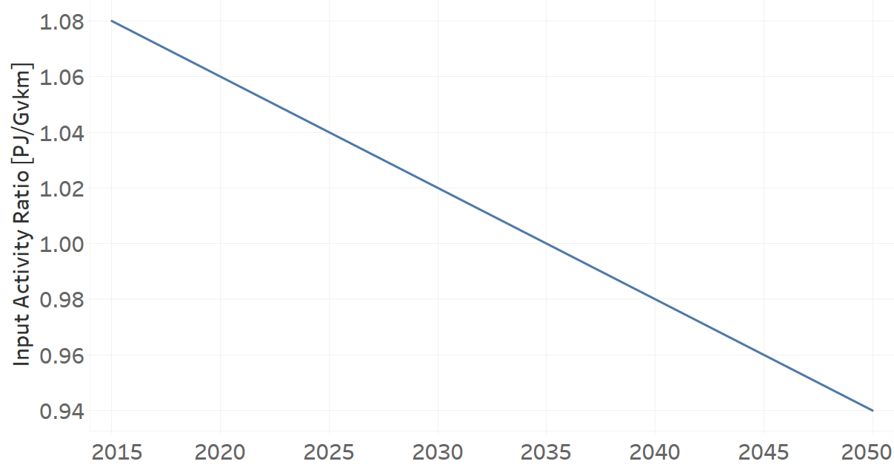
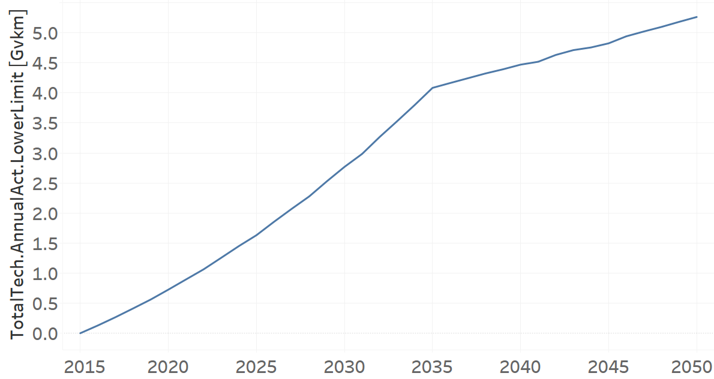
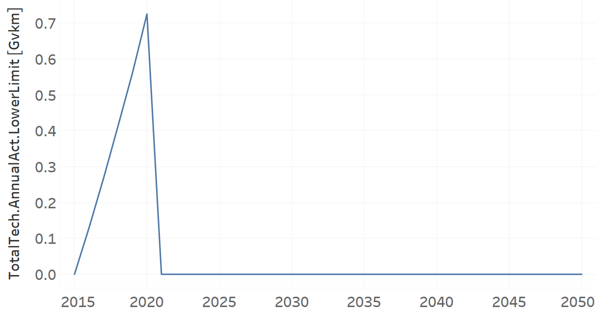

TRMOTGAS02: Motorcycle Gasoline (new)
=====================================

+-------------------------------------------------+-------+--------------+--------------+--------------+--------------+
| .. figure:: img/TRMOTGAS.jpg                                                                                        |
|    :align:   center                                                                                                 |
|    :width:   500 px                                                                                                 |
+-------------------------------------------------+-------+--------------+--------------+--------------+--------------+
| Set codification:                                       |TRMOTGAS02                                                 |
+-------------------------------------------------+-------+--------------+--------------+--------------+--------------+
| Description:                                            |Motorcycle Gasoline (new)                                  |
+-------------------------------------------------+-------+--------------+--------------+--------------+--------------+
| Set:                                                    |Technology                                                 |
+-------------------------------------------------+-------+--------------+--------------+--------------+--------------+
| Parameter                                       | Unit  | 2020         | 2030         | 2040         |  2050        |
+=================================================+=======+==============+==============+==============+==============+
| CapitalCost[r,t,y]                              |M$/Gvkm| 122.33       | 122.33       | 122.33       | 122.33       |
+-------------------------------------------------+-------+--------------+--------------+--------------+--------------+
| DistanceDriven[r,t,y]                           |km/year| 7327         | 7327         | 7327         | 7327         |
+-------------------------------------------------+-------+--------------+--------------+--------------+--------------+
| EmissionActivityRatio[r,t,e,m,y] (Accidents)    |   -   | 0.64         | 0.64         | 0.64         | 0.64         |
+-------------------------------------------------+-------+--------------+--------------+--------------+--------------+
| EmissionActivityRatio[r,t,e,m,y] (Congestion)   |  -    | 0.081        | 0.081        | 0.081        | 0.081        |
+-------------------------------------------------+-------+--------------+--------------+--------------+--------------+
| EmissionActivityRatio[r,t,e,m,y] (Health)       |   -   | 0.01         | 0.01         | 0.01         | 0.01         |
+-------------------------------------------------+-------+--------------+--------------+--------------+--------------+
| FixedCost[r,t,y]                                |M$/Gvkm| 5.41         | 5.41         | 5.41         | 5.41         |
+-------------------------------------------------+-------+--------------+--------------+--------------+--------------+
| InputActivityRatio[r,t,f,m,y] (Gasoline for     | PJ/   | 1.06         | 1.02         | 0.98         | 0.94         |
| private transport)                              | Gvkm  |              |              |              |              |
+-------------------------------------------------+-------+--------------+--------------+--------------+--------------+
| OperationalLife[r,t]                            | Years | 15           | 15           | 15           | 15           |
+-------------------------------------------------+-------+--------------+--------------+--------------+--------------+
| OutputActivityRatio[r,t,f,m,y] (Private         | PJ/   | 1            | 1            | 1            | 1            |
| Transport in Motorcycle)                        | Gvkm  |              |              |              |              |
+-------------------------------------------------+-------+--------------+--------------+--------------+--------------+
| TotalTechnologyAnnualActivityLowerLimit[r,t,y]  | Gvkm  | 0.7252       | 2.7676       | 4.4692       | 5.262        |
| (BAU)                                           |       |              |              |              |              |
+-------------------------------------------------+-------+--------------+--------------+--------------+--------------+
| TotalTechnologyAnnualActivityLowerLimit[r,t,y]  | Gvkm  | 0.7252       | 0            | 0            | 0            |
| (NDP)                                           |       |              |              |              |              |
+-------------------------------------------------+-------+--------------+--------------+--------------+--------------+
| UnitCapitalCost[r,t,y]                          |   $   | 894.3119     | 894.3119     | 894.3119     | 894.3119     |
+-------------------------------------------------+-------+--------------+--------------+--------------+--------------+
| UnitFixedCost[r,t,y]                            |   $   | 39.6391      | 39.6391      | 39.6391      | 39.6391      |
+-------------------------------------------------+-------+--------------+--------------+--------------+--------------+

CapitalCost[r,t,y]
+++++++++
The equation (1) shows the Capital Cost for TRMOTGAS02, for every scenario.

CapitalCost=122.33 [M$/Gvkm]   (1)

Source:
   This is the source. 
   
Description: 
   This is the description. 

DistanceDriven[r,t,y]
+++++++++
The equation (2) shows the Distance Driven for TRMOTGAS02, for every scenario.

DistanceDriven=7327 [km/year]   (2)

Source:
   This is the source. 
   
Description: 
   This is the description.

EmissionActivityRatio[r,t,e,m,y]
+++++++++
The equation (3) shows the Emission Activity Ratio for TRMOTGAS02, for every scenario and associated to the emission Accidents.

EmissionActivityRatio=0.64    (3)

The equation (4) shows the Emission Activity Ratio for TRMOTGAS02, for every scenario and associated to the emission Congestion.

EmissionActivityRatio=0.081    (4)

The equation (5) shows the Emission Activity Ratio for TRMOTGAS02, for every scenario and associated to the emission Health.

EmissionActivityRatio=0.01   (5)

Source:
   This is the source. 
   
Description: 
   This is the description.

FixedCost[r,t,y]
+++++++++
The equation (6) shows the Fixed Cost for TRMOTGAS02, for every scenario.

FixedCost=5.41 [M$/Gvkm]   (6)

Source:
   This is the source. 
   
Description: 
   This is the description.
   
InputActivityRatio[r,t,f,m,y]
+++++++++
The figure 1 shows the Input Activity Ratio for TRMOTGAS02, for every scenario and associated to the fuel Gasoline for private transport.

   
   *Figure 1) Input Activity Ratio for TRMOTGAS02 for every scenario.*

Source:
   This is the source. 
   
Description: 
   This is the description.   
   
OperationalLife[r,t]
+++++++++
The equation (7) shows the Operational Life for TRMOTGAS02, for every scenario.

OperationalLife=15 Years   (7)

Source:
   This is the source. 
   
Description: 
   This is the description.   
   
OutputActivityRatio[r,t,f,m,y]
+++++++++
The equation (8) shows the Output Activity Ratio for TRMOTGAS02, for every scenario and associated to the fuel Private Transport in Motorcycle.

OutputActivityRatio=1 [PJ/Gvkm]   (8)

Source:
   This is the source. 
   
Description: 
   This is the description.      
   
TotalTechnologyAnnualActivityLowerLimit[r,t,y]
+++++++++
The figure 2 shows the Total Technology Annual Activity Lower Limit for TRMOTGAS02, for the BAU scenario.

   
   *Figure 2) Total Technology Annual Activity Lower Limit for TRMOTGAS02 for the BAU scenario.*
   
The figure 3 shows the Total Technology Annual Activity Lower Limit for TRMOTGAS02, for the NDP scenario.

   
   *Figure 3) Total Technology Annual Activity Lower Limit for TRMOTGAS02 for the NDP scenario.*

Source:
   This is the source. 
   
Description: 
   This is the description.
   
UnitCapitalCost[r,t,y]
+++++++++
The equation (9) shows the Unit Capital Cost for TRMOTGAS02, for every scenario.

UnitCapitalCost=894.3119 [$]   (9)

Source:
   This is the source. 
   
Description: 
   This is the description.
   
   
UnitFixedCost[r,t,y]
+++++++++
The equation (10) shows the Unit Fixed Cost for TRMOTGAS02, for every scenario.

UnitFixedCost=39.6391 [$]   (10)

Source:
   This is the source. 
   
Description: 
   This is the description.
