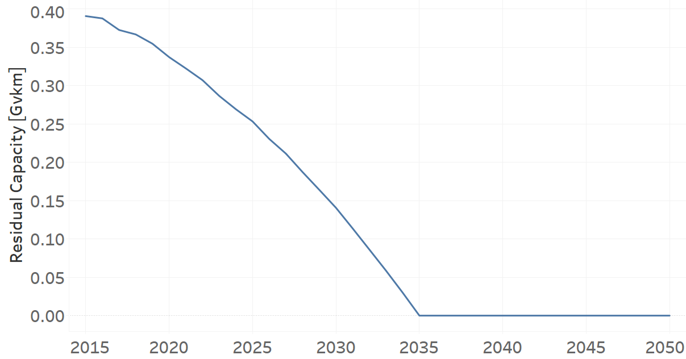
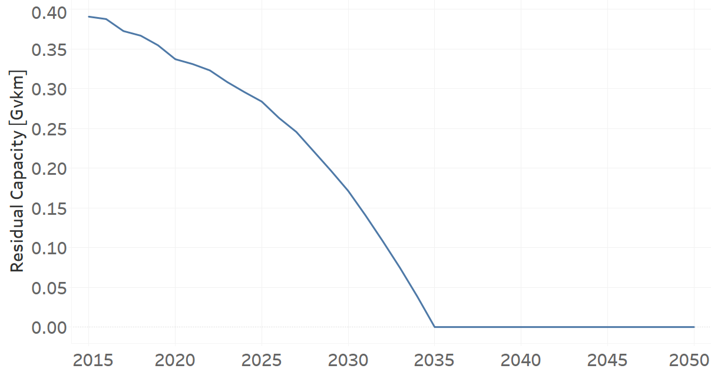
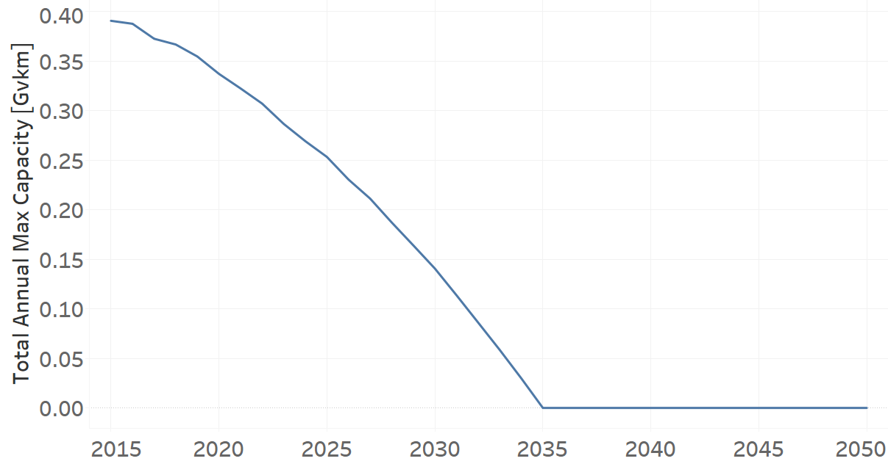
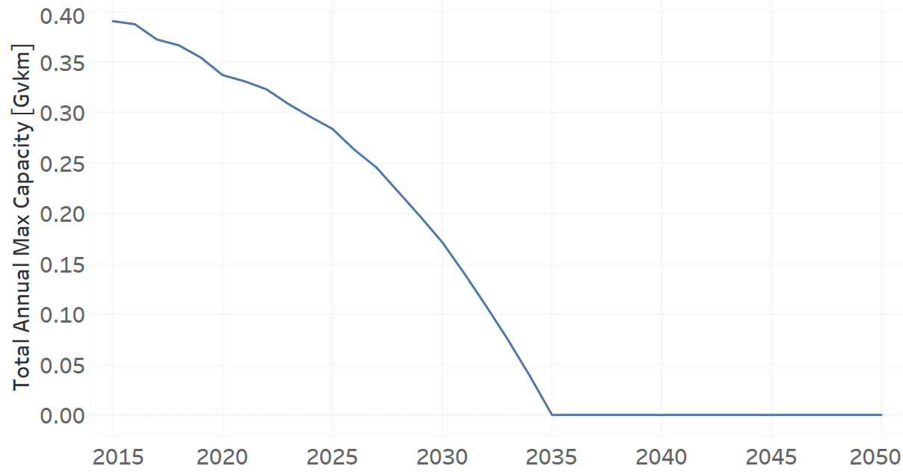
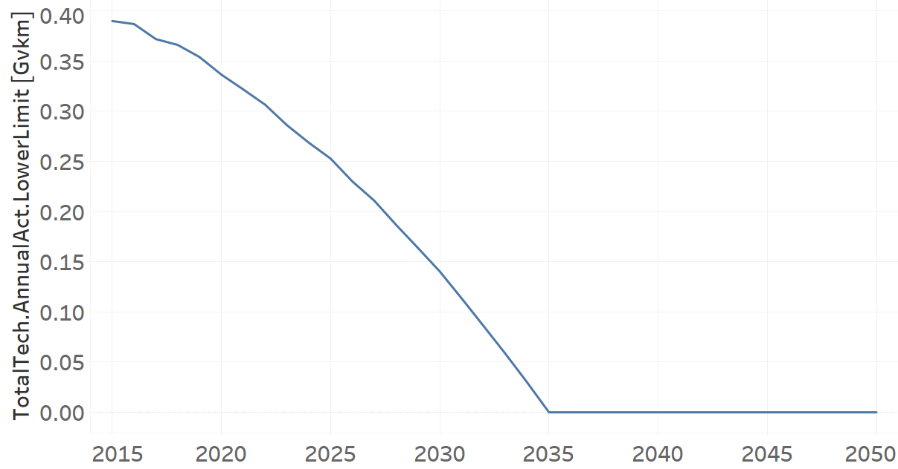

TRTAXGAS01: Taxi Gasoline (existing)
=====================================

+-------------------------------------------------+-------+--------------+--------------+--------------+--------------+
| .. figure:: img/TRTAXGAS.png                                                                                        |
|    :align:   center                                                                                                 |
|    :width:   500 px                                                                                                 |
+-------------------------------------------------+-------+--------------+--------------+--------------+--------------+
| Set codification:                                       |TRTAXGAS01                                                 |
+-------------------------------------------------+-------+--------------+--------------+--------------+--------------+
| Description:                                            |Taxi Gasoline (existing)                                   |
+-------------------------------------------------+-------+--------------+--------------+--------------+--------------+
| Set:                                                    |Technology                                                 |
+-------------------------------------------------+-------+--------------+--------------+--------------+--------------+
| Parameter                                       | Unit  | 2020         | 2030         | 2040         |  2050        |
+=================================================+=======+==============+==============+==============+==============+
| DistanceDriven[r,t,y]                           |km/year| 48704        | 48704        | 48704        | 48704        |
+-------------------------------------------------+-------+--------------+--------------+--------------+--------------+
| EmissionActivityRatio[r,t,e,m,y] (Accidents)    |   -   | 0.09         | 0.09         | 0.09         | 0.09         |
+-------------------------------------------------+-------+--------------+--------------+--------------+--------------+
| EmissionActivityRatio[r,t,e,m,y] (Congestion)   |   -   | 0.081        | 0.081        | 0.081        | 0.081        |
+-------------------------------------------------+-------+--------------+--------------+--------------+--------------+
| FixedCost[r,t,y]                                |M$/Gvkm| 49.32        | 49.32        | 49.32        | 49.32        |
+-------------------------------------------------+-------+--------------+--------------+--------------+--------------+
| InputActivityRatio[r,t,f,m,y] (Gasoline for     | PJ/   | 2.81         | 2.81         | 2.81         | 2.81         |
| public transport)                               | Gvkm  |              |              |              |              |
+-------------------------------------------------+-------+--------------+--------------+--------------+--------------+
| OperationalLife[r,t]                            | Years | 10           | 10           | 10           | 10           |
+-------------------------------------------------+-------+--------------+--------------+--------------+--------------+
| OutputActivityRatio[r,t,f,m,y] (Public          | PJ/   | 1            | 1            | 1            | 1            |
| Transport in Taxi)                              | Gvkm  |              |              |              |              |
+-------------------------------------------------+-------+--------------+--------------+--------------+--------------+
| ResidualCapacity[r,t,y] (BAU)                   | Gvkm  | 0.337        | 0.1406       | 0            | 0            |
+-------------------------------------------------+-------+--------------+--------------+--------------+--------------+
| ResidualCapacity[r,t,y] (NDP)                   | Gvkm  | 0.337        | 0.1713       | 0            | 0            |
+-------------------------------------------------+-------+--------------+--------------+--------------+--------------+
| TotalAnnualMaxCapacity[r,t,y] (BAU)             | Gvkm  | 0.337        | 0.1406       | 0            | 0            |
+-------------------------------------------------+-------+--------------+--------------+--------------+--------------+
| TotalAnnualMaxCapacity[r,t,y] (NDP)             | Gvkm  | 0.337        | 0.1713       | 0            | 0            |
+-------------------------------------------------+-------+--------------+--------------+--------------+--------------+
| TotalTechnologyAnnualActivityLowerLimit[r,t,y]  | Gvkm  | 0.3363       | 0.1403       | 0            | 0            |
| (BAU)                                           |       |              |              |              |              |
+-------------------------------------------------+-------+--------------+--------------+--------------+--------------+
| TotalTechnologyAnnualActivityLowerLimit[r,t,y]  | Gvkm  | 0.3363       | 0.1709       | 0            | 0            |
| (NDP)                                           |       |              |              |              |              |
+-------------------------------------------------+-------+--------------+--------------+--------------+--------------+
| UnitFixedCost[r,t,y]                            |   $   | 2402.0813    | 2402.0813    | 2402.0813    | 2402.0813    |
+-------------------------------------------------+-------+--------------+--------------+--------------+--------------+

DistanceDriven[r,t,y]
+++++++++
The equation (1) shows the Distance Driven for TRTAXGAS01, for every scenario.

DistanceDriven=48704 [km/year]   (1)

Source:
   This is the source. 
   
Description: 
   This is the description.

EmissionActivityRatio[r,t,e,m,y]
+++++++++
The equation (2) shows the Emission Activity Ratio for TRTAXGAS01, for every scenario and associated to the emission Accidents.

EmissionActivityRatio=0.09    (2)

The equation (3) shows the Emission Activity Ratio for TRTAXGAS01, for every scenario and associated to the emission Congestion.

EmissionActivityRatio=0.081    (3)

Source:
   This is the source. 
   
Description: 
   This is the description.

FixedCost[r,t,y]
+++++++++
The equation (4) shows the Fixed Cost for TRTAXGAS01, for every scenario.

FixedCost=49.32 [M$/Gvkm]   (4)

Source:
   This is the source. 
   
Description: 
   This is the description.
   
InputActivityRatio[r,t,f,m,y]
+++++++++
The equation (5) shows the Input Activity Ratio for TRTAXGAS01, for every scenario and associated to the fuel Gasoline for public transport. 

InputActivityRatio=2.81 [PJ/Gvkm]   (5)

Source:
   This is the source. 
   
Description: 
   This is the description.   
   
OperationalLife[r,t]
+++++++++
The equation (6) shows the Operational Life for TRTAXGAS01, for every scenario.

OperationalLife=10 Years   (6)

Source:
   This is the source. 
   
Description: 
   This is the description.   
   
OutputActivityRatio[r,t,f,m,y]
+++++++++
The equation (7) shows the Output Activity Ratio for TRTAXGAS01, for every scenario and associated to the fuel Public Transport in Taxi.

OutputActivityRatio=1 [PJ/Gvkm]   (7)

Source:
   This is the source. 
   
Description: 
   This is the description.      
   
ResidualCapacity[r,t,y]
+++++++++
The figure 1 shows the Residual Capacity for TRTAXGAS01, for BAU scenario.

   
   *Figure 1) Residual Capacity for TRTAXGAS01 for BAU scenario.*
   
The figure 2 shows the Residual Capacity for TRTAXGAS01, for NDP scenario.

   
   *Figure 2) Residual Capacity for TRTAXGAS01 for NDP scenario.*   
   
Source:
   This is the source. 
   
Description: 
   This is the description.         
   
TotalAnnualMaxCapacity[r,t,y]
+++++++++
The figure 3 shows the Total Annual Max Capacity for TRTAXGAS01, for the BAU scenario.

   
   *Figure 3) Total Annual Max Capacity for TRTAXGAS01 for the BAU scenario.*
   
The figure 4 shows the Total Annual Max Capacity for TRTAXGAS01, for the NDP scenarios.

   
   *Figure 4) Total Annual Max Capacity for TRTAXGAS01 for the NDP scenario.*   
   
Source:
   This is the source. 
   
Description: 
   This is the description.
   
TotalTechnologyAnnualActivityLowerLimit[r,t,y]
+++++++++
The figure 5 shows the Total Technology Annual Activity Lower Limit for TRTAXGAS01, for BAU scenario.

   
   *Figure 5) Total Technology Annual Activity Lower Limit for TRTAXGAS01 for BAU scenario.*
   
The figure 6 shows the Total Technology Annual Activity Lower Limit for TRTAXGAS01, for NDP scenario.

   
   *Figure 6) Total Technology Annual Activity Lower Limit for TRTAXGAS01 for NDP scenario.*

Source:
   This is the source. 
   
Description: 
   This is the description.
   
UnitFixedCost[r,t,y]
+++++++++
The equation (8) shows the Unit Fixed Cost for TRTAXGAS01, for every scenario.

UnitFixedCost=2402.0813 [$]   (8)

Source:
   This is the source. 
   
Description: 
   This is the description.
