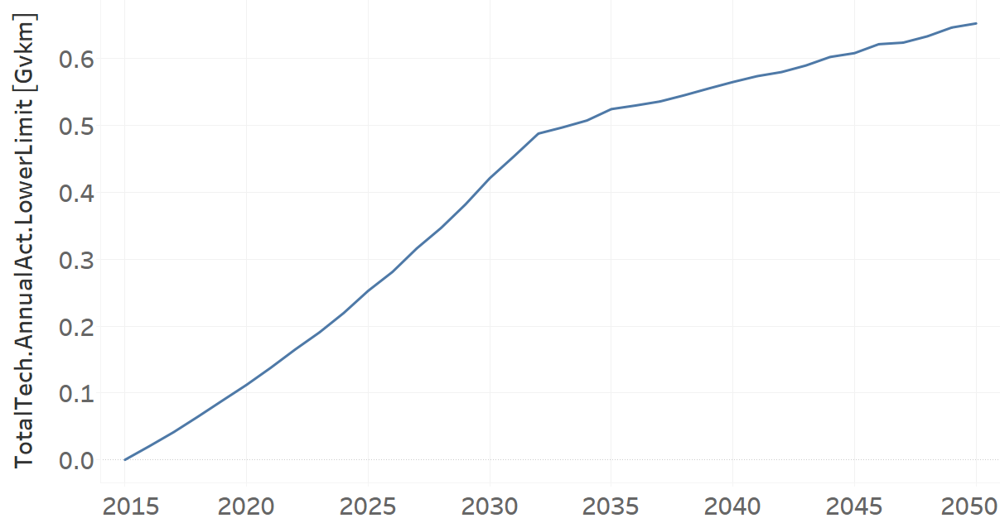
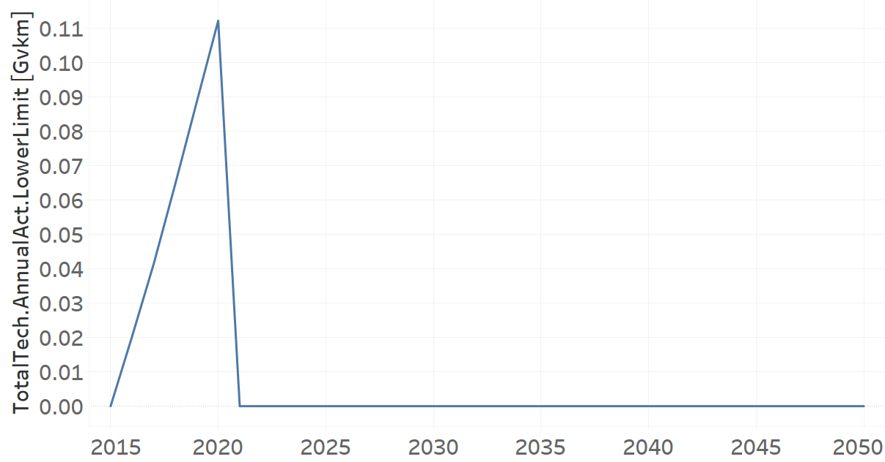

TRTAXGAS02: Taxi Gasoline (new)
=====================================

+-------------------------------------------------+-------+--------------+--------------+--------------+--------------+
| .. figure:: img/TRTAXGAS.png                                                                                        |
|    :align:   center                                                                                                 |
|    :width:   500 px                                                                                                 |
+-------------------------------------------------+-------+--------------+--------------+--------------+--------------+
| Set codification:                                       |TRTAXGAS02                                                 |
+-------------------------------------------------+-------+--------------+--------------+--------------+--------------+
| Description:                                            |Taxi Gasoline (new)                                        |
+-------------------------------------------------+-------+--------------+--------------+--------------+--------------+
| Set:                                                    |Technology                                                 |
+-------------------------------------------------+-------+--------------+--------------+--------------+--------------+
| Parameter                                       | Unit  | 2020         | 2030         | 2040         |  2050        |
+=================================================+=======+==============+==============+==============+==============+
| CapitalCost[r,t,y]                              |M$/Gvkm| 341.73       | 341.73       | 341.73       | 341.73       |
+-------------------------------------------------+-------+--------------+--------------+--------------+--------------+
| DistanceDriven[r,t,y]                           |km/year| 48704        | 48704        | 48704        | 48704        |
+-------------------------------------------------+-------+--------------+--------------+--------------+--------------+
| EmissionActivityRatio[r,t,e,m,y] (Accidents)    |   -   | 0.09         | 0.09         | 0.09         | 0.09         |
+-------------------------------------------------+-------+--------------+--------------+--------------+--------------+
| EmissionActivityRatio[r,t,e,m,y] (Congestion)   |  -    | 0.081        | 0.081        | 0.081        | 0.081        |
+-------------------------------------------------+-------+--------------+--------------+--------------+--------------+
| FixedCost[r,t,y]                                |M$/Gvkm| 49.32        | 49.32        | 49.32        | 49.32        |
+-------------------------------------------------+-------+--------------+--------------+--------------+--------------+
| InputActivityRatio[r,t,f,m,y] (Gasoline for     | PJ/   | 1.64         | 1.64         | 1.64         | 1.64         |
| public transport)                               | Gvkm  |              |              |              |              |
+-------------------------------------------------+-------+--------------+--------------+--------------+--------------+
| OperationalLife[r,t]                            | Years | 10           | 10           | 10           | 10           |
+-------------------------------------------------+-------+--------------+--------------+--------------+--------------+
| OutputActivityRatio[r,t,f,m,y] (Public Transport| PJ/   | 1            | 1            | 1            | 1            |
| in Taxi)                                        | Gvkm  |              |              |              |              |
+-------------------------------------------------+-------+--------------+--------------+--------------+--------------+
| TotalTechnologyAnnualActivityLowerLimit[r,t,y]  | Gvkm  | 0.1121       | 0.4211       | 0.565        | 0.6526       |
| (BAU)                                           |       |              |              |              |              |
+-------------------------------------------------+-------+--------------+--------------+--------------+--------------+
| TotalTechnologyAnnualActivityLowerLimit[r,t,y]  | Gvkm  | 0.1121       | 0            | 0            | 0            |
| (NDP)                                           |       |              |              |              |              |
+-------------------------------------------------+-------+--------------+--------------+--------------+--------------+
| UnitCapitalCost[r,t,y]                          |   $   | 16643.6179   | 16643.6179   | 16643.6179   | 16643.6179   |
+-------------------------------------------------+-------+--------------+--------------+--------------+--------------+
| UnitFixedCost[r,t,y]                            |   $   | 2402.0813    | 2402.0813    | 2402.0813    | 2402.0813    |
+-------------------------------------------------+-------+--------------+--------------+--------------+--------------+

CapitalCost[r,t,y]
+++++++++
The equation (1) shows the Capital Cost for TRTAXGAS02, for every scenario.

CapitalCost=341.73 [M$/Gvkm]   (1)

DistanceDriven[r,t,y]
+++++++++
The equation (2) shows the Distance Driven for TRTAXGAS02, for every scenario.

DistanceDriven=48704 [km/year]   (2)

EmissionActivityRatio[r,t,e,m,y]
+++++++++
The equation (3) shows the Emission Activity Ratio for TRTAXGAS02, for every scenario and associated to the emission Accidents.

EmissionActivityRatio=0.09    (3)

The equation (4) shows the Emission Activity Ratio for TRTAXGAS02, for every scenario and associated to the emission Congestion.

EmissionActivityRatio=0.081    (4)

FixedCost[r,t,y]
+++++++++
The equation (5) shows the Fixed Cost for TRTAXGAS02, for every scenario.

FixedCost=49.32 [M$/Gvkm]   (5)

   
InputActivityRatio[r,t,f,m,y]
+++++++++
The equation (6) shows the Input Activity Ratio for TRTAXGAS02, for every scenario and associated to the fuel Gasoline for public transport. 

InputActivityRatio=1.64 [PJ/Gvkm]   (6)

   
OperationalLife[r,t]
+++++++++
The equation (7) shows the Operational Life for TRTAXGAS02, for every scenario.

OperationalLife=10 Years   (7)
  
   
OutputActivityRatio[r,t,f,m,y]
+++++++++
The equation (8) shows the Output Activity Ratio for TRTAXGAS02, for every scenario and associated to the fuel Public Transport in Taxi.

OutputActivityRatio=1 [PJ/Gvkm]   (8)

  
   
TotalTechnologyAnnualActivityLowerLimit[r,t,y]
+++++++++
The figure 1 shows the Total Technology Annual Activity Lower Limit for TRTAXGAS02, for the BAU scenario.

   
   *Figure 1) Total Technology Annual Activity Lower Limit for TRTAXGAS02 for the BAU scenario.*
   
The figure 2 shows the Total Technology Annual Activity Lower Limit for TRTAXGAS02, for the NDP scenario.

   
   *Figure 2) Total Technology Annual Activity Lower Limit for TRTAXGAS02 for the NDP scenario.*

   
UnitCapitalCost[r,t,y]
+++++++++
The equation (9) shows the Unit Capital Cost for TRTAXGAS02, for every scenario.

UnitCapitalCost=16643.6179 [$]   (9)

   
   
UnitFixedCost[r,t,y]
+++++++++
The equation (10) shows the Unit Fixed Cost for TRTAXGAS02, for every scenario.

UnitFixedCost=2402.0813 [$]   (10)

