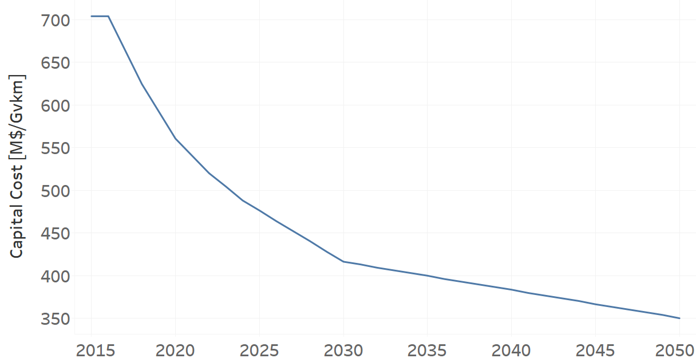
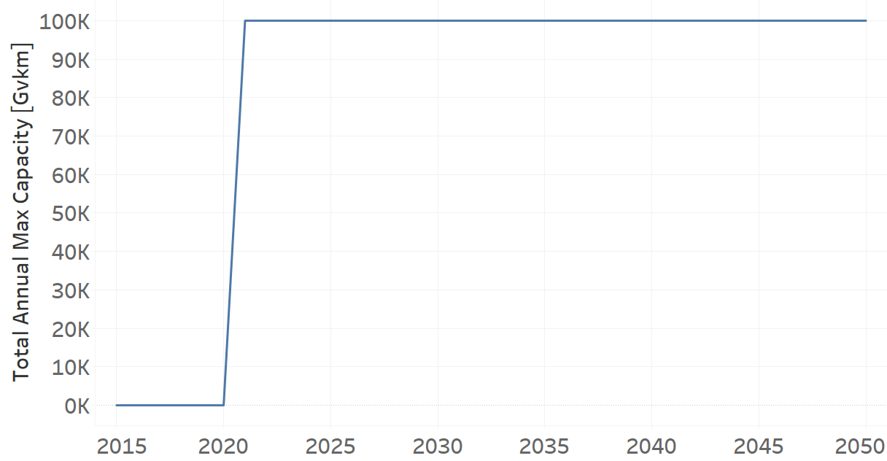
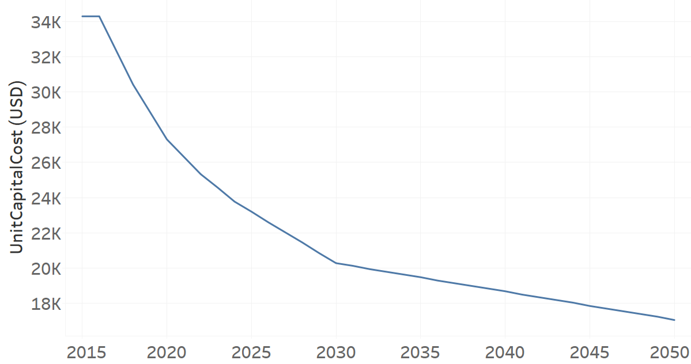

TRTAXHYBG02: Taxi Hybrid Electric-Gasoline (new)
=====================================

+-------------------------------------------------+-------+--------------+--------------+--------------+--------------+
| .. figure:: img/TRTAXHYBG.jpg                                                                                       |
|    :align:   center                                                                                                 |
|    :width:   500 px                                                                                                 |
+-------------------------------------------------+-------+--------------+--------------+--------------+--------------+
| Set codification:                                       |TRTAXHYBG02                                                |
+-------------------------------------------------+-------+--------------+--------------+--------------+--------------+
| Description:                                            |Taxi Hybrid Electric-Gasoline (new)                        |
+-------------------------------------------------+-------+--------------+--------------+--------------+--------------+
| Set:                                                    |Technology                                                 |
+-------------------------------------------------+-------+--------------+--------------+--------------+--------------+
| Parameter                                       | Unit  | 2020         | 2030         | 2040         |  2050        |
+=================================================+=======+==============+==============+==============+==============+
| CapitalCost[r,t,y]                              |M$/Gvkm| 560.54       | 416.31       | 383.57       | 350.05       |
+-------------------------------------------------+-------+--------------+--------------+--------------+--------------+
| DistanceDriven[r,t,y]                           |km/year| 48704        | 48704        | 48704        | 48704        |
+-------------------------------------------------+-------+--------------+--------------+--------------+--------------+
| EmissionActivityRatio[r,t,e,m,y] (Accidents)    |  -    | 0.09         | 0.09         | 0.09         | 0.09         |
+-------------------------------------------------+-------+--------------+--------------+--------------+--------------+
| EmissionActivityRatio[r,t,e,m,y] (Congestion)   |  -    | 0.081        | 0.081        | 0.081        | 0.081        |
+-------------------------------------------------+-------+--------------+--------------+--------------+--------------+
| FixedCost[r,t,y]                                |M$/Gvkm| 24.66        | 24.66        | 24.66        | 24.66        |
+-------------------------------------------------+-------+--------------+--------------+--------------+--------------+
| InputActivityRatio[r,t,f,m,y] (Electricity for  | PJ/   | 0.55         | 0.55         | 0.55         | 0.55         |
| public transport)                               | Gvkm  |              |              |              |              |
+-------------------------------------------------+-------+--------------+--------------+--------------+--------------+
| InputActivityRatio[r,t,f,m,y] (Gasoline for     | PJ/   | 0.55         | 0.55         | 0.55         | 0.55         |
| public transport)                               | Gvkm  |              |              |              |              |
+-------------------------------------------------+-------+--------------+--------------+--------------+--------------+
| OperationalLife[r,t]                            | Years | 10           | 10           | 10           | 10           |
+-------------------------------------------------+-------+--------------+--------------+--------------+--------------+
| OutputActivityRatio[r,t,f,m,y] (Public Transport| PJ/   | 1            | 1            | 1            | 1            |
| in Taxi)                                        | Gvkm  |              |              |              |              |
+-------------------------------------------------+-------+--------------+--------------+--------------+--------------+
| TotalAnnualMaxCapacity[r,t,y]                   | Gvkm  | 0            | 99999        | 99999        | 99999        |
+-------------------------------------------------+-------+--------------+--------------+--------------+--------------+
| UnitCapitalCost[r,t,y]                          |   $   | 27300.5402   | 20275.9622   | 18681.3933   | 17048.8352   |
+-------------------------------------------------+-------+--------------+--------------+--------------+--------------+
| UnitFixedCost[r,t,y]                            |   $   | 1201.0406    | 1201.0406    | 1201.0406    | 1201.0406    |
+-------------------------------------------------+-------+--------------+--------------+--------------+--------------+

CapitalCost[r,t,y]
+++++++++

The figure 1 shows the Capital Cost for TRTAXHYBG02, for every scenario.

   
   *Figure 1) Capital Cost for TRTAXHYBG02 for every scenario.*
   

DistanceDriven[r,t,y]
+++++++++
The equation (1) shows the Distance Driven for TRTAXHYBG02, for every scenario.

DistanceDriven=48704 [km/year]   (1)

EmissionActivityRatio[r,t,e,m,y]
+++++++++
The equation (2) shows the Emission Activity Ratio for TRTAXHYBG02, for every scenario and associated to the emission Accidents.

EmissionActivityRatio=0.09    (2)

The equation (3) shows the Emission Activity Ratio for TRTAXHYBG02, for every scenario and associated to the emission Congestion.

EmissionActivityRatio=0.081    (3)

FixedCost[r,t,y]
+++++++++
The equation (4) shows the Fixed Cost for TRTAXHYBG02, for every scenario.

FixedCost=24.66 [M$/Gvkm]   (4)

   
InputActivityRatio[r,t,f,m,y]
+++++++++
The equation (5) shows the Input Activity Ratio for TRTAXHYBG02, for every scenario and associated to the fuel Electricity for public transport and Gasoline for public transport. 

InputActivityRatio=0.45 [PJ/Gvkm]   (5)

 
   
OperationalLife[r,t]
+++++++++
The equation (6) shows the Operational Life for TRTAXHYBG02, for every scenario.

OperationalLife=10 Years   (6)

  
   
OutputActivityRatio[r,t,f,m,y]
+++++++++
The equation (7) shows the Output Activity Ratio for TRTAXHYBG02, for every scenario and associated to the fuel Public Transport in Taxi.

OutputActivityRatio=1 [PJ/Gvkm]   (7)

   
TotalAnnualMaxCapacity[r,t,y]
+++++++++
The figure 2 shows the Total Annual Max Capacity for TRTAXHYBG02, for every scenario.

   
   *Figure 2) Total Annual Max Capacity for TRTAXHYBG02 for every scenario.*

 
   
UnitCapitalCost[r,t,y]
+++++++++
The figure 3 shows the Unit Capital Cost for TRTAXHYBG02, for every scenario.

   
   *Figure 3) Unit Capital Cost for TRTAXHYBG02 for every scenario.*

   
UnitFixedCost[r,t,y]
+++++++++
The equation (8) shows the Unit Fixed Cost for TRTAXHYBG02, for every scenario.

UnitFixedCost=1201.0406 [$]   (8)

