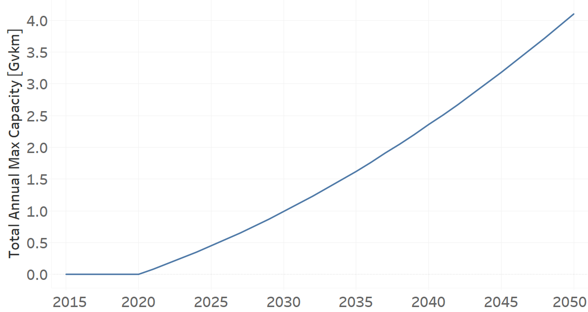

TRXTRAIELEFRE02: Train Electric for Freight (new)
=====================================

+-------------------------------------------------+-------+--------------+--------------+--------------+--------------+
| .. figure:: img/TRXTRAIELEFRE.jpg                                                                                   |
|    :align:   center                                                                                                 |
|    :width:   500 px                                                                                                 |
+-------------------------------------------------+-------+--------------+--------------+--------------+--------------+
| Set codification:                                       |TRXTRAIELEFRE02                                            |
+-------------------------------------------------+-------+--------------+--------------+--------------+--------------+
| Description:                                            |Train Electric for Freight (new)                           |
+-------------------------------------------------+-------+--------------+--------------+--------------+--------------+
| Set:                                                    |Technology                                                 |
+-------------------------------------------------+-------+--------------+--------------+--------------+--------------+
| Parameter                                       | Unit  | 2020         | 2030         | 2040         |  2050        |
+=================================================+=======+==============+==============+==============+==============+
| CapitalCost[r,t,y] (NDP)                        |M$/Gvkm| 0            | 0            | 0            | 0            |
+-------------------------------------------------+-------+--------------+--------------+--------------+--------------+
| InputActivityRatio[r,t,f,m,y] (Electricity for  | Gpkm/ | 0.4          | 0.4          | 0.4          | 0.4          |
| Heavy Freight Transport)                        | Gvkm  |              |              |              |              |
+-------------------------------------------------+-------+--------------+--------------+--------------+--------------+
| OperationalLife[r,t]                            | Years | 50           | 50           | 50           | 50           |
+-------------------------------------------------+-------+--------------+--------------+--------------+--------------+
| OutputActivityRatio[r,t,f,m,y] (Transport Demand| Gpkm/ | 1            | 1            | 1            | 1            |
| Freight Heavy) (NDP)                            | Gvkm  |              |              |              |              |
+-------------------------------------------------+-------+--------------+--------------+--------------+--------------+
| TotalAnnualMaxCapacity[r,t,y] (NDP)             |  Gvkm | 0            | 0.99         | 2.36         | 4.1          |
+-------------------------------------------------+-------+--------------+--------------+--------------+--------------+
| TotalAnnualMinCapacity[r,t,y] (NDP)             |  Gvkm | 0            | 0.99         | 2.36         | 4.1          |
+-------------------------------------------------+-------+--------------+--------------+--------------+--------------+
| TotalTechnologyAnnualActivityLowerLimit[r,t,y]  | Gvkm  | 0            | 0.99         | 2.36         | 4.1          |
| (NDP)                                           |       |              |              |              |              |
+-------------------------------------------------+-------+--------------+--------------+--------------+--------------+

CapitalCost[r,t,y]
+++++++++

The figure 1 shows the Capital Cost for TRXTRAIELEFRE02, for the NDP scenario.

.. figure:: img/TRXTRAIELEFRE02_CapitalCost_NDP.png
   :align:   center
   :width:   700 px
   
   *Figure 1) Capital Cost for TRXTRAIELEFRE02 for the NDP scenario.*
   

InputActivityRatio[r,t,f,m,y]
+++++++++
The equation (1) shows the Input Activity Ratio for TRXTRAIELEFRE02, for every scenario and associated to the fuel Electricity for Heavy Freight Transport.

InputActivityRatio=0.4   [Gpkm/Gvkm]   (1)

  
OperationalLife[r,t]
+++++++++
The equation (2) shows the Operational Life for TRXTRAIELEFRE02, for every scenario.

OperationalLife=50 Years   (2)

   
OutputActivityRatio[r,t,f,m,y]
+++++++++
The equation (3) shows the Output Activity Ratio for TRXTRAIELEFRE02, for the NDP scenario and associated to the fuel Transport Demand Freight Heavy.

OutputActivityRatio=1 [Gpkm/Gvkm]   (3)

   
TotalAnnualMaxCapacity[r,t,y]
+++++++++
The figure 2 shows the Total Annual Max Capacity for TRXTRAIELEFRE02, for the NDP scenario.

   
   *Figure 2) Total Annual Max Capacity for TRXTRAIELEFRE02 for the NDP scenario.*
   
  
TotalAnnualMinCapacity[r,t,y]
+++++++++
The figure 2 shows the Total Annual Min Capacity for TRXTRAIELEFRE02, for the NDP scenario.

.. figure:: img/TRXTRAIELEFRE02_TotalAnnualMinCapacity_NDP.png
   :align:   center
   :width:   700 px
   
   *Figure 2) Total Annual Min Capacity for TRXTRAIELEFRE02 for the NDP scenario.*
   
    
TotalTechnologyAnnualActivityLowerLimit[r,t,y]
+++++++++
The figure 4 shows the Total Technology Annual Activity Lower Limit for TRXTRAIELEFRE02, for the NDP scenario.

.. figure:: img/TRXTRAIELEFRE02_TotalTechnologyAnnualActivityLowerLimit_NDP.png
   :align:   center
   :width:   700 px
   
   *Figure 4) Total Technology Annual Activity Lower Limit for TRXTRAIELEFRE02 for the NDP scenario.*

