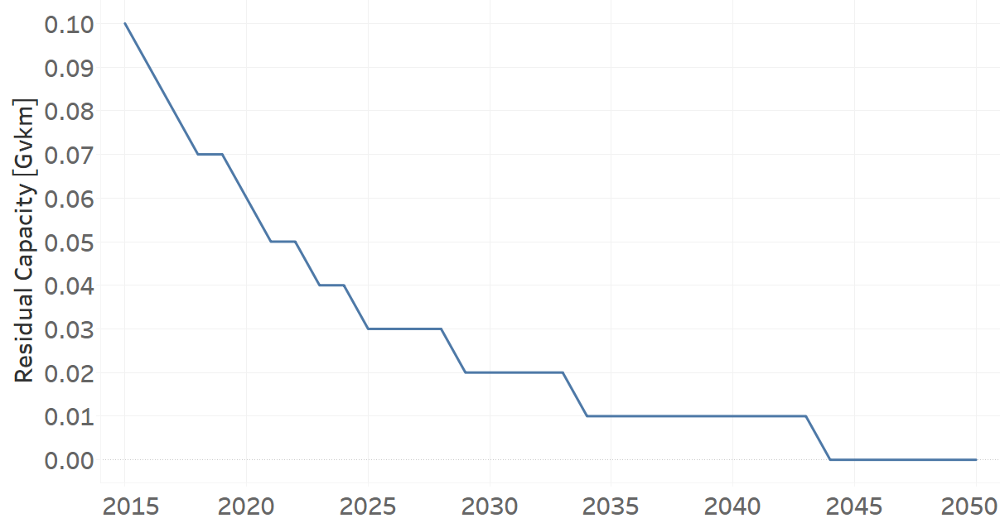
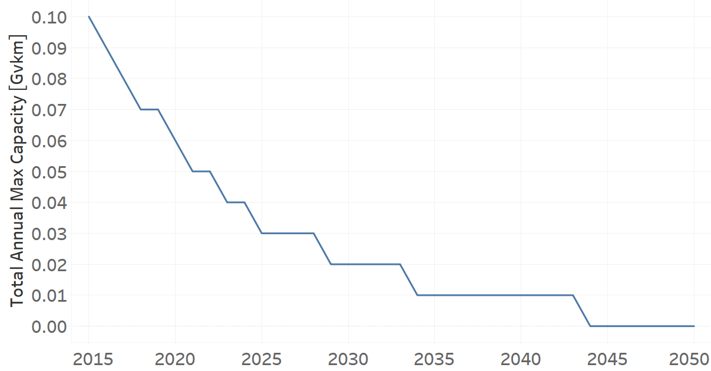
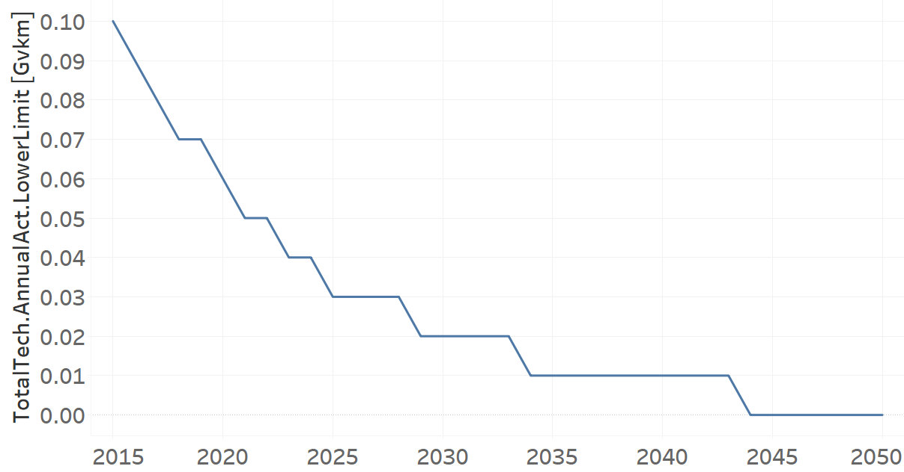

TRXTRAINDSL01: Train Diesel (existing)
=====================================

+-------------------------------------------------+-------+--------------+--------------+--------------+--------------+
| .. figure:: img/TRXTRAINDSL.jpg                                                                                     |
|    :align:   center                                                                                                 |
|    :width:   500 px                                                                                                 |
+-------------------------------------------------+-------+--------------+--------------+--------------+--------------+
| Set codification:                                       |TRXTRAINDSL01                                              |
+-------------------------------------------------+-------+--------------+--------------+--------------+--------------+
| Description:                                            |Train Diesel (existing)                                    |
+-------------------------------------------------+-------+--------------+--------------+--------------+--------------+
| Set:                                                    |Technology                                                 |
+-------------------------------------------------+-------+--------------+--------------+--------------+--------------+
| Parameter                                       | Unit  | 2020         | 2030         | 2040         |  2050        |
+=================================================+=======+==============+==============+==============+==============+
| InputActivityRatio[r,t,f,m,y] (Diesel for       | PJ/   | 1            | 1            | 1            | 1            |
| public transport)                               | Gvkm  |              |              |              |              |
+-------------------------------------------------+-------+--------------+--------------+--------------+--------------+
| OperationalLife[r,t]                            | Years | 20           | 20           | 20           | 20           |
+-------------------------------------------------+-------+--------------+--------------+--------------+--------------+
| OutputActivityRatio[r,t,f,m,y] (                | PJ/   | 1            | 1            | 1            | 1            |
| Transport in Rail)                              | Gvkm  |              |              |              |              |
+-------------------------------------------------+-------+--------------+--------------+--------------+--------------+
| ResidualCapacity[r,t,y]                         | Gvkm  | 0.06         | 0.02         | 0.01         | 0            |
+-------------------------------------------------+-------+--------------+--------------+--------------+--------------+
| TotalAnnualMaxCapacity[r,t,y]                   | Gvkm  | 0.06         | 0.02         | 0.01         | 0            |
+-------------------------------------------------+-------+--------------+--------------+--------------+--------------+
| TotalTechnologyAnnualActivityLowerLimit[r,t,y]  | Gvkm  | 0.06         | 0.02         | 0.01         | 0            |
|                                                 |       |              |              |              |              |
+-------------------------------------------------+-------+--------------+--------------+--------------+--------------+

   
InputActivityRatio[r,t,f,m,y]
+++++++++
The equation (1) shows the Input Activity Ratio for TRXTRAINDSL01, for every scenario and associated to the fuel Diesel for public transport. 

InputActivityRatio=1 [PJ/Gvkm]   (1)

Source:
   This is the source. 
   
Description: 
   This is the description.   
   
OperationalLife[r,t]
+++++++++
The equation (2) shows the Operational Life for TRXTRAINDSL01, for every scenario.

OperationalLife=20 Years   (2)

Source:
   This is the source. 
   
Description: 
   This is the description.   
   
OutputActivityRatio[r,t,f,m,y]
+++++++++
The equation (3) shows the Output Activity Ratio for TRXTRAINDSL01, for every scenario and associated to the fuel Transport in Rail.

OutputActivityRatio=1 [PJ/Gvkm]   (3)

Source:
   This is the source. 
   
Description: 
   This is the description.      
   
ResidualCapacity[r,t,y]
+++++++++
The figure 1 shows the Residual Capacity for TRXTRAINDSL01, for the every scenario.

   
   *Figure 1) Residual Capacity for TRXTRAINDSL01 for the every scenario.*
   
Source:
   This is the source. 
   
Description: 
   This is the description.         
   
TotalAnnualMaxCapacity[r,t,y]
+++++++++
The figure 2 shows the Total Annual Max Capacity for TRXTRAINDSL01, for the every scenario.

   
   *Figure 2) Total Annual Max Capacity for TRXTRAINDSL01 for the every scenario.*
   
Source:
   This is the source. 
   
Description: 
   This is the description.
   
TotalTechnologyAnnualActivityLowerLimit[r,t,y]
+++++++++
The figure 3 shows the Total Technology Annual Activity Lower Limit for TRXTRAINDSL01, for every scenario.

   
   *Figure 3) Total Technology Annual Activity Lower Limit for TRXTRAINDSL01 for every scenario.*
   
Source:
   This is the source. 
   
Description: 
   This is the description.
