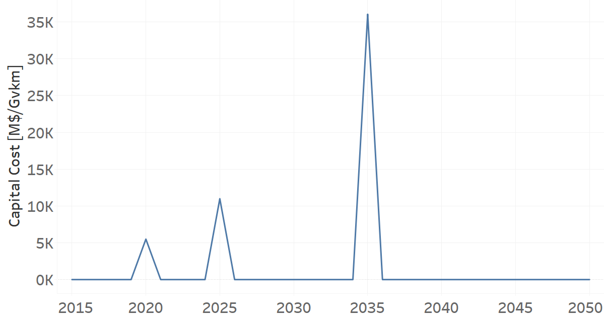

TRXTRAINELC02: Train Electric (new)
=====================================

+-------------------------------------------------+-------+--------------+--------------+--------------+--------------+
| .. figure:: img/TRXTRAINELC.jpg                                                                                    |
|    :align:   center                                                                                                 |
|    :width:   500 px                                                                                                 |
+-------------------------------------------------+-------+--------------+--------------+--------------+--------------+
| Set codification:                                       |TRXTRAINELC02                                              |
+-------------------------------------------------+-------+--------------+--------------+--------------+--------------+
| Description:                                            |Train Electric (new)                                       |
+-------------------------------------------------+-------+--------------+--------------+--------------+--------------+
| Set:                                                    |Technology                                                 |
+-------------------------------------------------+-------+--------------+--------------+--------------+--------------+
| Parameter                                       | Unit  | 2020         | 2030         | 2040         |  2050        |
+=================================================+=======+==============+==============+==============+==============+
| CapitalCost[r,t,y] (NDP)                        |M$/Gvkm| 5491.52      | 0            | 0            | 0            |
+-------------------------------------------------+-------+--------------+--------------+--------------+--------------+
| InputActivityRatio[r,t,f,m,y] (Electricity for  | Gpkm/ | 0.3          | 0.3          | 0.3          | 0.3          |
| Public Transport)                               | Gvkm  |              |              |              |              |
+-------------------------------------------------+-------+--------------+--------------+--------------+--------------+
| OperationalLife[r,t]                            | Years | 20           | 20           | 20           | 20           |
+-------------------------------------------------+-------+--------------+--------------+--------------+--------------+
| OutputActivityRatio[r,t,f,m,y] (Transport       | Gpkm/ | 1            | 1            | 1            | 1            |
| in Rail)                                        | Gvkm  |              |              |              |              |
+-------------------------------------------------+-------+--------------+--------------+--------------+--------------+
| TotalAnnualMaxCapacity[r,t,y] (BAU)             |  Gvkm | 0            | 1            | 1            | 1            |
+-------------------------------------------------+-------+--------------+--------------+--------------+--------------+ 
| TotalAnnualMaxCapacity[r,t,y] (NDP)             |  Gvkm | 0            | 0.4444       | 1            | 1            |
+-------------------------------------------------+-------+--------------+--------------+--------------+--------------+
| TotalAnnualMinCapacity[r,t,y] (NDP)             |  Gvkm | 0            | 0.4444       | 1            | 1            |
+-------------------------------------------------+-------+--------------+--------------+--------------+--------------+
| TotalTechnologyAnnualActivityLowerLimit[r,t,y]  | Gvkm  | 0            | 0.4444       | 1            | 1            |
| (NDP)                                           |       |              |              |              |              |
+-------------------------------------------------+-------+--------------+--------------+--------------+--------------+

CapitalCost[r,t,y]
+++++++++

The figure 1 shows the Capital Cost for TRXTRAINELC02, for NDP scenario.

   
   *Figure 1) Capital Cost for TRXTRAINELC02 for NDP scenario.*
   
Source:
   This is the source. 
   
Description: 
   This is the description. 

InputActivityRatio[r,t,f,m,y]
+++++++++
The equation (1) shows the Input Activity Ratio for TRXTRAINELC02, for every scenario and associated to the fuel Electricity for Public Transport.

InputActivityRatio=0.3   [Gpkm/Gvkm]   (1)

Source:
   This is the source. 
   
Description: 
   This is the description.
   
OperationalLife[r,t]
+++++++++
The equation (2) shows the Operational Life for TRXTRAINELC02, for every scenario.

OperationalLife=20 Years   (2)

Source:
   This is the source. 
   
Description: 
   This is the description.   
   
OutputActivityRatio[r,t,f,m,y]
+++++++++
The equation (3) shows the Output Activity Ratio for TRXTRAINELC02, for NDP scenario and associated to the fuel Transport in Rail.

OutputActivityRatio=1 [Gpkm/Gvkm]   (3)

Source:
   This is the source. 
   
Description: 
   This is the description.
   
TotalAnnualMaxCapacity[r,t,y]
+++++++++

The figure 2 shows the Total Annual Max Capacity for TRXTRAINELC02, for the BAU scenario.

.. figure:: img/TRXTRAINELC02_TotalAnnualMaxCapacity_BAU.png
   :align:   center
   :width:   700 px
   
   *Figure 2) Total Annual Max Capacity for TRXTRAINELC02 for the BAU scenario.*

The figure 3 shows the Total Annual Max Capacity for TRXTRAINELC02, for the NDP scenario.

.. figure:: img/TRXTRAINELC02_TotalAnnualMaxCapacity_NDP.png
   :align:   center
   :width:   700 px
   
   *Figure 3) Total Annual Max Capacity for TRXTRAINELC02 for the NDP scenario.*
   
Source:
   This is the source. 
   
Description: 
   This is the description.
   
TotalAnnualMinCapacity[r,t,y]
+++++++++
The figure 2 shows the Total Annual Min Capacity for TRXTRAINELC02, for the NDP scenario.

.. figure:: img/TRXTRAINELC02_TotalAnnualMinCapacity_NDP.png
   :align:   center
   :width:   700 px
   
   *Figure 2) Total Annual Min Capacity for TRXTRAINELC02 for the NDP scenario.*
   
Source:
   This is the source. 
   
Description: 
   This is the description.   
   
TotalTechnologyAnnualActivityLowerLimit[r,t,y]
+++++++++
The figure 4 shows the Total Technology Annual Activity Lower Limit for TRXTRAINELC02, for the NDP scenario.

.. figure:: img/TRXTRAINELC02_TotalTechnologyAnnualActivityLowerLimit_NDP.png
   :align:   center
   :width:   700 px
   
   *Figure 4) Total Technology Annual Activity Lower Limit for TRXTRAINELC02 for NDP scenario.*

Source:
   This is the source. 
   
Description: 
   This is the description.
