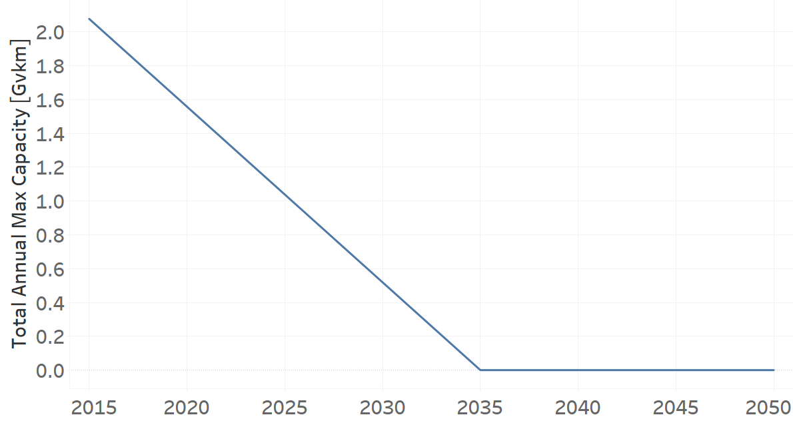

TRYLFDSL01: Mini Trucks (existing)
=====================================

+-------------------------------------------------+-------+--------------+--------------+--------------+--------------+
| .. figure:: img/TRYLFDSL.PNG                                                                                        |
|    :align:   center                                                                                                 |
|    :width:   500 px                                                                                                 |
+-------------------------------------------------+-------+--------------+--------------+--------------+--------------+
| Set codification:                                       |TRYLFDSL01                                                 |
+-------------------------------------------------+-------+--------------+--------------+--------------+--------------+
| Description:                                            |Mini Trucks (existing)                                     |
+-------------------------------------------------+-------+--------------+--------------+--------------+--------------+
| Set:                                                    |Technology                                                 |
+-------------------------------------------------+-------+--------------+--------------+--------------+--------------+
| Parameter                                       | Unit  | 2020         | 2030         | 2040         |  2050        |
+=================================================+=======+==============+==============+==============+==============+
| DistanceDriven[r,t,y]                           |km/year| 17413        | 17413        | 17413        | 17413        |
+-------------------------------------------------+-------+--------------+--------------+--------------+--------------+
| EmissionActivityRatio[r,t,e,m,y] (Congestion)   |   -   | 0.16         | 0.16         | 0.16         | 0.16         |
+-------------------------------------------------+-------+--------------+--------------+--------------+--------------+
| EmissionActivityRatio[r,t,e,m,y] (Health)       |   -   | 0.01         | 0.01         | 0.01         | 0.01         |
+-------------------------------------------------+-------+--------------+--------------+--------------+--------------+
| FixedCost[r,t,y]                                |M$/Gvkm| 236.83       | 236.83       | 236.83       | 236.83       |
+-------------------------------------------------+-------+--------------+--------------+--------------+--------------+
| InputActivityRatio[r,t,f,m,y] (Diesel for       | PJ/   | 3.81         | 3.81         | 3.81         | 3.81         |
| light freight transport)                        | Gvkm  |              |              |              |              |
+-------------------------------------------------+-------+--------------+--------------+--------------+--------------+
| OperationalLife[r,t]                            | Years | 10           | 10           | 10           | 10           |
+-------------------------------------------------+-------+--------------+--------------+--------------+--------------+
| OutputActivityRatio[r,t,f,m,y] (FLF_PickUpTrucks| PJ/   | 1            | 1            | 1            | 1            |
| )                                               | Gvkm  |              |              |              |              |
+-------------------------------------------------+-------+--------------+--------------+--------------+--------------+
| ResidualCapacity[r,t,y]                         |  Gvkm | 1.5573       | 0.5191       | 0            | 0            |
+-------------------------------------------------+-------+--------------+--------------+--------------+--------------+
| TotalAnnualMaxCapacity[r,t,y]                   |  Gvkm | 1.5573       | 0.5191       | 0            | 0            |
+-------------------------------------------------+-------+--------------+--------------+--------------+--------------+
| TotalTechnologyAnnualActivityLowerLimit[r,t,y]  | Gvkm  | 1.5573       | 0.5191       | 0            | 0            |
|                                                 |       |              |              |              |              |
+-------------------------------------------------+-------+--------------+--------------+--------------+--------------+
| UnitFixedCost[r,t,y]                            |   $   | 4123.9208    | 4123.9208    | 4123.9208    | 4123.9208    |
+-------------------------------------------------+-------+--------------+--------------+--------------+--------------+

DistanceDriven[r,t,y]
+++++++++
The equation (1) shows the Distance Driven for TRYLFDSL01, for every scenario.

DistanceDriven=17413 [km/year]   (1)

Source:
   This is the source. 
   
Description: 
   This is the description.

EmissionActivityRatio[r,t,e,m,y]
+++++++++

The equation (2) shows the Emission Activity Ratio for TRYLFDSL01, for every scenario and associated to the emission Congestion.

EmissionActivityRatio=0.16    (2)

The equation (3) shows the Emission Activity Ratio for TRYLFDSL01, for every scenario and associated to the emission Health.

EmissionActivityRatio=0.01    (3)

Source:
   This is the source. 
   
Description: 
   This is the description.

FixedCost[r,t,y]
+++++++++
The equation (4) shows the Fixed Cost for TRYLFDSL01, for every scenario.

FixedCost=236.83 [M$/Gvkm]   (4)

Source:
   This is the source. 
   
Description: 
   This is the description.
   
InputActivityRatio[r,t,f,m,y]
+++++++++
The equation (5) shows the Input Activity Ratio for TRYLFDSL01, for every scenario and associated to the fuel Diesel for light freight transport. 

InputActivityRatio=3.81 [PJ/Gvkm]   (5)

Source:
   This is the source. 
   
Description: 
   This is the description.   
   
OperationalLife[r,t]
+++++++++
The equation (6) shows the Operational Life for TRYLFDSL01, for every scenario.

OperationalLife=10 Years   (6)

Source:
   This is the source. 
   
Description: 
   This is the description.   
   
OutputActivityRatio[r,t,f,m,y]
+++++++++
The equation (7) shows the Output Activity Ratio for TRYLFDSL01, for every scenario and associated to the fuel FLF_PickUpTrucks.

OutputActivityRatio=1 [PJ/Gvkm]   (7)

Source:
   This is the source. 
   
Description: 
   This is the description.      
   
ResidualCapacity[r,t,y]
+++++++++
The figure 1 shows the Residual Capacity for TRYLFDSL01, for every scenario.

   
   *Figure 1) Residual Capacity for TRYLFDSL01 for every scenario.*

Source:
   This is the source. 
   
Description: 
   This is the description.         
   
TotalAnnualMaxCapacity[r,t,y]
+++++++++
The figure 2 shows the Total Annual Max Capacity for TRYLFDSL01, for every scenario.

   
   *Figure 2) Total Annual Max Capacity for TRYLFDSL01 for every scenario.*

Source:
   This is the source. 
   
Description: 
   This is the description.
   
TotalTechnologyAnnualActivityLowerLimit[r,t,y]
+++++++++
The figure 3 shows the Total Technology Annual Activity Lower Limit for TRYLFDSL01, for every scenario.

.. figure:: img/TRYLFDSL01_TotalTechnologyAnnualActivityLowerLimit.png
   :align:   center
   :width:   700 px
   
   *Figure 3) Total Technology Annual Activity Lower Limit for TRYLFDSL01 for every scenario.*

Source:
   This is the source. 
   
Description: 
   This is the description.
   
UnitFixedCost[r,t,y]
+++++++++
The equation (8) shows the Unit Fixed Cost for TRYLFDSL01, for every scenario.

UnitFixedCost=4123.9208 [$]   (8)

Source:
   This is the source. 
   
Description: 
   This is the description.
