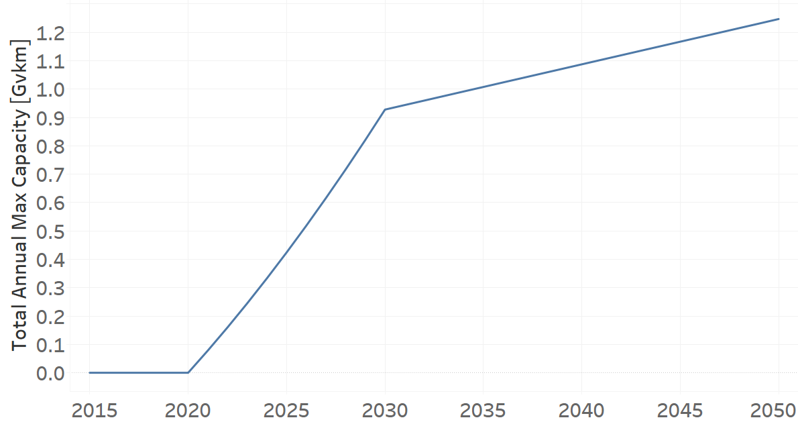
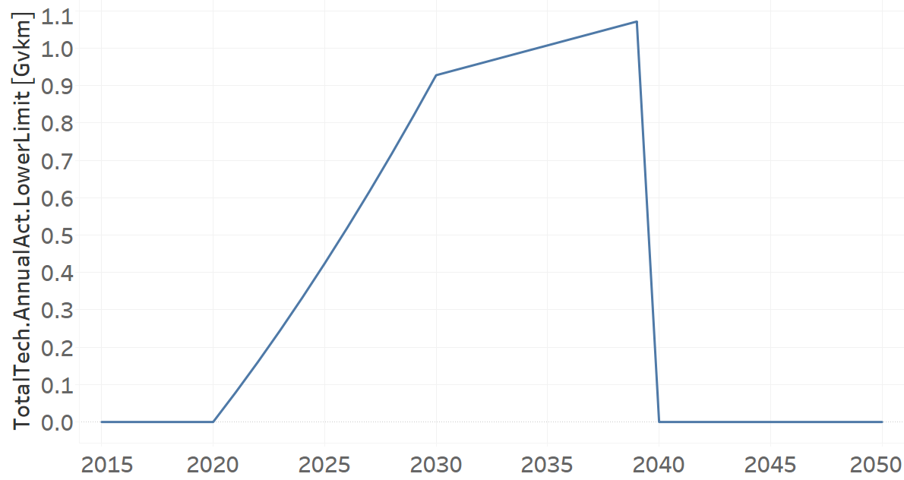

TRYLFLPG02: Mini Trucks LPG (new)
=====================================

+-------------------------------------------------+-------+--------------+--------------+--------------+--------------+
| .. figure:: img/TRYLFLPG.jpg                                                                                        |
|    :align:   center                                                                                                 |
|    :width:   500 px                                                                                                 |
+-------------------------------------------------+-------+--------------+--------------+--------------+--------------+
| Set codification:                                       |TRYLFLPG02                                                 |
+-------------------------------------------------+-------+--------------+--------------+--------------+--------------+
| Description:                                            |Mini Trucks LPG (new)                                      |
+-------------------------------------------------+-------+--------------+--------------+--------------+--------------+
| Set:                                                    |Technology                                                 |
+-------------------------------------------------+-------+--------------+--------------+--------------+--------------+
| Parameter                                       | Unit  | 2020         | 2030         | 2040         |  2050        |
+=================================================+=======+==============+==============+==============+==============+
| CapitalCost[r,t,y]                              |M$/Gvkm| 1588         | 1588         | 1588         | 1588         |
+-------------------------------------------------+-------+--------------+--------------+--------------+--------------+
| DistanceDriven[r,t,y]                           |km/year| 17413        | 17413        | 17413        | 17413        |
+-------------------------------------------------+-------+--------------+--------------+--------------+--------------+
| EmissionActivityRatio[r,t,e,m,y] (Congestion)   |  -    | 0.16         | 0.16         | 0.16         | 0.16         |
+-------------------------------------------------+-------+--------------+--------------+--------------+--------------+
| FixedCost[r,t,y]                                |M$/Gvkm| 236.83       | 236.83       | 236.83       | 236.83       |
+-------------------------------------------------+-------+--------------+--------------+--------------+--------------+
| InputActivityRatio[r,t,f,m,y] (LPG for          | PJ/   | 2.48         | 2.48         | 2.48         | 2.48         |
| light freight transport)                        | Gvkm  |              |              |              |              |
+-------------------------------------------------+-------+--------------+--------------+--------------+--------------+
| OperationalLife[r,t]                            | Years | 10           | 10           | 10           | 10           |
+-------------------------------------------------+-------+--------------+--------------+--------------+--------------+
| OutputActivityRatio[r,t,f,m,y] (FLF_PickUpTrucks| PJ/   | 1            | 1            | 1            | 1            |
| )                                               | Gvkm  |              |              |              |              |
+-------------------------------------------------+-------+--------------+--------------+--------------+--------------+
| TotalAnnualMaxCapacity[r,t,y] (NDP)             | Gvkm  | 0            | 0.9277       | 1.0873       | 1.247        |
+-------------------------------------------------+-------+--------------+--------------+--------------+--------------+
| TotalTechnologyAnnualActivityLowerLimit[r,t,y]  | Gvkm  | 0            | 0.9277       | 0            | 0            |
| (NDP)                                           |       |              |              |              |              |
+-------------------------------------------------+-------+--------------+--------------+--------------+--------------+
| UnitCapitalCost[r,t,y]                          |   $   | 27651.844    | 27651.844    | 27651.844    | 27651.844    |
+-------------------------------------------------+-------+--------------+--------------+--------------+--------------+
| UnitFixedCost[r,t,y]                            |   $   | 2061.9604    | 2061.9604    | 2061.9604    | 2061.9604    |
+-------------------------------------------------+-------+--------------+--------------+--------------+--------------+

CapitalCost[r,t,y]
+++++++++
The equation (1) shows the Capital Cost for TRYLFLPG02, for every scenario.

CapitalCost=1588 [M$/Gvkm]   (1)

Source:
   This is the source. 
   
Description: 
   This is the description. 

DistanceDriven[r,t,y]
+++++++++
The equation (2) shows the Distance Driven for TRYLFLPG02, for every scenario.

DistanceDriven=17413 [km/year]   (2)

Source:
   This is the source. 
   
Description: 
   This is the description.

EmissionActivityRatio[r,t,e,m,y]
+++++++++
The equation (3) shows the Emission Activity Ratio for TRYLFLPG02, for every scenario and associated to the emission Congestion.

EmissionActivityRatio=0.16    (3)

Source:
   This is the source. 
   
Description: 
   This is the description.

FixedCost[r,t,y]
+++++++++
The equation (4) shows the Fixed Cost for TRYLFLPG02, for every scenario.

FixedCost=236.83 [M$/Gvkm]   (4)

Source:
   This is the source. 
   
Description: 
   This is the description.
   
InputActivityRatio[r,t,f,m,y]
+++++++++
The equation (5) shows the Input Activity Ratio for TRYLFLPG02, for every scenario and associated to the fuel LPG for light freight transport. 

InputActivityRatio=2.48 [PJ/Gvkm]   (5)

Source:
   This is the source. 
   
Description: 
   This is the description.   
   
OperationalLife[r,t]
+++++++++
The equation (6) shows the Operational Life for TRYLFLPG02, for every scenario.

OperationalLife=10 Years   (6)

Source:
   This is the source. 
   
Description: 
   This is the description.   
   
OutputActivityRatio[r,t,f,m,y]
+++++++++
The equation (7) shows the Output Activity Ratio for TRYLFLPG02, for every scenario and associated to the fuel FLF_PickUpTrucks.

OutputActivityRatio=1 [PJ/Gvkm]   (7)

Source:
   This is the source. 
   
Description: 
   This is the description.
   
TotalAnnualMaxCapacity[r,t,y]
+++++++++
The figure 1 shows the Total Annual Max Capacity for TRYLFLPG02, for NDP scenario.

   
   *Figure 1) Total Annual Max Capacity for TRYLFLPG02 for NDP scenario.*

Source:
   This is the source. 
   
Description: 
   This is the description.   
   
TotalTechnologyAnnualActivityLowerLimit[r,t,y]
+++++++++

The figure 4 shows the Total Technology Annual Activity Lower Limit for TRYLFLPG02, for the NDP scenario.

   
   *Figure 4) Total Technology Annual Activity Lower Limit for TRYLFLPG02 for NDP scenario.*

Source:
   This is the source. 
   
Description: 
   This is the description.   
   
UnitCapitalCost[r,t,y]
+++++++++
The equation (8) shows the Unit Capital Cost for TRYLFLPG02, for every scenario.

UnitCapitalCost=27651.844 [$]   (8)

Source:
   This is the source. 
   
Description: 
   This is the description.
   
UnitFixedCost[r,t,y]
+++++++++
The equation (9) shows the Unit Fixed Cost for TRYLFLPG02, for every scenario.

UnitFixedCost=4123.9208 [$]   (9)

Source:
   This is the source. 
   
Description: 
   This is the description.
