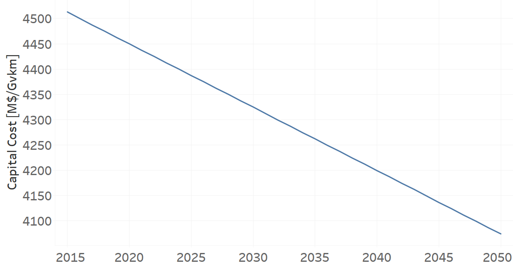
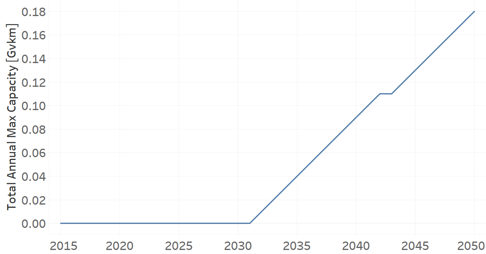
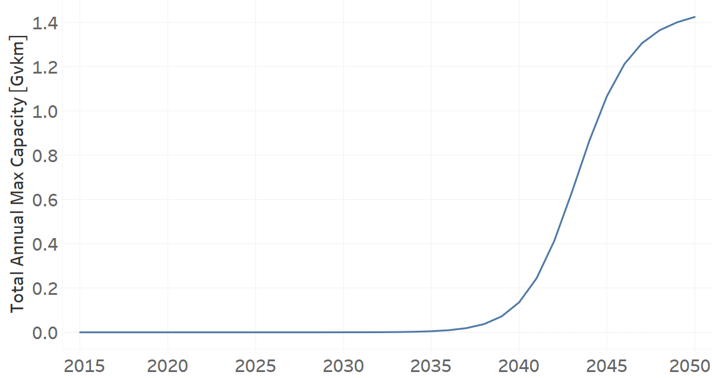
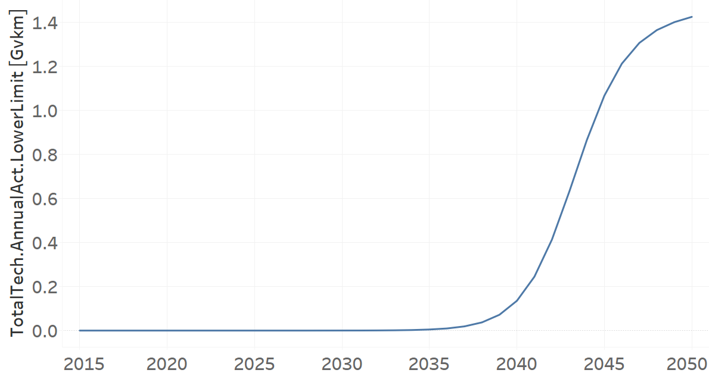
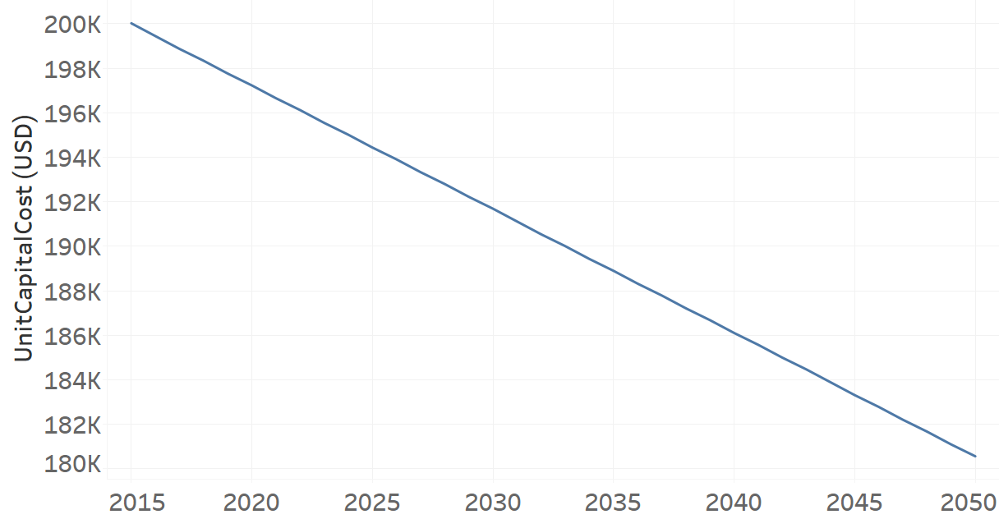

TRYTKELC02: Trucks Electric (new)
=====================================

+-------------------------------------------------+-------+--------------+--------------+--------------+--------------+
| .. figure:: img/TRYTKELC.jpg                                                                                        |
|    :align:   center                                                                                                 |
|    :width:   500 px                                                                                                 |
+-------------------------------------------------+-------+--------------+--------------+--------------+--------------+
| Set codification:                                       |TRYTKELC02                                                 |
+-------------------------------------------------+-------+--------------+--------------+--------------+--------------+
| Description:                                            |Trucks Electric (new)                                      |
+-------------------------------------------------+-------+--------------+--------------+--------------+--------------+
| Set:                                                    |Technology                                                 |
+-------------------------------------------------+-------+--------------+--------------+--------------+--------------+
| Parameter                                       | Unit  | 2020         | 2030         | 2040         |  2050        |
+=================================================+=======+==============+==============+==============+==============+
| CapitalCost[r,t,y]                              |M$/Gvkm| 4450         | 4325         | 4199         | 4074         |
+-------------------------------------------------+-------+--------------+--------------+--------------+--------------+
| DistanceDriven[r,t,y]                           |km/year| 44321        | 44321        | 44321        | 44321        |
+-------------------------------------------------+-------+--------------+--------------+--------------+--------------+
| EmissionActivityRatio[r,t,e,m,y] (Congestion)   | -     | 0.16         | 0.16         | 0.16         | 0.16         |
+-------------------------------------------------+-------+--------------+--------------+--------------+--------------+
| FixedCost[r,t,y]                                |M$/Gvkm| 153.3807     | 153.3807     | 153.3807     | 153.3807     |
+-------------------------------------------------+-------+--------------+--------------+--------------+--------------+
| InputActivityRatio[r,t,f,m,y] (Electricity for  | PJ/   | 2.06         | 2.06         | 2.06         | 2.06         |
| heavy freight transport)                        | Gvkm  |              |              |              |              |
+-------------------------------------------------+-------+--------------+--------------+--------------+--------------+
| OperationalLife[r,t]                            | Years | 10           | 10           | 10           | 10           |
+-------------------------------------------------+-------+--------------+--------------+--------------+--------------+
| OutputActivityRatio[r,t,f,m,y] (FHF_Trucks)     | PJ/   | 1            | 1            | 1            | 1            |
|                                                 | Gvkm  |              |              |              |              |
+-------------------------------------------------+-------+--------------+--------------+--------------+--------------+
| TotalAnnualMaxCapacity[r,t,y] (BAU)             |  Gvkm | 0            | 0            | 0.09         | 0.18         |
+-------------------------------------------------+-------+--------------+--------------+--------------+--------------+
| TotalAnnualMaxCapacity[r,t,y] (NDP)             |  Gvkm | 0            | 0.0002       | 0.1354       | 1.4254       |
+-------------------------------------------------+-------+--------------+--------------+--------------+--------------+
| TotalTechnologyAnnualActivityLowerLimit[r,t,y]  | Gvkm  | 0            | 0.0002       | 0.1354       | 1.4254       |
| (NDP)                                           |       |              |              |              |              |
+-------------------------------------------------+-------+--------------+--------------+--------------+--------------+
| UnitCapitalCost[r,t,y]                          |   $   | 197228.45    | 191688.325   | 186103.879   | 180563.754   |
+-------------------------------------------------+-------+--------------+--------------+--------------+--------------+
| UnitFixedCost[r,t,y]                            |   $   | 6797.986     | 6797.986     | 6797.986     | 6797.986     |
+-------------------------------------------------+-------+--------------+--------------+--------------+--------------+

CapitalCost[r,t,y]
+++++++++
The figure 1 shows the Capital Cost for TRYTKELC02, for every scenario.

   
   *Figure 1) Capital Cost for TRYTKELC02 for every scenario.*
   

DistanceDriven[r,t,y]
+++++++++
The equation (1) shows the Distance Driven for TRYTKELC02, for every scenario.

DistanceDriven=44321 [km/year]   (1)

EmissionActivityRatio[r,t,e,m,y]
+++++++++
The equation (2) shows the Emission Activity Ratio for TRYTKELC02, for every scenario and associated to the emission Congestion.

EmissionActivityRatio=0.16    (2)

FixedCost[r,t,y]
+++++++++
The equation (3) shows the Fixed Cost for TRYTKELC02, for every scenario.

FixedCost=153.3807 [M$/Gvkm]   (3)

   
InputActivityRatio[r,t,f,m,y]
+++++++++
The equation (4) shows the Input Activity Ratio for TRYTKELC02, for every scenario and associated to the fuel Electricity for heavy freight transport. 

InputActivityRatio=2.06 [PJ/Gvkm]   (4)

   
OperationalLife[r,t]
+++++++++
The equation (5) shows the Operational Life for TRYTKELC02, for every scenario.

OperationalLife=10 Years   (5)

 
   
OutputActivityRatio[r,t,f,m,y]
+++++++++
The equation (6) shows the Output Activity Ratio for TRYTKELC02, for every scenario and associated to the fuel FHF_Trucks.

OutputActivityRatio=1 [PJ/Gvkm]   (6)

   
TotalAnnualMaxCapacity[r,t,y]
+++++++++
The figure 2 shows the Total Annual Max Capacity for TRYTKELC02, for the BAU scenario.

   
   *Figure 2) Total Annual Max Capacity for TRYTKELC02 for BAU scenario.*
   
The figure 3 shows the Total Annual Max Capacity for TRYTKELC02, for the NDP scenario.

   
   *Figure 3) Total Annual Max Capacity for TRYTKELC02 for the NDP scenario.*

  
   
TotalTechnologyAnnualActivityLowerLimit[r,t,y]
+++++++++
The figure 4 shows the Total Technology Annual Activity Lower Limit for TRYTKELC02, for the NDP scenario.

   
   *Figure 4) Total Technology Annual Activity Lower Limit for TRYTKELC02 for the NDP scenario.*

   
UnitCapitalCost[r,t,y]
+++++++++
The figure 5 shows the Unit Capital Cost for TRYTKELC02, for every scenario.

   
   *Figure 5) Unit Capital Cost for TRYTKELC02 for every scenario.*

   
   
UnitFixedCost[r,t,y]
+++++++++
The equation (7) shows the Unit Fixed Cost for TRYTKELC02, for every scenario.

UnitFixedCost=6797.986 [$]   (7)

