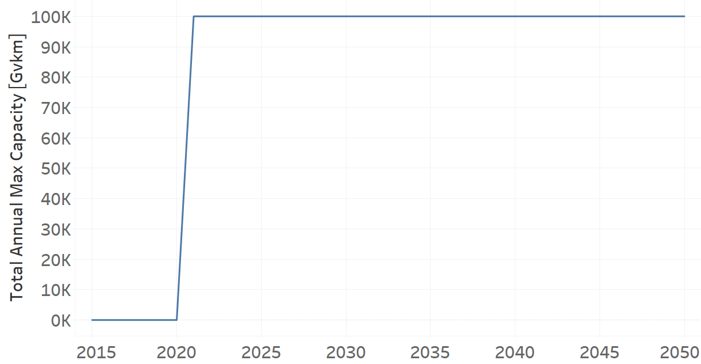

TRYTKHYBD02: Trucks Hybrid Electric-Diesel (new)
=====================================

+-------------------------------------------------+-------+--------------+--------------+--------------+--------------+
| .. figure:: img/TRYTKHYBD.jpg                                                                                       |
|    :align:   center                                                                                                 |
|    :width:   500 px                                                                                                 |
+-------------------------------------------------+-------+--------------+--------------+--------------+--------------+
| Set codification:                                       |TRYTKHYBD02                                                |
+-------------------------------------------------+-------+--------------+--------------+--------------+--------------+
| Description:                                            |Trucks Hybrid Electric-Diesel (new)                        |
+-------------------------------------------------+-------+--------------+--------------+--------------+--------------+
| Set:                                                    |Technology                                                 |
+-------------------------------------------------+-------+--------------+--------------+--------------+--------------+
| Parameter                                       | Unit  | 2020         | 2030         | 2040         |  2050        |
+=================================================+=======+==============+==============+==============+==============+
| CapitalCost[r,t,y]                              |M$/Gvkm| 3288         | 3288         | 3288         | 3288         |
+-------------------------------------------------+-------+--------------+--------------+--------------+--------------+
| DistanceDriven[r,t,y]                           |km/year| 44321        | 44321        | 44321        | 44321        |
+-------------------------------------------------+-------+--------------+--------------+--------------+--------------+
| EmissionActivityRatio[r,t,e,m,y] (Congestion)   |  -    | 0.16         | 0.16         | 0.16         | 0.16         |
+-------------------------------------------------+-------+--------------+--------------+--------------+--------------+
| EmissionActivityRatio[r,t,e,m,y] (Health)       |   -   | 0.03         | 0.03         | 0.03         | 0.03         |
+-------------------------------------------------+-------+--------------+--------------+--------------+--------------+
| FixedCost[r,t,y]                                |M$/Gvkm| 232.395      | 232.395      | 232.395      | 232.395      |
+-------------------------------------------------+-------+--------------+--------------+--------------+--------------+
| InputActivityRatio[r,t,f,m,y] (Diesel for       | PJ/   | 2.21         | 2.21         | 2.21         | 2.21         |
| light heavy transport)                          | Gvkm  |              |              |              |              |
+-------------------------------------------------+-------+--------------+--------------+--------------+--------------+
| InputActivityRatio[r,t,f,m,y] (Electricity for  | PJ/   | 2.21         | 2.21         | 2.21         | 2.21         |
| heavy freight transport)                        | Gvkm  |              |              |              |              |
+-------------------------------------------------+-------+--------------+--------------+--------------+--------------+
| OperationalLife[r,t]                            | Years | 10           | 10           | 10           | 10           |
+-------------------------------------------------+-------+--------------+--------------+--------------+--------------+
| OutputActivityRatio[r,t,f,m,y] (FHF_Trucks)     | PJ/   | 1            | 1            | 1            | 1            |
|                                                 | Gvkm  |              |              |              |              |
+-------------------------------------------------+-------+--------------+--------------+--------------+--------------+
| TotalAnnualMaxCapacity[r,t,y]                   | Gvkm  | 0            | 99999        | 99999        | 99999        |
+-------------------------------------------------+-------+--------------+--------------+--------------+--------------+
| UnitCapitalCost[r,t,y]                          |   $   | 145727.448   | 145727.448   | 145727.448   | 145727.448   |
+-------------------------------------------------+-------+--------------+--------------+--------------+--------------+
| UnitFixedCost[r,t,y]                            |   $   | 10299.9788   | 10299.9788   | 10299.9788   | 10299.9788   |
+-------------------------------------------------+-------+--------------+--------------+--------------+--------------+

CapitalCost[r,t,y]
+++++++++
The equation (1) shows the Capital Cost for TRYTKHYBD02, for every scenario.

CapitalCost=3288 [M$/Gvkm]   (1)

DistanceDriven[r,t,y]
+++++++++
The equation (2) shows the Distance Driven for TRYTKHYBD02, for every scenario.

DistanceDriven=44321 [km/year]   (2)

EmissionActivityRatio[r,t,e,m,y]
+++++++++
The equation (3) shows the Emission Activity Ratio for TRYTKHYBD02, for every scenario and associated to the emission Congestion.

EmissionActivityRatio=0.16    (3)

The equation (4) shows the Emission Activity Ratio for TRYTKHYBD02, for every scenario and associated to the emission Health.

EmissionActivityRatio=0.03    (4)

FixedCost[r,t,y]
+++++++++
The equation (5) shows the Fixed Cost for TRYTKHYBD02, for every scenario.

FixedCost=232.395 [M$/Gvkm]   (5)

   
InputActivityRatio[r,t,f,m,y]
+++++++++
The equation (6) shows the Input Activity Ratio for TRYTKHYBD02, for every scenario and associated to the fuel Electricity for heavy freight transport and Diesel for light heavy transport. 

InputActivityRatio=0.64 [PJ/Gvkm]   (6)

  
   
OperationalLife[r,t]
+++++++++
The equation (7) shows the Operational Life for TRYTKHYBD02, for every scenario.

OperationalLife=10 Years   (7)

 
   
OutputActivityRatio[r,t,f,m,y]
+++++++++
The equation (8) shows the Output Activity Ratio for TRYTKHYBD02, for every scenario and associated to the fuel FHF_Trucks.

OutputActivityRatio=1 [PJ/Gvkm]   (8)

   
TotalAnnualMaxCapacity[r,t,y]
+++++++++
The figure 1 shows the Total Annual Max Capacity for TRYTKHYBD02, for every scenario.

   
   *Figure 1) Total Annual Max Capacity for TRYTKHYBD02 for every scenario.*

   
   
UnitCapitalCost[r,t,y]
+++++++++
The equation (9) shows the Unit Capital Cost for TRYTKHYBD02, for every scenario.

UnitCapitalCost=145727.448 [$]   (9)

   
UnitFixedCost[r,t,y]
+++++++++
The equation (10) shows the Unit Fixed Cost for TRYTKHYBD02, for every scenario.

UnitFixedCost=10229.9788 [$]   (10)

