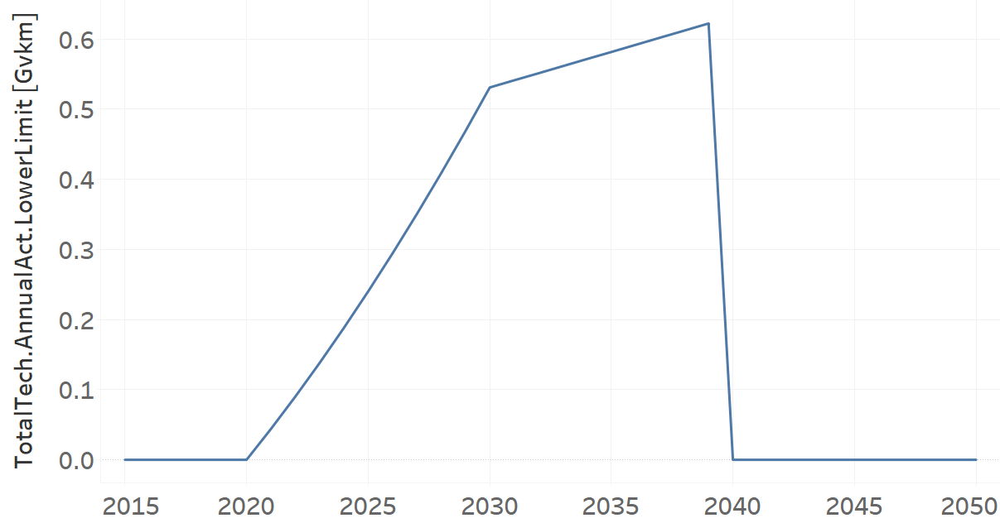

TRYTKLPG02: Trucks LPG (new)
=====================================

+-------------------------------------------------+-------+--------------+--------------+--------------+--------------+
| .. figure:: img/TRYTKLPG.jpg                                                                                        |
|    :align:   center                                                                                                 |
|    :width:   500 px                                                                                                 |
+-------------------------------------------------+-------+--------------+--------------+--------------+--------------+
| Set codification:                                       |TRYTKLPG02                                                 |
+-------------------------------------------------+-------+--------------+--------------+--------------+--------------+
| Description:                                            |Trucks LPG (new)                                           |
+-------------------------------------------------+-------+--------------+--------------+--------------+--------------+
| Set:                                                    |Technology                                                 |
+-------------------------------------------------+-------+--------------+--------------+--------------+--------------+
| Parameter                                       | Unit  | 2020         | 2030         | 2040         |  2050        |
+=================================================+=======+==============+==============+==============+==============+
| CapitalCost[r,t,y]                              |M$/Gvkm| 3116         | 3116         | 3116         | 3116         |
+-------------------------------------------------+-------+--------------+--------------+--------------+--------------+
| DistanceDriven[r,t,y]                           |km/year| 44321        | 44321        | 44321        | 44321        |
+-------------------------------------------------+-------+--------------+--------------+--------------+--------------+
| EmissionActivityRatio[r,t,e,m,y] (Congestion)   |  -    | 0.16         | 0.16         | 0.16         | 0.16         |
+-------------------------------------------------+-------+--------------+--------------+--------------+--------------+
| EmissionActivityRatio[r,t,e,m,y] (Health)       |   -   | 0.03         | 0.03         | 0.03         | 0.03         |
+-------------------------------------------------+-------+--------------+--------------+--------------+--------------+
| FixedCost[r,t,y]                                |M$/Gvkm| 387.84       | 387.84       | 387.84       | 387.84       |
+-------------------------------------------------+-------+--------------+--------------+--------------+--------------+
| InputActivityRatio[r,t,f,m,y] (LPG for          | PJ/   | 8.84         | 8.84         | 8.84         | 8.84         |
| heavy freight transport)                        | Gvkm  |              |              |              |              |
+-------------------------------------------------+-------+--------------+--------------+--------------+--------------+
| OperationalLife[r,t]                            | Years | 10           | 10           | 10           | 10           |
+-------------------------------------------------+-------+--------------+--------------+--------------+--------------+
| OutputActivityRatio[r,t,f,m,y] (FHF_Trucks)     | PJ/   | 1            | 1            | 1            | 1            |
|                                                 | Gvkm  |              |              |              |              |
+-------------------------------------------------+-------+--------------+--------------+--------------+--------------+
| TotalAnnualMaxCapacity[r,t,y] (BAU)             | Gvkm  | 0            | 99999        | 99999        | 99999        |
+-------------------------------------------------+-------+--------------+--------------+--------------+--------------+
| TotalAnnualMaxCapacity[r,t,y] (NDP)             | Gvkm  | 0            | 0.531        | 0.6325       | 0.7338       |
+-------------------------------------------------+-------+--------------+--------------+--------------+--------------+
| TotalTechnologyAnnualActivityLowerLimit[r,t,y]  | Gvkm  | 0            | 0.531        | 0            | 0            |
| (NDP)                                           |       |              |              |              |              |
+-------------------------------------------------+-------+--------------+--------------+--------------+--------------+
| UnitCapitalCost[r,t,y]                          |   $   | 138104.236   | 138104.236   | 138104.236   | 138104.236   |
+-------------------------------------------------+-------+--------------+--------------+--------------+--------------+
| UnitFixedCost[r,t,y]                            |   $   | 17189.4566   | 17189.4566   | 17189.4566   | 17189.4566   |
+-------------------------------------------------+-------+--------------+--------------+--------------+--------------+

CapitalCost[r,t,y]
+++++++++
The equation (1) shows the Capital Cost for TRYTKLPG02, for every scenario.

CapitalCost=3116 [M$/Gvkm]   (1)

DistanceDriven[r,t,y]
+++++++++
The equation (2) shows the Distance Driven for TRYTKLPG02, for every scenario.

DistanceDriven=44321 [km/year]   (2)

EmissionActivityRatio[r,t,e,m,y]
+++++++++
The equation (3) shows the Emission Activity Ratio for TRYTKLPG02, for every scenario and associated to the emission Congestion.

EmissionActivityRatio=0.16    (3)

The equation (4) shows the Emission Activity Ratio for TRYTKLPG02, for every scenario and associated to the emission Health.

EmissionActivityRatio=0.03    (4)

FixedCost[r,t,y]
+++++++++
The equation (5) shows the Fixed Cost for TRYTKLPG02, for every scenario.

FixedCost=387.84 [M$/Gvkm]   (5)
   
InputActivityRatio[r,t,f,m,y]
+++++++++
The equation (6) shows the Input Activity Ratio for TRYTKLPG02, for every scenario and associated to the fuel LPG for heavy freight transport. 

InputActivityRatio=8.84 [PJ/Gvkm]   (6)

OperationalLife[r,t]
+++++++++
The equation (7) shows the Operational Life for TRYTKLPG02, for every scenario.

OperationalLife=10 Years   (7)

OutputActivityRatio[r,t,f,m,y]
+++++++++
The equation (8) shows the Output Activity Ratio for TRYTKLPG02, for every scenario and associated to the fuel FHF_Trucks.

OutputActivityRatio=1 [PJ/Gvkm]   (8)
  
TotalAnnualMaxCapacity[r,t,y]
+++++++++
The figure 1 shows the Total Annual Max Capacity for TRYTKLPG02, for the BAU scenario.

.. figure:: img/TRYTKLPG02_TotalAnnualMaxCapacity_BAU.png
   :align:   center
   :width:   700 px
   
   *Figure 1) Total Annual Max Capacity for TRYTKLPG02 for the BAU scenario.*
   
The figure 2 shows the Total Annual Max Capacity for TRYTKLPG02, for the NDP scenario.

.. figure:: img/TRYTKLPG02_TotalAnnualMaxCapacity_NDP.png
   :align:   center
   :width:   700 px
   
   *Figure 2) Total Annual Max Capacity for TRYTKLPG02 for the NDP scenario.
   
   
TotalTechnologyAnnualActivityLowerLimit[r,t,y]
+++++++++

The figure 3 shows the Total Technology Annual Activity Lower Limit for TRYTKLPG02, for the NDP scenario.

   
   *Figure 3) Total Technology Annual Activity Lower Limit for TRYTKLPG02 for the NDP scenario.*
      
UnitCapitalCost[r,t,y]
+++++++++
The equation (9) shows the Unit Capital Cost for TRYTKLPG02, for every scenario.

UnitCapitalCost=138104.236 [$]   (9)
   
UnitFixedCost[r,t,y]
+++++++++
The equation (10) shows the Unit Fixed Cost for TRYTKLPG02, for every scenario.

UnitFixedCost=17189.4566 [$]   (10)
