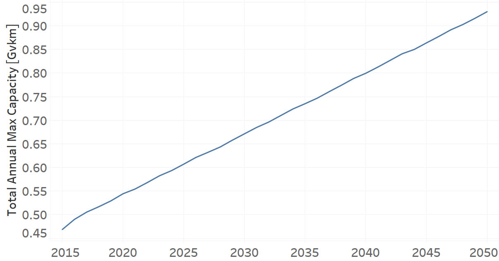
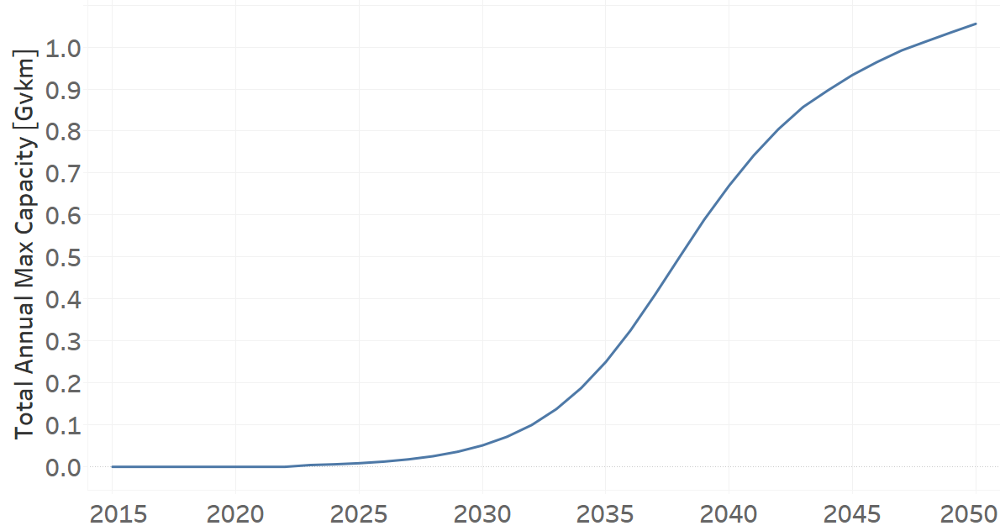
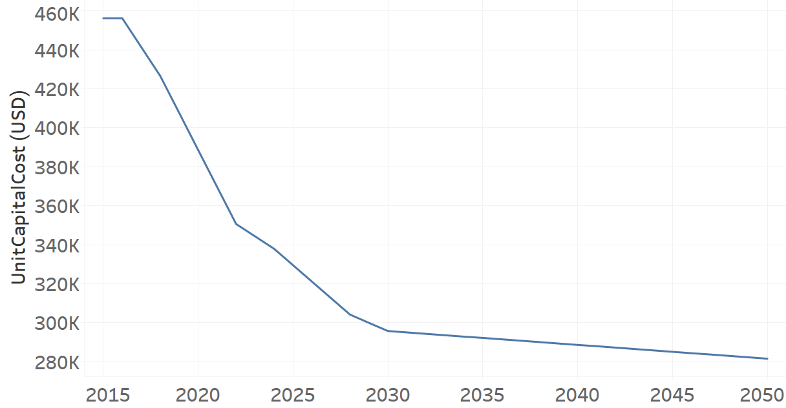
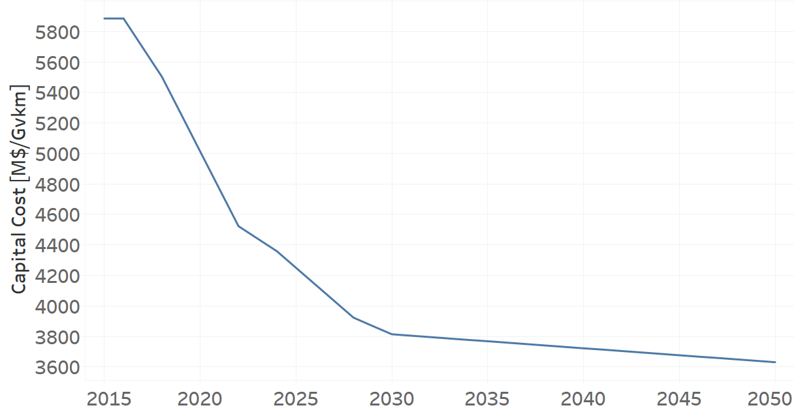
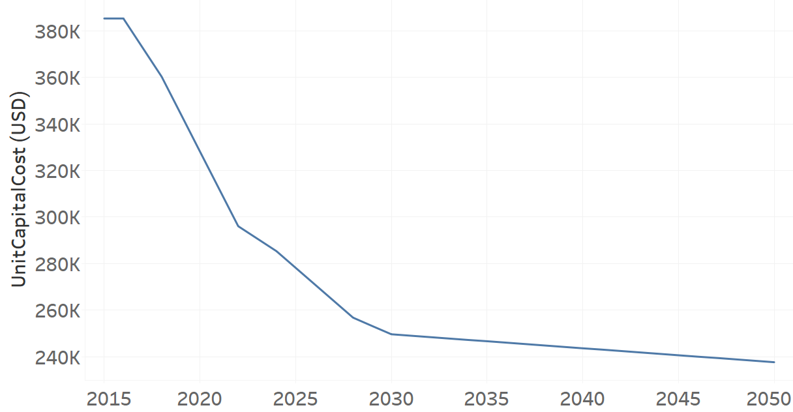

Buses
==================================

Techs_Buses: Bus (Grouping Technology)
++++++++++

+-------------------------------------------------+-------+--------------+--------------+--------------+--------------+
| .. figure:: img/Techs_Bus.jpg                                                                                       |
|    :align:   center                                                                                                 |
|    :width:   500 px                                                                                                 |
+-------------------------------------------------+-------+--------------+--------------+--------------+--------------+
| Set codification:                                       |Techs_Bus                                                  |
+-------------------------------------------------+-------+--------------+--------------+--------------+--------------+
| Description:                                            |Bus                                                        |
+-------------------------------------------------+-------+--------------+--------------+--------------+--------------+
| Set:                                                    |Technology                                                 |
+-------------------------------------------------+-------+--------------+--------------+--------------+--------------+
| Parameter                                       | Unit  | 2020         | 2030         | 2040         |  2050        |
+=================================================+=======+==============+==============+==============+==============+
| DistanceDriven[r,t,y]                           |km/year| 65460        | 65460        | 65460        | 65460        |
+-------------------------------------------------+-------+--------------+--------------+--------------+--------------+
| InputActivityRatio[r,t,f,m,y] (Public           | Gpkm/ | 1            | 1            | 1            | 1            |
| Transport in Buses)                             | Gvkm  |              |              |              |              |
+-------------------------------------------------+-------+--------------+--------------+--------------+--------------+
| OperationalLife[r,t]                            | Years | 1            | 1            | 1            | 1            |
+-------------------------------------------------+-------+--------------+--------------+--------------+--------------+
| OutputActivityRatio[r,t,f,m,y] (Transport Demand| Gpkm/ | 25.66        | 25.66        | 25.66        | 25.66        |
| Passenger Public)                               | Gvkm  |              |              |              |              |
+-------------------------------------------------+-------+--------------+--------------+--------------+--------------+
| TotalAnnualMaxCapacity[r,t,y] (BAU)             | Gvkm  | 0.5444       | 0.6712       | 0.7994       | 0.9298       |
+-------------------------------------------------+-------+--------------+--------------+--------------+--------------+
| TotalAnnualMaxCapacity[r,t,y] (NDP)             | Gvkm  | 0.5444       | 0.6829       | 1.0431       | 1.2542       |
+-------------------------------------------------+-------+--------------+--------------+--------------+--------------+
| TotalTechnologyAnnualActivityLowerLimit[r,t,y]  | Gvkm  | 0.5433       | 0.6699       | 0.7978       | 0.9279       |
| (BAU)                                           |       |              |              |              |              |
+-------------------------------------------------+-------+--------------+--------------+--------------+--------------+
| TotalTechnologyAnnualActivityLowerLimit[r,t,y]  | Gvkm  | 0.5433       | 0.6816       | 1.041        | 1.2517       |
| (NDP)                                           |       |              |              |              |              |
+-------------------------------------------------+-------+--------------+--------------+--------------+--------------+

DistanceDriven[r,t,y]
----------
The equation (1) shows the Distance Driven for Techs_Bus, for every scenario.

DistanceDriven=65460 [km/year]   (1)

Source:
   This is the source. 
   
Description: 
   This is the description. 
   
InputActivityRatio[r,t,f,m,y]
----------
The equation (2) shows the Input Activity Ratio for Techs_Bus, for every scenario and associated to the fuel Public Transport in Bus.

InputActivityRatio=1 [Gpkm/Gvkm]   (2)

Source:
   This is the source. 
   
Description: 
   This is the description. 
   
OperationalLife[r,t]
----------
The equation (3) shows the Operational Life for Techs_Bus, for every scenario.

OperationalLife=1 Years   (3)

Source:
   This is the source. 
   
Description: 
   This is the description.   
   
OutputActivityRatio[r,t,f,m,y]
----------
The equation (4) shows the Output Activity Ratio for Techs_Bus, for every scenario and associated to the fuel Transport Demand Passenger Public.

OutputActivityRatio=25.66 [Gpkm/Gvkm]   (4)

Source:
   This is the source. 
   
Description: 
   This is the description. 
   
TotalAnnualMaxCapacity[r,t,y]
----------
The figure 1 shows the Total Annual Max Capacity for Techs_Bus, for the BAU scenario.

   
   *Figure 1) Total Annual Max Capacity for Techs_Bus for the BAU scenario.*
   
The figure 2 shows the Total Annual Max Capacity for Techs_Bus, for the NDP scenario.

.. figure:: img/Techs_Bus_TotalAnnualMaxCapacity_NDP_OP15C.png
   :align:   center
   :width:   700 px
   
   *Figure 2) Total Annual Max Capacity for Techs_Bus for the NDP scenario.*

Source:
   This is the source. 
   
Description: 
   This is the description.
   
TotalTechnologyAnnualActivityLowerLimit[r,t,y]
----------
The figure 3 shows the Total Technology Annual Activity Lower Limit for Techs_Bus, for the BAU scenario.

.. figure:: img/Techs_Bus_TotalTechnologyAnnualActivityLowerLimit_BAU.png
   :align:   center
   :width:   700 px
   
   *Figure 3) Total Technology Annual Activity Lower Limit for Techs_Bus for the BAU scenario.*
   
The figure 4 shows the Total Technology Annual Activity Lower Limit for Techs_Bus, for the NDP scenario.

   
   *Figure 4) Total Technology Annual Activity Lower Limit for Techs_Bus for the NDP scenario.*

Source:
   This is the source. 
   
Description: 
   This is the description.

TRBUSDSL01: Bus Diesel (existing)
++++++++

+-------------------------------------------------+-------+--------------+--------------+--------------+--------------+
| .. figure:: img/TRBUSDSL.png                                                                                        |
|    :align:   center                                                                                                 |
|    :width:   500 px                                                                                                 |
+-------------------------------------------------+-------+--------------+--------------+--------------+--------------+
| Set codification:                                       |TRBUSDSL01                                                 |
+-------------------------------------------------+-------+--------------+--------------+--------------+--------------+
| Description:                                            |Bus Diesel (existing)                                      |
+-------------------------------------------------+-------+--------------+--------------+--------------+--------------+
| Set:                                                    |Technology                                                 |
+-------------------------------------------------+-------+--------------+--------------+--------------+--------------+
| Parameter                                       | Unit  | 2020         | 2030         | 2040         |  2050        |
+=================================================+=======+==============+==============+==============+==============+
| DistanceDriven[r,t,y]                           |km/year| 65460        | 65460        | 65460        | 65460        |
+-------------------------------------------------+-------+--------------+--------------+--------------+--------------+
| EmissionActivityRatio[r,t,e,m,y] (Accidents)    |   -   | 0.1          | 0.1          | 0.1          | 0.1          |
+-------------------------------------------------+-------+--------------+--------------+--------------+--------------+
| EmissionActivityRatio[r,t,e,m,y] (Congestion)   |   -   | 0.16         | 0.16         | 0.16         | 0.16         |
+-------------------------------------------------+-------+--------------+--------------+--------------+--------------+
| EmissionActivityRatio[r,t,e,m,y] (Health)       |   -   | 0.06         | 0.06         | 0.06         | 0.06         |
+-------------------------------------------------+-------+--------------+--------------+--------------+--------------+
| FixedCost[r,t,y]                                |M$/Gvkm| 171.78       | 171.78       | 171.78       | 171.78       |
+-------------------------------------------------+-------+--------------+--------------+--------------+--------------+
| InputActivityRatio[r,t,f,m,y] (Diesel for       | PJ/   | 8.62         | 8.62         | 8.62         | 8.62         |
| public transport)                               | Gvkm  |              |              |              |              |
+-------------------------------------------------+-------+--------------+--------------+--------------+--------------+
| OperationalLife[r,t]                            | Years | 15           | 15           | 15           | 15           |
+-------------------------------------------------+-------+--------------+--------------+--------------+--------------+
| OutputActivityRatio[r,t,f,m,y] (Public Transport| PJ/   | 1            | 1            | 1            | 1            |
| in Buses)                                       | Gvkm  |              |              |              |              |
+-------------------------------------------------+-------+--------------+--------------+--------------+--------------+
| ResidualCapacity[r,t,y] (BAU)                   |  Gvkm | 0.4083       | 0.1678       | 0            | 0            |
+-------------------------------------------------+-------+--------------+--------------+--------------+--------------+
| ResidualCapacity[r,t,y] (NDP)                   |  Gvkm | 0.4083       | 0.2044       | 0            | 0            |
+-------------------------------------------------+-------+--------------+--------------+--------------+--------------+
| TotalAnnualMaxCapacity[r,t,y] (BAU)             |  Gvkm | 0.4083       | 0.1678       | 0            | 0            |
+-------------------------------------------------+-------+--------------+--------------+--------------+--------------+
| TotalAnnualMaxCapacity[r,t,y] (NDP)             |  Gvkm | 0.4083       | 0.2044       | 0            | 0            |
+-------------------------------------------------+-------+--------------+--------------+--------------+--------------+
| TotalTechnologyAnnualActivityLowerLimit[r,t,y]  | Gvkm  | 0.4074       | 0.1674       | 0            | 0            |
| (BAU)                                           |       |              |              |              |              |
+-------------------------------------------------+-------+--------------+--------------+--------------+--------------+
| TotalTechnologyAnnualActivityLowerLimit[r,t,y]  | Gvkm  | 0.4074       | 0.204        | 0            | 0            |
| (NDP)                                           |       |              |              |              |              |
+-------------------------------------------------+-------+--------------+--------------+--------------+--------------+
| UnitFixedCost[r,t,y]                            |   $   | 11244.7188   | 11244.7188   | 11244.7188   | 11244.7188   |
+-------------------------------------------------+-------+--------------+--------------+--------------+--------------+

DistanceDriven[r,t,y]
---------
The equation (1) shows the Distance Driven for TRBUSDSL01, for every scenario.

DistanceDriven=65460 [km/year]   (1)

Source:
   This is the source. 
   
Description: 
   This is the description.

EmissionActivityRatio[r,t,e,m,y]
---------
The equation (2) shows the Emission Activity Ratio for TRBUSDSL01, for every scenario and associated to the emission Accidents.

EmissionActivityRatio=0.1    (2)

The equation (3) shows the Emission Activity Ratio for TRBUSDSL01, for every scenario and associated to the emission Congestion.

EmissionActivityRatio=0.16    (3)

The equation (4) shows the Emission Activity Ratio for TRBUSDSL01, for every scenario and associated to the emission Health.

EmissionActivityRatio=0.06    (4)

Source:
   This is the source. 
   
Description: 
   This is the description.

FixedCost[r,t,y]
---------
The equation (5) shows the Fixed Cost for TRBUSDSL01, for every scenario.

FixedCost=171.78 [M$/Gvkm]   (5)

Source:
   This is the source. 
   
Description: 
   This is the description.
   
InputActivityRatio[r,t,f,m,y]
---------
The equation (6) shows the Input Activity Ratio for TRBUSDSL01, for every scenario and associated to the fuel Diesel for public transport. 

InputActivityRatio=8.62 [PJ/Gvkm]   (6)

Source:
   This is the source. 
   
Description: 
   This is the description.   
   
OperationalLife[r,t]
---------
The equation (7) shows the Operational Life for TRBUSDSL01, for every scenario.

OperationalLife=15 Years   (7)

Source:
   This is the source. 
   
Description: 
   This is the description.   
   
OutputActivityRatio[r,t,f,m,y]
---------
The equation (8) shows the Output Activity Ratio for TRBUSDSL01, for every scenario and associated to the fuel Public Transport in Buses.

OutputActivityRatio=1 [PJ/Gvkm]   (8)

Source:
   This is the source. 
   
Description: 
   This is the description.      
   
ResidualCapacity[r,t,y]
---------
The figure 1 shows the Residual Capacity for TRBUSDSL01, for the BAU scenario.

   
   *Figure 1) Residual Capacity for TRBUSDSL01 for the BAU scenario.*
   
The figure 2 shows the Residual Capacity for TRBUSDSL01, for the NDP scenario.

.. figure:: img/TRBUSDSL01_ResidualCapacity_NDP_OP.png
   :align:   center
   :width:   700 px
   
   *Figure 2) Residual Capacity for TRBUSDSL01 for the NDP scenario.*

Source:
   This is the source. 
   
Description: 
   This is the description.         
   
TotalAnnualMaxCapacity[r,t,y]
---------
The figure 3 shows the Total Annual Max Capacity for TRBUSDSL01, for the BAU scenario.

   
   *Figure 3) Total Annual Max Capacity for TRBUSDSL01 for the BAU scenario.*
   
The figure 4 shows the Total Annual Max Capacity for TRBUSDSL01, for the NDP scenario.

   
   *Figure 4) Total Annual Max Capacity for TRBUSDSL01 for the NDP scenario.*

Source:
   This is the source. 
   
Description: 
   This is the description.
   
TotalTechnologyAnnualActivityLowerLimit[r,t,y]
---------
The figure 5 shows the Total Technology Annual Activity Lower Limit for TRBUSDSL01, for the BAU scenario.

.. figure:: img/TRBUSDSL01_TotalTechnologyAnnualActivityLowerLimit_BAU.png
   :align:   center
   :width:   700 px
   
   *Figure 5) Total Technology Annual Activity Lower Limit for TRBUSDSL01 for the BAU scenario.*
   
The figure 6 shows the Total Technology Annual Activity Lower Limit for TRBUSDSL01, for the NDP scenario.

.. figure:: img/TRBUSDSL01_TotalTechnologyAnnualActivityLowerLimit_NDP_OP.png
   :align:   center
   :width:   700 px
   
   *Figure 6) Total Technology Annual Activity Lower Limit for TRBUSDSL01 for the NDP scenario.*

Source:
   This is the source. 
   
Description: 
   This is the description.
   
UnitFixedCost[r,t,y]
---------
The equation (9) shows the Unit Fixed Cost for TRBUSDSL01, for every scenario.

UnitFixedCost=11244.7188 [$]   (9)

Source:
   This is the source. 
   
Description: 
   This is the description.

TRBUSDSL02: Bus Diesel (new)
++++++++

+-------------------------------------------------+-------+--------------+--------------+--------------+--------------+
| .. figure:: img/TRBUSDSL.png                                                                                        |
|    :align:   center                                                                                                 |
|    :width:   500 px                                                                                                 |
+-------------------------------------------------+-------+--------------+--------------+--------------+--------------+
| Set codification:                                       |TRBUSDSL02                                                 |
+-------------------------------------------------+-------+--------------+--------------+--------------+--------------+
| Description:                                            |Bus Diesel (new)                                           |
+-------------------------------------------------+-------+--------------+--------------+--------------+--------------+
| Set:                                                    |Technology                                                 |
+-------------------------------------------------+-------+--------------+--------------+--------------+--------------+
| Parameter                                       | Unit  | 2020         | 2030         | 2040         |  2050        |
+=================================================+=======+==============+==============+==============+==============+
| CapitalCost[r,t,y]                              |M$/Gvkm| 3399         | 3399         | 3399         | 3399         |
+-------------------------------------------------+-------+--------------+--------------+--------------+--------------+
| DistanceDriven[r,t,y]                           |km/year| 65460        | 65460        | 65460        | 65460        |
+-------------------------------------------------+-------+--------------+--------------+--------------+--------------+
| EmissionActivityRatio[r,t,e,m,y] (Accidents)    |   -   | 0.1          | 0.1          | 0.1          | 0.1          |
+-------------------------------------------------+-------+--------------+--------------+--------------+--------------+
| EmissionActivityRatio[r,t,e,m,y] (Congestion)   |  -    | 0.16         | 0.16         | 0.16         | 0.16         |
+-------------------------------------------------+-------+--------------+--------------+--------------+--------------+
| EmissionActivityRatio[r,t,e,m,y] (Health)       |   -   | 0.06         | 0.06         | 0.06         | 0.06         |
+-------------------------------------------------+-------+--------------+--------------+--------------+--------------+
| FixedCost[r,t,y]                                |M$/Gvkm| 171.78       | 171.78       | 171.78       | 171.78       |
+-------------------------------------------------+-------+--------------+--------------+--------------+--------------+
| InputActivityRatio[r,t,f,m,y] (Diesel for       | PJ/   | 7.61         | 7.61         | 7.61         | 7.61         |
| public transport)                               | Gvkm  |              |              |              |              |
+-------------------------------------------------+-------+--------------+--------------+--------------+--------------+
| OperationalLife[r,t]                            | Years | 15           | 15           | 15           | 15           |
+-------------------------------------------------+-------+--------------+--------------+--------------+--------------+
| OutputActivityRatio[r,t,f,m,y] (Public Transport| PJ/   | 1            | 1            | 1            | 1            |
| in Buses)                                       | Gvkm  |              |              |              |              |
+-------------------------------------------------+-------+--------------+--------------+--------------+--------------+
| TotalTechnologyAnnualActivityLowerLimit[r,t,y]  | Gvkm  | 0.1358       | 0.5024       | 0.7978       | 0.9279       |
| (BAU)                                           |       |              |              |              |              |
+-------------------------------------------------+-------+--------------+--------------+--------------+--------------+
| TotalTechnologyAnnualActivityLowerLimit[r,t,y]  | Gvkm  | 0.1358       | 0            | 0            | 0            |
| (NDP)                                           |       |              |              |              |              |
+-------------------------------------------------+-------+--------------+--------------+--------------+--------------+
| UnitCapitalCost[r,t,y]                          |   $   | 222498.54    | 222498.54    | 222498.54    | 222498.54    |
+-------------------------------------------------+-------+--------------+--------------+--------------+--------------+
| UnitFixedCost[r,t,y]                            |   $   | 11244.7188   | 11244.7188   | 11244.7188   | 11244.7188   |
+-------------------------------------------------+-------+--------------+--------------+--------------+--------------+

CapitalCost[r,t,y]
--------
The equation (1) shows the Capital Cost for TRBUSDSL02, for every scenario.

CapitalCost=3399 [M$/Gvkm]   (1)

Source:
   This is the source. 
   
Description: 
   This is the description. 

DistanceDriven[r,t,y]
--------
The equation (2) shows the Distance Driven for TRBUSDSL02, for every scenario.

DistanceDriven=65460 [km/year]   (2)

Source:
   This is the source. 
   
Description: 
   This is the description.

EmissionActivityRatio[r,t,e,m,y]
--------
The equation (3) shows the Emission Activity Ratio for TRBUSDSL02, for every scenario and associated to the emission Accidents.

EmissionActivityRatio=0.1    (3)

The equation (4) shows the Emission Activity Ratio for TRBUSDSL02, for every scenario and associated to the emission Congestion.

EmissionActivityRatio=0.16    (4)

The equation (5) shows the Emission Activity Ratio for TRBUSDSL02, for every scenario and associated to the emission Health.

EmissionActivityRatio=0.06    (5)

Source:
   This is the source. 
   
Description: 
   This is the description.

FixedCost[r,t,y]
--------
The equation (6) shows the Fixed Cost for TRBUSDSL02, for every scenario.

FixedCost=171.78 [M$/Gvkm]   (6)

Source:
   This is the source. 
   
Description: 
   This is the description.
   
InputActivityRatio[r,t,f,m,y]
--------
The equation (7) shows the Input Activity Ratio for TRBUSDSL02, for every scenario and associated to the fuel Diesel for public transport. 

InputActivityRatio=7.61 [PJ/Gvkm]   (7)

Source:
   This is the source. 
   
Description: 
   This is the description.   
   
OperationalLife[r,t]
--------
The equation (8) shows the Operational Life for TRBUSDSL02, for every scenario.

OperationalLife=15 Years   (8)

Source:
   This is the source. 
   
Description: 
   This is the description.   
   
OutputActivityRatio[r,t,f,m,y]
--------
The equation (9) shows the Output Activity Ratio for TRBUSDSL02, for every scenario and associated to the fuel Public Transport in Buses.

OutputActivityRatio=1 [PJ/Gvkm]   (9)

Source:
   This is the source. 
   
Description: 
   This is the description.      
   
TotalTechnologyAnnualActivityLowerLimit[r,t,y]
--------
The figure 1 shows the Total Technology Annual Activity Lower Limit for TRBUSDSL02, for the BAU scenario.

   
   *Figure 1) Total Technology Annual Activity Lower Limit for TRBUSDSL02 for the BAU scenario.*
   
The figure 2 shows the Total Technology Annual Activity Lower Limit for TRBUSDSL02, for the NDP scenario.

   
   *Figure 2) Total Technology Annual Activity Lower Limit for TRBUSDSL02 for the NDP scenario.*

Source:
   This is the source. 
   
Description: 
   This is the description.
   
UnitCapitalCost[r,t,y]
--------
The equation (10) shows the Unit Capital Cost for TRBUSDSL02, for every scenario.

UnitCapitalCost=222495.54 [$]   (10)

Source:
   This is the source. 
   
Description: 
   This is the description.
   
   
UnitFixedCost[r,t,y]
--------
The equation (11) shows the Unit Fixed Cost for TRBUSDSL02, for every scenario.

UnitFixedCost=11244.7188 [$]   (11)

Source:
   This is the source. 
   
Description: 
   This is the description.
   
TRBUSELC02: Bus Electric (new)
+++++++++

+-------------------------------------------------+-------+--------------+--------------+--------------+--------------+
| .. figure:: img/TRBUSELC.jpg                                                                                        |
|    :align:   center                                                                                                 |
|    :width:   500 px                                                                                                 |
+-------------------------------------------------+-------+--------------+--------------+--------------+--------------+
| Set codification:                                       |TRBUSELC02                                                 |
+-------------------------------------------------+-------+--------------+--------------+--------------+--------------+
| Description:                                            |Bus Electric (new)                                         |
+-------------------------------------------------+-------+--------------+--------------+--------------+--------------+
| Set:                                                    |Technology                                                 |
+-------------------------------------------------+-------+--------------+--------------+--------------+--------------+
| Parameter                                       | Unit  | 2020         | 2030         | 2040         |  2050        |
+=================================================+=======+==============+==============+==============+==============+
| CapitalCost[r,t,y]                              |M$/Gvkm| 5936         | 4517         | 4408         | 4300         |
+-------------------------------------------------+-------+--------------+--------------+--------------+--------------+
| DistanceDriven[r,t,y]                           |km/year| 65460        | 65460        | 65460        | 65460        |
+-------------------------------------------------+-------+--------------+--------------+--------------+--------------+
| EmissionActivityRatio[r,t,e,m,y] (Accidents)    |  -    | 0.1          | 0.1          | 0.1          | 0.1          |
+-------------------------------------------------+-------+--------------+--------------+--------------+--------------+
| EmissionActivityRatio[r,t,e,m,y] (Congestion)   | -     | 0.16         | 0.16         | 0.16         | 0.16         |
+-------------------------------------------------+-------+--------------+--------------+--------------+--------------+
| FixedCost[r,t,y]                                |M$/Gvkm| 56.6874      | 56.6874      | 56.6874      | 56.6874      |
+-------------------------------------------------+-------+--------------+--------------+--------------+--------------+
| InputActivityRatio[r,t,f,m,y] (Electricity for  | PJ/   | 4.79         | 4.79         | 4.79         | 4.79         |
| public transport)                               | Gvkm  |              |              |              |              |
+-------------------------------------------------+-------+--------------+--------------+--------------+--------------+
| OperationalLife[r,t]                            | Years | 12           | 12           | 12           | 12           |
+-------------------------------------------------+-------+--------------+--------------+--------------+--------------+
| OutputActivityRatio[r,t,f,m,y] (Public Transport| PJ/   | 1            | 1            | 1            | 1            |
| in Buses)                                       | Gvkm  |              |              |              |              |
+-------------------------------------------------+-------+--------------+--------------+--------------+--------------+
| TotalAnnualMaxCapacity[r,t,y] (BAU)             |  Gvkm | 0            | 99999        | 99999        | 99999        |
+-------------------------------------------------+-------+--------------+--------------+--------------+--------------+
| TotalAnnualMaxCapacity[r,t,y] (NDP)             |  Gvkm | 0            | 0.051        | 0.6698       | 1.0554       |
+-------------------------------------------------+-------+--------------+--------------+--------------+--------------+
| TotalTechnologyAnnualActivityLowerLimit[r,t,y]  | Gvkm  | 0            | 0.0509       | 0.6684       | 1.0533       |
| (NDP)                                           |       |              |              |              |              |
+-------------------------------------------------+-------+--------------+--------------+--------------+--------------+
| UnitCapitalCost[r,t,y]                          |   $   | 388570.56    | 295682.82    | 288547.68    | 281478       |
+-------------------------------------------------+-------+--------------+--------------+--------------+--------------+
| UnitFixedCost[r,t,y]                            |   $   | 3710.7572    | 3710.7572    | 3710.7572    | 3710.7572    |
+-------------------------------------------------+-------+--------------+--------------+--------------+--------------+

CapitalCost[r,t,y]
---------

The figure 1 shows the Capital Cost for TRBUSELC02, for every scenario.

.. figure:: img/TRBUSELC02_CapitalCost.png
   :align:   center
   :width:   700 px
   
   *Figure 1) Capital Cost for TRBUSELC02 for every scenario.*
   
Source:
   This is the source. 
   
Description: 
   This is the description. 

DistanceDriven[r,t,y]
---------
The equation (1) shows the Distance Driven for TRBUSELC02, for every scenario.

DistanceDriven=65460 [km/year]   (1)

Source:
   This is the source. 
   
Description: 
   This is the description.

EmissionActivityRatio[r,t,e,m,y]
---------
The equation (2) shows the Emission Activity Ratio for TRBUSELC02, for every scenario and associated to the emission Accidents.

EmissionActivityRatio=0.1    (2)

The equation (3) shows the Emission Activity Ratio for TRBUSELC02, for every scenario and associated to the emission Congestion.

EmissionActivityRatio=0.16    (3)

Source:
   This is the source. 
   
Description: 
   This is the description.

FixedCost[r,t,y]
---------
The equation (4) shows the Fixed Cost for TRBUSELC02, for every scenario.

FixedCost=56.6874 [M$/Gvkm]   (4)

Source:
   This is the source. 
   
Description: 
   This is the description.
   
InputActivityRatio[r,t,f,m,y]
---------
The equation (5) shows the Input Activity Ratio for TRBUSELC02, for every scenario and associated to the fuel Electricity for public transport. 

InputActivityRatio=4.79 [PJ/Gvkm]   (5)

Source:
   This is the source. 
   
Description: 
   This is the description.   
   
OperationalLife[r,t]
---------
The equation (6) shows the Operational Life for TRBUSELC02, for every scenario.

OperationalLife=12 Years   (6)

Source:
   This is the source. 
   
Description: 
   This is the description.   
   
OutputActivityRatio[r,t,f,m,y]
---------
The equation (7) shows the Output Activity Ratio for TRBUSELC02, for every scenario and associated to the fuel Public Transport in Buses.

OutputActivityRatio=1 [PJ/Gvkm]   (7)

Source:
   This is the source. 
   
Description: 
   This is the description.
   
TotalAnnualMaxCapacity[r,t,y]
---------
The figure 2 shows the Total Annual Max Capacity for TRBUSELC02, for the BAU scenario.

.. figure:: img/TRBUSELC02_TotalAnnualMaxCapacity_BAU.png
   :align:   center
   :width:   700 px
   
   *Figure 2) Total Annual Max Capacity for TRBUSELC02 for the BAU scenario.*
   
The figure 3 shows the Total Annual Max Capacity for TRBUSELC02, for the NDP scenario.

   
   *Figure 3) Total Annual Max Capacity for TRBUSELC02 for the NDP scenario.*

Source:
   This is the source. 
   
Description: 
   This is the description.   
   
TotalTechnologyAnnualActivityLowerLimit[r,t,y]
---------
The figure 4 shows the Total Technology Annual Activity Lower Limit for TRBUSELC02, for the NDP scenario.

.. figure:: img/TRBUSELC02_TotalTechnologyAnnualActivityLowerLimit_NDP_OP.png
   :align:   center
   :width:   700 px
   
   *Figure 4) Total Technology Annual Activity Lower Limit for TRBUSELC02 for the NDP scenario.*

Source:
   This is the source. 
   
Description: 
   This is the description.
   
UnitCapitalCost[r,t,y]
---------
The figure 5 shows the Unit Capital Cost for TRBUSELC02, for every scenario.

   
   *Figure 5) Unit Capital Cost for TRBUSELC02 for every scenario.*
Source:
   This is the source. 
   
Description: 
   This is the description.
   
   
UnitFixedCost[r,t,y]
---------
The equation (8) shows the Unit Fixed Cost for TRBUSELC02, for every scenario.

UnitFixedCost=3710.7572 [$]   (8)

Source:
   This is the source. 
   
Description: 
   This is the description.

TRBUSHYBD02: Bus Hybrid Electric-Diesel (new)
+++++++++

+-------------------------------------------------+-------+--------------+--------------+--------------+--------------+
| .. figure:: img/TRBUSHYBD.jpg                                                                                       |
|    :align:   center                                                                                                 |
|    :width:   500 px                                                                                                 |
+-------------------------------------------------+-------+--------------+--------------+--------------+--------------+
| Set codification:                                       |TRBUSHYBD02                                                |
+-------------------------------------------------+-------+--------------+--------------+--------------+--------------+
| Description:                                            |Bus Hybrid Electric-Diesel (new)                           |
+-------------------------------------------------+-------+--------------+--------------+--------------+--------------+
| Set:                                                    |Technology                                                 |
+-------------------------------------------------+-------+--------------+--------------+--------------+--------------+
| Parameter                                       | Unit  | 2020         | 2030         | 2040         |  2050        |
+=================================================+=======+==============+==============+==============+==============+
| CapitalCost[r,t,y]                              |M$/Gvkm| 5012.67      | 3814.39      | 3722.35      | 3631.15      |
+-------------------------------------------------+-------+--------------+--------------+--------------+--------------+
| DistanceDriven[r,t,y]                           |km/year| 65460        | 65460        | 65460        | 65460        |
+-------------------------------------------------+-------+--------------+--------------+--------------+--------------+
| EmissionActivityRatio[r,t,e,m,y] (Accidents)    |  -    | 0.1          | 0.1          | 0.1          | 0.1          |
+-------------------------------------------------+-------+--------------+--------------+--------------+--------------+
| EmissionActivityRatio[r,t,e,m,y] (Congestion)   |  -    | 0.16         | 0.16         | 0.16         | 0.16         |
+-------------------------------------------------+-------+--------------+--------------+--------------+--------------+
| EmissionActivityRatio[r,t,e,m,y] (Health)       |  -    | 0.03         | 0.03         | 0.03         | 0.03         |
+-------------------------------------------------+-------+--------------+--------------+--------------+--------------+
| FixedCost[r,t,y]                                |M$/Gvkm| 85.89        | 85.89        | 85.89        | 85.89        |
+-------------------------------------------------+-------+--------------+--------------+--------------+--------------+
| InputActivityRatio[r,t,f,m,y] (Diesel for       | PJ/   | 2.91         | 2.91         | 2.91         | 2.91         |
| public transport)                               | Gvkm  |              |              |              |              |
+-------------------------------------------------+-------+--------------+--------------+--------------+--------------+
| InputActivityRatio[r,t,f,m,y] (Electricity for  | PJ/   | 2.91         | 2.91         | 2.91         | 2.91         |
| public transport)                               | Gvkm  |              |              |              |              |
+-------------------------------------------------+-------+--------------+--------------+--------------+--------------+
| OperationalLife[r,t]                            | Years | 12           | 12           | 12           | 12           |
+-------------------------------------------------+-------+--------------+--------------+--------------+--------------+
| OutputActivityRatio[r,t,f,m,y] (Public Transport| PJ/   | 1            | 1            | 1            | 1            |
| in Buses)                                       | Gvkm  |              |              |              |              |
+-------------------------------------------------+-------+--------------+--------------+--------------+--------------+
| TotalAnnualMaxCapacity[r,t,y]                   | Gvkm  | 0            | 99999        | 99999        | 99999        |
+-------------------------------------------------+-------+--------------+--------------+--------------+--------------+
| UnitCapitalCost[r,t,y]                          |   $   | 328129.3782  | 249689.9694  | 243665.031   | 237695.079   |
+-------------------------------------------------+-------+--------------+--------------+--------------+--------------+
| UnitFixedCost[r,t,y]                            |   $   | 5622.3594    | 5622.3594    | 5622.3594    | 5622.3594    |
+-------------------------------------------------+-------+--------------+--------------+--------------+--------------+

CapitalCost[r,t,y]
---------

The figure 1 shows the Capital Cost for TRBUSHYBD02, for every scenario.

   
   *Figure 1) Capital Cost for TRBUSHYBD02 for every scenario.*
   
Source:
   This is the source. 
   
Description: 
   This is the description. 

DistanceDriven[r,t,y]
---------
The equation (1) shows the Distance Driven for TRBUSHYBD02, for every scenario.

DistanceDriven=65460 [km/year]   (1)

Source:
   This is the source. 
   
Description: 
   This is the description.

EmissionActivityRatio[r,t,e,m,y]
---------
The equation (2) shows the Emission Activity Ratio for TRBUSHYBD02, for every scenario and associated to the emission Accidents.

EmissionActivityRatio=0.1    (2)

The equation (3) shows the Emission Activity Ratio for TRBUSHYBD02, for every scenario and associated to the emission Congestion.

EmissionActivityRatio=0.16    (3)

The equation (4) shows the Emission Activity Ratio for TRBUSHYBD02, for every scenario and associated to the emission Health.

EmissionActivityRatio=0.03    (4)

Source:
   This is the source. 
   
Description: 
   This is the description.

FixedCost[r,t,y]
---------
The equation (5) shows the Fixed Cost for TRBUSHYBD02, for every scenario.

FixedCost=85.89 [M$/Gvkm]   (5)

Source:
   This is the source. 
   
Description: 
   This is the description.
   
InputActivityRatio[r,t,f,m,y]
---------
The equation (6) shows the Input Activity Ratio for TRBUSHYBD02, for every scenario and associated to the fuel Electricity for public transport and Diesel for public transport. 

InputActivityRatio=4.79 [PJ/Gvkm]   (6)

Source:
   This is the source. 
   
Description: 
   This is the description.   
   
OperationalLife[r,t]
---------
The equation (7) shows the Operational Life for TRBUSHYBD02, for every scenario.

OperationalLife=12 Years   (7)

Source:
   This is the source. 
   
Description: 
   This is the description.   
   
OutputActivityRatio[r,t,f,m,y]
---------
The equation (8) shows the Output Activity Ratio for TRBUSHYBD02, for every scenario and associated to the fuel Public Transport in Buses.

OutputActivityRatio=1 [PJ/Gvkm]   (8)

Source:
   This is the source. 
   
Description: 
   This is the description.
   
TotalAnnualMaxCapacity[r,t,y]
---------
The figure 2 shows the Total Annual Max Capacity for TRBUSHYBD02, for every scenario.

.. figure:: img/TRBUSHYBD02_TotalAnnualMaxCapacity.png
   :align:   center
   :width:   700 px
   
   *Figure 2) Total Annual Max Capacity for TRBUSHYBD02 for every scenario.*

Source:
   This is the source. 
   
Description: 
   This is the description.   
   
UnitCapitalCost[r,t,y]
---------
The figure 3 shows the Unit Capital Cost for TRBUSHYBD02, for every scenario.

   
   *Figure 3) Unit Capital Cost for TRBUSHYBD02 for every scenario.*
Source:
   This is the source. 
   
Description: 
   This is the description.
   
UnitFixedCost[r,t,y]
---------
The equation (9) shows the Unit Fixed Cost for TRBUSHYBD02, for every scenario.

UnitFixedCost=3710.7572 [$]   (9)

Source:
   This is the source. 
   
Description: 
   This is the description.

TRBUSHYD02: Bus Hydrogen (new)
+++++++++

+-------------------------------------------------+-------+--------------+--------------+--------------+--------------+
| .. figure:: img/TRBUSHYD.jpg                                                                                        |
|    :align:   center                                                                                                 |
|    :width:   500 px                                                                                                 |
+-------------------------------------------------+-------+--------------+--------------+--------------+--------------+
| Set codification:                                       |TRBUSHYD02                                                 |
+-------------------------------------------------+-------+--------------+--------------+--------------+--------------+
| Description:                                            |Bus Hydrogen (new)                                         |
+-------------------------------------------------+-------+--------------+--------------+--------------+--------------+
| Set:                                                    |Technology                                                 |
+-------------------------------------------------+-------+--------------+--------------+--------------+--------------+
| Parameter                                       | Unit  | 2020         | 2030         | 2040         |  2050        |
+=================================================+=======+==============+==============+==============+==============+
| CapitalCost[r,t,y]                              |M$/Gvkm| 12588        | 11795        | 11001        | 10208        |
+-------------------------------------------------+-------+--------------+--------------+--------------+--------------+
| DistanceDriven[r,t,y]                           |km/year| 65460        | 65460        | 65460        | 65460        |
+-------------------------------------------------+-------+--------------+--------------+--------------+--------------+
| EmissionActivityRatio[r,t,e,m,y] (Accidents)    |  -    | 0.1          | 0.1          | 0.1          | 0.1          |
+-------------------------------------------------+-------+--------------+--------------+--------------+--------------+
| EmissionActivityRatio[r,t,e,m,y] (Congestion)   |  -    | 0.16         | 0.16         | 0.16         | 0.16         |
+-------------------------------------------------+-------+--------------+--------------+--------------+--------------+
| FixedCost[r,t,y]                                |M$/Gvkm| 56.6874      | 56.6874      | 56.6874      | 56.6874      |
+-------------------------------------------------+-------+--------------+--------------+--------------+--------------+
| InputActivityRatio[r,t,f,m,y] (Hydrogen for     | PJ/   | 5.45         | 5.45         | 5.45         | 5.45         |
| public transport)                               | Gvkm  |              |              |              |              |
+-------------------------------------------------+-------+--------------+--------------+--------------+--------------+
| OperationalLife[r,t]                            | Years | 12           | 12           | 12           | 12           |
+-------------------------------------------------+-------+--------------+--------------+--------------+--------------+
| OutputActivityRatio[r,t,f,m,y] (Public Transport| PJ/   | 1            | 1            | 1            | 1            |
| in Buses)                                       | Gvkm  |              |              |              |              |
+-------------------------------------------------+-------+--------------+--------------+--------------+--------------+
| TotalAnnualMaxCapacity[r,t,y]                   | Gvkm  | 0            | 99999        | 99999        | 99999        |
+-------------------------------------------------+-------+--------------+--------------+--------------+--------------+
| TotalTechnologyAnnualActivityLowerLimit[r,t,y]  | Gvkm  | 0            | 0.0045       | 0.0754       | 0.1239       |
| (NDP)                                           |       |              |              |              |              |
+-------------------------------------------------+-------+--------------+--------------+--------------+--------------+
| UnitCapitalCost[r,t,y]                          |   $   | 824010.48    | 772100.7     | 720125.46    | 668215.68    |
+-------------------------------------------------+-------+--------------+--------------+--------------+--------------+
| UnitFixedCost[r,t,y]                            |   $   | 3710.7572    | 3710.7572    | 3710.7572    | 3710.7572    |
+-------------------------------------------------+-------+--------------+--------------+--------------+--------------+

CapitalCost[r,t,y]
---------

The figure 1 shows the Capital Cost for TRBUSHYD02, for every scenario.

.. figure:: img/TRBUSHYD02_CapitalCost.png
   :align:   center
   :width:   700 px
   
   *Figure 1) Capital Cost for TRBUSHYD02 for every scenario.*
   
Source:
   This is the source. 
   
Description: 
   This is the description. 

DistanceDriven[r,t,y]
---------
The equation (1) shows the Distance Driven for TRBUSHYD02, for every scenario.

DistanceDriven=65460 [km/year]   (1)

Source:
   This is the source. 
   
Description: 
   This is the description.

EmissionActivityRatio[r,t,e,m,y]
---------
The equation (2) shows the Emission Activity Ratio for TRBUSHYD02, for every scenario and associated to the emission Accidents.

EmissionActivityRatio=0.1    (2)

The equation (3) shows the Emission Activity Ratio for TRBUSHYD02, for every scenario and associated to the emission Congestion.

EmissionActivityRatio=0.16    (3)

Source:
   This is the source. 
   
Description: 
   This is the description.

FixedCost[r,t,y]
---------
The equation (4) shows the Fixed Cost for TRBUSHYD02, for every scenario.

FixedCost=56.6874 [M$/Gvkm]   (4)

Source:
   This is the source. 
   
Description: 
   This is the description.
   
InputActivityRatio[r,t,f,m,y]
---------
The equation (5) shows the Input Activity Ratio for TRBUSHYD02, for every scenario and associated to the fuel Hydrogen for public transport. 

InputActivityRatio=5.45 [PJ/Gvkm]   (5)

Source:
   This is the source. 
   
Description: 
   This is the description.   
   
OperationalLife[r,t]
---------
The equation (6) shows the Operational Life for TRBUSHYD02, for every scenario.

OperationalLife=12 Years   (6)

Source:
   This is the source. 
   
Description: 
   This is the description.   
   
OutputActivityRatio[r,t,f,m,y]
---------
The equation (7) shows the Output Activity Ratio for TRBUSHYD02, for every scenario and associated to the fuel Public Transport in Buses.

OutputActivityRatio=1 [PJ/Gvkm]   (7)

Source:
   This is the source. 
   
Description: 
   This is the description.
   
TotalAnnualMaxCapacity[r,t,y]
---------
The figure 2 shows the Total Annual Max Capacity for TRBUSHYD02, for every scenario.

.. figure:: img/TRBUSHYD02_TotalAnnualMaxCapacity.png
   :align:   center
   :width:   700 px
   
   *Figure 2) Total Annual Max Capacity for TRBUSHYD02 for every scenario.*

Source:
   This is the source. 
   
Description: 
   This is the description.  
   
TotalTechnologyAnnualActivityLowerLimit[r,t,y]
---------   
The figure 3 shows the Total Technology Annual Activity Lower Limit for TRBUSHYD02, for the NDP scenario.

.. figure:: img/TRBUSHYD02_TotalTechnologyAnnualActivityLowerLimit_OP.png
   :align:   center
   :width:   700 px
   
   *Figure 3) Total Technology Annual Activity Lower Limit for TRBUSHYD02 for the NDP scenario.*

Source:
   This is the source. 
   
Description: 
   This is the description.
   
UnitCapitalCost[r,t,y]
---------
The figure 4 shows the Unit Capital Cost for TRBUSHYD02, for every scenario.

.. figure:: img/TRBUSHYD02_UnitCapitalCost.png
   :align:   center
   :width:   700 px
   
   *Figure 4) Unit Capital Cost for TRBUSHYD02 for every scenario.*
Source:
   This is the source. 
   
Description: 
   This is the description.
   
UnitFixedCost[r,t,y]
---------
The equation (8) shows the Unit Fixed Cost for TRBUSHYD02, for every scenario.

UnitFixedCost=3710.7572 [$]   (8)

Source:
   This is the source. 
   
Description: 
   This is the description.

TRBUSLPG02: Bus LPG (new)  
=====================================

+-------------------------------------------------+-------+--------------+--------------+--------------+--------------+
| .. figure:: img/TRBUSLPG.jpg                                                                                        |
|    :align:   center                                                                                                 |
|    :width:   500 px                                                                                                 |
+-------------------------------------------------+-------+--------------+--------------+--------------+--------------+
| Set codification:                                       |TRBUSLPG02                                                 |
+-------------------------------------------------+-------+--------------+--------------+--------------+--------------+
| Description:                                            |Bus LPG (new)                                              |
+-------------------------------------------------+-------+--------------+--------------+--------------+--------------+
| Set:                                                    |Technology                                                 |
+-------------------------------------------------+-------+--------------+--------------+--------------+--------------+
| Parameter                                       | Unit  | 2020         | 2030         | 2040         |  2050        |
+=================================================+=======+==============+==============+==============+==============+
| CapitalCost[r,t,y]                              |M$/Gvkm| 3755         | 3755         | 3755         | 3755         |
+-------------------------------------------------+-------+--------------+--------------+--------------+--------------+
| DistanceDriven[r,t,y]                           |km/year| 65460        | 65460        | 65460        | 65460        |
+-------------------------------------------------+-------+--------------+--------------+--------------+--------------+
| EmissionActivityRatio[r,t,e,m,y] (Accidents)    |   -   | 0.1          | 0.1          | 0.1          | 0.1          |
+-------------------------------------------------+-------+--------------+--------------+--------------+--------------+
| EmissionActivityRatio[r,t,e,m,y] (Congestion)   |  -    | 0.16         | 0.16         | 0.16         | 0.16         |
+-------------------------------------------------+-------+--------------+--------------+--------------+--------------+
| EmissionActivityRatio[r,t,e,m,y] (Health)       |   -   | 0.03         | 0.03         | 0.03         | 0.03         |
+-------------------------------------------------+-------+--------------+--------------+--------------+--------------+
| FixedCost[r,t,y]                                |M$/Gvkm| 100.77       | 100.77       | 100.77       | 100.77       |
+-------------------------------------------------+-------+--------------+--------------+--------------+--------------+
| InputActivityRatio[r,t,f,m,y] (LPG for          | PJ/   | 9.92         | 9.92         | 9.92         | 9.92         |
| public transport)                               | Gvkm  |              |              |              |              |
+-------------------------------------------------+-------+--------------+--------------+--------------+--------------+
| OperationalLife[r,t]                            | Years | 15           | 15           | 15           | 15           |
+-------------------------------------------------+-------+--------------+--------------+--------------+--------------+
| OutputActivityRatio[r,t,f,m,y] (Public Transport| PJ/   | 1            | 1            | 1            | 1            |
| in Buses)                                       | Gvkm  |              |              |              |              |
+-------------------------------------------------+-------+--------------+--------------+--------------+--------------+
| TotalAnnualMaxCapacity[r,t,y]                   | Gvkm  | 0            | 99999        | 99999        | 99999        |
+-------------------------------------------------+-------+--------------+--------------+--------------+--------------+
| UnitCapitalCost[r,t,y]                          |  $    | 245802.3     | 245802.3     | 245802.3     | 245802.3     |
+-------------------------------------------------+-------+--------------+--------------+--------------+--------------+
| UnitFixedCost[r,t,y]                            |  $    | 6596.4042    | 6596.4042    | 6596.4042    | 6596.4042    |
+-------------------------------------------------+-------+--------------+--------------+--------------+--------------+

CapitalCost[r,t,y]
+++++++++
The equation (1) shows the Capital Cost for TRBUSLPG02, for every scenario.

CapitalCost=3755 [M$/Gvkm]   (1)

Source:
   This is the source. 
   
Description: 
   This is the description. 

DistanceDriven[r,t,y]
+++++++++
The equation (2) shows the Distance Driven for TRBUSLPG02, for every scenario.

DistanceDriven=65460 [km/year]   (2)

Source:
   This is the source. 
   
Description: 
   This is the description.

EmissionActivityRatio[r,t,e,m,y]
+++++++++
The equation (3) shows the Emission Activity Ratio for TRBUSLPG02, for every scenario and associated to the emission Accidents.

EmissionActivityRatio=0.1    (3)

The equation (4) shows the Emission Activity Ratio for TRBUSLPG02, for every scenario and associated to the emission Congestion.

EmissionActivityRatio=0.16    (4)

The equation (5) shows the Emission Activity Ratio for TRBUSLPG02, for every scenario and associated to the emission Health.

EmissionActivityRatio=0.03    (5)

Source:
   This is the source. 
   
Description: 
   This is the description.

FixedCost[r,t,y]
+++++++++
The equation (6) shows the Fixed Cost for TRBUSLPG02, for every scenario.

FixedCost=100.77 [M$/Gvkm]   (6)

Source:
   This is the source. 
   
Description: 
   This is the description.
   
InputActivityRatio[r,t,f,m,y]
+++++++++
The equation (7) shows the Input Activity Ratio for TRBUSLPG02, for every scenario and associated to the fuel LPG for public transport. 

InputActivityRatio=9.92 [PJ/Gvkm]   (7)

Source:
   This is the source. 
   
Description: 
   This is the description.   
   
OperationalLife[r,t]
+++++++++
The equation (8) shows the Operational Life for TRBUSLPG02, for every scenario.

OperationalLife=15 Years   (8)

Source:
   This is the source. 
   
Description: 
   This is the description.   
   
OutputActivityRatio[r,t,f,m,y]
+++++++++
The equation (9) shows the Output Activity Ratio for TRBUSLPG02, for every scenario and associated to the fuel Public Transport in Buses.

OutputActivityRatio=1 [PJ/Gvkm]   (9)

Source:
   This is the source. 
   
Description: 
   This is the description.      
   
TotalAnnualMaxCapacity[r,t,y]
+++++++++
The figure 1 shows the Total Annual Max Capacity for TRBUSLPG02, for every scenario.

.. figure:: img/TRBUSLPG02_TotalAnnualMaxCapacity.png
   :align:   center
   :width:   700 px
   
   *Figure 1) Total Annual Max Capacity for TRBUSLPG02 for every scenario.*

Source:
   This is the source. 
   
Description: 
   This is the description.
   
UnitCapitalCost[r,t,y]
+++++++++
The equation (11) shows the Unit Capital Cost for TRBUSLPG02, for every scenario.

UnitCapitalCost=245802.3 [$]   (11)

Source:
   This is the source. 
   
Description: 
   This is the description.
   
UnitFixedCost[r,t,y]
+++++++++
The equation (12) shows the Unit Fixed Cost for TRBUSLPG02, for every scenario.

UnitFixedCost=6596.4042 [$]   (12)

Source:
   This is the source. 
   
Description: 
   This is the description.
