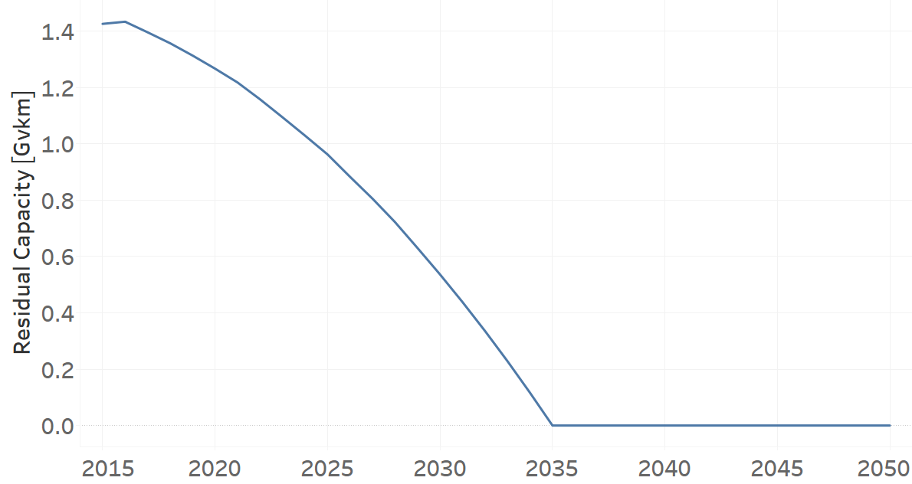
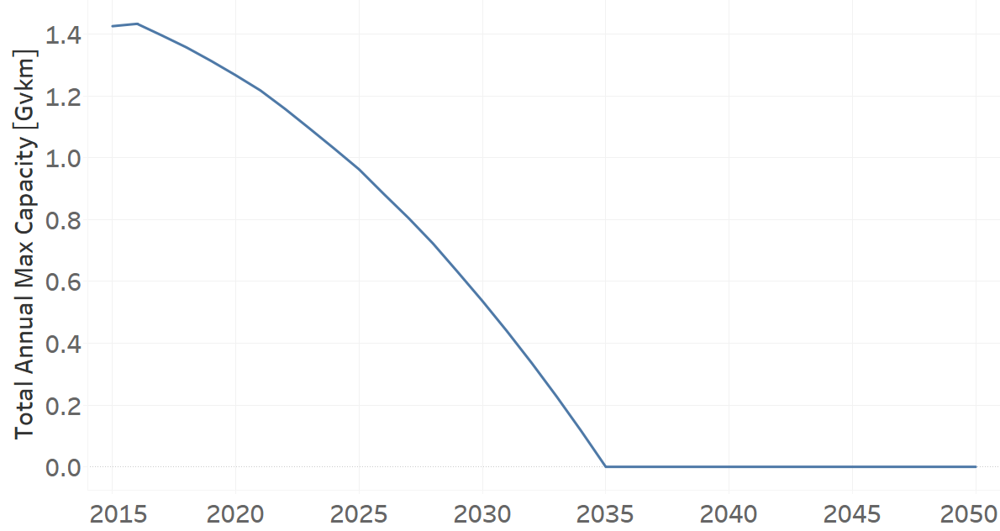
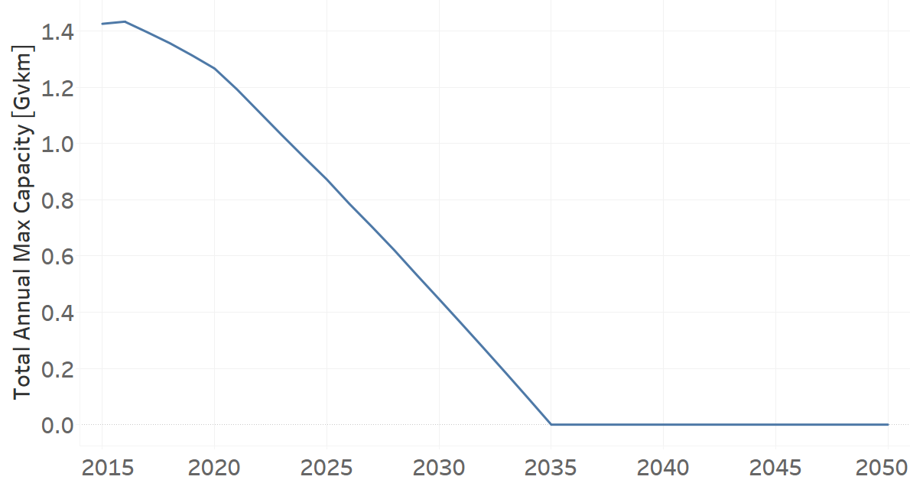
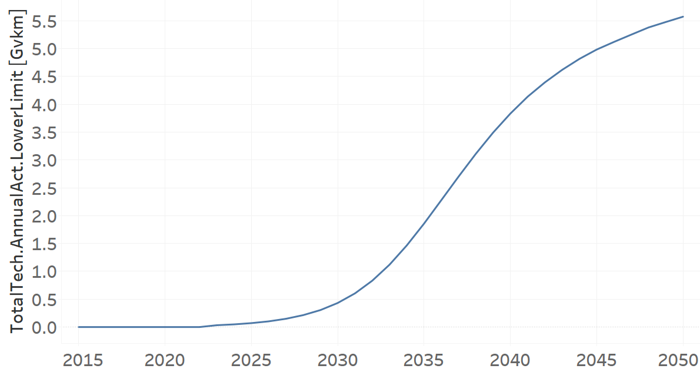
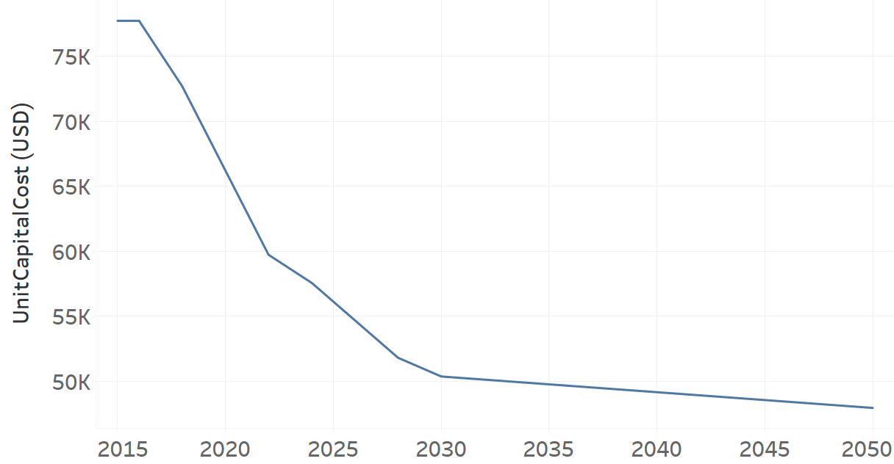
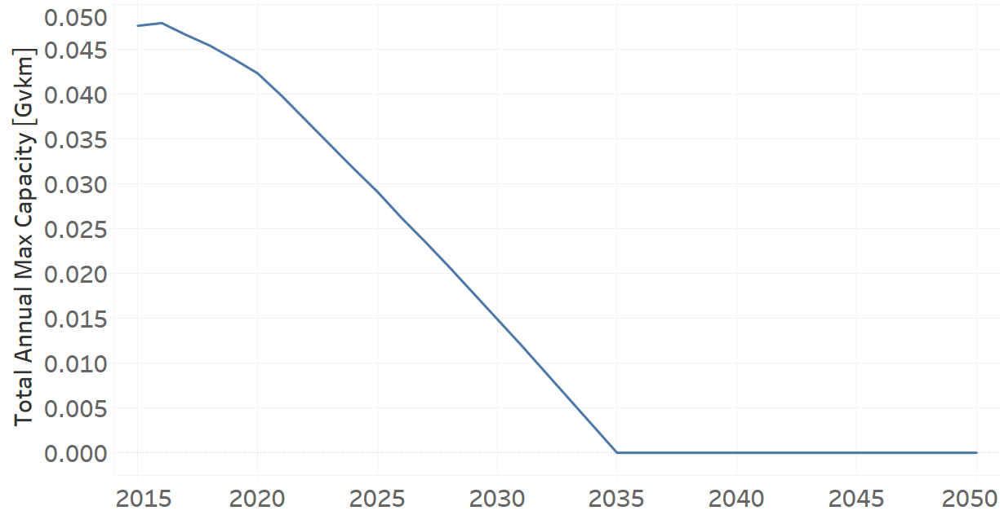
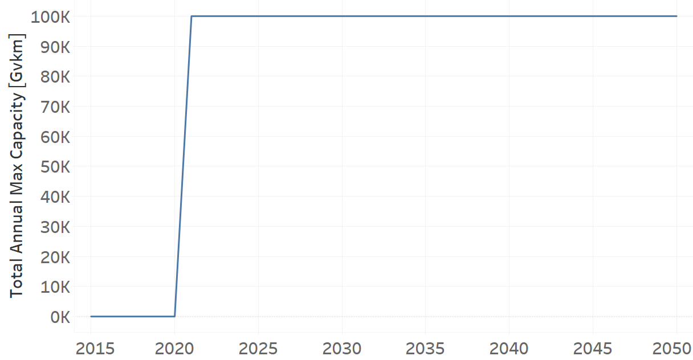

Four Wheel Drives
=======================================

Four Wheel Drive (Grouping Technology)
+++++++++
+-------------------------------------------------+-------+--------------+--------------+--------------+--------------+
| .. figure:: img/Techs_4WD.jpg                                                                                       |
|    :align:   center                                                                                                 |
|    :width:   500 px                                                                                                 |
+-------------------------------------------------+-------+--------------+--------------+--------------+--------------+
| Set codification:                                       |Techs_4WD                                                  |
+-------------------------------------------------+-------+--------------+--------------+--------------+--------------+
| Description:                                            |Four Wheel Drive                                           |
+-------------------------------------------------+-------+--------------+--------------+--------------+--------------+
| Set:                                                    |Technology                                                 |
+-------------------------------------------------+-------+--------------+--------------+--------------+--------------+
| Parameter                                       | Unit  | 2020         | 2030         | 2040         |  2050        |
+=================================================+=======+==============+==============+==============+==============+
| DistanceDriven[r,t,y]                           |km/year| 14773        | 14773        | 14773        | 14773        |
+-------------------------------------------------+-------+--------------+--------------+--------------+--------------+
| InputActivityRatio[r,t,f,m,y] (Private          | Gpkm/ | 1            | 1            | 1            | 1            |
| Transport in Four Wheel Drive)                  | Gvkm  |              |              |              |              |
+-------------------------------------------------+-------+--------------+--------------+--------------+--------------+
| OperationalLife[r,t]                            | Years | 1            | 1            | 1            | 1            |
+-------------------------------------------------+-------+--------------+--------------+--------------+--------------+
| OutputActivityRatio[r,t,f,m,y] (Transport Demand| Gpkm/ | 1.6          | 1.6          | 1.6          | 1.6          |
| Passenger Private)                              | Gvkm  |              |              |              |              |
+-------------------------------------------------+-------+--------------+--------------+--------------+--------------+
| TotalAnnualMaxCapacity[r,t,y] (BAU)             | Gvkm  | 5.1587       | 6.5541       | 7.9513       | 9.3417       |
+-------------------------------------------------+-------+--------------+--------------+--------------+--------------+
| TotalAnnualMaxCapacity[r,t,y] (NDP)             | Gvkm  | 5.1582       | 6.3674       | 5.5055       | 5.963        |
+-------------------------------------------------+-------+--------------+--------------+--------------+--------------+
| TotalTechnologyAnnualActivityLowerLimit[r,t,y]  | Gvkm  | 5.1484       | 6.541        | 7.9354       | 9.3231       |
| (BAU)                                           |       |              |              |              |              |
+-------------------------------------------------+-------+--------------+--------------+--------------+--------------+
| TotalTechnologyAnnualActivityLowerLimit[r,t,y]  | Gvkm  | 5.1491       | 6.3539       | 5.4939       | 5.9237       |
| (NDP)                                           |       |              |              |              |              |
+-------------------------------------------------+-------+--------------+--------------+--------------+--------------+

DistanceDriven[r,t,y]
---------
The equation (1) shows the Distance Driven for Techs_4WD, for every scenario.

DistanceDriven=14773 [km/year]   (1)

   
InputActivityRatio[r,t,f,m,y]
---------
The equation (2) shows the Input Activity Ratio for Techs_4WD, for every scenario and associated to the fuel Private Transport in Four Wheel Drive.

InputActivityRatio=1   [Gpkm/Gvkm]   (2)

   
OperationalLife[r,t]
---------
The equation (3) shows the Operational Life for Techs_4WD, for every scenario.

OperationalLife=1 Years   (3)

 
   
OutputActivityRatio[r,t,f,m,y]
---------
The equation (4) shows the Output Activity Ratio for Techs_4WD, for every scenario and associated to the fuel Transport Demand Passenger Private.

OutputActivityRatio=1.6 [Gpkm/Gvkm]   (4)

   
TotalAnnualMaxCapacity[r,t,y]
---------
The figure 1 shows the Total Annual Max Capacity for Techs_4WD, for the BAU scenario.

   
   *Figure 1) Total Annual Max Capacity for Techs_4WD for the BAU scenario.*
   
The figure 2 shows the Total Annual Max Capacity for Techs_4WD, for the NDP scenario.

.. figure:: img/Techs_4WD_TotalAnnualMaxCapacity_NDP_OP15C.png
   :align:   center
   :width:   700 px
   
   *Figure 2) Total Annual Max Capacity for Techs_4WD for the NDP scenario.*

   
TotalTechnologyAnnualActivityLowerLimit[r,t,y]
---------
The figure 3 shows the Total Technology Annual Activity Lower Limit for Techs_4WD, for the BAU scenario.

.. figure:: img/Techs_4WD_TotalTechnologyAnnualActivityLowerLimit_BAU.png
   :align:   center
   :width:   700 px
   
   *Figure 3) Total Technology Annual Activity Lower Limit for Techs_4WD for the BAU scenario.*
   
The figure 4 shows the Total Technology Annual Activity Lower Limit for Techs_4WD, for the NDP scenario.

.. figure:: img/Techs_4WD_TotalTechnologyAnnualActivityLowerLimit_NDP_OP.png
   :align:   center
   :width:   700 px
   
   *Figure 4) Total Technology Annual Activity Lower Limit for Techs_4WD for the NDP scenario.*

   
Four-Wheel-Drive (existing)
+++++++++

+-------------------------------------------------+-------+--------------+--------------+--------------+--------------+
| .. figure:: img/TRFWDDSL.png                                                                                        |
|    :align:   center                                                                                                 |
|    :width:   600 px                                                                                                 |
+-------------------------------------------------+-------+--------------+--------------+--------------+--------------+
| Set codification:                                       |TRFWDDSL01                                                 |
+-------------------------------------------------+-------+--------------+--------------+--------------+--------------+
| Description:                                            |Four-Wheel-Drive (existing)                                |
+-------------------------------------------------+-------+--------------+--------------+--------------+--------------+
| Set:                                                    |Technology                                                 |
+-------------------------------------------------+-------+--------------+--------------+--------------+--------------+
| Parameter                                       | Unit  | 2020         | 2030         | 2040         |  2050        |
+=================================================+=======+==============+==============+==============+==============+
| DistanceDriven[r,t,y]                           |km/year| 14773        | 14773        | 14773        | 14773        |
+-------------------------------------------------+-------+--------------+--------------+--------------+--------------+
| EmissionActivityRatio[r,t,e,m,y] (Accidents)    |   -   | 0.09         | 0.09         | 0.09         | 0.09         |
+-------------------------------------------------+-------+--------------+--------------+--------------+--------------+
| EmissionActivityRatio[r,t,e,m,y] (Congestion)   |   -   | 0.081        | 0.081        | 0.081        | 0.081        |
+-------------------------------------------------+-------+--------------+--------------+--------------+--------------+
| EmissionActivityRatio[r,t,e,m,y] (Health)       |   -   | 0.01         | 0.01         | 0.01         | 0.01         |
+-------------------------------------------------+-------+--------------+--------------+--------------+--------------+
| FixedCost[r,t,y]                                |M$/Gvkm| 61.65        | 61.65        | 61.65        | 61.65        |
+-------------------------------------------------+-------+--------------+--------------+--------------+--------------+
| InputActivityRatio[r,t,f,m,y] (Diesel for       | PJ/   | 3.3735       | 3.2005       | 3.114        | 3.114        |
| private transport)                              | Gvkm  |              |              |              |              |
+-------------------------------------------------+-------+--------------+--------------+--------------+--------------+
| OperationalLife[r,t]                            | Years | 15           | 15           | 15           | 15           |
+-------------------------------------------------+-------+--------------+--------------+--------------+--------------+
| OutputActivityRatio[r,t,f,m,y] (Private         | PJ/   | 1            | 1            | 1            | 1            |
| Transport in Four Wheel Drive)                  | Gvkm  |              |              |              |              |
+-------------------------------------------------+-------+--------------+--------------+--------------+--------------+
| ResidualCapacity[r,t,y] (BAU)                   | Gvkm  | 1.267        | 0.5365       | 0            | 0            |
+-------------------------------------------------+-------+--------------+--------------+--------------+--------------+
| ResidualCapacity[r,t,y] (NDP)                   | Gvkm  | 1.267        | 0.4467       | 0            | 0            |
+-------------------------------------------------+-------+--------------+--------------+--------------+--------------+
| TotalAnnualMaxCapacity[r,t,y] (BAU)             | Gvkm  | 1.267        | 0.5365       | 0            | 0            |
+-------------------------------------------------+-------+--------------+--------------+--------------+--------------+
| TotalAnnualMaxCapacity[r,t,y] (NDP)             | Gvkm  | 1.267        | 0.4467       | 0            | 0            |
+-------------------------------------------------+-------+--------------+--------------+--------------+--------------+
| TotalTechnologyAnnualActivityLowerLimit[r,t,y]  | Gvkm  | 1.2645       | 0.5355       | 0            | 0            |
| (BAU)                                           |       |              |              |              |              |
+-------------------------------------------------+-------+--------------+--------------+--------------+--------------+
| TotalTechnologyAnnualActivityLowerLimit[r,t,y]  | Gvkm  | 1.2645       | 0.4459       | 0            | 0            |
| (NDP)                                           |       |              |              |              |              |
+-------------------------------------------------+-------+--------------+--------------+--------------+--------------+
| UnitFixedCost[r,t,y]                            |   $   | 910.7554     | 910.7554     | 910.7554     | 910.7554     |
+-------------------------------------------------+-------+--------------+--------------+--------------+--------------+

DistanceDriven[r,t,y]
---------
The equation (1) shows the Distance Driven for TRFWDDSL01, for every scenario.

DistanceDriven=14773 [km/year]   (1)

EmissionActivityRatio[r,t,e,m,y]
---------
The equation (2) shows the Emission Activity Ratio for TRFWDDSL01, for every scenario and associated to the emission Accidents.

EmissionActivityRatio=0.09    (2)

The equation (3) shows the Emission Activity Ratio for TRFWDDSL01, for every scenario and associated to the emission Congestion.

EmissionActivityRatio=0.081    (3)

The equation (4) shows the Emission Activity Ratio for TRFWDDSL01, for every scenario and associated to the emission Health.

EmissionActivityRatio=0.01   (4)

FixedCost[r,t,y]
---------
The equation (5) shows the Fixed Cost for TRFWDDSL01, for every scenario.

FixedCost=61.65 [M$/Gvkm]   (5)

   
InputActivityRatio[r,t,f,m,y]
---------
The figure 1 shows the Input Activity Ratio for TRFWDDSL01, for every scenario and associated to the fuel Diesel for private transport.

.. figure:: img/TRFWDDSL01_InputActivityRatio.png
   :align:   center
   :width:   700 px
   
   *Figure 1) Input Activity Ratio for TRFWDDSL01 for every scenario.*

   
OperationalLife[r,t]
---------
The equation (6) shows the Operational Life for TRFWDDSL01, for every scenario.

OperationalLife=15 Years   (6)

   
OutputActivityRatio[r,t,f,m,y]
---------
The equation (7) shows the Output Activity Ratio for TRFWDDSL01, for every scenario and associated to the fuel Private Transport in Four Wheel Drive.

OutputActivityRatio=1 [PJ/Gvkm]   (7)

     
   
ResidualCapacity[r,t,y]
---------
The figure 2 shows the Residual Capacity for TRFWDDSL01, for the BAU scenario.

   
   *Figure 2) Residual Capacity for TRFWDDSL01 for the BAU scenario.*
   
The figure 3 shows the Residual Capacity for TRFWDDSL01, for the NDP scenario.

   
   *Figure 3) Residual Capacity for TRFWDDSL01 for the NDP scenario.*   
   
      
   
TotalAnnualMaxCapacity[r,t,y]
---------
The figure 4 shows the Total Annual Max Capacity for TRFWDDSL01, for the BAU scenario.

   
   *Figure 4) Total Annual Max Capacity for TRFWDDSL01 for the BAU scenario.*
   
The figure 5 shows the Total Annual Max Capacity for TRFWDDSL01, for the NDP scenario.

   
   *Figure 5) Total Annual Max Capacity for TRFWDDSL01 for the NDP scenario.*   
   
   
TotalTechnologyAnnualActivityLowerLimit[r,t,y]
---------
The figure 6 shows the Total Technology Annual Activity Lower Limit for TRFWDDSL01, for the BAU scenario.

   
   *Figure 6) Total Technology Annual Activity Lower Limit for TRFWDDSL01 for the BAU scenario.*
   
The figure 7 shows the Total Technology Annual Activity Lower Limit for TRFWDDSL01, for the NDP scenario.

   
   *Figure 7) Total Technology Annual Activity Lower Limit for TRFWDDSL01 for the NDP scenario.*

   
UnitFixedCost[r,t,y]
---------
The equation (8) shows the Unit Fixed Cost for TRFWDDSL01, for every scenario.

UnitFixedCost=11244.7188 [$]   (8)

Four-Wheel-Drive Diesel (new)
+++++++++

+-------------------------------------------------+-------+--------------+--------------+--------------+--------------+
| .. figure:: img/TRFWDDSL.png                                                                                        |
|    :align:   center                                                                                                 |
|    :width:   500 px                                                                                                 |
+-------------------------------------------------+-------+--------------+--------------+--------------+--------------+
| Set codification:                                       |TRFWDDSL02                                                 |
+-------------------------------------------------+-------+--------------+--------------+--------------+--------------+
| Description:                                            |Four-Wheel-Drive Diesel (new)                              |
+-------------------------------------------------+-------+--------------+--------------+--------------+--------------+
| Set:                                                    |Technology                                                 |
+-------------------------------------------------+-------+--------------+--------------+--------------+--------------+
| Parameter                                       | Unit  | 2020         | 2030         | 2040         |  2050        |
+=================================================+=======+==============+==============+==============+==============+
| CapitalCost[r,t,y]                              |M$/Gvkm| 2460.82      | 2460.82      | 2460.82      | 2460.82      |
+-------------------------------------------------+-------+--------------+--------------+--------------+--------------+
| DistanceDriven[r,t,y]                           |km/year| 14773        | 14773        | 14773        | 14773        |
+-------------------------------------------------+-------+--------------+--------------+--------------+--------------+
| EmissionActivityRatio[r,t,e,m,y] (Accidents)    |   -   | 0.09         | 0.09         | 0.09         | 0.09         |
+-------------------------------------------------+-------+--------------+--------------+--------------+--------------+
| EmissionActivityRatio[r,t,e,m,y] (Congestion)   |  -    | 0.081        | 0.081        | 0.081        | 0.081        |
+-------------------------------------------------+-------+--------------+--------------+--------------+--------------+
| EmissionActivityRatio[r,t,e,m,y] (Health)       |   -   | 0.01         | 0.01         | 0.01         | 0.01         |
+-------------------------------------------------+-------+--------------+--------------+--------------+--------------+
| FixedCost[r,t,y]                                |M$/Gvkm| 61.65        | 61.65        | 61.65        | 61.65        |
+-------------------------------------------------+-------+--------------+--------------+--------------+--------------+
| InputActivityRatio[r,t,f,m,y] (Diesel for       | PJ/   | 2.916285714  | 2.520857143  | 2.125428571  | 1.73         |
| private transport)                              | Gvkm  |              |              |              |              |
+-------------------------------------------------+-------+--------------+--------------+--------------+--------------+
| OperationalLife[r,t]                            | Years | 15           | 15           | 15           | 15           |
+-------------------------------------------------+-------+--------------+--------------+--------------+--------------+
| OutputActivityRatio[r,t,f,m,y] (Private         | PJ/   | 1            | 1            | 1            | 1            |
| Transport in Four Wheel Drive)                  | Gvkm  |              |              |              |              |
+-------------------------------------------------+-------+--------------+--------------+--------------+--------------+
| TotalTechnologyAnnualActivityLowerLimit[r,t,y]  | Gvkm  | 0.4215       | 1.6065       | 2.2089       | 2.5951       |
| (BAU)                                           |       |              |              |              |              |
+-------------------------------------------------+-------+--------------+--------------+--------------+--------------+
| TotalTechnologyAnnualActivityLowerLimit[r,t,y]  | Gvkm  | 0.4215       | 0            | 0            | 0            |
| (NDP)                                           |       |              |              |              |              |
+-------------------------------------------------+-------+--------------+--------------+--------------+--------------+
| UnitCapitalCost[r,t,y]                          |   $   | 36353.6939   | 36353.6939   | 36353.6939   | 36353.6939   |
+-------------------------------------------------+-------+--------------+--------------+--------------+--------------+
| UnitFixedCost[r,t,y]                            |   $   | 910.7554     | 910.7554     | 910.7554     | 910.7554     |
+-------------------------------------------------+-------+--------------+--------------+--------------+--------------+

CapitalCost[r,t,y]
---------
The equation (1) shows the Capital Cost for TRFWDDSL02, for every scenario.

CapitalCost=2460.82 [M$/Gvkm]   (1)

DistanceDriven[r,t,y]
---------
The equation (2) shows the Distance Driven for TRFWDDSL02, for every scenario.

DistanceDriven=14773 [km/year]   (2)

EmissionActivityRatio[r,t,e,m,y]
---------
The equation (3) shows the Emission Activity Ratio for TRFWDDSL02, for every scenario and associated to the emission Accidents.

EmissionActivityRatio=0.09    (3)

The equation (4) shows the Emission Activity Ratio for TRFWDDSL02, for every scenario and associated to the emission Congestion.

EmissionActivityRatio=0.081    (4)

The equation (5) shows the Emission Activity Ratio for TRFWDDSL02, for every scenario and associated to the emission Health.

EmissionActivityRatio=0.01    (5)

FixedCost[r,t,y]
---------
The equation (6) shows the Fixed Cost for TRFWDDSL02, for every scenario.

FixedCost=171.78 [M$/Gvkm]   (6)

   
InputActivityRatio[r,t,f,m,y]
---------
The figure 1 shows the Input Activity Ratio for TRFWDDSL02, for every scenario and associated to the fuel Diesel for private transport.

.. figure:: img/TRFWDDSL02_InputActivityRatio.png
   :align:   center
   :width:   700 px
   
   *Figure 1) Input Activity Ratio for TRFWDDSL02 for every scenario.*

   
OperationalLife[r,t]
---------
The equation (7) shows the Operational Life for TRFWDDSL02, for every scenario.

OperationalLife=15 Years   (7)

   
OutputActivityRatio[r,t,f,m,y]
---------
The equation (8) shows the Output Activity Ratio for TRFWDDSL02, for every scenario and associated to the fuel Private Transport in Four Wheel Drive.

OutputActivityRatio=1 [PJ/Gvkm]   (8)

 
   
TotalTechnologyAnnualActivityLowerLimit[r,t,y]
---------
The figure 2 shows the Total Technology Annual Activity Lower Limit for TRFWDDSL02, for the BAU scenario.

.. figure:: img/TRFWDDSL02_TotalTechnologyAnnualActivityLowerLimit_BAU.png
   :align:   center
   :width:   700 px
   
   *Figure 2) Total Technology Annual Activity Lower Limit for TRFWDDSL02 for the BAU scenario.*
   
The figure 3 shows the Total Technology Annual Activity Lower Limit for TRFWDDSL02, for the NDP scenario.

.. figure:: img/TRFWDDSL02_TotalTechnologyAnnualActivityLowerLimit_NDP_OP.png
   :align:   center
   :width:   700 px
   
   *Figure 3) Total Technology Annual Activity Lower Limit for TRFWDDSL02 for the NDP scenario.*

   
UnitCapitalCost[r,t,y]
---------
The equation (9) shows the Unit Capital Cost for TRFWDDSL02, for every scenario.

UnitCapitalCost=36353.6939 [$]   (9)

   
   
UnitFixedCost[r,t,y]
---------
The equation (10) shows the Unit Fixed Cost for TRFWDDSL02, for every scenario.

UnitFixedCost=910.7554 [$]   (10)

Four-Wheel-Drive Electric (new)
+++++++++

+-------------------------------------------------+-------+--------------+--------------+--------------+--------------+
| .. figure:: img/TRFWDELE.jpg                                                                                        |
|    :align:   center                                                                                                 |
|    :width:   500 px                                                                                                 |
+-------------------------------------------------+-------+--------------+--------------+--------------+--------------+
| Set codification:                                       |TRFWDELE02                                                 |
+-------------------------------------------------+-------+--------------+--------------+--------------+--------------+
| Description:                                            |Four-Wheel-Drive Electric (new)                            |
+-------------------------------------------------+-------+--------------+--------------+--------------+--------------+
| Set:                                                    |Technology                                                 |
+-------------------------------------------------+-------+--------------+--------------+--------------+--------------+
| Parameter                                       | Unit  | 2020         | 2030         | 2040         |  2050        |
+=================================================+=======+==============+==============+==============+==============+
| CapitalCost[r,t,y]                              |M$/Gvkm| 4482.01      | 3410.22      | 3328.38      | 3246.53      |
+-------------------------------------------------+-------+--------------+--------------+--------------+--------------+
| DistanceDriven[r,t,y]                           |km/year| 14773        | 14773        | 14773        | 14773        |
+-------------------------------------------------+-------+--------------+--------------+--------------+--------------+
| EmissionActivityRatio[r,t,e,m,y] (Accidents)    |  -    | 0.09         | 0.09         | 0.09         | 0.09         |
+-------------------------------------------------+-------+--------------+--------------+--------------+--------------+
| EmissionActivityRatio[r,t,e,m,y] (Congestion)   | -     | 0.081        | 0.081        | 0.081        | 0.081        |
+-------------------------------------------------+-------+--------------+--------------+--------------+--------------+
| FixedCost[r,t,y]                                |M$/Gvkm| 20.3445      | 20.3445      | 20.3445      | 20.3445      |
+-------------------------------------------------+-------+--------------+--------------+--------------+--------------+
| InputActivityRatio[r,t,f,m,y] (Electricity for  | PJ/   | 0.7          | 0.7          | 0.7          | 0.7          |
| private transport)                              | Gvkm  |              |              |              |              |
+-------------------------------------------------+-------+--------------+--------------+--------------+--------------+
| OperationalLife[r,t]                            | Years | 12           | 12           | 12           | 12           |
+-------------------------------------------------+-------+--------------+--------------+--------------+--------------+
| OutputActivityRatio[r,t,f,m,y] (Private         | PJ/   | 1            | 1            | 1            | 1            |
| Transport in Four Wheel Drive)                  | Gvkm  |              |              |              |              |
+-------------------------------------------------+-------+--------------+--------------+--------------+--------------+
| TotalAnnualMaxCapacity[r,t,y] (BAU)             |  Gvkm | 0            | 0            | 0.1325       | 0.467        |
+-------------------------------------------------+-------+--------------+--------------+--------------+--------------+
| TotalAnnualMaxCapacity[r,t,y] (NDP)             |  Gvkm | 0            | 0.433        | 3.8402       | 5.5831       |
+-------------------------------------------------+-------+--------------+--------------+--------------+--------------+
| TotalTechnologyAnnualActivityLowerLimit[r,t,y]  | Gvkm  | 0            | 0            | 0.1322       | 0.4661       |
| (BAU)                                           |       |              |              |              |              |
+-------------------------------------------------+-------+--------------+--------------+--------------+--------------+
| TotalTechnologyAnnualActivityLowerLimit[r,t,y]  | Gvkm  | 0            | 0.4321       | 3.8322       | 5.5712       |
| (NDP)                                           |       |              |              |              |              |
+-------------------------------------------------+-------+--------------+--------------+--------------+--------------+
| UnitCapitalCost[r,t,y]                          |   $   | 66212.7337   | 50379.1801   | 49170.1577   | 47960.9877   |
+-------------------------------------------------+-------+--------------+--------------+--------------+--------------+
| UnitFixedCost[r,t,y]                            |   $   | 300.5493     | 300.5493     | 300.5493     | 300.5493     |
+-------------------------------------------------+-------+--------------+--------------+--------------+--------------+

CapitalCost[r,t,y]
---------

The figure 1 shows the Capital Cost for TRFWDELE02, for every scenario.

.. figure:: img/TRFWDELE02_CapitalCost.png
   :align:   center
   :width:   700 px
   
   *Figure 1) Capital Cost for TRFWDELE02 for every scenario.*
   

DistanceDriven[r,t,y]
---------
The equation (1) shows the Distance Driven for TRFWDELE02, for every scenario.

DistanceDriven=14773 [km/year]   (1)

EmissionActivityRatio[r,t,e,m,y]
---------
The equation (2) shows the Emission Activity Ratio for TRFWDELE02, for every scenario and associated to the emission Accidents.

EmissionActivityRatio=0.09    (2)

The equation (3) shows the Emission Activity Ratio for TRFWDELE02, for every scenario and associated to the emission Congestion.

EmissionActivityRatio=0.081    (3)

FixedCost[r,t,y]
---------
The equation (4) shows the Fixed Cost for TRFWDELE02, for every scenario.

FixedCost=20.3445 [M$/Gvkm]   (4)

   
InputActivityRatio[r,t,f,m,y]
---------
The equation (5) shows the Input Activity Ratio for TRFWDELE02, for every scenario and associated to the fuel Electricity for private transport. 

InputActivityRatio=0.7 [PJ/Gvkm]   (5)

 
   
OperationalLife[r,t]
---------
The equation (6) shows the Operational Life for TRFWDELE02, for every scenario.

OperationalLife=12 Years   (6)

 
   
OutputActivityRatio[r,t,f,m,y]
---------
The equation (7) shows the Output Activity Ratio for TRFWDELE02, for every scenario and associated to the fuel Private Transport in Four Wheel Drive.

OutputActivityRatio=1 [PJ/Gvkm]   (7)

   
TotalAnnualMaxCapacity[r,t,y]
---------
The figure 2 shows the Total Annual Max Capacity for TRFWDELE02, for the BAU scenario.

.. figure:: img/TRFWDELE02_TotalAnnualMaxCapacity_BAU.png
   :align:   center
   :width:   700 px
   
   *Figure 2) Total Annual Max Capacity for TRFWDELE02 for the BAU scenario.*
   
The figure 3 shows the Total Annual Max Capacity for TRFWDELE02, for the NDP scenario.

.. figure:: img/TRFWDELE02_TotalAnnualMaxCapacity_NDP_OP.png
   :align:   center
   :width:   700 px
   
   *Figure 3) Total Annual Max Capacity for TRFWDELE02 for the NDP scenario.*

 
   
TotalTechnologyAnnualActivityLowerLimit[r,t,y]
---------
The figure 4 shows the Total Technology Annual Activity Lower Limit for TRFWDELE02, for the BAU scenario.

.. figure:: img/TRFWDELE02_TotalTechnologyAnnualActivityLowerLimit_BAU.png
   :align:   center
   :width:   700 px
   
   *Figure 4) Total Technology Annual Activity Lower Limit for TRFWDELE02 for the BAU scenario.*

The figure 5 shows the Total Technology Annual Activity Lower Limit for TRFWDELE02, for the NDP scenario.

   
   *Figure 5) Total Technology Annual Activity Lower Limit for TRFWDELE02 for the NDP scenario.*

   
UnitCapitalCost[r,t,y]
---------
The figure 6 shows the Unit Capital Cost for TRFWDELE02, for every scenario.

   
   *Figure 6) Unit Capital Cost for TRFWDELE02 for every scenario.*

   
   
UnitFixedCost[r,t,y]
---------
The equation (8) shows the Unit Fixed Cost for TRFWDELE02, for every scenario.

UnitFixedCost=300.5493 [$]   (8)

Four-Wheel-Drive Gasoline (existing)
+++++++++

+-------------------------------------------------+-------+--------------+--------------+--------------+--------------+
| .. figure:: img/TRFWDGAS.png                                                                                        |
|    :align:   center                                                                                                 |
|    :width:   500 px                                                                                                 |
+-------------------------------------------------+-------+--------------+--------------+--------------+--------------+
| Set codification:                                       |TRFWDGAS01                                                 |
+-------------------------------------------------+-------+--------------+--------------+--------------+--------------+
| Description:                                            |Four-Wheel-Drive Gasoline (existing)                       |
+-------------------------------------------------+-------+--------------+--------------+--------------+--------------+
| Set:                                                    |Technology                                                 |
+-------------------------------------------------+-------+--------------+--------------+--------------+--------------+
| Parameter                                       | Unit  | 2020         | 2030         | 2040         |  2050        |
+=================================================+=======+==============+==============+==============+==============+
| DistanceDriven[r,t,y]                           |km/year| 14773        | 14773        | 14773        | 14773        |
+-------------------------------------------------+-------+--------------+--------------+--------------+--------------+
| EmissionActivityRatio[r,t,e,m,y] (Accidents)    |   -   | 0.09         | 0.09         | 0.09         | 0.09         |
+-------------------------------------------------+-------+--------------+--------------+--------------+--------------+
| EmissionActivityRatio[r,t,e,m,y] (Congestion)   |   -   | 0.081        | 0.081        | 0.081        | 0.081        |
+-------------------------------------------------+-------+--------------+--------------+--------------+--------------+
| FixedCost[r,t,y]                                |M$/Gvkm| 61.65        | 61.65        | 61.65        | 61.65        |
+-------------------------------------------------+-------+--------------+--------------+--------------+--------------+
| InputActivityRatio[r,t,f,m,y] (Gasoline for     | PJ/   | 2.808        | 2.664        | 2.592        | 2.592        |
| private transport)                              | Gvkm  |              |              |              |              |
+-------------------------------------------------+-------+--------------+--------------+--------------+--------------+
| OperationalLife[r,t]                            | Years | 15           | 15           | 15           | 15           |
+-------------------------------------------------+-------+--------------+--------------+--------------+--------------+
| OutputActivityRatio[r,t,f,m,y] (Private         | PJ/   | 1            | 1            | 1            | 1            |
| Transport in Four Wheel Drive)                  | Gvkm  |              |              |              |              |
+-------------------------------------------------+-------+--------------+--------------+--------------+--------------+
| ResidualCapacity[r,t,y] (BAU)                   | Gvkm  | 2.5595       | 1.0839       | 0            | 0            |
+-------------------------------------------------+-------+--------------+--------------+--------------+--------------+
| ResidualCapacity[r,t,y] (NDP)                   | Gvkm  | 2.5595       | 0.9025       | 0            | 0            |
+-------------------------------------------------+-------+--------------+--------------+--------------+--------------+
| TotalAnnualMaxCapacity[r,t,y] (BAU)             | Gvkm  | 2.5595       | 1.0839       | 0            | 0            |
+-------------------------------------------------+-------+--------------+--------------+--------------+--------------+
| TotalAnnualMaxCapacity[r,t,y] (NDP)             | Gvkm  | 2.5595       | 0.9025       | 0            | 0            |
+-------------------------------------------------+-------+--------------+--------------+--------------+--------------+
| TotalTechnologyAnnualActivityLowerLimit[r,t,y]  | Gvkm  | 2.5544       | 1.0818       | 0            | 0            |
| (BAU)                                           |       |              |              |              |              |
+-------------------------------------------------+-------+--------------+--------------+--------------+--------------+
| TotalTechnologyAnnualActivityLowerLimit[r,t,y]  | Gvkm  | 2.5544       | 0.9007       | 0            | 0            |
| (NDP)                                           |       |              |              |              |              |
+-------------------------------------------------+-------+--------------+--------------+--------------+--------------+
| UnitFixedCost[r,t,y]                            |  $    | 910.7554     | 910.7554     | 910.7554     | 910.7554     |
+-------------------------------------------------+-------+--------------+--------------+--------------+--------------+

DistanceDriven[r,t,y]
--------
The equation (1) shows the Distance Driven for TRFWDGAS01, for every scenario.

DistanceDriven=14773 [km/year]   (1)

EmissionActivityRatio[r,t,e,m,y]
--------
The equation (2) shows the Emission Activity Ratio for TRFWDGAS01, for every scenario and associated to the emission Accidents.

EmissionActivityRatio=0.09    (2)

The equation (3) shows the Emission Activity Ratio for TRFWDGAS01, for every scenario and associated to the emission Congestion.

EmissionActivityRatio=0.081    (3)

FixedCost[r,t,y]
--------
The equation (4) shows the Fixed Cost for TRFWDGAS01, for every scenario.

FixedCost=61.65 [M$/Gvkm]   (4)

   
InputActivityRatio[r,t,f,m,y]
--------
The figure 1 shows the Input Activity Ratio for TRFWDGAS01, for every scenario and associated to the fuel Gasoline for private transport.

   
   *Figure 1) Input Activity Ratio for TRFWDGAS01 for every scenario.*
 
   
OperationalLife[r,t]
--------
The equation (5) shows the Operational Life for TRFWDGAS01, for every scenario.

OperationalLife=15 Years   (5)
 
   
OutputActivityRatio[r,t,f,m,y]
--------
The equation (6) shows the Output Activity Ratio for TRFWDGAS01, for every scenario and associated to the fuel Private Transport in Four Wheel Drive.

OutputActivityRatio=1 [PJ/Gvkm]   (6)

    
   
ResidualCapacity[r,t,y]
--------
The figure 2 shows the Residual Capacity for TRFWDGAS01, for the BAU scenario.

.. figure:: img/TRFWDGAS01_ResidualCapacity_BAU.png
   :align:   center
   :width:   700 px
   
   *Figure 2) Residual Capacity for TRFWDGAS01 for the BAU scenario.*
   
The figure 3 shows the Residual Capacity for TRFWDGAS01, for the NDP scenario.

   
   *Figure 3) Residual Capacity for TRFWDGAS01 for the NDP scenarios.*   
   
     
   
TotalAnnualMaxCapacity[r,t,y]
--------
The figure 4 shows the Total Annual Max Capacity for TRFWDGAS01, for the BAU scenario.

   
   *Figure 4) Total Annual Max Capacity for TRFWDGAS01 for the BAU scenario.*
   
The figure 5 shows the Total Annual Max Capacity for TRFWDGAS01, for the NDP scenario.

.. figure:: img/TRFWDGAS01_TotalAnnualMaxCapacity_NDP_OP.png
   :align:   center
   :width:   700 px
   
   *Figure 5) Total Annual Max Capacity for TRFWDGAS01 for the NDP scenario.*   
   

   
TotalTechnologyAnnualActivityLowerLimit[r,t,y]
--------
The figure 6 shows the Total Technology Annual Activity Lower Limit for TRFWDGAS01, for the BAU scenario.

   
   *Figure 6) Total Technology Annual Activity Lower Limit for TRFWDGAS01 for the BAU scenario.*
   
The figure 7 shows the Total Technology Annual Activity Lower Limit for TRFWDGAS01, for the NDP scenario.

   
   *Figure 7) Total Technology Annual Activity Lower Limit for TRFWDGAS01 for the NDP scenario.*

   
UnitFixedCost[r,t,y]
--------
The equation (7) shows the Unit Fixed Cost for TRFWDGAS01, for every scenario.

UnitFixedCost=910.7554 [$]   (7)

Four-Wheel-Drive Gasoline (new)
+++++++++

+-------------------------------------------------+-------+--------------+--------------+--------------+--------------+
| .. figure:: img/TRFWDGAS.png                                                                                        |
|    :align:   center                                                                                                 |
|    :width:   500 px                                                                                                 |
+-------------------------------------------------+-------+--------------+--------------+--------------+--------------+
| Set codification:                                       |TRFWDGAS02                                                 |
+-------------------------------------------------+-------+--------------+--------------+--------------+--------------+
| Description:                                            |Four-Wheel-Drive Gasoline (new)                            |
+-------------------------------------------------+-------+--------------+--------------+--------------+--------------+
| Set:                                                    |Technology                                                 |
+-------------------------------------------------+-------+--------------+--------------+--------------+--------------+
| Parameter                                       | Unit  | 2020         | 2030         | 2040         |  2050        |
+=================================================+=======+==============+==============+==============+==============+
| CapitalCost[r,t,y]                              |M$/Gvkm| 2350.33      | 2350.33      | 2350.33      | 2350.33      |
+-------------------------------------------------+-------+--------------+--------------+--------------+--------------+
| DistanceDriven[r,t,y]                           |km/year| 14773        | 14773        | 14773        | 14773        |
+-------------------------------------------------+-------+--------------+--------------+--------------+--------------+
| EmissionActivityRatio[r,t,e,m,y] (Accidents)    |   -   | 0.09         | 0.09         | 0.09         | 0.09         |
+-------------------------------------------------+-------+--------------+--------------+--------------+--------------+
| EmissionActivityRatio[r,t,e,m,y] (Congestion)   |  -    | 0.081        | 0.081        | 0.081        | 0.081        |
+-------------------------------------------------+-------+--------------+--------------+--------------+--------------+
| FixedCost[r,t,y]                                |M$/Gvkm| 61.65        | 61.65        | 61.65        | 61.65        |
+-------------------------------------------------+-------+--------------+--------------+--------------+--------------+
| InputActivityRatio[r,t,f,m,y] (Gasoline for     | PJ/   | 2.243428571  | 2.122285714  | 2.001142857  | 1.88         |
| private transport)                              | Gvkm  |              |              |              |              |
+-------------------------------------------------+-------+--------------+--------------+--------------+--------------+
| OperationalLife[r,t]                            | Years | 15           | 15           | 15           | 15           |
+-------------------------------------------------+-------+--------------+--------------+--------------+--------------+
| OutputActivityRatio[r,t,f,m,y] (Private         | PJ/   | 1            | 1            | 1            | 1            |
| Transport in Four Wheel Drive)                  | Gvkm  |              |              |              |              |
+-------------------------------------------------+-------+--------------+--------------+--------------+--------------+
| TotalTechnologyAnnualActivityLowerLimit[r,t,y]  | Gvkm  | 0.8514       | 3.2454       | 4.4622       | 5.2426       |
| (BAU)                                           |       |              |              |              |              |
+-------------------------------------------------+-------+--------------+--------------+--------------+--------------+
| TotalTechnologyAnnualActivityLowerLimit[r,t,y]  | Gvkm  | 0.8514       | 0            | 0            | 0            |
| (NDP)                                           |       |              |              |              |              |
+-------------------------------------------------+-------+--------------+--------------+--------------+--------------+
| UnitCapitalCost[r,t,y]                          |   $   | 34721.4251   | 34721.4251   | 34721.4251   | 34721.4251   |
+-------------------------------------------------+-------+--------------+--------------+--------------+--------------+
| UnitFixedCost[r,t,y]                            |   $   | 910.7554     | 910.7554     | 910.7554     | 910.7554     |
+-------------------------------------------------+-------+--------------+--------------+--------------+--------------+

CapitalCost[r,t,y]
----------
The equation (1) shows the Capital Cost for TRFWDGAS02, for every scenario.

CapitalCost=2350.33 [M$/Gvkm]   (1)

DistanceDriven[r,t,y]
----------
The equation (2) shows the Distance Driven for TRFWDGAS02, for every scenario.

DistanceDriven=14773 [km/year]   (2)

EmissionActivityRatio[r,t,e,m,y]
----------
The equation (3) shows the Emission Activity Ratio for TRFWDGAS02, for every scenario and associated to the emission Accidents.

EmissionActivityRatio=0.09    (3)

The equation (4) shows the Emission Activity Ratio for TRFWDGAS02, for every scenario and associated to the emission Congestion.

EmissionActivityRatio=0.081    (4)

FixedCost[r,t,y]
----------
The equation (5) shows the Fixed Cost for TRFWDGAS02, for every scenario.

FixedCost=61.65 [M$/Gvkm]   (5)

   
InputActivityRatio[r,t,f,m,y]
----------
The figure 1 shows the Input Activity Ratio for TRFWDGAS02, for every scenario and associated to the fuel Gasoline for private transport.

.. figure:: img/TRFWDGAS02_InputActivityRatio.png
   :align:   center
   :width:   700 px
   
   *Figure 1) Input Activity Ratio for TRFWDGAS02 for every scenario.*

  
   
OperationalLife[r,t]
----------
The equation (6) shows the Operational Life for TRFWDGAS02, for every scenario.

OperationalLife=15 Years   (6)

   
OutputActivityRatio[r,t,f,m,y]
----------
The equation (7) shows the Output Activity Ratio for TRFWDGAS02, for every scenario and associated to the fuel Private Transport in Four Wheel Drive.

OutputActivityRatio=1 [PJ/Gvkm]   (7)

    
   
TotalTechnologyAnnualActivityLowerLimit[r,t,y]
----------
The figure 2 shows the Total Technology Annual Activity Lower Limit for TRFWDGAS02, for the BAU scenario.

   
   *Figure 2) Total Technology Annual Activity Lower Limit for TRFWDGAS02 for the BAU scenario.*
   
The figure 3 shows the Total Technology Annual Activity Lower Limit for TRFWDGAS02, for the NDP scenario.

.. figure:: img/TRFWDGAS02_TotalTechnologyAnnualActivityLowerLimit_NDP_OP.png
   :align:   center
   :width:   700 px
   
   *Figure 3) Total Technology Annual Activity Lower Limit for TRFWDGAS02 for the NDP scenario.*

   
UnitCapitalCost[r,t,y]
----------
The equation (8) shows the Unit Capital Cost for TRFWDGAS02, for every scenario.

UnitCapitalCost=34721.4251 [$]   (8)

   
   
UnitFixedCost[r,t,y]
----------
The equation (9) shows the Unit Fixed Cost for TRFWDGAS02, for every scenario.

UnitFixedCost=910.7554 [$]   (9)

Four-Wheel-Drive Hybrid Electric-Diesel (new)
++++++++++

+-------------------------------------------------+-------+--------------+--------------+--------------+--------------+
| .. figure:: img/TRFWDHYBD.jpg                                                                                       |
|    :align:   center                                                                                                 |
|    :width:   500 px                                                                                                 |
+-------------------------------------------------+-------+--------------+--------------+--------------+--------------+
| Set codification:                                       |TRFWDHYBD02                                                |
+-------------------------------------------------+-------+--------------+--------------+--------------+--------------+
| Description:                                            |Four-Wheel-Drive Hybrid Electric-Diesel (new)              |
+-------------------------------------------------+-------+--------------+--------------+--------------+--------------+
| Set:                                                    |Technology                                                 |
+-------------------------------------------------+-------+--------------+--------------+--------------+--------------+
| Parameter                                       | Unit  | 2020         | 2030         | 2040         |  2050        |
+=================================================+=======+==============+==============+==============+==============+
| CapitalCost[r,t,y]                              |M$/Gvkm| 3459         | 3459         | 3459         | 3459         |
+-------------------------------------------------+-------+--------------+--------------+--------------+--------------+
| DistanceDriven[r,t,y]                           |km/year| 14773        | 14773        | 14773        | 14773        |
+-------------------------------------------------+-------+--------------+--------------+--------------+--------------+
| EmissionActivityRatio[r,t,e,m,y] (Accidents)    |   -   | 0.09         | 0.09         | 0.09         | 0.09         |
+-------------------------------------------------+-------+--------------+--------------+--------------+--------------+
| EmissionActivityRatio[r,t,e,m,y] (Congestion)   |  -    | 0.081        | 0.081        | 0.081        | 0.081        |
+-------------------------------------------------+-------+--------------+--------------+--------------+--------------+
| FixedCost[r,t,y]                                |M$/Gvkm| 30.825       | 30.825       | 30.825       | 30.825       |
+-------------------------------------------------+-------+--------------+--------------+--------------+--------------+
| InputActivityRatio[r,t,f,m,y] (Diesel for       | PJ/   | 0.55         | 0.55         | 0.55         | 0.55         |
| private transport)                              | Gvkm  |              |              |              |              |
+-------------------------------------------------+-------+--------------+--------------+--------------+--------------+
| InputActivityRatio[r,t,f,m,y] (Electricity for  | PJ/   | 0.55         | 0.55         | 0.55         | 0.55         | 
| private transport)                              | Gvkm  |              |              |              |              |
+-------------------------------------------------+-------+--------------+--------------+--------------+--------------+
| OperationalLife[r,t]                            | Years | 12           | 12           | 12           | 12           |
+-------------------------------------------------+-------+--------------+--------------+--------------+--------------+
| OutputActivityRatio[r,t,f,m,y] (Private         | PJ/   | 1            | 1            | 1            | 1            |
| Transport in Four Wheel Drive)                  | Gvkm  |              |              |              |              |
+-------------------------------------------------+-------+--------------+--------------+--------------+--------------+
| TotalAnnualMaxCapacity[r,t,y]                   | Gvkm  | 0            | 99999        | 99999        | 99999        |
+-------------------------------------------------+-------+--------------+--------------+--------------+--------------+
| UnitCapitalCost[r,t,y]                          |  $    | 51099.807    | 51099.807    | 51099.807    | 51099.807    |
+-------------------------------------------------+-------+--------------+--------------+--------------+--------------+
| UnitFixedCost[r,t,y]                            |  $    | 455.3777     | 455.3777     | 455.3777     | 455.3777     |
+-------------------------------------------------+-------+--------------+--------------+--------------+--------------+

CapitalCost[r,t,y]
---------
The equation (1) shows the Capital Cost for TRFWDHYBD02, for every scenario.

CapitalCost=3459 [M$/Gvkm]   (1)

DistanceDriven[r,t,y]
---------
The equation (2) shows the Distance Driven for TRFWDHYBD02, for every scenario.

DistanceDriven=14773 [km/year]   (2)

EmissionActivityRatio[r,t,e,m,y]
---------
The equation (3) shows the Emission Activity Ratio for TRFWDHYBD02, for every scenario and associated to the emission Accidents.

EmissionActivityRatio=0.09    (3)

The equation (4) shows the Emission Activity Ratio for TRFWDHYBD02, for every scenario and associated to the emission Congestion.

EmissionActivityRatio=0.081    (4)

FixedCost[r,t,y]
---------
The equation (5) shows the Fixed Cost for TRFWDHYBD02, for every scenario.

FixedCost=30.825 [M$/Gvkm]   (5)

   

InputActivityRatio[r,t,f,m,y]
---------
The equation (6) shows the Input Activity Ratio for TRFWDHYBD02, for every scenario and associated to the fuel Electricity for public transport and Diesel for public transport. 

InputActivityRatio=0.55 [PJ/Gvkm]   (6)

  
   
OperationalLife[r,t]
---------
The equation (7) shows the Operational Life for TRFWDHYBD02, for every scenario.

OperationalLife=12 Years   (7)

 
   
OutputActivityRatio[r,t,f,m,y]
---------
The equation (8) shows the Output Activity Ratio for TRFWDHYBD02, for every scenario and associated to the fuel Private Transport in Four Wheel Drive.

OutputActivityRatio=1 [PJ/Gvkm]   (8)
   
   
TotalAnnualMaxCapacity[r,t,y]
---------
The figure 1 shows the Total Annual Max Capacity for TRFWDHYBD02, for every scenario.

.. figure:: img/TRFWDHYBD02_TotalAnnualMaxCapacity.png
   :align:   center
   :width:   700 px
   
   *Figure 1) Total Annual Max Capacity for TRFWDHYBD02 for every scenario.*

   
UnitCapitalCost[r,t,y]
---------
The equation (9) shows the Unit Capital Cost for TRFWDHYBD02, for every scenario.

UnitCapitalCost=51099.807 [$]   (9)

   
   
UnitFixedCost[r,t,y]
---------
The equation (10) shows the Unit Fixed Cost for TRFWDHYBD02, for every scenario.

UnitFixedCost=455.3777 [$]   (10)

Four-Wheel-Drive LPG (existing)
+++++++++

+-------------------------------------------------+-------+--------------+--------------+--------------+--------------+
| .. figure:: img/TRFWDLPG.PNG                                                                                        |
|    :align:   center                                                                                                 |
|    :width:   500 px                                                                                                 |
+-------------------------------------------------+-------+--------------+--------------+--------------+--------------+
| Set codification:                                       |TRFWDLPG01                                                 |
+-------------------------------------------------+-------+--------------+--------------+--------------+--------------+
| Description:                                            |Four-Wheel-Drive LPG (existing)                            |
+-------------------------------------------------+-------+--------------+--------------+--------------+--------------+
| Set:                                                    |Technology                                                 |
+-------------------------------------------------+-------+--------------+--------------+--------------+--------------+
| Parameter                                       | Unit  | 2020         | 2030         | 2040         |  2050        |
+=================================================+=======+==============+==============+==============+==============+
| DistanceDriven[r,t,y]                           |km/year| 14773        | 14773        | 14773        | 14773        |
+-------------------------------------------------+-------+--------------+--------------+--------------+--------------+
| EmissionActivityRatio[r,t,e,m,y] (Accidents)    |   -   | 0.09         | 0.09         | 0.09         | 0.09         |
+-------------------------------------------------+-------+--------------+--------------+--------------+--------------+
| EmissionActivityRatio[r,t,e,m,y] (Congestion)   |   -   | 0.081        | 0.081        | 0.081        | 0.081        |
+-------------------------------------------------+-------+--------------+--------------+--------------+--------------+
| FixedCost[r,t,y]                                |M$/Gvkm| 61.65        | 61.65        | 61.65        | 61.65        |
+-------------------------------------------------+-------+--------------+--------------+--------------+--------------+
| InputActivityRatio[r,t,f,m,y] (LPG for          | PJ/   | 4.51         | 4.51         | 4.51         | 4.51         |
| private transport)                              | Gvkm  |              |              |              |              |
+-------------------------------------------------+-------+--------------+--------------+--------------+--------------+
| OperationalLife[r,t]                            | Years | 15           | 15           | 15           | 15           |
+-------------------------------------------------+-------+--------------+--------------+--------------+--------------+
| OutputActivityRatio[r,t,f,m,y] (Private         | PJ/   | 1            | 1            | 1            | 1            |
| Transport in Four Wheel Drive)                  | Gvkm  |              |              |              |              |
+-------------------------------------------------+-------+--------------+--------------+--------------+--------------+
| ResidualCapacity[r,t,y] (BAU)                   | Gvkm  | 0.0423       | 0.0179       | 0            | 0            |
+-------------------------------------------------+-------+--------------+--------------+--------------+--------------+
| ResidualCapacity[r,t,y] (NDP and OP15C)         | Gvkm  | 2.5595       | 0.0149       | 0            | 0            |
+-------------------------------------------------+-------+--------------+--------------+--------------+--------------+
| TotalAnnualMaxCapacity[r,t,y] (BAU)             | Gvkm  | 0.0423       | 0.0179       | 0            | 0            |
+-------------------------------------------------+-------+--------------+--------------+--------------+--------------+
| TotalAnnualMaxCapacity[r,t,y] (NDP and OP15C)   | Gvkm  | 2.5595       | 0.0149       | 0            | 0            |
+-------------------------------------------------+-------+--------------+--------------+--------------+--------------+
| TotalTechnologyAnnualActivityLowerLimit[r,t,y]  | Gvkm  | 0.0422       | 0.0179       | 0            | 0            |
| (BAU)                                           |       |              |              |              |              |
+-------------------------------------------------+-------+--------------+--------------+--------------+--------------+
| TotalTechnologyAnnualActivityLowerLimit[r,t,y]  | Gvkm  | 2.5544       | 0.0149       | 0            | 0            |
| (NDP and OP15C)                                 |       |              |              |              |              |
+-------------------------------------------------+-------+--------------+--------------+--------------+--------------+
| UnitFixedCost[r,t,y]                            |  $    | 910.7554     | 910.7554     | 910.7554     | 910.7554     |
+-------------------------------------------------+-------+--------------+--------------+--------------+--------------+

DistanceDriven[r,t,y]
---------
The equation (1) shows the Distance Driven for TRFWDLPG01, for every scenario.

DistanceDriven=14773 [km/year]   (1)

EmissionActivityRatio[r,t,e,m,y]
---------
The equation (2) shows the Emission Activity Ratio for TRFWDLPG01, for every scenario and associated to the emission Accidents.

EmissionActivityRatio=0.09    (2)

The equation (3) shows the Emission Activity Ratio for TRFWDLPG01, for every scenario and associated to the emission Congestion.

EmissionActivityRatio=0.081    (3)

FixedCost[r,t,y]
---------
The equation (4) shows the Fixed Cost for TRFWDLPG01, for every scenario.

FixedCost=61.65 [M$/Gvkm]   (4)

   
InputActivityRatio[r,t,f,m,y]
---------
The equation (5) shows the Input Activity Ratio for TRFWDLPG01, for every scenario and associated to the fuel LPG for private transport. 

InputActivityRatio=4.51 [PJ/Gvkm]   (5)

 
   
OperationalLife[r,t]
---------
The equation (6) shows the Operational Life for TRFWDLPG01, for every scenario.

OperationalLife=15 Years   (6)

   
OutputActivityRatio[r,t,f,m,y]
---------
The equation (7) shows the Output Activity Ratio for TRFWDLPG01, for every scenario and associated to the fuel Private Transport in Four Wheel Drive.

OutputActivityRatio=1 [PJ/Gvkm]   (7)

  
   
ResidualCapacity[r,t,y]
---------
The figure 1 shows the Residual Capacity for TRFWDLPG01, for the BAU scenario.

.. figure:: img/TRFWDLPG01_ResidualCapacity_BAU.png
   :align:   center
   :width:   700 px
   
   *Figure 1) Residual Capacity for TRFWDLPG01 for the BAU scenario.*
   
The figure 2 shows the Residual Capacity for TRFWDLPG01, for the NDP and OP15C scenario.

.. figure:: img/TRFWDLPG01_ResidualCapacity_NDP_OP.png
   :align:   center
   :width:   700 px
   
   *Figure 2) Residual Capacity for TRFWDLPG01 for the NDP and OP15C scenarios.*   
   
        
   
TotalAnnualMaxCapacity[r,t,y]
---------
The figure 3 shows the Total Annual Max Capacity for TRFWDLPG01, for the BAU scenario.

.. figure:: img/TRFWDLPG01_TotalAnnualMaxCapacity_BAU.png
   :align:   center
   :width:   700 px
   
   *Figure 3) Total Annual Max Capacity for TRFWDLPG01 for the BAU scenario.*
   
The figure 4 shows the Total Annual Max Capacity for TRFWDLPG01, for the NDP and OP15C scenarios.

   
   *Figure 4) Total Annual Max Capacity for TRFWDLPG01 for the NDP and OP15C scenarios.*   
   

   
TotalTechnologyAnnualActivityLowerLimit[r,t,y]
---------
The figure 5 shows the Total Technology Annual Activity Lower Limit for TRFWDLPG01, for BAU scenario.

.. figure:: img/TRFWDLPG01_TotalTechnologyAnnualActivityLowerLimit_BAU.png
   :align:   center
   :width:   700 px
   
   *Figure 5) Total Technology Annual Activity Lower Limit for TRFWDLPG01 for BAU scenario.*
   
The figure 6 shows the Total Technology Annual Activity Lower Limit for TRFWDLPG01, for NDP and OP15C scenarios.

.. figure:: img/TRFWDLPG01_TotalTechnologyAnnualActivityLowerLimit_NDP_OP.png
   :align:   center
   :width:   700 px
   
   *Figure 6) Total Technology Annual Activity Lower Limit for TRFWDLPG01 for NDP and OP15C scenarios.*

   
UnitFixedCost[r,t,y]
---------
The equation (8) shows the Unit Fixed Cost for TRFWDLPG01, for every scenario.

UnitFixedCost=910.7554 [$]   (8)

   
   
Four-Wheel-Drive LPG (new)
+++++++++

+-------------------------------------------------+-------+--------------+--------------+--------------+--------------+
| .. figure:: img/TRFWDLPG.PNG                                                                                        |
|    :align:   center                                                                                                 |
|    :width:   500 px                                                                                                 |
+-------------------------------------------------+-------+--------------+--------------+--------------+--------------+
| Set codification:                                       |TRFWDLPG02                                                 |
+-------------------------------------------------+-------+--------------+--------------+--------------+--------------+
| Description:                                            |Four-Wheel-Drive LPG (new)                                 |
+-------------------------------------------------+-------+--------------+--------------+--------------+--------------+
| Set:                                                    |Technology                                                 |
+-------------------------------------------------+-------+--------------+--------------+--------------+--------------+
| Parameter                                       | Unit  | 2020         | 2030         | 2040         |  2050        |
+=================================================+=======+==============+==============+==============+==============+
| CapitalCost[r,t,y]                              |M$/Gvkm| 3444         | 3444         | 3444         | 3444         |
+-------------------------------------------------+-------+--------------+--------------+--------------+--------------+
| DistanceDriven[r,t,y]                           |km/year| 14773        | 14773        | 14773        | 14773        |
+-------------------------------------------------+-------+--------------+--------------+--------------+--------------+
| EmissionActivityRatio[r,t,e,m,y] (Accidents)    |   -   | 0.09         | 0.09         | 0.09         | 0.09         |
+-------------------------------------------------+-------+--------------+--------------+--------------+--------------+
| EmissionActivityRatio[r,t,e,m,y] (Congestion)   |  -    | 0.081        | 0.081        | 0.081        | 0.081        |
+-------------------------------------------------+-------+--------------+--------------+--------------+--------------+
| FixedCost[r,t,y]                                |M$/Gvkm| 61.65        | 61.65        | 61.65        | 61.65        |
+-------------------------------------------------+-------+--------------+--------------+--------------+--------------+
| InputActivityRatio[r,t,f,m,y] (LGP for          | PJ/   | 1.98         | 1.98         | 1.98         | 1.98         |
| private transport)                              | Gvkm  |              |              |              |              |
+-------------------------------------------------+-------+--------------+--------------+--------------+--------------+
| OperationalLife[r,t]                            | Years | 15           | 15           | 15           | 15           |
+-------------------------------------------------+-------+--------------+--------------+--------------+--------------+
| OutputActivityRatio[r,t,f,m,y] (Private         | PJ/   | 1            | 1            | 1            | 1            |
| Transport in Four Wheel Drive)                  | Gvkm  |              |              |              |              |
+-------------------------------------------------+-------+--------------+--------------+--------------+--------------+
| TotalAnnualMaxCapacity[r,t,y]                   | Gvkm  | 0            | 99999        | 99999        | 99999        |
+-------------------------------------------------+-------+--------------+--------------+--------------+--------------+
| UnitCapitalCost[r,t,y]                          |   $   | 50878.212    | 50878.212    | 50878.212    | 50878.212    |
+-------------------------------------------------+-------+--------------+--------------+--------------+--------------+
| UnitFixedCost[r,t,y]                            |   $   | 910.7554     | 910.7554     | 910.7554     | 910.7554     |
+-------------------------------------------------+-------+--------------+--------------+--------------+--------------+

CapitalCost[r,t,y]
---------
The equation (1) shows the Capital Cost for TRFWDLPG02, for every scenario.

CapitalCost=3444 [M$/Gvkm]   (1)

DistanceDriven[r,t,y]
---------
The equation (2) shows the Distance Driven for TRFWDLPG02, for every scenario.

DistanceDriven=14773 [km/year]   (2)

EmissionActivityRatio[r,t,e,m,y]
---------
The equation (3) shows the Emission Activity Ratio for TRFWDLPG02, for every scenario and associated to the emission Accidents.

EmissionActivityRatio=0.09    (3)

The equation (4) shows the Emission Activity Ratio for TRFWDLPG02, for every scenario and associated to the emission Congestion.

EmissionActivityRatio=0.081    (4)

FixedCost[r,t,y]
---------
The equation (5) shows the Fixed Cost for TRFWDLPG02, for every scenario.

FixedCost=61.65 [M$/Gvkm]   (5)

   
InputActivityRatio[r,t,f,m,y]
---------
The equation (6) shows the Input Activity Ratio for TRFWDLPG02, for every scenario and associated to the fuel LPG for private transport. 

InputActivityRatio=1.98 [PJ/Gvkm]   (6)

OperationalLife[r,t]
---------
The equation (7) shows the Operational Life for TRFWDLPG02, for every scenario.

OperationalLife=15 Years   (7)

 
   
OutputActivityRatio[r,t,f,m,y]
---------
The equation (8) shows the Output Activity Ratio for TRFWDLPG02, for every scenario and associated to the fuel Private Transport in Four Wheel Drive.

OutputActivityRatio=1 [PJ/Gvkm]   (8)

   
   
TotalTechnologyAnnualActivityLowerLimit[r,t,y]
---------
The figure 1 shows the Total Technology Annual Activity Lower Limit for TRFWDLPG02, for every scenario.

.. figure:: img/TRFWDLPG02_TotalTechnologyAnnualActivityLowerLimit.png
   :align:   center
   :width:   700 px
   
   *Figure 1) Total Technology Annual Activity Lower Limit for TRFWDLPG02 for every scenario.*

   
UnitCapitalCost[r,t,y]
---------
The equation (9) shows the Unit Capital Cost for TRFWDLPG02, for every scenario.

UnitCapitalCost=50878.212 [$]   (9)

   
   
UnitFixedCost[r,t,y]
---------
The equation (10) shows the Unit Fixed Cost for TRFWDLPG02, for every scenario.

UnitFixedCost=910.7554 [$]   (10)

Four-Wheel-Drive Plug-in Hybrid Electric-Diesel(new)
+++++++++

+-------------------------------------------------+-------+--------------+--------------+--------------+--------------+
| .. figure:: img/TRFWDPHYBD.PNG                                                                                      |
|    :align:   center                                                                                                 |
|    :width:   500 px                                                                                                 |
+-------------------------------------------------+-------+--------------+--------------+--------------+--------------+
| Set codification:                                       |TRFWDPHYBD02                                               |
+-------------------------------------------------+-------+--------------+--------------+--------------+--------------+
| Description:                                            |Four-Wheel-Drive Plug-in Hybrid Electric-Diesel(new)       |
+-------------------------------------------------+-------+--------------+--------------+--------------+--------------+
| Set:                                                    |Technology                                                 |
+-------------------------------------------------+-------+--------------+--------------+--------------+--------------+
| Parameter                                       | Unit  | 2020         | 2030         | 2040         |  2050        |
+=================================================+=======+==============+==============+==============+==============+
| CapitalCost[r,t,y]                              |M$/Gvkm| 3286         | 2914         | 2886         | 2857         |
+-------------------------------------------------+-------+--------------+--------------+--------------+--------------+
| DistanceDriven[r,t,y]                           |km/year| 14773        | 14773        | 14773        | 14773        |
+-------------------------------------------------+-------+--------------+--------------+--------------+--------------+
| EmissionActivityRatio[r,t,e,m,y] (Accidents)    |   -   | 0.09         | 0.09         | 0.09         | 0.09         |
+-------------------------------------------------+-------+--------------+--------------+--------------+--------------+
| EmissionActivityRatio[r,t,e,m,y] (Congestion)   |  -    | 0.081        | 0.081        | 0.081        | 0.081        |
+-------------------------------------------------+-------+--------------+--------------+--------------+--------------+
| FixedCost[r,t,y]                                |M$/Gvkm| 30.825       | 30.825       | 30.825       | 30.825       |
+-------------------------------------------------+-------+--------------+--------------+--------------+--------------+
| InputActivityRatio[r,t,f,m,y] (Diesel for       | PJ/   | 0.48         | 0.48         | 0.48         | 0.48         |
| private transport)                              | Gvkm  |              |              |              |              |
+-------------------------------------------------+-------+--------------+--------------+--------------+--------------+
| InputActivityRatio[r,t,f,m,y] (Electricity for  | PJ/   | 0.48         | 0.48         | 0.48         | 0.48         | 
| private transport)                              | Gvkm  |              |              |              |              |
+-------------------------------------------------+-------+--------------+--------------+--------------+--------------+
| OperationalLife[r,t]                            | Years | 12           | 12           | 12           | 12           |
+-------------------------------------------------+-------+--------------+--------------+--------------+--------------+
| OutputActivityRatio[r,t,f,m,y] (Private         | PJ/   | 1            | 1            | 1            | 1            |
| Transport in Four Wheel Drive)                  | Gvkm  |              |              |              |              |
+-------------------------------------------------+-------+--------------+--------------+--------------+--------------+
| TotalAnnualMaxCapacity[r,t,y]                   | Gvkm  | 0            | 99999        | 99999        | 99999        |
+-------------------------------------------------+-------+--------------+--------------+--------------+--------------+
| UnitCapitalCost[r,t,y]                          |  $    | 48544.078    | 43048.522    | 42634.878    | 42206.461    |
+-------------------------------------------------+-------+--------------+--------------+--------------+--------------+
| UnitFixedCost[r,t,y]                            |  $    | 455.3777     | 455.3777     | 455.3777     | 455.3777     |
+-------------------------------------------------+-------+--------------+--------------+--------------+--------------+

CapitalCost[r,t,y]
---------
The figure 1 shows the Capital Cost for TRFWDPHYBD02, for every scenario.

   
   *Figure 1) Capital Cost for TRFWDPHYBD02 for every scenario.*

DistanceDriven[r,t,y]
---------
The equation (1) shows the Distance Driven for TRFWDPHYBD02, for every scenario.

DistanceDriven=14773 [km/year]   (1)

EmissionActivityRatio[r,t,e,m,y]
---------
The equation (2) shows the Emission Activity Ratio for TRFWDPHYBD02, for every scenario and associated to the emission Accidents.

EmissionActivityRatio=0.09    (2)

The equation (3) shows the Emission Activity Ratio for TRFWDPHYBD02, for every scenario and associated to the emission Congestion.

EmissionActivityRatio=0.081    (3)

FixedCost[r,t,y]
---------
The equation (4) shows the Fixed Cost for TRFWDPHYBD02, for every scenario.

FixedCost=30.825 [M$/Gvkm]   (4)

   
InputActivityRatio[r,t,f,m,y]
---------
The equation (5) shows the Input Activity Ratio for TRFWDPHYBD02, for every scenario and associated to the fuel Electricity for public transport and Diesel for public transport. 

InputActivityRatio=0.48 [PJ/Gvkm]   (5)

 
   
OperationalLife[r,t]
---------
The equation (6) shows the Operational Life for TRFWDPHYBD02, for every scenario.

OperationalLife=12 Years   (6)

 
   
OutputActivityRatio[r,t,f,m,y]
---------
The equation (7) shows the Output Activity Ratio for TRFWDPHYBD02, for every scenario and associated to the fuel Private Transport in Four Wheel Drive.

OutputActivityRatio=1 [PJ/Gvkm]   (7)

   
   
TotalAnnualMaxCapacity[r,t,y]
---------
The figure 2 shows the Total Annual Max Capacity for TRFWDPHYBD02, for every scenario.

   
   *Figure 2) Total Annual Max Capacity for TRFWDPHYBD02 for every scenario.*

   
UnitCapitalCost[r,t,y]
---------
The figure 3 shows the Unit Capital Cost for TRFWDPHYBD02, for every scenario.

   
   *Figure 3) Unit Capital Cost for TRFWDPHYBD02 for every scenario.*

   
   
UnitFixedCost[r,t,y]
---------
The equation (8) shows the Unit Fixed Cost for TRFWDPHYBD02, for every scenario.

UnitFixedCost=455.3777 [$]   (8)

