Light Duty Vehicles
================================

Light Duty (Grouping Technology)
+++++++++

+-------------------------------------------------+-------+--------------+--------------+--------------+--------------+
| .. figure:: img/Techs_LD.jpg                                                                                        |
|    :align:   center                                                                                                 |
|    :width:   500 px                                                                                                 |
+-------------------------------------------------+-------+--------------+--------------+--------------+--------------+
| Set codification:                                       |Techs_LD                                                   |
+-------------------------------------------------+-------+--------------+--------------+--------------+--------------+
| Description:                                            |Light Duty                                                 |
+-------------------------------------------------+-------+--------------+--------------+--------------+--------------+
| Set:                                                    |Technology                                                 |
+-------------------------------------------------+-------+--------------+--------------+--------------+--------------+
| Parameter                                       | Unit  | 2020         | 2030         | 2040         |  2050        |
+=================================================+=======+==============+==============+==============+==============+
| DistanceDriven[r,t,y]                           |km/year| 14773        | 14773        | 14773        | 14773        |
+-------------------------------------------------+-------+--------------+--------------+--------------+--------------+
| InputActivityRatio[r,t,f,m,y] (Public           | Gpkm/ | 1            | 1            | 1            | 1            |
| Transport in Bus)                               | Gvkm  |              |              |              |              |
+-------------------------------------------------+-------+--------------+--------------+--------------+--------------+
| OperationalLife[r,t]                            | Years | 1            | 1            | 1            | 1            |
+-------------------------------------------------+-------+--------------+--------------+--------------+--------------+
| OutputActivityRatio[r,t,f,m,y] (Transport Demand| Gpkm/ | 1.5          | 1.5          | 1.5          | 1.5          |
| Passenger Public)                               | Gvkm  |              |              |              |              |
+-------------------------------------------------+-------+--------------+--------------+--------------+--------------+
| TotalAnnualMaxCapacity[r,t,y] (BAU)             | Gvkm  | 11.505       | 13.934       | 16.6408      | 19.5691      |
+-------------------------------------------------+-------+--------------+--------------+--------------+--------------+
| TotalAnnualMaxCapacity[r,t,y] (NDP)             | Gvkm  | 11.5057      | 13.5359      | 11.5218      | 12.4342      |
+-------------------------------------------------+-------+--------------+--------------+--------------+--------------+
| TotalTechnologyAnnualActivityLowerLimit[r,t,y]  | Gvkm  | 11.482       | 13.9062      | 16.6076      | 19.53        |
| (BAU)                                           |       |              |              |              |              |
+-------------------------------------------------+-------+--------------+--------------+--------------+--------------+
| TotalTechnologyAnnualActivityLowerLimit[r,t,y]  | Gvkm  | 11.4825      | 13.5072      | 11.499       | 12.4097      |
| (NDP)                                           |       |              |              |              |              |
+-------------------------------------------------+-------+--------------+--------------+--------------+--------------+

DistanceDriven[r,t,y]
---------
The equation (1) shows the Distance Driven for Techs_LD, for every scenario.

DistanceDriven=14773 [km/year]   (1)

 
   
InputActivityRatio[r,t,f,m,y]
---------
The equation (2) shows the Input Activity Ratio for Techs_LD, for every scenario and associated to the fuel Private Transport in Light Duty.

InputActivityRatio=1  [Gpkm/Gvkm]   (2)

   
OperationalLife[r,t]
---------
The equation (3) shows the Operational Life for Techs_LD, for every scenario.

OperationalLife=1 Years   (3)

  
   
OutputActivityRatio[r,t,f,m,y]
---------
The equation (4) shows the Output Activity Ratio for Techs_LD, for every scenario and associated to the fuel Transport Demand Passenger Private.

OutputActivityRatio=1.5 [Gpkm/Gvkm]   (4)

   
TotalAnnualMaxCapacity[r,t,y]
---------
The figure 1 shows the Total Annual Max Capacity for Techs_LD, for the BAU scenario.

.. figure:: img/Techs_LD_TotalAnnualMaxCapacity_BAU.png
   :align:   center
   :width:   700 px
   
   *Figure 1) Total Annual Max Capacity for Techs_LD for the BAU scenario.*
   
The figure 2 shows the Total Annual Max Capacity for Techs_LD, for the NDP scenario.

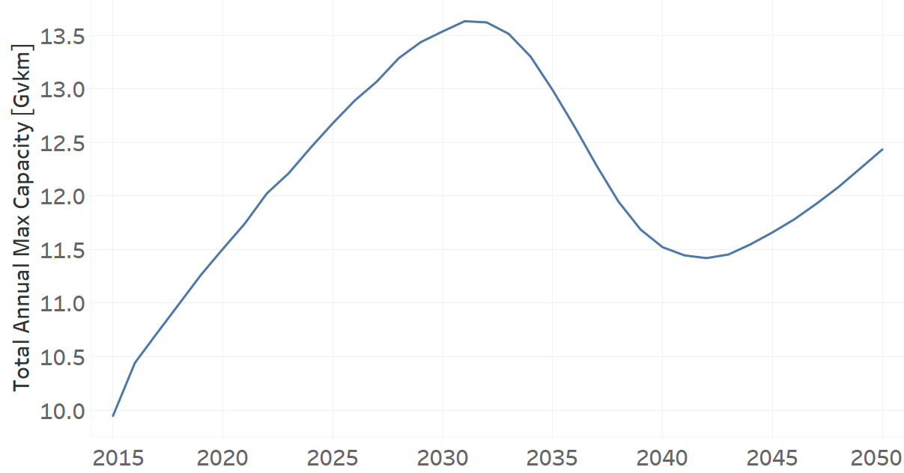
   
   *Figure 2) Total Annual Max Capacity for Techs_LD for the NDP scenario.*

   
TotalTechnologyAnnualActivityLowerLimit[r,t,y]
---------
The figure 3 shows the Total Technology Annual Activity Lower Limit for Techs_LD, for the BAU scenario.

.. figure:: img/Techs_LD_TotalTechnologyAnnualActivityLowerLimit_BAU.png
   :align:   center
   :width:   700 px
   
   *Figure 3) Total Technology Annual Activity Lower Limit for Techs_LD for the BAU scenario.*
   
The figure 4 shows the Total Technology Annual Activity Lower Limit for Techs_LD, for the NDP scenario.

.. figure:: img/Techs_LD_TotalTechnologyAnnualActivityLowerLimit_NDP_OP.png
   :align:   center
   :width:   700 px
   
   *Figure 4) Total Technology Annual Activity Lower Limit for Techs_LD for the NDP scenario.*

   
Light Duty Diesel (existing)
++++++++++

+-------------------------------------------------+-------+--------------+--------------+--------------+--------------+
| .. figure:: img/TRLDDSL.png                                                                                         |
|    :align:   center                                                                                                 |
|    :width:   500 px                                                                                                 |
+-------------------------------------------------+-------+--------------+--------------+--------------+--------------+
| Set codification:                                       |TRLDDSL01                                                  |
+-------------------------------------------------+-------+--------------+--------------+--------------+--------------+
| Description:                                            |Light Duty Diesel (existing)                               |
+-------------------------------------------------+-------+--------------+--------------+--------------+--------------+
| Set:                                                    |Technology                                                 |
+-------------------------------------------------+-------+--------------+--------------+--------------+--------------+
| Parameter                                       | Unit  | 2020         | 2030         | 2040         |  2050        |
+=================================================+=======+==============+==============+==============+==============+
| DistanceDriven[r,t,y]                           |km/year| 14773        | 14773        | 14773        | 14773        |
+-------------------------------------------------+-------+--------------+--------------+--------------+--------------+
| EmissionActivityRatio[r,t,e,m,y] (Accidents)    |   -   | 0.09         | 0.09         | 0.09         | 0.09         |
+-------------------------------------------------+-------+--------------+--------------+--------------+--------------+
| EmissionActivityRatio[r,t,e,m,y] (Congestion)   |   -   | 0.081        | 0.081        | 0.081        | 0.081        |
+-------------------------------------------------+-------+--------------+--------------+--------------+--------------+
| EmissionActivityRatio[r,t,e,m,y] (Health)       |   -   | 0.01         | 0.01         | 0.01         | 0.01         |
+-------------------------------------------------+-------+--------------+--------------+--------------+--------------+
| FixedCost[r,t,y]                                |M$/Gvkm| 49.32        | 49.32        | 49.32        | 49.32        |
+-------------------------------------------------+-------+--------------+--------------+--------------+--------------+
| InputActivityRatio[r,t,f,m,y] (Diesel for       | PJ/   | 2.1945       | 1.9635       | 1.848        | 1.848        |
| private transport)                              | Gvkm  |              |              |              |              |
+-------------------------------------------------+-------+--------------+--------------+--------------+--------------+
| OperationalLife[r,t]                            | Years | 15           | 15           | 15           | 15           |
+-------------------------------------------------+-------+--------------+--------------+--------------+--------------+
| OutputActivityRatio[r,t,f,m,y] (Private         | PJ/   | 1            | 1            | 1            | 1            |
| Transport in Light Duty)                        | Gvkm  |              |              |              |              |
+-------------------------------------------------+-------+--------------+--------------+--------------+--------------+
| ResidualCapacity[r,t,y] (BAU)                   | Gvkm  | 0.3022       | 0.122        | 0            | 0            |
+-------------------------------------------------+-------+--------------+--------------+--------------+--------------+
| ResidualCapacity[r,t,y] (NDP)                   | Gvkm  | 0.3022       | 0.1015       | 0            | 0            |
+-------------------------------------------------+-------+--------------+--------------+--------------+--------------+
| TotalAnnualMaxCapacity[r,t,y] (BAU)             | Gvkm  | 0.3022       | 0.122        | 0            | 0            |
+-------------------------------------------------+-------+--------------+--------------+--------------+--------------+
| TotalAnnualMaxCapacity[r,t,y] (NDP)             | Gvkm  | 0.3022       | 0.1015       | 0            | 0            |
+-------------------------------------------------+-------+--------------+--------------+--------------+--------------+
| TotalTechnologyAnnualActivityLowerLimit[r,t,y]  | Gvkm  | 0.3016       | 0.1217       | 0            | 0            |
| (BAU)                                           |       |              |              |              |              |
+-------------------------------------------------+-------+--------------+--------------+--------------+--------------+
| TotalTechnologyAnnualActivityLowerLimit[r,t,y]  | Gvkm  | 0.3016       | 0.1013       | 0            | 0            |
| (NDP)                                           |       |              |              |              |              |
+-------------------------------------------------+-------+--------------+--------------+--------------+--------------+
| UnitFixedCost[r,t,y]                            |   $   | 728.6044     | 728.6044     | 728.6044     | 728.6044     |
+-------------------------------------------------+-------+--------------+--------------+--------------+--------------+

DistanceDriven[r,t,y]
---------
The equation (1) shows the Distance Driven for TRLDDSL01, for every scenario.

DistanceDriven=14773 [km/year]   (1)

EmissionActivityRatio[r,t,e,m,y]
---------
The equation (2) shows the Emission Activity Ratio for TRLDDSL01, for every scenario and associated to the emission Accidents.

EmissionActivityRatio=0.09    (2)

The equation (3) shows the Emission Activity Ratio for TRLDDSL01, for every scenario and associated to the emission Congestion.

EmissionActivityRatio=0.081    (3)

The equation (4) shows the Emission Activity Ratio for TRLDDSL01, for every scenario and associated to the emission Health.

EmissionActivityRatio=0.01   (4)

FixedCost[r,t,y]
---------
The equation (5) shows the Fixed Cost for TRLDDSL01, for every scenario.

FixedCost=49.32 [M$/Gvkm]   (5)

   
InputActivityRatio[r,t,f,m,y]
---------
The figure 1 shows the Input Activity Ratio for TRLDDSL01, for every scenario and associated to the fuel Diesel for private transport.

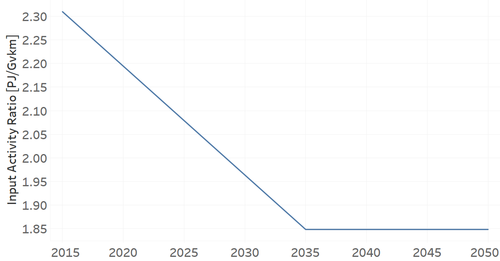
   
   *Figure 1) Input Activity Ratio for TRLDDSL01 for every scenario.*
  
   
OperationalLife[r,t]
---------
The equation (6) shows the Operational Life for TRLDDSL01, for every scenario.

OperationalLife=15 Years   (6)

   
OutputActivityRatio[r,t,f,m,y]
---------
The equation (7) shows the Output Activity Ratio for TRLDDSL01, for every scenario and associated to the fuel Private Transport in Light Duty.

OutputActivityRatio=1 [PJ/Gvkm]   (7)

    
   
ResidualCapacity[r,t,y]
---------
The figure 2 shows the Residual Capacity for TRLDDSL01, for the BAU scenario.

.. figure:: img/TRLDDSL01_ResidualCapacity_BAU.png
   :align:   center
   :width:   700 px
   
   *Figure 2) Residual Capacity for TRLDDSL01 for the BAU scenario.*
   
The figure 3 shows the Residual Capacity for TRLDDSL01, for the NDP scenario.

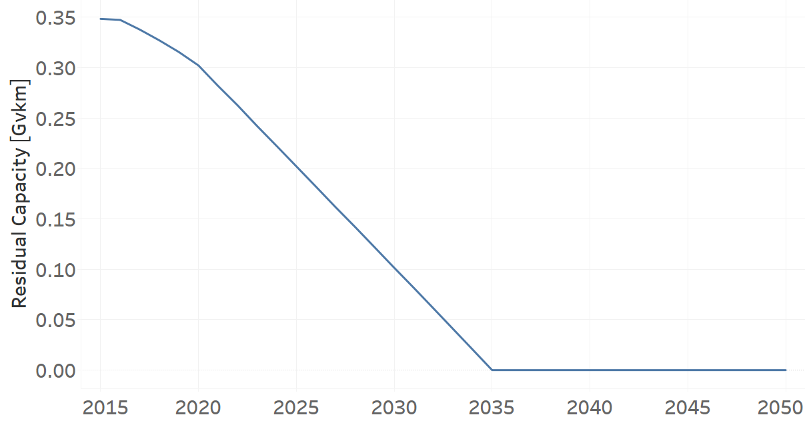
   
   *Figure 3) Residual Capacity for TRLDDSL01 for the NDP scenario.*   
   
      
   
TotalAnnualMaxCapacity[r,t,y]
---------
The figure 4 shows the Total Annual Max Capacity for TRLDDSL01, for the BAU scenario.

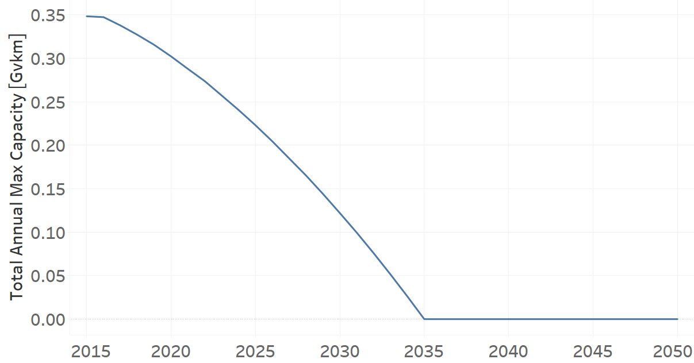
   
   *Figure 4) Total Annual Max Capacity for TRLDDSL01 for the BAU scenario.*
   
The figure 5 shows the Total Annual Max Capacity for TRLDDSL01, for the NDP scenario.

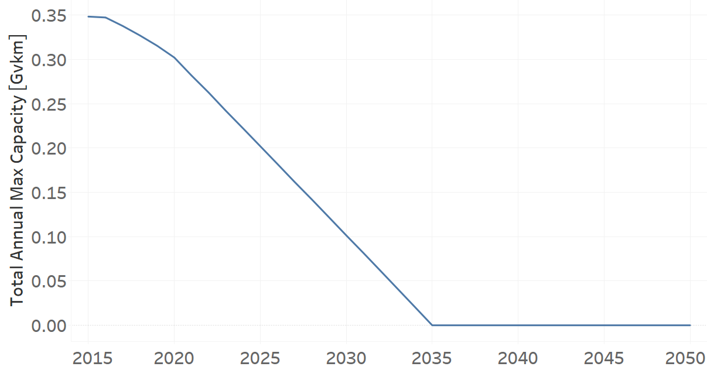
   
   *Figure 5) Total Annual Max Capacity for TRLDDSL01 for the NDP scenario.*   
   

   
TotalTechnologyAnnualActivityLowerLimit[r,t,y]
---------
The figure 6 shows the Total Technology Annual Activity Lower Limit for TRLDDSL01, for the BAU scenario.

.. figure:: img/TRLDDSL01_TotalTechnologyAnnualActivityLowerLimit_BAU.png
   :align:   center
   :width:   700 px
   
   *Figure 6) Total Technology Annual Activity Lower Limit for TRLDDSL01 for the BAU scenario.*
   
The figure 7 shows the Total Technology Annual Activity Lower Limit for TRLDDSL01, for the NDP scenario.

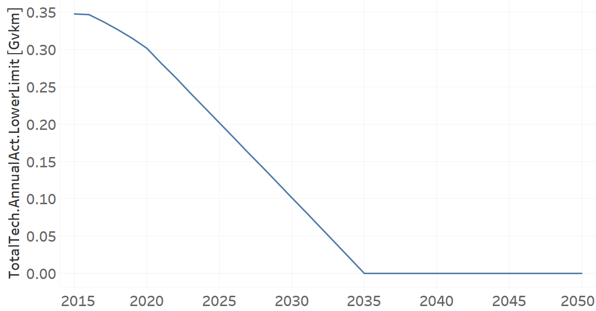
   
   *Figure 7) Total Technology Annual Activity Lower Limit for TRLDDSL01 for the NDP scenario.*

   
UnitFixedCost[r,t,y]
---------
The equation (8) shows the Unit Fixed Cost for TRLDDSL01, for every scenario.

UnitFixedCost=728.6044 [$]   (8)

Light Duty Diesel (new)
+++++++++

+-------------------------------------------------+-------+--------------+--------------+--------------+--------------+
| .. figure:: img/TRLDDSL.png                                                                                         |
|    :align:   center                                                                                                 |
|    :width:   500 px                                                                                                 |
+-------------------------------------------------+-------+--------------+--------------+--------------+--------------+
| Set codification:                                       |TRLDDSL02                                                  |
+-------------------------------------------------+-------+--------------+--------------+--------------+--------------+
| Description:                                            |Light Duty Diesel (new)                                    |
+-------------------------------------------------+-------+--------------+--------------+--------------+--------------+
| Set:                                                    |Technology                                                 |
+-------------------------------------------------+-------+--------------+--------------+--------------+--------------+
| Parameter                                       | Unit  | 2020         | 2030         | 2040         |  2050        |
+=================================================+=======+==============+==============+==============+==============+
| CapitalCost[r,t,y]                              |M$/Gvkm| 1239.09      | 1239.09      | 1239.09      | 1239.09      |
+-------------------------------------------------+-------+--------------+--------------+--------------+--------------+
| DistanceDriven[r,t,y]                           |km/year| 14773        | 14773        | 14773        | 14773        |
+-------------------------------------------------+-------+--------------+--------------+--------------+--------------+
| EmissionActivityRatio[r,t,e,m,y] (Accidents)    |   -   | 0.09         | 0.09         | 0.09         | 0.09         |
+-------------------------------------------------+-------+--------------+--------------+--------------+--------------+
| EmissionActivityRatio[r,t,e,m,y] (Congestion)   |  -    | 0.081        | 0.081        | 0.081        | 0.081        |
+-------------------------------------------------+-------+--------------+--------------+--------------+--------------+
| EmissionActivityRatio[r,t,e,m,y] (Health)       |   -   | 0.01         | 0.01         | 0.01         | 0.01         |
+-------------------------------------------------+-------+--------------+--------------+--------------+--------------+
| FixedCost[r,t,y]                                |M$/Gvkm| 49.32        | 49.32        | 49.32        | 49.32        |
+-------------------------------------------------+-------+--------------+--------------+--------------+--------------+
| InputActivityRatio[r,t,f,m,y] (Diesel for       | PJ/   | 1.748285714  | 1.548857143  | 1.349428571  | 1.15         |
| private transport)                              | Gvkm  |              |              |              |              |
+-------------------------------------------------+-------+--------------+--------------+--------------+--------------+
| OperationalLife[r,t]                            | Years | 15           | 15           | 15           | 15           |
+-------------------------------------------------+-------+--------------+--------------+--------------+--------------+
| OutputActivityRatio[r,t,f,m,y] (Private         | PJ/   | 1            | 1            | 1            | 1            |
| Transport in Light Duty)                        | Gvkm  |              |              |              |              |
+-------------------------------------------------+-------+--------------+--------------+--------------+--------------+
| TotalTechnologyAnnualActivityLowerLimit[r,t,y]  | Gvkm  | 0.1005       | 0.3652       | 0.4944       | 0.5814       |
| (BAU)                                           |       |              |              |              |              |
+-------------------------------------------------+-------+--------------+--------------+--------------+--------------+
| TotalTechnologyAnnualActivityLowerLimit[r,t,y]  | Gvkm  | 0.1005       | 0            | 0            | 0            |
| (NDP)                                           |       |              |              |              |              |
+-------------------------------------------------+-------+--------------+--------------+--------------+--------------+
| UnitCapitalCost[r,t,y]                          |   $   | 18305.0766   | 18305.0766   | 18305.0766   | 18305.0766   |
+-------------------------------------------------+-------+--------------+--------------+--------------+--------------+
| UnitFixedCost[r,t,y]                            |   $   | 728.6044     | 728.6044     | 728.6044     | 728.6044     |
+-------------------------------------------------+-------+--------------+--------------+--------------+--------------+

CapitalCost[r,t,y]
---------
The equation (1) shows the Capital Cost for TRLDDSL02, for every scenario.

CapitalCost=1239.09 [M$/Gvkm]   (1)

DistanceDriven[r,t,y]
---------
The equation (2) shows the Distance Driven for TRLDDSL02, for every scenario.

DistanceDriven=14773 [km/year]   (2)

EmissionActivityRatio[r,t,e,m,y]
---------
The equation (3) shows the Emission Activity Ratio for TRLDDSL02, for every scenario and associated to the emission Accidents.

EmissionActivityRatio=0.09    (3)

The equation (4) shows the Emission Activity Ratio for TRLDDSL02, for every scenario and associated to the emission Congestion.

EmissionActivityRatio=0.081    (4)

The equation (5) shows the Emission Activity Ratio for TRLDDSL02, for every scenario and associated to the emission Health.

EmissionActivityRatio=0.01    (5)

FixedCost[r,t,y]
---------
The equation (6) shows the Fixed Cost for TRLDDSL02, for every scenario.

FixedCost=49.32 [M$/Gvkm]   (6)

   
InputActivityRatio[r,t,f,m,y]
---------
The figure 1 shows the Input Activity Ratio for TRLDDSL02, for every scenario and associated to the fuel Diesel for private transport.

.. figure:: img/TRLDDSL02_InputActivityRatio.png
   :align:   center
   :width:   700 px
   
   *Figure 1) Input Activity Ratio for TRLDDSL02 for every scenario.*

 
   
OperationalLife[r,t]
---------
The equation (7) shows the Operational Life for TRLDDSL02, for every scenario.

OperationalLife=15 Years   (7)

 
   
OutputActivityRatio[r,t,f,m,y]
---------
The equation (8) shows the Output Activity Ratio for TRLDDSL02, for every scenario and associated to the fuel Private Transport in Light Duty.

OutputActivityRatio=1 [PJ/Gvkm]   (8)

     
   
TotalTechnologyAnnualActivityLowerLimit[r,t,y]
---------
The figure 2 shows the Total Technology Annual Activity Lower Limit for TRLDDSL02, for the BAU scenario.

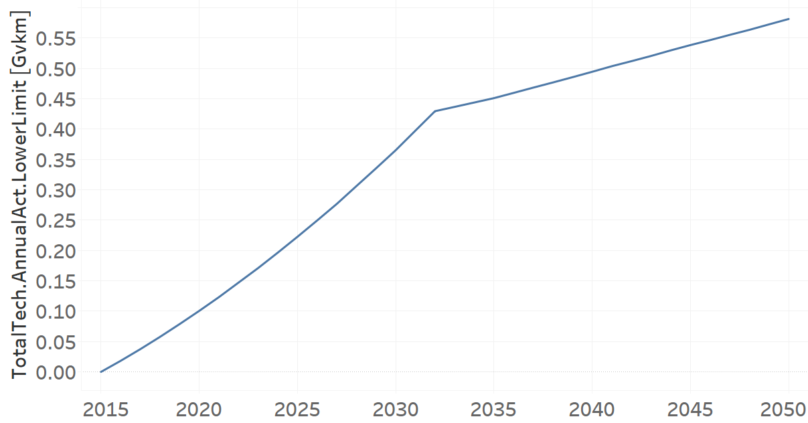
   
   *Figure 2) Total Technology Annual Activity Lower Limit for TRLDDSL02 for the BAU scenario.*
   
The figure 3 shows the Total Technology Annual Activity Lower Limit for TRLDDSL02, for the NDP scenario.

.. figure:: img/TRLDDSL02_TotalTechnologyAnnualActivityLowerLimit_NDP_OP.png
   :align:   center
   :width:   700 px
   
   *Figure 3) Total Technology Annual Activity Lower Limit for TRLDDSL02 for the NDP scenario.*

   
UnitCapitalCost[r,t,y]
---------
The equation (9) shows the Unit Capital Cost for TRLDDSL02, for every scenario.

UnitCapitalCost=18305.0766 [$]   (9)

   
   
UnitFixedCost[r,t,y]
---------
The equation (10) shows the Unit Fixed Cost for TRLDDSL02, for every scenario.

UnitFixedCost=728.6044 [$]   (10)

Light Duty Electric (new)
+++++++++

+-------------------------------------------------+-------+--------------+--------------+--------------+--------------+
| .. figure:: img/TRLDELE.jpg                                                                                         |
|    :align:   center                                                                                                 |
|    :width:   500 px                                                                                                 |
+-------------------------------------------------+-------+--------------+--------------+--------------+--------------+
| Set codification:                                       |TRLDELE02                                                  |
+-------------------------------------------------+-------+--------------+--------------+--------------+--------------+
| Description:                                            |Light Duty Electric (new)                                  |
+-------------------------------------------------+-------+--------------+--------------+--------------+--------------+
| Set:                                                    |Technology                                                 |
+-------------------------------------------------+-------+--------------+--------------+--------------+--------------+
| Parameter                                       | Unit  | 2020         | 2030         | 2040         |  2050        |
+=================================================+=======+==============+==============+==============+==============+
| CapitalCost[r,t,y]                              |M$/Gvkm| 1869.69      | 1389.05      | 1355.9       | 1321.96      |
+-------------------------------------------------+-------+--------------+--------------+--------------+--------------+
| DistanceDriven[r,t,y]                           |km/year| 14773        | 14773        | 14773        | 14773        |
+-------------------------------------------------+-------+--------------+--------------+--------------+--------------+
| EmissionActivityRatio[r,t,e,m,y] (Accidents)    |  -    | 0.09         | 0.09         | 0.09         | 0.09         |
+-------------------------------------------------+-------+--------------+--------------+--------------+--------------+
| EmissionActivityRatio[r,t,e,m,y] (Congestion)   | -     | 0.081        | 0.081        | 0.081        | 0.081        |
+-------------------------------------------------+-------+--------------+--------------+--------------+--------------+
| FixedCost[r,t,y]                                |M$/Gvkm| 16.2756      | 16.2756      | 16.2756      | 16.2756      |
+-------------------------------------------------+-------+--------------+--------------+--------------+--------------+
| InputActivityRatio[r,t,f,m,y] (Electricity for  | PJ/   | 0.54         | 0.54         | 0.54         | 0.54         |
| private transport)                              | Gvkm  |              |              |              |              |
+-------------------------------------------------+-------+--------------+--------------+--------------+--------------+
| OperationalLife[r,t]                            | Years | 12           | 12           | 12           | 12           |
+-------------------------------------------------+-------+--------------+--------------+--------------+--------------+
| OutputActivityRatio[r,t,f,m,y] (Private         | PJ/   | 1            | 1            | 1            | 1            |
| Transport in Light Duty)                        | Gvkm  |              |              |              |              |
+-------------------------------------------------+-------+--------------+--------------+--------------+--------------+
| TotalAnnualMaxCapacity[r,t,y] (BAU)             |  Gvkm | 0.018537874  | 0.246969626  | 0.563077999  | 0.9774765    |
+-------------------------------------------------+-------+--------------+--------------+--------------+--------------+
| TotalAnnualMaxCapacity[r,t,y] (NDP)             |  Gvkm | 0            | 0.9205       | 8.0368       | 11.6944      |
+-------------------------------------------------+-------+--------------+--------------+--------------+--------------+
| TotalTechnologyAnnualActivityLowerLimit[r,t,y]  | Gvkm  | 0.018500835  | 0.24647618   | 0.561952968  | 0.9755235    |
| (BAU)                                           |       |              |              |              |              |
+-------------------------------------------------+-------+--------------+--------------+--------------+--------------+
| TotalTechnologyAnnualActivityLowerLimit[r,t,y]  | Gvkm  | 0            | 0.9185       | 8.0209       | 11.6713      |
| (NDP)                                           |       |              |              |              |              |
+-------------------------------------------------+-------+--------------+--------------+--------------+--------------+
| UnitCapitalCost[r,t,y]                          |   $   | 27620.9304   | 20520.4356   | 20030.7107   | 19529.3151   |
+-------------------------------------------------+-------+--------------+--------------+--------------+--------------+
| UnitFixedCost[r,t,y]                            |   $   | 240.4394     | 240.4394     | 240.4394     | 240.4394     |
+-------------------------------------------------+-------+--------------+--------------+--------------+--------------+

CapitalCost[r,t,y]
---------

The figure 1 shows the Capital Cost for TRLDELE02, for every scenario.

.. figure:: img/TRLDELE02_CapitalCost.png
   :align:   center
   :width:   700 px
   
   *Figure 1) Capital Cost for TRLDELE02 for every scenario.*
   

DistanceDriven[r,t,y]
---------
The equation (1) shows the Distance Driven for TRLDELE02, for every scenario.

DistanceDriven=14773 [km/year]   (1)

EmissionActivityRatio[r,t,e,m,y]
---------
The equation (2) shows the Emission Activity Ratio for TRLDELE02, for every scenario and associated to the emission Accidents.

EmissionActivityRatio=0.09    (2)

The equation (3) shows the Emission Activity Ratio for TRLDELE02, for every scenario and associated to the emission Congestion.

EmissionActivityRatio=0.081    (3)

FixedCost[r,t,y]
---------
The equation (4) shows the Fixed Cost for TRLDELE02, for every scenario.

FixedCost=16.2756 [M$/Gvkm]   (4)

   
InputActivityRatio[r,t,f,m,y]
---------
The equation (5) shows the Input Activity Ratio for TRLDELE02, for every scenario and associated to the fuel Electricity for private transport. 

InputActivityRatio=0.54 [PJ/Gvkm]   (5)

   
OperationalLife[r,t]
---------
The equation (6) shows the Operational Life for TRLDELE02, for every scenario.

OperationalLife=12 Years   (6)

 
   
OutputActivityRatio[r,t,f,m,y]
---------
The equation (7) shows the Output Activity Ratio for TRLDELE02, for every scenario and associated to the fuel Private Transport in Light Duty.

OutputActivityRatio=1 [PJ/Gvkm]   (7)

   
TotalAnnualMaxCapacity[r,t,y]
---------
The figure 2 shows the Total Annual Max Capacity for TRLDELE02, for the BAU scenario.

.. figure:: img/TRLDELE02_TotalAnnualMaxCapacity_BAU.png
   :align:   center
   :width:   700 px
   
   *Figure 2) Total Annual Max Capacity for TRLDELE02 for the BAU scenario.*
   
The figure 3 shows the Total Annual Max Capacity for TRLDELE02, for the NDP scenario.

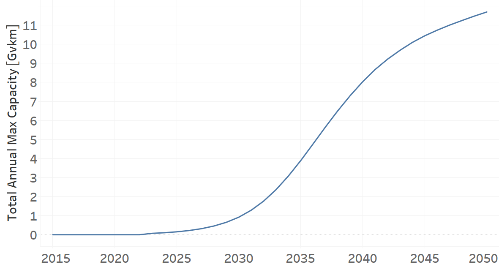
   
   *Figure 3) Total Annual Max Capacity for TRLDELE02 for the NDP scenario.*

   
   
TotalTechnologyAnnualActivityLowerLimit[r,t,y]
---------
The figure 4 shows the Total Technology Annual Activity Lower Limit for TRLDELE02, for the BAU scenario.

.. figure:: img/TRLDELE02_TotalTechnologyAnnualActivityLowerLimit_BAU.png
   :align:   center
   :width:   700 px
   
   *Figure 4) Total Technology Annual Activity Lower Limit for TRLDELE02 for the BAU scenario.*

The figure 5 shows the Total Technology Annual Activity Lower Limit for TRLDELE02, for the NDP scenario.

.. figure:: img/TRLDELE02_TotalTechnologyAnnualActivityLowerLimit_NDP_OP.png
   :align:   center
   :width:   700 px
   
   *Figure 5) Total Technology Annual Activity Lower Limit for TRLDELE02 for the NDP scenario.*

   
UnitCapitalCost[r,t,y]
---------
The figure 6 shows the Unit Capital Cost for TRLDELE02, for every scenario.

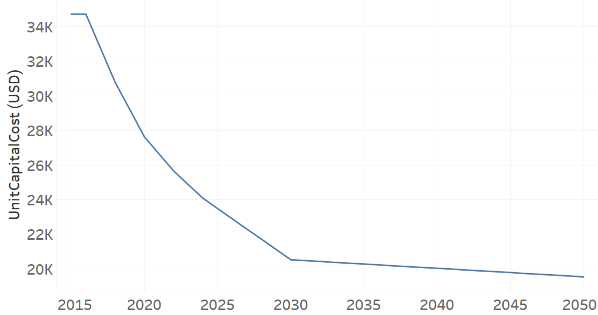
   
   *Figure 6) Unit Capital Cost for TRLDELE02 for every scenario.*

   
   
UnitFixedCost[r,t,y]
---------
The equation (8) shows the Unit Fixed Cost for TRLDELE02, for every scenario.

UnitFixedCost=240.4394 [$]   (8)

Light Duty Gasoline (existing)
+++++++++

+-------------------------------------------------+-------+--------------+--------------+--------------+--------------+
| .. figure:: img/TRLDGAS.jpg                                                                                         |
|    :align:   center                                                                                                 |
|    :width:   500 px                                                                                                 |
+-------------------------------------------------+-------+--------------+--------------+--------------+--------------+
| Set codification:                                       |TRLDGAS01                                                  |
+-------------------------------------------------+-------+--------------+--------------+--------------+--------------+
| Description:                                            |Light Duty Gasoline (existing)                             |
+-------------------------------------------------+-------+--------------+--------------+--------------+--------------+
| Set:                                                    |Technology                                                 |
+-------------------------------------------------+-------+--------------+--------------+--------------+--------------+
| Parameter                                       | Unit  | 2020         | 2030         | 2040         |  2050        |
+=================================================+=======+==============+==============+==============+==============+
| DistanceDriven[r,t,y]                           |km/year| 14773        | 14773        | 14773        | 14773        |
+-------------------------------------------------+-------+--------------+--------------+--------------+--------------+
| EmissionActivityRatio[r,t,e,m,y] (Accidents)    |   -   | 0.09         | 0.09         | 0.09         | 0.09         |
+-------------------------------------------------+-------+--------------+--------------+--------------+--------------+
| EmissionActivityRatio[r,t,e,m,y] (Congestion)   |   -   | 0.081        | 0.081        | 0.081        | 0.081        |
+-------------------------------------------------+-------+--------------+--------------+--------------+--------------+
| FixedCost[r,t,y]                                |M$/Gvkm| 49.32        | 49.32        | 49.32        | 49.32        |
+-------------------------------------------------+-------+--------------+--------------+--------------+--------------+
| InputActivityRatio[r,t,f,m,y] (Gasoline for     | PJ/   | 2.299        | 2.057        | 1.936        | 1.936        |
| private transport)                              | Gvkm  |              |              |              |              |
+-------------------------------------------------+-------+--------------+--------------+--------------+--------------+
| OperationalLife[r,t]                            | Years | 15           | 15           | 15           | 15           |
+-------------------------------------------------+-------+--------------+--------------+--------------+--------------+
| OutputActivityRatio[r,t,f,m,y] (Private         | PJ/   | 1            | 1            | 1            | 1            |
| Transport in Light Duty)                        | Gvkm  |              |              |              |              |
+-------------------------------------------------+-------+--------------+--------------+--------------+--------------+
| ResidualCapacity[r,t,y] (BAU)                   | Gvkm  | 8.325        | 3.3599       | 0            | 0            |
+-------------------------------------------------+-------+--------------+--------------+--------------+--------------+
| ResidualCapacity[r,t,y] (NDP)                   | Gvkm  | 8.325        | 2.7974       | 0            | 0            |
+-------------------------------------------------+-------+--------------+--------------+--------------+--------------+
| TotalAnnualMaxCapacity[r,t,y] (BAU)             | Gvkm  | 8.325        | 3.3599       | 0            | 0            |
+-------------------------------------------------+-------+--------------+--------------+--------------+--------------+
| TotalAnnualMaxCapacity[r,t,y] (NDP)             | Gvkm  | 8.325        | 2.7974       | 0            | 0            |
+-------------------------------------------------+-------+--------------+--------------+--------------+--------------+
| TotalTechnologyAnnualActivityLowerLimit[r,t,y]  | Gvkm  | 8.3083       | 3.3532       | 0            | 0            |
| (BAU)                                           |       |              |              |              |              |
+-------------------------------------------------+-------+--------------+--------------+--------------+--------------+
| TotalTechnologyAnnualActivityLowerLimit[r,t,y]  | Gvkm  | 8.3083       | 2.7918       | 0            | 0            |
| (NDP)                                           |       |              |              |              |              |
+-------------------------------------------------+-------+--------------+--------------+--------------+--------------+
| UnitFixedCost[r,t,y]                            |  $    | 728.6044     | 728.6044     | 728.6044     | 728.6044     |
+-------------------------------------------------+-------+--------------+--------------+--------------+--------------+

DistanceDriven[r,t,y]
---------
The equation (1) shows the Distance Driven for TRLDGAS01, for every scenario.

DistanceDriven=14773 [km/year]   (1)

EmissionActivityRatio[r,t,e,m,y]
---------
The equation (2) shows the Emission Activity Ratio for TRLDGAS01, for every scenario and associated to the emission Accidents.

EmissionActivityRatio=0.09    (2)

The equation (3) shows the Emission Activity Ratio for TRLDGAS01, for every scenario and associated to the emission Congestion.

EmissionActivityRatio=0.081    (3)

FixedCost[r,t,y]
---------
The equation (4) shows the Fixed Cost for TRLDGAS01, for every scenario.

FixedCost=49.32 [M$/Gvkm]   (4)

   
InputActivityRatio[r,t,f,m,y]
---------
The figure 1 shows the Input Activity Ratio for TRLDGAS01, for every scenario and associated to the fuel Gasoline for private transport.

.. figure:: img/TRLDGAS01_InputActivityRatio.png
   :align:   center
   :width:   700 px
   
   *Figure 1) Input Activity Ratio for TRLDGAS01 for every scenario.*

   
OperationalLife[r,t]
---------
The equation (5) shows the Operational Life for TRLDGAS01, for every scenario.

OperationalLife=15 Years   (5)

   
OutputActivityRatio[r,t,f,m,y]
---------
The equation (6) shows the Output Activity Ratio for TRLDGAS01, for every scenario and associated to the fuel Private Transport in Light Duty.

OutputActivityRatio=1 [PJ/Gvkm]   (6)

    
   
ResidualCapacity[r,t,y]
---------
The figure 2 shows the Residual Capacity for TRLDGAS01, for the BAU scenario.

.. figure:: img/TRLDGAS01_ResidualCapacity_BAU.png
   :align:   center
   :width:   700 px
   
   *Figure 2) Residual Capacity for TRLDGAS01 for the BAU scenario.*
   
The figure 3 shows the Residual Capacity for TRLDGAS01, for the NDP scenario.

.. figure:: img/TRLDGAS01_ResidualCapacity_NDP_OP.png
   :align:   center
   :width:   700 px
   
   *Figure 3) Residual Capacity for TRLDGAS01 for the NDP scenario.*   
   
     
   
TotalAnnualMaxCapacity[r,t,y]
---------
The figure 4 shows the Total Annual Max Capacity for TRLDGAS01, for the BAU scenario.

   
   *Figure 4) Total Annual Max Capacity for TRLDGAS01 for the BAU scenario.*
   
The figure 5 shows the Total Annual Max Capacity for TRLDGAS01, for the NDP scenario.

   
   *Figure 5) Total Annual Max Capacity for TRLDGAS01 for the NDP scenario.*   
   

   
TotalTechnologyAnnualActivityLowerLimit[r,t,y]
---------
The figure 6 shows the Total Technology Annual Activity Lower Limit for TRLDGAS01, for the BAU scenario.

.. figure:: img/TRLDGAS01_TotalTechnologyAnnualActivityLowerLimit_BAU.png
   :align:   center
   :width:   700 px
   
   *Figure 6) Total Technology Annual Activity Lower Limit for TRLDGAS01 for the BAU scenario.*
   
The figure 7 shows the Total Technology Annual Activity Lower Limit for TRLDGAS01, for the NDP scenario.

.. figure:: img/TRLDGAS01_TotalTechnologyAnnualActivityLowerLimit_NDP_OP.png
   :align:   center
   :width:   700 px
   
   *Figure 7) Total Technology Annual Activity Lower Limit for TRLDGAS01 for the NDP scenario.*

   
UnitFixedCost[r,t,y]
---------
The equation (7) shows the Unit Fixed Cost for TRLDGAS01, for every scenario.

UnitFixedCost=728.6044 [$]   (7)

   
   
Light Duty Gasoline (new)
+++++++++

+-------------------------------------------------+-------+--------------+--------------+--------------+--------------+
| .. figure:: img/TRLDGAS.jpg                                                                                         |
|    :align:   center                                                                                                 |
|    :width:   500 px                                                                                                 |
+-------------------------------------------------+-------+--------------+--------------+--------------+--------------+
| Set codification:                                       |TRLDGAS02                                                  |
+-------------------------------------------------+-------+--------------+--------------+--------------+--------------+
| Description:                                            |Light Duty Gasoline (new)                                  |
+-------------------------------------------------+-------+--------------+--------------+--------------+--------------+
| Set:                                                    |Technology                                                 |
+-------------------------------------------------+-------+--------------+--------------+--------------+--------------+
| Parameter                                       | Unit  | 2020         | 2030         | 2040         |  2050        |
+=================================================+=======+==============+==============+==============+==============+
| CapitalCost[r,t,y]                              |M$/Gvkm| 1127.02      | 1127.02      | 1127.02      | 1127.02      |
+-------------------------------------------------+-------+--------------+--------------+--------------+--------------+
| DistanceDriven[r,t,y]                           |km/year| 14773        | 14773        | 14773        | 14773        |
+-------------------------------------------------+-------+--------------+--------------+--------------+--------------+
| EmissionActivityRatio[r,t,e,m,y] (Accidents)    |   -   | 0.09         | 0.09         | 0.09         | 0.09         |
+-------------------------------------------------+-------+--------------+--------------+--------------+--------------+
| EmissionActivityRatio[r,t,e,m,y] (Congestion)   |  -    | 0.081        | 0.081        | 0.081        | 0.081        |
+-------------------------------------------------+-------+--------------+--------------+--------------+--------------+
| FixedCost[r,t,y]                                |M$/Gvkm| 49.32        | 49.32        | 49.32        | 49.32        |
+-------------------------------------------------+-------+--------------+--------------+--------------+--------------+
| InputActivityRatio[r,t,f,m,y] (Gasoline for     | PJ/   | 1.862285714  | 1.714857143  | 1.567428571  | 1.42         |
| private transport)                              | Gvkm  |              |              |              |              |
+-------------------------------------------------+-------+--------------+--------------+--------------+--------------+
| OperationalLife[r,t]                            | Years | 15           | 15           | 15           | 15           |
+-------------------------------------------------+-------+--------------+--------------+--------------+--------------+
| OutputActivityRatio[r,t,f,m,y] (Private         | PJ/   | 1            | 1            | 1            | 1            |
| Transport in Light Duty)                        | Gvkm  |              |              |              |              |
+-------------------------------------------------+-------+--------------+--------------+--------------+--------------+
| TotalTechnologyAnnualActivityLowerLimit[r,t,y]  | Gvkm  | 2.7699       | 10.0643      | 13.622       | 16.019       |
| (BAU)                                           |       |              |              |              |              |
+-------------------------------------------------+-------+--------------+--------------+--------------+--------------+
| TotalTechnologyAnnualActivityLowerLimit[r,t,y]  | Gvkm  | 2.7699       | 0            | 0            | 0            |
| (NDP)                                           |       |              |              |              |              |
+-------------------------------------------------+-------+--------------+--------------+--------------+--------------+
| UnitCapitalCost[r,t,y]                          |   $   | 16649.4665   | 16649.4665   | 16649.4665   | 16649.4665   |
+-------------------------------------------------+-------+--------------+--------------+--------------+--------------+
| UnitFixedCost[r,t,y]                            |   $   | 728.6044     | 728.6044     | 728.6044     | 728.6044     |
+-------------------------------------------------+-------+--------------+--------------+--------------+--------------+

CapitalCost[r,t,y]
---------
The equation (1) shows the Capital Cost for TRLDGAS02, for every scenario.

CapitalCost=1127.02 [M$/Gvkm]   (1)

DistanceDriven[r,t,y]
---------
The equation (2) shows the Distance Driven for TRLDGAS02, for every scenario.

DistanceDriven=14773 [km/year]   (2)

EmissionActivityRatio[r,t,e,m,y]
---------
The equation (3) shows the Emission Activity Ratio for TRLDGAS02, for every scenario and associated to the emission Accidents.

EmissionActivityRatio=0.09    (3)

The equation (4) shows the Emission Activity Ratio for TRLDGAS02, for every scenario and associated to the emission Congestion.

EmissionActivityRatio=0.081    (4)

FixedCost[r,t,y]
---------
The equation (5) shows the Fixed Cost for TRLDGAS02, for every scenario.

FixedCost=49.32 [M$/Gvkm]   (5)

   
InputActivityRatio[r,t,f,m,y]
---------
The figure 1 shows the Input Activity Ratio for TRLDGAS02, for every scenario and associated to the fuel Gasoline for private transport.

.. figure:: img/TRLDGAS02_InputActivityRatio.png
   :align:   center
   :width:   700 px
   
   *Figure 1) Input Activity Ratio for TRLDGAS02 for every scenario.*

   
OperationalLife[r,t]
---------
The equation (6) shows the Operational Life for TRLDGAS02, for every scenario.

OperationalLife=15 Years   (6)

 
   
OutputActivityRatio[r,t,f,m,y]
---------
The equation (7) shows the Output Activity Ratio for TRLDGAS02, for every scenario and associated to the fuel Private Transport in Light Duty.

OutputActivityRatio=1 [PJ/Gvkm]   (7)

    
   
TotalTechnologyAnnualActivityLowerLimit[r,t,y]
---------
The figure 2 shows the Total Technology Annual Activity Lower Limit for TRLDGAS02, for the BAU scenario.

.. figure:: img/TRLDGAS02_TotalTechnologyAnnualActivityLowerLimit_BAU.png
   :align:   center
   :width:   700 px
   
   *Figure 2) Total Technology Annual Activity Lower Limit for TRLDGAS02 for the BAU scenario.*
   
The figure 3 shows the Total Technology Annual Activity Lower Limit for TRLDGAS02, for the NDP scenario.

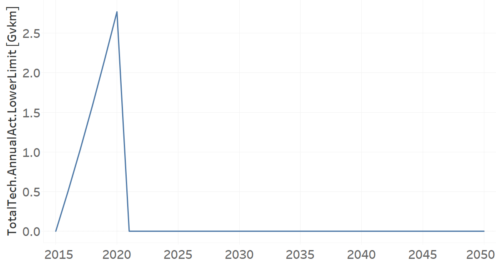
   
   *Figure 3) Total Technology Annual Activity Lower Limit for TRLDGAS02 for the NDP scenario.*

   
UnitCapitalCost[r,t,y]
---------
The equation (8) shows the Unit Capital Cost for TRLDGAS02, for every scenario.

UnitCapitalCost=16649.4665 [$]   (8)

   
   
UnitFixedCost[r,t,y]
---------
The equation (9) shows the Unit Fixed Cost for TRLDGAS02, for every scenario.

UnitFixedCost=728.6044 [$]   (9)

Light Hybrid Electric-Gasoline (new)
+++++++++

+-------------------------------------------------+-------+--------------+--------------+--------------+--------------+
| .. figure:: img/TRLDHYBG.jpg                                                                                        |
|    :align:   center                                                                                                 |
|    :width:   500 px                                                                                                 |
+-------------------------------------------------+-------+--------------+--------------+--------------+--------------+
| Set codification:                                       |TRLDHYBG02                                                 |
+-------------------------------------------------+-------+--------------+--------------+--------------+--------------+
| Description:                                            |Light Hybrid Electric-Gasoline (new)                       |
+-------------------------------------------------+-------+--------------+--------------+--------------+--------------+
| Set:                                                    |Technology                                                 |
+-------------------------------------------------+-------+--------------+--------------+--------------+--------------+
| Parameter                                       | Unit  | 2020         | 2030         | 2040         |  2050        |
+=================================================+=======+==============+==============+==============+==============+
| CapitalCost[r,t,y]                              |M$/Gvkm| 2039.37      | 2039.37      | 2039.37      | 2039.37      |
+-------------------------------------------------+-------+--------------+--------------+--------------+--------------+
| DistanceDriven[r,t,y]                           |km/year| 14773        | 14773        | 14773        | 14773        |
+-------------------------------------------------+-------+--------------+--------------+--------------+--------------+
| EmissionActivityRatio[r,t,e,m,y] (Accidents)    |   -   | 0.09         | 0.09         | 0.09         | 0.09         |
+-------------------------------------------------+-------+--------------+--------------+--------------+--------------+
| EmissionActivityRatio[r,t,e,m,y] (Congestion)   |  -    | 0.081        | 0.081        | 0.081        | 0.081        |
+-------------------------------------------------+-------+--------------+--------------+--------------+--------------+
| FixedCost[r,t,y]                                |M$/Gvkm| 24.66        | 24.66        | 24.66        | 24.66        |
+-------------------------------------------------+-------+--------------+--------------+--------------+--------------+
| InputActivityRatio[r,t,f,m,y] (Electricity for  | PJ/   | 0.42         | 0.42         | 0.42         | 0.42         |
| private transport)                              | Gvkm  |              |              |              |              |
+-------------------------------------------------+-------+--------------+--------------+--------------+--------------+
| InputActivityRatio[r,t,f,m,y] (Gasoline for     | PJ/   | 0.42         | 0.42         | 0.42         | 0.42         | 
| private transport)                              | Gvkm  |              |              |              |              |
+-------------------------------------------------+-------+--------------+--------------+--------------+--------------+
| OperationalLife[r,t]                            | Years | 12           | 12           | 12           | 12           |
+-------------------------------------------------+-------+--------------+--------------+--------------+--------------+
| OutputActivityRatio[r,t,f,m,y] (Private         | PJ/   | 1            | 1            | 1            | 1            |
| Transport in Four Wheel Drive)                  | Gvkm  |              |              |              |              |
+-------------------------------------------------+-------+--------------+--------------+--------------+--------------+
| TotalAnnualMaxCapacity[r,t,y] (BAU)             | Gvkm  | 0.009259677  | 0.123361452  | 0.281257742  | 0.48825      |
+-------------------------------------------------+-------+--------------+--------------+--------------+--------------+
| UnitCapitalCost[r,t,y]                          |  $    | 30127.613    | 30127.613    | 30127.613    | 30127.613    |
+-------------------------------------------------+-------+--------------+--------------+--------------+--------------+
| UnitFixedCost[r,t,y]                            |  $    | 364.3022     | 364.3022     | 364.3022     | 364.3022     |
+-------------------------------------------------+-------+--------------+--------------+--------------+--------------+

CapitalCost[r,t,y]
--------
The equation (1) shows the Capital Cost for TRLDHYBG02, for every scenario.

CapitalCost=2039.37 [M$/Gvkm]   (1)

 

DistanceDriven[r,t,y]
--------
The equation (2) shows the Distance Driven for TRLDHYBG02, for every scenario.

DistanceDriven=14773 [km/year]   (2)

EmissionActivityRatio[r,t,e,m,y]
--------
The equation (3) shows the Emission Activity Ratio for TRLDHYBG02, for every scenario and associated to the emission Accidents.

EmissionActivityRatio=0.09    (3)

The equation (4) shows the Emission Activity Ratio for TRLDHYBG02, for every scenario and associated to the emission Congestion.

EmissionActivityRatio=0.081    (4)

FixedCost[r,t,y]
--------
The equation (5) shows the Fixed Cost for TRLDHYBG02, for every scenario.

FixedCost=24.66 [M$/Gvkm]   (5)

   

InputActivityRatio[r,t,f,m,y]
--------
The equation (6) shows the Input Activity Ratio for TRLDHYBG02, for every scenario and associated to the fuel Electricity for public transport and Gasoline for public transport. 

InputActivityRatio=0.42 [PJ/Gvkm]   (6)

 
   
OperationalLife[r,t]
--------
The equation (7) shows the Operational Life for TRLDHYBG02, for every scenario.

OperationalLife=12 Years   (7)

  
   
OutputActivityRatio[r,t,f,m,y]
--------
The equation (8) shows the Output Activity Ratio for TRLDHYBG02, for every scenario and associated to the fuel Private Transport in Light Duty.

OutputActivityRatio=1 [PJ/Gvkm]   (8)

  
   
TotalAnnualMaxCapacity[r,t,y]
--------
The figure 1 shows the Total Annual Max Capacity for TRLDHYBG02, for the BAU scenario.

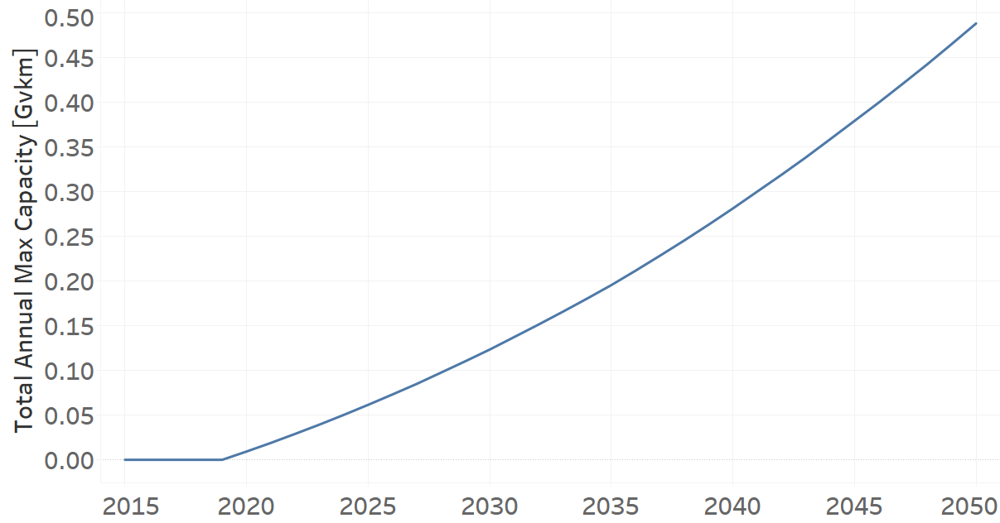
   
   *Figure 1) Total Annual Max Capacity for TRLDHYBG02 for the BAU scenario.*

   
UnitCapitalCost[r,t,y]
--------
The equation (9) shows the Unit Capital Cost for TRLDHYBG02, for every scenario.

UnitCapitalCost=30127.613 [$]   (9)

   
   
UnitFixedCost[r,t,y]
--------
The equation (10) shows the Unit Fixed Cost for TRLDHYBG02, for every scenario.

UnitFixedCost=364.3022 [$]   (10)

Light Plug-in Hybrid Electric-Gasoline (new)
++++++++

+-------------------------------------------------+-------+--------------+--------------+--------------+--------------+
| .. figure:: img/TRLDPHYBG.PNG                                                                                       |
|    :align:   center                                                                                                 |
|    :width:   500 px                                                                                                 |
+-------------------------------------------------+-------+--------------+--------------+--------------+--------------+
| Set codification:                                       |TRLDPHYBG02                                                |
+-------------------------------------------------+-------+--------------+--------------+--------------+--------------+
| Description:                                            |Light Plug-in Hybrid Electric-Gasoline  (new)              |
+-------------------------------------------------+-------+--------------+--------------+--------------+--------------+
| Set:                                                    |Technology                                                 |
+-------------------------------------------------+-------+--------------+--------------+--------------+--------------+
| Parameter                                       | Unit  | 2020         | 2030         | 2040         |  2050        |
+=================================================+=======+==============+==============+==============+==============+
| CapitalCost[r,t,y]                              |M$/Gvkm| 1869.69      | 1389.05      | 1355.9       | 1321.96      |
+-------------------------------------------------+-------+--------------+--------------+--------------+--------------+
| DistanceDriven[r,t,y]                           |km/year| 14773        | 14773        | 14773        | 14773        |
+-------------------------------------------------+-------+--------------+--------------+--------------+--------------+
| EmissionActivityRatio[r,t,e,m,y] (Accidents)    |   -   | 0.09         | 0.09         | 0.09         | 0.09         |
+-------------------------------------------------+-------+--------------+--------------+--------------+--------------+
| EmissionActivityRatio[r,t,e,m,y] (Congestion)   |  -    | 0.081        | 0.081        | 0.081        | 0.081        |
+-------------------------------------------------+-------+--------------+--------------+--------------+--------------+
| FixedCost[r,t,y]                                |M$/Gvkm| 24.66        | 24.66        | 24.66        | 24.66        |
+-------------------------------------------------+-------+--------------+--------------+--------------+--------------+
| InputActivityRatio[r,t,f,m,y] (Electricity for  | PJ/   | 0.29         | 0.29         | 0.29         | 0.29         |
| private transport)                              | Gvkm  |              |              |              |              |
+-------------------------------------------------+-------+--------------+--------------+--------------+--------------+
| InputActivityRatio[r,t,f,m,y] (Gasoline for     | PJ/   | 0.29         | 0.29         | 0.29         | 0.29         | 
| private transport)                              | Gvkm  |              |              |              |              |
+-------------------------------------------------+-------+--------------+--------------+--------------+--------------+
| OperationalLife[r,t]                            | Years | 12           | 12           | 12           | 12           |
+-------------------------------------------------+-------+--------------+--------------+--------------+--------------+
| OutputActivityRatio[r,t,f,m,y] (Private         | PJ/   | 1            | 1            | 1            | 1            |
| Transport in Light Duty)                        | Gvkm  |              |              |              |              |
+-------------------------------------------------+-------+--------------+--------------+--------------+--------------+
| TotalAnnualMaxCapacity[r,t,y] (BAU)             | Gvkm  | 0.009259677  | 0.123361452  | 0.281257742  | 0.48825      |
+-------------------------------------------------+-------+--------------+--------------+--------------+--------------+
| UnitCapitalCost[r,t,y]                          |  $    | 27620.9304   | 20520.4356   | 20030.7107   | 19529.3151   |
+-------------------------------------------------+-------+--------------+--------------+--------------+--------------+
| UnitFixedCost[r,t,y]                            |  $    | 364.3022     | 364.3022     | 364.3022     | 364.3022     |
+-------------------------------------------------+-------+--------------+--------------+--------------+--------------+

CapitalCost[r,t,y]
--------
The figure 1 shows the Capital Cost for TRLDPHYBG02, for every scenario.

   
   *Figure 1) Capital Cost for TRLDPHYBG02 for every scenario.*

DistanceDriven[r,t,y]
--------
The equation (1) shows the Distance Driven for TRLDPHYBG02, for every scenario.

DistanceDriven=14773 [km/year]   (1)

EmissionActivityRatio[r,t,e,m,y]
--------
The equation (2) shows the Emission Activity Ratio for TRLDPHYBG02, for every scenario and associated to the emission Accidents.

EmissionActivityRatio=0.09    (2)

The equation (3) shows the Emission Activity Ratio for TRLDPHYBG02, for every scenario and associated to the emission Congestion.

EmissionActivityRatio=0.081    (3)

FixedCost[r,t,y]
--------
The equation (4) shows the Fixed Cost for TRLDPHYBG02, for every scenario.

FixedCost=24.66 [M$/Gvkm]   (4)

   
InputActivityRatio[r,t,f,m,y]
--------
The equation (5) shows the Input Activity Ratio for TRLDPHYBG02, for every scenario and associated to the fuel Electricity for public transport and Gasoline for public transport. 

InputActivityRatio=0.29 [PJ/Gvkm]   (5)

 
   
OperationalLife[r,t]
--------
The equation (6) shows the Operational Life for TRLDPHYBG02, for every scenario.

OperationalLife=12 Years   (6)

 
   
OutputActivityRatio[r,t,f,m,y]
--------
The equation (7) shows the Output Activity Ratio for TRLDPHYBG02, for every scenario and associated to the fuel Private Transport in Light Duty.

OutputActivityRatio=1 [PJ/Gvkm]   (7)

     
   
TotalAnnualMaxCapacity[r,t,y]
--------
The figure 2 shows the Total Annual Max Capacity for TRLDPHYBG02, for the BAU scenario.

.. figure:: img/TRLDPHYBG02_TotalAnnualMaxCapacity.png
   :align:   center
   :width:   700 px
   
   *Figure 2) Total Annual Max Capacity for TRLDPHYBG02 for the BAU scenario.*

   
UnitCapitalCost[r,t,y]
--------
The figure 3 shows the Unit Capital Cost for TRLDPHYBG02, for every scenario.

.. figure:: img/TRLDPHYBG02_UnitCapitalCost.png
   :align:   center
   :width:   700 px
   
   *Figure 3) Unit Capital Cost for TRLDPHYBG02 for every scenario.*

   
   
UnitFixedCost[r,t,y]
--------
The equation (8) shows the Unit Fixed Cost for TRLDPHYBG02, for every scenario.

UnitFixedCost=364.3022 [$]   (8)

   
