Microbuses
================================

Microbuses (Grouping Technology) 
+++++++++

+-------------------------------------------------+-------+--------------+--------------+--------------+--------------+
| .. figure:: img/Techs_Microbuses.jpg                                                                                |
|    :align:   center                                                                                                 |
|    :width:   500 px                                                                                                 |
+-------------------------------------------------+-------+--------------+--------------+--------------+--------------+
| Set codification:                                       |Techs_Microbuses                                           |
+-------------------------------------------------+-------+--------------+--------------+--------------+--------------+
| Description:                                            |Minbus                                                     |
+-------------------------------------------------+-------+--------------+--------------+--------------+--------------+
| Set:                                                    |Technology                                                 |
+-------------------------------------------------+-------+--------------+--------------+--------------+--------------+
| Parameter                                       | Unit  | 2020         | 2030         | 2040         |  2050        |
+=================================================+=======+==============+==============+==============+==============+
| DistanceDriven[r,t,y]                           |km/year| 25847        | 25847        | 25847        | 25847        |
+-------------------------------------------------+-------+--------------+--------------+--------------+--------------+
| InputActivityRatio[r,t,f,m,y] (Public           | Gpkm/ | 1            | 1            | 1            | 1            |
| Transport in Microbuses)                        | Gvkm  |              |              |              |              |
+-------------------------------------------------+-------+--------------+--------------+--------------+--------------+
| OperationalLife[r,t]                            | Years | 1            | 1            | 1            | 1            |
+-------------------------------------------------+-------+--------------+--------------+--------------+--------------+
| OutputActivityRatio[r,t,f,m,y] (Transport Demand| Gpkm/ | 8.43         | 8.43         | 8.43         | 8.43         |
| Passenger Public)                               | Gvkm  |              |              |              |              |
+-------------------------------------------------+-------+--------------+--------------+--------------+--------------+
| TotalAnnualMaxCapacity[r,t,y] (BAU)             | Gvkm  | 0.4173       | 0.5212       | 0.6243       | 0.723        |
+-------------------------------------------------+-------+--------------+--------------+--------------+--------------+
| TotalAnnualMaxCapacity[r,t,y] (NDP)             | Gvkm  | 0.4173       | 0.5302       | 0.8148       | 0.975        |
+-------------------------------------------------+-------+--------------+--------------+--------------+--------------+
| TotalTechnologyAnnualActivityLowerLimit[r,t,y]  | Gvkm  | 0.4165       | 0.5202       | 0.6231       | 0.7216       |
| (BAU)                                           |       |              |              |              |              |
+-------------------------------------------------+-------+--------------+--------------+--------------+--------------+
| TotalTechnologyAnnualActivityLowerLimit[r,t,y]  | Gvkm  | 0.4166       | 0.5291       | 0.8131       | 0.9735       |
| (NDP)                                           |       |              |              |              |              |
+-------------------------------------------------+-------+--------------+--------------+--------------+--------------+

DistanceDriven[r,t,y]
---------
The equation (1) shows the Distance Driven for Techs_Microbuses, for every scenario.

DistanceDriven=25847 [km/year]   (1)

Source:
   This is the source. 
   
Description: 
   This is the description. 
   
InputActivityRatio[r,t,f,m,y]
---------
The equation (2) shows the Input Activity Ratio for Techs_Microbuses, for every scenario and associated to the fuel Public Transport in Minibus.

InputActivityRatio=1   [Gpkm/Gvkm]   (2)

Source:
   This is the source. 
   
Description: 
   This is the description.
   
OperationalLife[r,t]
---------
The equation (3) shows the Operational Life for Techs_Microbuses, for every scenario.

OperationalLife=1 Years   (3)

Source:
   This is the source. 
   
Description: 
   This is the description.   
   
OutputActivityRatio[r,t,f,m,y]
---------
The equation (4) shows the Output Activity Ratio for Techs_Microbuses, for every scenario and associated to the fuel Transport Demand Passenger Public.

OutputActivityRatio=8.43 [Gpkm/Gvkm]   (4)

Source:
   This is the source. 
   
Description: 
   This is the description. 
   
TotalAnnualMaxCapacity[r,t,y]
---------
The figure 1 shows the Total Annual Max Capacity for Techs_Microbuses, for the BAU scenario.

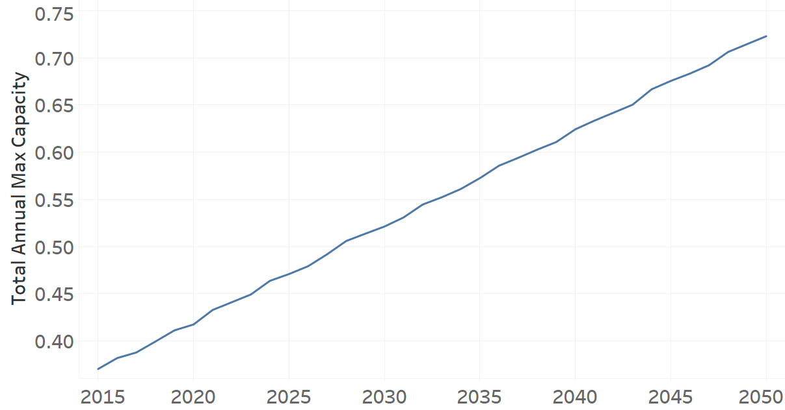
   
   *Figure 1) Total Annual Max Capacity for Techs_Microbuses for the BAU scenario.*
   
The figure 2 shows the Total Annual Max Capacity for Techs_Microbuses, for the NDP scenario.

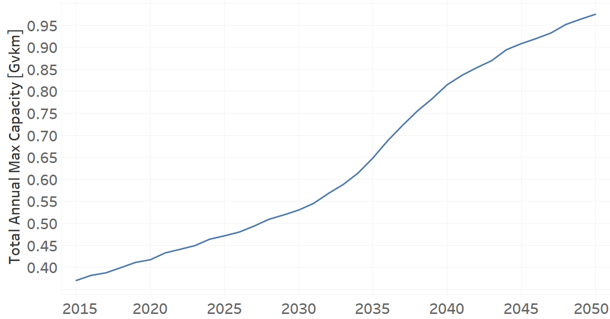
   
   *Figure 2) Total Annual Max Capacity for Techs_Microbuses for the NDP scenario.*

Source:
   This is the source. 
   
Description: 
   This is the description.
   
TotalTechnologyAnnualActivityLowerLimit[r,t,y]
---------
The figure 3 shows the Total Technology Annual Activity Lower Limit for Techs_Microbuses, for the BAU scenario.

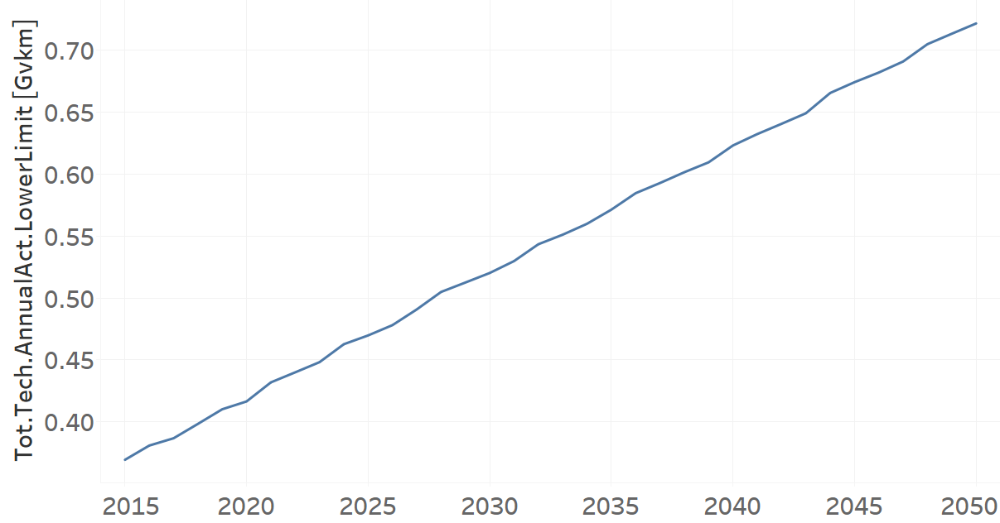
   
   *Figure 3) Total Technology Annual Activity Lower Limit for Techs_Microbuses for the BAU scenario.*
   
The figure 4 shows the Total Technology Annual Activity Lower Limit for Techs_Microbuses, for the NDP scenario.

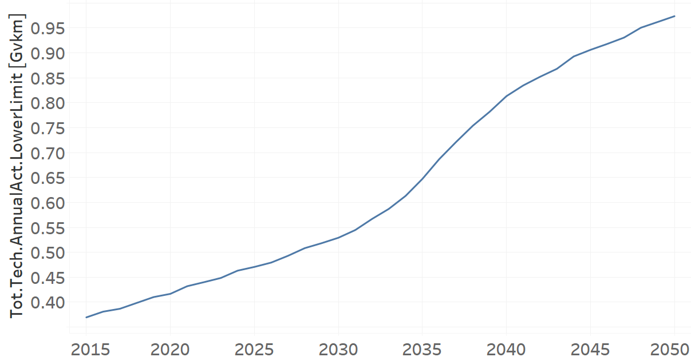
   
   *Figure 4) Total Technology Annual Activity Lower Limit for Techs_Microbuses for NDP scenario.*

Source:
   This is the source. 
   
Description: 
   This is the description.

Microbus Diesel (existing)
+++++++++

+-------------------------------------------------+-------+--------------+--------------+--------------+--------------+
| .. figure:: img/TRMBUSDSL.png                                                                                       |
|    :align:   center                                                                                                 |
|    :width:   500 px                                                                                                 |
+-------------------------------------------------+-------+--------------+--------------+--------------+--------------+
| Set codification:                                       |TRMBUSDSL01                                                |
+-------------------------------------------------+-------+--------------+--------------+--------------+--------------+
| Description:                                            |Microbus Diesel (existing)                                 |
+-------------------------------------------------+-------+--------------+--------------+--------------+--------------+
| Set:                                                    |Technology                                                 |
+-------------------------------------------------+-------+--------------+--------------+--------------+--------------+
| Parameter                                       | Unit  | 2020         | 2030         | 2040         |  2050        |
+=================================================+=======+==============+==============+==============+==============+
| DistanceDriven[r,t,y]                           |km/year| 25847        | 25847        | 25847        | 25847        |
+-------------------------------------------------+-------+--------------+--------------+--------------+--------------+
| EmissionActivityRatio[r,t,e,m,y] (Accidents)    |   -   | 0.1          | 0.1          | 0.1          | 0.1          |
+-------------------------------------------------+-------+--------------+--------------+--------------+--------------+
| EmissionActivityRatio[r,t,e,m,y] (Congestion)   |   -   | 0.081        | 0.081        | 0.081        | 0.081        |
+-------------------------------------------------+-------+--------------+--------------+--------------+--------------+
| EmissionActivityRatio[r,t,e,m,y] (Health)       |   -   | 0.03         | 0.03         | 0.03         | 0.03         |
+-------------------------------------------------+-------+--------------+--------------+--------------+--------------+
| FixedCost[r,t,y]                                |M$/Gvkm| 179.16       | 179.16       | 179.16       | 179.16       |
+-------------------------------------------------+-------+--------------+--------------+--------------+--------------+
| InputActivityRatio[r,t,f,m,y] (Diesel for       | PJ/   | 6.37         | 6.37         | 6.37         | 6.37         |
| public transport)                               | Gvkm  |              |              |              |              |
+-------------------------------------------------+-------+--------------+--------------+--------------+--------------+
| OperationalLife[r,t]                            | Years | 15           | 15           | 15           | 15           |
+-------------------------------------------------+-------+--------------+--------------+--------------+--------------+
| OutputActivityRatio[r,t,f,m,y] (Public          | PJ/   | 1            | 1            | 1            | 1            |
| Transport in Minibus)                           | Gvkm  |              |              |              |              |
+-------------------------------------------------+-------+--------------+--------------+--------------+--------------+
| ResidualCapacity[r,t,y] (BAU)                   | Gvkm  | 0.3129       | 0.1303       | 0            | 0            |
+-------------------------------------------------+-------+--------------+--------------+--------------+--------------+
| ResidualCapacity[r,t,y] (NDP)                   | Gvkm  | 0.3129       | 0.1587       | 0            | 0            |
+-------------------------------------------------+-------+--------------+--------------+--------------+--------------+
| TotalAnnualMaxCapacity[r,t,y] (BAU)             | Gvkm  | 0.3129       | 0.1303       | 0            | 0            |
+-------------------------------------------------+-------+--------------+--------------+--------------+--------------+
| TotalAnnualMaxCapacity[r,t,y] (NDP)             | Gvkm  | 0.3129       | 0.1587       | 0            | 0            |
+-------------------------------------------------+-------+--------------+--------------+--------------+--------------+
| TotalTechnologyAnnualActivityLowerLimit[r,t,y]  | Gvkm  | 0.3123       | 0.13         | 0            | 0            |
| (BAU)                                           |       |              |              |              |              |
+-------------------------------------------------+-------+--------------+--------------+--------------+--------------+
| TotalTechnologyAnnualActivityLowerLimit[r,t,y]  | Gvkm  | 0.3123       | 0.1584       | 0            | 0            |
| (NDP)                                           |       |              |              |              |              |
+-------------------------------------------------+-------+--------------+--------------+--------------+--------------+
| UnitFixedCost[r,t,y]                            |   $   | 4630.7485    | 4630.7485    | 4630.7485    | 4630.7485    |
+-------------------------------------------------+-------+--------------+--------------+--------------+--------------+

DistanceDriven[r,t,y]
---------
The equation (1) shows the Distance Driven for TRMBUSDSL01, for every scenario.

DistanceDriven=25847 [km/year]   (1)

Source:
   This is the source. 
   
Description: 
   This is the description.

EmissionActivityRatio[r,t,e,m,y]
---------
The equation (2) shows the Emission Activity Ratio for TRMBUSDSL01, for every scenario and associated to the emission Accidents.

EmissionActivityRatio=0.1    (2)

The equation (3) shows the Emission Activity Ratio for TRMBUSDSL01, for every scenario and associated to the emission Congestion.

EmissionActivityRatio=0.081    (3)

The equation (4) shows the Emission Activity Ratio for TRMBUSDSL01, for every scenario and associated to the emission Health.

EmissionActivityRatio=0.03   (4)

Source:
   This is the source. 
   
Description: 
   This is the description.

FixedCost[r,t,y]
---------
The equation (5) shows the Fixed Cost for TRMBUSDSL01, for every scenario.

FixedCost=179.16 [M$/Gvkm]   (5)

Source:
   This is the source. 
   
Description: 
   This is the description.
   
InputActivityRatio[r,t,f,m,y]
---------
The equation (6) shows the Input Activity Ratio for TRMBUSDSL01, for every scenario and associated to the fuel Diesel for public transport. 

InputActivityRatio=6.37 [PJ/Gvkm]   (6)

Source:
   This is the source. 
   
Description: 
   This is the description.   
   
OperationalLife[r,t]
---------
The equation (6) shows the Operational Life for TRMBUSDSL01, for every scenario.

OperationalLife=15 Years   (6)

Source:
   This is the source. 
   
Description: 
   This is the description.   
   
OutputActivityRatio[r,t,f,m,y]
---------
The equation (7) shows the Output Activity Ratio for TRMBUSDSL01, for every scenario and associated to the fuel Public Transport in Minibus.

OutputActivityRatio=1 [PJ/Gvkm]   (7)

Source:
   This is the source. 
   
Description: 
   This is the description.      
   
ResidualCapacity[r,t,y]
---------
The figure 2 shows the Residual Capacity for TRMBUSDSL01, for the BAU scenario.

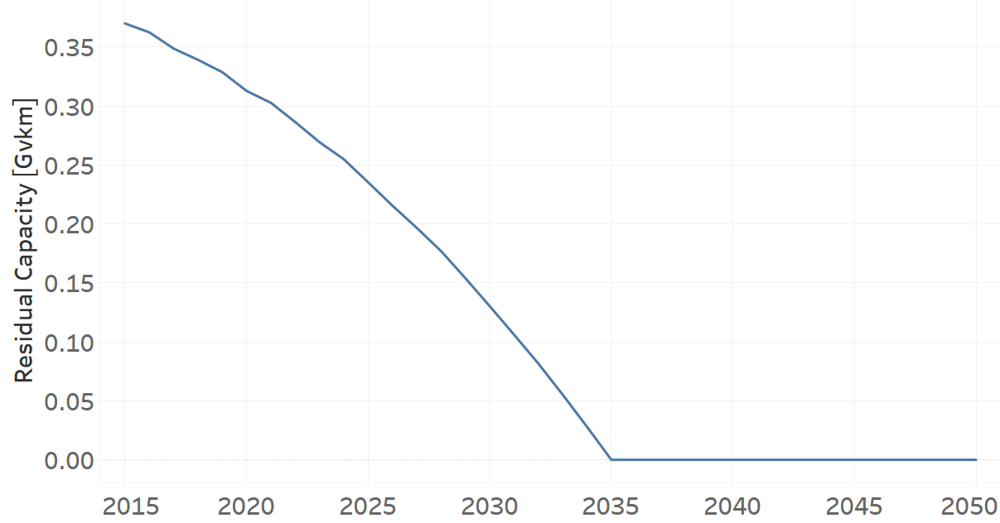
   
   *Figure 2) Residual Capacity for TRMBUSDSL01 for the BAU scenario.*
   
The figure 3 shows the Residual Capacity for TRMBUSDSL01, for the NDP scenario.

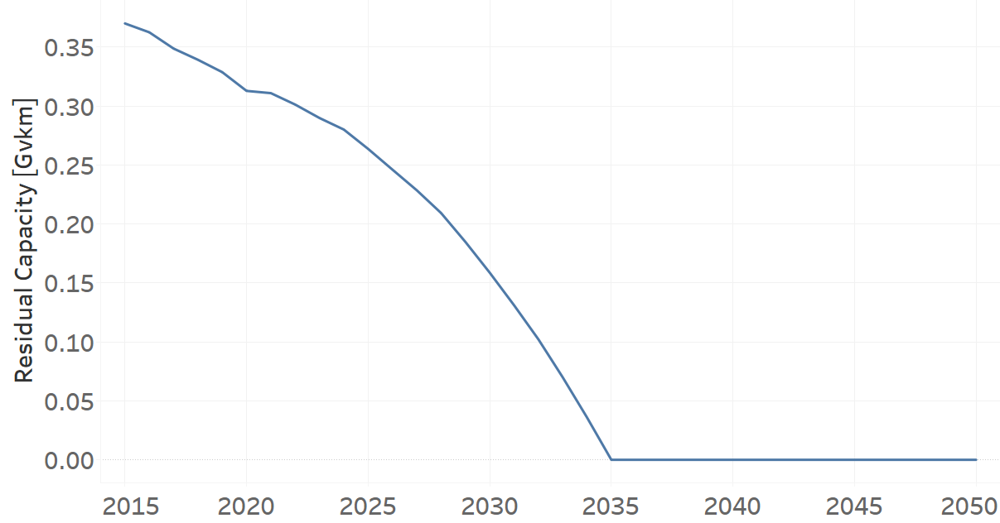
   
   *Figure 3) Residual Capacity for TRMBUSDSL01 for the NDP and OP15C scenario.*   
   
Source:
   This is the source. 
   
Description: 
   This is the description.         
   
TotalAnnualMaxCapacity[r,t,y]
---------
The figure 4 shows the Total Annual Max Capacity for TRMBUSDSL01, for the BAU scenario.

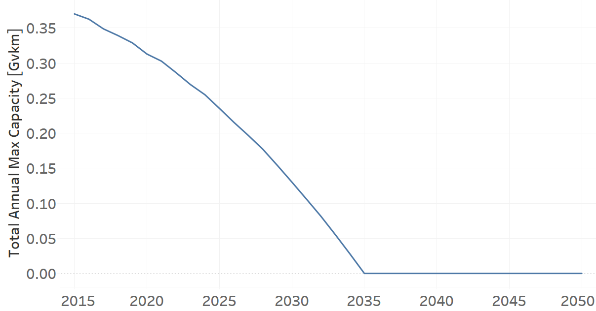
   
   *Figure 4) Total Annual Max Capacity for TRMBUSDSL01 for the BAU scenario.*
   
The figure 5 shows the Total Annual Max Capacity for TRMBUSDSL01, for the NDP scenario.

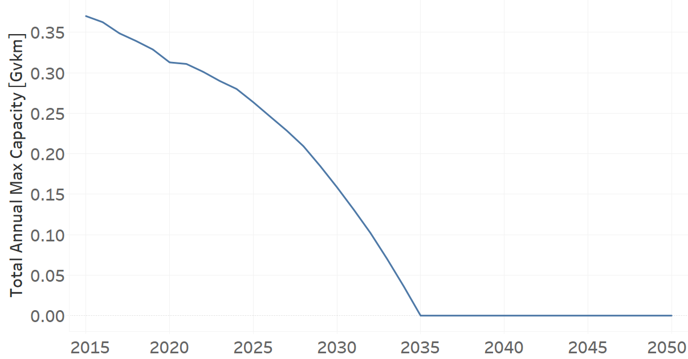
   
   *Figure 5) Total Annual Max Capacity for TRMBUSDSL01 for the NDP scenario.*   
   
Source:
   This is the source. 
   
Description: 
   This is the description.
   
TotalTechnologyAnnualActivityLowerLimit[r,t,y]
---------
The figure 6 shows the Total Technology Annual Activity Lower Limit for TRMBUSDSL01, for the BAU scenario.

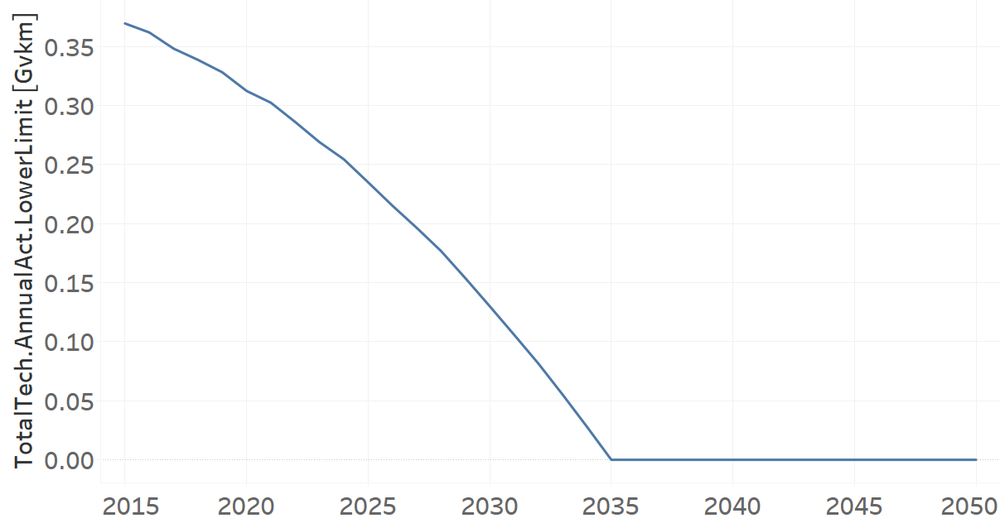
   
   *Figure 6) Total Technology Annual Activity Lower Limit for TRMBUSDSL01 for the BAU scenario.*
   
The figure 7 shows the Total Technology Annual Activity Lower Limit for TRMBUSDSL01, for the NDP scenario.

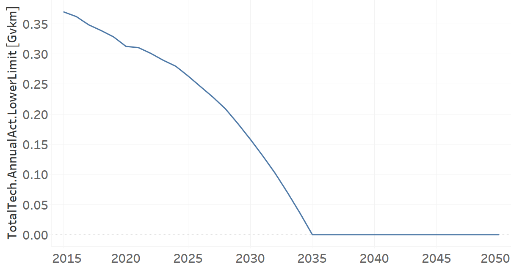
   
   *Figure 7) Total Technology Annual Activity Lower Limit for TRMBUSDSL01 for the NDP scenario.*

Source:
   This is the source. 
   
Description: 
   This is the description.
   
UnitFixedCost[r,t,y]
---------
The equation (8) shows the Unit Fixed Cost for TRMBUSDSL01, for every scenario.

UnitFixedCost=4630.7485 [$]   (8)

Source:
   This is the source. 
   
Description: 
   This is the description.
   

Microbus Diesel (new)
+++++++++

+-------------------------------------------------+-------+--------------+--------------+--------------+--------------+
| .. figure:: img/TRMBUSDSL.png                                                                                       |
|    :align:   center                                                                                                 |
|    :width:   500 px                                                                                                 |
+-------------------------------------------------+-------+--------------+--------------+--------------+--------------+
| Set codification:                                       |TRMBUSDSL02                                                |
+-------------------------------------------------+-------+--------------+--------------+--------------+--------------+
| Description:                                            |Microbus Diesel (new)                                      |
+-------------------------------------------------+-------+--------------+--------------+--------------+--------------+
| Set:                                                    |Technology                                                 |
+-------------------------------------------------+-------+--------------+--------------+--------------+--------------+
| Parameter                                       | Unit  | 2020         | 2030         | 2040         |  2050        |
+=================================================+=======+==============+==============+==============+==============+
| CapitalCost[r,t,y]                              |M$/Gvkm| 2797.83      | 2797.83      | 2797.83      | 2797.83      |
+-------------------------------------------------+-------+--------------+--------------+--------------+--------------+
| DistanceDriven[r,t,y]                           |km/year| 25847        | 25847        | 25847        | 25847        |
+-------------------------------------------------+-------+--------------+--------------+--------------+--------------+
| EmissionActivityRatio[r,t,e,m,y] (Accidents)    |   -   | 0.1          | 0.1          | 0.1          | 0.1          |
+-------------------------------------------------+-------+--------------+--------------+--------------+--------------+
| EmissionActivityRatio[r,t,e,m,y] (Congestion)   |  -    | 0.081        | 0.081        | 0.081        | 0.081        |
+-------------------------------------------------+-------+--------------+--------------+--------------+--------------+
| EmissionActivityRatio[r,t,e,m,y] (Health)       |   -   | 0.03         | 0.03         | 0.03         | 0.03         |
+-------------------------------------------------+-------+--------------+--------------+--------------+--------------+
| FixedCost[r,t,y]                                |M$/Gvkm| 179.16       | 179.16       | 179.16       | 179.16       |
+-------------------------------------------------+-------+--------------+--------------+--------------+--------------+
| InputActivityRatio[r,t,f,m,y] (Diesel for       | PJ/   | 5.62         | 5.62         | 5.62         | 5.62         |
| public transport)                               | Gvkm  |              |              |              |              |
+-------------------------------------------------+-------+--------------+--------------+--------------+--------------+
| OperationalLife[r,t]                            | Years | 15           | 15           | 15           | 15           |
+-------------------------------------------------+-------+--------------+--------------+--------------+--------------+
| OutputActivityRatio[r,t,f,m,y] (Public Transport| PJ/   | 1            | 1            | 1            | 1            |
| in Minibus)                                     | Gvkm  |              |              |              |              |
+-------------------------------------------------+-------+--------------+--------------+--------------+--------------+
| TotalTechnologyAnnualActivityLowerLimit[r,t,y]  | Gvkm  | 0.1041       | 0.3901       | 0.6231       | 0.7216       |
| (BAU)                                           |       |              |              |              |              |
+-------------------------------------------------+-------+--------------+--------------+--------------+--------------+
| TotalTechnologyAnnualActivityLowerLimit[r,t,y]  | Gvkm  | 0.1041       | 0            | 0            | 0            |
| (NDP)                                           |       |              |              |              |              |
+-------------------------------------------------+-------+--------------+--------------+--------------+--------------+
| UnitCapitalCost[r,t,y]                          |   $   | 72315.512    | 72315.512    | 72315.512    | 72315.512    |
+-------------------------------------------------+-------+--------------+--------------+--------------+--------------+
| UnitFixedCost[r,t,y]                            |   $   | 4630.7485    | 4630.7485    | 4630.7485    | 4630.7485    |
+-------------------------------------------------+-------+--------------+--------------+--------------+--------------+

CapitalCost[r,t,y]
---------
The equation (1) shows the Capital Cost for TRMBUSDSL02, for every scenario.

CapitalCost=2797.83 [M$/Gvkm]   (1)

Source:
   This is the source. 
   
Description: 
   This is the description. 

DistanceDriven[r,t,y]
---------
The equation (2) shows the Distance Driven for TRMBUSDSL02, for every scenario.

DistanceDriven=25847 [km/year]   (2)

Source:
   This is the source. 
   
Description: 
   This is the description.

EmissionActivityRatio[r,t,e,m,y]
---------
The equation (3) shows the Emission Activity Ratio for TRMBUSDSL02, for every scenario and associated to the emission Accidents.

EmissionActivityRatio=0.1    (3)

The equation (4) shows the Emission Activity Ratio for TRMBUSDSL02, for every scenario and associated to the emission Congestion.

EmissionActivityRatio=0.081    (4)

The equation (5) shows the Emission Activity Ratio for TRMBUSDSL02, for every scenario and associated to the emission Health.

EmissionActivityRatio=0.03    (5)

Source:
   This is the source. 
   
Description: 
   This is the description.

FixedCost[r,t,y]
---------
The equation (6) shows the Fixed Cost for TRMBUSDSL02, for every scenario.

FixedCost=179.16 [M$/Gvkm]   (6)

Source:
   This is the source. 
   
Description: 
   This is the description.
   
InputActivityRatio[r,t,f,m,y]
---------
The equation (7) shows the Input Activity Ratio for TRMBUSDSL02, for every scenario and associated to the fuel Diesel for public transport. 

InputActivityRatio=5.62 [PJ/Gvkm]   (7)

Source:
   This is the source. 
   
Description: 
   This is the description.   
   
OperationalLife[r,t]
---------
The equation (8) shows the Operational Life for TRMBUSDSL02, for every scenario.

OperationalLife=15 Years   (8)

Source:
   This is the source. 
   
Description: 
   This is the description.   
   
OutputActivityRatio[r,t,f,m,y]
---------
The equation (9) shows the Output Activity Ratio for TRMBUSDSL02, for every scenario and associated to the fuel Public Transport in Minibus.

OutputActivityRatio=1 [PJ/Gvkm]   (9)

Source:
   This is the source. 
   
Description: 
   This is the description.      
   
TotalTechnologyAnnualActivityLowerLimit[r,t,y]
---------
The figure 1 shows the Total Technology Annual Activity Lower Limit for TRMBUSDSL02, for the BAU scenario.

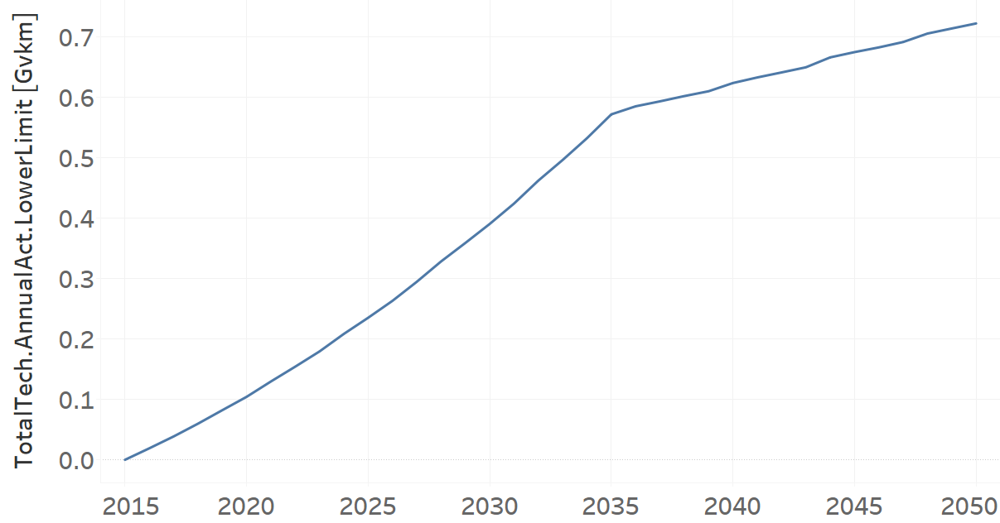
   
   *Figure 1) Total Technology Annual Activity Lower Limit for TRMBUSDSL02 for the BAU scenario.*
   
The figure 2 shows the Total Technology Annual Activity Lower Limit for TRMBUSDSL02, for the NDP scenario.

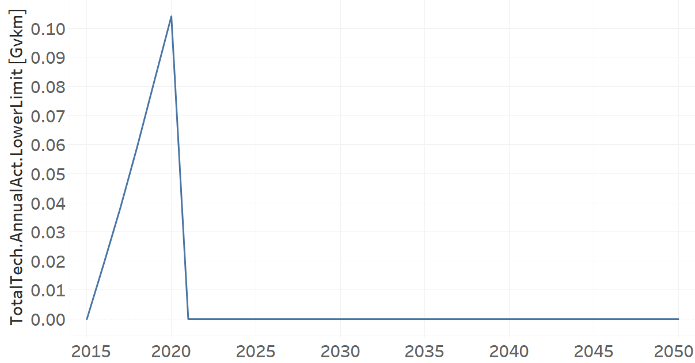
   
   *Figure 2) Total Technology Annual Activity Lower Limit for TRMBUSDSL02 for the NDP scenario.*

Source:
   This is the source. 
   
Description: 
   This is the description.
   
UnitCapitalCost[r,t,y]
---------
The equation (10) shows the Unit Capital Cost for TRMBUSDSL02, for every scenario.

UnitCapitalCost=72315.512 [$]   (10)

Source:
   This is the source. 
   
Description: 
   This is the description.
   
   
UnitFixedCost[r,t,y]
---------
The equation (11) shows the Unit Fixed Cost for TRMBUSDSL02, for every scenario.

UnitFixedCost=4630.7485 [$]   (11)

Source:
   This is the source. 
   
Description: 
   This is the description.

Microbus Electric (new)
+++++++++

+-------------------------------------------------+-------+--------------+--------------+--------------+--------------+
| .. figure:: img/TRMBUSELE.jpg                                                                                       |
|    :align:   center                                                                                                 |
|    :width:   500 px                                                                                                 |
+-------------------------------------------------+-------+--------------+--------------+--------------+--------------+
| Set codification:                                       |TRMBUSELE02                                                |
+-------------------------------------------------+-------+--------------+--------------+--------------+--------------+
| Description:                                            |Microbus Electric (new)                                    |
+-------------------------------------------------+-------+--------------+--------------+--------------+--------------+
| Set:                                                    |Technology                                                 |
+-------------------------------------------------+-------+--------------+--------------+--------------+--------------+
| Parameter                                       | Unit  | 2020         | 2030         | 2040         |  2050        |
+=================================================+=======+==============+==============+==============+==============+
| CapitalCost[r,t,y]                              |M$/Gvkm| 6191         | 4711         | 4598         | 4485         |
+-------------------------------------------------+-------+--------------+--------------+--------------+--------------+
| DistanceDriven[r,t,y]                           |km/year| 25847        | 25847        | 25847        | 25847        |
+-------------------------------------------------+-------+--------------+--------------+--------------+--------------+
| EmissionActivityRatio[r,t,e,m,y] (Accidents)    |  -    | 0.1          | 0.1          | 0.1          | 0.1          |
+-------------------------------------------------+-------+--------------+--------------+--------------+--------------+
| EmissionActivityRatio[r,t,e,m,y] (Congestion)   | -     | 0.081        | 0.081        | 0.081        | 0.081        |
+-------------------------------------------------+-------+--------------+--------------+--------------+--------------+
| FixedCost[r,t,y]                                |M$/Gvkm| 59.1228      | 59.1228      | 59.1228      | 59.1228      |
+-------------------------------------------------+-------+--------------+--------------+--------------+--------------+
| InputActivityRatio[r,t,f,m,y] (Electricity for  | PJ/   | 3.54         | 3.54         | 3.54         | 3.54         |
| public transport)                               | Gvkm  |              |              |              |              |
+-------------------------------------------------+-------+--------------+--------------+--------------+--------------+
| OperationalLife[r,t]                            | Years | 12           | 12           | 12           | 12           |
+-------------------------------------------------+-------+--------------+--------------+--------------+--------------+
| OutputActivityRatio[r,t,f,m,y] (Public Transport| PJ/   | 1            | 1            | 1            | 1            |
| in Minibus)                                     | Gvkm  |              |              |              |              |
+-------------------------------------------------+-------+--------------+--------------+--------------+--------------+
| TotalAnnualMaxCapacity[r,t,y] (BAU)             |  Gvkm | 0            | 99999        | 99999        | 99999        |
+-------------------------------------------------+-------+--------------+--------------+--------------+--------------+
| TotalAnnualMaxCapacity[r,t,y] (NDP)             |  Gvkm | 0            | 0.051        | 0.6698       | 1.0554       |
+-------------------------------------------------+-------+--------------+--------------+--------------+--------------+
| TotalTechnologyAnnualActivityLowerLimit[r,t,y]  | Gvkm  | 0            | 0.0509       | 0.6684       | 1.0533       |
| (NDP)                                           |       |              |              |              |              |
+-------------------------------------------------+-------+--------------+--------------+--------------+--------------+
| UnitCapitalCost[r,t,y]                          |   $   | 160018.777   | 121765.217   | 118844.506   | 115923.795   |
+-------------------------------------------------+-------+--------------+--------------+--------------+--------------+
| UnitFixedCost[r,t,y]                            |   $   | 1528.147     | 1528.147     | 1528.147     | 1528.147     |
+-------------------------------------------------+-------+--------------+--------------+--------------+--------------+

CapitalCost[r,t,y]
---------

The figure 1 shows the Capital Cost for TRMBUSELE02, for every scenario.

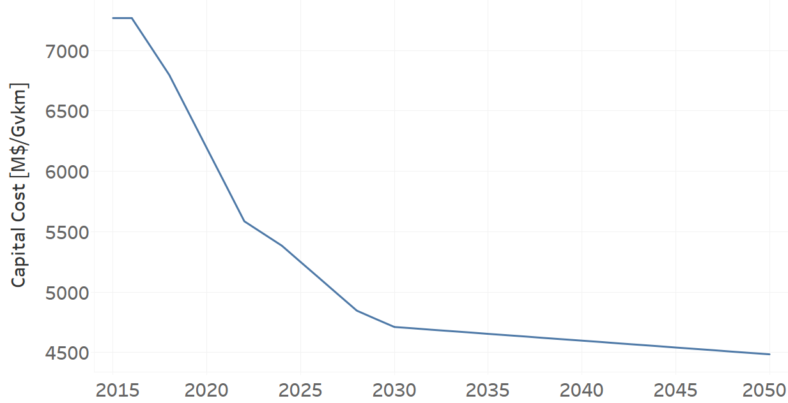
   
   *Figure 1) Capital Cost for TRMBUSELE02 for every scenario.*
   
Source:
   This is the source. 
   
Description: 
   This is the description. 

DistanceDriven[r,t,y]
---------
The equation (1) shows the Distance Driven for TRMBUSELE02, for every scenario.

DistanceDriven=25847 [km/year]   (1)

Source:
   This is the source. 
   
Description: 
   This is the description.

EmissionActivityRatio[r,t,e,m,y]
---------
The equation (2) shows the Emission Activity Ratio for TRMBUSELE02, for every scenario and associated to the emission Accidents.

EmissionActivityRatio=0.1    (2)

The equation (3) shows the Emission Activity Ratio for TRMBUSELE02, for every scenario and associated to the emission Congestion.

EmissionActivityRatio=0.081    (3)

Source:
   This is the source. 
   
Description: 
   This is the description.

FixedCost[r,t,y]
---------
The equation (4) shows the Fixed Cost for TRMBUSELE02, for every scenario.

FixedCost=59.1228 [M$/Gvkm]   (4)

Source:
   This is the source. 
   
Description: 
   This is the description.
   
InputActivityRatio[r,t,f,m,y]
---------
The equation (5) shows the Input Activity Ratio for TRMBUSELE02, for every scenario and associated to the fuel Electricity for public transport. 

InputActivityRatio=3.54 [PJ/Gvkm]   (5)

Source:
   This is the source. 
   
Description: 
   This is the description.   
   
OperationalLife[r,t]
---------
The equation (6) shows the Operational Life for TRMBUSELE02, for every scenario.

OperationalLife=12 Years   (6)

Source:
   This is the source. 
   
Description: 
   This is the description.   
   
OutputActivityRatio[r,t,f,m,y]
---------
The equation (7) shows the Output Activity Ratio for TRMBUSELE02, for every scenario and associated to the fuel Public Transport in Minibus.

OutputActivityRatio=1 [PJ/Gvkm]   (7)

Source:
   This is the source. 
   
Description: 
   This is the description.
   
TotalAnnualMaxCapacity[r,t,y]
---------
The figure 2 shows the Total Annual Max Capacity for TRMBUSELE02, for the BAU scenario.

.. figure:: img/TRMBUSELE02_TotalAnnualMaxCapacity_BAU.png
   :align:   center
   :width:   700 px
   
   *Figure 2) Total Annual Max Capacity for TRMBUSELE02 for the BAU scenario.*
   
The figure 3 shows the Total Annual Max Capacity for TRMBUSELE02, for the NDP scenario.

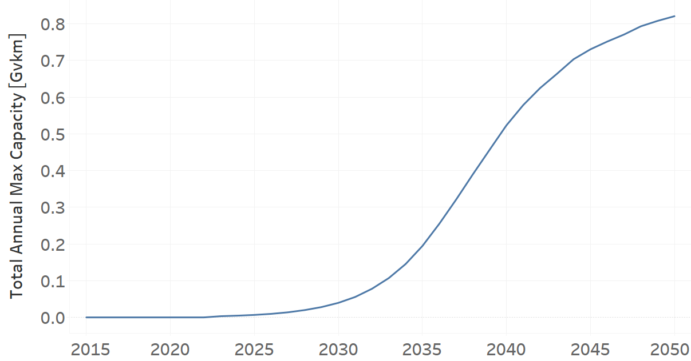
   
   *Figure 3) Total Annual Max Capacity for TRMBUSELE02 for the NDP scenario.*

Source:
   This is the source. 
   
Description: 
   This is the description.   
   
TotalTechnologyAnnualActivityLowerLimit[r,t,y]
---------
The figure 4 shows the Total Technology Annual Activity Lower Limit for TRMBUSELE02, for the NDP scenario.

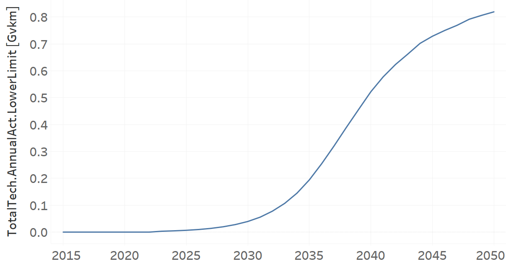
   
   *Figure 4) Total Technology Annual Activity Lower Limit for TRMBUSELE02 for the NDP scenario.*

Source:
   This is the source. 
   
Description: 
   This is the description.
   
UnitCapitalCost[r,t,y]
---------
The figure 5 shows the Unit Capital Cost for TRMBUSELE02, for every scenario.

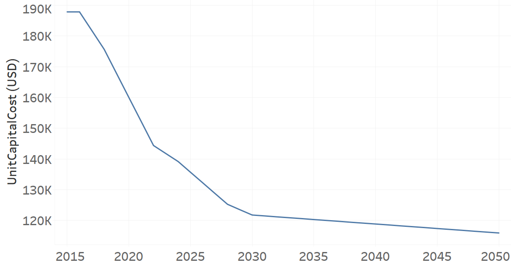
   
   *Figure 5) Unit Capital Cost for TRBUSELC02 for every scenario.*
Source:
   This is the source. 
   
Description: 
   This is the description.
   
   
UnitFixedCost[r,t,y]
---------
The equation (8) shows the Unit Fixed Cost for TRMBUSELE02, for every scenario.

UnitFixedCost=1528.147 [$]   (8)

Source:
   This is the source. 
   
Description: 
   This is the description.

Microbus Hybrid Electric-Diesel (new)
+++++++++

+-------------------------------------------------+-------+--------------+--------------+--------------+--------------+
| .. figure:: img/TRMBUSHYBD.jpg                                                                                      |
|    :align:   center                                                                                                 |
|    :width:   500 px                                                                                                 |
+-------------------------------------------------+-------+--------------+--------------+--------------+--------------+
| Set codification:                                       |TRMBUSHYBD02                                               |
+-------------------------------------------------+-------+--------------+--------------+--------------+--------------+
| Description:                                            |Microbus Hybrid Electric-Diesel (new)                      |
+-------------------------------------------------+-------+--------------+--------------+--------------+--------------+
| Set:                                                    |Technology                                                 |
+-------------------------------------------------+-------+--------------+--------------+--------------+--------------+
| Parameter                                       | Unit  | 2020         | 2030         | 2040         |  2050        |
+=================================================+=======+==============+==============+==============+==============+
| CapitalCost[r,t,y]                              |M$/Gvkm| 5228.01      | 3978.22      | 3882.79      | 3787.37      |
+-------------------------------------------------+-------+--------------+--------------+--------------+--------------+
| DistanceDriven[r,t,y]                           |km/year| 25847        | 25847        | 25847        | 25847        |
+-------------------------------------------------+-------+--------------+--------------+--------------+--------------+
| EmissionActivityRatio[r,t,e,m,y] (Accidents)    |  -    | 0.1          | 0.1          | 0.1          | 0.1          |
+-------------------------------------------------+-------+--------------+--------------+--------------+--------------+
| EmissionActivityRatio[r,t,e,m,y] (Congestion)   |  -    | 0.081        | 0.081        | 0.081        | 0.081        |
+-------------------------------------------------+-------+--------------+--------------+--------------+--------------+
| EmissionActivityRatio[r,t,e,m,y] (Health)       |  -    | 0.01         | 0.01         | 0.01         | 0.01         |
+-------------------------------------------------+-------+--------------+--------------+--------------+--------------+
| FixedCost[r,t,y]                                |M$/Gvkm| 89.58        | 89.58        | 89.58        | 89.58        |
+-------------------------------------------------+-------+--------------+--------------+--------------+--------------+
| InputActivityRatio[r,t,f,m,y] (Diesel for       | PJ/   | 2.15         | 2.15         | 2.15         | 2.15         |
| public transport)                               | Gvkm  |              |              |              |              |
+-------------------------------------------------+-------+--------------+--------------+--------------+--------------+
| InputActivityRatio[r,t,f,m,y] (Electricity for  | PJ/   | 2.15         | 2.15         | 2.15         | 2.15         |
| public transport)                               | Gvkm  |              |              |              |              |
+-------------------------------------------------+-------+--------------+--------------+--------------+--------------+
| OperationalLife[r,t]                            | Years | 12           | 12           | 12           | 12           |
+-------------------------------------------------+-------+--------------+--------------+--------------+--------------+
| OutputActivityRatio[r,t,f,m,y] (Public Transport| PJ/   | 1            | 1            | 1            | 1            |
| in Minibus)                                     | Gvkm  |              |              |              |              |
+-------------------------------------------------+-------+--------------+--------------+--------------+--------------+
| TotalAnnualMaxCapacity[r,t,y]                   | Gvkm  | 0            | 99999        | 99999        | 99999        |
+-------------------------------------------------+-------+--------------+--------------+--------------+--------------+
| UnitCapitalCost[r,t,y]                          |   $   | 135128.3745  | 102825.0523  | 100358.4731  | 237695.079   |
+-------------------------------------------------+-------+--------------+--------------+--------------+--------------+
| UnitFixedCost[r,t,y]                            |   $   | 2315.3743    | 2315.3743    | 2315.3743    | 97892.1524   |
+-------------------------------------------------+-------+--------------+--------------+--------------+--------------+

CapitalCost[r,t,y]
---------

The figure 1 shows the Capital Cost for TRMBUSHYBD02, for every scenario.

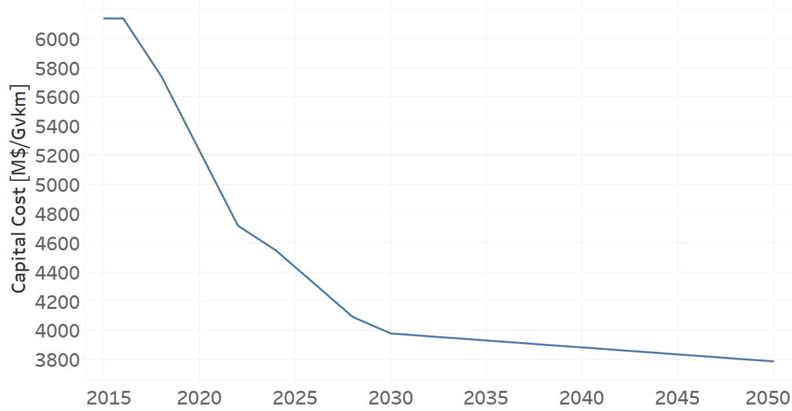
   
   *Figure 1) Capital Cost for TRMBUSHYBD02 for every scenario.*
   
Source:
   This is the source. 
   
Description: 
   This is the description. 

DistanceDriven[r,t,y]
---------
The equation (1) shows the Distance Driven for TRMBUSHYBD02, for every scenario.

DistanceDriven=25847 [km/year]   (1)

Source:
   This is the source. 
   
Description: 
   This is the description.

EmissionActivityRatio[r,t,e,m,y]
---------
The equation (2) shows the Emission Activity Ratio for TRMBUSHYBD02, for every scenario and associated to the emission Accidents.

EmissionActivityRatio=0.1    (2)

The equation (3) shows the Emission Activity Ratio for TRMBUSHYBD02, for every scenario and associated to the emission Congestion.

EmissionActivityRatio=0.081    (3)

The equation (4) shows the Emission Activity Ratio for TRMBUSHYBD02, for every scenario and associated to the emission Health.

EmissionActivityRatio=0.01    (4)

Source:
   This is the source. 
   
Description: 
   This is the description.

FixedCost[r,t,y]
---------
The equation (5) shows the Fixed Cost for TRMBUSHYBD02, for every scenario.

FixedCost=89.58 [M$/Gvkm]   (5)

Source:
   This is the source. 
   
Description: 
   This is the description.
   
InputActivityRatio[r,t,f,m,y]
---------
The equation (6) shows the Input Activity Ratio for TRMBUSHYBD02, for every scenario and associated to the fuel Electricity for public transport and Diesel for public transport. 

InputActivityRatio=2.15 [PJ/Gvkm]   (6)

Source:
   This is the source. 
   
Description: 
   This is the description.   
   
OperationalLife[r,t]
---------
The equation (7) shows the Operational Life for TRMBUSHYBD02, for every scenario.

OperationalLife=12 Years   (7)

Source:
   This is the source. 
   
Description: 
   This is the description.   
   
OutputActivityRatio[r,t,f,m,y]
---------
The equation (8) shows the Output Activity Ratio for TRMBUSHYBD02, for every scenario and associated to the fuel Public Transport in Minibus.

OutputActivityRatio=1 [PJ/Gvkm]   (8)

Source:
   This is the source. 
   
Description: 
   This is the description.
   
TotalAnnualMaxCapacity[r,t,y]
---------
The figure 2 shows the Total Annual Max Capacity for TRMBUSHYBD02, for every scenario.

.. figure:: img/TRMBUSHYBD02_TotalAnnualMaxCapacity.png
   :align:   center
   :width:   700 px
   
   *Figure 2) Total Annual Max Capacity for TRMBUSHYBD02 for every scenario.*

Source:
   This is the source. 
   
Description: 
   This is the description.   
   
UnitCapitalCost[r,t,y]
---------
The figure 3 shows the Unit Capital Cost for TRMBUSHYBD02, for every scenario.

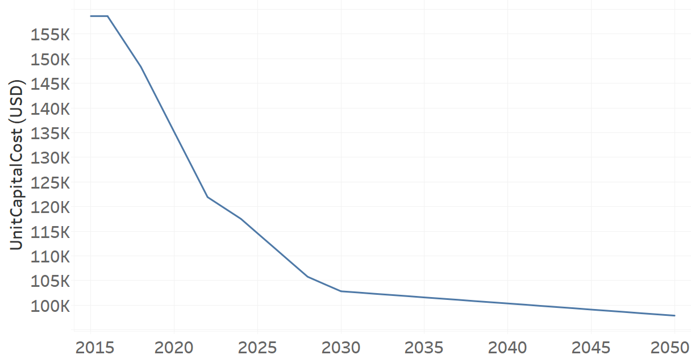
   
   *Figure 3) Unit Capital Cost for TRMBUSHYBD02 for every scenario.*
Source:
   This is the source. 
   
Description: 
   This is the description.
   
UnitFixedCost[r,t,y]
---------
The equation (9) shows the Unit Fixed Cost for TRMBUSHYBD02, for every scenario.

UnitFixedCost=2315.3743 [$]   (9)

Source:
   This is the source. 
   
Description: 
   This is the description.
   
  
Microbus Hydrogen (new)
+++++++++

+-------------------------------------------------+-------+--------------+--------------+--------------+--------------+
| .. figure:: img/TRMBUSHYD.jpg                                                                                       |
|    :align:   center                                                                                                 |
|    :width:   500 px                                                                                                 |
+-------------------------------------------------+-------+--------------+--------------+--------------+--------------+
| Set codification:                                       |TRMBUSHYD02                                                |
+-------------------------------------------------+-------+--------------+--------------+--------------+--------------+
| Description:                                            |Microbus Hydrogen (new)                                    |
+-------------------------------------------------+-------+--------------+--------------+--------------+--------------+
| Set:                                                    |Technology                                                 |
+-------------------------------------------------+-------+--------------+--------------+--------------+--------------+
| Parameter                                       | Unit  | 2020         | 2030         | 2040         |  2050        |
+=================================================+=======+==============+==============+==============+==============+
| CapitalCost[r,t,y]                              |M$/Gvkm| 13129        | 12302        | 11474        | 10646        |
+-------------------------------------------------+-------+--------------+--------------+--------------+--------------+
| DistanceDriven[r,t,y]                           |km/year| 25847        | 25847        | 25847        | 25847        |
+-------------------------------------------------+-------+--------------+--------------+--------------+--------------+
| EmissionActivityRatio[r,t,e,m,y] (Accidents)    |  -    | 0.1          | 0.1          | 0.1          | 0.1          |
+-------------------------------------------------+-------+--------------+--------------+--------------+--------------+
| EmissionActivityRatio[r,t,e,m,y] (Congestion)   |  -    | 0.081        | 0.081        | 0.081        | 0.081        |
+-------------------------------------------------+-------+--------------+--------------+--------------+--------------+
| FixedCost[r,t,y]                                |M$/Gvkm| 59.1228      | 59.1228      | 59.1228      | 59.1228      |
+-------------------------------------------------+-------+--------------+--------------+--------------+--------------+
| InputActivityRatio[r,t,f,m,y] (Hydrogen for     | PJ/   | 4.03         | 4.03         | 4.03         | 4.03         |
| public transport)                               | Gvkm  |              |              |              |              |
+-------------------------------------------------+-------+--------------+--------------+--------------+--------------+
| OperationalLife[r,t]                            | Years | 12           | 12           | 12           | 12           |
+-------------------------------------------------+-------+--------------+--------------+--------------+--------------+
| OutputActivityRatio[r,t,f,m,y] (Public Transport| PJ/   | 1            | 1            | 1            | 1            |
| in Minibus)                                     | Gvkm  |              |              |              |              |
+-------------------------------------------------+-------+--------------+--------------+--------------+--------------+
| TotalAnnualMaxCapacity[r,t,y]                   | Gvkm  | 0            | 99999        | 99999        | 99999        |
+-------------------------------------------------+-------+--------------+--------------+--------------+--------------+
| TotalTechnologyAnnualActivityLowerLimit[r,t,y]  | Gvkm  | 0            | 0.0045       | 0.0754       | 0.1239       |
| (NDP)                                           |       |              |              |              |              |
+-------------------------------------------------+-------+--------------+--------------+--------------+--------------+
| UnitCapitalCost[r,t,y]                          |   $   | 339345.263   | 317969.794   | 296568.478   | 275167.162   |
+-------------------------------------------------+-------+--------------+--------------+--------------+--------------+
| UnitFixedCost[r,t,y]                            |   $   | 1528.147     | 1528.147     | 1528.147     | 1528.147     |
+-------------------------------------------------+-------+--------------+--------------+--------------+--------------+

CapitalCost[r,t,y]
---------

The figure 1 shows the Capital Cost for TRMBUSHYD02, for every scenario.

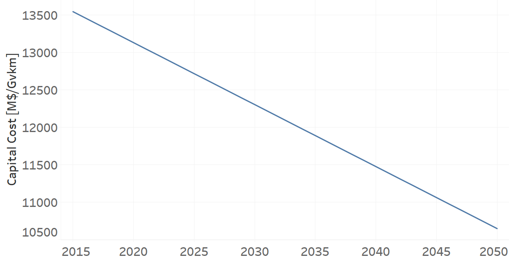
   
   *Figure 1) Capital Cost for TRMBUSHYD02 for every scenario.*
   
Source:
   This is the source. 
   
Description: 
   This is the description. 

DistanceDriven[r,t,y]
---------
The equation (1) shows the Distance Driven for TRMBUSHYD02, for every scenario.

DistanceDriven=25847 [km/year]   (1)

Source:
   This is the source. 
   
Description: 
   This is the description.

EmissionActivityRatio[r,t,e,m,y]
---------
The equation (2) shows the Emission Activity Ratio for TRMBUSHYD02, for every scenario and associated to the emission Accidents.

EmissionActivityRatio=0.1    (2)

The equation (3) shows the Emission Activity Ratio for TRMBUSHYD02, for every scenario and associated to the emission Congestion.

EmissionActivityRatio=0.081    (3)

Source:
   This is the source. 
   
Description: 
   This is the description.

FixedCost[r,t,y]
---------
The equation (4) shows the Fixed Cost for TRMBUSHYD02, for every scenario.

FixedCost=59.1228 [M$/Gvkm]   (4)

Source:
   This is the source. 
   
Description: 
   This is the description.
   
InputActivityRatio[r,t,f,m,y]
---------
The equation (5) shows the Input Activity Ratio for TRMBUSHYD02, for every scenario and associated to the fuel Hydrogen for public transport. 

InputActivityRatio=4.03 [PJ/Gvkm]   (5)

Source:
   This is the source. 
   
Description: 
   This is the description.   
   
OperationalLife[r,t]
---------
The equation (6) shows the Operational Life for TRBUSHYD02, for every scenario.

OperationalLife=12 Years   (6)

Source:
   This is the source. 
   
Description: 
   This is the description.   
   
OutputActivityRatio[r,t,f,m,y]
---------
The equation (7) shows the Output Activity Ratio for TRMBUSHYD02, for every scenario and associated to the fuel Public Transport in Minibus.

OutputActivityRatio=1 [PJ/Gvkm]   (7)

Source:
   This is the source. 
   
Description: 
   This is the description.
   
TotalAnnualMaxCapacity[r,t,y]
---------
The figure 2 shows the Total Annual Max Capacity for TRMBUSHYD02, for every scenario.

.. figure:: img/TRMBUSHYD02_TotalAnnualMaxCapacity.png
   :align:   center
   :width:   700 px
   
   *Figure 2) Total Annual Max Capacity for TRMBUSHYD02 for every scenario.*

Source:
   This is the source. 
   
Description: 
   This is the description.  
   
TotalTechnologyAnnualActivityLowerLimit[r,t,y]
---------   
The figure 3 shows the Total Technology Annual Activity Lower Limit for TRMBUSHYD02, for the NDP scenario.

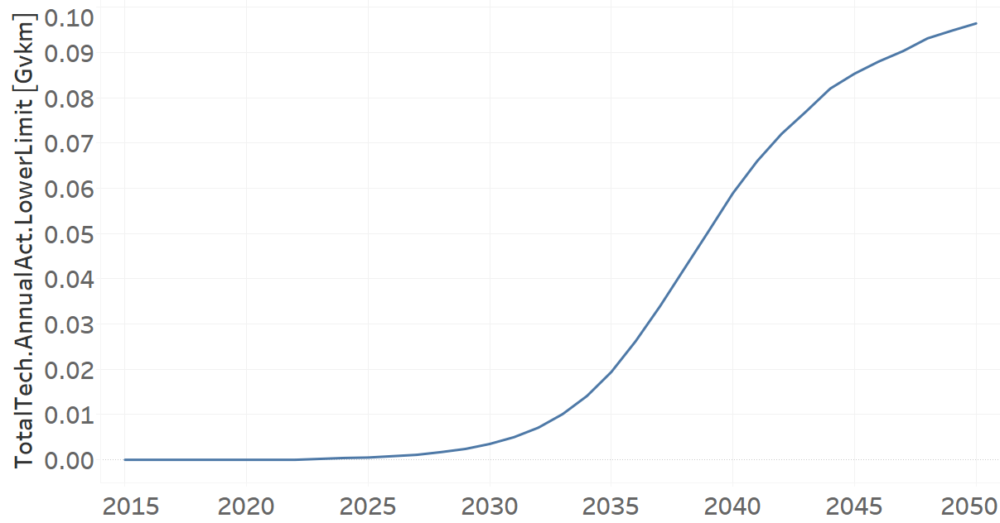
   
   *Figure 3) Total Technology Annual Activity Lower Limit for TRMBUSHYD02 for the NDP scenario.*

Source:
   This is the source. 
   
Description: 
   This is the description.
   
UnitCapitalCost[r,t,y]
---------
The figure 4 shows the Unit Capital Cost for TRMBUSHYD02, for every scenario.

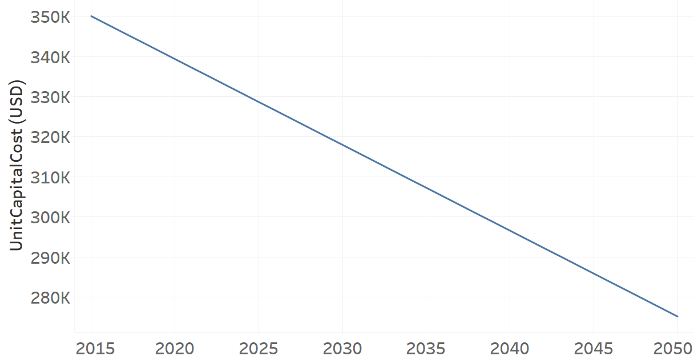
   
   *Figure 4) Unit Capital Cost for TRMBUSHYD02 for every scenario.*
Source:
   This is the source. 
   
Description: 
   This is the description.
   
UnitFixedCost[r,t,y]
---------
The equation (8) shows the Unit Fixed Cost for TRMBUSHYD02, for every scenario.

UnitFixedCost=1528.147 [$]   (8)

Source:
   This is the source. 
   
Description: 
   This is the description.

Microbus LPG (new)
+++++++++

+-------------------------------------------------+-------+--------------+--------------+--------------+--------------+
| .. figure:: img/TRMBUSLPG.jpeg                                                                                      |
|    :align:   center                                                                                                 |
|    :width:   500 px                                                                                                 |
+-------------------------------------------------+-------+--------------+--------------+--------------+--------------+
| Set codification:                                       |TRMBUSLPG02                                                |
+-------------------------------------------------+-------+--------------+--------------+--------------+--------------+
| Description:                                            |Microbus LPG (new)                                         |
+-------------------------------------------------+-------+--------------+--------------+--------------+--------------+
| Set:                                                    |Technology                                                 |
+-------------------------------------------------+-------+--------------+--------------+--------------+--------------+
| Parameter                                       | Unit  | 2020         | 2030         | 2040         |  2050        |
+=================================================+=======+==============+==============+==============+==============+
| CapitalCost[r,t,y]                              |M$/Gvkm| 3916         | 3916         | 3916         | 3916         |
+-------------------------------------------------+-------+--------------+--------------+--------------+--------------+
| DistanceDriven[r,t,y]                           |km/year| 25847        | 25847        | 25847        | 25847        |
+-------------------------------------------------+-------+--------------+--------------+--------------+--------------+
| EmissionActivityRatio[r,t,e,m,y] (Accidents)    |   -   | 0.1          | 0.1          | 0.1          | 0.1          |
+-------------------------------------------------+-------+--------------+--------------+--------------+--------------+
| EmissionActivityRatio[r,t,e,m,y] (Congestion)   |  -    | 0.081        | 0.081        | 0.081        | 0.081        |
+-------------------------------------------------+-------+--------------+--------------+--------------+--------------+
| EmissionActivityRatio[r,t,e,m,y] (Health)       |   -   | 0.01         | 0.01         | 0.01         | 0.01         |
+-------------------------------------------------+-------+--------------+--------------+--------------+--------------+
| FixedCost[r,t,y]                                |M$/Gvkm| 105.1        | 105.1        | 105.1        | 105.1        |
+-------------------------------------------------+-------+--------------+--------------+--------------+--------------+
| InputActivityRatio[r,t,f,m,y] (LPG for          | PJ/   | 7.32         | 7.32         | 7.32         | 7.32         |
| public transport)                               | Gvkm  |              |              |              |              |
+-------------------------------------------------+-------+--------------+--------------+--------------+--------------+
| OperationalLife[r,t]                            | Years | 15           | 15           | 15           | 15           |
+-------------------------------------------------+-------+--------------+--------------+--------------+--------------+
| OutputActivityRatio[r,t,f,m,y] (Public Transport| PJ/   | 1            | 1            | 1            | 1            |
| in Minibus)                                     | Gvkm  |              |              |              |              |
+-------------------------------------------------+-------+--------------+--------------+--------------+--------------+
| TotalAnnualMaxCapacity[r,t,y]                   | Gvkm  | 0            | 99999        | 99999        | 99999        |
+-------------------------------------------------+-------+--------------+--------------+--------------+--------------+
| UnitCapitalCost[r,t,y]                          |  $    | 101216.852   | 101216.852   | 101216.852   | 101216.852   |
+-------------------------------------------------+-------+--------------+--------------+--------------+--------------+
| UnitFixedCost[r,t,y]                            |  $    | 2716.5197    | 2716.5197    | 2716.5197    | 2716.5197    |
+-------------------------------------------------+-------+--------------+--------------+--------------+--------------+

CapitalCost[r,t,y]
---------
The equation (1) shows the Capital Cost for TRMBUSLPG02, for every scenario.

CapitalCost=3916 [M$/Gvkm]   (1)

Source:
   This is the source. 
   
Description: 
   This is the description. 

DistanceDriven[r,t,y]
---------
The equation (2) shows the Distance Driven for TRMBUSLPG02, for every scenario.

DistanceDriven=25847 [km/year]   (2)

Source:
   This is the source. 
   
Description: 
   This is the description.

EmissionActivityRatio[r,t,e,m,y]
---------
The equation (3) shows the Emission Activity Ratio for TRMBUSLPG02, for every scenario and associated to the emission Accidents.

EmissionActivityRatio=0.1    (3)

The equation (4) shows the Emission Activity Ratio for TRMBUSLPG02, for every scenario and associated to the emission Congestion.

EmissionActivityRatio=0.081    (4)

The equation (5) shows the Emission Activity Ratio for TRMBUSLPG02, for every scenario and associated to the emission Health.

EmissionActivityRatio=0.01    (5)

Source:
   This is the source. 
   
Description: 
   This is the description.

FixedCost[r,t,y]
---------
The equation (6) shows the Fixed Cost for TRMBUSLPG02, for every scenario.

FixedCost=105.1 [M$/Gvkm]   (6)

Source:
   This is the source. 
   
Description: 
   This is the description.
   
InputActivityRatio[r,t,f,m,y]
---------
The equation (7) shows the Input Activity Ratio for TRMBUSLPG02, for every scenario and associated to the fuel LPG for public transport. 

InputActivityRatio=7.32 [PJ/Gvkm]   (7)

Source:
   This is the source. 
   
Description: 
   This is the description.   
   
OperationalLife[r,t]
---------
The equation (8) shows the Operational Life for TRMBUSLPG02, for every scenario.

OperationalLife=15 Years   (8)

Source:
   This is the source. 
   
Description: 
   This is the description.   
   
OutputActivityRatio[r,t,f,m,y]
---------
The equation (9) shows the Output Activity Ratio for TRMBUSLPG02, for every scenario and associated to the fuel Public Transport in Minibus.

OutputActivityRatio=1 [PJ/Gvkm]   (9)

Source:
   This is the source. 
   
Description: 
   This is the description.      
   
TotalAnnualMaxCapacity[r,t,y]
---------
The figure 1 shows the Total Annual Max Capacity for TRMBUSLPG02, for every scenario.

.. figure:: img/TRMBUSLPG02_TotalAnnualMaxCapacity.png
   :align:   center
   :width:   700 px
   
   *Figure 1) Total Annual Max Capacity for TRMBUSLPG02 for every scenario.*

Source:
   This is the source. 
   
Description: 
   This is the description.
   
UnitCapitalCost[r,t,y]
---------
The equation (11) shows the Unit Capital Cost for TRMBUSLPG02, for every scenario.

UnitCapitalCost=101216.852 [$]   (11)

Source:
   This is the source. 
   
Description: 
   This is the description.
   
UnitFixedCost[r,t,y]
---------
The equation (12) shows the Unit Fixed Cost for TRMBUSLPG02, for every scenario.

UnitFixedCost=2716.5197 [$]   (12)

Source:
   This is the source. 
   
Description: 
   This is the description.
   
