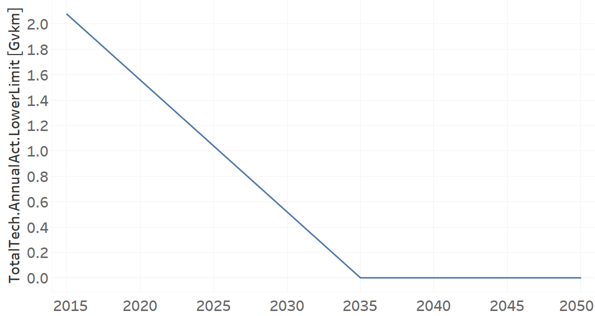
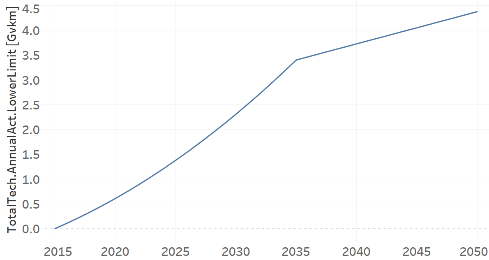
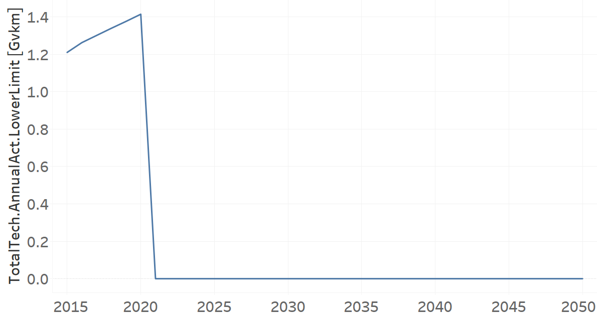

Minitrucks
=====================================

MiniTrucks (existing)
+++++++++

+-------------------------------------------------+-------+--------------+--------------+--------------+--------------+
| .. figure:: img/TRYLFDSL.PNG                                                                                        |
|    :align:   center                                                                                                 |
|    :width:   500 px                                                                                                 |
+-------------------------------------------------+-------+--------------+--------------+--------------+--------------+
| Set codification:                                       |TRYLFDSL01                                                 |
+-------------------------------------------------+-------+--------------+--------------+--------------+--------------+
| Description:                                            |Mini Trucks (existing)                                     |
+-------------------------------------------------+-------+--------------+--------------+--------------+--------------+
| Set:                                                    |Technology                                                 |
+-------------------------------------------------+-------+--------------+--------------+--------------+--------------+
| Parameter                                       | Unit  | 2020         | 2030         | 2040         |  2050        |
+=================================================+=======+==============+==============+==============+==============+
| DistanceDriven[r,t,y]                           |km/year| 17413        | 17413        | 17413        | 17413        |
+-------------------------------------------------+-------+--------------+--------------+--------------+--------------+
| EmissionActivityRatio[r,t,e,m,y] (Congestion)   |   -   | 0.16         | 0.16         | 0.16         | 0.16         |
+-------------------------------------------------+-------+--------------+--------------+--------------+--------------+
| EmissionActivityRatio[r,t,e,m,y] (Health)       |   -   | 0.01         | 0.01         | 0.01         | 0.01         |
+-------------------------------------------------+-------+--------------+--------------+--------------+--------------+
| FixedCost[r,t,y]                                |M$/Gvkm| 236.83       | 236.83       | 236.83       | 236.83       |
+-------------------------------------------------+-------+--------------+--------------+--------------+--------------+
| InputActivityRatio[r,t,f,m,y] (Diesel for       | PJ/   | 3.81         | 3.81         | 3.81         | 3.81         |
| light freight transport)                        | Gvkm  |              |              |              |              |
+-------------------------------------------------+-------+--------------+--------------+--------------+--------------+
| OperationalLife[r,t]                            | Years | 10           | 10           | 10           | 10           |
+-------------------------------------------------+-------+--------------+--------------+--------------+--------------+
| OutputActivityRatio[r,t,f,m,y] (FLF_PickUpTrucks| PJ/   | 1            | 1            | 1            | 1            |
| )                                               | Gvkm  |              |              |              |              |
+-------------------------------------------------+-------+--------------+--------------+--------------+--------------+
| ResidualCapacity[r,t,y]                         |  Gvkm | 1.5573       | 0.5191       | 0            | 0            |
+-------------------------------------------------+-------+--------------+--------------+--------------+--------------+
| TotalAnnualMaxCapacity[r,t,y]                   |  Gvkm | 1.5573       | 0.5191       | 0            | 0            |
+-------------------------------------------------+-------+--------------+--------------+--------------+--------------+
| TotalTechnologyAnnualActivityLowerLimit[r,t,y]  | Gvkm  | 1.5573       | 0.5191       | 0            | 0            |
|                                                 |       |              |              |              |              |
+-------------------------------------------------+-------+--------------+--------------+--------------+--------------+
| UnitFixedCost[r,t,y]                            |   $   | 4123.9208    | 4123.9208    | 4123.9208    | 4123.9208    |
+-------------------------------------------------+-------+--------------+--------------+--------------+--------------+

DistanceDriven[r,t,y]
---------

The equation (1) shows the Distance Driven for TRYLFDSL01, for every scenario.

DistanceDriven=17413 [km/year]   (1)

Source:
   This is the source. 
   
Description: 
   This is the description.

EmissionActivityRatio[r,t,e,m,y]
---------

The equation (2) shows the Emission Activity Ratio for TRYLFDSL01, for every scenario and associated to the emission Congestion.

EmissionActivityRatio=0.16    (2)

The equation (3) shows the Emission Activity Ratio for TRYLFDSL01, for every scenario and associated to the emission Health.

EmissionActivityRatio=0.01    (3)

Source:
   This is the source. 
   
Description: 
   This is the description.

FixedCost[r,t,y]
---------
The equation (4) shows the Fixed Cost for TRYLFDSL01, for every scenario.

FixedCost=236.83 [M$/Gvkm]   (4)

Source:
   This is the source. 
   
Description: 
   This is the description.
   
InputActivityRatio[r,t,f,m,y]
---------
The equation (5) shows the Input Activity Ratio for TRYLFDSL01, for every scenario and associated to the fuel Diesel for light freight transport. 

InputActivityRatio=3.81 [PJ/Gvkm]   (5)

Source:
   This is the source. 
   
Description: 
   This is the description.   
   
OperationalLife[r,t]
---------
The equation (6) shows the Operational Life for TRYLFDSL01, for every scenario.

OperationalLife=10 Years   (6)

Source:
   This is the source. 
   
Description: 
   This is the description.   
   
OutputActivityRatio[r,t,f,m,y]
---------
The equation (7) shows the Output Activity Ratio for TRYLFDSL01, for every scenario and associated to the fuel FLF_PickUpTrucks.

OutputActivityRatio=1 [PJ/Gvkm]   (7)

Source:
   This is the source. 
   
Description: 
   This is the description.      
   
ResidualCapacity[r,t,y]
---------
The figure 1 shows the Residual Capacity for TRYLFDSL01, for every scenario.

.. figure:: img/TRYLFDSL01_ResidualCapacity.png
   :align:   center
   :width:   700 px
   
   *Figure 1) Residual Capacity for TRYLFDSL01 for every scenario.*

Source:
   This is the source. 
   
Description: 
   This is the description.         
   
TotalAnnualMaxCapacity[r,t,y]
---------
The figure 2 shows the Total Annual Max Capacity for TRYLFDSL01, for every scenario.

.. figure:: img/TRYLFDSL01_TotalAnnualMaxCapacity.png
   :align:   center
   :width:   700 px
   
   *Figure 2) Total Annual Max Capacity for TRYLFDSL01 for every scenario.*

Source:
   This is the source. 
   
Description: 
   This is the description.
   
TotalTechnologyAnnualActivityLowerLimit[r,t,y]
---------
The figure 3 shows the Total Technology Annual Activity Lower Limit for TRYLFDSL01, for every scenario.

   
   *Figure 3) Total Technology Annual Activity Lower Limit for TRYLFDSL01 for every scenario.*

Source:
   This is the source. 
   
Description: 
   This is the description.
   
UnitFixedCost[r,t,y]
---------
The equation (8) shows the Unit Fixed Cost for TRYLFDSL01, for every scenario.

UnitFixedCost=4123.9208 [$]   (8)

Source:
   This is the source. 
   
Description: 
   This is the description.

Minitrucks Diesel (new)
+++++++++

+-------------------------------------------------+-------+--------------+--------------+--------------+--------------+
| .. figure:: img/TRYLFDSL.PNG                                                                                        |
|    :align:   center                                                                                                 |
|    :width:   500 px                                                                                                 |
+-------------------------------------------------+-------+--------------+--------------+--------------+--------------+
| Set codification:                                       |TRYLFDSL02                                                 |
+-------------------------------------------------+-------+--------------+--------------+--------------+--------------+
| Description:                                            |Mini Trucks Diesel (new)                                   |
+-------------------------------------------------+-------+--------------+--------------+--------------+--------------+
| Set:                                                    |Technology                                                 |
+-------------------------------------------------+-------+--------------+--------------+--------------+--------------+
| Parameter                                       | Unit  | 2020         | 2030         | 2040         |  2050        |
+=================================================+=======+==============+==============+==============+==============+
| CapitalCost[r,t,y]                              |M$/Gvkm| 1134.12      | 1134.12      | 1134.12      | 1134.12      |
+-------------------------------------------------+-------+--------------+--------------+--------------+--------------+
| DistanceDriven[r,t,y]                           |km/year| 17413        | 17413        | 17413        | 17413        |
+-------------------------------------------------+-------+--------------+--------------+--------------+--------------+
| EmissionActivityRatio[r,t,e,m,y] (Congestion)   |  -    | 0.16         | 0.16         | 0.16         | 0.16         |
+-------------------------------------------------+-------+--------------+--------------+--------------+--------------+
| EmissionActivityRatio[r,t,e,m,y] (Health)       |   -   | 0.01         | 0.01         | 0.01         | 0.01         |
+-------------------------------------------------+-------+--------------+--------------+--------------+--------------+
| FixedCost[r,t,y]                                |M$/Gvkm| 236.83       | 236.83       | 236.83       | 236.83       |
+-------------------------------------------------+-------+--------------+--------------+--------------+--------------+
| InputActivityRatio[r,t,f,m,y] (Diesel for       | PJ/   | 3.233        | 3.233        | 3.233        | 3.233        |
| light freight transport)                        | Gvkm  |              |              |              |              |
+-------------------------------------------------+-------+--------------+--------------+--------------+--------------+
| OperationalLife[r,t]                            | Years | 10           | 10           | 10           | 10           |
+-------------------------------------------------+-------+--------------+--------------+--------------+--------------+
| OutputActivityRatio[r,t,f,m,y] (FLF_PickUpTrucks| PJ/   | 1            | 1            | 1            | 1            |
| )                                               | Gvkm  |              |              |              |              |
+-------------------------------------------------+-------+--------------+--------------+--------------+--------------+
| TotalTechnologyAnnualActivityLowerLimit[r,t,y]  | Gvkm  | 0.6067       | 2.3074       | 3.7265       | 4.3763       |
| (BAU)                                           |       |              |              |              |              |
+-------------------------------------------------+-------+--------------+--------------+--------------+--------------+
| TotalTechnologyAnnualActivityLowerLimit[r,t,y]  | Gvkm  | 0.6066       | 0            | 0            | 0            |
| (NDP)                                           |       |              |              |              |              |
+-------------------------------------------------+-------+--------------+--------------+--------------+--------------+
| UnitCapitalCost[r,t,y]                          |   $   | 19748.4316   | 19748.4316   | 19748.4316   | 19748.4316   |
+-------------------------------------------------+-------+--------------+--------------+--------------+--------------+
| UnitFixedCost[r,t,y]                            |   $   | 4123.9208    | 4123.9208    | 4123.9208    | 4123.9208    |
+-------------------------------------------------+-------+--------------+--------------+--------------+--------------+

CapitalCost[r,t,y]
---------
The equation (1) shows the Capital Cost for TRYLFDSL02, for every scenario.

CapitalCost=1134.12 [M$/Gvkm]   (1)

Source:
   This is the source. 
   
Description: 
   This is the description. 

DistanceDriven[r,t,y]
---------
The equation (2) shows the Distance Driven for TRYLFDSL02, for every scenario.

DistanceDriven=17413 [km/year]   (2)

Source:
   This is the source. 
   
Description: 
   This is the description.

EmissionActivityRatio[r,t,e,m,y]
---------
The equation (3) shows the Emission Activity Ratio for TRYLFDSL02, for every scenario and associated to the emission Congestion.

EmissionActivityRatio=0.16    (3)

The equation (4) shows the Emission Activity Ratio for TRYLFDSL02, for every scenario and associated to the emission Health.

EmissionActivityRatio=0.01    (4)

Source:
   This is the source. 
   
Description: 
   This is the description.

FixedCost[r,t,y]
---------
The equation (5) shows the Fixed Cost for TRYLFDSL02, for every scenario.

FixedCost=236.83 [M$/Gvkm]   (5)

Source:
   This is the source. 
   
Description: 
   This is the description.
   
InputActivityRatio[r,t,f,m,y]
---------
The equation (6) shows the Input Activity Ratio for TRYLFDSL02, for every scenario and associated to the fuel Diesel for light freight transport. 

InputActivityRatio=7.61 [PJ/Gvkm]   (6)

Source:
   This is the source. 
   
Description: 
   This is the description.   
   
OperationalLife[r,t]
---------
The equation (7) shows the Operational Life for TRYLFDSL02, for every scenario.

OperationalLife=10 Years   (7)

Source:
   This is the source. 
   
Description: 
   This is the description.   
   
OutputActivityRatio[r,t,f,m,y]
---------
The equation (8) shows the Output Activity Ratio for TRYLFDSL02, for every scenario and associated to the fuel FLF_PickUpTrucks.

OutputActivityRatio=1 [PJ/Gvkm]   (8)

Source:
   This is the source. 
   
Description: 
   This is the description.      
   
TotalTechnologyAnnualActivityLowerLimit[r,t,y]
---------
The figure 1 shows the Total Technology Annual Activity Lower Limit for TRYLFDSL02, for the BAU scenario.

   
   *Figure 1) Total Technology Annual Activity Lower Limit for TRYLFDSL02 for the BAU scenario.*
   
The figure 2 shows the Total Technology Annual Activity Lower Limit for TRYLFDSL02, for the NDP scenario.

.. figure:: img/TRYLFDSL02_TotalTechnologyAnnualActivityLowerLimit_NDP.png
   :align:   center
   :width:   700 px
   
   *Figure 2) Total Technology Annual Activity Lower Limit for TRYLFDSL02 for the NDP scenario.*

Source:
   This is the source. 
   
Description: 
   This is the description.
   
UnitCapitalCost[r,t,y]
---------
The equation (9) shows the Unit Capital Cost for TRYLFDSL02, for every scenario.

UnitCapitalCost=19748.4316 [$]   (9)

Source:
   This is the source. 
   
Description: 
   This is the description.
   
   
UnitFixedCost[r,t,y]
---------
The equation (10) shows the Unit Fixed Cost for TRYLFDSL02, for every scenario.

UnitFixedCost=4123.9208 [$]   (10)

Source:
   This is the source. 
   
Description: 
   This is the description.

Minitrucks Electric (new)
+++++++++

+-------------------------------------------------+-------+--------------+--------------+--------------+--------------+
| .. figure:: img/TRYLFELE.jpg                                                                                        |
|    :align:   center                                                                                                 |
|    :width:   500 px                                                                                                 |
+-------------------------------------------------+-------+--------------+--------------+--------------+--------------+
| Set codification:                                       |TRYLFELE02                                                 |
+-------------------------------------------------+-------+--------------+--------------+--------------+--------------+
| Description:                                            |Mini Trucks Electric (new)                                 |
+-------------------------------------------------+-------+--------------+--------------+--------------+--------------+
| Set:                                                    |Technology                                                 |
+-------------------------------------------------+-------+--------------+--------------+--------------+--------------+
| Parameter                                       | Unit  | 2020         | 2030         | 2040         |  2050        |
+=================================================+=======+==============+==============+==============+==============+
| CapitalCost[r,t,y]                              |M$/Gvkm| 4190         | 4072         | 3954         | 3835         |
+-------------------------------------------------+-------+--------------+--------------+--------------+--------------+
| DistanceDriven[r,t,y]                           |km/year| 17413        | 17413        | 17413        | 17413        |
+-------------------------------------------------+-------+--------------+--------------+--------------+--------------+
| EmissionActivityRatio[r,t,e,m,y] (Congestion)   | -     | 0.16         | 0.16         | 0.16         | 0.16         |
+-------------------------------------------------+-------+--------------+--------------+--------------+--------------+
| FixedCost[r,t,y]                                |M$/Gvkm| 78.1539      | 78.1539      | 78.1539      | 78.1539      |
+-------------------------------------------------+-------+--------------+--------------+--------------+--------------+
| InputActivityRatio[r,t,f,m,y] (Electricity for  | PJ/   | 0.77         | 0.77         | 0.77         | 0.77         |
| light freight transport)                        | Gvkm  |              |              |              |              |
+-------------------------------------------------+-------+--------------+--------------+--------------+--------------+
| OperationalLife[r,t]                            | Years | 10           | 10           | 10           | 10           |
+-------------------------------------------------+-------+--------------+--------------+--------------+--------------+
| OutputActivityRatio[r,t,f,m,y] (FLF_PickUpTrucks| PJ/   | 1            | 1            | 1            | 1            |
| )                                               | Gvkm  |              |              |              |              |
+-------------------------------------------------+-------+--------------+--------------+--------------+--------------+
| TotalAnnualMaxCapacity[r,t,y] (BAU)             |  Gvkm | 0            | 99999        | 99999        | 99999        |
+-------------------------------------------------+-------+--------------+--------------+--------------+--------------+
| TotalAnnualMaxCapacity[r,t,y] (NDP)             |  Gvkm | 0            | 0.3535       | 3.5208       | 5.246        |
+-------------------------------------------------+-------+--------------+--------------+--------------+--------------+
| TotalTechnologyAnnualActivityLowerLimit[r,t,y]  | Gvkm  | 0            | 0.3535       | 3.5208       | 5.246        |
| (NDP)                                           |       |              |              |              |              |
+-------------------------------------------------+-------+--------------+--------------+--------------+--------------+
| UnitCapitalCost[r,t,y]                          |   $   | 72960.47     | 70905.736    | 68851.002    | 66778.855    |
+-------------------------------------------------+-------+--------------+--------------+--------------+--------------+
| UnitFixedCost[r,t,y]                            |   $   | 1360.8939    | 1360.8939    | 1360.8939    | 1360.8939    |
+-------------------------------------------------+-------+--------------+--------------+--------------+--------------+

CapitalCost[r,t,y]
---------
The figure 1 shows the Capital Cost for TRYLFELE02, for every scenario.

.. figure:: img/TRYLFELE02_CapitalCost.png
   :align:   center
   :width:   700 px
   
   *Figure 1) Capital Cost for TRYLFELE02 for every scenario.*
   
Source:
   This is the source. 
   
Description: 
   This is the description. 

DistanceDriven[r,t,y]
---------
The equation (1) shows the Distance Driven for TRYLFELE02, for every scenario.

DistanceDriven=17413 [km/year]   (1)

Source:
   This is the source. 
   
Description: 
   This is the description.

EmissionActivityRatio[r,t,e,m,y]
---------
The equation (2) shows the Emission Activity Ratio for TRYLFELE02, for every scenario and associated to the emission Congestion.

EmissionActivityRatio=0.16    (2)

Source:
   This is the source. 
   
Description: 
   This is the description.

FixedCost[r,t,y]
---------
The equation (3) shows the Fixed Cost for TRYLFELE02, for every scenario.

FixedCost=78.1539 [M$/Gvkm]   (3)

Source:
   This is the source. 
   
Description: 
   This is the description.
   
InputActivityRatio[r,t,f,m,y]
---------
The equation (4) shows the Input Activity Ratio for TRYLFELE02, for every scenario and associated to the fuel Electricity for light freight transport. 

InputActivityRatio=0.77 [PJ/Gvkm]   (4)

Source:
   This is the source. 
   
Description: 
   This is the description.   
   
OperationalLife[r,t]
---------
The equation (5) shows the Operational Life for TRYLFELE02, for every scenario.

OperationalLife=10 Years   (5)

Source:
   This is the source. 
   
Description: 
   This is the description.   
   
OutputActivityRatio[r,t,f,m,y]
---------
The equation (6) shows the Output Activity Ratio for TRYLFELE02, for every scenario and associated to the fuel FLF_PickUpTrucks.

OutputActivityRatio=1 [PJ/Gvkm]   (6)

Source:
   This is the source. 
   
Description: 
   This is the description.
   
TotalAnnualMaxCapacity[r,t,y]
---------

The figure 2 shows the Total Annual Max Capacity for TRYLFELE02, for the BAU scenario.

.. figure:: img/TRYLFELE02_TotalAnnualMaxCapacity_BAU.png
   :align:   center
   :width:   700 px
   
   *Figure 2) Total Annual Max Capacity for TRYLFELE02 for the BAU scenario.*
   
The figure 3 shows the Total Annual Max Capacity for TRYLFELE02, for the NDP scenario.

.. figure:: img/TRYLFELE02_TotalAnnualMaxCapacity_NDP.png
   :align:   center
   :width:   700 px
   
   *Figure 3) Total Annual Max Capacity for TRYLFELE02 for the NDP scenario.*

Source:
   This is the source. 
   
Description: 
   This is the description.   
   
TotalTechnologyAnnualActivityLowerLimit[r,t,y]
---------
The figure 4 shows the Total Technology Annual Activity Lower Limit for TRYLFELE02, for the NDP scenario.

.. figure:: img/TRYLFELE02_TotalTechnologyAnnualActivityLowerLimit_NDP.png
   :align:   center
   :width:   700 px
   
   *Figure 4) Total Technology Annual Activity Lower Limit for TRYLFELE02 for the NDP scenario.*

Source:
   This is the source. 
   
Description: 
   This is the description.
   
UnitCapitalCost[r,t,y]
---------
The figure 5 shows the Unit Capital Cost for TRYLFELE02, for every scenario.

.. figure:: img/TRYLFELE02_UnitCapitalCost.png
   :align:   center
   :width:   700 px
   
   *Figure 5) Unit Capital Cost for TRYLFELE02 for every scenario.*
Source:
   This is the source. 
   
Description: 
   This is the description.
   
   
UnitFixedCost[r,t,y]
---------
The equation (7) shows the Unit Fixed Cost for TRYLFELE02, for every scenario.

UnitFixedCost=1360.8939 [$]   (7)

Source:
   This is the source. 
   
Description: 
   This is the description.

Minitrucks Gasoline (new)
+++++++++

+-------------------------------------------------+-------+--------------+--------------+--------------+--------------+
| .. figure:: img/TRYLFGAS.jpg                                                                                        |
|    :align:   center                                                                                                 |
|    :width:   500 px                                                                                                 |
+-------------------------------------------------+-------+--------------+--------------+--------------+--------------+
| Set codification:                                       |TRYLFGAS02                                                 |
+-------------------------------------------------+-------+--------------+--------------+--------------+--------------+
| Description:                                            |Mini Trucks Gasoline (new)                                 |
+-------------------------------------------------+-------+--------------+--------------+--------------+--------------+
| Set:                                                    |Technology                                                 |
+-------------------------------------------------+-------+--------------+--------------+--------------+--------------+
| Parameter                                       | Unit  | 2020         | 2030         | 2040         |  2050        |
+=================================================+=======+==============+==============+==============+==============+
| CapitalCost[r,t,y]                              |M$/Gvkm| 1105.71      | 1105.71      | 1105.71      | 1105.71      |
+-------------------------------------------------+-------+--------------+--------------+--------------+--------------+
| DistanceDriven[r,t,y]                           |km/year| 17413        | 17413        | 17413        | 17413        |
+-------------------------------------------------+-------+--------------+--------------+--------------+--------------+
| EmissionActivityRatio[r,t,e,m,y] (Congestion)   |  -    | 0.16         | 0.16         | 0.16         | 0.16         |
+-------------------------------------------------+-------+--------------+--------------+--------------+--------------+
| FixedCost[r,t,y]                                |M$/Gvkm| 236.83       | 236.83       | 236.83       | 236.83       |
+-------------------------------------------------+-------+--------------+--------------+--------------+--------------+
| InputActivityRatio[r,t,f,m,y] (Gasoline for     | PJ/   | 2.48         | 2.48         | 2.48         | 2.48         |
| light freight transport)                        | Gvkm  |              |              |              |              |
+-------------------------------------------------+-------+--------------+--------------+--------------+--------------+
| OperationalLife[r,t]                            | Years | 10           | 10           | 10           | 10           |
+-------------------------------------------------+-------+--------------+--------------+--------------+--------------+
| OutputActivityRatio[r,t,f,m,y] (FLF_PickUpTrucks| PJ/   | 1            | 1            | 1            | 1            |
| )                                               | Gvkm  |              |              |              |              |
+-------------------------------------------------+-------+--------------+--------------+--------------+--------------+
| ResidualCapacity[r,t,y]                         | Gvkm  | 0.9075       | 0.3025       | 0            | 0            |
+-------------------------------------------------+-------+--------------+--------------+--------------+--------------+
| TotalAnnualMaxCapacity[r,t,y] (BAU)             | Gvkm  | 1.4142       | 1.7928       | 2.1715       | 2.5502       |
+-------------------------------------------------+-------+--------------+--------------+--------------+--------------+
| TotalAnnualMaxCapacity[r,t,y] (NDP)             | Gvkm  | 1.4142       | 1.4142       | 1.4142       | 1.4142       |
+-------------------------------------------------+-------+--------------+--------------+--------------+--------------+
| TotalTechnologyAnnualActivityLowerLimit[r,t,y]  | Gvkm  | 1.4142       | 1.7928       | 2.1715       | 2.5502       |
| (BAU)                                           |       |              |              |              |              |
+-------------------------------------------------+-------+--------------+--------------+--------------+--------------+
| TotalTechnologyAnnualActivityLowerLimit[r,t,y]  | Gvkm  | 1.4142       | 0            | 0            | 0            |
| (NDP)                                           |       |              |              |              |              |
+-------------------------------------------------+-------+--------------+--------------+--------------+--------------+
| UnitCapitalCost[r,t,y]                          |   $   | 19253.7282   | 19253.7282   | 19253.7282   | 19253.7282   |
+-------------------------------------------------+-------+--------------+--------------+--------------+--------------+
| UnitFixedCost[r,t,y]                            |   $   | 4123.9208    | 4123.9208    | 4123.9208    | 4123.9208    |
+-------------------------------------------------+-------+--------------+--------------+--------------+--------------+

CapitalCost[r,t,y]
---------
The equation (1) shows the Capital Cost for TRYLFGAS02, for every scenario.

CapitalCost=1105.71 [M$/Gvkm]   (1)

Source:
   This is the source. 
   
Description: 
   This is the description. 

DistanceDriven[r,t,y]
---------
The equation (2) shows the Distance Driven for TRYLFGAS02, for every scenario.

DistanceDriven=17413 [km/year]   (2)

Source:
   This is the source. 
   
Description: 
   This is the description.

EmissionActivityRatio[r,t,e,m,y]
---------
The equation (3) shows the Emission Activity Ratio for TRYLFGAS02, for every scenario and associated to the emission Congestion.

EmissionActivityRatio=0.16    (3)

Source:
   This is the source. 
   
Description: 
   This is the description.

FixedCost[r,t,y]
---------
The equation (4) shows the Fixed Cost for TRYLFGAS02, for every scenario.

FixedCost=236.83 [M$/Gvkm]   (4)

Source:
   This is the source. 
   
Description: 
   This is the description.
   
InputActivityRatio[r,t,f,m,y]
---------
The equation (5) shows the Input Activity Ratio for TRYLFGAS02, for every scenario and associated to the fuel Gasoline for light freight transport. 

InputActivityRatio=2.48 [PJ/Gvkm]   (5)

Source:
   This is the source. 
   
Description: 
   This is the description.   
   
OperationalLife[r,t]
---------
The equation (6) shows the Operational Life for TRYLFGAS02, for every scenario.

OperationalLife=10 Years   (6)

Source:
   This is the source. 
   
Description: 
   This is the description.   
   
OutputActivityRatio[r,t,f,m,y]
---------
The equation (7) shows the Output Activity Ratio for TRYLFGAS02, for every scenario and associated to the fuel FLF_PickUpTrucks.

OutputActivityRatio=1 [PJ/Gvkm]   (7)

Source:
   This is the source. 
   
Description: 
   This is the description.   
   
ResidualCapacity[r,t,y]
---------
The figure 1 shows the Residual Capacity for TRYLFGAS02, for every scenario.

   
   *Figure 1) Residual Capacity for TRYLFGAS02 for every scenario.*  

Source:
   This is the source. 
   
Description: 
   This is the description.         
   
TotalAnnualMaxCapacity[r,t,y]
---------
The figure 2 shows the Total Annual Max Capacity for TRYLFGAS02, for the BAU scenario.

   
   *Figure 2) Total Annual Max Capacity for TRYLFGAS02 for the BAU scenario.*
   
The figure 3 shows the Total Annual Max Capacity for TRYLFGAS02, for the NDP scenario.

   
   *Figure 3) Total Annual Max Capacity for TRYLFGAS02 for the NDP scenario.*   
   
Source:
   This is the source. 
   
Description: 
   This is the description.   
   
TotalTechnologyAnnualActivityLowerLimit[r,t,y]
---------
The figure 4 shows the Total Technology Annual Activity Lower Limit for TRYLFGAS02, for the BAU scenario.

.. figure:: img/TRYLFGAS02_TotalTechnologyAnnualActivityLowerLimit_BAU.png
   :align:   center
   :width:   700 px
   
   *Figure 4) Total Technology Annual Activity Lower Limit for TRYLFGAS02 for the BAU scenario.*
   
The figure 5 shows the Total Technology Annual Activity Lower Limit for TRYLFGAS02, for the NDP scenario.

   
   *Figure 5) Total Technology Annual Activity Lower Limit for TRYLFGAS02 for the NDP scenario.*

Source:
   This is the source. 
   
Description: 
   This is the description.
   
UnitCapitalCost[r,t,y]
---------
The equation (8) shows the Unit Capital Cost for TRYLFGAS02, for every scenario.

UnitCapitalCost=19253.7282 [$]   (8)

Source:
   This is the source. 
   
Description: 
   This is the description.
   
   
UnitFixedCost[r,t,y]
---------
The equation (9) shows the Unit Fixed Cost for TRYLFGAS02, for every scenario.

UnitFixedCost=4123.9208 [$]   (9)

Source:
   This is the source. 
   
Description: 
   This is the description.

Minitrucks Hybrid Electric-Diesel (new)
+++++++++

+-------------------------------------------------+-------+--------------+--------------+--------------+--------------+
| .. figure:: img/TRYLFHYBD.jpg                                                                                       |
|    :align:   center                                                                                                 |
|    :width:   500 px                                                                                                 |
+-------------------------------------------------+-------+--------------+--------------+--------------+--------------+
| Set codification:                                       |TRYLFHYBD02                                                |
+-------------------------------------------------+-------+--------------+--------------+--------------+--------------+
| Description:                                            |Mini Trucks Hybrid Electric-Diesel (new)                   |
+-------------------------------------------------+-------+--------------+--------------+--------------+--------------+
| Set:                                                    |Technology                                                 |
+-------------------------------------------------+-------+--------------+--------------+--------------+--------------+
| Parameter                                       | Unit  | 2020         | 2030         | 2040         |  2050        |
+=================================================+=======+==============+==============+==============+==============+
| CapitalCost[r,t,y]                              |M$/Gvkm| 2489         | 2489         | 2489         | 2489         |
+-------------------------------------------------+-------+--------------+--------------+--------------+--------------+
| DistanceDriven[r,t,y]                           |km/year| 17413        | 17413        | 17413        | 17413        |
+-------------------------------------------------+-------+--------------+--------------+--------------+--------------+
| EmissionActivityRatio[r,t,e,m,y] (Congestion)   |  -    | 0.16         | 0.16         | 0.16         | 0.16         |
+-------------------------------------------------+-------+--------------+--------------+--------------+--------------+
| FixedCost[r,t,y]                                |M$/Gvkm| 118.415      | 118.415      | 118.415      | 118.415      |
+-------------------------------------------------+-------+--------------+--------------+--------------+--------------+
| InputActivityRatio[r,t,f,m,y] (Diesel for       | PJ/   | 0.64         | 0.64         | 0.64         | 0.64         |
| light freight transport)                        | Gvkm  |              |              |              |              |
+-------------------------------------------------+-------+--------------+--------------+--------------+--------------+
| InputActivityRatio[r,t,f,m,y] (Electricity for  | PJ/   | 0.64         | 0.64         | 0.64         | 0.64         |
| light freight transport)                        | Gvkm  |              |              |              |              |
+-------------------------------------------------+-------+--------------+--------------+--------------+--------------+
| OperationalLife[r,t]                            | Years | 10           | 10           | 10           | 10           |
+-------------------------------------------------+-------+--------------+--------------+--------------+--------------+
| OutputActivityRatio[r,t,f,m,y] (FLF_PickUpTrucks| PJ/   | 1            | 1            | 1            | 1            |
| )                                               | Gvkm  |              |              |              |              |
+-------------------------------------------------+-------+--------------+--------------+--------------+--------------+
| TotalAnnualMaxCapacity[r,t,y]                   | Gvkm  | 0            | 99999        | 99999        | 99999        |
+-------------------------------------------------+-------+--------------+--------------+--------------+--------------+
| UnitCapitalCost[r,t,y]                          |   $   | 43340.957    | 43340.957    | 43340.957    | 43340.957    |
+-------------------------------------------------+-------+--------------+--------------+--------------+--------------+
| UnitFixedCost[r,t,y]                            |   $   | 2061.9604    | 2061.9604    | 2061.9604    | 2061.9604    |
+-------------------------------------------------+-------+--------------+--------------+--------------+--------------+

CapitalCost[r,t,y]
---------
The equation (1) shows the Capital Cost for TRYLFHYBD02, for every scenario.

CapitalCost=2489 [M$/Gvkm]   (1)

Source:
   This is the source. 
   
Description: 
   This is the description. 

DistanceDriven[r,t,y]
---------
The equation (2) shows the Distance Driven for TRYLFHYBD02, for every scenario.

DistanceDriven=17413 [km/year]   (2)

Source:
   This is the source. 
   
Description: 
   This is the description.

EmissionActivityRatio[r,t,e,m,y]
---------
The equation (3) shows the Emission Activity Ratio for TRYLFHYBD02, for every scenario and associated to the emission Congestion.

EmissionActivityRatio=0.16    (3)

Source:
   This is the source. 
   
Description: 
   This is the description.

FixedCost[r,t,y]
---------
The equation (4) shows the Fixed Cost for TRYLFHYBD02, for every scenario.

FixedCost=118.415 [M$/Gvkm]   (4)

Source:
   This is the source. 
   
Description: 
   This is the description.
   
InputActivityRatio[r,t,f,m,y]
---------
The equation (5) shows the Input Activity Ratio for TRYLFHYBD02, for every scenario and associated to the fuel Electricity for light freight transport and Diesel for light freight transport. 

InputActivityRatio=0.64 [PJ/Gvkm]   (5)

Source:
   This is the source. 
   
Description: 
   This is the description.   
   
OperationalLife[r,t]
---------
The equation (6) shows the Operational Life for TRYLFHYBD02, for every scenario.

OperationalLife=10 Years   (6)

Source:
   This is the source. 
   
Description: 
   This is the description.   
   
OutputActivityRatio[r,t,f,m,y]
---------
The equation (7) shows the Output Activity Ratio for TRYLFHYBD02, for every scenario and associated to the fuel FLF_PickUpTrucks.

OutputActivityRatio=1 [PJ/Gvkm]   (7)

Source:
   This is the source. 
   
Description: 
   This is the description.
   
TotalAnnualMaxCapacity[r,t,y]
---------
The figure 1 shows the Total Annual Max Capacity for TRYLFHYBD02, for every scenario.

.. figure:: img/TRYLFHYBD02_TotalAnnualMaxCapacity.png
   :align:   center
   :width:   700 px
   
   *Figure 1) Total Annual Max Capacity for TRYLFHYBD02 for every scenario.*

Source:
   This is the source. 
   
Description: 
   This is the description.   
   
UnitCapitalCost[r,t,y]
---------
The equation (8) shows the Unit Capital Cost for TRYLFHYBD02, for every scenario.

UnitCapitalCost=43340.957 [$]   (8)

Source:
   This is the source. 
   
Description: 
   This is the description.
   
UnitFixedCost[r,t,y]
---------
The equation (9) shows the Unit Fixed Cost for TRYLFHYBD02, for every scenario.

UnitFixedCost=2061.9604 [$]   (9)

Source:
   This is the source. 
   
Description: 
   This is the description.

Minitrucks Electric-Gasoline (new)
+++++++++

+-------------------------------------------------+-------+--------------+--------------+--------------+--------------+
| .. figure:: img/TRYLFHYBG.jpg                                                                                       |
|    :align:   center                                                                                                 |
|    :width:   500 px                                                                                                 |
+-------------------------------------------------+-------+--------------+--------------+--------------+--------------+
| Set codification:                                       |TRYLFHYBG02                                                |
+-------------------------------------------------+-------+--------------+--------------+--------------+--------------+
| Description:                                            |Mini Trucks Electric-Gasoline (new)                        |
+-------------------------------------------------+-------+--------------+--------------+--------------+--------------+
| Set:                                                    |Technology                                                 |
+-------------------------------------------------+-------+--------------+--------------+--------------+--------------+
| Parameter                                       | Unit  | 2020         | 2030         | 2040         |  2050        |
+=================================================+=======+==============+==============+==============+==============+
| CapitalCost[r,t,y]                              |M$/Gvkm| 2453         | 2453         | 2453         | 2453         |
+-------------------------------------------------+-------+--------------+--------------+--------------+--------------+
| DistanceDriven[r,t,y]                           |km/year| 17413        | 17413        | 17413        | 17413        |
+-------------------------------------------------+-------+--------------+--------------+--------------+--------------+
| EmissionActivityRatio[r,t,e,m,y] (Congestion)   |  -    | 0.16         | 0.16         | 0.16         | 0.16         |
+-------------------------------------------------+-------+--------------+--------------+--------------+--------------+
| FixedCost[r,t,y]                                |M$/Gvkm| 118.415      | 118.415      | 118.415      | 118.415      |
+-------------------------------------------------+-------+--------------+--------------+--------------+--------------+
| InputActivityRatio[r,t,f,m,y] (Electricity for  | PJ/   | 0.8          | 0.8          | 0.8          | 0.8          |
| light freight transport)                        | Gvkm  |              |              |              |              |
+-------------------------------------------------+-------+--------------+--------------+--------------+--------------+
| InputActivityRatio[r,t,f,m,y] (Gasoline for     | PJ/   | 0.8          | 0.8          | 0.8          | 0.8          |
| light freight transport)                        | Gvkm  |              |              |              |              |
+-------------------------------------------------+-------+--------------+--------------+--------------+--------------+
| OperationalLife[r,t]                            | Years | 10           | 10           | 10           | 10           |
+-------------------------------------------------+-------+--------------+--------------+--------------+--------------+
| OutputActivityRatio[r,t,f,m,y] (FLF_PickUpTrucks| PJ/   | 1            | 1            | 1            | 1            |
| )                                               | Gvkm  |              |              |              |              |
+-------------------------------------------------+-------+--------------+--------------+--------------+--------------+
| TotalAnnualMaxCapacity[r,t,y]                   | Gvkm  | 0            | 99999        | 99999        | 99999        |
+-------------------------------------------------+-------+--------------+--------------+--------------+--------------+
| UnitCapitalCost[r,t,y]                          |   $   | 42714.089    | 42714.089    | 42714.089    | 42714.089    |
+-------------------------------------------------+-------+--------------+--------------+--------------+--------------+
| UnitFixedCost[r,t,y]                            |   $   | 2061.9604    | 2061.9604    | 2061.9604    | 2061.9604    |
+-------------------------------------------------+-------+--------------+--------------+--------------+--------------+

CapitalCost[r,t,y]
---------
The equation (1) shows the Capital Cost for TRYLFHYBG02, for every scenario.

CapitalCost=2453 [M$/Gvkm]   (1)

Source:
   This is the source. 
   
Description: 
   This is the description. 

DistanceDriven[r,t,y]
---------
The equation (2) shows the Distance Driven for TRYLFHYBG02, for every scenario.

DistanceDriven=17413 [km/year]   (2)

Source:
   This is the source. 
   
Description: 
   This is the description.

EmissionActivityRatio[r,t,e,m,y]
---------
The equation (3) shows the Emission Activity Ratio for TRYLFHYBG02, for every scenario and associated to the emission Congestion.

EmissionActivityRatio=0.16    (3)

Source:
   This is the source. 
   
Description: 
   This is the description.

FixedCost[r,t,y]
---------
The equation (4) shows the Fixed Cost for TRYLFHYBG02, for every scenario.

FixedCost=118.415 [M$/Gvkm]   (4)

Source:
   This is the source. 
   
Description: 
   This is the description.
   
InputActivityRatio[r,t,f,m,y]
---------
The equation (5) shows the Input Activity Ratio for TRYLFHYBG02, for every scenario and associated to the fuel Electricity for light freight transport and Gasoline for light freight transport. 

InputActivityRatio=0.8 [PJ/Gvkm]   (5)

Source:
   This is the source. 
   
Description: 
   This is the description.   
   
OperationalLife[r,t]
---------
The equation (6) shows the Operational Life for TRYLFHYBG02, for every scenario.

OperationalLife=10 Years   (6)

Source:
   This is the source. 
   
Description: 
   This is the description.   
   
OutputActivityRatio[r,t,f,m,y]
---------
The equation (7) shows the Output Activity Ratio for TRYLFHYBG02, for every scenario and associated to the fuel FLF_PickUpTrucks.

OutputActivityRatio=1 [PJ/Gvkm]   (7)

Source:
   This is the source. 
   
Description: 
   This is the description.
   
TotalAnnualMaxCapacity[r,t,y]
---------
The figure 1 shows the Total Annual Max Capacity for TRYLFHYBG02, for every scenario.

.. figure:: img/TRYLFHYBG02_TotalAnnualMaxCapacity.png
   :align:   center
   :width:   700 px
   
   *Figure 1) Total Annual Max Capacity for TRYLFHYBG02 for every scenario.*

Source:
   This is the source. 
   
Description: 
   This is the description.   
   
UnitCapitalCost[r,t,y]
---------
The equation (8) shows the Unit Capital Cost for TRYLFHYBG02, for every scenario.

UnitCapitalCost=42714.089 [$]   (8)

Source:
   This is the source. 
   
Description: 
   This is the description.
   
UnitFixedCost[r,t,y]
---------
The equation (9) shows the Unit Fixed Cost for TRYLFHYBG02, for every scenario.

UnitFixedCost=2061.9604 [$]   (9)

Source:
   This is the source. 
   
Description: 
   This is the description.

Minitrucks LPG (new)
+++++++++

+-------------------------------------------------+-------+--------------+--------------+--------------+--------------+
| .. figure:: img/TRYLFLPG.png                                                                                        |
|    :align:   center                                                                                                 |
|    :width:   500 px                                                                                                 |
+-------------------------------------------------+-------+--------------+--------------+--------------+--------------+
| Set codification:                                       |TRYLFLPG02                                                 |
+-------------------------------------------------+-------+--------------+--------------+--------------+--------------+
| Description:                                            |Mini Trucks LPG (new)                                      |
+-------------------------------------------------+-------+--------------+--------------+--------------+--------------+
| Set:                                                    |Technology                                                 |
+-------------------------------------------------+-------+--------------+--------------+--------------+--------------+
| Parameter                                       | Unit  | 2020         | 2030         | 2040         |  2050        |
+=================================================+=======+==============+==============+==============+==============+
| CapitalCost[r,t,y]                              |M$/Gvkm| 1588         | 1588         | 1588         | 1588         |
+-------------------------------------------------+-------+--------------+--------------+--------------+--------------+
| DistanceDriven[r,t,y]                           |km/year| 17413        | 17413        | 17413        | 17413        |
+-------------------------------------------------+-------+--------------+--------------+--------------+--------------+
| EmissionActivityRatio[r,t,e,m,y] (Congestion)   |  -    | 0.16         | 0.16         | 0.16         | 0.16         |
+-------------------------------------------------+-------+--------------+--------------+--------------+--------------+
| FixedCost[r,t,y]                                |M$/Gvkm| 236.83       | 236.83       | 236.83       | 236.83       |
+-------------------------------------------------+-------+--------------+--------------+--------------+--------------+
| InputActivityRatio[r,t,f,m,y] (LPG for          | PJ/   | 2.48         | 2.48         | 2.48         | 2.48         |
| light freight transport)                        | Gvkm  |              |              |              |              |
+-------------------------------------------------+-------+--------------+--------------+--------------+--------------+
| OperationalLife[r,t]                            | Years | 10           | 10           | 10           | 10           |
+-------------------------------------------------+-------+--------------+--------------+--------------+--------------+
| OutputActivityRatio[r,t,f,m,y] (FLF_PickUpTrucks| PJ/   | 1            | 1            | 1            | 1            |
| )                                               | Gvkm  |              |              |              |              |
+-------------------------------------------------+-------+--------------+--------------+--------------+--------------+
| TotalAnnualMaxCapacity[r,t,y] (NDP)             | Gvkm  | 0            | 0.9277       | 1.0873       | 1.247        |
+-------------------------------------------------+-------+--------------+--------------+--------------+--------------+
| TotalTechnologyAnnualActivityLowerLimit[r,t,y]  | Gvkm  | 0            | 0.9277       | 0            | 0            |
| (NDP)                                           |       |              |              |              |              |
+-------------------------------------------------+-------+--------------+--------------+--------------+--------------+
| UnitCapitalCost[r,t,y]                          |   $   | 27651.844    | 27651.844    | 27651.844    | 27651.844    |
+-------------------------------------------------+-------+--------------+--------------+--------------+--------------+
| UnitFixedCost[r,t,y]                            |   $   | 2061.9604    | 2061.9604    | 2061.9604    | 2061.9604    |
+-------------------------------------------------+-------+--------------+--------------+--------------+--------------+

CapitalCost[r,t,y]
---------
The equation (1) shows the Capital Cost for TRYLFLPG02, for every scenario.

CapitalCost=1588 [M$/Gvkm]   (1)

Source:
   This is the source. 
   
Description: 
   This is the description. 

DistanceDriven[r,t,y]
---------
The equation (2) shows the Distance Driven for TRYLFLPG02, for every scenario.

DistanceDriven=17413 [km/year]   (2)

Source:
   This is the source. 
   
Description: 
   This is the description.

EmissionActivityRatio[r,t,e,m,y]
---------
The equation (3) shows the Emission Activity Ratio for TRYLFLPG02, for every scenario and associated to the emission Congestion.

EmissionActivityRatio=0.16    (3)

Source:
   This is the source. 
   
Description: 
   This is the description.

FixedCost[r,t,y]
---------
The equation (4) shows the Fixed Cost for TRYLFLPG02, for every scenario.

FixedCost=236.83 [M$/Gvkm]   (4)

Source:
   This is the source. 
   
Description: 
   This is the description.
   
InputActivityRatio[r,t,f,m,y]
---------
The equation (5) shows the Input Activity Ratio for TRYLFLPG02, for every scenario and associated to the fuel LPG for light freight transport. 

InputActivityRatio=2.48 [PJ/Gvkm]   (5)

Source:
   This is the source. 
   
Description: 
   This is the description.   
   
OperationalLife[r,t]
---------
The equation (6) shows the Operational Life for TRYLFLPG02, for every scenario.

OperationalLife=10 Years   (6)

Source:
   This is the source. 
   
Description: 
   This is the description.   
   
OutputActivityRatio[r,t,f,m,y]
---------
The equation (7) shows the Output Activity Ratio for TRYLFLPG02, for every scenario and associated to the fuel FLF_PickUpTrucks.

OutputActivityRatio=1 [PJ/Gvkm]   (7)

Source:
   This is the source. 
   
Description: 
   This is the description.
   
TotalAnnualMaxCapacity[r,t,y]
---------
The figure 1 shows the Total Annual Max Capacity for TRYLFLPG02, for the NDP scenario.

.. figure:: img/TRYLFLPG02_TotalAnnualMaxCapacity.png
   :align:   center
   :width:   700 px
   
   *Figure 1) Total Annual Max Capacity for TRYLFLPG02 for the NDP scenario.*

Source:
   This is the source. 
   
Description: 
   This is the description.   
   
TotalTechnologyAnnualActivityLowerLimit[r,t,y]
---------

The figure 4 shows the Total Technology Annual Activity Lower Limit for TRYLFLPG02, for the NDP scenario.

.. figure:: img/TRYLFLPG02_TotalTechnologyAnnualActivityLowerLimit_NDP.png
   :align:   center
   :width:   700 px
   
   *Figure 4) Total Technology Annual Activity Lower Limit for TRYLFLPG02 for the NDP scenario.*

Source:
   This is the source. 
   
Description: 
   This is the description.   
   
UnitCapitalCost[r,t,y]
---------
The equation (8) shows the Unit Capital Cost for TRYLFLPG02, for every scenario.

UnitCapitalCost=27651.844 [$]   (8)

Source:
   This is the source. 
   
Description: 
   This is the description.
   
UnitFixedCost[r,t,y]
---------
The equation (9) shows the Unit Fixed Cost for TRYLFLPG02, for every scenario.

UnitFixedCost=4123.9208 [$]   (9)

Source:
   This is the source. 
   
Description: 
   This is the description.
