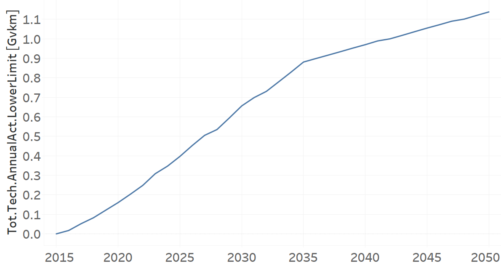
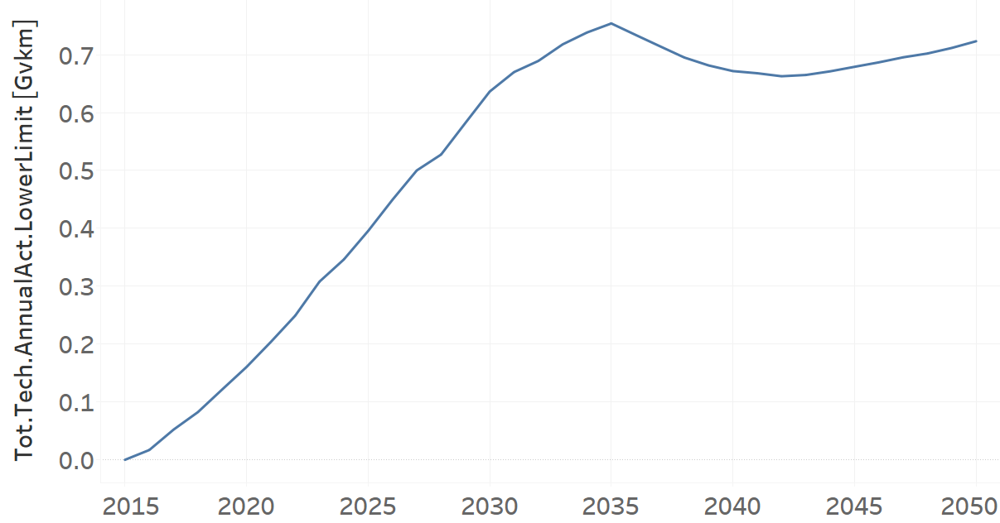
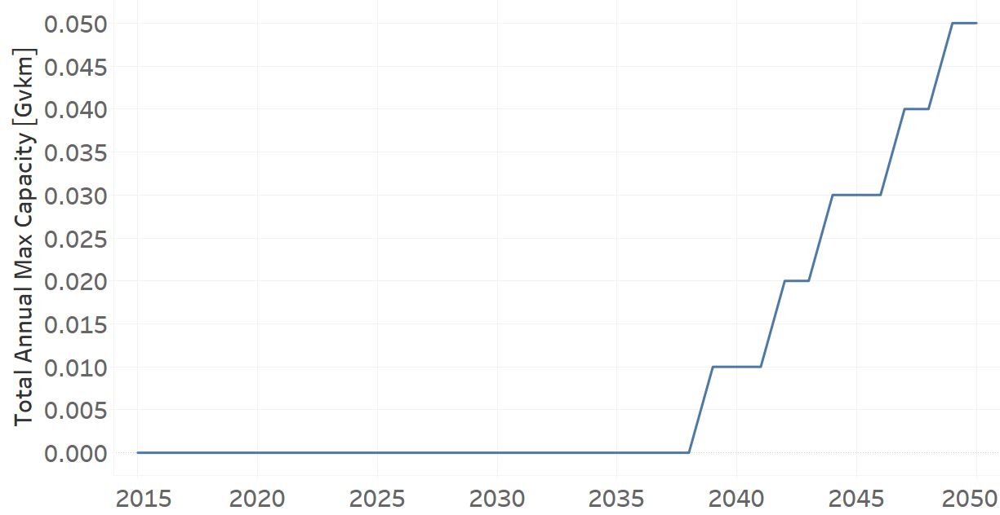

Minivans 
=====================================

Minivan (Grouping Technology)
+++++++++

+-------------------------------------------------+-------+--------------+--------------+--------------+--------------+
| .. figure:: img/Techs_Minivan.jpg                                                                                   |
|    :align:   center                                                                                                 |
|    :width:   500 px                                                                                                 |
+-------------------------------------------------+-------+--------------+--------------+--------------+--------------+
| Set codification:                                       |Techs_Minivan                                              |
+-------------------------------------------------+-------+--------------+--------------+--------------+--------------+
| Description:                                            |Minivan                                                    |
+-------------------------------------------------+-------+--------------+--------------+--------------+--------------+
| Set:                                                    |Technology                                                 |
+-------------------------------------------------+-------+--------------+--------------+--------------+--------------+
| Parameter                                       | Unit  | 2020         | 2030         | 2040         |  2050        |
+=================================================+=======+==============+==============+==============+==============+
| DistanceDriven[r,t,y]                           |km/year| 14773        | 14773        | 14773        | 14773        |
+-------------------------------------------------+-------+--------------+--------------+--------------+--------------+
| InputActivityRatio[r,t,f,m,y] (Private          | Gpkm/ | 1            | 1            | 1            | 1            |
| Transport in Minivan)                           | Gvkm  |              |              |              |              |
+-------------------------------------------------+-------+--------------+--------------+--------------+--------------+
| OperationalLife[r,t]                            | Years | 1            | 1            | 1            | 1            |
+-------------------------------------------------+-------+--------------+--------------+--------------+--------------+
| OutputActivityRatio[r,t,f,m,y] (Transport Demand| Gpkm/ | 2.3          | 2.3          | 2.3          | 2.3          |
| Passenger Private)                              | Gvkm  |              |              |              |              |
+-------------------------------------------------+-------+--------------+--------------+--------------+--------------+
| TotalAnnualMaxCapacity[r,t,y] (BAU)             | Gvkm  | 0.1607       | 0.6573       | 0.9718       | 1.1401       |
+-------------------------------------------------+-------+--------------+--------------+--------------+--------------+
| TotalAnnualMaxCapacity[r,t,y] (NDP)             | Gvkm  | 0.1604       | 0.6379       | 0.6729       | 0.7246       |
+-------------------------------------------------+-------+--------------+--------------+--------------+--------------+
| TotalTechnologyAnnualActivityLowerLimit[r,t,y]  | Gvkm  | 0.1604       | 0.6559       | 0.9699       | 1.1378       |
| (BAU)                                           |       |              |              |              |              |
+-------------------------------------------------+-------+--------------+--------------+--------------+--------------+
| TotalTechnologyAnnualActivityLowerLimit[r,t,y]  | Gvkm  | 0.1604       | 0.6363       | 0.9716       | 0.7232       |
| (NDP)                                           |       |              |              |              |              |
+-------------------------------------------------+-------+--------------+--------------+--------------+--------------+

DistanceDriven[r,t,y]
---------
The equation (1) shows the Distance Driven for Techs_Minivan, for every scenario.

DistanceDriven=14773 [km/year]   (1)

   
InputActivityRatio[r,t,f,m,y]
---------
The equation (2) shows the Input Activity Ratio for Techs_Minivan, for every scenario and associated to the fuel Private Transport in Minivan.

InputActivityRatio=1 [Gpkm/Gvkm]   (2)

   
OperationalLife[r,t]
---------
The equation (3) shows the Operational Life for Techs_Minivan, for every scenario.

OperationalLife=1 Years   (3)

   
OutputActivityRatio[r,t,f,m,y]
---------
The equation (4) shows the Output Activity Ratio for Techs_Minivan, for every scenario and associated to the fuel Transport Demand Passenger Private.

OutputActivityRatio=2.3 [Gpkm/Gvkm]   (4)

   
TotalAnnualMaxCapacity[r,t,y]
---------
The figure 1 shows the Total Annual Max Capacity for Techs_Minivan, for the BAU scenario.

.. figure:: img/Techs_Minivan_TotalAnnualMaxCapacity_BAU.png
   :align:   center
   :width:   700 px
   
   *Figure 1) Total Annual Max Capacity for Techs_Minivan for the BAU scenario.*
   
The figure 2 shows the Total Annual Max Capacity for Techs_Minivan, for the NDP scenario.

.. figure:: img/Techs_Minivan_TotalAnnualMaxCapacity_NDP_OP15C.png
   :align:   center
   :width:   700 px
   
   *Figure 2) Total Annual Max Capacity for Techs_Minivan for the NDP scenario.*

   
TotalTechnologyAnnualActivityLowerLimit[r,t,y]
---------
The figure 3 shows the Total Technology Annual Activity Lower Limit for Techs_Minivan, for the BAU scenario.

   
   *Figure 3) Total Technology Annual Activity Lower Limit for Techs_Minivan for the BAU scenario.*
   
The figure 4 shows the Total Technology Annual Activity Lower Limit for Techs_Minivan, for the NDP scenario.

   
   *Figure 4) Total Technology Annual Activity Lower Limit for Techs_Minivan for the NDP scenario.*

Minivan Diesel (new)
+++++++++

+-------------------------------------------------+-------+--------------+--------------+--------------+--------------+
| .. figure:: img/TRMIVDSL.jpg                                                                                        |
|    :align:   center                                                                                                 |
|    :width:   500 px                                                                                                 |
+-------------------------------------------------+-------+--------------+--------------+--------------+--------------+
| Set codification:                                       |TRMIVDSL02                                                 |
+-------------------------------------------------+-------+--------------+--------------+--------------+--------------+
| Description:                                            |Minivan Diesel (new)                                       |
+-------------------------------------------------+-------+--------------+--------------+--------------+--------------+
| Set:                                                    |Technology                                                 |
+-------------------------------------------------+-------+--------------+--------------+--------------+--------------+
| Parameter                                       | Unit  | 2020         | 2030         | 2040         |  2050        |
+=================================================+=======+==============+==============+==============+==============+
| CapitalCost[r,t,y]                              |M$/Gvkm| 2331.95      | 2331.95      | 2331.95      | 2331.95      |
+-------------------------------------------------+-------+--------------+--------------+--------------+--------------+
| DistanceDriven[r,t,y]                           |km/year| 14773        | 14773        | 14773        | 14773        |
+-------------------------------------------------+-------+--------------+--------------+--------------+--------------+
| EmissionActivityRatio[r,t,e,m,y] (Accidents)    |   -   | 0.09         | 0.09         | 0.09         | 0.09         |
+-------------------------------------------------+-------+--------------+--------------+--------------+--------------+
| EmissionActivityRatio[r,t,e,m,y] (Congestion)   |  -    | 0.081        | 0.081        | 0.081        | 0.081        |
+-------------------------------------------------+-------+--------------+--------------+--------------+--------------+
| EmissionActivityRatio[r,t,e,m,y] (Health)       |   -   | 0.01         | 0.01         | 0.01         | 0.01         |
+-------------------------------------------------+-------+--------------+--------------+--------------+--------------+
| FixedCost[r,t,y]                                |M$/Gvkm| 61.65        | 61.65        | 61.65        | 61.65        |
+-------------------------------------------------+-------+--------------+--------------+--------------+--------------+
| InputActivityRatio[r,t,f,m,y] (Diesel for       | PJ/   | 2.585428571  | 2.220285714  | 1.855142857  | 1.49         |
| private transport)                              | Gvkm  |              |              |              |              |
+-------------------------------------------------+-------+--------------+--------------+--------------+--------------+
| OperationalLife[r,t]                            | Years | 15           | 15           | 15           | 15           |
+-------------------------------------------------+-------+--------------+--------------+--------------+--------------+
| OutputActivityRatio[r,t,f,m,y] (Private         | PJ/   | 1            | 1            | 1            | 1            |
| Transport in Minivan)                           | Gvkm  |              |              |              |              |
+-------------------------------------------------+-------+--------------+--------------+--------------+--------------+
| TotalTechnologyAnnualActivityLowerLimit[r,t,y]  | Gvkm  | 0.0802       | 0            | 0            | 0            |
|                                                 |       |              |              |              |              |
+-------------------------------------------------+-------+--------------+--------------+--------------+--------------+
| UnitCapitalCost[r,t,y]                          |   $   | 32972.5973   | 32972.5973   | 32972.5973   | 32972.5973   |
+-------------------------------------------------+-------+--------------+--------------+--------------+--------------+
| UnitFixedCost[r,t,y]                            |   $   | 910.7554     | 910.7554     | 910.7554     | 910.7554     |
+-------------------------------------------------+-------+--------------+--------------+--------------+--------------+

CapitalCost[r,t,y]
---------
The equation (1) shows the Capital Cost for TRMIVDSL02, for every scenario.

CapitalCost=2331.95 [M$/Gvkm]   (1)

DistanceDriven[r,t,y]
---------
The equation (2) shows the Distance Driven for TRMIVDSL02, for every scenario.

DistanceDriven=14773 [km/year]   (2)

EmissionActivityRatio[r,t,e,m,y]
---------
The equation (3) shows the Emission Activity Ratio for TRMIVDSL02, for every scenario and associated to the emission Accidents.

EmissionActivityRatio=0.09    (3)

The equation (4) shows the Emission Activity Ratio for TRMIVDSL02, for every scenario and associated to the emission Congestion.

EmissionActivityRatio=0.081    (4)

The equation (5) shows the Emission Activity Ratio for TRMIVDSL02, for every scenario and associated to the emission Health.

EmissionActivityRatio=0.01    (5)

FixedCost[r,t,y]
---------
The equation (6) shows the Fixed Cost for TRMIVDSL02, for every scenario.

FixedCost=61.65 [M$/Gvkm]   (6)

   
InputActivityRatio[r,t,f,m,y]
---------
The figure 1 shows the Input Activity Ratio for TRMIVDSL02, for every scenario and associated to the fuel Diesel for private transport.

   
   *Figure 1) Input Activity Ratio for TRMIVDSL02 for every scenario.*

 
   
OperationalLife[r,t]
---------
The equation (7) shows the Operational Life for TRMIVDSL02, for every scenario.

OperationalLife=15 Years   (7)

 
   
OutputActivityRatio[r,t,f,m,y]
---------
The equation (8) shows the Output Activity Ratio for TRMIVDSL02, for every scenario and associated to the fuel Private Transport in Minivan.

OutputActivityRatio=1 [PJ/Gvkm]   (8)

      
   
TotalTechnologyAnnualActivityLowerLimit[r,t,y]
---------
The figure 2 shows the Total Technology Annual Activity Lower Limit for TRMIVDSL02, for every scenario.

   
   *Figure 2) Total Technology Annual Activity Lower Limit for TRMIVDSL02 for every scenario.*

   
UnitCapitalCost[r,t,y]
---------
The equation (9) shows the Unit Capital Cost for TRMIVDSL02, for every scenario.

UnitCapitalCost=32972.5973 [$]   (9)

   
   
UnitFixedCost[r,t,y]
---------
The equation (10) shows the Unit Fixed Cost for TRMIVDSL02, for every scenario.

UnitFixedCost=910.7554 [$]   (10)

Minivan Electric (new)
+++++++++

+-------------------------------------------------+-------+--------------+--------------+--------------+--------------+
| .. figure:: img/TRMIVELE.jpg                                                                                        |
|    :align:   center                                                                                                 |
|    :width:   500 px                                                                                                 |
+-------------------------------------------------+-------+--------------+--------------+--------------+--------------+
| Set codification:                                       |TRMIVELE02                                                 |
+-------------------------------------------------+-------+--------------+--------------+--------------+--------------+
| Description:                                            |Minivan Electric (new)                                     |
+-------------------------------------------------+-------+--------------+--------------+--------------+--------------+
| Set:                                                    |Technology                                                 |
+-------------------------------------------------+-------+--------------+--------------+--------------+--------------+
| Parameter                                       | Unit  | 2020         | 2030         | 2040         |  2050        |
+=================================================+=======+==============+==============+==============+==============+
| CapitalCost[r,t,y]                              |M$/Gvkm| 4064.84      | 3092.81      | 3018.59      | 2944.36      |
+-------------------------------------------------+-------+--------------+--------------+--------------+--------------+
| DistanceDriven[r,t,y]                           |km/year| 14773        | 14773        | 14773        | 14773        |
+-------------------------------------------------+-------+--------------+--------------+--------------+--------------+
| EmissionActivityRatio[r,t,e,m,y] (Accidents)    |  -    | 0.09         | 0.09         | 0.09         | 0.09         |
+-------------------------------------------------+-------+--------------+--------------+--------------+--------------+
| EmissionActivityRatio[r,t,e,m,y] (Congestion)   | -     | 0.081        | 0.081        | 0.081        | 0.081        |
+-------------------------------------------------+-------+--------------+--------------+--------------+--------------+
| FixedCost[r,t,y]                                |M$/Gvkm| 20.3445      | 20.3445      | 20.3445      | 20.3445      |
+-------------------------------------------------+-------+--------------+--------------+--------------+--------------+
| InputActivityRatio[r,t,f,m,y] (Electricity for  | PJ/   | 0.72         | 0.72         | 0.72         | 0.72         |
| private transport)                              | Gvkm  |              |              |              |              |
+-------------------------------------------------+-------+--------------+--------------+--------------+--------------+
| OperationalLife[r,t]                            | Years | 12           | 12           | 12           | 12           |
+-------------------------------------------------+-------+--------------+--------------+--------------+--------------+
| OutputActivityRatio[r,t,f,m,y] (Private         | PJ/   | 1            | 1            | 1            | 1            |
| Transport in Minivan)                           | Gvkm  |              |              |              |              |
+-------------------------------------------------+-------+--------------+--------------+--------------+--------------+
| TotalAnnualMaxCapacity[r,t,y] (BAU)             |  Gvkm | 0            | 0            |              | 0.05         |
+-------------------------------------------------+-------+--------------+--------------+--------------+--------------+
| TotalAnnualMaxCapacity[r,t,y] (NDP)             |  Gvkm | 0            | 0.0557       | 0.5034       | 0.7102       |
+-------------------------------------------------+-------+--------------+--------------+--------------+--------------+
| TotalTechnologyAnnualActivityLowerLimit[r,t,y]  | Gvkm  | 0            | 0.0555       | 0.5025       | 0.7088       |
| (NDP)                                           |       |              |              |              |              |
+-------------------------------------------------+-------+--------------+--------------+--------------+--------------+
| UnitCapitalCost[r,t,y]                          |   $   | 60049.8813   | 45690.0821   | 44593.6301   | 43497.0303   |
+-------------------------------------------------+-------+--------------+--------------+--------------+--------------+
| UnitFixedCost[r,t,y]                            |   $   | 300.5493     | 300.5493     | 300.5493     | 300.5493     |
+-------------------------------------------------+-------+--------------+--------------+--------------+--------------+

CapitalCost[r,t,y]
---------

The figure 1 shows the Capital Cost for TRMIVELE02, for every scenario.

.. figure:: img/TRMIVELE02_CapitalCost.png
   :align:   center
   :width:   700 px
   
   *Figure 1) Capital Cost for TRMIVELE02 for every scenario.*
   

DistanceDriven[r,t,y]
---------
The equation (1) shows the Distance Driven for TRMIVELE02, for every scenario.

DistanceDriven=14773 [km/year]   (1)

EmissionActivityRatio[r,t,e,m,y]
---------
The equation (2) shows the Emission Activity Ratio for TRMIVELE02, for every scenario and associated to the emission Accidents.

EmissionActivityRatio=0.09    (2)

The equation (3) shows the Emission Activity Ratio for TRMIVELE02, for every scenario and associated to the emission Congestion.

EmissionActivityRatio=0.081    (3)

FixedCost[r,t,y]
---------
The equation (4) shows the Fixed Cost for TRMIVELE02, for every scenario.

FixedCost=20.3445 [M$/Gvkm]   (4)

   
InputActivityRatio[r,t,f,m,y]
---------
The equation (5) shows the Input Activity Ratio for TRMIVELE02, for every scenario and associated to the fuel Electricity for private transport. 

InputActivityRatio=0.72 [PJ/Gvkm]   (5)

 
   
OperationalLife[r,t]
---------
The equation (6) shows the Operational Life for TRMIVELE02, for every scenario.

OperationalLife=12 Years   (6)

 
   
OutputActivityRatio[r,t,f,m,y]
---------
The equation (7) shows the Output Activity Ratio for TRMIVELE02, for every scenario and associated to the fuel Private Transport in Minivan.

OutputActivityRatio=1 [PJ/Gvkm]   (7)

   
TotalAnnualMaxCapacity[r,t,y]
---------
The figure 2 shows the Total Annual Max Capacity for TRMIVELE02, for the BAU scenario.

   
   *Figure 2) Total Annual Max Capacity for TRMIVELE02 for the BAU scenario.*
   
The figure 3 shows the Total Annual Max Capacity for TRMIVELE02, for the NDP scenario.

.. figure:: img/TRMIVELE02_TotalAnnualMaxCapacity_NDP.png
   :align:   center
   :width:   700 px
   
   *Figure 3) Total Annual Max Capacity for TRMIVELE02 for the NDP scenario.*

   
TotalTechnologyAnnualActivityLowerLimit[r,t,y]
---------

The figure 4 shows the Total Technology Annual Activity Lower Limit for TRMIVELE02, for the NDP scenario.

.. figure:: img/TRMIVELE02_TotalTechnologyAnnualActivityLowerLimit_NDP.png
   :align:   center
   :width:   700 px
   
   *Figure 4) Total Technology Annual Activity Lower Limit for TRMIVELE02 for the NDP scenario.*

   
UnitCapitalCost[r,t,y]
---------
The figure 5 shows the Unit Capital Cost for TRMIVELE02, for every scenario.

.. figure:: img/TRMIVELE02_UnitCapitalCost.png
   :align:   center
   :width:   700 px
   
   *Figure 5) Unit Capital Cost for TRMIVELE02 for every scenario.*

   
   
UnitFixedCost[r,t,y]
---------
The equation (8) shows the Unit Fixed Cost for TRMIVELE02, for every scenario.

UnitFixedCost=300.5493 [$]   (8)

   
Minivan Gasoline (new)
+++++++++

+-------------------------------------------------+-------+--------------+--------------+--------------+--------------+
| .. figure:: img/TRMIVGAS.PNG                                                                                        |
|    :align:   center                                                                                                 |
|    :width:   500 px                                                                                                 |
+-------------------------------------------------+-------+--------------+--------------+--------------+--------------+
| Set codification:                                       |TRMIVGAS02                                                 |
+-------------------------------------------------+-------+--------------+--------------+--------------+--------------+
| Description:                                            |Minivan Gasoline (new)                                     |
+-------------------------------------------------+-------+--------------+--------------+--------------+--------------+
| Set:                                                    |Technology                                                 |
+-------------------------------------------------+-------+--------------+--------------+--------------+--------------+
| Parameter                                       | Unit  | 2020         | 2030         | 2040         |  2050        |
+=================================================+=======+==============+==============+==============+==============+
| CapitalCost[r,t,y]                              |M$/Gvkm| 1608.45      | 1608.45      | 1608.45      | 1608.45      |
+-------------------------------------------------+-------+--------------+--------------+--------------+--------------+
| DistanceDriven[r,t,y]                           |km/year| 14773        | 14773        | 14773        | 14773        |
+-------------------------------------------------+-------+--------------+--------------+--------------+--------------+
| EmissionActivityRatio[r,t,e,m,y] (Accidents)    |   -   | 0.09         | 0.09         | 0.09         | 0.09         |
+-------------------------------------------------+-------+--------------+--------------+--------------+--------------+
| EmissionActivityRatio[r,t,e,m,y] (Congestion)   |  -    | 0.081        | 0.081        | 0.081        | 0.081        |
+-------------------------------------------------+-------+--------------+--------------+--------------+--------------+
| FixedCost[r,t,y]                                |M$/Gvkm| 61.65        | 61.65        | 61.65        | 61.65        |
+-------------------------------------------------+-------+--------------+--------------+--------------+--------------+
| InputActivityRatio[r,t,f,m,y] (Gasoline for     | PJ/   | 2.279142857  | 2.229428571  | 2.179714286  | 2.13         |
| private transport)                              | Gvkm  |              |              |              |              |
+-------------------------------------------------+-------+--------------+--------------+--------------+--------------+
| OperationalLife[r,t]                            | Years | 15           | 15           | 15           | 15           |
+-------------------------------------------------+-------+--------------+--------------+--------------+--------------+
| OutputActivityRatio[r,t,f,m,y] (Private         | PJ/   | 1            | 1            | 1            | 1            |
| Transport in Minivan)                           | Gvkm  |              |              |              |              |
+-------------------------------------------------+-------+--------------+--------------+--------------+--------------+
| TotalTechnologyAnnualActivityLowerLimit[r,t,y]  | Gvkm  | 0.0802       | 0.32795      | 0.48495      | 0.5689       |
| (BAU)                                           |       |              |              |              |              |
+-------------------------------------------------+-------+--------------+--------------+--------------+--------------+
| TotalTechnologyAnnualActivityLowerLimit[r,t,y]  | Gvkm  | 0.0802       | 0            | 0            | 0            |
| (NDP)                                           |       |              |              |              |              |
+-------------------------------------------------+-------+--------------+--------------+--------------+--------------+
| UnitCapitalCost[r,t,y]                          |   $   | 23761.6319   | 23761.6319   | 23761.6319   | 23761.6319   |
+-------------------------------------------------+-------+--------------+--------------+--------------+--------------+
| UnitFixedCost[r,t,y]                            |   $   | 910.7554     | 910.7554     | 910.7554     | 910.7554     |
+-------------------------------------------------+-------+--------------+--------------+--------------+--------------+

CapitalCost[r,t,y]
---------
The equation (1) shows the Capital Cost for TRMIVGAS02, for every scenario.

CapitalCost=1608.45 [M$/Gvkm]   (1)

DistanceDriven[r,t,y]
---------
The equation (2) shows the Distance Driven for TRMIVGAS02, for every scenario.

DistanceDriven=14773 [km/year]   (2)

EmissionActivityRatio[r,t,e,m,y]
---------
The equation (3) shows the Emission Activity Ratio for TRMIVGAS02, for every scenario and associated to the emission Accidents.

EmissionActivityRatio=0.09    (3)

The equation (4) shows the Emission Activity Ratio for TRMIVGAS02, for every scenario and associated to the emission Congestion.

EmissionActivityRatio=0.081    (4)

FixedCost[r,t,y]
---------
The equation (5) shows the Fixed Cost for TRMIVGAS02, for every scenario.

FixedCost=61.65 [M$/Gvkm]   (5)

   
InputActivityRatio[r,t,f,m,y]
---------
The figure 1 shows the Input Activity Ratio for TRMIVGAS02, for every scenario and associated to the fuel Gasoline for private transport.

.. figure:: img/TRMIVGAS02_InputActivityRatio.png
   :align:   center
   :width:   700 px
   
   *Figure 1) Input Activity Ratio for TRMIVGAS02 for every scenario.*

 
   
OperationalLife[r,t]
---------
The equation (6) shows the Operational Life for TRMIVGAS02, for every scenario.

OperationalLife=15 Years   (6)

   
   
OutputActivityRatio[r,t,f,m,y]
---------
The equation (7) shows the Output Activity Ratio for TRMIVGAS02, for every scenario and associated to the fuel Private Transport in Minivan.

OutputActivityRatio=1 [PJ/Gvkm]   (7)

TotalTechnologyAnnualActivityLowerLimit[r,t,y]
---------
The figure 2 shows the Total Technology Annual Activity Lower Limit for TRMIVGAS02, for the BAU scenario.

   
   *Figure 2) Total Technology Annual Activity Lower Limit for TRMIVGAS02 for the BAU scenario.*
   
The figure 3 shows the Total Technology Annual Activity Lower Limit for TRMIVGAS02, for the NDP scenario.

.. figure:: img/TRMIVGAS02_TotalTechnologyAnnualActivityLowerLimit_NDP.png
   :align:   center
   :width:   700 px
   
   *Figure 3) Total Technology Annual Activity Lower Limit for TRMIVGAS02 for the NDP scenario.*

   
UnitCapitalCost[r,t,y]
---------
The equation (8) shows the Unit Capital Cost for TRMIVGAS02, for every scenario.

UnitCapitalCost=23761.6319 [$]   (8)

   
   
UnitFixedCost[r,t,y]
---------
The equation (9) shows the Unit Fixed Cost for TRMIVGAS02, for every scenario.

UnitFixedCost=910.7554 [$]   (9)

   
 
Minivan Hybrid Electric-Diesel (new)
+++++++++

+-------------------------------------------------+-------+--------------+--------------+--------------+--------------+
| .. figure:: img/TRMIVHYBD.jpg                                                                                       |
|    :align:   center                                                                                                 |
|    :width:   500 px                                                                                                 |
+-------------------------------------------------+-------+--------------+--------------+--------------+--------------+
| Set codification:                                       |TRMIVHYBD02                                                |
+-------------------------------------------------+-------+--------------+--------------+--------------+--------------+
| Description:                                            |Minivan Hybrid Electric-Diesel (new)                       |
+-------------------------------------------------+-------+--------------+--------------+--------------+--------------+
| Set:                                                    |Technology                                                 |
+-------------------------------------------------+-------+--------------+--------------+--------------+--------------+
| Parameter                                       | Unit  | 2020         | 2030         | 2040         |  2050        |
+=================================================+=======+==============+==============+==============+==============+
| CapitalCost[r,t,y]                              |M$/Gvkm| 3137         | 3137         | 3137         | 3137         |
+-------------------------------------------------+-------+--------------+--------------+--------------+--------------+
| DistanceDriven[r,t,y]                           |km/year| 14773        | 14773        | 14773        | 14773        |
+-------------------------------------------------+-------+--------------+--------------+--------------+--------------+
| EmissionActivityRatio[r,t,e,m,y] (Accidents)    |   -   | 0.09         | 0.09         | 0.09         | 0.09         |
+-------------------------------------------------+-------+--------------+--------------+--------------+--------------+
| EmissionActivityRatio[r,t,e,m,y] (Congestion)   |  -    | 0.081        | 0.081        | 0.081        | 0.081        |
+-------------------------------------------------+-------+--------------+--------------+--------------+--------------+
| FixedCost[r,t,y]                                |M$/Gvkm| 30.825       | 30.825       | 30.825       | 30.825       |
+-------------------------------------------------+-------+--------------+--------------+--------------+--------------+
| InputActivityRatio[r,t,f,m,y] (Diesel for       | PJ/   | 0.55         | 0.55         | 0.55         | 0.55         |
| private transport)                              | Gvkm  |              |              |              |              |
+-------------------------------------------------+-------+--------------+--------------+--------------+--------------+
| InputActivityRatio[r,t,f,m,y] (Electricity for  | PJ/   | 0.55         | 0.55         | 0.55         | 0.55         | 
| private transport)                              | Gvkm  |              |              |              |              |
+-------------------------------------------------+-------+--------------+--------------+--------------+--------------+
| OperationalLife[r,t]                            | Years | 12           | 12           | 12           | 12           |
+-------------------------------------------------+-------+--------------+--------------+--------------+--------------+
| OutputActivityRatio[r,t,f,m,y] (Private         | PJ/   | 1            | 1            | 1            | 1            |
| Transport in Minivan)                           | Gvkm  |              |              |              |              |
+-------------------------------------------------+-------+--------------+--------------+--------------+--------------+
| TotalAnnualMaxCapacity[r,t,y]                   | Gvkm  | 0            | 99999        | 99999        | 99999        |
+-------------------------------------------------+-------+--------------+--------------+--------------+--------------+
| UnitCapitalCost[r,t,y]                          |  $    | 46342.901    | 46342.901    | 46342.901    | 46342.901    |
+-------------------------------------------------+-------+--------------+--------------+--------------+--------------+
| UnitFixedCost[r,t,y]                            |  $    | 455.3777     | 455.3777     | 455.3777     | 455.3777     |
+-------------------------------------------------+-------+--------------+--------------+--------------+--------------+

CapitalCost[r,t,y]
---------
The equation (1) shows the Capital Cost for TRMIVHYBD02, for every scenario.

CapitalCost=3137 [M$/Gvkm]   (1)

 

DistanceDriven[r,t,y]
---------
The equation (2) shows the Distance Driven for TRMIVHYBD02, for every scenario.

DistanceDriven=14773 [km/year]   (2)

EmissionActivityRatio[r,t,e,m,y]
---------
The equation (3) shows the Emission Activity Ratio for TRMIVHYBD02, for every scenario and associated to the emission Accidents.

EmissionActivityRatio=0.09    (3)

The equation (4) shows the Emission Activity Ratio for TRMIVHYBD02, for every scenario and associated to the emission Congestion.

EmissionActivityRatio=0.081    (4)

FixedCost[r,t,y]
---------
The equation (5) shows the Fixed Cost for TRMIVHYBD02, for every scenario.

FixedCost=30.825 [M$/Gvkm]   (5)

   
InputActivityRatio[r,t,f,m,y]
---------
The equation (6) shows the Input Activity Ratio for TRMIVHYBD02, for every scenario and associated to the fuel Electricity for public transport and Diesel for public transport. 

InputActivityRatio=0.55 [PJ/Gvkm]   (6)

   
   
OperationalLife[r,t]
---------
The equation (7) shows the Operational Life for TRMIVHYBD02, for every scenario.

OperationalLife=12 Years   (7)

  
   
OutputActivityRatio[r,t,f,m,y]
---------
The equation (8) shows the Output Activity Ratio for TRMIVHYBD02, for every scenario and associated to the fuel Private Transport in Minivan.

OutputActivityRatio=1 [PJ/Gvkm]   (8)

  
   
TotalAnnualMaxCapacity[r,t,y]
---------
The figure 1 shows the Total Annual Max Capacity for TRMIVHYBD02, for every scenario.

.. figure:: img/TRMIVHYBD02_TotalAnnualMaxCapacity.png
   :align:   center
   :width:   700 px
   
   *Figure 1) Total Annual Max Capacity for TRMIVHYBD02 for every scenario.*

   
UnitCapitalCost[r,t,y]
---------
The equation (9) shows the Unit Capital Cost for TRMIVHYBD02, for every scenario.

UnitCapitalCost=16342.901 [$]   (9)

   
UnitFixedCost[r,t,y]
---------
The equation (10) shows the Unit Fixed Cost for TRMIVHYBD02, for every scenario.

UnitFixedCost=455.3777 [$]   (10)

Minivan Hybrid Electric-Gasoline (new)
+++++++++

+-------------------------------------------------+-------+--------------+--------------+--------------+--------------+
| .. figure:: img/TRMIVHYBG.PNG                                                                                       |
|    :align:   center                                                                                                 |
|    :width:   500 px                                                                                                 |
+-------------------------------------------------+-------+--------------+--------------+--------------+--------------+
| Set codification:                                       |TRMIVHYBG02                                                |
+-------------------------------------------------+-------+--------------+--------------+--------------+--------------+
| Description:                                            |Minivan Hybrid Electric-Gasoline (new)                     |
+-------------------------------------------------+-------+--------------+--------------+--------------+--------------+
| Set:                                                    |Technology                                                 |
+-------------------------------------------------+-------+--------------+--------------+--------------+--------------+
| Parameter                                       | Unit  | 2020         | 2030         | 2040         |  2050        |
+=================================================+=======+==============+==============+==============+==============+
| CapitalCost[r,t,y]                              |M$/Gvkm| 2038         | 2038         | 2038         | 2038         |
+-------------------------------------------------+-------+--------------+--------------+--------------+--------------+
| DistanceDriven[r,t,y]                           |km/year| 14773        | 14773        | 14773        | 14773        |
+-------------------------------------------------+-------+--------------+--------------+--------------+--------------+
| EmissionActivityRatio[r,t,e,m,y] (Accidents)    |   -   | 0.09         | 0.09         | 0.09         | 0.09         |
+-------------------------------------------------+-------+--------------+--------------+--------------+--------------+
| EmissionActivityRatio[r,t,e,m,y] (Congestion)   |  -    | 0.081        | 0.081        | 0.081        | 0.081        |
+-------------------------------------------------+-------+--------------+--------------+--------------+--------------+
| FixedCost[r,t,y]                                |M$/Gvkm| 30.825       | 30.825       | 30.825       | 30.825       |
+-------------------------------------------------+-------+--------------+--------------+--------------+--------------+
| InputActivityRatio[r,t,f,m,y] (Electricity for  | PJ/   | 0.71         | 0.71         | 0.71         | 0.71         |
| private transport)                              | Gvkm  |              |              |              |              |
+-------------------------------------------------+-------+--------------+--------------+--------------+--------------+
| InputActivityRatio[r,t,f,m,y] (Gasoline for     | PJ/   | 0.71         | 0.71         | 0.71         | 0.71         | 
| private transport)                              | Gvkm  |              |              |              |              |
+-------------------------------------------------+-------+--------------+--------------+--------------+--------------+
| OperationalLife[r,t]                            | Years | 12           | 12           | 12           | 12           |
+-------------------------------------------------+-------+--------------+--------------+--------------+--------------+
| OutputActivityRatio[r,t,f,m,y] (Private         | PJ/   | 1            | 1            | 1            | 1            |
| Transport in Minivan)                           | Gvkm  |              |              |              |              |
+-------------------------------------------------+-------+--------------+--------------+--------------+--------------+
| TotalAnnualMaxCapacity[r,t,y]                   | Gvkm  | 0            | 99999        | 99999        | 99999        |
+-------------------------------------------------+-------+--------------+--------------+--------------+--------------+
| UnitCapitalCost[r,t,y]                          |  $    | 30107.374    | 30107.374    | 30107.374    | 30107.374    |
+-------------------------------------------------+-------+--------------+--------------+--------------+--------------+
| UnitFixedCost[r,t,y]                            |  $    | 455.3777     | 455.3777     | 455.3777     | 455.3777     |
+-------------------------------------------------+-------+--------------+--------------+--------------+--------------+

CapitalCost[r,t,y]
---------
The equation (1) shows the Capital Cost for TRMIVHYBG02, for every scenario.

CapitalCost=2038 [M$/Gvkm]   (1)

DistanceDriven[r,t,y]
---------
The equation (2) shows the Distance Driven for TRMIVHYBG02, for every scenario.

DistanceDriven=14773 [km/year]   (2)

EmissionActivityRatio[r,t,e,m,y]
---------
The equation (3) shows the Emission Activity Ratio for TRMIVHYBG02, for every scenario and associated to the emission Accidents.

EmissionActivityRatio=0.09    (3)

The equation (4) shows the Emission Activity Ratio for TRMIVHYBG02, for every scenario and associated to the emission Congestion.

EmissionActivityRatio=0.081    (4)

FixedCost[r,t,y]
---------
The equation (5) shows the Fixed Cost for TRMIVHYBG02, for every scenario.

FixedCost=30.825 [M$/Gvkm]   (5)

   
InputActivityRatio[r,t,f,m,y]
---------
The equation (6) shows the Input Activity Ratio for TRMIVHYBG02, for every scenario and associated to the fuel Electricity for public transport and Gasoline for public transport. 

InputActivityRatio=0.71 [PJ/Gvkm]   (6)

 
   
OperationalLife[r,t]
---------
The equation (7) shows the Operational Life for TRMIVHYBG02, for every scenario.

OperationalLife=12 Years   (7)

   
   
OutputActivityRatio[r,t,f,m,y]
---------
The equation (8) shows the Output Activity Ratio for TRMIVHYBG02, for every scenario and associated to the fuel Private Transport in Minivan.

OutputActivityRatio=1 [PJ/Gvkm]   (8)

  
   
TotalAnnualMaxCapacity[r,t,y]
---------
The figure 1 shows the Total Annual Max Capacity for TRMIVHYBG02, for every scenario.

.. figure:: img/TRMIVHYBG02_TotalAnnualMaxCapacity.png
   :align:   center
   :width:   700 px
   
   *Figure 1) Total Annual Max Capacity for TRMIVHYBG02 for every scenario.*

   
UnitCapitalCost[r,t,y]
---------
The equation (9) shows the Unit Capital Cost for TRMIVHYBG02, for every scenario.

UnitCapitalCost=30107.374 [$]   (9)

   
   
UnitFixedCost[r,t,y]
---------
The equation (10) shows the Unit Fixed Cost for TRMIVHYBG02, for every scenario.

UnitFixedCost=455.3777 [$]   (10)

Minivan LPG (new)
+++++++++

+-------------------------------------------------+-------+--------------+--------------+--------------+--------------+
| .. figure:: img/TRMIVLPG.jpeg                                                                                       |
|    :align:   center                                                                                                 |
|    :width:   500 px                                                                                                 |
+-------------------------------------------------+-------+--------------+--------------+--------------+--------------+
| Set codification:                                       |TRMIVLPG02                                                 |
+-------------------------------------------------+-------+--------------+--------------+--------------+--------------+
| Description:                                            |Minivan LPG (new)                                          |
+-------------------------------------------------+-------+--------------+--------------+--------------+--------------+
| Set:                                                    |Technology                                                 |
+-------------------------------------------------+-------+--------------+--------------+--------------+--------------+
| Parameter                                       | Unit  | 2020         | 2030         | 2040         |  2050        |
+=================================================+=======+==============+==============+==============+==============+
| CapitalCost[r,t,y]                              |M$/Gvkm| 1785         | 1785         | 1785         | 1785         |
+-------------------------------------------------+-------+--------------+--------------+--------------+--------------+
| DistanceDriven[r,t,y]                           |km/year| 14773        | 14773        | 14773        | 14773        |
+-------------------------------------------------+-------+--------------+--------------+--------------+--------------+
| EmissionActivityRatio[r,t,e,m,y] (Accidents)    |   -   | 0.09         | 0.09         | 0.09         | 0.09         |
+-------------------------------------------------+-------+--------------+--------------+--------------+--------------+
| EmissionActivityRatio[r,t,e,m,y] (Congestion)   |  -    | 0.081        | 0.081        | 0.081        | 0.081        |
+-------------------------------------------------+-------+--------------+--------------+--------------+--------------+
| FixedCost[r,t,y]                                |M$/Gvkm| 61.65        | 61.65        | 61.65        | 61.65        |
+-------------------------------------------------+-------+--------------+--------------+--------------+--------------+
| InputActivityRatio[r,t,f,m,y] (LGP for          | PJ/   | 1.98         | 1.98         | 1.98         | 1.98         |
| private transport)                              | Gvkm  |              |              |              |              |
+-------------------------------------------------+-------+--------------+--------------+--------------+--------------+
| OperationalLife[r,t]                            | Years | 15           | 15           | 15           | 15           |
+-------------------------------------------------+-------+--------------+--------------+--------------+--------------+
| OutputActivityRatio[r,t,f,m,y] (Private         | PJ/   | 1            | 1            | 1            | 1            |
| Transport in Minivan)                           | Gvkm  |              |              |              |              |
+-------------------------------------------------+-------+--------------+--------------+--------------+--------------+
| TotalAnnualMaxCapacity[r,t,y]                   | Gvkm  | 0            | 99999        | 99999        | 99999        |
+-------------------------------------------------+-------+--------------+--------------+--------------+--------------+
| UnitCapitalCost[r,t,y]                          |   $   | 26369.805    | 26369.805    | 26369.805    | 26369.805    |
+-------------------------------------------------+-------+--------------+--------------+--------------+--------------+
| UnitFixedCost[r,t,y]                            |   $   | 910.7554     | 910.7554     | 910.7554     | 910.7554     |
+-------------------------------------------------+-------+--------------+--------------+--------------+--------------+

CapitalCost[r,t,y]
---------
The equation (1) shows the Capital Cost for TRMIVLPG02, for every scenario.

CapitalCost=1785 [M$/Gvkm]   (1)

DistanceDriven[r,t,y]
---------
The equation (2) shows the Distance Driven for TRMIVLPG02, for every scenario.

DistanceDriven=14773 [km/year]   (2)

EmissionActivityRatio[r,t,e,m,y]
---------
The equation (3) shows the Emission Activity Ratio for TRMIVLPG02, for every scenario and associated to the emission Accidents.

EmissionActivityRatio=0.09    (3)

The equation (4) shows the Emission Activity Ratio for TRMIVLPG02, for every scenario and associated to the emission Congestion.

EmissionActivityRatio=0.081    (4)

FixedCost[r,t,y]
---------
The equation (5) shows the Fixed Cost for TRMIVLPG02, for every scenario.

FixedCost=61.65 [M$/Gvkm]   (5)

   
InputActivityRatio[r,t,f,m,y]
---------
The equation (6) shows the Input Activity Ratio for TRMIVLPG02, for every scenario and associated to the fuel LPG for private transport. 

InputActivityRatio=1.98 [PJ/Gvkm]   (6)

   
   
OperationalLife[r,t]
---------
The equation (7) shows the Operational Life for TRMIVLPG02, for every scenario.

OperationalLife=15 Years   (7)

 
   
OutputActivityRatio[r,t,f,m,y]
---------
The equation (8) shows the Output Activity Ratio for TRMIVLPG02, for every scenario and associated to the fuel Private Transport in Minivan.

OutputActivityRatio=1 [PJ/Gvkm]   (8)

    
   
TotalAnnualMaxCapacity[r,t,y] 
---------
The figure 1 shows the Total Annual Max Capacity for TRMIVLPG02, for every scenario.

.. figure:: img/TRMIVLPG02_TotalAnnualMaxCapacity.png
   :align:   center
   :width:   700 px
   
   *Figure 1) Total Annual Max Capacity for TRMIVLPG02 for every scenario.*

   
UnitCapitalCost[r,t,y]
---------
The equation (9) shows the Unit Capital Cost for TRMIVLPG02, for every scenario.

UnitCapitalCost=26369.805 [$]   (9)

   
   
UnitFixedCost[r,t,y]
---------
The equation (10) shows the Unit Fixed Cost for TRMIVLPG02, for every scenario.

UnitFixedCost=910.7554 [$]   (10)

