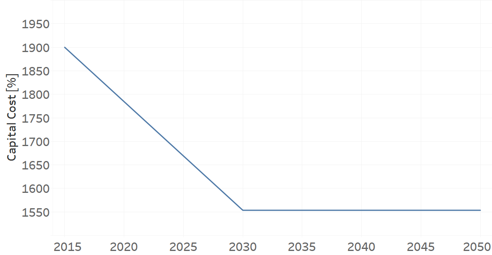
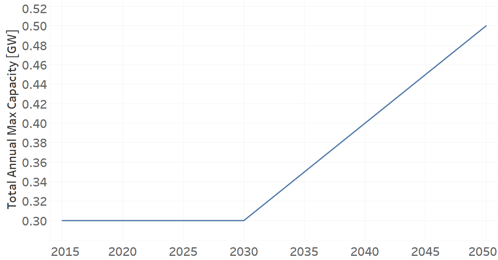

Power Plants
=======================================

Biomass Power Plant (existing) 
+++++++++

+-------------------------------------------------+-------+--------------+--------------+--------------+--------------+
| .. figure:: img/PPBIO.jpg                                                                                           |
|    :align:   center                                                                                                 |
|    :width:   500 px                                                                                                 |
+-------------------------------------------------+-------+--------------+--------------+--------------+--------------+
| Set codification:                                       |PPBIO001                                                   |
+-------------------------------------------------+-------+--------------+--------------+--------------+--------------+
| Description:                                            |Biomass Power Plant (existing)                             |
+-------------------------------------------------+-------+--------------+--------------+--------------+--------------+
| Set:                                                    |Technology                                                 |
+-------------------------------------------------+-------+--------------+--------------+--------------+--------------+
| Parameter                                       | Unit  | 2020         | 2030         | 2040         |  2050        |
+=================================================+=======+==============+==============+==============+==============+
| CapacityFactor[r,t,l,y] (Dry)                   |   %   | 0.317        | 0.317        | 0.317        | 0.317        |
+-------------------------------------------------+-------+--------------+--------------+--------------+--------------+
| CapacityFactor[r,t,l,y] (Rain)                  |   %   | 0.317        | 0.317        | 0.317        | 0.317        |
+-------------------------------------------------+-------+--------------+--------------+--------------+--------------+
| FixedCost[r,t,y]                                | M$/GW | 44.5         | 44.5         | 44.5         | 44.5         |
+-------------------------------------------------+-------+--------------+--------------+--------------+--------------+
| OperationalLife[r,t]                            | Years | 25           | 25           | 25           | 25           |
+-------------------------------------------------+-------+--------------+--------------+--------------+--------------+
| OutputActivityRatio[r,t,f,m,y] (Electricity     | PJ/PJ | 1            | 1            | 1            | 1            |
| Supply by Plants)                               |       |              |              |              |              |
+-------------------------------------------------+-------+--------------+--------------+--------------+--------------+
| ResidualCapacity[r,t,y]                         |  GW   | 0.03         | 0.03         | 0.03         | 0.03         |
+-------------------------------------------------+-------+--------------+--------------+--------------+--------------+
| TotalAnnualMaxCapacity[r,t,y]                   |  GW   | 0.03         | 0.03         | 0.03         | 0.03         |
+-------------------------------------------------+-------+--------------+--------------+--------------+--------------+
| VariableCost[r,t,m,y]                           | M$/PJ | 0.001        | 0.001        | 0.001        | 0.001        |
+-------------------------------------------------+-------+--------------+--------------+--------------+--------------+

CapacityFactor[r,t,l,y]
---------
The equation (1) shows the Capacity Factor for PPBIO001, for every scenario and season.

CapacityFactor=0.317%   (1)

Source:
   This is the source. 
   
Description: 
   This is the description. 

FixedCost[r,t,y]
---------
The equation (2) shows the Fixed Cost for PPBIO001, for every scenario.

FixedCost=44.5 [M$/GW]   (2)

Source:
   This is the source. 
   
Description: 
   This is the description.
   
OperationalLife[r,t]
---------
The equation (3) shows the Operational Life for PPBIO001, for every scenario.

OperationalLife=25 Years   (3)

Source:
   This is the source. 
   
Description: 
   This is the description.   
   
OutputActivityRatio[r,t,f,m,y]
---------
The equation (4) shows the Output Activity Ratio for PPBIO001, for every scenario and associated to the fuel Electricity Supply by Plants.

OutputActivityRatio=1 [PJ/PJ]   (4)

Source:
   This is the source. 
   
Description: 
   This is the description.      
   
ResidualCapacity[r,t,y]
---------
The equation (5) shows the Residual Capacity for PPBIO001, for every scenario.

ResidualCapacity=0.03 [GW]   (5)

Source:
   This is the source. 
   
Description: 
   This is the description.         
   
TotalAnnualMaxCapacity[r,t,y]
---------
The equation (6) shows the Total Annual Max Capacity for PPBIO001, for every scenario.

TotalAnnualMaxCapacity=0.03 [GW]   (6)

Source:
   This is the source. 
   
Description: 
   This is the description.            
   
VariableCost[r,t,m,y]
---------
The equation (7) shows the Variable Cost for PPBIO001, for every scenario.

VariableCost=0.001 [M$/PJ]   (7)

Source:
   This is the source. 
   
Description: 
   This is the description.               

PPBIO002: Biomass Power Plant (new)
+++++++++

+-------------------------------------------------+-------+--------------+--------------+--------------+--------------+
| .. figure:: img/PPBIO.jpg                                                                                           |
|    :align:   center                                                                                                 |
|    :width:   500 px                                                                                                 |
+-------------------------------------------------+-------+--------------+--------------+--------------+--------------+
| Set codification:                                       | PPBIO002                                                  |
+-------------------------------------------------+-------+--------------+--------------+--------------+--------------+
| Description:                                            | Biomass Power Plant (new)                                 |
+-------------------------------------------------+-------+--------------+--------------+--------------+--------------+
| Set:                                                    | Technology                                                |
+-------------------------------------------------+-------+--------------+--------------+--------------+--------------+
| Parameter                                       | Unit  | 2020         | 2030         | 2040         |  2050        |
+=================================================+=======+==============+==============+==============+==============+
| CapacityFactor[r,t,l,y] (Dry)                   |   %   | 0.75         | 0.75         | 0.75         | 0.75         |
+-------------------------------------------------+-------+--------------+--------------+--------------+--------------+
| CapacityFactor[r,t,l,y] (Rain)                  |   %   | 0.317        | 0.317        | 0.317        | 0.317        |
+-------------------------------------------------+-------+--------------+--------------+--------------+--------------+
| CapitalCost[r,t,y]                              | M$/GW | 2463.28      | 2463.28      | 2463.28      | 2463.28      |
+-------------------------------------------------+-------+--------------+--------------+--------------+--------------+
| FixedCost[r,t,y]                                | M$/GW | 44.5         | 44.5         | 44.5         | 44.5         |
+-------------------------------------------------+-------+--------------+--------------+--------------+--------------+
| OperationalLife[r,t]                            | Years | 25           | 25           | 25           | 25           |
+-------------------------------------------------+-------+--------------+--------------+--------------+--------------+
| OutputActivityRatio[r,t,f,m,y] (Electricity     | PJ/PJ | 1            | 1            | 1            | 1            |
| Supply by Plants)                               |       |              |              |              |              |
+-------------------------------------------------+-------+--------------+--------------+--------------+--------------+
| TotalAnnualMaxCapacity[r,t,y]                   |  GW   | 0            | 0.0115       | 0.0308       | 0.05         |
+-------------------------------------------------+-------+--------------+--------------+--------------+--------------+
| VariableCost[r,t,m,y]                           | M$/PJ | 0.001        | 0.001        | 0.001        | 0.001        |
+-------------------------------------------------+-------+--------------+--------------+--------------+--------------+

CapacityFactor[r,t,l,y]
---------
The equation (1) shows the Capacity Factor for PPBIO002, for every scenario and season.

CapacityFactor=0.75%   (1)

Source:
   This is the source. 
   
Description: 
   This is the description.
   
CapitalCost[r,t,y]
---------
The equation (2) shows the Capital Cost for PPBIO002, for every scenario.

CapitalCost=2463.28 [M$/GW]   (2)

Source:
   This is the source. 
   
Description: 
   This is the description.   
   
FixedCost[r,t,y]
---------
The equation (3) shows the Fixed Cost for PPBIO002, for every scenario.

FixedCost=44.5 [M$/GW]   (3)

Source:
   This is the source. 
   
Description: 
   This is the description.  
   
OperationalLife[r,t]
---------
The equation (4) shows the Operational Life for PPBIO002, for every scenario.

OperationalLife=25 Years   (4)

Source:
   This is the source. 
   
Description: 
   This is the description.  
   
OutputActivityRatio[r,t,f,m,y]
---------
The equation (5) shows the Output Activity Ratio for PPBIO002, for every scenario and associated to the fuel Electricity Supply by Plants.

OutputActivityRatio=1 [PJ/PJ]   (5)

Source:
   This is the source. 
   
Description: 
   This is the description.   
   
TotalAnnualMaxCapacity[r,t,y]
---------
The figure 1 shows the Total Annual Max Capacity for PPBIO002, for every scenario.

.. figure:: img/PPBIO002_TotalAnnualMaxCapacity.png
   :align:   center
   :width:   700 px
   
   *Figure 1) Total Annual Max Capacity for PPBIO002.*
   
Source:
   This is the source. 
   
Description: 
   This is the description.      

VariableCost[r,t,m,y]
---------
The equation (6) shows the Variable Cost for PPBIO002, for every scenario.

VariableCost=0.001 [M$/PJ]   (6)

Source:
   This is the source. 
   
Description: 
   This is the description.  

PPDSL001: Diesel Power Plant (existing)
+++++++++

+-------------------------------------------------+-------+--------------+--------------+--------------+--------------+
| .. figure:: img/PPDSL.jpg                                                                                           |
|    :align:   center                                                                                                 |
|    :width:   500 px                                                                                                 |
+-------------------------------------------------+-------+--------------+--------------+--------------+--------------+
| Set codification:                                       |PPDSL001                                                   |
+-------------------------------------------------+-------+--------------+--------------+--------------+--------------+
| Description:                                            |Diesel Power Plant (existing)                              |
+-------------------------------------------------+-------+--------------+--------------+--------------+--------------+
| Set:                                                    |Technology                                                 |
+-------------------------------------------------+-------+--------------+--------------+--------------+--------------+
| Parameter                                       | Unit  | 2020         | 2030         | 2040         |  2050        |
+=================================================+=======+==============+==============+==============+==============+
| CapacityFactor[r,t,l,y] (Dry)                   |   %   | 0.034        | 0.034        | 0.034        | 0.034        |
+-------------------------------------------------+-------+--------------+--------------+--------------+--------------+
| CapacityFactor[r,t,l,y] (Rain)                  |   %   | 0.034        | 0.034        | 0.034        | 0.034        |
+-------------------------------------------------+-------+--------------+--------------+--------------+--------------+
| FixedCost[r,t,y]                                | M$/GW | 44.5         | 44.5         | 44.5         | 44.5         |
+-------------------------------------------------+-------+--------------+--------------+--------------+--------------+
| InputActivityRatio[r,t,f,m,y] (Diesel)          | PJ/PJ | 2.85         | 2.85         | 2.85         | 2.85         |
+-------------------------------------------------+-------+--------------+--------------+--------------+--------------+
| OperationalLife[r,t]                            | Years | 30           | 30           | 30           | 30           |
+-------------------------------------------------+-------+--------------+--------------+--------------+--------------+
| OutputActivityRatio[r,t,f,m,y] (Electricity     | PJ/PJ | 1            | 1            | 1            | 1            |
| Supply by Plants)                               |       |              |              |              |              |
+-------------------------------------------------+-------+--------------+--------------+--------------+--------------+
| ResidualCapacity[r,t,y]                         |  GW   | 0.381        | 0.381        | 0.381        | 0.381        |
+-------------------------------------------------+-------+--------------+--------------+--------------+--------------+
| TotalAnnualMaxCapacity[r,t,y]                   |  GW   | 0.381        | 0.381        | 0.381        | 0.381        |
+-------------------------------------------------+-------+--------------+--------------+--------------+--------------+
| VariableCost[r,t,m,y]                           | M$/PJ | 1.3          | 1.3          | 1.3          | 1.3          |
+-------------------------------------------------+-------+--------------+--------------+--------------+--------------+

CapacityFactor[r,t,l,y]
---------
The equation (1) shows the Capacity Factor for PPDSL001, for every scenario and season.

CapacityFactor=0.034%   (1)

Source:
   This is the source. 
   
Description: 
   This is the description. 

FixedCost[r,t,y]
---------
The equation (2) shows the Fixed Cost for PPDSL001, for every scenario.

FixedCost=44.5 [M$/GW]   (2)

Source:
   This is the source. 
   
Description: 
   This is the description.
   
InputActivityRatio[r,t,f,m,y]
---------
The equation (3) shows the Input Activity Ratio for PPDSL001, for every scenario and associated to the fuel Diesel.

InputActivityRatio=2.85 [PJ/PJ]   (3)

Source:
   This is the source. 
   
Description: 
   This is the description.
   
OperationalLife[r,t]
---------
The equation (4) shows the Operational Life for PPDSL001, for every scenario.

OperationalLife=30 Years   (4)

Source:
   This is the source. 
   
Description: 
   This is the description.   
   
OutputActivityRatio[r,t,f,m,y]
---------
The equation (5) shows the Output Activity Ratio for PPDSL001, for every scenario and associated to the fuel Electricity Supply by Plants.

OutputActivityRatio=1 [PJ/PJ]   (5)

Source:
   This is the source. 
   
Description: 
   This is the description.      
   
ResidualCapacity[r,t,y]
---------
The equation (6) shows the Residual Capacity for PPDSL001, for every scenario.

ResidualCapacity=0.381 [GW]   (6)

Source:
   This is the source. 
   
Description: 
   This is the description.         
   
TotalAnnualMaxCapacity[r,t,y]
---------
The equation (7) shows the Total Annual Max Capacity for PPDSL001, for every scenario.

TotalAnnualMaxCapacity=0.381 [GW]   (7)

Source:
   This is the source. 
   
Description: 
   This is the description.            
   
VariableCost[r,t,m,y]
---------
The equation (8) shows the Variable Cost for PPDSL001, for every scenario.

VariableCost=1.3 [M%/PJ]   (8)

Source:
   This is the source. 
   
Description: 
   This is the description.    

PPDSL002: Diesel Power Plant (new)
+++++++++

+-------------------------------------------------+-------+--------------+--------------+--------------+--------------+
| .. figure:: img/PPDSL.jpg                                                                                           |
|    :align:   center                                                                                                 |
|    :width:   500 px                                                                                                 |
+-------------------------------------------------+-------+--------------+--------------+--------------+--------------+
| Set codification:                                       |PPDSL002                                                   |
+-------------------------------------------------+-------+--------------+--------------+--------------+--------------+
| Description:                                            |Diesel Power Plant (new)                                   |
+-------------------------------------------------+-------+--------------+--------------+--------------+--------------+
| Set:                                                    |Technology                                                 |
+-------------------------------------------------+-------+--------------+--------------+--------------+--------------+
| Parameter                                       | Unit  | 2020         | 2030         | 2040         |  2050        |
+=================================================+=======+==============+==============+==============+==============+
| CapacityFactor[r,t,l,y] (Dry)                   |   %   | 0.034        | 0.034        | 0.034        | 0.034        |
+-------------------------------------------------+-------+--------------+--------------+--------------+--------------+
| CapacityFactor[r,t,l,y] (Rain)                  |   %   | 0.034        | 0.034        | 0.034        | 0.034        |
+-------------------------------------------------+-------+--------------+--------------+--------------+--------------+
| CapitalCost[r,t,y]                              | M$/GW | 1269.78      | 1269.78      | 1269.78      | 1269.78      |
+-------------------------------------------------+-------+--------------+--------------+--------------+--------------+
| FixedCost[r,t,y]                                | M$/GW | 44.5         | 44.5         | 44.5         | 44.5         |
+-------------------------------------------------+-------+--------------+--------------+--------------+--------------+
| InputActivityRatio[r,t,f,m,y] (Diesel)          | PJ/PJ | 2.5          | 2.5          | 2.5          | 2.5          |
+-------------------------------------------------+-------+--------------+--------------+--------------+--------------+
| OperationalLife[r,t]                            | Years | 30           | 30           | 30           | 30           |
+-------------------------------------------------+-------+--------------+--------------+--------------+--------------+
| OutputActivityRatio[r,t,f,m,y] (Electricity     | PJ/PJ | 1            | 1            | 1            | 1            |
| Supply by Plants)                               |       |              |              |              |              |
+-------------------------------------------------+-------+--------------+--------------+--------------+--------------+
| VariableCost[r,t,m,y]                           | M$/PJ | 1.3          | 1.3          | 1.3          | 1.3          |
+-------------------------------------------------+-------+--------------+--------------+--------------+--------------+

CapacityFactor[r,t,l,y]
---------
The equation (1) shows the Capacity Factor for PPDSL002, for every scenario and season.

CapacityFactor=0.034%   (1)

Source:
   This is the source. 
   
Description: 
   This is the description. 
   
CapitalCost[r,t,y]
---------
The equation (2) shows the Capital Cost for PPDSL002, for every scenario.

CapitalCost=1269.78 [M$/GW]   (2)

Source:
   This is the source. 
   
Description: 
   This is the description.

FixedCost[r,t,y]
---------
The equation (3) shows the Fixed Cost for PPDSL002, for every scenario.

FixedCost=44.5 [M$/GW]   (3)

Source:
   This is the source. 
   
Description: 
   This is the description.
   
InputActivityRatio[r,t,f,m,y]
---------
The equation (4) shows the Input Activity Ratio for PPDSL002, for every scenario and associated to the fuel Diesel.

InputActivityRatio=2.5 [PJ/PJ]   (4)

Source:
   This is the source. 
   
Description: 
   This is the description.
   
OperationalLife[r,t]
---------
The equation (5) shows the Operational Life for PPDSL002, for every scenario.

OperationalLife=30 Years   (5)

Source:
   This is the source. 
   
Description: 
   This is the description.   
   
OutputActivityRatio[r,t,f,m,y]
---------
The equation (6) shows the Output Activity Ratio for PPDSL002, for every scenario and associated to the fuel Electricity Supply by Plants.

OutputActivityRatio=1 [PJ/PJ]   (6)

Source:
   This is the source. 
   
Description: 
   This is the description.      
   
VariableCost[r,t,m,y]
---------
The equation (7) shows the Variable Cost for PPDSL002, for every scenario.

VariableCost=1.3 [M$/PJ]   (7)

Source:
   This is the source. 
   
Description: 
   This is the description.    
   
   
PPFOB001: Oil Power Plant (existing)
+++++++++

+-------------------------------------------------+-------+--------------+--------------+--------------+--------------+
| .. figure:: img/PPFOB.jpg                                                                                           |
|    :align:   center                                                                                                 |
|    :width:   500 px                                                                                                 |
+-------------------------------------------------+-------+--------------+--------------+--------------+--------------+
| Set codification:                                       |PPFOB001                                                   |
+-------------------------------------------------+-------+--------------+--------------+--------------+--------------+
| Description:                                            |Oil Power Plant (existing)                                 |
+-------------------------------------------------+-------+--------------+--------------+--------------+--------------+
| Set:                                                    |Technology                                                 |
+-------------------------------------------------+-------+--------------+--------------+--------------+--------------+
| Parameter                                       | Unit  | 2020         | 2030         | 2040         |  2050        |
+=================================================+=======+==============+==============+==============+==============+
| CapacityFactor[r,t,l,y] (Dry)                   |   %   | 0.034        | 0.034        | 0.034        | 0.034        |
+-------------------------------------------------+-------+--------------+--------------+--------------+--------------+
| CapacityFactor[r,t,l,y] (Rain)                  |   %   | 0.034        | 0.034        | 0.034        | 0.034        |
+-------------------------------------------------+-------+--------------+--------------+--------------+--------------+
| FixedCost[r,t,y]                                | M$/GW | 44.5         | 44.5         | 44.5         | 44.5         |
+-------------------------------------------------+-------+--------------+--------------+--------------+--------------+
| InputActivityRatio[r,t,f,m,y] (Fuel Oil)        | PJ/PJ | 2.85         | 2.85         | 2.85         | 2.85         |
+-------------------------------------------------+-------+--------------+--------------+--------------+--------------+
| OperationalLife[r,t]                            | Years | 30           | 30           | 30           | 30           |
+-------------------------------------------------+-------+--------------+--------------+--------------+--------------+
| OutputActivityRatio[r,t,f,m,y] (Electricity     | PJ/PJ | 1            | 1            | 1            | 1            |
| Supply by Plants)                               |       |              |              |              |              |
+-------------------------------------------------+-------+--------------+--------------+--------------+--------------+
| ResidualCapacity[r,t,y]                         |  GW   | 0.214        | 0.214        | 0.214        | 0.214        |
+-------------------------------------------------+-------+--------------+--------------+--------------+--------------+
| TotalAnnualMaxCapacity[r,t,y]                   |  GW   | 0.214        | 0.214        | 0.214        | 0.214        |
+-------------------------------------------------+-------+--------------+--------------+--------------+--------------+
| VariableCost[r,t,m,y]                           | M$/PJ | 1.3          | 1.3          | 1.3          | 1.3          |
+-------------------------------------------------+-------+--------------+--------------+--------------+--------------+

CapacityFactor[r,t,l,y]
---------
The equation (1) shows the Capacity Factor for PPFOB001, for every scenario and season. 

CapacityFactor=0.034%   (1)

Source:
   This is the source. 
   
Description: 
   This is the description. 

FixedCost[r,t,y]
---------
The equation (2) shows the Fixed Cost for PPFOB001, for every scenario.

FixedCost=44.5 [M$/GW]   (2)

Source:
   This is the source. 
   
Description: 
   This is the description.
   
InputActivityRatio[r,t,f,m,y]
---------
The equation (3) shows the Input Activity Ratio for PPFOB001, for every scenario and associated to the fuel Fuel Oil.

InputActivityRatio=2.85 [PJ/PJ]   (3)

Source:
   This is the source. 
   
Description: 
   This is the description.   
   
OperationalLife[r,t]
---------
The equation (4) shows the Operational Life for PPFOB001, for every scenario.

OperationalLife=30 Years   (4)

Source:
   This is the source. 
   
Description: 
   This is the description.   
   
OutputActivityRatio[r,t,f,m,y]
---------
The equation (5) shows the Output Activity Ratio for PPFOB001, for every scenario and associated to the fuel Electricity Supply by Plants.

OutputActivityRatio=1 [PJ/PJ]   (5)

Source:
   This is the source. 
   
Description: 
   This is the description.      
   
ResidualCapacity[r,t,y]
---------
The equation (6) shows the Residual Capacity for PPFOB001, for every scenario.

ResidualCapacity=0.214 [GW]   (6)

Source:
   This is the source. 
   
Description: 
   This is the description.         
   
TotalAnnualMaxCapacity[r,t,y]
---------
The equation (7) shows the Total Annual Max Capacity for PPFOB001, for every scenario.

TotalAnnualMaxCapacity=0.214 [GW]   (7)

Source:
   This is the source. 
   
Description: 
   This is the description.            
   
VariableCost[r,t,m,y]
---------
The equation (8) shows the Variable Cost for PPFOB001, for every scenario.

VariableCost=1.3 [M$/PJ]   (8)

Source:
   This is the source. 
   
Description: 
   This is the description.               

PPFOB002: Oil Power Plant (new)
+++++++++

+-------------------------------------------------+-------+--------------+--------------+--------------+--------------+
| .. figure:: img/PPFOB.jpg                                                                                           |
|    :align:   center                                                                                                 |
|    :width:   500 px                                                                                                 |
+-------------------------------------------------+-------+--------------+--------------+--------------+--------------+
| Set codification:                                       |PPFOB002                                                   |
+-------------------------------------------------+-------+--------------+--------------+--------------+--------------+
| Description:                                            |Oil Power Plant (new)                                      |
+-------------------------------------------------+-------+--------------+--------------+--------------+--------------+
| Set:                                                    |Technology                                                 |
+-------------------------------------------------+-------+--------------+--------------+--------------+--------------+
| Parameter                                       | Unit  | 2020         | 2030         | 2040         |  2050        |
+=================================================+=======+==============+==============+==============+==============+
| CapacityFactor[r,t,l,y] (Dry)                   |   %   | 0.034        | 0.034        | 0.034        | 0.034        |
+-------------------------------------------------+-------+--------------+--------------+--------------+--------------+
| CapacityFactor[r,t,l,y] (Rain)                  |   %   | 0.034        | 0.034        | 0.034        | 0.034        |
+-------------------------------------------------+-------+--------------+--------------+--------------+--------------+
| CapitalCost[r,t,y]                              | M$/GW | 4650.33      | 4650.33      | 4650.33      | 4650.33      |
+-------------------------------------------------+-------+--------------+--------------+--------------+--------------+
| FixedCost[r,t,y]                                | M$/GW | 44.5         | 44.5         | 44.5         | 44.5         |
+-------------------------------------------------+-------+--------------+--------------+--------------+--------------+
| InputActivityRatio[r,t,f,m,y] (Fuel Oil)        | PJ/PJ | 2.5          | 2.5          | 2.5          | 2.5          |
+-------------------------------------------------+-------+--------------+--------------+--------------+--------------+
| OperationalLife[r,t]                            | Years | 30           | 30           | 30           | 30           |
+-------------------------------------------------+-------+--------------+--------------+--------------+--------------+
| OutputActivityRatio[r,t,f,m,y] (Electricity     | PJ/PJ | 1            | 1            | 1            | 1            |
| Supply by Plants)                               |       |              |              |              |              |
+-------------------------------------------------+-------+--------------+--------------+--------------+--------------+
| VariableCost[r,t,m,y]                           | M$/PJ | 1.3          | 1.3          | 1.3          | 1.3          |
+-------------------------------------------------+-------+--------------+--------------+--------------+--------------+

CapacityFactor[r,t,l,y]
---------
The equation (1) shows the Capacity Factor for PPFOB002, for every scenario and season.

CapacityFactor=0.034%   (1)

Source:
   This is the source. 
   
Description: 
   This is the description. 
   
CapitalCost[r,t,y]
---------
The equation (2) shows the Capital Cost for PPFOB002, for every scenario.

CapitalCost=4650.33 [M$/GW]   (2)

Source:
   This is the source. 
   
Description: 
   This is the description.

FixedCost[r,t,y]
---------
The equation (3) shows the Fixed Cost for PPFOB002, for every scenario.

FixedCost=44.5 [M$/GW]   (3)

Source:
   This is the source. 
   
Description: 
   This is the description.
   
InputActivityRatio[r,t,f,m,y]
---------
The equation (4) shows the Input Activity Ratio for PPFOB002, for every scenario and associated to the fuel Fuel Oil.

InputActivityRatio=2.5 [PJ/PJ]   (4)

Source:
   This is the source. 
   
Description: 
   This is the description.
   
OperationalLife[r,t]
---------
The equation (5) shows the Operational Life for PPFOB002, for every scenario.

OperationalLife=30 Years   (5)

Source:
   This is the source. 
   
Description: 
   This is the description.   
   
OutputActivityRatio[r,t,f,m,y]
---------
The equation (6) shows the Output Activity Ratio for PPFOB002, for every scenario and associated to the fuel Electricity Supply by Plants.

OutputActivityRatio=1 [PJ/PJ]   (6)

Source:
   This is the source. 
   
Description: 
   This is the description.      
   
VariableCost[r,t,m,y]
---------
The equation (7) shows the Variable Cost for PPFOB002, for every scenario.

VariableCost=1.3 [M$/PJ]   (7)

Source:
   This is the source. 
   
Description: 
   This is the description.    

PPGEO001: Geothermal Power Plant (existing)
+++++++++

+-------------------------------------------------+-------+--------------+--------------+--------------+--------------+
| .. figure:: img/PPGEO.jpg                                                                                           |
|    :align:   center                                                                                                 |
|    :width:   500 px                                                                                                 |
+-------------------------------------------------+-------+--------------+--------------+--------------+--------------+
| Set codification:                                       |PPGEO001                                                   |
+-------------------------------------------------+-------+--------------+--------------+--------------+--------------+
| Description:                                            |Geothermal Power Plant (existing)                          |
+-------------------------------------------------+-------+--------------+--------------+--------------+--------------+
| Set:                                                    |Technology                                                 |
+-------------------------------------------------+-------+--------------+--------------+--------------+--------------+
| Parameter                                       | Unit  | 2020         | 2030         | 2040         |  2050        |
+=================================================+=======+==============+==============+==============+==============+
| CapacityFactor[r,t,l,y] (Dry)                   |   %   | 0.634        | 0.89         | 0.89         | 0.89         |
+-------------------------------------------------+-------+--------------+--------------+--------------+--------------+
| CapacityFactor[r,t,l,y] (Rain)                  |   %   | 0.634        | 0.89         | 0.89         | 0.89         |
+-------------------------------------------------+-------+--------------+--------------+--------------+--------------+
| FixedCost[r,t,y]                                | M$/GW | 44.5         | 44.5         | 44.5         | 44.5         |
+-------------------------------------------------+-------+--------------+--------------+--------------+--------------+
| InputActivityRatio[r,t,f,m,y] (Geothermal       | PJ/PJ | 2.85         | 2.85         | 2.85         | 2.85         |
| energy)                                         |       |              |              |              |              |
+-------------------------------------------------+-------+--------------+--------------+--------------+--------------+
| OperationalLife[r,t]                            | Years | 40           | 40           | 40           | 40           |
+-------------------------------------------------+-------+--------------+--------------+--------------+--------------+
| OutputActivityRatio[r,t,f,m,y] (Electricity     | PJ/PJ | 1            | 1            | 1            | 1            |
| Supply by Plants)                               |       |              |              |              |              |
+-------------------------------------------------+-------+--------------+--------------+--------------+--------------+
| ResidualCapacity[r,t,y]                         |  GW   | 0.206        | 0.206        | 0.206        | 0.206        |
+-------------------------------------------------+-------+--------------+--------------+--------------+--------------+
| TotalAnnualMaxCapacity[r,t,y]                   |  GW   | 0.206        | 0.206        | 0.206        | 0.206        |
+-------------------------------------------------+-------+--------------+--------------+--------------+--------------+
| VariableCost[r,t,m,y]                           | M$/PJ | 0.001        | 0.001        | 0.001        | 0.001        |
+-------------------------------------------------+-------+--------------+--------------+--------------+--------------+

CapacityFactor[r,t,l,y]
---------
The equation (1) shows the Capacity Factor for PPGEO001, for every scenario and season.

.. figure:: img/PPGEO001_CapacityFactor.png
   :align:   center
   :width:   700 px
   
   *Figure 1) Capacity Factor for PPGEO001.*

Source:
   This is the source. 
   
Description: 
   This is the description. 

FixedCost[r,t,y]
---------
The equation (1) shows the Fixed Cost for PPGEO001, for every scenario.

FixedCost=44.5 [M$/GW]   (1)

Source:
   This is the source. 
   
Description: 
   This is the description.
   
InputActivityRatio[r,t,f,m,y]
---------
The equation (2) shows the Input Activity Ratio for PPGEO001, for every scenario and associated to the fuel Geothermal Energy.

InputActivityRatio=2.85 [PJ/PJ]   (2)

Source:
   This is the source. 
   
Description: 
   This is the description.   
   
OperationalLife[r,t]
---------
The equation (3) shows the Operational Life for PPGEO001, for every scenario.

OperationalLife=40 Years   (3)

Source:
   This is the source. 
   
Description: 
   This is the description.   
   
OutputActivityRatio[r,t,f,m,y]
---------
The equation (4) shows the Output Activity Ratio for PPGEO001, for every scenario and associated to the fuel Electricity Supply by Plants.

OutputActivityRatio=1 [PJ/PJ]   (4)

Source:
   This is the source. 
   
Description: 
   This is the description.      
   
ResidualCapacity[r,t,y]
---------
The equation (5) shows the Residual Capacity for PPGEO001, for every scenario.

ResidualCapacity=0.206 [GW]   (5)

Source:
   This is the source. 
   
Description: 
   This is the description.         
   
TotalAnnualMaxCapacity[r,t,y]
---------
The equation (6) shows the Total Annual Max Capacity for PPGEO001, for every scenario.

TotalAnnualMaxCapacity=0.206 [GW]   (6)

Source:
   This is the source. 
   
Description: 
   This is the description.            
   
VariableCost[r,t,m,y]
---------
The equation (7) shows the Variable Cost for PPGEO001, for every scenario.

VariableCost=0.001 [M$/PJ]   (7)

Source:
   This is the source. 
   
Description: 
   This is the description. 

PPGEO002: Geothermal Power Plant (new)
++++++++

+-------------------------------------------------+-------+--------------+--------------+--------------+--------------+
| .. figure:: img/PPGEO.jpg                                                                                           |
|    :align:   center                                                                                                 |
|    :width:   500 px                                                                                                 |
+-------------------------------------------------+-------+--------------+--------------+--------------+--------------+
| Set codification:                                       |PPGEO002                                                   |
+-------------------------------------------------+-------+--------------+--------------+--------------+--------------+
| Description:                                            |Geothermal Power Plant (new)                               |
+-------------------------------------------------+-------+--------------+--------------+--------------+--------------+
| Set:                                                    |Technology                                                 |
+-------------------------------------------------+-------+--------------+--------------+--------------+--------------+
| Parameter                                       | Unit  | 2020         | 2030         | 2040         |  2050        |
+=================================================+=======+==============+==============+==============+==============+
| CapacityFactor[r,t,l,y] (Dry)                   |   %   | 0.634        | 0.89         | 0.89         | 0.89         |
+-------------------------------------------------+-------+--------------+--------------+--------------+--------------+
| CapacityFactor[r,t,l,y] (Rain)                  |   %   | 0.634        | 0.89         | 0.89         | 0.89         |
+-------------------------------------------------+-------+--------------+--------------+--------------+--------------+
| CapitalCost[r,t,y]                              | M$/GW | 7828.28      | 7828.28      | 7828.28      | 7828.28      |
+-------------------------------------------------+-------+--------------+--------------+--------------+--------------+
| FixedCost[r,t,y]                                | M$/GW | 44.5         | 44.5         | 44.5         | 44.5         |
+-------------------------------------------------+-------+--------------+--------------+--------------+--------------+
| InputActivityRatio[r,t,f,m,y] (Geothermal       | PJ/PJ | 1            | 1            | 1            | 1            |
| energy)                                         |       |              |              |              |              |
+-------------------------------------------------+-------+--------------+--------------+--------------+--------------+
| OperationalLife[r,t]                            | Years | 40           | 40           | 40           | 40           |
+-------------------------------------------------+-------+--------------+--------------+--------------+--------------+
| OutputActivityRatio[r,t,f,m,y] (Electricity     | PJ/PJ | 1            | 1            | 1            | 1            |
| Supply by Plants)                               |       |              |              |              |              |
+-------------------------------------------------+-------+--------------+--------------+--------------+--------------+
| TotalAnnualMaxCapacity[r,t,y]                   |  GW   | 0.2          | 0.2          | 0.35         | 0.5          |
+-------------------------------------------------+-------+--------------+--------------+--------------+--------------+
| TotalAnnualMinCapacityInvestment[r,t,y]         |  GW   | 0            | 0.055        | 0            | 0            |
+-------------------------------------------------+-------+--------------+--------------+--------------+--------------+
| VariableCost[r,t,m,y]                           | M$/PJ | 0.001        | 0.001        | 0.001        | 0.001        |
+-------------------------------------------------+-------+--------------+--------------+--------------+--------------+

CapacityFactor[r,t,l,y]
---------
The figure 1 shows the Capacity Factor for PPGEO002, for every scenario and season.

.. figure:: img/PPGEO002_CapacityFactor.png
   :align:   center
   :width:   700 px
   
   *Figure 1) Capacity Factor for PPGEO002.*

Source:
   This is the source. 
   
Description: 
   This is the description. 
   
CapitalCost[r,t,y]
---------
The equation (1) shows the Capital Cost for PPGEO002, for every scenario.

CapitalCost=7828.28 [M$/GW]   (1)

Source:
   This is the source. 
   
Description: 
   This is the description.

FixedCost[r,t,y]
---------
The equation (2) shows the Fixed Cost for PPGEO002, for every scenario.

FixedCost=44.5 [M$/GW]   (2)

Source:
   This is the source. 
   
Description: 
   This is the description.
   
InputActivityRatio[r,t,f,m,y]
---------
The equation (3) shows the Input Activity Ratio for PPGEO002, for every scenario and associated to the fuel Geothermal Energy.

InputActivityRatio=1   [PJ/PJ]   (3)

Source:
   This is the source. 
   
Description: 
   This is the description.
   
OperationalLife[r,t]
---------
The equation (4) shows the Operational Life for PPGEO002, for every scenario.

OperationalLife=40 Years   (4)

Source:
   This is the source. 
   
Description: 
   This is the description.   
   
OutputActivityRatio[r,t,f,m,y]
---------
The equation (5) shows the Output Activity Ratio for PPGEO002, for every scenario and associated to the fuel Electricity Supply by Plants.

OutputActivityRatio=1 [PJ/PJ]   (5)

Source:
   This is the source. 
   
Description: 
   This is the description. 
   
TotalAnnualMaxCapacity[r,t,y]
---------
The figure 2 shows the Total Annual Max Capacity for PPGEO002, for every scenario.

   
   *Figure 2) Total Annual Max Capacity for PPGEO002.*

Source:
   This is the source. 
   
Description: 
   This is the description.
   
TotalAnnualMinCapacityInvestment[r,t,y]
---------
The figure 3 show the Total Annual Min Capacity Investment for PPGEO002, for every scenario.

.. figure:: img/PPGEO002_TotalAnnualMinCapacityInvestment.png
   :align:   center
   :width:   700 px
   
   *Figure 3) Total Annual Min Capacity Investment for PPGEO002.*

Source:
   This is the source. 
   
Description: 
   This is the description.   
   
VariableCost[r,t,m,y]
---------
The equation (6) shows the Variable Cost for PPGEO002, for every scenario.

VariableCost=0.001 [M$/PJ]   (6)

Source:
   This is the source. 
   
Description: 
   This is the description.    

PPHDAM001: Hydro Dam Power Plant (existing)
+++++++++

+-------------------------------------------------+-------+--------------+--------------+--------------+--------------+
| .. figure:: img/PHH.jpg                                                                                             |
|    :align:   center                                                                                                 |
|    :width:   500 px                                                                                                 |
+-------------------------------------------------+-------+--------------+--------------+--------------+--------------+
| Set codification:                                       |PPHDAM001                                                  |
+-------------------------------------------------+-------+--------------+--------------+--------------+--------------+
| Description:                                            |Hydro Dam Power Plant (existing)                           |
+-------------------------------------------------+-------+--------------+--------------+--------------+--------------+
| Set:                                                    |Technology                                                 |
+-------------------------------------------------+-------+--------------+--------------+--------------+--------------+
| Parameter                                       | Unit  | 2020         | 2030         | 2040         |  2050        |
+=================================================+=======+==============+==============+==============+==============+
| CapacityFactor[r,t,l,y] (Dry)                   |   %   | 0.4374       | 0.6          | 0.6          | 0.6          |
+-------------------------------------------------+-------+--------------+--------------+--------------+--------------+
| CapacityFactor[r,t,l,y] (Rain)                  |   %   | 0.4374       | 0.6          | 0.6          | 0.6          |
+-------------------------------------------------+-------+--------------+--------------+--------------+--------------+
| FixedCost[r,t,y]                                | M$/GW | 47.9         | 47.9         | 47.9         | 47.9         |
+-------------------------------------------------+-------+--------------+--------------+--------------+--------------+
| InputActivityRatio[r,t,f,m,y] (Hydraulic        | PJ/PJ | 2.85         | 2.85         | 2.85         | 2.85         |
| energy)                                         |       |              |              |              |              |
+-------------------------------------------------+-------+--------------+--------------+--------------+--------------+
| OperationalLife[r,t]                            | Years | 80           | 80           | 80           | 80           |
+-------------------------------------------------+-------+--------------+--------------+--------------+--------------+
| OutputActivityRatio[r,t,f,m,y] (Electricity     | PJ/PJ | 1            | 1            | 1            | 1            |
| Supply by Plants)                               |       |              |              |              |              |
+-------------------------------------------------+-------+--------------+--------------+--------------+--------------+
| ResidualCapacity[r,t,y]                         |  GW   | 1.13         | 1.13         | 1.13         | 1.13         |
+-------------------------------------------------+-------+--------------+--------------+--------------+--------------+
| TotalAnnualMaxCapacity[r,t,y]                   |  GW   | 1.13         | 1.13         | 1.13         | 1.13         |
+-------------------------------------------------+-------+--------------+--------------+--------------+--------------+
| VariableCost[r,t,m,y]                           | M$/PJ | 0.001        | 0.001        | 0.001        | 0.001        |
+-------------------------------------------------+-------+--------------+--------------+--------------+--------------+

CapacityFactor[r,t,l,y]
---------
The figure 1 shows the Capacity Factor for PPHDAM001, for every scenario and season.

.. figure:: img/PPHDAM001_CapacityFactor.png
   :align:   center
   :width:   700 px
   
   *Figure 1) Capacity Factor for PPHDAM001.*

Source:
   This is the source. 
   
Description: 
   This is the description. 

FixedCost[r,t,y]
---------
The equation (1) shows the Fixed Cost for PPHDAM001, for every scenario.

FixedCost=47.9 [M$/GW]   (1)

Source:
   This is the source. 
   
Description: 
   This is the description.
   
InputActivityRatio[r,t,f,m,y]
---------
The equation (2) shows the Input Activity Ratio for PPHDAM001, for every scenario and associated to the fuel Hydraulic Energy.

InputActivityRatio=2.85 [PJ/PJ]   (2)

Source:
   This is the source. 
   
Description: 
   This is the description.   
   
OperationalLife[r,t]
---------
The equation (3) shows the Operational Life for PPHDAM001, for every scenario.

OperationalLife=80 Years   (3)

Source:
   This is the source. 
   
Description: 
   This is the description.   
   
OutputActivityRatio[r,t,f,m,y]
---------
The equation (4) shows the Output Activity Ratio for PPHDAM001, for every scenario and associated to the fuel Electricity Supply by Plants.

OutputActivityRatio=1 [PJ/PJ]   (4)

Source:
   This is the source. 
   
Description: 
   This is the description.      
   
ResidualCapacity[r,t,y]
---------
The equation (5) shows the Residual Capacity for PPHDAM001, for every scenario.

ResidualCapacity=1.13 [GW]   (5)

Source:
   This is the source. 
   
Description: 
   This is the description.         
   
TotalAnnualMaxCapacity[r,t,y]
---------
The equation (6) shows the Total Annual Max Capacity for PPHDAM001, for every scenario.

TotalAnnualMaxCapacity=1.13 [GW]   (6)

Source:
   This is the source. 
   
Description: 
   This is the description.            
   
VariableCost[r,t,m,y]
---------
The equation (7) shows the Variable Cost for PPHDAM001, for every scenario.

VariableCost=0.001 [M$/PJ]   (7)

Source:
   This is the source. 
   
Description: 
   This is the description. 
   
   
PPHROR001: Hydro Run of River Power Plant (existing)
+++++++++

+-------------------------------------------------+-------+--------------+--------------+--------------+--------------+
| .. figure:: img/PHH.jpg                                                                                             |
|    :align:   center                                                                                                 |
|    :width:   500 px                                                                                                 |
+-------------------------------------------------+-------+--------------+--------------+--------------+--------------+
| Set codification:                                       |PPHROR001                                                  |
+-------------------------------------------------+-------+--------------+--------------+--------------+--------------+
| Description:                                            |Hydro Run of River Power Plant (existing)                  |
+-------------------------------------------------+-------+--------------+--------------+--------------+--------------+
| Set:                                                    |Technology                                                 |
+-------------------------------------------------+-------+--------------+--------------+--------------+--------------+
| Parameter                                       | Unit  | 2020         | 2030         | 2040         |  2050        |
+=================================================+=======+==============+==============+==============+==============+
| CapacityFactor[r,t,l,y] (Dry)                   |   %   | 0.4966       | 0.6          | 0.6          | 0.6          |
+-------------------------------------------------+-------+--------------+--------------+--------------+--------------+
| CapacityFactor[r,t,l,y] (Rain)                  |   %   | 0.4966       | 0.6          | 0.6          | 0.6          |
+-------------------------------------------------+-------+--------------+--------------+--------------+--------------+
| FixedCost[r,t,y]                                | M$/GW | 47.9         | 47.9         | 47.9         | 47.9         |
+-------------------------------------------------+-------+--------------+--------------+--------------+--------------+
| InputActivityRatio[r,t,f,m,y] (Hydraulic        | PJ/PJ | 1            | 1            | 1            | 1            |
| energy)                                         |       |              |              |              |              |
+-------------------------------------------------+-------+--------------+--------------+--------------+--------------+
| OperationalLife[r,t]                            | Years | 60           | 60           | 60           | 60           |
+-------------------------------------------------+-------+--------------+--------------+--------------+--------------+
| OutputActivityRatio[r,t,f,m,y] (Electricity     | PJ/PJ | 1            | 1            | 1            | 1            |
| Supply by Plants)                               |       |              |              |              |              |
+-------------------------------------------------+-------+--------------+--------------+--------------+--------------+
| ResidualCapacity[r,t,y]                         |  GW   | 1.21         | 1.21         | 1.21         | 1.21         |
+-------------------------------------------------+-------+--------------+--------------+--------------+--------------+
| TotalAnnualMaxCapacity[r,t,y]                   |  GW   | 1.21         | 1.21         | 1.21         | 1.21         |
+-------------------------------------------------+-------+--------------+--------------+--------------+--------------+
| VariableCost[r,t,m,y]                           | M$/PJ | 0.001        | 0.001        | 0.001        | 0.001        |
+-------------------------------------------------+-------+--------------+--------------+--------------+--------------+

CapacityFactor[r,t,l,y]
---------
The figure 1 shows the Capacity Factor for PPHROR001, for every scenario and season.

.. figure:: img/PPHROR001_CapacityFactor.png
   :align:   center
   :width:   700 px
   
   *Figure 1) Capacity Factor for PPHROR001.*

Source:
   This is the source. 
   
Description: 
   This is the description. 

FixedCost[r,t,y]
---------
The equation (1) shows the Fixed Cost for PPHROR001, for every scenario.

FixedCost=47.9 [M$/GW]   (1)

Source:
   This is the source. 
   
Description: 
   This is the description.
   
InputActivityRatio[r,t,f,m,y]
---------
The equation (2) shows the Input Activity Ratio for PPHROR001, for every scenario and associated to the fuel Hydraulic Energy.

InputActivityRatio=1 [PJ/PJ]   (2)

Source:
   This is the source. 
   
Description: 
   This is the description.   
   
OperationalLife[r,t]
---------
The equation (3) shows the Operational Life for PPHROR001, for every scenario.

OperationalLife=60 Years   (3)

Source:
   This is the source. 
   
Description: 
   This is the description.   
   
OutputActivityRatio[r,t,f,m,y]
---------
The equation (4) shows the Output Activity Ratio for PPHROR001, for every scenario and associated to the fuel Electricity Supply by Plants.

OutputActivityRatio=1 [PJ/PJ]   (4)

Source:
   This is the source. 
   
Description: 
   This is the description.      
   
ResidualCapacity[r,t,y]
---------
The equation (5) shows the Residual Capacity for PPHROR001, for every scenario.

ResidualCapacity=1.21 [GW]   (5)

Source:
   This is the source. 
   
Description: 
   This is the description.         
   
TotalAnnualMaxCapacity[r,t,y]
---------
The equation (6) shows the Total Annual Max Capacity for PPHROR001, for every scenario.

TotalAnnualMaxCapacity=1.21 [GW]   (6)

Source:
   This is the source. 
   
Description: 
   This is the description.            
   
VariableCost[r,t,m,y]
---------
The equation (7) shows the Variable Cost for PPHROR001, for every scenario.

VariableCost=0.001 [M$/PJ]   (7)

Source:
   This is the source. 
   
Description: 
   This is the description. 

PPHROR002: Hydro Run of River Power Plant (new)
++++++++

+-------------------------------------------------+-------+--------------+--------------+--------------+--------------+
| .. figure:: img/PHH.jpg                                                                                             |
|    :align:   center                                                                                                 |
|    :width:   500 px                                                                                                 |
+-------------------------------------------------+-------+--------------+--------------+--------------+--------------+
| Set codification:                                       |PPHROR002                                                  |
+-------------------------------------------------+-------+--------------+--------------+--------------+--------------+
| Description:                                            |Hydro Run of River Power Plant (new)                       |
+-------------------------------------------------+-------+--------------+--------------+--------------+--------------+
| Set:                                                    |Technology                                                 |
+-------------------------------------------------+-------+--------------+--------------+--------------+--------------+
| Parameter                                       | Unit  | 2020         | 2030         | 2040         |  2050        |
+=================================================+=======+==============+==============+==============+==============+
| CapacityFactor[r,t,l,y] (Dry)                   |   %   | 0.4966       | 0.6          | 0.6          | 0.6          |
+-------------------------------------------------+-------+--------------+--------------+--------------+--------------+
| CapacityFactor[r,t,l,y] (Rain)                  |   %   | 0.4966       | 0.6          | 0.6          | 0.6          |
+-------------------------------------------------+-------+--------------+--------------+--------------+--------------+
| CapitalCost[r,t,y]                              | M$/GW | 4385.15      | 4385.15      | 4385.15      | 4385.15      |
+-------------------------------------------------+-------+--------------+--------------+--------------+--------------+
| FixedCost[r,t,y]                                | M$/GW | 47.9         | 47.9         | 47.9         | 47.9         |
+-------------------------------------------------+-------+--------------+--------------+--------------+--------------+
| InputActivityRatio[r,t,f,m,y] (Hydraulic        | PJ/PJ | 1            | 1            | 1            | 1            |
| energy)                                         |       |              |              |              |              |
+-------------------------------------------------+-------+--------------+--------------+--------------+--------------+
| OperationalLife[r,t]                            | Years | 60           | 60           | 60           | 60           |
+-------------------------------------------------+-------+--------------+--------------+--------------+--------------+
| OutputActivityRatio[r,t,f,m,y] (Electricity     | PJ/PJ | 1            | 1            | 1            | 1            |
| Supply by Plants)                               |       |              |              |              |              |
+-------------------------------------------------+-------+--------------+--------------+--------------+--------------+
| TotalAnnualMaxCapacity[r,t,y]                   |  GW   | 0.02         | 0.08         | 0.14         | 0.2          |
+-------------------------------------------------+-------+--------------+--------------+--------------+--------------+
| TotalAnnualMinCapacityInvestment[r,t,y]         |  GW   | 0.019        | 0            | 0            | 0            |
+-------------------------------------------------+-------+--------------+--------------+--------------+--------------+
| VariableCost[r,t,m,y]                           | M$/PJ | 0.001        | 0.001        | 0.001        | 0.001        |
+-------------------------------------------------+-------+--------------+--------------+--------------+--------------+

CapacityFactor[r,t,l,y]
---------
The figure 1 shows the Capacity Factor for PPHROR002, for every scenario and season.

   
   *Figure 1) Capacity Factor for PPHROR002.*

Source:
   This is the source. 
   
Description: 
   This is the description. 
   
CapitalCost[r,t,y]
---------
The equation (1) shows the Capital Cost for PPHROR002, para todos los escenarios.

CapitalCost=4385.15 [M$/GW]   (1)

Source:
   This is the source. 
   
Description: 
   This is the description.

FixedCost[r,t,y]
---------
The equation (2) shows the Fixed Cost for PPHROR002, for every scenario.

FixedCost=47.9 [M$/GW]   (2)

Source:
   This is the source. 
   
Description: 
   This is the description.
   
InputActivityRatio[r,t,f,m,y]
---------
The equation (3) shows the Input Activity Ratio for PPHROR002, for every scenario and associated to the fuel Hydraulic Energy.

InputActivityRatio=1   [PJ/PJ]   (3)

Source:
   This is the source. 
   
Description: 
   This is the description.
   
OperationalLife[r,t]
---------
The equation (4) shows the Operational Life for PPHROR002, for every scenario.

OperationalLife=60 Years   (4)

Source:
   This is the source. 
   
Description: 
   This is the description.   
   
OutputActivityRatio[r,t,f,m,y]
---------
The equation (5) shows the Output Activity Ratio for PPHROR002, for every scenario and associated to the fuel Electricity Supply by Plants.

OutputActivityRatio=1 [PJ/PJ]   (5)

Source:
   This is the source. 
   
Description: 
   This is the description. 
   
TotalAnnualMaxCapacity[r,t,y]
---------
The figure 2 shows the Total Annual Max Capacity for PPHROR002, for every scenario.

.. figure:: img/PPHROR002_TotalAnnualMaxCapacity.png
   :align:   center
   :width:   700 px
   
   *Figure 2) Total Annual Max Capacity for PPHROR002.*

Source:
   This is the source. 
   
Description: 
   This is the description.
   
TotalAnnualMinCapacityInvestment[r,t,y]
---------
The figure 3 shows the Total Annual Min Capacity Investment for PPHROR002, for every scenario.

.. figure:: img/PPHROR002_TotalAnnualMinCapacityInvestment.png
   :align:   center
   :width:   700 px
   
   *Figure 3) Total Annual Min Capacity Investment for PPHROR002.*

Source:
   This is the source. 
   
Description: 
   This is the description.   
   
VariableCost[r,t,m,y]
---------
The equation (6) shows the Variable Cost for PPHROR002, for every scenario.

VariableCost=0.001 [M$/PJ]   (6)

Source:
   This is the source. 
   
Description: 
   This is the description.   
   
   
PPPVD002: Photovoltaic Power Plant Distribution (new)
+++++++++

+-------------------------------------------------+-------+--------------+--------------+--------------+--------------+
| .. figure:: img/PPPVD.jpg                                                                                           |
|    :align:   center                                                                                                 |
|    :width:   500 px                                                                                                 |
+-------------------------------------------------+-------+--------------+--------------+--------------+--------------+
| Set codification:                                       |PPPVD002                                                   |
+-------------------------------------------------+-------+--------------+--------------+--------------+--------------+
| Description:                                            |Photovoltaic Power Plant Distribution (new)                |
+-------------------------------------------------+-------+--------------+--------------+--------------+--------------+
| Set:                                                    |Technology                                                 |
+-------------------------------------------------+-------+--------------+--------------+--------------+--------------+
| Parameter                                       | Unit  | 2020         | 2030         | 2040         |  2050        |
+=================================================+=======+==============+==============+==============+==============+
| CapacityFactor[r,t,l,y] (Dry)                   |   %   | 0.227        | 0.227        | 0.227        | 0.227        |
+-------------------------------------------------+-------+--------------+--------------+--------------+--------------+
| CapacityFactor[r,t,l,y] (Rain)                  |   %   | 0.227        | 0.227        | 0.227        | 0.227        |
+-------------------------------------------------+-------+--------------+--------------+--------------+--------------+
| CapitalCost[r,t,y]                              | M$/GW | 1784.5       | 1553.5       | 1553.5       | 1553.5       |
+-------------------------------------------------+-------+--------------+--------------+--------------+--------------+
| FixedCost[r,t,y]                                | M$/GW | 15.6         | 15.6         | 15.6         | 15.6         |
+-------------------------------------------------+-------+--------------+--------------+--------------+--------------+
| InputActivityRatio[r,t,f,m,y] (Solar            | PJ/PJ | 1            | 1            | 1            | 1            |
| energy)                                         |       |              |              |              |              |
+-------------------------------------------------+-------+--------------+--------------+--------------+--------------+
| OperationalLife[r,t]                            | Years | 20           | 20           | 20           | 20           |
+-------------------------------------------------+-------+--------------+--------------+--------------+--------------+
| OutputActivityRatio[r,t,f,m,y] (Electricity     | PJ/PJ | 1            | 1            | 1            | 1            |
| For Transmission)                               |       |              |              |              |              |
+-------------------------------------------------+-------+--------------+--------------+--------------+--------------+
| TotalAnnualMaxCapacity[r,t,y]                   |  GW   | 0.1          | 0.3          | 1.659        | 3            |
+-------------------------------------------------+-------+--------------+--------------+--------------+--------------+
| VariableCost[r,t,m,y]                           | M$/PJ | 0.001        | 0.001        | 0.001        | 0.001        |
+-------------------------------------------------+-------+--------------+--------------+--------------+--------------+

CapacityFactor[r,t,l,y]
---------
The equation (1) shows the Capacity Factor for PPPVD002, for every scenario and season.

CapacityFactor=0.227%   (1)

Source:
   This is the source. 
   
Description: 
   This is the description. 
   
CapitalCost[r,t,y]
---------
The figure 1 shows the Capital Cost for PPPVD002, for every scenario.

   
   *Figure 1) Capital Cost for PPPVD002.*

Source:
   This is the source. 
   
Description: 
   This is the description.

FixedCost[r,t,y]
---------
The equation (2) shows the Fixed Cost for PPPVD002, for every scenario.

FixedCost=15.6 [M$/GW]   (2)

Source:
   This is the source. 
   
Description: 
   This is the description.
   
InputActivityRatio[r,t,f,m,y]
---------
The equation (3) shows the Input Activity Ratio for PPPVD002, for every scenario and associated to the fuel Solar Energy.

InputActivityRatio=1   [PJ/PJ]   (3)

Source:
   This is the source. 
   
Description: 
   This is the description.
   
OperationalLife[r,t]
---------
The equation (4) shows the Operational Life for PPPVD002, for every scenario.

OperationalLife=20 Years   (4)

Source:
   This is the source. 
   
Description: 
   This is the description.   
   
OutputActivityRatio[r,t,f,m,y]
---------
The equation (5) shows the Output Activity Ratio for PPPVD002, for every scenario and associated to the fuel Electricity for Transmission.

OutputActivityRatio=1 [PJ/PJ]   (5)

Source:
   This is the source. 
   
Description: 
   This is the description. 
   
TotalAnnualMaxCapacity[r,t,y]
---------
The figure 2 shows the Total Annual Max Capacity for PPPVD002, for every scenario.

.. figure:: img/PPPVD002_TotalAnnualMaxCapacity.png
   :align:   center
   :width:   700 px
   
   *Figure 2) Total Annual Max Capacity for PPPVD002.*

Source:
   This is the source. 
   
Description: 
   This is the description.
   
VariableCost[r,t,m,y]
---------
The equation (6) shows the Variable Cost for PPPVD002, for every scenario.

VariableCost=0.001 [M$/PJ]   (6)

Source:
   This is the source. 
   
Description: 
   This is the description.     

PPPVT001: Photovoltaic Power Plant Transmission (existing)
++++++++++

+-------------------------------------------------+-------+--------------+--------------+--------------+--------------+
| .. figure:: img/PPPVD.jpg                                                                                           |
|    :align:   center                                                                                                 |
|    :width:   500 px                                                                                                 |
+-------------------------------------------------+-------+--------------+--------------+--------------+--------------+
| Set codification:                                       |PPPVT001                                                   |
+-------------------------------------------------+-------+--------------+--------------+--------------+--------------+
| Description:                                            |Photovoltaic Power Plant Transmission (existing)           |
+-------------------------------------------------+-------+--------------+--------------+--------------+--------------+
| Set:                                                    |Technology                                                 |
+-------------------------------------------------+-------+--------------+--------------+--------------+--------------+
| Parameter                                       | Unit  | 2020         | 2030         | 2040         |  2050        |
+=================================================+=======+==============+==============+==============+==============+
| CapacityFactor[r,t,l,y] (Dry)                   |   %   | 0.277        | 0.277        | 0.277        | 0.277        |
+-------------------------------------------------+-------+--------------+--------------+--------------+--------------+
| CapacityFactor[r,t,l,y] (Rain)                  |   %   | 0.277        | 0.277        | 0.277        | 0.277        |
+-------------------------------------------------+-------+--------------+--------------+--------------+--------------+
| FixedCost[r,t,y]                                | M$/GW | 31.3         | 31.3         | 31.3         | 31.3         |
+-------------------------------------------------+-------+--------------+--------------+--------------+--------------+
| InputActivityRatio[r,t,f,m,y] (Solar            | PJ/PJ | 1            | 1            | 1            | 1            |
| energy)                                         |       |              |              |              |              |
+-------------------------------------------------+-------+--------------+--------------+--------------+--------------+
| OperationalLife[r,t]                            | Years | 25           | 25           | 25           | 25           |
+-------------------------------------------------+-------+--------------+--------------+--------------+--------------+
| OutputActivityRatio[r,t,f,m,y] (Electricity     | PJ/PJ | 1            | 1            | 1            | 1            |
| Supply by Plants)                               |       |              |              |              |              |
+-------------------------------------------------+-------+--------------+--------------+--------------+--------------+
| ResidualCapacity[r,t,y]                         |  GW   | 0.0054       | 0.0054       | 0.0054       | 0.0054       |
+-------------------------------------------------+-------+--------------+--------------+--------------+--------------+
| TotalAnnualMaxCapacity[r,t,y]                   |  GW   | 0.0054       | 0.0054       | 0.0054       | 0.0054       |
+-------------------------------------------------+-------+--------------+--------------+--------------+--------------+
| VariableCost[r,t,m,y]                           | M$/PJ | 0.001        | 0.001        | 0.001        | 0.001        |
+-------------------------------------------------+-------+--------------+--------------+--------------+--------------+

CapacityFactor[r,t,l,y]
---------
The equation (1) shows the Capacity Factor for PPPVT001, for every scenario and season.

CapacityFactor=0.277%   (1)

Source:
   This is the source. 
   
Description: 
   This is the description. 

FixedCost[r,t,y]
---------
The equation (2) shows the Fixed Cost for PPPVT001, for every scenario.

FixedCost=31.3 [M$/GW]   (2)

Source:
   This is the source. 
   
Description: 
   This is the description.
   
InputActivityRatio[r,t,f,m,y]
---------
The equation (3) shows the Input Activity Ratio for PPPVT001, for every scenario and associated to the fuel Solar Energy. 

InputActivityRatio=1 [PJ/PJ]   (3)

Source:
   This is the source. 
   
Description: 
   This is the description.   
   
OperationalLife[r,t]
---------
The equation (4) shows the Operational Life for PPPVT001, for every scenario.

OperationalLife=25 Years   (4)

Source:
   This is the source. 
   
Description: 
   This is the description.   
   
OutputActivityRatio[r,t,f,m,y]
---------
The equation (5) shows the Output Activity Ratio for PPPVT001, for every scenario and associated to the fuel Electricity Supply by Plants.

OutputActivityRatio=1 [PJ/PJ]   (5)

Source:
   This is the source. 
   
Description: 
   This is the description.      
   
ResidualCapacity[r,t,y]
---------
The equation (6) shows the Residual Capacity for PPPVT001, for every scenario.

ResidualCapacity=0.0054 [GW]   (6)

Source:
   This is the source. 
   
Description: 
   This is the description.         
   
TotalAnnualMaxCapacity[r,t,y]
---------
The equation (7) shows the Total Annual Max Capacity for PPPVT001, for every scenario. 

TotalAnnualMaxCapacity=0.0054 [GW]   (7)

Source:
   This is the source. 
   
Description: 
   This is the description.            
   
VariableCost[r,t,m,y]
---------
The equation (8) shows the Variable Cost for PPPVT001, for every scenario.

VariableCost=0.001 [M$/PJ]   (8)

Source:
   This is the source. 
   
Description: 
   This is the description. 

PPPVT002: Photovoltaic Power Plant Transmission (new)
+++++++++

+-------------------------------------------------+-------+--------------+--------------+--------------+--------------+
| .. figure:: img/PPPVD.jpg                                                                                           |
|    :align:   center                                                                                                 |
|    :width:   500 px                                                                                                 |
+-------------------------------------------------+-------+--------------+--------------+--------------+--------------+
| Set codification:                                       |PPPVT002                                                   |
+-------------------------------------------------+-------+--------------+--------------+--------------+--------------+
| Description:                                            |Photovoltaic Power Plant Transmission (new)                |
+-------------------------------------------------+-------+--------------+--------------+--------------+--------------+
| Set:                                                    |Technology                                                 |
+-------------------------------------------------+-------+--------------+--------------+--------------+--------------+
| Parameter                                       | Unit  | 2020         | 2030         | 2040         |  2050        |
+=================================================+=======+==============+==============+==============+==============+
| CapacityFactor[r,t,l,y] (Dry)                   |   %   | 0.227        | 0.227        | 0.227        | 0.227        |
+-------------------------------------------------+-------+--------------+--------------+--------------+--------------+
| CapacityFactor[r,t,l,y] (Rain)                  |   %   | 0.227        | 0.227        | 0.227        | 0.227        |
+-------------------------------------------------+-------+--------------+--------------+--------------+--------------+
| CapitalCost[r,t,y]                              | M$/GW | 2484.5       | 2253.5       | 2253.5       | 2253.5       |
+-------------------------------------------------+-------+--------------+--------------+--------------+--------------+
| FixedCost[r,t,y]                                | M$/GW | 31.3         | 31.3         | 31.3         | 31.3         |
+-------------------------------------------------+-------+--------------+--------------+--------------+--------------+
| InputActivityRatio[r,t,f,m,y] (Solar            | PJ/PJ | 1            | 1            | 1            | 1            |
| energy)                                         |       |              |              |              |              |
+-------------------------------------------------+-------+--------------+--------------+--------------+--------------+
| OperationalLife[r,t]                            | Years | 25           | 25           | 25           | 25           |
+-------------------------------------------------+-------+--------------+--------------+--------------+--------------+
| OutputActivityRatio[r,t,f,m,y] (Electricity     | PJ/PJ | 1            | 1            | 1            | 1            |
| Supply by Plants)                               |       |              |              |              |              |
+-------------------------------------------------+-------+--------------+--------------+--------------+--------------+
| TotalAnnualMaxCapacity[r,t,y]                   |  GW   | 0.3          | 0.3          | 0.4          | 0.5          |
+-------------------------------------------------+-------+--------------+--------------+--------------+--------------+
| TotalAnnualMinCapacityInvestment[r,t,y]         |  GW   | 0            | 0            | 0            | 0            |
+-------------------------------------------------+-------+--------------+--------------+--------------+--------------+
| VariableCost[r,t,m,y]                           | M$/PJ | 0.001        | 0.001        | 0.001        | 0.001        |
+-------------------------------------------------+-------+--------------+--------------+--------------+--------------+

CapacityFactor[r,t,l,y]
---------
The equation (1) shows the Capacity Factor for PPPVT002, for every scenario and season.

CapacityFactor=0.227%   (1)

Source:
   This is the source. 
   
Description: 
   This is the description. 
   
CapitalCost[r,t,y]
---------
The figure 1 shows the Capital Cost for PPPVT002, for every scenario.

.. figure:: img/PPPVT002_CapitalCost.png
   :align:   center
   :width:   700 px
   
   *Figure 1) Capital Cost for PPPVT002.*
   
Source:
   This is the source. 
   
Description: 
   This is the description.

FixedCost[r,t,y]
---------
The equation (2) shows the Fixed Cost for PPPVT002, for every scenario.

FixedCost=31.3 [M$/GW]   (2)

Source:
   This is the source. 
   
Description: 
   This is the description.
   
InputActivityRatio[r,t,f,m,y]
---------
The equation (3) shows the Input Activity Ratio for PPPVT002, for every scenario and associated to the fuel Solar Energy.

InputActivityRatio=1   [PJ/PJ]   (3)

Source:
   This is the source. 
   
Description: 
   This is the description.
   
OperationalLife[r,t]
---------
The equation (4) shows the Operational Life for PPPVT002, for every scenario.

OperationalLife=25 Years   (4)

Source:
   This is the source. 
   
Description: 
   This is the description.   
   
OutputActivityRatio[r,t,f,m,y]
---------
The equation (5) shows the Output Activity Ratio for PPPVT002, for every scenario and associated to the fuel Electricity Supply by Plants.

OutputActivityRatio=1 [PJ/PJ]   (5)

Source:
   This is the source. 
   
Description: 
   This is the description. 
   
TotalAnnualMaxCapacity[r,t,y]
---------
The figure 2 shows the Total Annual Max Capacity for PPPVT002, for every scenario.

   
   *Figure 2) Total Annual Max Capacity for PPPVT002.*

Source:
   This is the source. 
   
Description: 
   This is the description.
   
TotalAnnualMinCapacityInvestment[r,t,y]
---------
The figure 3 show the Total Annual Min Capacity Investment for PPPVT002, for every scenario.

.. figure:: img/PPPVT002_TotalAnnualMinCapacityInvestment.png
   :align:   center
   :width:   700 px
   
   *Figure 3) Total Annual Min Capacity Investment for PPPVT002.*

Source:
   This is the source. 
   
Description: 
   This is the description.   
   
VariableCost[r,t,m,y]
---------
The equation (6) shows the Variable Cost for PPPVT002, for every scenario.

VariableCost=0.001 [M$/PJ]   (6)

Source:
   This is the source. 
   
Description: 
   This is the description.    

PPWND002: Wind Power Plant Distribution (new)
+++++++++

+-------------------------------------------------+-------+--------------+--------------+--------------+--------------+
| .. figure:: img/PPWN.jpg                                                                                            |
|    :align:   center                                                                                                 |
|    :width:   500 px                                                                                                 |
+-------------------------------------------------+-------+--------------+--------------+--------------+--------------+
| Set codification:                                       |PPWND002                                                   |
+-------------------------------------------------+-------+--------------+--------------+--------------+--------------+
| Description:                                            |Wind Power Plant Distribution (new)                        |
+-------------------------------------------------+-------+--------------+--------------+--------------+--------------+
| Set:                                                    |Technology                                                 |
+-------------------------------------------------+-------+--------------+--------------+--------------+--------------+
| Parameter                                       | Unit  | 2020         | 2030         | 2040         |  2050        |
+=================================================+=======+==============+==============+==============+==============+
| CapacityFactor[r,t,l,y] (Dry)                   |   %   | 0.572        | 0.572        | 0.572        | 0.572        |
+-------------------------------------------------+-------+--------------+--------------+--------------+--------------+
| CapacityFactor[r,t,l,y] (Rain)                  |   %   | 0.572        | 0.572        | 0.572        | 0.572        |
+-------------------------------------------------+-------+--------------+--------------+--------------+--------------+
| CapitalCost[r,t,y]                              | M$/GW | 2384.5       | 2153.5       | 2153.5       | 2153.5       |
+-------------------------------------------------+-------+--------------+--------------+--------------+--------------+
| FixedCost[r,t,y]                                | M$/GW | 179.1        | 179.1        | 179.1        | 179.1        |
+-------------------------------------------------+-------+--------------+--------------+--------------+--------------+
| InputActivityRatio[r,t,f,m,y] (Eolic            | PJ/PJ | 1            | 1            | 1            | 1            |
| energy)                                         |       |              |              |              |              |
+-------------------------------------------------+-------+--------------+--------------+--------------+--------------+
| OperationalLife[r,t]                            | Years | 20           | 20           | 20           | 20           |
+-------------------------------------------------+-------+--------------+--------------+--------------+--------------+
| OutputActivityRatio[r,t,f,m,y] (Electricity     | PJ/PJ | 1            | 1            | 1            | 1            |
| For Transmission)                               |       |              |              |              |              |
+-------------------------------------------------+-------+--------------+--------------+--------------+--------------+
| TotalAnnualMaxCapacity[r,t,y]                   |  GW   | 0.075        | 0.225        | 0.375        | 0.525        |
+-------------------------------------------------+-------+--------------+--------------+--------------+--------------+
| VariableCost[r,t,m,y]                           | M$/PJ | 0.001        | 0.001        | 0.001        | 0.001        |
+-------------------------------------------------+-------+--------------+--------------+--------------+--------------+

CapacityFactor[r,t,l,y]
---------
The equation (1) shows the Capacity Factor for PPWND002, for every scenario and season.

CapacityFactor=0.572%   (1)

Fuente:
   This is the source. 
   
Description: 
   This is the description. 
   
CapitalCost[r,t,y]
---------
The figure 1 shows the Capital Cost for PPWND002, for every scenario.

.. figure:: img/PPWND002_CapitalCost.png
   :align:   center
   :width:   700 px
   
   *Figure 1) Capital Cost for PPWND002.*

Source:
   This is the source. 
   
Description: 
   This is the description.

FixedCost[r,t,y]
---------
The equation (2) shows the Fixed Cost for PPWND002, for every scenario.

FixedCost=179.1 [M$/GW]   (2)

Source:
   This is the source. 
   
Description: 
   This is the description.
   
InputActivityRatio[r,t,f,m,y]
---------
The equation (3) shows the Input Activity Ratio for PPWND002, for every scenario and associated to the fuel Eolic Energy.

InputActivityRatio=1   [PJ/PJ]   (3)

Source:
   This is the source. 
   
Description: 
   This is the description.
   
OperationalLife[r,t]
---------
The equation (4) shows the Operational Life for PPWND002, for every scenario.

OperationalLife=20 Years   (4)

Source:
   This is the source. 
   
Description: 
   This is the description.   
   
OutputActivityRatio[r,t,f,m,y]
---------
The equation (5) shows the Output Activity Ratio for PPWND002, for every scenario and associated to the fuel Electricity for Transmission.

OutputActivityRatio=1 [PJ/PJ]   (5)

Source:
   This is the source. 
   
Description: 
   This is the description. 
   
TotalAnnualMaxCapacity[r,t,y]
---------
The figure 2 shows the Total Annual Max Capacity for PPWND002, for every scenario.

.. figure:: img/PPWND002_TotalAnnualMaxCapacity.png
   :align:   center
   :width:   700 px
   
   *Figure 2) Total Annual Max Capacity for PPWND002.*

Source:
   This is the source. 
   
Description: 
   This is the description.
   
VariableCost[r,t,m,y]
---------
The equation (6) shows the Variable Cost for PPWND002, for every scenario.

VariableCost=0.001 [M$/PJ]   (6)

Source:
   This is the source. 
   
Description: 
   This is the description.    

PPWNT001: Wind Power Plant Transmission (existing)
+++++++++

+-------------------------------------------------+-------+--------------+--------------+--------------+--------------+
| .. figure:: img/PPWN.jpg                                                                                            |
|    :align:   center                                                                                                 |
|    :width:   500 px                                                                                                 |
+-------------------------------------------------+-------+--------------+--------------+--------------+--------------+
| Set codification:                                       |PPWNT001                                                   |
+-------------------------------------------------+-------+--------------+--------------+--------------+--------------+
| Description:                                            |Wind Power Plant Transmission (existing)                   |
+-------------------------------------------------+-------+--------------+--------------+--------------+--------------+
| Set:                                                    |Technology                                                 |
+-------------------------------------------------+-------+--------------+--------------+--------------+--------------+
| Parameter                                       | Unit  | 2020         | 2030         | 2040         |  2050        |
+=================================================+=======+==============+==============+==============+==============+
| CapacityFactor[r,t,l,y] (Dry)                   |   %   | 0.572        | 0.572        | 0.572        | 0.572        |
+-------------------------------------------------+-------+--------------+--------------+--------------+--------------+
| CapacityFactor[r,t,l,y] (Rain)                  |   %   | 0.572        | 0.572        | 0.572        | 0.572        |
+-------------------------------------------------+-------+--------------+--------------+--------------+--------------+
| FixedCost[r,t,y]                                | M$/GW | 179.1        | 179.1        | 179.1        | 179.1        |
+-------------------------------------------------+-------+--------------+--------------+--------------+--------------+
| InputActivityRatio[r,t,f,m,y] (Eolic            | PJ/PJ | 1            | 1            | 1            | 1            |
| energy)                                         |       |              |              |              |              |
+-------------------------------------------------+-------+--------------+--------------+--------------+--------------+
| OperationalLife[r,t]                            | Years | 25           | 25           | 25           | 25           |
+-------------------------------------------------+-------+--------------+--------------+--------------+--------------+
| OutputActivityRatio[r,t,f,m,y] (Electricity     | PJ/PJ | 1            | 1            | 1            | 1            |
| Supply by Plants)                               |       |              |              |              |              |
+-------------------------------------------------+-------+--------------+--------------+--------------+--------------+
| ResidualCapacity[r,t,y]                         |  GW   | 0.39         | 0.39         | 0.39         | 0.39         |
+-------------------------------------------------+-------+--------------+--------------+--------------+--------------+
| TotalAnnualMaxCapacity[r,t,y]                   |  GW   | 0.39         | 0.39         | 0.39         | 0.39         |
+-------------------------------------------------+-------+--------------+--------------+--------------+--------------+
| VariableCost[r,t,m,y]                           | M$/PJ | 0.001        | 0.001        | 0.001        | 0.001        |
+-------------------------------------------------+-------+--------------+--------------+--------------+--------------+

CapacityFactor[r,t,l,y]
---------
The equation (1) shows the Capacity Factor for PPWNT001, for every scenario and season.

CapacityFactor=0.572%   (1)

Source:
   This is the source. 
   
Description: 
   This is the description. 

FixedCost[r,t,y]
---------
The equation (2) shows the Fixed Cost for PPWNT001, for every scenario.

FixedCost=179.1 [M$/GW]   (2)

Source:
   This is the source. 
   
Description: 
   This is the description.
   
InputActivityRatio[r,t,f,m,y]
---------
The equation (3) shows the Input Activity Ratio for PPWNT001, for every scenario and associated to the fuel Eolic Energy. 

InputActivityRatio=1 [PJ/PJ]   (3)

Source:
   This is the source. 
   
Description: 
   This is the description.   
   
OperationalLife[r,t]
---------
The equation (4) shows the Operational Life for PPWNT001, for every scenario.

OperationalLife=25 Years   (4)

Source:
   This is the source. 
   
Description: 
   This is the description.   
   
OutputActivityRatio[r,t,f,m,y]
---------
The equation (5) shows the Output Activity Ratio for PPWNT001, for every scenario and associated to the fuel Electricity Supply by Plants.

OutputActivityRatio=1 [PJ/PJ]   (5)

Source:
   This is the source. 
   
Description: 
   This is the description.      
   
ResidualCapacity[r,t,y]
---------
The equation (6) shows the Residual Capacity for PPWNT001, for every scenario.

ResidualCapacity=0.39 [GW]   (6)

Source:
   This is the source. 
   
Description: 
   This is the description.         
   
TotalAnnualMaxCapacity[r,t,y]
---------
The equation (7) shows the Total Annual Max Capacity for PPWNT001, for every scenario. 

TotalAnnualMaxCapacity=0.39 [GW]   (7)

Source:
   This is the source. 
   
Description: 
   This is the description.            
   
VariableCost[r,t,m,y]
---------
The equation (8) shows the Variable Cost for PPWNT001, for every scenario.

VariableCost=0.001 [M$/PJ]   (8)

Source:
   This is the source. 
   
Description: 
   This is the description. 
