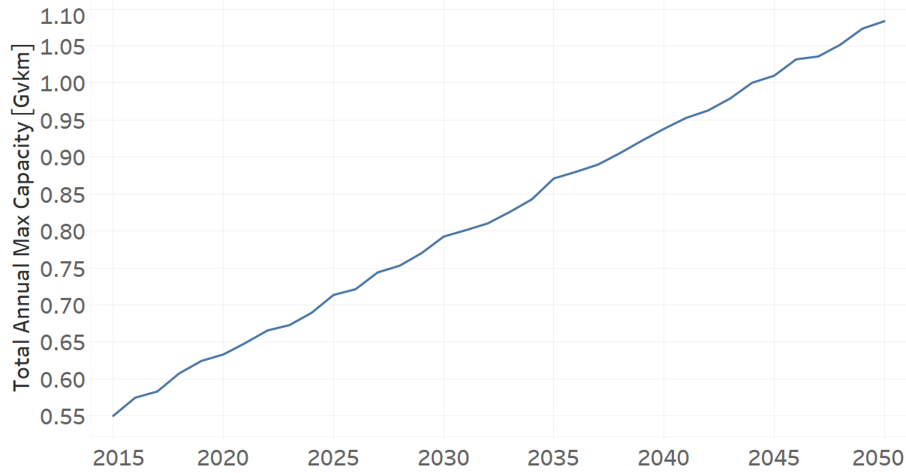
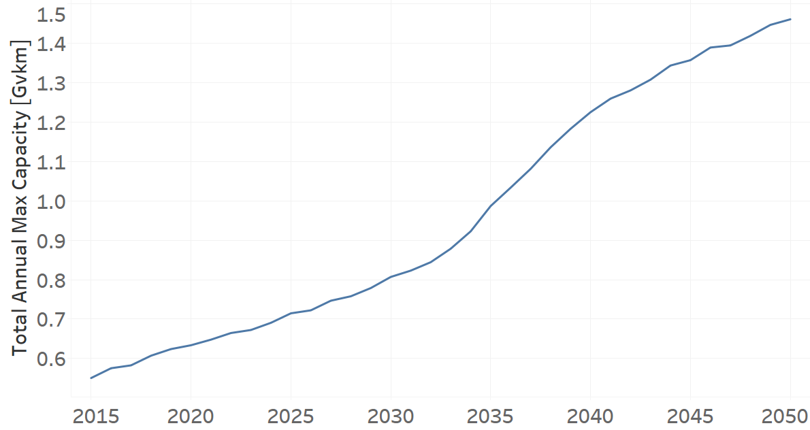
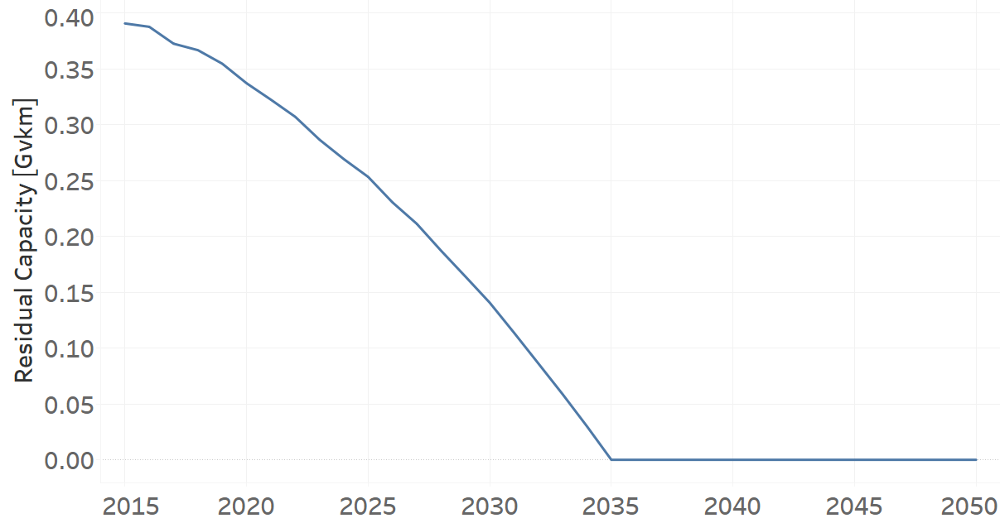

Taxis
=====================================

Taxis (Grouping Technology)
+++++++++

+-------------------------------------------------+-------+--------------+--------------+--------------+--------------+
| .. figure:: img/Techs_Taxis.png                                                                                     |
|    :align:   center                                                                                                 |
|    :width:   500 px                                                                                                 |
+-------------------------------------------------+-------+--------------+--------------+--------------+--------------+
| Set codification:                                       |Techs_Taxis                                                |
+-------------------------------------------------+-------+--------------+--------------+--------------+--------------+
| Description:                                            |Taxis                                                      |
+-------------------------------------------------+-------+--------------+--------------+--------------+--------------+
| Set:                                                    |Technology                                                 |
+-------------------------------------------------+-------+--------------+--------------+--------------+--------------+
| Parameter                                       | Unit  | 2020         | 2030         | 2040         |  2050        |
+=================================================+=======+==============+==============+==============+==============+
| DistanceDriven[r,t,y]                           |km/year| 48704        | 48704        | 48704        | 48704        |
+-------------------------------------------------+-------+--------------+--------------+--------------+--------------+
| InputActivityRatio[r,t,f,m,y] (Public           | Gpkm/ | 1            | 1            | 1            | 1            |
| Transport in Taxi)                              | Gvkm  |              |              |              |              |
+-------------------------------------------------+-------+--------------+--------------+--------------+--------------+
| OperationalLife[r,t]                            | Years | 1            | 1            | 1            | 1            |
+-------------------------------------------------+-------+--------------+--------------+--------------+--------------+
| OutputActivityRatio[r,t,f,m,y] (Transport Demand| Gpkm/ | 1.2          | 1.2          | 1.2          | 1.2          |
| Passenger Public)                               | Gvkm  |              |              |              |              |
+-------------------------------------------------+-------+--------------+--------------+--------------+--------------+
| TotalAnnualMaxCapacity[r,t,y] (BAU)             | Gvkm  | 0.633        | 0.7924       | 0.9381       | 1.0836       |
+-------------------------------------------------+-------+--------------+--------------+--------------+--------------+
| TotalAnnualMaxCapacity[r,t,y] (NDP)             | Gvkm  | 0.6336       | 0.8069       | 1.2249       | 1.4605       |
+-------------------------------------------------+-------+--------------+--------------+--------------+--------------+
| TotalTechnologyAnnualActivityLowerLimit[r,t,y]  | Gvkm  | 0.6317       | 0.7908       | 0.9363       | 1.0814       |
| (BAU)                                           |       |              |              |              |              |
+-------------------------------------------------+-------+--------------+--------------+--------------+--------------+
| TotalTechnologyAnnualActivityLowerLimit[r,t,y]  | Gvkm  | 0.6321       | 0.805        | 1.2219       | 1.4569       |
| (NDP)                                           |       |              |              |              |              |
+-------------------------------------------------+-------+--------------+--------------+--------------+--------------+

DistanceDriven[r,t,y]
---------
The equation (1) shows the Distance Driven for Techs_Taxis, for every scenario.

DistanceDriven=48704 [km/year]   (1)

   
InputActivityRatio[r,t,f,m,y]
---------
The equation (2) shows the Input Activity Ratio for Techs_Taxis, for every scenario and associated to the fuel Private Transport in Taxi.

InputActivityRatio=1   [Gpkm/Gvkm]   (2)

   
OperationalLife[r,t]
---------
The equation (3) shows the Operational Life for Techs_Taxis, for every scenario.

OperationalLife=1 Years   (3)

  
   
OutputActivityRatio[r,t,f,m,y]
---------
The equation (4) shows the Output Activity Ratio for Techs_Taxis, for every scenario and associated to the fuel Transport Demand Passenger Public.

OutputActivityRatio=1.6 [Gpkm/Gvkm]   (4)

 
   
TotalAnnualMaxCapacity[r,t,y]
---------
The figure 1 shows the Total Annual Max Capacity for Techs_Taxis, for the BAU scenario.

   
   *Figure 1) Total Annual Max Capacity for Techs_Taxis for the BAU scenario.*
   
The figure 2 shows the Total Annual Max Capacity for Techs_Taxis, for the NDP scenario.

   
   *Figure 2) Total Annual Max Capacity for Techs_Taxis for the NDP scenario.*

   
TotalTechnologyAnnualActivityLowerLimit[r,t,y]
---------
The figure 3 shows the Total Technology Annual Activity Lower Limit for Techs_Taxis, for the BAU scenario.

.. figure:: img/Techs_Taxis_TotalTechnologyAnnualActivityLowerLimit_BAU.png
   :align:   center
   :width:   700 px
   
   *Figure 3) Total Technology Annual Activity Lower Limit for Techs_Taxis for the BAU scenario.*
   
The figure 4 shows the Total Technology Annual Activity Lower Limit for Techs_Taxis, for the NDP scenario.

.. figure:: img/Techs_Taxis_TotalTechnologyAnnualActivityLowerLimit_NDP_OP.png
   :align:   center
   :width:   700 px
   
   *Figure 4) Total Technology Annual Activity Lower Limit for Techs_Taxis for the NDP scenario.*

Taxi Diesel (existing)
+++++++++

+-------------------------------------------------+-------+--------------+--------------+--------------+--------------+
| .. figure:: img/TRTAXDSL.jpg                                                                                        |
|    :align:   center                                                                                                 |
|    :width:   500 px                                                                                                 |
+-------------------------------------------------+-------+--------------+--------------+--------------+--------------+
| Set codification:                                       |TRTAXDSL01                                                 |
+-------------------------------------------------+-------+--------------+--------------+--------------+--------------+
| Description:                                            |Taxi Diesel (existing)                                     |
+-------------------------------------------------+-------+--------------+--------------+--------------+--------------+
| Set:                                                    |Technology                                                 |
+-------------------------------------------------+-------+--------------+--------------+--------------+--------------+
| Parameter                                       | Unit  | 2020         | 2030         | 2040         |  2050        |
+=================================================+=======+==============+==============+==============+==============+
| DistanceDriven[r,t,y]                           |km/year| 48704        | 48704        | 48704        | 48704        |
+-------------------------------------------------+-------+--------------+--------------+--------------+--------------+
| EmissionActivityRatio[r,t,e,m,y] (Accidents)    |   -   | 0.09         | 0.09         | 0.09         | 0.09         |
+-------------------------------------------------+-------+--------------+--------------+--------------+--------------+
| EmissionActivityRatio[r,t,e,m,y] (Congestion)   |   -   | 0.081        | 0.081        | 0.081        | 0.081        |
+-------------------------------------------------+-------+--------------+--------------+--------------+--------------+
| EmissionActivityRatio[r,t,e,m,y] (Health)       |   -   | 0.01         | 0.01         | 0.01         | 0.01         |
+-------------------------------------------------+-------+--------------+--------------+--------------+--------------+
| FixedCost[r,t,y]                                |M$/Gvkm| 49.32        | 49.32        | 49.32        | 49.32        |
+-------------------------------------------------+-------+--------------+--------------+--------------+--------------+
| InputActivityRatio[r,t,f,m,y] (Diesel for       | PJ/   | 2.67         | 2.67         | 2.67         | 2.67         |
| public transport)                               | Gvkm  |              |              |              |              |
+-------------------------------------------------+-------+--------------+--------------+--------------+--------------+
| OperationalLife[r,t]                            | Years | 10           | 10           | 10           | 10           |
+-------------------------------------------------+-------+--------------+--------------+--------------+--------------+
| OutputActivityRatio[r,t,f,m,y] (Public Transport| PJ/   | 1            | 1            | 1            | 1            |
| in Taxi)                                        | Gvkm  |              |              |              |              |
+-------------------------------------------------+-------+--------------+--------------+--------------+--------------+
| ResidualCapacity[r,t,y] (BAU)                   |  Gvkm | 0.1376       | 0.0574       | 0            | 0            |
+-------------------------------------------------+-------+--------------+--------------+--------------+--------------+
| ResidualCapacity[r,t,y] (NDP)                   |  Gvkm | 0.1376       | 0.0699       | 0            | 0            |
+-------------------------------------------------+-------+--------------+--------------+--------------+--------------+
| TotalAnnualMaxCapacity[r,t,y] (BAU)             |  Gvkm | 0.1376       | 0.0574       | 0            | 0            |
+-------------------------------------------------+-------+--------------+--------------+--------------+--------------+
| TotalAnnualMaxCapacity[r,t,y] (NDP)             |  Gvkm | 0.1376       | 0.0699       | 0            | 0            |
+-------------------------------------------------+-------+--------------+--------------+--------------+--------------+
| TotalTechnologyAnnualActivityLowerLimit[r,t,y]  | Gvkm  | 0.1373       | 0.0573       | 0            | 0            |
| (BAU)                                           |       |              |              |              |              |
+-------------------------------------------------+-------+--------------+--------------+--------------+--------------+
| TotalTechnologyAnnualActivityLowerLimit[r,t,y]  | Gvkm  | 0.1373       | 0.0698       | 0            | 0            |
| (NDP)                                           |       |              |              |              |              |
+-------------------------------------------------+-------+--------------+--------------+--------------+--------------+
| UnitFixedCost[r,t,y]                            |   $   | 2402.0813    | 2402.0813    | 2402.0813    | 2402.0813    |
+-------------------------------------------------+-------+--------------+--------------+--------------+--------------+

DistanceDriven[r,t,y]
---------
The equation (1) shows the Distance Driven for TRTAXDSL01, for every scenario.

DistanceDriven=48704 [km/year]   (1)

EmissionActivityRatio[r,t,e,m,y]
---------
The equation (2) shows the Emission Activity Ratio for TRTAXDSL01, for every scenario and associated to the emission Accidents.

EmissionActivityRatio=0.09    (2)

The equation (3) shows the Emission Activity Ratio for TRTAXDSL01, for every scenario and associated to the emission Congestion.

EmissionActivityRatio=0.081    (3)

The equation (4) shows the Emission Activity Ratio for TRTAXDSL01, for every scenario and associated to the emission Health.

EmissionActivityRatio=0.01    (4)

FixedCost[r,t,y]
---------
The equation (5) shows the Fixed Cost for TRTAXDSL01, for every scenario.

FixedCost=49.32 [M$/Gvkm]   (5)

Source:
   This is the source. 
   
Description: 
   This is the description.
   
InputActivityRatio[r,t,f,m,y]
---------
The equation (6) shows the Input Activity Ratio for TRTAXDSL01, for every scenario and associated to the fuel Diesel for public transport. 

InputActivityRatio=2.67 [PJ/Gvkm]   (6)

   
OperationalLife[r,t]
---------
The equation (7) shows the Operational Life for TRTAXDSL01, for every scenario.

OperationalLife=10 Years   (7)

Source:
   This is the source. 
   
Description: 
   This is the description.   
   
OutputActivityRatio[r,t,f,m,y]
---------
The equation (8) shows the Output Activity Ratio for TRTAXDSL01, for every scenario and associated to the fuel Public Transport in Taxi.

OutputActivityRatio=1 [PJ/Gvkm]   (8)

    
   
ResidualCapacity[r,t,y]
---------
The figure 1 shows the Residual Capacity for TRTAXDSL01, for the BAU scenario.

.. figure:: img/TRTAXDSL01_ResidualCapacity_BAU.png
   :align:   center
   :width:   700 px
   
   *Figure 1) Residual Capacity for TRTAXDSL01 for the BAU scenario.*
   
The figure 2 shows the Residual Capacity for TRTAXDSL01, for the NDP scenario.

   
   *Figure 2) Residual Capacity for TRTAXDSL01 for the NDP scenario.*

       
   
TotalAnnualMaxCapacity[r,t,y]
---------
The figure 3 shows the Total Annual Max Capacity for TRTAXDSL01, for the BAU scenario.

   
   *Figure 3) Total Annual Max Capacity for TRTAXDSL01 for the BAU scenario.*
   
The figure 4 shows the Total Annual Max Capacity for TRTAXDSL01, for the NDP scenario.

   
   *Figure 4) Total Annual Max Capacity for TRTAXDSL01 for the NDP scenario.*

   
TotalTechnologyAnnualActivityLowerLimit[r,t,y]
---------
The figure 5 shows the Total Technology Annual Activity Lower Limit for TRTAXDSL01, for the BAU scenario.

   
   *Figure 5) Total Technology Annual Activity Lower Limit for TRTAXDSL01 for the BAU scenario.*
   
The figure 6 shows the Total Technology Annual Activity Lower Limit for TRTAXDSL01, for the NDP scenario.

   
   *Figure 6) Total Technology Annual Activity Lower Limit for TRTAXDSL01 for the NDP scenario.*

   
UnitFixedCost[r,t,y]
---------
The equation (9) shows the Unit Fixed Cost for TRTAXDSL01, for every scenario.

UnitFixedCost=2402.0813 [$]   (9)

Taxi Diesel (new)
+++++++++

+-------------------------------------------------+-------+--------------+--------------+--------------+--------------+
| .. figure:: img/TRTAXDSL.jpg                                                                                        |
|    :align:   center                                                                                                 |
|    :width:   500 px                                                                                                 |
+-------------------------------------------------+-------+--------------+--------------+--------------+--------------+
| Set codification:                                       |TRTAXDSL02                                                 |
+-------------------------------------------------+-------+--------------+--------------+--------------+--------------+
| Description:                                            |Taxi Diesel (new)                                          |
+-------------------------------------------------+-------+--------------+--------------+--------------+--------------+
| Set:                                                    |Technology                                                 |
+-------------------------------------------------+-------+--------------+--------------+--------------+--------------+
| Parameter                                       | Unit  | 2020         | 2030         | 2040         |  2050        |
+=================================================+=======+==============+==============+==============+==============+
| CapitalCost[r,t,y]                              |M$/Gvkm| 375.67       | 375.67       | 375.67       | 375.67       |
+-------------------------------------------------+-------+--------------+--------------+--------------+--------------+
| DistanceDriven[r,t,y]                           |km/year| 48704        | 48704        | 48704        | 48704        |
+-------------------------------------------------+-------+--------------+--------------+--------------+--------------+
| EmissionActivityRatio[r,t,e,m,y] (Accidents)    |   -   | 0.09         | 0.09         | 0.09         | 0.09         |
+-------------------------------------------------+-------+--------------+--------------+--------------+--------------+
| EmissionActivityRatio[r,t,e,m,y] (Congestion)   |  -    | 0.081        | 0.081        | 0.081        | 0.081        |
+-------------------------------------------------+-------+--------------+--------------+--------------+--------------+
| EmissionActivityRatio[r,t,e,m,y] (Health)       |   -   | 0.01         | 0.01         | 0.01         | 0.01         |
+-------------------------------------------------+-------+--------------+--------------+--------------+--------------+
| FixedCost[r,t,y]                                |M$/Gvkm| 49.32        | 49.32        | 49.32        | 49.32        |
+-------------------------------------------------+-------+--------------+--------------+--------------+--------------+
| InputActivityRatio[r,t,f,m,y] (Diesel for       | PJ/   | 1.33         | 1.33         | 1.33         | 1.33         |
| public transport)                               | Gvkm  |              |              |              |              |
+-------------------------------------------------+-------+--------------+--------------+--------------+--------------+
| OperationalLife[r,t]                            | Years | 10           | 10           | 10           | 10           |
+-------------------------------------------------+-------+--------------+--------------+--------------+--------------+
| OutputActivityRatio[r,t,f,m,y] (Public Transport| PJ/   | 1            | 1            | 1            | 1            |
| in Taxi)                                        | Gvkm  |              |              |              |              |
+-------------------------------------------------+-------+--------------+--------------+--------------+--------------+
| TotalTechnologyAnnualActivityLowerLimit[r,t,y]  | Gvkm  | 0.0457       | 0.1719       | 0.2307       | 0.2665       |
| (BAU)                                           |       |              |              |              |              |
+-------------------------------------------------+-------+--------------+--------------+--------------+--------------+
| TotalTechnologyAnnualActivityLowerLimit[r,t,y]  | Gvkm  | 0.0457       | 0            | 0            | 0            |
| (NDP)                                           |       |              |              |              |              |
+-------------------------------------------------+-------+--------------+--------------+--------------+--------------+
| UnitCapitalCost[r,t,y]                          |   $   | 18296.6317   | 18296.6317   | 18296.6317   | 18296.6317   |
+-------------------------------------------------+-------+--------------+--------------+--------------+--------------+
| UnitFixedCost[r,t,y]                            |   $   | 2402.0813    | 2402.0813    | 2402.0813    | 2402.0813    |
+-------------------------------------------------+-------+--------------+--------------+--------------+--------------+

CapitalCost[r,t,y]
---------
The equation (1) shows the Capital Cost for TRTAXDSL02, for every scenario.

CapitalCost=375.67 [M$/Gvkm]   (1)

 

DistanceDriven[r,t,y]
---------
The equation (2) shows the Distance Driven for TRTAXDSL02, for every scenario.

DistanceDriven=48704 [km/year]   (2)

EmissionActivityRatio[r,t,e,m,y]
---------
The equation (3) shows the Emission Activity Ratio for TRTAXDSL02, for every scenario and associated to the emission Accidents.

EmissionActivityRatio=0.09    (3)

The equation (4) shows the Emission Activity Ratio for TRTAXDSL02, for every scenario and associated to the emission Congestion.

EmissionActivityRatio=0.081    (4)

The equation (5) shows the Emission Activity Ratio for TRTAXDSL02, for every scenario and associated to the emission Health.

EmissionActivityRatio=0.01    (5)

FixedCost[r,t,y]
---------
The equation (6) shows the Fixed Cost for TRTAXDSL02, for every scenario.

FixedCost=49.32 [M$/Gvkm]   (6)

   
InputActivityRatio[r,t,f,m,y]
---------
The equation (7) shows the Input Activity Ratio for TRTAXDSL02, for every scenario and associated to the fuel Diesel for public transport. 

InputActivityRatio=1.33 [PJ/Gvkm]   (7)

   
   
OperationalLife[r,t]
---------
The equation (8) shows the Operational Life for TRTAXDSL02, for every scenario.

OperationalLife=10 Years   (8)

   
OutputActivityRatio[r,t,f,m,y]
---------
The equation (9) shows the Output Activity Ratio for TRTAXDSL02, for every scenario and associated to the fuel Public Transport in Taxi.

OutputActivityRatio=1 [PJ/Gvkm]   (9)

    
   
TotalTechnologyAnnualActivityLowerLimit[r,t,y]
---------
The figure 1 shows the Total Technology Annual Activity Lower Limit for TRTAXDSL02, for the BAU scenario.

   
   *Figure 1) Total Technology Annual Activity Lower Limit for TRTAXDSL02 for the BAU scenario.*
   
The figure 2 shows the Total Technology Annual Activity Lower Limit for TRTAXDSL02, for the NDP scenario.

   
   *Figure 2) Total Technology Annual Activity Lower Limit for TRTAXDSL02 for the NDP scenario.*

   
UnitCapitalCost[r,t,y]
---------
The equation (10) shows the Unit Capital Cost for TRTAXDSL02, for every scenario.

UnitCapitalCost=18296.6317 [$]   (10)

   
   
UnitFixedCost[r,t,y]
---------
The equation (11) shows the Unit Fixed Cost for TRTAXDSL02, for every scenario.

UnitFixedCost=2402.0813 [$]   (11)

   
Taxi Electric (new)
+++++++++

+-------------------------------------------------+-------+--------------+--------------+--------------+--------------+
| .. figure:: img/TRTAXELC.jpg                                                                                        |
|    :align:   center                                                                                                 |
|    :width:   500 px                                                                                                 |
+-------------------------------------------------+-------+--------------+--------------+--------------+--------------+
| Set codification:                                       |TRTAXELC02                                                 |
+-------------------------------------------------+-------+--------------+--------------+--------------+--------------+
| Description:                                            |Taxi Electric (new)                                        |
+-------------------------------------------------+-------+--------------+--------------+--------------+--------------+
| Set:                                                    |Technology                                                 |
+-------------------------------------------------+-------+--------------+--------------+--------------+--------------+
| Parameter                                       | Unit  | 2020         | 2030         | 2040         |  2050        |
+=================================================+=======+==============+==============+==============+==============+
| CapitalCost[r,t,y]                              |M$/Gvkm| 719          | 534          | 492          | 449          |
+-------------------------------------------------+-------+--------------+--------------+--------------+--------------+
| DistanceDriven[r,t,y]                           |km/year| 48704        | 48704        | 48704        | 48704        |
+-------------------------------------------------+-------+--------------+--------------+--------------+--------------+
| EmissionActivityRatio[r,t,e,m,y] (Accidents)    |  -    | 0.09         | 0.09         | 0.09         | 0.09         |
+-------------------------------------------------+-------+--------------+--------------+--------------+--------------+
| EmissionActivityRatio[r,t,e,m,y] (Congestion)   | -     | 0.081        | 0.081        | 0.081        | 0.081        |
+-------------------------------------------------+-------+--------------+--------------+--------------+--------------+
| FixedCost[r,t,y]                                |M$/Gvkm| 16.2756      | 16.2756      | 16.2756      | 16.2756      |
+-------------------------------------------------+-------+--------------+--------------+--------------+--------------+
| InputActivityRatio[r,t,f,m,y] (Electricity for  | PJ/   | 0.62         | 0.62         | 0.62         | 0.62         |
| public transport)                               | Gvkm  |              |              |              |              |
+-------------------------------------------------+-------+--------------+--------------+--------------+--------------+
| OperationalLife[r,t]                            | Years | 10           | 10           | 10           | 10           |
+-------------------------------------------------+-------+--------------+--------------+--------------+--------------+
| OutputActivityRatio[r,t,f,m,y] (Public Transport| PJ/   | 1            | 1            | 1            | 1            |
| in Taxi)                                        | Gvkm  |              |              |              |              |
+-------------------------------------------------+-------+--------------+--------------+--------------+--------------+
| TotalAnnualMaxCapacity[r,t,y] (BAU)             |  Gvkm | 0            | 0            | 0.0156       | 0.0541       |
+-------------------------------------------------+-------+--------------+--------------+--------------+--------------+
| TotalAnnualMaxCapacity[r,t,y] (NDP)             |  Gvkm | 0            | 0.0603       | 0.7865       | 1.229        |
+-------------------------------------------------+-------+--------------+--------------+--------------+--------------+
| TotalTechnologyAnnualActivityLowerLimit[r,t,y]  | Gvkm  | 0            | 0            | 0.0156       | 0.054        |
| (BAU)                                           |       |              |              |              |              |
+-------------------------------------------------+-------+--------------+--------------+--------------+--------------+
| TotalTechnologyAnnualActivityLowerLimit[r,t,y]  | Gvkm  | 0            | 0.0601       | 0.7846       | 1.226        |
| (NDP)                                           |       |              |              |              |              |
+-------------------------------------------------+-------+--------------+--------------+--------------+--------------+
| UnitCapitalCost[r,t,y]                          |   $   | 35018.176    | 26007.936    | 23962.368    | 21868.096    |
+-------------------------------------------------+-------+--------------+--------------+--------------+--------------+
| UnitFixedCost[r,t,y]                            |   $   | 792.6868     | 792.6868     | 792.6868     | 792.6868     |
+-------------------------------------------------+-------+--------------+--------------+--------------+--------------+

CapitalCost[r,t,y]
---------

The figure 1 shows the Capital Cost for TRTAXELC02, for every scenario.

   
   *Figure 1) Capital Cost for TRTAXELC02 for every scenario.*
   

DistanceDriven[r,t,y]
---------
The equation (1) shows the Distance Driven for TRTAXELC02, for every scenario.

DistanceDriven=48704 [km/year]   (1)

EmissionActivityRatio[r,t,e,m,y]
---------
The equation (2) shows the Emission Activity Ratio for TRTAXELC02, for every scenario and associated to the emission Accidents.

EmissionActivityRatio=0.09    (2)

The equation (3) shows the Emission Activity Ratio for TRTAXELC02, for every scenario and associated to the emission Congestion.

EmissionActivityRatio=0.081    (3)

FixedCost[r,t,y]
---------
The equation (4) shows the Fixed Cost for TRTAXELC02, for every scenario.

FixedCost=16.2756 [M$/Gvkm]   (4)

   
InputActivityRatio[r,t,f,m,y]
---------
The equation (5) shows the Input Activity Ratio for TRTAXELC02, for every scenario and associated to the fuel Electricity for public transport. 

InputActivityRatio=0.62 [PJ/Gvkm]   (5)

  
   
OperationalLife[r,t]
---------
The equation (6) shows the Operational Life for TRTAXELC02, for every scenario.

OperationalLife=10 Years   (6)

OutputActivityRatio[r,t,f,m,y]
---------
The equation (7) shows the Output Activity Ratio for TRTAXELC02, for every scenario and associated to the fuel Public Transport in Taxi.

OutputActivityRatio=1 [PJ/Gvkm]   (7)

   
TotalAnnualMaxCapacity[r,t,y]
---------
The figure 2 shows the Total Annual Max Capacity for TRTAXELC02, for the BAU scenario.

   
   *Figure 2) Total Annual Max Capacity for TRTAXELC02 for the BAU scenario.*
   
The figure 3 shows the Total Annual Max Capacity for TRTAXELC02, for the NDP scenario.

.. figure:: img/TRTAXELC02_TotalAnnualMaxCapacity_NDP.png
   :align:   center
   :width:   700 px
   
   *Figure 3) Total Annual Max Capacity for TRTAXELC02 for the NDP scenario.*

   
TotalTechnologyAnnualActivityLowerLimit[r,t,y]
---------
The figure 4 shows the Total Technology Annual Activity Lower Limit for TRTAXELC02, for the BAU scenario.

   
   *Figure 4) Total Technology Annual Activity Lower Limit for TRTAXELC02 for the BAU scenario.*

The figure 5 shows the Total Technology Annual Activity Lower Limit for TRTAXELC02, for the NDP scenario.

.. figure:: img/TRTAXELC02_TotalTechnologyAnnualActivityLowerLimit_NDP.png
   :align:   center
   :width:   700 px
   
   *Figure 5) Total Technology Annual Activity Lower Limit for TRTAXELC02 for the NDP scenario.*

   
UnitCapitalCost[r,t,y]
---------
The figure 6 shows the Unit Capital Cost for TRTAXELC02, for every scenario.

.. figure:: img/TRTAXELC02_UnitCapitalCost.png
   :align:   center
   :width:   700 px
   
   *Figure 6) Unit Capital Cost for TRTAXELC02 for every scenario.*

   
   
UnitFixedCost[r,t,y]
---------
The equation (8) shows the Unit Fixed Cost for TRTAXELC02, for every scenario.

UnitFixedCost=792.6868 [$]   (8)

   
   
Taxi Gasoline (existing)
+++++++++

+-------------------------------------------------+-------+--------------+--------------+--------------+--------------+
| .. figure:: img/TRTAXGAS.png                                                                                        |
|    :align:   center                                                                                                 |
|    :width:   500 px                                                                                                 |
+-------------------------------------------------+-------+--------------+--------------+--------------+--------------+
| Set codification:                                       |TRTAXGAS01                                                 |
+-------------------------------------------------+-------+--------------+--------------+--------------+--------------+
| Description:                                            |Taxi Gasoline (existing)                                   |
+-------------------------------------------------+-------+--------------+--------------+--------------+--------------+
| Set:                                                    |Technology                                                 |
+-------------------------------------------------+-------+--------------+--------------+--------------+--------------+
| Parameter                                       | Unit  | 2020         | 2030         | 2040         |  2050        |
+=================================================+=======+==============+==============+==============+==============+
| DistanceDriven[r,t,y]                           |km/year| 48704        | 48704        | 48704        | 48704        |
+-------------------------------------------------+-------+--------------+--------------+--------------+--------------+
| EmissionActivityRatio[r,t,e,m,y] (Accidents)    |   -   | 0.09         | 0.09         | 0.09         | 0.09         |
+-------------------------------------------------+-------+--------------+--------------+--------------+--------------+
| EmissionActivityRatio[r,t,e,m,y] (Congestion)   |   -   | 0.081        | 0.081        | 0.081        | 0.081        |
+-------------------------------------------------+-------+--------------+--------------+--------------+--------------+
| FixedCost[r,t,y]                                |M$/Gvkm| 49.32        | 49.32        | 49.32        | 49.32        |
+-------------------------------------------------+-------+--------------+--------------+--------------+--------------+
| InputActivityRatio[r,t,f,m,y] (Gasoline for     | PJ/   | 2.81         | 2.81         | 2.81         | 2.81         |
| public transport)                               | Gvkm  |              |              |              |              |
+-------------------------------------------------+-------+--------------+--------------+--------------+--------------+
| OperationalLife[r,t]                            | Years | 10           | 10           | 10           | 10           |
+-------------------------------------------------+-------+--------------+--------------+--------------+--------------+
| OutputActivityRatio[r,t,f,m,y] (Public          | PJ/   | 1            | 1            | 1            | 1            |
| Transport in Taxi)                              | Gvkm  |              |              |              |              |
+-------------------------------------------------+-------+--------------+--------------+--------------+--------------+
| ResidualCapacity[r,t,y] (BAU)                   | Gvkm  | 0.337        | 0.1406       | 0            | 0            |
+-------------------------------------------------+-------+--------------+--------------+--------------+--------------+
| ResidualCapacity[r,t,y] (NDP)                   | Gvkm  | 0.337        | 0.1713       | 0            | 0            |
+-------------------------------------------------+-------+--------------+--------------+--------------+--------------+
| TotalAnnualMaxCapacity[r,t,y] (BAU)             | Gvkm  | 0.337        | 0.1406       | 0            | 0            |
+-------------------------------------------------+-------+--------------+--------------+--------------+--------------+
| TotalAnnualMaxCapacity[r,t,y] (NDP)             | Gvkm  | 0.337        | 0.1713       | 0            | 0            |
+-------------------------------------------------+-------+--------------+--------------+--------------+--------------+
| TotalTechnologyAnnualActivityLowerLimit[r,t,y]  | Gvkm  | 0.3363       | 0.1403       | 0            | 0            |
| (BAU)                                           |       |              |              |              |              |
+-------------------------------------------------+-------+--------------+--------------+--------------+--------------+
| TotalTechnologyAnnualActivityLowerLimit[r,t,y]  | Gvkm  | 0.3363       | 0.1709       | 0            | 0            |
| (NDP)                                           |       |              |              |              |              |
+-------------------------------------------------+-------+--------------+--------------+--------------+--------------+
| UnitFixedCost[r,t,y]                            |   $   | 2402.0813    | 2402.0813    | 2402.0813    | 2402.0813    |
+-------------------------------------------------+-------+--------------+--------------+--------------+--------------+

DistanceDriven[r,t,y]
---------
The equation (1) shows the Distance Driven for TRTAXGAS01, for every scenario.

DistanceDriven=48704 [km/year]   (1)

EmissionActivityRatio[r,t,e,m,y]
---------
The equation (2) shows the Emission Activity Ratio for TRTAXGAS01, for every scenario and associated to the emission Accidents.

EmissionActivityRatio=0.09    (2)

The equation (3) shows the Emission Activity Ratio for TRTAXGAS01, for every scenario and associated to the emission Congestion.

EmissionActivityRatio=0.081    (3)

FixedCost[r,t,y]
---------
The equation (4) shows the Fixed Cost for TRTAXGAS01, for every scenario.

FixedCost=49.32 [M$/Gvkm]   (4)

   
InputActivityRatio[r,t,f,m,y]
---------
The equation (5) shows the Input Activity Ratio for TRTAXGAS01, for every scenario and associated to the fuel Gasoline for public transport. 

InputActivityRatio=2.81 [PJ/Gvkm]   (5)

   
OperationalLife[r,t]
---------
The equation (6) shows the Operational Life for TRTAXGAS01, for every scenario.

OperationalLife=10 Years   (6)

 
   
OutputActivityRatio[r,t,f,m,y]
---------
The equation (7) shows the Output Activity Ratio for TRTAXGAS01, for every scenario and associated to the fuel Public Transport in Taxi.

OutputActivityRatio=1 [PJ/Gvkm]   (7)

   
   
ResidualCapacity[r,t,y]
---------
The figure 1 shows the Residual Capacity for TRTAXGAS01, for the BAU scenario.

   
   *Figure 1) Residual Capacity for TRTAXGAS01 for the BAU scenario.*
   
The figure 2 shows the Residual Capacity for TRTAXGAS01, for the NDP scenario.

.. figure:: img/TRTAXGAS01_ResidualCapacity_NDP.png
   :align:   center
   :width:   700 px
   
   *Figure 2) Residual Capacity for TRTAXGAS01 for the NDP scenario.*   
   
       
   
TotalAnnualMaxCapacity[r,t,y]
---------
The figure 3 shows the Total Annual Max Capacity for TRTAXGAS01, for the BAU scenario.

.. figure:: img/TRTAXGAS01_TotalAnnualMaxCapacity_BAU.png
   :align:   center
   :width:   700 px
   
   *Figure 3) Total Annual Max Capacity for TRTAXGAS01 for the BAU scenario.*
   
The figure 4 shows the Total Annual Max Capacity for TRTAXGAS01, for the NDP scenarios.

.. figure:: img/TRTAXGAS01_TotalAnnualMaxCapacity_NDP.png
   :align:   center
   :width:   700 px
   
   *Figure 4) Total Annual Max Capacity for TRTAXGAS01 for the NDP scenario.*   
   

   
TotalTechnologyAnnualActivityLowerLimit[r,t,y]
---------
The figure 5 shows the Total Technology Annual Activity Lower Limit for TRTAXGAS01, for the BAU scenario.

.. figure:: img/TRTAXGAS01_TotalTechnologyAnnualActivityLowerLimit_BAU.png
   :align:   center
   :width:   700 px
   
   *Figure 5) Total Technology Annual Activity Lower Limit for TRTAXGAS01 for the BAU scenario.*
   
The figure 6 shows the Total Technology Annual Activity Lower Limit for TRTAXGAS01, for the NDP scenario.

.. figure:: img/TRTAXGAS01_TotalTechnologyAnnualActivityLowerLimit_NDP.png
   :align:   center
   :width:   700 px
   
   *Figure 6) Total Technology Annual Activity Lower Limit for TRTAXGAS01 for the NDP scenario.*

   
UnitFixedCost[r,t,y]
---------
The equation (8) shows the Unit Fixed Cost for TRTAXGAS01, for every scenario.

UnitFixedCost=2402.0813 [$]   (8)

Taxi Gasoline (new)
+++++++++

+-------------------------------------------------+-------+--------------+--------------+--------------+--------------+
| .. figure:: img/TRTAXGAS.png                                                                                        |
|    :align:   center                                                                                                 |
|    :width:   500 px                                                                                                 |
+-------------------------------------------------+-------+--------------+--------------+--------------+--------------+
| Set codification:                                       |TRTAXGAS02                                                 |
+-------------------------------------------------+-------+--------------+--------------+--------------+--------------+
| Description:                                            |Taxi Gasoline (new)                                        |
+-------------------------------------------------+-------+--------------+--------------+--------------+--------------+
| Set:                                                    |Technology                                                 |
+-------------------------------------------------+-------+--------------+--------------+--------------+--------------+
| Parameter                                       | Unit  | 2020         | 2030         | 2040         |  2050        |
+=================================================+=======+==============+==============+==============+==============+
| CapitalCost[r,t,y]                              |M$/Gvkm| 341.73       | 341.73       | 341.73       | 341.73       |
+-------------------------------------------------+-------+--------------+--------------+--------------+--------------+
| DistanceDriven[r,t,y]                           |km/year| 48704        | 48704        | 48704        | 48704        |
+-------------------------------------------------+-------+--------------+--------------+--------------+--------------+
| EmissionActivityRatio[r,t,e,m,y] (Accidents)    |   -   | 0.09         | 0.09         | 0.09         | 0.09         |
+-------------------------------------------------+-------+--------------+--------------+--------------+--------------+
| EmissionActivityRatio[r,t,e,m,y] (Congestion)   |  -    | 0.081        | 0.081        | 0.081        | 0.081        |
+-------------------------------------------------+-------+--------------+--------------+--------------+--------------+
| FixedCost[r,t,y]                                |M$/Gvkm| 49.32        | 49.32        | 49.32        | 49.32        |
+-------------------------------------------------+-------+--------------+--------------+--------------+--------------+
| InputActivityRatio[r,t,f,m,y] (Gasoline for     | PJ/   | 1.64         | 1.64         | 1.64         | 1.64         |
| public transport)                               | Gvkm  |              |              |              |              |
+-------------------------------------------------+-------+--------------+--------------+--------------+--------------+
| OperationalLife[r,t]                            | Years | 10           | 10           | 10           | 10           |
+-------------------------------------------------+-------+--------------+--------------+--------------+--------------+
| OutputActivityRatio[r,t,f,m,y] (Public Transport| PJ/   | 1            | 1            | 1            | 1            |
| in Taxi)                                        | Gvkm  |              |              |              |              |
+-------------------------------------------------+-------+--------------+--------------+--------------+--------------+
| TotalTechnologyAnnualActivityLowerLimit[r,t,y]  | Gvkm  | 0.1121       | 0.4211       | 0.565        | 0.6526       |
| (BAU)                                           |       |              |              |              |              |
+-------------------------------------------------+-------+--------------+--------------+--------------+--------------+
| TotalTechnologyAnnualActivityLowerLimit[r,t,y]  | Gvkm  | 0.1121       | 0            | 0            | 0            |
| (NDP)                                           |       |              |              |              |              |
+-------------------------------------------------+-------+--------------+--------------+--------------+--------------+
| UnitCapitalCost[r,t,y]                          |   $   | 16643.6179   | 16643.6179   | 16643.6179   | 16643.6179   |
+-------------------------------------------------+-------+--------------+--------------+--------------+--------------+
| UnitFixedCost[r,t,y]                            |   $   | 2402.0813    | 2402.0813    | 2402.0813    | 2402.0813    |
+-------------------------------------------------+-------+--------------+--------------+--------------+--------------+

CapitalCost[r,t,y]
---------
The equation (1) shows the Capital Cost for TRTAXGAS02, for every scenario.

CapitalCost=341.73 [M$/Gvkm]   (1)

DistanceDriven[r,t,y]
---------
The equation (2) shows the Distance Driven for TRTAXGAS02, for every scenario.

DistanceDriven=48704 [km/year]   (2)

EmissionActivityRatio[r,t,e,m,y]
---------
The equation (3) shows the Emission Activity Ratio for TRTAXGAS02, for every scenario and associated to the emission Accidents.

EmissionActivityRatio=0.09    (3)

The equation (4) shows the Emission Activity Ratio for TRTAXGAS02, for every scenario and associated to the emission Congestion.

EmissionActivityRatio=0.081    (4)

FixedCost[r,t,y]
---------
The equation (5) shows the Fixed Cost for TRTAXGAS02, for every scenario.

FixedCost=49.32 [M$/Gvkm]   (5)

   
InputActivityRatio[r,t,f,m,y]
---------
The equation (6) shows the Input Activity Ratio for TRTAXGAS02, for every scenario and associated to the fuel Gasoline for public transport. 

InputActivityRatio=1.64 [PJ/Gvkm]   (6)

OperationalLife[r,t]
---------
The equation (7) shows the Operational Life for TRTAXGAS02, for every scenario.

OperationalLife=10 Years   (7)

   
OutputActivityRatio[r,t,f,m,y]
---------
The equation (8) shows the Output Activity Ratio for TRTAXGAS02, for every scenario and associated to the fuel Public Transport in Taxi.

OutputActivityRatio=1 [PJ/Gvkm]   (8)

   
TotalTechnologyAnnualActivityLowerLimit[r,t,y]
---------
The figure 1 shows the Total Technology Annual Activity Lower Limit for TRTAXGAS02, for the BAU scenario.

   
   *Figure 1) Total Technology Annual Activity Lower Limit for TRTAXGAS02 for the BAU scenario.*
   
The figure 2 shows the Total Technology Annual Activity Lower Limit for TRTAXGAS02, for the NDP scenario.

.. figure:: img/TRTAXGAS02_TotalTechnologyAnnualActivityLowerLimit_NDP.png
   :align:   center
   :width:   700 px
   
   *Figure 2) Total Technology Annual Activity Lower Limit for TRTAXGAS02 for the NDP scenario.*

   
UnitCapitalCost[r,t,y]
---------
The equation (9) shows the Unit Capital Cost for TRTAXGAS02, for every scenario.

UnitCapitalCost=16643.6179 [$]   (9)

   
   
UnitFixedCost[r,t,y]
---------
The equation (10) shows the Unit Fixed Cost for TRTAXGAS02, for every scenario.

UnitFixedCost=2402.0813 [$]   (10)

Taxi Hybrid Electric-Diesel (new)
+++++++++

+-------------------------------------------------+-------+--------------+--------------+--------------+--------------+
| .. figure:: img/TRTAXHYBD.jpg                                                                                       |
|    :align:   center                                                                                                 |
|    :width:   500 px                                                                                                 |
+-------------------------------------------------+-------+--------------+--------------+--------------+--------------+
| Set codification:                                       |TRTAXHYBD02                                                |
+-------------------------------------------------+-------+--------------+--------------+--------------+--------------+
| Description:                                            |Taxi Hybrid Electric-Diesel (new)                          |
+-------------------------------------------------+-------+--------------+--------------+--------------+--------------+
| Set:                                                    |Technology                                                 |
+-------------------------------------------------+-------+--------------+--------------+--------------+--------------+
| Parameter                                       | Unit  | 2020         | 2030         | 2040         |  2050        |
+=================================================+=======+==============+==============+==============+==============+
| CapitalCost[r,t,y]                              |M$/Gvkm| 483          | 497          | 511          | 524          |
+-------------------------------------------------+-------+--------------+--------------+--------------+--------------+
| DistanceDriven[r,t,y]                           |km/year| 48704        | 48704        | 48704        | 48704        |
+-------------------------------------------------+-------+--------------+--------------+--------------+--------------+
| EmissionActivityRatio[r,t,e,m,y] (Accidents)    |  -    | 0.09         | 0.09         | 0.09         | 0.09         |
+-------------------------------------------------+-------+--------------+--------------+--------------+--------------+
| EmissionActivityRatio[r,t,e,m,y] (Congestion)   |  -    | 0.081        | 0.081        | 0.081        | 0.081        |
+-------------------------------------------------+-------+--------------+--------------+--------------+--------------+
| FixedCost[r,t,y]                                |M$/Gvkm| 24.66        | 24.66        | 24.66        | 24.66        |
+-------------------------------------------------+-------+--------------+--------------+--------------+--------------+
| InputActivityRatio[r,t,f,m,y] (Diesel for       | PJ/   | 0.45         | 0.45         | 0.45         | 0.45         |
| public transport)                               | Gvkm  |              |              |              |              |
+-------------------------------------------------+-------+--------------+--------------+--------------+--------------+
| InputActivityRatio[r,t,f,m,y] (Electricity for  | PJ/   | 0.45         | 0.45         | 0.45         | 0.45         |
| public transport)                               | Gvkm  |              |              |              |              |
+-------------------------------------------------+-------+--------------+--------------+--------------+--------------+
| OperationalLife[r,t]                            | Years | 10           | 10           | 10           | 10           |
+-------------------------------------------------+-------+--------------+--------------+--------------+--------------+
| OutputActivityRatio[r,t,f,m,y] (Public Transport| PJ/   | 1            | 1            | 1            | 1            |
| in Taxi)                                        | Gvkm  |              |              |              |              |
+-------------------------------------------------+-------+--------------+--------------+--------------+--------------+
| TotalAnnualMaxCapacity[r,t,y]                   | Gvkm  | 0            | 99999        | 99999        | 99999        |
+-------------------------------------------------+-------+--------------+--------------+--------------+--------------+
| UnitCapitalCost[r,t,y]                          |   $   | 23524.032    | 24205.888    | 24887.744    | 25520.896    |
+-------------------------------------------------+-------+--------------+--------------+--------------+--------------+
| UnitFixedCost[r,t,y]                            |   $   | 1201.0406    | 1201.0406    | 1201.0406    | 1201.0406    |
+-------------------------------------------------+-------+--------------+--------------+--------------+--------------+

CapitalCost[r,t,y]
---------

The figure 1 shows the Capital Cost for TRTAXHYBD02, for every scenario.

   
   *Figure 1) Capital Cost for TRTAXHYBD02 for every scenario.*
   

DistanceDriven[r,t,y]
---------
The equation (1) shows the Distance Driven for TRTAXHYBD02, for every scenario.

DistanceDriven=48704 [km/year]   (1)

EmissionActivityRatio[r,t,e,m,y]
---------
The equation (2) shows the Emission Activity Ratio for TRTAXHYBD02, for every scenario and associated to the emission Accidents.

EmissionActivityRatio=0.09    (2)

The equation (3) shows the Emission Activity Ratio for TRTAXHYBD02, for every scenario and associated to the emission Congestion.

EmissionActivityRatio=0.081    (3)

FixedCost[r,t,y]
---------
The equation (4) shows the Fixed Cost for TRTAXHYBD02, for every scenario.

FixedCost=24.66 [M$/Gvkm]   (4)

   
InputActivityRatio[r,t,f,m,y]
---------
The equation (5) shows the Input Activity Ratio for TRTAXHYBD02, for every scenario and associated to the fuel Electricity for public transport and Diesel for public transport. 

InputActivityRatio=0.45 [PJ/Gvkm]   (5)

  
   
OperationalLife[r,t]
---------
The equation (6) shows the Operational Life for TRTAXHYBD02, for every scenario.

OperationalLife=10 Years   (6)

   
OutputActivityRatio[r,t,f,m,y]
---------
The equation (7) shows the Output Activity Ratio for TRTAXHYBD02, for every scenario and associated to the fuel Public Transport in Taxi.

OutputActivityRatio=1 [PJ/Gvkm]   (7)

   
TotalAnnualMaxCapacity[r,t,y]
---------
The figure 2 shows the Total Annual Max Capacity for TRTAXHYBD02, for every scenario.

.. figure:: img/TRTAXHYBD02_TotalAnnualMaxCapacity.png
   :align:   center
   :width:   700 px
   
   *Figure 2) Total Annual Max Capacity for TRTAXHYBD02 for every scenario.*

UnitCapitalCost[r,t,y]
---------
The figure 3 shows the Unit Capital Cost for TRTAXHYBD02, for every scenario.

   
   *Figure 3) Unit Capital Cost for TRTAXHYBD02 for every scenario.*

   
UnitFixedCost[r,t,y]
---------
The equation (8) shows the Unit Fixed Cost for TRTAXHYBD02, for every scenario.

UnitFixedCost=1201.0406 [$]   (8)

Taxi Hybrid Electric-Gasoline (new)
+++++++++

+-------------------------------------------------+-------+--------------+--------------+--------------+--------------+
| .. figure:: img/TRTAXHYBG.jpg                                                                                       |
|    :align:   center                                                                                                 |
|    :width:   500 px                                                                                                 |
+-------------------------------------------------+-------+--------------+--------------+--------------+--------------+
| Set codification:                                       |TRTAXHYBG02                                                |
+-------------------------------------------------+-------+--------------+--------------+--------------+--------------+
| Description:                                            |Taxi Hybrid Electric-Gasoline (new)                        |
+-------------------------------------------------+-------+--------------+--------------+--------------+--------------+
| Set:                                                    |Technology                                                 |
+-------------------------------------------------+-------+--------------+--------------+--------------+--------------+
| Parameter                                       | Unit  | 2020         | 2030         | 2040         |  2050        |
+=================================================+=======+==============+==============+==============+==============+
| CapitalCost[r,t,y]                              |M$/Gvkm| 560.54       | 416.31       | 383.57       | 350.05       |
+-------------------------------------------------+-------+--------------+--------------+--------------+--------------+
| DistanceDriven[r,t,y]                           |km/year| 48704        | 48704        | 48704        | 48704        |
+-------------------------------------------------+-------+--------------+--------------+--------------+--------------+
| EmissionActivityRatio[r,t,e,m,y] (Accidents)    |  -    | 0.09         | 0.09         | 0.09         | 0.09         |
+-------------------------------------------------+-------+--------------+--------------+--------------+--------------+
| EmissionActivityRatio[r,t,e,m,y] (Congestion)   |  -    | 0.081        | 0.081        | 0.081        | 0.081        |
+-------------------------------------------------+-------+--------------+--------------+--------------+--------------+
| FixedCost[r,t,y]                                |M$/Gvkm| 24.66        | 24.66        | 24.66        | 24.66        |
+-------------------------------------------------+-------+--------------+--------------+--------------+--------------+
| InputActivityRatio[r,t,f,m,y] (Electricity for  | PJ/   | 0.55         | 0.55         | 0.55         | 0.55         |
| public transport)                               | Gvkm  |              |              |              |              |
+-------------------------------------------------+-------+--------------+--------------+--------------+--------------+
| InputActivityRatio[r,t,f,m,y] (Gasoline for     | PJ/   | 0.55         | 0.55         | 0.55         | 0.55         |
| public transport)                               | Gvkm  |              |              |              |              |
+-------------------------------------------------+-------+--------------+--------------+--------------+--------------+
| OperationalLife[r,t]                            | Years | 10           | 10           | 10           | 10           |
+-------------------------------------------------+-------+--------------+--------------+--------------+--------------+
| OutputActivityRatio[r,t,f,m,y] (Public Transport| PJ/   | 1            | 1            | 1            | 1            |
| in Taxi)                                        | Gvkm  |              |              |              |              |
+-------------------------------------------------+-------+--------------+--------------+--------------+--------------+
| TotalAnnualMaxCapacity[r,t,y]                   | Gvkm  | 0            | 99999        | 99999        | 99999        |
+-------------------------------------------------+-------+--------------+--------------+--------------+--------------+
| UnitCapitalCost[r,t,y]                          |   $   | 27300.5402   | 20275.9622   | 18681.3933   | 17048.8352   |
+-------------------------------------------------+-------+--------------+--------------+--------------+--------------+
| UnitFixedCost[r,t,y]                            |   $   | 1201.0406    | 1201.0406    | 1201.0406    | 1201.0406    |
+-------------------------------------------------+-------+--------------+--------------+--------------+--------------+

CapitalCost[r,t,y]
---------

The figure 1 shows the Capital Cost for TRTAXHYBG02, for every scenario.

.. figure:: img/TRTAXHYBG02_CapitalCost.png
   :align:   center
   :width:   700 px
   
   *Figure 1) Capital Cost for TRTAXHYBG02 for every scenario.*
   

DistanceDriven[r,t,y]
---------
The equation (1) shows the Distance Driven for TRTAXHYBG02, for every scenario.

DistanceDriven=48704 [km/year]   (1)

EmissionActivityRatio[r,t,e,m,y]
---------
The equation (2) shows the Emission Activity Ratio for TRTAXHYBG02, for every scenario and associated to the emission Accidents.

EmissionActivityRatio=0.09    (2)

The equation (3) shows the Emission Activity Ratio for TRTAXHYBG02, for every scenario and associated to the emission Congestion.

EmissionActivityRatio=0.081    (3)

FixedCost[r,t,y]
---------
The equation (4) shows the Fixed Cost for TRTAXHYBG02, for every scenario.

FixedCost=24.66 [M$/Gvkm]   (4)

   
InputActivityRatio[r,t,f,m,y]
---------
The equation (5) shows the Input Activity Ratio for TRTAXHYBG02, for every scenario and associated to the fuel Electricity for public transport and Gasoline for public transport. 

InputActivityRatio=0.45 [PJ/Gvkm]   (5)

   
OperationalLife[r,t]
---------
The equation (6) shows the Operational Life for TRTAXHYBG02, for every scenario.

OperationalLife=10 Years   (6)

 
   
OutputActivityRatio[r,t,f,m,y]
---------
The equation (7) shows the Output Activity Ratio for TRTAXHYBG02, for every scenario and associated to the fuel Public Transport in Taxi.

OutputActivityRatio=1 [PJ/Gvkm]   (7)

   
TotalAnnualMaxCapacity[r,t,y]
---------
The figure 2 shows the Total Annual Max Capacity for TRTAXHYBG02, for every scenario.

.. figure:: img/TRTAXHYBG02_TotalAnnualMaxCapacity.png
   :align:   center
   :width:   700 px
   
   *Figure 2) Total Annual Max Capacity for TRTAXHYBG02 for every scenario.*

 
   
UnitCapitalCost[r,t,y]
---------
The figure 3 shows the Unit Capital Cost for TRTAXHYBG02, for every scenario.

.. figure:: img/TRTAXHYBG02_UnitCapitalCost.png
   :align:   center
   :width:   700 px
   
   *Figure 3) Unit Capital Cost for TRTAXHYBG02 for every scenario.*

   
UnitFixedCost[r,t,y]
---------
The equation (8) shows the Unit Fixed Cost for TRTAXHYBG02, for every scenario.

UnitFixedCost=1201.0406 [$]   (8)

Taxi LPG (new)
+++++++++

+-------------------------------------------------+-------+--------------+--------------+--------------+--------------+
| .. figure:: img/TRTAXLPG.jpg                                                                                        |
|    :align:   center                                                                                                 |
|    :width:   500 px                                                                                                 |
+-------------------------------------------------+-------+--------------+--------------+--------------+--------------+
| Set codification:                                       |TRTAXLPG02                                                 |
+-------------------------------------------------+-------+--------------+--------------+--------------+--------------+
| Description:                                            |Taxi LPG (new)                                             |
+-------------------------------------------------+-------+--------------+--------------+--------------+--------------+
| Set:                                                    |Technology                                                 |
+-------------------------------------------------+-------+--------------+--------------+--------------+--------------+
| Parameter                                       | Unit  | 2020         | 2030         | 2040         |  2050        |
+=================================================+=======+==============+==============+==============+==============+
| CapitalCost[r,t,y]                              |M$/Gvkm| 526          | 526          | 526          | 526          |
+-------------------------------------------------+-------+--------------+--------------+--------------+--------------+
| DistanceDriven[r,t,y]                           |km/year| 48704        | 48704        | 48704        | 48704        |
+-------------------------------------------------+-------+--------------+--------------+--------------+--------------+
| EmissionActivityRatio[r,t,e,m,y] (Accidents)    |   -   | 0.09         | 0.09         | 0.09         | 0.09         |
+-------------------------------------------------+-------+--------------+--------------+--------------+--------------+
| EmissionActivityRatio[r,t,e,m,y] (Congestion)   |  -    | 0.081        | 0.081        | 0.081        | 0.081        |
+-------------------------------------------------+-------+--------------+--------------+--------------+--------------+
| FixedCost[r,t,y]                                |M$/Gvkm| 49.32        | 49.32        | 49.32        | 49.32        |
+-------------------------------------------------+-------+--------------+--------------+--------------+--------------+
| InputActivityRatio[r,t,f,m,y] (LPG for          | PJ/   | 1.61         | 1.61         | 1.61         | 1.61         |
| public transport)                               | Gvkm  |              |              |              |              |
+-------------------------------------------------+-------+--------------+--------------+--------------+--------------+
| OperationalLife[r,t]                            | Years | 10           | 10           | 10           | 10           |
+-------------------------------------------------+-------+--------------+--------------+--------------+--------------+
| OutputActivityRatio[r,t,f,m,y] (Public Transport| PJ/   | 1            | 1            | 1            | 1            |
| in Taxi)                                        | Gvkm  |              |              |              |              |
+-------------------------------------------------+-------+--------------+--------------+--------------+--------------+
| TotalTechnologyAnnualActivityLowerLimit[r,t,y]  | Gvkm  | 0            | 99999        | 99999        | 99999        |
| (NDP)                                           |       |              |              |              |              |
+-------------------------------------------------+-------+--------------+--------------+--------------+--------------+
| UnitCapitalCost[r,t,y]                          |   $   | 25618.304    | 25618.304    | 25618.304    | 25618.304    |
+-------------------------------------------------+-------+--------------+--------------+--------------+--------------+
| UnitFixedCost[r,t,y]                            |   $   | 2402.0813    | 2402.0813    | 2402.0813    | 2402.0813    |
+-------------------------------------------------+-------+--------------+--------------+--------------+--------------+

CapitalCost[r,t,y]
---------
The equation (1) shows the Capital Cost for TRTAXLPG02, for every scenario.

CapitalCost=526 [M$/Gvkm]   (1)

DistanceDriven[r,t,y]
---------
The equation (2) shows the Distance Driven for TRTAXLPG02, for every scenario.

DistanceDriven=48704 [km/year]   (2)

EmissionActivityRatio[r,t,e,m,y]
---------
The equation (3) shows the Emission Activity Ratio for TRTAXLPG02, for every scenario and associated to the emission Accidents.

EmissionActivityRatio=0.09    (3)

The equation (4) shows the Emission Activity Ratio for TRTAXLPG02, for every scenario and associated to the emission Congestion.

EmissionActivityRatio=0.081    (4)

FixedCost[r,t,y]
---------
The equation (5) shows the Fixed Cost for TRTAXLPG02, for every scenario.

FixedCost=49.32 [M$/Gvkm]   (5)

   
InputActivityRatio[r,t,f,m,y]
---------
The equation (6) shows the Input Activity Ratio for TRTAXLPG02, for every scenario and associated to the fuel LPG for public transport. 

InputActivityRatio=1.64 [PJ/Gvkm]   (6)

OperationalLife[r,t]
---------
The equation (7) shows the Operational Life for TRTAXLPG02, for every scenario.

OperationalLife=10 Years   (7)

 
   
OutputActivityRatio[r,t,f,m,y]
---------
The equation (8) shows the Output Activity Ratio for TRTAXLPG02, for every scenario and associated to the fuel Public Transport in Taxi.

OutputActivityRatio=1 [PJ/Gvkm]   (8)

   
TotalTechnologyAnnualActivityLowerLimit[r,t,y]
---------   
The figure 1 shows the Total Technology Annual Activity Lower Limit for TRTAXLPG02, for the NDP scenario.

.. figure:: img/TRTAXLPG02_TotalTechnologyAnnualActivityLowerLimit_NDP.png
   :align:   center
   :width:   700 px
   
   *Figure 1) Total Technology Annual Activity Lower Limit for TRTAXLPG02 for the NDP scenario.*

   
UnitCapitalCost[r,t,y]
---------
The equation (9) shows the Unit Capital Cost for TRTAXLPG02, for every scenario.

UnitCapitalCost=25618.304 [$]   (9)

   
   
UnitFixedCost[r,t,y]
---------
The equation (10) shows the Unit Fixed Cost for TRTAXLPG02, for every scenario.

UnitFixedCost=2402.0813 [$]   (10)

