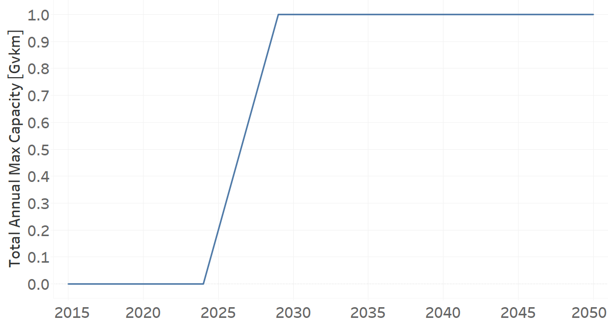

Trains
=====================================

Train Electric for Freight (new)
+++++++++
+-------------------------------------------------+-------+--------------+--------------+--------------+--------------+
| .. figure:: img/TRXTRAIELEFRE.jpg                                                                                   |
|    :align:   center                                                                                                 |
|    :width:   500 px                                                                                                 |
+-------------------------------------------------+-------+--------------+--------------+--------------+--------------+
| Set codification:                                       |TRXTRAIELEFRE02                                            |
+-------------------------------------------------+-------+--------------+--------------+--------------+--------------+
| Description:                                            |Train Electric for Freight (new)                           |
+-------------------------------------------------+-------+--------------+--------------+--------------+--------------+
| Set:                                                    |Technology                                                 |
+-------------------------------------------------+-------+--------------+--------------+--------------+--------------+
| Parameter                                       | Unit  | 2020         | 2030         | 2040         |  2050        |
+=================================================+=======+==============+==============+==============+==============+
| CapitalCost[r,t,y] (NDP)                        |M$/Gvkm| 0            | 0            | 0            | 0            |
+-------------------------------------------------+-------+--------------+--------------+--------------+--------------+
| InputActivityRatio[r,t,f,m,y] (Electricity for  | Gpkm/ | 0.4          | 0.4          | 0.4          | 0.4          |
| Heavy Freight Transport)                        | Gvkm  |              |              |              |              |
+-------------------------------------------------+-------+--------------+--------------+--------------+--------------+
| OperationalLife[r,t]                            | Years | 50           | 50           | 50           | 50           |
+-------------------------------------------------+-------+--------------+--------------+--------------+--------------+
| OutputActivityRatio[r,t,f,m,y] (Transport Demand| Gpkm/ | 1            | 1            | 1            | 1            |
| Freight Heavy) (NDP)                            | Gvkm  |              |              |              |              |
+-------------------------------------------------+-------+--------------+--------------+--------------+--------------+
| TotalAnnualMaxCapacity[r,t,y] (NDP)             |  Gvkm | 0            | 0.99         | 2.36         | 4.1          |
+-------------------------------------------------+-------+--------------+--------------+--------------+--------------+
| TotalAnnualMinCapacity[r,t,y] (NDP)             |  Gvkm | 0            | 0.99         | 2.36         | 4.1          |
+-------------------------------------------------+-------+--------------+--------------+--------------+--------------+
| TotalTechnologyAnnualActivityLowerLimit[r,t,y]  | Gvkm  | 0            | 0.99         | 2.36         | 4.1          |
| (NDP)                                           |       |              |              |              |              |
+-------------------------------------------------+-------+--------------+--------------+--------------+--------------+

CapitalCost[r,t,y]
---------

The figure 1 shows the Capital Cost for TRXTRAIELEFRE02, for the NDP scenario.

   
   *Figure 1) Capital Cost for TRXTRAIELEFRE02 for the NDP scenario.*
   

InputActivityRatio[r,t,f,m,y]
---------
The equation (1) shows the Input Activity Ratio for TRXTRAIELEFRE02, for every scenario and associated to the fuel Electricity for Heavy Freight Transport.

InputActivityRatio=0.4   [Gpkm/Gvkm]   (1)

   
OperationalLife[r,t]
---------
The equation (2) shows the Operational Life for TRXTRAIELEFRE02, for every scenario.

OperationalLife=50 Years   (2)

   
OutputActivityRatio[r,t,f,m,y]
---------
The equation (3) shows the Output Activity Ratio for TRXTRAIELEFRE02, for the NDP scenario and associated to the fuel Transport Demand Freight Heavy.

OutputActivityRatio=1 [Gpkm/Gvkm]   (3)

   
TotalAnnualMaxCapacity[r,t,y]
---------
The figure 2 shows the Total Annual Max Capacity for TRXTRAIELEFRE02, for the NDP scenario.

.. figure:: img/TRXTRAIELEFRE02_TotalAnnualMaxCapacity_NDP.png
   :align:   center
   :width:   700 px
   
   *Figure 2) Total Annual Max Capacity for TRXTRAIELEFRE02 for the NDP scenario.*
   

   
TotalAnnualMinCapacity[r,t,y]
---------
The figure 2 shows the Total Annual Min Capacity for TRXTRAIELEFRE02, for the NDP scenario.

   
   *Figure 2) Total Annual Min Capacity for TRXTRAIELEFRE02 for the NDP scenario.*
   
  
   
TotalTechnologyAnnualActivityLowerLimit[r,t,y]
---------
The figure 4 shows the Total Technology Annual Activity Lower Limit for TRXTRAIELEFRE02, for the NDP scenario.

   
   *Figure 4) Total Technology Annual Activity Lower Limit for TRXTRAIELEFRE02 for the NDP scenario.*

Train Diesel (existing)
+++++++++

+-------------------------------------------------+-------+--------------+--------------+--------------+--------------+
| .. figure:: img/TRXTRAINDSL.jpg                                                                                     |
|    :align:   center                                                                                                 |
|    :width:   500 px                                                                                                 |
+-------------------------------------------------+-------+--------------+--------------+--------------+--------------+
| Set codification:                                       |TRXTRAINDSL01                                              |
+-------------------------------------------------+-------+--------------+--------------+--------------+--------------+
| Description:                                            |Train Diesel (existing)                                    |
+-------------------------------------------------+-------+--------------+--------------+--------------+--------------+
| Set:                                                    |Technology                                                 |
+-------------------------------------------------+-------+--------------+--------------+--------------+--------------+
| Parameter                                       | Unit  | 2020         | 2030         | 2040         |  2050        |
+=================================================+=======+==============+==============+==============+==============+
| InputActivityRatio[r,t,f,m,y] (Diesel for       | PJ/   | 1            | 1            | 1            | 1            |
| public transport)                               | Gvkm  |              |              |              |              |
+-------------------------------------------------+-------+--------------+--------------+--------------+--------------+
| OperationalLife[r,t]                            | Years | 20           | 20           | 20           | 20           |
+-------------------------------------------------+-------+--------------+--------------+--------------+--------------+
| OutputActivityRatio[r,t,f,m,y] (                | PJ/   | 1            | 1            | 1            | 1            |
| Transport in Rail)                              | Gvkm  |              |              |              |              |
+-------------------------------------------------+-------+--------------+--------------+--------------+--------------+
| ResidualCapacity[r,t,y]                         | Gvkm  | 0.06         | 0.02         | 0.01         | 0            |
+-------------------------------------------------+-------+--------------+--------------+--------------+--------------+
| TotalAnnualMaxCapacity[r,t,y]                   | Gvkm  | 0.06         | 0.02         | 0.01         | 0            |
+-------------------------------------------------+-------+--------------+--------------+--------------+--------------+
| TotalTechnologyAnnualActivityLowerLimit[r,t,y]  | Gvkm  | 0.06         | 0.02         | 0.01         | 0            |
|                                                 |       |              |              |              |              |
+-------------------------------------------------+-------+--------------+--------------+--------------+--------------+

   
InputActivityRatio[r,t,f,m,y]
---------
The equation (1) shows the Input Activity Ratio for TRXTRAINDSL01, for every scenario and associated to the fuel Diesel for public transport. 

InputActivityRatio=1 [PJ/Gvkm]   (1)

 
   
OperationalLife[r,t]
---------
The equation (2) shows the Operational Life for TRXTRAINDSL01, for every scenario.

OperationalLife=20 Years   (2)

 
   
OutputActivityRatio[r,t,f,m,y]
---------
The equation (3) shows the Output Activity Ratio for TRXTRAINDSL01, for every scenario and associated to the fuel Transport in Rail.

OutputActivityRatio=1 [PJ/Gvkm]   (3)

   
   
ResidualCapacity[r,t,y]
---------
The figure 1 shows the Residual Capacity for TRXTRAINDSL01, for the every scenario.

.. figure:: img/TRXTRAINDSL01_ResidualCapacity.png
   :align:   center
   :width:   700 px
   
   *Figure 1) Residual Capacity for TRXTRAINDSL01 for the every scenario.*
   
     
   
TotalAnnualMaxCapacity[r,t,y]
---------
The figure 2 shows the Total Annual Max Capacity for TRXTRAINDSL01, for the every scenario.

.. figure:: img/TRXTRAINDSL01_TotalAnnualMaxCapacity.png
   :align:   center
   :width:   700 px
   
   *Figure 2) Total Annual Max Capacity for TRXTRAINDSL01 for the every scenario.*
   

   
TotalTechnologyAnnualActivityLowerLimit[r,t,y]
---------
The figure 3 shows the Total Technology Annual Activity Lower Limit for TRXTRAINDSL01, for every scenario.

.. figure:: img/TRXTRAINDSL01_TotalTechnologyAnnualActivityLowerLimit.png
   :align:   center
   :width:   700 px
   
   *Figure 3) Total Technology Annual Activity Lower Limit for TRXTRAINDSL01 for every scenario.*
   

Train Diesel (new)
+++++++++

+-------------------------------------------------+-------+--------------+--------------+--------------+--------------+
| .. figure:: img/TRXTRAINDSL.jpg                                                                                     |
|    :align:   center                                                                                                 |
|    :width:   500 px                                                                                                 |
+-------------------------------------------------+-------+--------------+--------------+--------------+--------------+
| Set codification:                                       |TRXTRAINDSL02                                              |
+-------------------------------------------------+-------+--------------+--------------+--------------+--------------+
| Description:                                            |Train Diesel (new)                                         |
+-------------------------------------------------+-------+--------------+--------------+--------------+--------------+
| Set:                                                    |Technology                                                 |
+-------------------------------------------------+-------+--------------+--------------+--------------+--------------+
| Parameter                                       | Unit  | 2020         | 2030         | 2040         |  2050        |
+=================================================+=======+==============+==============+==============+==============+
| InputActivityRatio[r,t,f,m,y] (Diesel for       | PJ/   | 1            | 1            | 1            | 1            |
| public transport)                               | Gvkm  |              |              |              |              |
+-------------------------------------------------+-------+--------------+--------------+--------------+--------------+
| OperationalLife[r,t]                            | Years | 20           | 20           | 20           | 20           |
+-------------------------------------------------+-------+--------------+--------------+--------------+--------------+
| OutputActivityRatio[r,t,f,m,y] (Transport in    | PJ/   | 1            | 1            | 1            | 1            |
| Rail)                                           | Gvkm  |              |              |              |              |
+-------------------------------------------------+-------+--------------+--------------+--------------+--------------+
| ResidualCapacity[r,t,y]                         | Gvkm  | 0.2          | 0.2          | 0.2          | 0.2          |
+-------------------------------------------------+-------+--------------+--------------+--------------+--------------+
| TotalAnnualMaxCapacity[r,t,y]                   | Gvkm  | 0.2          | 0.2          | 0.2          | 0.2          |
+-------------------------------------------------+-------+--------------+--------------+--------------+--------------+
   
InputActivityRatio[r,t,f,m,y]
---------
The equation (1) shows the Input Activity Ratio for TRXTRAINDSL02, for every scenario and associated to the fuel Diesel for public transport. 

InputActivityRatio=1 [PJ/Gvkm]   (1)

   
   
OperationalLife[r,t]
---------
The equation (2) shows the Operational Life for TRXTRAINDSL02, for every scenario.

OperationalLife=20 Years   (2)

 
   
OutputActivityRatio[r,t,f,m,y]
---------
The equation (3) shows the Output Activity Ratio for TRXTRAINDSL02, for every scenario and associated to the fuel Transport in Rail.

OutputActivityRatio=1 [PJ/Gvkm]   (3)

   
   
ResidualCapacity[r,t,y]
---------
The equation (4) shows the Residual Capacity for TRXTRAINDSL02, for every scenario.

ResidualCapacity=0.2 [GW]   (4)

       
   
TotalAnnualMaxCapacity[r,t,y]
---------
The equation (5) shows the Total Annual Max Capacity for TRXTRAINDSL02, for every scenario. 

TotalAnnualMaxCapacity=0.2 [GW]   (5)
   

   
Train Electric (new)
+++++++++

+-------------------------------------------------+-------+--------------+--------------+--------------+--------------+
| .. figure:: img/TRXTRAINELC.jpg                                                                                     |
|    :align:   center                                                                                                 |
|    :width:   500 px                                                                                                 |
+-------------------------------------------------+-------+--------------+--------------+--------------+--------------+
| Set codification:                                       |TRXTRAINELC02                                              |
+-------------------------------------------------+-------+--------------+--------------+--------------+--------------+
| Description:                                            |Train Electric (new)                                       |
+-------------------------------------------------+-------+--------------+--------------+--------------+--------------+
| Set:                                                    |Technology                                                 |
+-------------------------------------------------+-------+--------------+--------------+--------------+--------------+
| Parameter                                       | Unit  | 2020         | 2030         | 2040         |  2050        |
+=================================================+=======+==============+==============+==============+==============+
| CapitalCost[r,t,y] (NDP)                        |M$/Gvkm| 5491.52      | 0            | 0            | 0            |
+-------------------------------------------------+-------+--------------+--------------+--------------+--------------+
| InputActivityRatio[r,t,f,m,y] (Electricity for  | Gpkm/ | 0.3          | 0.3          | 0.3          | 0.3          |
| Public Transport)                               | Gvkm  |              |              |              |              |
+-------------------------------------------------+-------+--------------+--------------+--------------+--------------+
| OperationalLife[r,t]                            | Years | 20           | 20           | 20           | 20           |
+-------------------------------------------------+-------+--------------+--------------+--------------+--------------+
| OutputActivityRatio[r,t,f,m,y] (Transport       | Gpkm/ | 1            | 1            | 1            | 1            |
| in Rail)                                        | Gvkm  |              |              |              |              |
+-------------------------------------------------+-------+--------------+--------------+--------------+--------------+
| TotalAnnualMaxCapacity[r,t,y] (BAU)             |  Gvkm | 0            | 1            | 1            | 1            |
+-------------------------------------------------+-------+--------------+--------------+--------------+--------------+ 
| TotalAnnualMaxCapacity[r,t,y] (NDP)             |  Gvkm | 0            | 0.4444       | 1            | 1            |
+-------------------------------------------------+-------+--------------+--------------+--------------+--------------+
| TotalAnnualMinCapacity[r,t,y] (NDP)             |  Gvkm | 0            | 0.4444       | 1            | 1            |
+-------------------------------------------------+-------+--------------+--------------+--------------+--------------+
| TotalTechnologyAnnualActivityLowerLimit[r,t,y]  | Gvkm  | 0            | 0.4444       | 1            | 1            |
| (NDP)                                           |       |              |              |              |              |
+-------------------------------------------------+-------+--------------+--------------+--------------+--------------+

CapitalCost[r,t,y]
---------

The figure 1 shows the Capital Cost for TRXTRAINELC02, for NDP scenario.

.. figure:: img/TRXTRAINELC02_CapitalCost_NDP.png
   :align:   center
   :width:   700 px
   
   *Figure 1) Capital Cost for TRXTRAINELC02 for NDP scenario.*
   

InputActivityRatio[r,t,f,m,y]
---------
The equation (1) shows the Input Activity Ratio for TRXTRAINELC02, for every scenario and associated to the fuel Electricity for Public Transport.

InputActivityRatio=0.3   [Gpkm/Gvkm]   (1)

   
OperationalLife[r,t]
---------
The equation (2) shows the Operational Life for TRXTRAINELC02, for every scenario.

OperationalLife=20 Years   (2)

 
   
OutputActivityRatio[r,t,f,m,y]
---------
The equation (3) shows the Output Activity Ratio for TRXTRAINELC02, for NDP scenario and associated to the fuel Transport in Rail.

OutputActivityRatio=1 [Gpkm/Gvkm]   (3)

   
TotalAnnualMaxCapacity[r,t,y]
---------

The figure 2 shows the Total Annual Max Capacity for TRXTRAINELC02, for the BAU scenario.

   
   *Figure 2) Total Annual Max Capacity for TRXTRAINELC02 for the BAU scenario.*

The figure 3 shows the Total Annual Max Capacity for TRXTRAINELC02, for the NDP scenario.

   
   *Figure 3) Total Annual Max Capacity for TRXTRAINELC02 for the NDP scenario.*
   

   
TotalAnnualMinCapacity[r,t,y]
---------
The figure 2 shows the Total Annual Min Capacity for TRXTRAINELC02, for the NDP scenario.

   
   *Figure 2) Total Annual Min Capacity for TRXTRAINELC02 for the NDP scenario.*
   
   
   
TotalTechnologyAnnualActivityLowerLimit[r,t,y]
---------
The figure 4 shows the Total Technology Annual Activity Lower Limit for TRXTRAINELC02, for the NDP scenario.

   
   *Figure 4) Total Technology Annual Activity Lower Limit for TRXTRAINELC02 for NDP scenario.*

