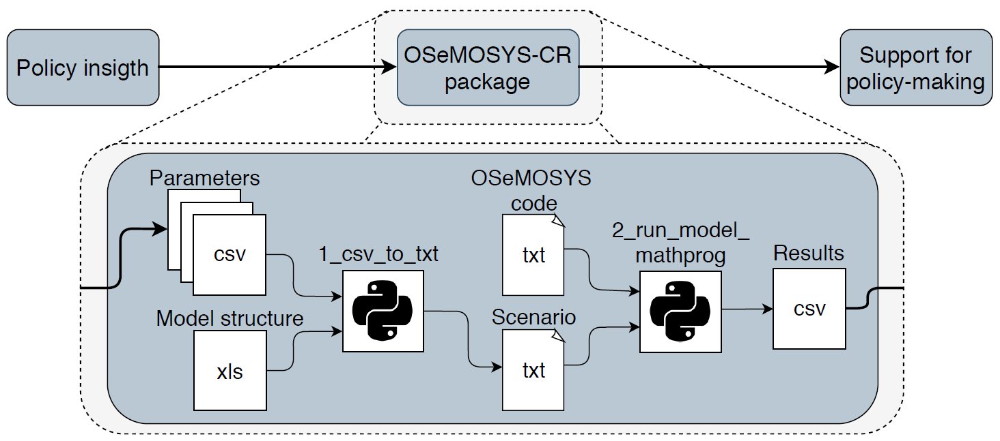
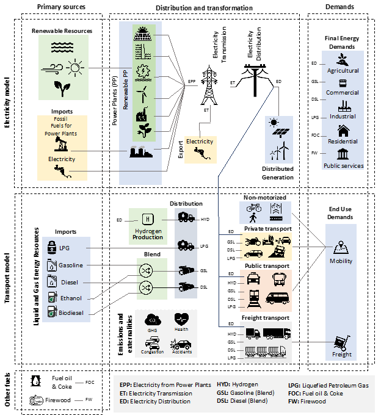
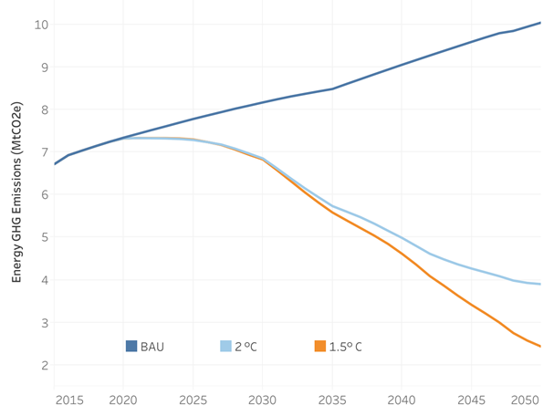

# Summary

Costa Rica has excelled for nature protection and leadership to fight climate change. With an almost 100% renewable electricity matrix and forest coverage of approximately 60%, the country is moving towards the transformation of the transport sector as its third major step towards decarbonisation by 2050, which accounted in 2015 for about 44% of the total Greenhouses Gases (GHG) emission of the country [@MinisteriodeAmbienteyEnergia2019]. In this context, the University of Costa Rica, the KTH Royal Institute of Technology (Sweden), and the Climate Change Directorate worked together using data available in the country to develop the OSeMOSYS-CR model which currently supports national energy-related climate change policy. This work emerged as part of the Deep Decarbonisation Pathways Project in Latin America and the Caribbean (DDPP-LAC), which is coordinated by the Institute for Sustainable Development and International Relations and the Inter-American Development Bank [@IDB2019]. As a result, the model helped to formulate and analyse the National Decarbonisation Plan of Costa Rica (NDP) [@MINAE2019], which is the long-term low-level GHG strategy of the country.

``OSeMOSYS-CR`` is an Energy System Optimization Model (ESOM) based on the Open Source energy Modelling System (OSeMOSYS)  [@HOWELLS20115850;@GARDUMI2018209] that follows a bottom-up approach, from energy sources to demands, to establishing the most cost-effective technological transitions towards a deep decarbonisation in the energy sector of Costa Rica. The model focuses on the transport sector (passenger and freight) and its relationship with the electricity system. Alternatives energy carriers such as hydrogen and biofuels are also considered. The use of these fuels leads to the inclusion of technologies such as electric vehicles, hydrogen-fueled heavy freight and the electric train. ``OSeMOSYS-CR`` was built on a countrywide scale using available national data. Annual weather patterns were also incorporated in the analysis by considering the effect of rainy and dry months.

The modelling framework is executed using Python. The process starts with the scenario building, which is done through a data structure that quantifies the information generated by stakeholders as inputs for the model. The modelling process begins with comma-separated values (CSV) files containing the parameters of the model (editable if needed). A first module translates the CSV file to a text file (txt) suitable to GNU MathProg versions, which should then be executed with the OSeMOSYS code. A second module executes the linear optimisation process using the GLPK package and generates a CSV output file that allows visualisation of results. The results provide inputs for the generation of actions, government laws, executive orders or international commitments. Figure 1 presents a simplified representation of the general process. The release of ``OSeMOSYS-CR`` pursues to support the transparency of the model and the collaboration through knowledge transfer with other teams. The model can serve as a framework for future developers, interested in the implementation of ESOMs.

# Model Structure and Strategies 

The model combines more than one hundred commodities and two hundred technologies. A simple representation of the model, including primary energy supply (i.e., renewable, fossil fuel imports, biomass, and electricity imports), groups of technologies (i.e., power plants, vehicles, and distribution systems), energy demands by sector (i.e., industrial, residential, commercial and agricultural) and transport requirements (i.e., passenger and cargo) is shown in Figure 2. The model includes a module for co-benefits related to the consumption of fossil fuels which was used to calculate the effects on health, congestion, and the number of accidents in a cost-benefit assessment of the NDP [@Quiros-Tortos2020]. The parametrisation of technologies includes costs, emissions, activity level, and capacities, according to their characteristics.

Three different pre-built scenarios included in the repository: a business-as-usual (BAU) scenario and two decarbonisation scenarios. The BAU scenario represents the evolution of the energy sector based on historical trends and serves as a benchmark for testing mitigation strategies. The two decarbonisation scenarios, one consistent with the 2°C (SR20) and the other with the 1.5°C (SR15) targets, incorporate selected mitigation strategies already being discussed in the country . 

The following images presents a graphic representation of the scenarios. Figure 3 shows the emission trajectories and the corresponding 2050 carbon intensity for the three scenarios [[Godinez-ZamoraGuido2020]]. The 2°C and 1.5°C scenarios lead to the corresponding target emissions by 2050. Figure 3 highlights that both decarbonisation scenarios lead to a cleaner system by 2050 with an increased efficiency.

Ongoing projects, which aim at exploring further the use and applicability of the model, include research on energy storage modelling, the deployment of robust decision-making methodologies, and the modelling of complementary systems such as land and water, to analyse the linkages between them and the energy sector. Such efforts will add robustness and increase the coverage (reach) of the model, expanding its use to multiple applications and widening its use to multiple policy domains. The developments under preparation will then be submitted to share with experts and undergo a revision and validation process with stakeholders. 

# Acknowledgements

This work was funded by the Interamerican Development Bank and the University of Costa Rica. The authors want to recognise the contribution from many stakeholders in Costa Rica in providing valuable data and discussing different aspects of the model that led to a robust model currently available in the country.

# References
